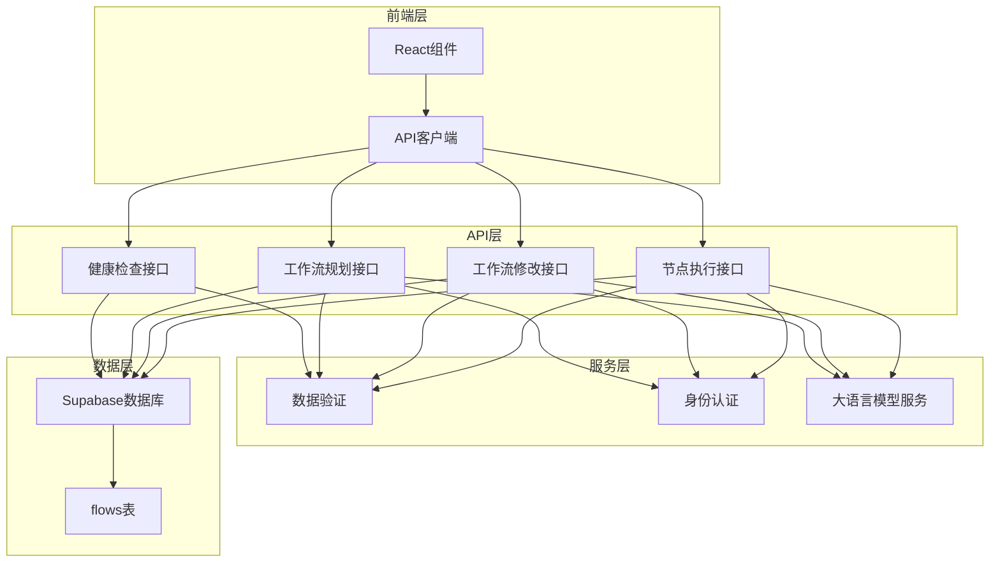
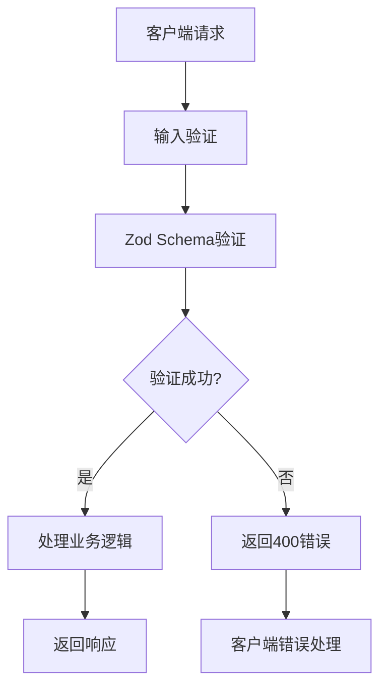
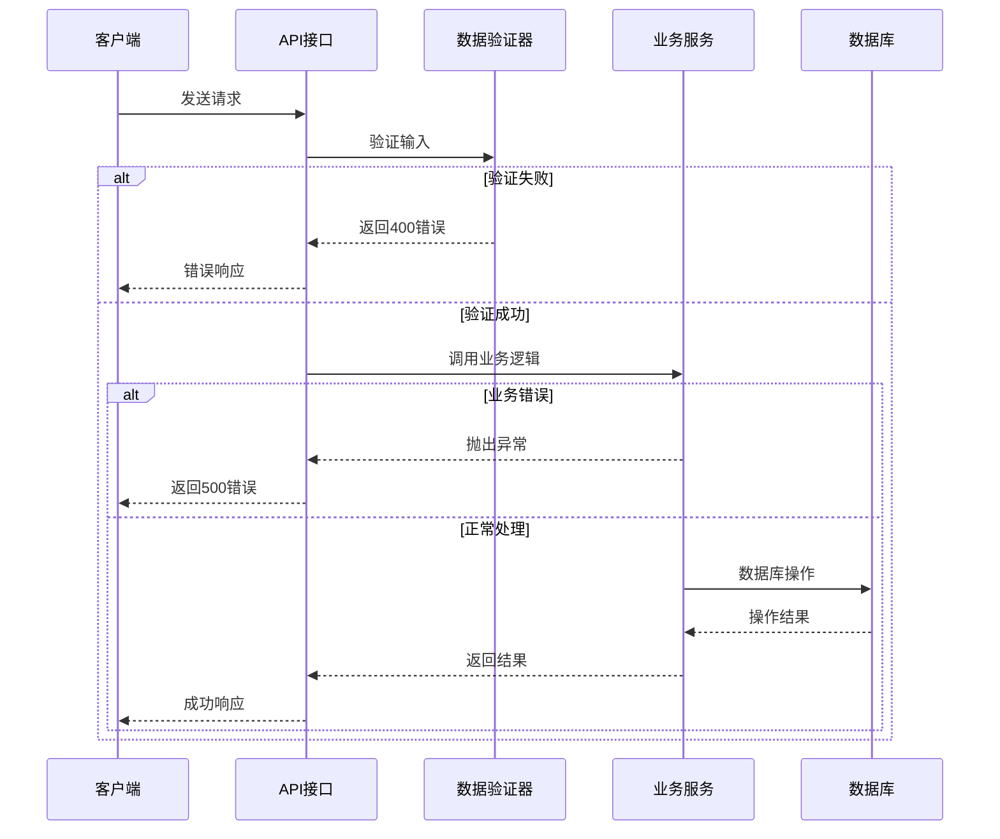

# API接口文档

<cite>
**本文档中引用的文件**
- [src/app/api/health/route.ts](file://src/app/api/health/route.ts)
- [src/app/api/plan/route.ts](file://src/app/api/plan/route.ts)
- [src/app/api/modify-flow/route.ts](file://src/app/api/modify-flow/route.ts)
- [src/app/api/run-node/route.ts](file://src/app/api/run-node/route.ts)
- [src/lib/supabase.ts](file://src/lib/supabase.ts)
- [src/utils/validation.ts](file://src/utils/validation.ts)
- [src/services/flowAPI.ts](file://src/services/flowAPI.ts)
- [src/types/database.ts](file://src/types/database.ts)
- [package.json](file://package.json)
</cite>

## 目录
1. [简介](#简介)
2. [项目架构概览](#项目架构概览)
3. [环境配置](#环境配置)
4. [API接口详情](#api接口详情)
5. [数据验证与安全](#数据验证与安全)
6. [错误处理机制](#错误处理机制)
7. [客户端集成指南](#客户端集成指南)
8. [最佳实践建议](#最佳实践建议)

## 简介

Flash Flow SaaS 是一个基于Next.js构建的工作流自动化平台，提供了完整的RESTful API接口用于工作流的管理、规划和执行。该系统采用现代化的技术栈，支持多种大语言模型提供商，并通过Supabase进行数据持久化。

### 核心功能特性
- **工作流规划**：基于自然语言描述自动生成工作流设计
- **工作流修改**：动态调整现有工作流的结构和配置
- **节点执行**：独立执行工作流中的各个节点
- **健康监控**：系统状态检查和数据库连接验证
- **多模型支持**：OpenAI和豆包（DouBao）模型兼容

## 项目架构概览



**图表来源**
- [src/app/api/health/route.ts](file://src/app/api/health/route.ts#L1-L52)
- [src/app/api/plan/route.ts](file://src/app/api/plan/route.ts#L1-L123)
- [src/app/api/modify-flow/route.ts](file://src/app/api/modify-flow/route.ts#L1-L104)
- [src/app/api/run-node/route.ts](file://src/app/api/run-node/route.ts#L1-L66)

## 环境配置

系统需要以下环境变量来正常运行：

| 环境变量 | 类型 | 必需 | 描述 |
|---------|------|------|------|
| `NEXT_PUBLIC_SUPABASE_URL` | String | 是 | Supabase项目URL |
| `NEXT_PUBLIC_SUPABASE_ANON_KEY` | String | 是 | Supabase匿名访问密钥 |
| `SUPABASE_SERVICE_ROLE_KEY` | String | 否 | Supabase服务角色密钥 |
| `OPENAI_API_KEY` | String | 否 | OpenAI API密钥 |
| `DOUBAO_API_KEY` | String | 否 | 豆包API密钥 |
| `DOUBAO_MODEL` | String | 否 | 豆包模型名称，默认"doubao-pro-128k" |
| `LLM_PROVIDER` | String | 否 | 大语言模型提供商，可选"openai"或"doubao" |

**节来源**
- [src/lib/supabase.ts](file://src/lib/supabase.ts#L4-L17)
- [src/app/api/plan/route.ts](file://src/app/api/plan/route.ts#L51-L52)
- [src/app/api/run-node/route.ts](file://src/app/api/run-node/route.ts#L13-L13)

## API接口详情

### 1. 健康检查接口

#### 接口地址
`GET /api/health`

#### 功能描述
健康检查接口用于验证系统的整体运行状态，包括环境变量配置、数据库连接、认证状态和核心功能模块的可用性。

#### 请求参数
无需请求参数

#### 响应格式
```json
{
  "env_ok": true,
  "connected": true,
  "auth_ok": true,
  "table_ok": true,
  "error": null
}
```

#### 响应字段说明

| 字段 | 类型 | 描述 |
|------|------|------|
| `env_ok` | Boolean | 环境变量配置是否完整 |
| `connected` | Boolean | 数据库连接状态 |
| `auth_ok` | Boolean | 认证服务可用性 |
| `table_ok` | Boolean | 核心表结构验证结果 |
| `error` | String \| null | 错误信息（如果有） |

#### 错误码
- **200**: 健康检查完成
- **500**: 内部服务器错误

#### curl示例
```bash
curl -X GET "https://your-domain.com/api/health" \
  -H "Content-Type: application/json"
```

#### 客户端调用模式
```javascript
async function checkHealth() {
  try {
    const response = await fetch('/api/health');
    const data = await response.json();
    
    if (data.env_ok && data.connected && data.auth_ok && data.table_ok) {
      console.log('系统健康状态良好');
      return true;
    } else {
      console.error('系统异常:', data.error);
      return false;
    }
  } catch (error) {
    console.error('健康检查失败:', error);
    return false;
  }
}
```

**节来源**
- [src/app/api/health/route.ts](file://src/app/api/health/route.ts#L4-L51)

### 2. 工作流规划接口

#### 接口地址
`POST /api/plan`

#### 功能描述
根据用户提供的自然语言描述，使用大语言模型自动生成工作流的设计方案，包括节点定义和连接关系。

#### 请求参数

| 参数名 | 类型 | 必需 | 描述 |
|--------|------|------|------|
| `prompt` | String | 是 | 工作流需求描述，最大1000字符 |
| `ownerId` | String | 否 | 所有者ID（后端忽略，使用认证用户） |

#### 请求示例
```json
{
  "prompt": "创建一个处理客户订单的工作流，包括验证订单、计算价格、发送确认邮件的步骤",
  "ownerId": "user123"
}
```

#### 响应格式
```json
{
  "title": "客户订单处理流程",
  "nodes": [
    {
      "id": "input-1",
      "type": "input",
      "position": {"x": 100, "y": 100},
      "data": {"label": "接收订单"}
    },
    {
      "id": "llm-2",
      "type": "llm",
      "position": {"x": 300, "y": 100},
      "data": {
        "label": "验证订单",
        "model": "gpt-4o-mini",
        "temperature": 0.2,
        "systemPrompt": "验证订单的有效性"
      }
    },
    {
      "id": "output-3",
      "type": "output",
      "position": {"x": 500, "y": 100},
      "data": {"label": "输出结果"}
    }
  ],
  "edges": [
    {
      "id": "edge-1",
      "source": "input-1",
      "target": "llm-2"
    },
    {
      "id": "edge-2",
      "source": "llm-2",
      "target": "output-3"
    }
  ]
}
```

#### 支持的节点类型

| 节点类型 | 描述 | 必需字段 |
|----------|------|----------|
| `input` | 输入节点 | `id`, `label`, `text` |
| `llm` | 大语言模型节点 | `id`, `label`, `model`, `temperature`, `systemPrompt` |
| `rag` | 检索增强生成节点 | `id`, `label`, `files` |
| `http` | HTTP请求节点 | `id`, `label`, `method`, `url` |
| `output` | 输出节点 | `id`, `label`, `text` |

#### 错误码
- **200**: 成功返回工作流规划结果
- **400**: 请求参数无效
- **500**: 内部服务器错误

#### curl示例
```bash
curl -X POST "https://your-domain.com/api/plan" \
  -H "Content-Type: application/json" \
  -d '{
    "prompt": "创建一个处理客户订单的工作流，包括验证订单、计算价格、发送确认邮件的步骤",
    "ownerId": "user123"
  }'
```

#### 客户端调用模式
```javascript
async function planWorkflow(prompt) {
  try {
    const response = await fetch('/api/plan', {
      method: 'POST',
      headers: {
        'Content-Type': 'application/json'
      },
      body: JSON.stringify({ prompt })
    });
    
    if (!response.ok) {
      throw new Error(`HTTP error! status: ${response.status}`);
    }
    
    const data = await response.json();
    return data;
  } catch (error) {
    console.error('工作流规划失败:', error);
    return { nodes: [], edges: [] };
  }
}
```

**节来源**
- [src/app/api/plan/route.ts](file://src/app/api/plan/route.ts#L6-L122)
- [src/utils/validation.ts](file://src/utils/validation.ts#L3-L5)

### 3. 工作流修改接口

#### 接口地址
`POST /api/modify-flow`

#### 功能描述
根据用户对现有工作流的修改需求，使用大语言模型生成具体的修改指令，支持添加、删除、修改和重新排序节点等操作。

#### 请求参数

| 参数名 | 类型 | 必需 | 描述 |
|--------|------|------|------|
| `prompt` | String | 是 | 修改需求描述 |
| `currentNodes` | Array | 是 | 当前工作流节点列表 |
| `currentEdges` | Array | 是 | 当前工作流连接列表 |

#### 请求示例
```json
{
  "prompt": "在LLM节点和HTTP节点之间添加一个RAG节点",
  "currentNodes": [
    {
      "id": "llm-1",
      "type": "llm",
      "data": { "label": "数据处理" }
    },
    {
      "id": "http-2", 
      "type": "http",
      "data": { "label": "API调用" }
    }
  ],
  "currentEdges": [
    {
      "id": "edge-1",
      "source": "llm-1", 
      "target": "http-2"
    }
  ]
}
```

#### 响应格式
```json
{
  "action": "add",
  "nodeType": "rag",
  "nodeData": {
    "label": "知识检索",
    "files": []
  },
  "target": "llm-1",
  "position": "after"
}
```

#### 支持的修改动作

| 动作类型 | 描述 | 必需字段 |
|----------|------|----------|
| `add` | 添加新节点 | `action`, `nodeType`, `nodeData`, `target`, `position` |
| `delete` | 删除节点 | `action`, `target` |
| `modify` | 修改节点属性 | `action`, `target`, `changes` |
| `reorder` | 调整节点顺序 | `action`, `target`, `position`, `referenceNode` |

#### 错误码
- **200**: 成功返回修改指令
- **400**: 请求参数缺失
- **500**: 内部服务器错误

#### curl示例
```bash
curl -X POST "https://your-domain.com/api/modify-flow" \
  -H "Content-Type: application/json" \
  -d '{
    "prompt": "在LLM节点和HTTP节点之间添加一个RAG节点",
    "currentNodes": [...],
    "currentEdges": [...]
  }'
```

#### 客户端调用模式
```javascript
async function modifyWorkflow(currentNodes, currentEdges, prompt) {
  try {
    const response = await fetch('/api/modify-flow', {
      method: 'POST',
      headers: {
        'Content-Type': 'application/json'
      },
      body: JSON.stringify({
        prompt,
        currentNodes,
        currentEdges
      })
    });
    
    if (!response.ok) {
      throw new Error(`HTTP error! status: ${response.status}`);
    }
    
    const data = await response.json();
    return data;
  } catch (error) {
    console.error('工作流修改失败:', error);
    return { action: 'unknown' };
  }
}
```

**节来源**
- [src/app/api/modify-flow/route.ts](file://src/app/api/modify-flow/route.ts#L4-L103)

### 4. 节点执行接口

#### 接口地址
`POST /api/run-node`

#### 功能描述
独立执行工作流中的某个节点，支持多种大语言模型提供商，可以处理字符串或复杂对象作为输入。

#### 请求参数

| 参数名 | 类型 | 必需 | 描述 |
|--------|------|------|------|
| `model` | String | 是 | 使用的模型名称 |
| `systemPrompt` | String | 否 | 系统提示词 |
| `input` | Any | 否 | 输入数据，可以是字符串或对象 |
| `temperature` | Number | 否 | 温度值，范围[0,1] |

#### 请求示例
```json
{
  "model": "gpt-4o-mini",
  "systemPrompt": "你是一个数据分析师，请分析以下数据",
  "input": {
    "sales": [100, 200, 150, 300],
    "region": "North America"
  },
  "temperature": 0.3
}
```

#### 响应格式
```json
{
  "response": "数据分析结果：总销售额为750，增长率为50%"
}
```

#### 支持的模型提供商

| 提供商 | 默认模型 | 特殊处理 |
|---------|----------|----------|
| `openai` | `gpt-4o-mini` | 直接使用OpenAI SDK |
| `doubao` | `doubao-pro-128k` | 使用豆包API端点 |

#### 错误码
- **200**: 成功返回执行结果
- **400**: 模型参数缺失
- **500**: 执行失败

#### curl示例
```bash
curl -X POST "https://your-domain.com/api/run-node" \
  -H "Content-Type: application/json" \
  -d '{
    "model": "gpt-4o-mini",
    "systemPrompt": "你是一个翻译助手",
    "input": "Hello, world!",
    "temperature": 0.1
  }'
```

#### 客户端调用模式
```javascript
async function runNode(model, systemPrompt, input, temperature = 0.7) {
  try {
    const response = await fetch('/api/run-node', {
      method: 'POST',
      headers: {
        'Content-Type': 'application/json'
      },
      body: JSON.stringify({
        model,
        systemPrompt,
        input,
        temperature
      })
    });
    
    if (!response.ok) {
      throw new Error(`HTTP error! status: ${response.status}`);
    }
    
    const data = await response.json();
    return data.response;
  } catch (error) {
    console.error('节点执行失败:', error);
    return '';
  }
}
```

**节来源**
- [src/app/api/run-node/route.ts](file://src/app/api/run-node/route.ts#L4-L65)

## 数据验证与安全

### 输入验证机制

系统采用Zod库实现强类型验证，确保所有API请求的数据格式正确性和安全性。



**图表来源**
- [src/utils/validation.ts](file://src/utils/validation.ts#L3-L28)

### 验证规则

#### 工作流规划验证
- `prompt`: 非空字符串，最大1000字符
- `ownerId`: 可选字符串（后端忽略）

#### 节点数据验证
- `id`: 必需字符串
- `type`: 枚举类型（input, llm, rag, http, output, branch）
- `position`: 包含x, y坐标的对象
- `data`: 任意JSON对象

#### 边缘数据验证
- `id`: 必需字符串
- `source`: 必需字符串（源节点ID）
- `target`: 必需字符串（目标节点ID）

**节来源**
- [src/utils/validation.ts](file://src/utils/validation.ts#L3-L28)

### 认证机制

系统使用Supabase进行用户认证，虽然当前API路由中存在认证逻辑的注释，但实际实现主要依赖于环境变量和数据验证。

**节来源**
- [src/app/api/plan/route.ts](file://src/app/api/plan/route.ts#L17-L33)

## 错误处理机制

### 错误响应格式

所有API接口都遵循统一的错误响应格式：

```json
{
  "error": "错误描述",
  "details": "详细错误信息（可选）"
}
```

### 错误分类

| 错误类型 | HTTP状态码 | 描述 |
|----------|------------|------|
| 输入验证错误 | 400 | 请求参数不符合验证规则 |
| 认证失败 | 401 | 用户未认证或认证过期 |
| 权限不足 | 403 | 用户没有操作权限 |
| 资源不存在 | 404 | 请求的资源不存在 |
| 服务器内部错误 | 500 | 服务器处理过程中发生错误 |

### 错误处理流程



**图表来源**
- [src/app/api/plan/route.ts](file://src/app/api/plan/route.ts#L11-L14)
- [src/app/api/run-node/route.ts](file://src/app/api/run-node/route.ts#L62-L64)

## 客户端集成指南

### 基础集成步骤

1. **安装依赖**
```bash
npm install @supabase/supabase-js openai
```

2. **配置环境变量**
```javascript
// .env.local
NEXT_PUBLIC_SUPABASE_URL=https://your-supabase-url.supabase.co
NEXT_PUBLIC_SUPABASE_ANON_KEY=your-anon-key
OPENAI_API_KEY=your-openai-key
```

3. **基础客户端封装**
```javascript
class FlashFlowClient {
  constructor() {
    this.baseUrl = '/api';
  }
  
  async healthCheck() {
    const response = await fetch(`${this.baseUrl}/health`);
    return response.json();
  }
  
  async planWorkflow(prompt) {
    const response = await fetch(`${this.baseUrl}/plan`, {
      method: 'POST',
      headers: { 'Content-Type': 'application/json' },
      body: JSON.stringify({ prompt })
    });
    return response.json();
  }
  
  async modifyWorkflow(nodes, edges, prompt) {
    const response = await fetch(`${this.baseUrl}/modify-flow`, {
      method: 'POST',
      headers: { 'Content-Type': 'application/json' },
      body: JSON.stringify({ currentNodes: nodes, currentEdges: edges, prompt })
    });
    return response.json();
  }
  
  async runNode(model, systemPrompt, input, temperature = 0.7) {
    const response = await fetch(`${this.baseUrl}/run-node`, {
      method: 'POST',
      headers: { 'Content-Type': 'application/json' },
      body: JSON.stringify({ model, systemPrompt, input, temperature })
    });
    return response.json();
  }
}
```

### 高级集成模式

#### 工作流设计器集成
```javascript
class WorkflowDesigner {
  constructor(client) {
    this.client = client;
    this.currentWorkflow = { nodes: [], edges: [] };
  }
  
  async generateWorkflow(description) {
    try {
      const result = await this.client.planWorkflow(description);
      this.currentWorkflow = result;
      return result;
    } catch (error) {
      console.error('生成工作流失败:', error);
      return { nodes: [], edges: [] };
    }
  }
  
  async modifyCurrentWorkflow(modification) {
    try {
      const instruction = await this.client.modifyWorkflow(
        this.currentWorkflow.nodes,
        this.currentWorkflow.edges,
        modification
      );
      
      // 应用修改指令到当前工作流
      this.applyModification(instruction);
      return instruction;
    } catch (error) {
      console.error('修改工作流失败:', error);
      return { action: 'unknown' };
    }
  }
  
  applyModification(instruction) {
    // 实现修改应用逻辑
    switch (instruction.action) {
      case 'add':
        // 添加节点逻辑
        break;
      case 'delete':
        // 删除节点逻辑
        break;
      case 'modify':
        // 修改节点逻辑
        break;
      case 'reorder':
        // 重新排序逻辑
        break;
    }
  }
}
```

#### 实时节点执行集成
```javascript
class NodeExecutor {
  constructor(client) {
    this.client = client;
    this.executionQueue = [];
    this.isExecuting = false;
  }
  
  async executeNode(node, inputData) {
    try {
      const response = await this.client.runNode(
        node.data.model,
        node.data.systemPrompt,
        inputData,
        node.data.temperature
      );
      
      return response;
    } catch (error) {
      console.error('节点执行失败:', error);
      return { error: error.message };
    }
  }
  
  async executeWorkflow(workflow) {
    const results = {};
    
    for (const node of workflow.nodes) {
      // 获取上游节点结果
      const upstreamResults = this.getUpstreamResults(node, results);
      
      // 执行节点
      const result = await this.executeNode(node, upstreamResults);
      results[node.id] = result;
    }
    
    return results;
  }
  
  getUpstreamResults(node, results) {
    // 实现获取上游节点结果的逻辑
    return {};
  }
}
```

### 错误恢复策略

```javascript
class RetryHandler {
  static async withRetry(operation, maxRetries = 3, delay = 1000) {
    let lastError;
    
    for (let i = 0; i < maxRetries; i++) {
      try {
        return await operation();
      } catch (error) {
        lastError = error;
        
        if (i < maxRetries - 1) {
          await this.delay(delay * Math.pow(2, i)); // 指数退避
        }
      }
    }
    
    throw lastError;
  }
  
  static delay(ms) {
    return new Promise(resolve => setTimeout(resolve, ms));
  }
}

// 使用示例
const client = new FlashFlowClient();

try {
  const result = await RetryHandler.withRetry(
    () => client.planWorkflow("创建复杂工作流"),
    3,
    1000
  );
} catch (error) {
  console.error('多次重试后仍失败:', error);
}
```

## 最佳实践建议

### 性能优化

1. **请求缓存**
```javascript
class APICache {
  constructor(ttl = 300000) { // 5分钟
    this.cache = new Map();
    this.ttl = ttl;
  }
  
  async cachedCall(key, operation) {
    const cacheKey = JSON.stringify(key);
    const cached = this.cache.get(cacheKey);
    
    if (cached && Date.now() - cached.timestamp < this.ttl) {
      return cached.data;
    }
    
    const result = await operation();
    this.cache.set(cacheKey, { data: result, timestamp: Date.now() });
    return result;
  }
}
```

2. **批量操作**
```javascript
class BatchProcessor {
  constructor(maxBatchSize = 10, delay = 100) {
    this.batchSize = maxBatchSize;
    this.delay = delay;
    this.pendingOperations = [];
  }
  
  async addOperation(operation) {
    this.pendingOperations.push(operation);
    
    if (this.pendingOperations.length >= this.batchSize) {
      await this.processBatch();
    }
  }
  
  async processBatch() {
    const operations = this.pendingOperations.splice(0);
    await Promise.all(operations.map(op => op()));
  }
}
```

### 安全考虑

1. **输入过滤**
```javascript
function sanitizeInput(input) {
  if (typeof input === 'string') {
    return input.replace(/[<>\"']/g, '');
  }
  if (typeof input === 'object' && input !== null) {
    return JSON.parse(JSON.stringify(input));
  }
  return input;
}
```

2. **速率限制**
```javascript
class RateLimiter {
  constructor(limit = 10, interval = 60000) {
    this.limit = limit;
    this.interval = interval;
    this.requests = [];
  }
  
  async wait() {
    const now = Date.now();
    this.requests = this.requests.filter(time => now - time < this.interval);
    
    if (this.requests.length >= this.limit) {
      const oldest = this.requests[0];
      const waitTime = this.interval - (now - oldest);
      await new Promise(resolve => setTimeout(resolve, waitTime));
    }
    
    this.requests.push(now);
  }
}
```

### 监控和日志

```javascript
class APILogger {
  static logRequest(method, url, params) {
    console.log(`[${new Date().toISOString()}] ${method} ${url}`, params);
  }
  
  static logResponse(method, url, response, duration) {
    console.log(`[${new Date().toISOString()}] ${method} ${url} ✓ (${duration}ms)`, response);
  }
  
  static logError(method, url, error) {
    console.error(`[${new Date().toISOString()}] ${method} ${url} ✗`, error);
  }
}

// 使用示例
async function monitoredCall(method, url, params) {
  const startTime = Date.now();
  APILogger.logRequest(method, url, params);
  
  try {
    const response = await fetch(url, { method, body: JSON.stringify(params) });
    const data = await response.json();
    const duration = Date.now() - startTime;
    
    APILogger.logResponse(method, url, data, duration);
    return data;
  } catch (error) {
    const duration = Date.now() - startTime;
    APILogger.logError(method, url, error);
    throw error;
  }
}
```

### 测试策略

```javascript
class APITester {
  constructor(client) {
    this.client = client;
  }
  
  async runHealthCheckTests() {
    const tests = [
      {
        name: '基本健康检查',
        test: async () => {
          const result = await this.client.healthCheck();
          return result.env_ok && result.connected && result.auth_ok && result.table_ok;
        }
      },
      {
        name: '超时测试',
        test: async () => {
          const controller = new AbortController();
          const timeout = setTimeout(() => controller.abort(), 5000);
          
          try {
            const result = await this.client.healthCheck();
            clearTimeout(timeout);
            return true;
          } catch {
            clearTimeout(timeout);
            return false;
          }
        }
      }
    ];
    
    return this.runTests(tests);
  }
  
  async runWorkflowTests() {
    const tests = [
      {
        name: '工作流规划测试',
        test: async () => {
          const result = await this.client.planWorkflow('测试工作流');
          return Array.isArray(result.nodes) && Array.isArray(result.edges);
        }
      },
      {
        name: '节点执行测试',
        test: async () => {
          const result = await this.client.runNode('gpt-4o-mini', '测试', 'Hello');
          return typeof result.response === 'string' && result.response.length > 0;
        }
      }
    ];
    
    return this.runTests(tests);
  }
  
  async runTests(tests) {
    const results = [];
    
    for (const test of tests) {
      try {
        const passed = await test.test();
        results.push({ name: test.name, passed, error: null });
      } catch (error) {
        results.push({ name: test.name, passed: false, error: error.message });
      }
    }
    
    return results;
  }
}
```

通过遵循这些最佳实践，您可以构建稳定、高效且安全的Flash Flow SaaS客户端应用程序。