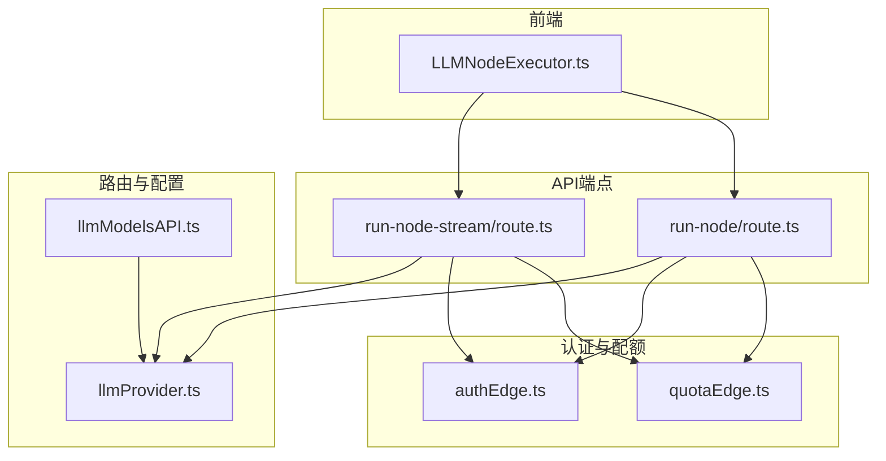
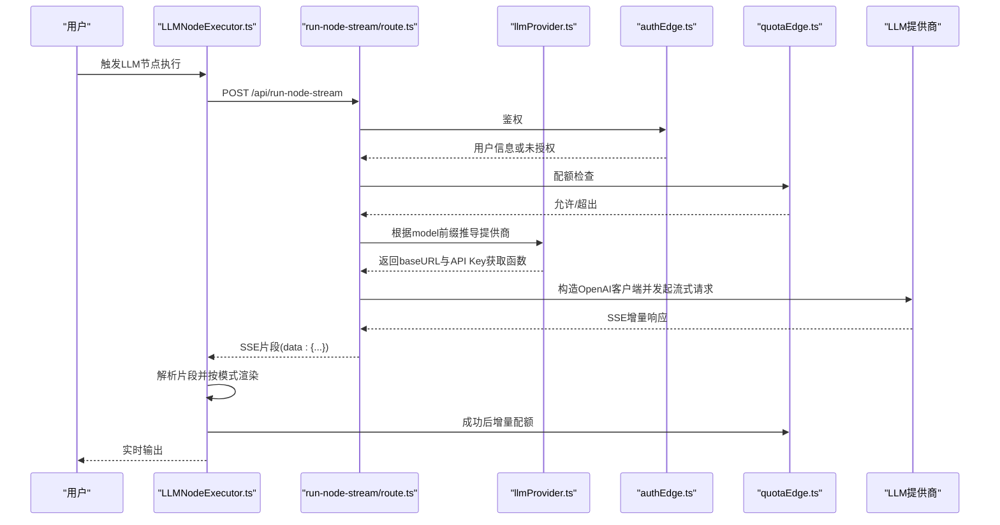
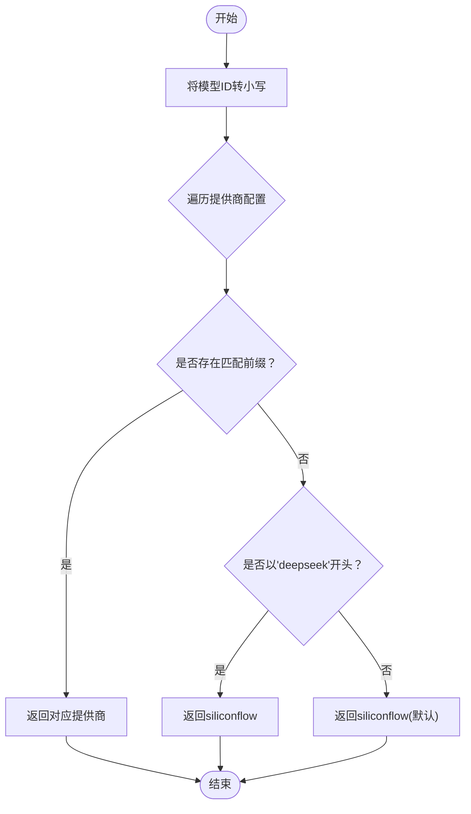
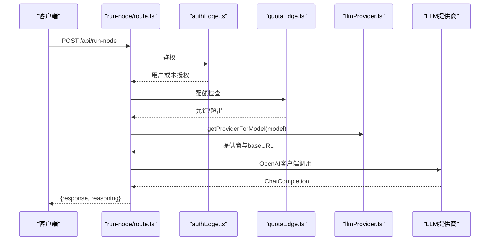
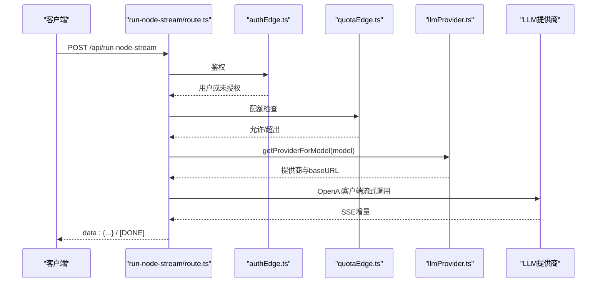
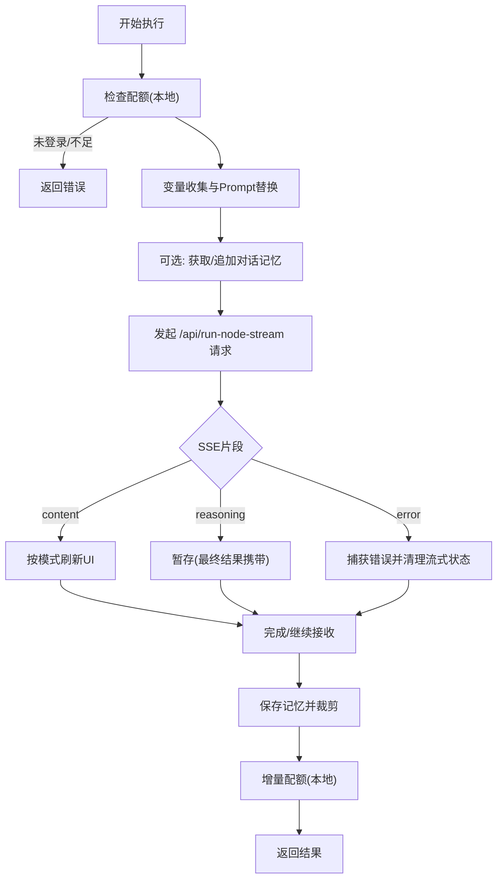
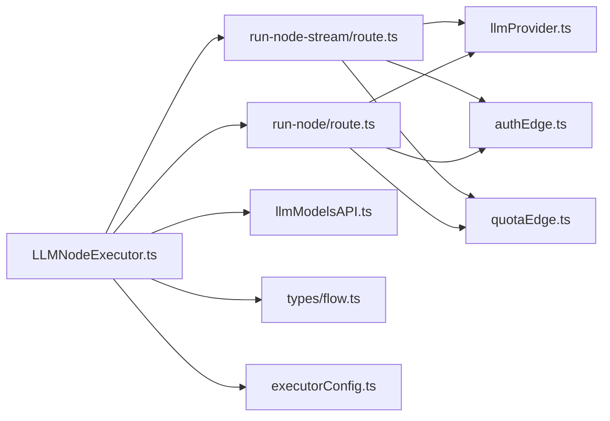

# LLM提供商路由机制

<cite>
**本文引用的文件**
- [src/lib/llmProvider.ts](file://src/lib/llmProvider.ts)
- [src/app/api/run-node/route.ts](file://src/app/api/run-node/route.ts)
- [src/app/api/run-node-stream/route.ts](file://src/app/api/run-node-stream/route.ts)
- [src/store/executors/LLMNodeExecutor.ts](file://src/store/executors/LLMNodeExecutor.ts)
- [src/services/llmModelsAPI.ts](file://src/services/llmModelsAPI.ts)
- [src/lib/authEdge.ts](file://src/lib/authEdge.ts)
- [src/lib/quotaEdge.ts](file://src/lib/quotaEdge.ts)
- [src/store/constants/executorConfig.ts](file://src/store/constants/executorConfig.ts)
- [src/types/flow.ts](file://src/types/flow.ts)
</cite>

## 目录
1. [简介](#简介)
2. [项目结构](#项目结构)
3. [核心组件](#核心组件)
4. [架构总览](#架构总览)
5. [详细组件分析](#详细组件分析)
6. [依赖关系分析](#依赖关系分析)
7. [性能考量](#性能考量)
8. [故障排查指南](#故障排查指南)
9. [结论](#结论)

## 简介
本文件聚焦于“LLM提供商路由机制”，系统性阐述如何依据模型ID前缀动态选择合适的AI服务提供商（如OpenAI、Google、DashScope、SiliconFlow、DeepSeek、Doubao等），并贯穿到非流式与流式API端点、前端执行器以及模型列表服务的完整链路。该机制确保用户在工作流中只需提供标准模型ID，系统即可自动完成鉴权、配额校验、客户端构造与请求转发，从而实现多提供商的统一接入与无缝切换。

## 项目结构
围绕LLM提供商路由的关键文件分布如下：
- 路由与执行
  - 非流式API端点：src/app/api/run-node/route.ts
  - 流式API端点：src/app/api/run-node-stream/route.ts
  - 前端执行器：src/store/executors/LLMNodeExecutor.ts
- 路由配置与模型识别
  - 提供商配置与模型前缀映射：src/lib/llmProvider.ts
  - 模型列表与默认模型：src/services/llmModelsAPI.ts
- 认证与配额
  - Edge运行时鉴权：src/lib/authEdge.ts
  - Edge运行时配额：src/lib/quotaEdge.ts
- 默认配置与类型
  - 执行器默认配置：src/store/constants/executorConfig.ts
  - 流相关类型定义：src/types/flow.ts

**图示来源**
- [src/store/executors/LLMNodeExecutor.ts](file://src/store/executors/LLMNodeExecutor.ts#L1-L120)
- [src/app/api/run-node/route.ts](file://src/app/api/run-node/route.ts#L1-L103)
- [src/app/api/run-node-stream/route.ts](file://src/app/api/run-node-stream/route.ts#L1-L135)
- [src/lib/llmProvider.ts](file://src/lib/llmProvider.ts#L1-L72)
- [src/services/llmModelsAPI.ts](file://src/services/llmModelsAPI.ts#L1-L138)
- [src/lib/authEdge.ts](file://src/lib/authEdge.ts#L1-L95)
- [src/lib/quotaEdge.ts](file://src/lib/quotaEdge.ts#L1-L160)

**章节来源**
- [src/lib/llmProvider.ts](file://src/lib/llmProvider.ts#L1-L72)
- [src/app/api/run-node/route.ts](file://src/app/api/run-node/route.ts#L1-L103)
- [src/app/api/run-node-stream/route.ts](file://src/app/api/run-node-stream/route.ts#L1-L135)
- [src/store/executors/LLMNodeExecutor.ts](file://src/store/executors/LLMNodeExecutor.ts#L1-L120)
- [src/services/llmModelsAPI.ts](file://src/services/llmModelsAPI.ts#L1-L138)
- [src/lib/authEdge.ts](file://src/lib/authEdge.ts#L1-L95)
- [src/lib/quotaEdge.ts](file://src/lib/quotaEdge.ts#L1-L160)

## 核心组件
- 提供商配置与模型前缀映射：集中定义各提供商的基础URL、API Key获取函数与模型ID前缀集合；提供根据模型ID推导提供商的算法。
- 非流式API端点：负责鉴权、配额校验、消息构造、调用OpenAI兼容客户端并返回结果。
- 流式API端点：与非流式类似，但以SSE流式返回增量内容。
- 前端执行器：在应用侧发起流式请求，解析SSE片段，按输出节点模式进行流式渲染与记忆维护。
- 模型列表服务：从数据库加载活跃模型，若无则回退到默认模型；默认模型同样通过模型ID前缀映射确定提供商。
- 认证与配额：Edge运行时通过Supabase鉴权与配额校验，失败时返回相应错误码。

**章节来源**
- [src/lib/llmProvider.ts](file://src/lib/llmProvider.ts#L1-L72)
- [src/app/api/run-node/route.ts](file://src/app/api/run-node/route.ts#L1-L103)
- [src/app/api/run-node-stream/route.ts](file://src/app/api/run-node-stream/route.ts#L1-L135)
- [src/store/executors/LLMNodeExecutor.ts](file://src/store/executors/LLMNodeExecutor.ts#L1-L120)
- [src/services/llmModelsAPI.ts](file://src/services/llmModelsAPI.ts#L1-L138)
- [src/lib/authEdge.ts](file://src/lib/authEdge.ts#L1-L95)
- [src/lib/quotaEdge.ts](file://src/lib/quotaEdge.ts#L1-L160)

## 架构总览
下图展示了从用户触发到LLM提供商路由与调用的端到端流程，包括鉴权、配额、模型前缀匹配、客户端构造与请求转发。

**图示来源**
- [src/store/executors/LLMNodeExecutor.ts](file://src/store/executors/LLMNodeExecutor.ts#L180-L320)
- [src/app/api/run-node-stream/route.ts](file://src/app/api/run-node-stream/route.ts#L1-L135)
- [src/lib/llmProvider.ts](file://src/lib/llmProvider.ts#L1-L72)
- [src/lib/authEdge.ts](file://src/lib/authEdge.ts#L1-L95)
- [src/lib/quotaEdge.ts](file://src/lib/quotaEdge.ts#L1-L160)

## 详细组件分析

### 提供商配置与模型前缀映射
- 配置结构
  - 提供商键名：如doubao、deepseek、openai、google、dashscope、siliconflow。
  - 每个提供商包含：
    - baseURL：API基础地址。
    - getApiKey：优先级顺序获取API Key的函数。
    - prefixes：模型ID前缀集合，用于模型ID到提供商的匹配。
- 路由算法
  - 优先匹配明确前缀；若无匹配且模型ID以“deepseek”开头，则回退到siliconflow；否则默认siliconflow。
- 默认模型与回退
  - 模型列表服务在数据库无记录时，使用环境变量中的默认模型ID，并通过相同前缀映射确定提供商。

**图示来源**
- [src/lib/llmProvider.ts](file://src/lib/llmProvider.ts#L1-L72)
- [src/services/llmModelsAPI.ts](file://src/services/llmModelsAPI.ts#L1-L138)

**章节来源**
- [src/lib/llmProvider.ts](file://src/lib/llmProvider.ts#L1-L72)
- [src/services/llmModelsAPI.ts](file://src/services/llmModelsAPI.ts#L1-L138)

### 非流式API端点（run-node）
- 关键职责
  - 鉴权：从请求中获取用户信息，未登录返回未授权。
  - 配额：检查剩余次数，不足返回429。
  - 消息构造：拼接systemPrompt、历史对话与用户输入。
  - 路由：根据模型ID前缀选择提供商，校验API Key存在性。
  - 客户端：使用OpenAI兼容SDK，baseURL指向提供商地址。
  - 结果：返回choices[0].message内容及可选reasoning字段。
  - 配额增量：成功后更新用户配额。
- 错误处理
  - 缺少模型ID、API Key未配置、内部异常均返回相应错误码与信息。

**图示来源**
- [src/app/api/run-node/route.ts](file://src/app/api/run-node/route.ts#L1-L103)
- [src/lib/authEdge.ts](file://src/lib/authEdge.ts#L1-L95)
- [src/lib/quotaEdge.ts](file://src/lib/quotaEdge.ts#L1-L160)
- [src/lib/llmProvider.ts](file://src/lib/llmProvider.ts#L1-L72)

**章节来源**
- [src/app/api/run-node/route.ts](file://src/app/api/run-node/route.ts#L1-L103)

### 流式API端点（run-node-stream）
- 关键职责
  - 与非流式一致的鉴权与配额检查。
  - 消息构造与模型前缀匹配。
  - 以SSE流式返回增量内容，支持reasoning字段。
  - 成功后更新配额。
- 错误处理
  - 未配置API Key、流式异常等均以SSE发送错误或返回JSON错误体。

**图示来源**
- [src/app/api/run-node-stream/route.ts](file://src/app/api/run-node-stream/route.ts#L1-L135)
- [src/lib/authEdge.ts](file://src/lib/authEdge.ts#L1-L95)
- [src/lib/quotaEdge.ts](file://src/lib/quotaEdge.ts#L1-L160)
- [src/lib/llmProvider.ts](file://src/lib/llmProvider.ts#L1-L72)

**章节来源**
- [src/app/api/run-node-stream/route.ts](file://src/app/api/run-node-stream/route.ts#L1-L135)

### 前端执行器（LLMNodeExecutor）
- 关键职责
  - 配额检查（本地服务层）：未登录或配额不足时提前返回。
  - 变量收集与Prompt替换：支持调试模式与运行时变量。
  - 对话记忆：可选启用，按节点或会话聚合历史并追加用户输入。
  - 发起流式请求：向/run-node-stream发送请求，解析SSE片段。
  - 流式渲染：根据输出节点模式（direct/select/merge/template）与source锁定策略进行实时渲染。
  - 记忆持久化：成功后追加助手回复并裁剪历史。
  - 配额增量：成功后调用服务层更新用户配额。
- 流式模式
  - direct/single：首个配置source流式。
  - select：首字锁定，仅被锁定source流式。
  - merge：多source分段流式，完成后合并。
  - template：禁用流式，等待全部数据就绪。

**图示来源**
- [src/store/executors/LLMNodeExecutor.ts](file://src/store/executors/LLMNodeExecutor.ts#L1-L320)
- [src/types/flow.ts](file://src/types/flow.ts#L110-L170)

**章节来源**
- [src/store/executors/LLMNodeExecutor.ts](file://src/store/executors/LLMNodeExecutor.ts#L1-L320)
- [src/types/flow.ts](file://src/types/flow.ts#L110-L170)

### 模型列表与默认模型
- 数据来源
  - Supabase表llm_models：筛选is_active=true并按display_order排序。
- 回退策略
  - 若数据库为空或异常，使用环境变量DEFAULT_LLM_MODEL作为默认模型ID，并通过前缀映射确定提供商。
- 缓存
  - 内存缓存5分钟，减少数据库压力。

**章节来源**
- [src/services/llmModelsAPI.ts](file://src/services/llmModelsAPI.ts#L1-L138)
- [src/lib/llmProvider.ts](file://src/lib/llmProvider.ts#L1-L72)

## 依赖关系分析
- 路由与端点
  - run-node与run-node-stream均依赖llmProvider.ts进行模型前缀匹配与API Key获取。
  - 两者均依赖authEdge.ts与quotaEdge.ts进行鉴权与配额校验。
- 前端执行器
  - LLMNodeExecutor依赖llmProvider.ts（通过模型ID前缀映射）与llmModelsAPI.ts（默认模型）。
  - 依赖flow.ts中的输出节点模式类型与流式状态接口。
- 默认配置
  - 执行器默认模型与温度来自executorConfig.ts，便于统一管理。

**图示来源**
- [src/store/executors/LLMNodeExecutor.ts](file://src/store/executors/LLMNodeExecutor.ts#L1-L120)
- [src/app/api/run-node-stream/route.ts](file://src/app/api/run-node-stream/route.ts#L1-L135)
- [src/app/api/run-node/route.ts](file://src/app/api/run-node/route.ts#L1-L103)
- [src/lib/llmProvider.ts](file://src/lib/llmProvider.ts#L1-L72)
- [src/lib/authEdge.ts](file://src/lib/authEdge.ts#L1-L95)
- [src/lib/quotaEdge.ts](file://src/lib/quotaEdge.ts#L1-L160)
- [src/services/llmModelsAPI.ts](file://src/services/llmModelsAPI.ts#L1-L138)
- [src/types/flow.ts](file://src/types/flow.ts#L110-L170)
- [src/store/constants/executorConfig.ts](file://src/store/constants/executorConfig.ts#L1-L29)

**章节来源**
- [src/store/executors/LLMNodeExecutor.ts](file://src/store/executors/LLMNodeExecutor.ts#L1-L120)
- [src/app/api/run-node-stream/route.ts](file://src/app/api/run-node-stream/route.ts#L1-L135)
- [src/app/api/run-node/route.ts](file://src/app/api/run-node/route.ts#L1-L103)
- [src/lib/llmProvider.ts](file://src/lib/llmProvider.ts#L1-L72)
- [src/lib/authEdge.ts](file://src/lib/authEdge.ts#L1-L95)
- [src/lib/quotaEdge.ts](file://src/lib/quotaEdge.ts#L1-L160)
- [src/services/llmModelsAPI.ts](file://src/services/llmModelsAPI.ts#L1-L138)
- [src/types/flow.ts](file://src/types/flow.ts#L110-L170)
- [src/store/constants/executorConfig.ts](file://src/store/constants/executorConfig.ts#L1-L29)

## 性能考量
- 模型前缀匹配
  - 时间复杂度：O(P)，P为提供商数量；空间复杂度：O(1)。可通过为每个前缀建立反向索引进一步优化至O(1)命中（当前实现已足够高效）。
- 流式渲染
  - 前端按字符逐字节刷新，结合模式与锁源策略，避免UI大幅落后；在高吞吐时可动态缩短延迟。
- 缓存
  - 模型列表缓存5分钟，降低数据库压力；默认模型回退路径稳定可靠。
- 配额更新
  - Edge端采用乐观锁重试，减少竞态冲突；前端本地配额增量在成功后异步刷新，避免阻塞。

[本节为通用性能讨论，不直接分析具体文件]

## 故障排查指南
- 未登录或鉴权失败
  - 现象：401未授权。
  - 排查：确认Cookie中会话有效，Edge运行时可正确读取。
  - 参考：[src/lib/authEdge.ts](file://src/lib/authEdge.ts#L1-L95)
- 配额不足
  - 现象：429配额超限。
  - 排查：检查users_quota表中llm_executions_used与limit；确认增量逻辑是否成功。
  - 参考：[src/lib/quotaEdge.ts](file://src/lib/quotaEdge.ts#L1-L160)
- 缺少API Key
  - 现象：500错误，提示某提供商未配置API Key。
  - 排查：检查对应环境变量（如OPENAI_API_KEY、GEMINI_API_KEY等）是否设置。
  - 参考：[src/lib/llmProvider.ts](file://src/lib/llmProvider.ts#L1-L72)
- 模型ID不匹配
  - 现象：路由到错误提供商或默认siliconflow。
  - 排查：确认模型ID前缀是否在PROVIDER_CONFIG中；必要时扩展prefixes。
  - 参考：[src/lib/llmProvider.ts](file://src/lib/llmProvider.ts#L1-L72)
- 流式异常
  - 现象：SSE中途断开或报错。
  - 排查：检查提供商流式支持与网络状况；前端解析SSE时注意[data: ...]格式。
  - 参考：[src/app/api/run-node-stream/route.ts](file://src/app/api/run-node-stream/route.ts#L1-L135)
- 默认模型无效
  - 现象：数据库无模型时回退失败。
  - 排查：确认DEFAULT_LLM_MODEL环境变量；检查前缀映射是否覆盖该模型ID。
  - 参考：[src/services/llmModelsAPI.ts](file://src/services/llmModelsAPI.ts#L1-L138)

**章节来源**
- [src/lib/authEdge.ts](file://src/lib/authEdge.ts#L1-L95)
- [src/lib/quotaEdge.ts](file://src/lib/quotaEdge.ts#L1-L160)
- [src/lib/llmProvider.ts](file://src/lib/llmProvider.ts#L1-L72)
- [src/app/api/run-node-stream/route.ts](file://src/app/api/run-node-stream/route.ts#L1-L135)
- [src/services/llmModelsAPI.ts](file://src/services/llmModelsAPI.ts#L1-L138)

## 结论
本项目通过“模型ID前缀+提供商配置”的轻量路由机制，实现了对多家LLM提供商的统一接入。配合Edge运行时的鉴权与配额校验、前端的流式渲染与记忆管理，形成了从模型选择、鉴权配额、请求转发到实时输出的完整闭环。该设计具备良好的可扩展性与可维护性，便于后续新增提供商或调整前缀规则。