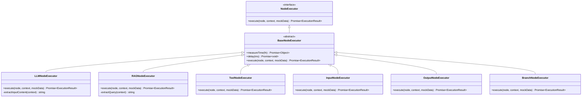

# /api/run-node API 文档

<cite>
**本文档中引用的文件**
- [route.ts](file://src/app/api/run-node/route.ts)
- [NodeExecutorFactory.ts](file://src/store/executors/NodeExecutorFactory.ts)
- [BaseNodeExecutor.ts](file://src/store/executors/BaseNodeExecutor.ts)
- [LLMNodeExecutor.ts](file://src/store/executors/LLMNodeExecutor.ts)
- [flow.ts](file://src/types/flow.ts)
- [executionActions.ts](file://src/store/actions/executionActions.ts)
- [flowStore.ts](file://src/store/flowStore.ts)
- [geminiFileSearchAPI.ts](file://src/services/geminiFileSearchAPI.ts)
- [registry.ts](file://src/lib/tools/registry.ts)
- [tools.ts](file://src/app/actions/tools.ts)
</cite>

## 目录
1. [简介](#简介)
2. [项目结构](#项目结构)
3. [核心组件](#核心组件)
4. [架构概览](#架构概览)
5. [详细组件分析](#详细组件分析)
6. [依赖关系分析](#依赖关系分析)
7. [性能考虑](#性能考虑)
8. [故障排除指南](#故障排除指南)
9. [结论](#结论)

## 简介

`/api/run-node` 是 Flash Flow 应用中的核心 API 端点，负责执行各种类型的节点（Node）计算任务。该系统采用模块化的执行器模式，支持多种节点类型包括 LLM（大语言模型）、RAG（检索增强生成）、工具节点等。API 支持多种 LLM 提供商（OpenAI、豆包等），并提供了强大的调试和监控功能。

## 项目结构

Flash Flow 应用采用现代化的 Next.js 架构，主要分为以下几个层次：


**图表来源**
- [route.ts](file://src/app/api/run-node/route.ts#L1-L66)
- [NodeExecutorFactory.ts](file://src/store/executors/NodeExecutorFactory.ts#L1-L28)

**章节来源**
- [route.ts](file://src/app/api/run-node/route.ts#L1-L66)
- [NodeExecutorFactory.ts](file://src/store/executors/NodeExecutorFactory.ts#L1-L28)

## 核心组件

### API 端点核心功能

`/api/run-node` API 端点提供以下核心功能：

1. **多提供商支持**：支持 OpenAI 和豆包（Doubao）两大 LLM 提供商
2. **动态消息构建**：根据输入参数动态构建对话消息
3. **错误处理**：完善的错误捕获和响应机制
4. **环境配置**：支持通过环境变量配置提供商

### 执行器架构

系统采用工厂模式的执行器架构：



**图表来源**
- [BaseNodeExecutor.ts](file://src/store/executors/BaseNodeExecutor.ts#L1-L26)
- [LLMNodeExecutor.ts](file://src/store/executors/LLMNodeExecutor.ts#L1-L172)
- [RAGNodeExecutor.ts](file://src/store/executors/RAGNodeExecutor.ts#L1-L106)

**章节来源**
- [BaseNodeExecutor.ts](file://src/store/executors/BaseNodeExecutor.ts#L1-L26)
- [LLMNodeExecutor.ts](file://src/store/executors/LLMNodeExecutor.ts#L1-L172)

## 架构概览

### 整体执行流程


**图表来源**
- [route.ts](file://src/app/api/run-node/route.ts#L4-L65)
- [executionActions.ts](file://src/store/actions/executionActions.ts#L173-L228)

### 节点类型映射

系统支持六种主要节点类型：

| 节点类型 | 执行器 | 主要功能 | 输入来源 |
|---------|--------|----------|----------|
| `input` | InputNodeExecutor | 接收用户输入 | 用户界面 |
| `llm` | LLMNodeExecutor | 调用大语言模型 | 上游节点输出 |
| `rag` | RAGNodeExecutor | 检索增强生成 | 文件搜索存储 |
| `output` | OutputNodeExecutor | 输出最终结果 | 上游节点输出 |
| `branch` | BranchNodeExecutor | 条件分支判断 | 配置参数 |
| `tool` | ToolNodeExecutor | 执行外部工具 | 工具配置 |

**章节来源**
- [NodeExecutorFactory.ts](file://src/store/executors/NodeExecutorFactory.ts#L10-L27)
- [flow.ts](file://src/types/flow.ts#L3-L9)

## 详细组件分析

### LLM 节点执行器

LLM 节点是最复杂的执行器，具有以下特性：

#### 核心功能
1. **配额管理**：集成配额服务进行使用限制
2. **调试支持**：支持模拟数据进行开发调试
3. **上游数据提取**：智能提取上游节点的输入内容
4. **API 调用**：统一调用 `/api/run-node` 进行实际执行

#### 执行流程


**图表来源**
- [LLMNodeExecutor.ts](file://src/store/executors/LLMNodeExecutor.ts#L12-L136)

#### 配额检查机制

系统实现了严格的配额检查机制：


**图表来源**
- [LLMNodeExecutor.ts](file://src/store/executors/LLMNodeExecutor.ts#L20-L55)

**章节来源**
- [LLMNodeExecutor.ts](file://src/store/executors/LLMNodeExecutor.ts#L1-L172)

### RAG 节点执行器

RAG 节点专门处理检索增强生成功能：

#### 核心特性
1. **文件搜索集成**：与 Gemini File Search API 深度集成
2. **智能查询提取**：从上游节点提取最佳查询内容
3. **文档检索**：支持自定义检索数量和过滤条件
4. **引用追踪**：记录检索到的文档引用信息

#### 检索流程


**图表来源**
- [RAGNodeExecutor.ts](file://src/store/executors/RAGNodeExecutor.ts#L10-L67)

**章节来源**
- [RAGNodeExecutor.ts](file://src/store/executors/RAGNodeExecutor.ts#L1-L106)
- [geminiFileSearchAPI.ts](file://src/services/geminiFileSearchAPI.ts#L1-L285)

### 工具节点执行器

工具节点支持多种外部工具的执行：

#### 支持的工具类型

| 工具类型 | 描述 | 输入参数 | 输出格式 |
|---------|------|----------|----------|
| `web_search` | 网络搜索 | `query`: 搜索关键词<br>`maxResults`: 结果数量 | 搜索结果列表 |
| `calculator` | 计算器 | `expression`: 数学表达式 | 计算结果 |

#### 工具执行流程


**图表来源**
- [ToolNodeExecutor.ts](file://src/store/executors/ToolNodeExecutor.ts#L6-L40)
- [tools.ts](file://src/app/actions/tools.ts#L106-L173)

**章节来源**
- [ToolNodeExecutor.ts](file://src/store/executors/ToolNodeExecutor.ts#L1-L41)
- [registry.ts](file://src/lib/tools/registry.ts#L1-L152)
- [tools.ts](file://src/app/actions/tools.ts#L1-L173)

### API 端点实现

#### 请求处理流程


**图表来源**
- [route.ts](file://src/app/api/run-node/route.ts#L4-L65)

#### 错误处理机制

系统实现了多层次的错误处理：

```mermaid
graph TB
subgraph "错误处理层级"
Level1[请求解析错误]
Level2[参数验证错误]
Level3[API 调用错误]
Level4[业务逻辑错误]
end
subgraph "错误响应格式"
ErrorResponse[{
"error": "错误描述",
"details": "详细错误信息"
}]
end
Level1 --> ErrorResponse
Level2 --> ErrorResponse
Level3 --> ErrorResponse
Level4 --> ErrorResponse
```

**章节来源**
- [route.ts](file://src/app/api/run-node/route.ts#L1-L66)

## 依赖关系分析

### 核心依赖图


**图表来源**
- [route.ts](file://src/app/api/run-node/route.ts#L1-L3)
- [LLMNodeExecutor.ts](file://src/store/executors/LLMNodeExecutor.ts#L1-L6)
- [RAGNodeExecutor.ts](file://src/store/executors/RAGNodeExecutor.ts#L1-L3)

### 环境变量配置

系统依赖以下关键环境变量：

| 环境变量 | 用途 | 默认值 | 必需 |
|---------|------|--------|------|
| `OPENAI_API_KEY` | OpenAI API 密钥 | - | 否 |
| `DOUBAO_API_KEY` | 豆包 API 密钥 | - | 否 |
| `NEXT_PUBLIC_GEMINI_API_KEY` | Gemini API 密钥 | - | 否 |
| `TAVILY_API_KEY` | Tavily API 密钥 | - | 否 |
| `LLM_PROVIDER` | 默认 LLM 提供商 | "openai" | 否 |

**章节来源**
- [route.ts](file://src/app/api/run-node/route.ts#L13-L13)
- [LLMNodeExecutor.ts](file://src/store/executors/LLMNodeExecutor.ts#L23-L23)

## 性能考虑

### 执行时间测量

系统内置了精确的执行时间测量机制：

```typescript
// 时间测量示例
protected async measureTime<T>(fn: () => Promise<T>): Promise<{ result: T; time: number }> {
    const start = Date.now();
    const result = await fn();
    const time = Date.now() - start;
    return { result, time };
}
```

### 并发控制

- **节点执行顺序**：使用拓扑排序确保正确的执行顺序
- **完整性检查**：在每个执行步骤前后进行流程完整性检查
- **防重复执行**：使用 `visited` 集合防止循环执行

### 缓存策略

- **配额缓存**：用户配额信息在内存中缓存
- **工具配置缓存**：工具注册表信息静态加载
- **API 响应缓存**：LLM API 响应结果可选择性缓存

## 故障排除指南

### 常见问题及解决方案

#### 1. LLM 执行失败

**症状**：LLM 节点显示错误状态

**可能原因**：
- API 密钥配置错误
- 配额不足
- 网络连接问题

**解决步骤**：
1. 检查环境变量配置
2. 验证 API 密钥有效性
3. 检查用户配额状态
4. 查看浏览器开发者工具网络面板

#### 2. RAG 检索失败

**症状**：RAG 节点无法检索文档

**可能原因**：
- 文件搜索存储未配置
- Gemini API 未启用
- 查询内容为空

**解决步骤**：
1. 确认文件搜索存储已创建
2. 检查 Gemini API 密钥配置
3. 验证上游节点提供有效查询

#### 3. 工具执行错误

**症状**：工具节点返回错误

**可能原因**：
- 工具配置错误
- 输入参数无效
- 外部服务不可用

**解决步骤**：
1. 检查工具类型配置
2. 验证输入参数格式
3. 查看工具执行日志

**章节来源**
- [LLMNodeExecutor.ts](file://src/store/executors/LLMNodeExecutor.ts#L20-L55)
- [RAGNodeExecutor.ts](file://src/store/executors/RAGNodeExecutor.ts#L14-L26)
- [ToolNodeExecutor.ts](file://src/store/executors/ToolNodeExecutor.ts#L12-L16)

## 结论

`/api/run-node` API 是 Flash Flow 应用的核心组件，它通过模块化的执行器架构实现了灵活且可扩展的节点执行能力。系统支持多种 LLM 提供商、丰富的节点类型和强大的调试功能，为构建复杂的 AI 工作流提供了坚实的基础。

### 主要优势

1. **模块化设计**：清晰的职责分离和可扩展的架构
2. **多提供商支持**：灵活的 LLM 提供商切换能力
3. **完善的错误处理**：多层次的错误捕获和恢复机制
4. **强大的调试功能**：支持模拟数据和详细的执行监控
5. **性能优化**：内置的时间测量和并发控制机制

### 未来发展方向

1. **更多节点类型**：扩展支持更多类型的节点执行器
2. **性能优化**：引入更高效的缓存和并发控制机制
3. **监控增强**：添加更详细的执行指标和监控功能
4. **安全加固**：加强输入验证和访问控制机制