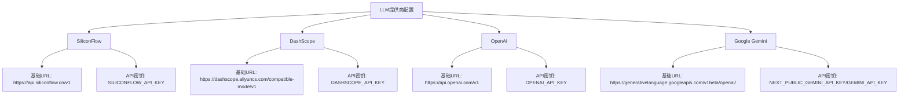
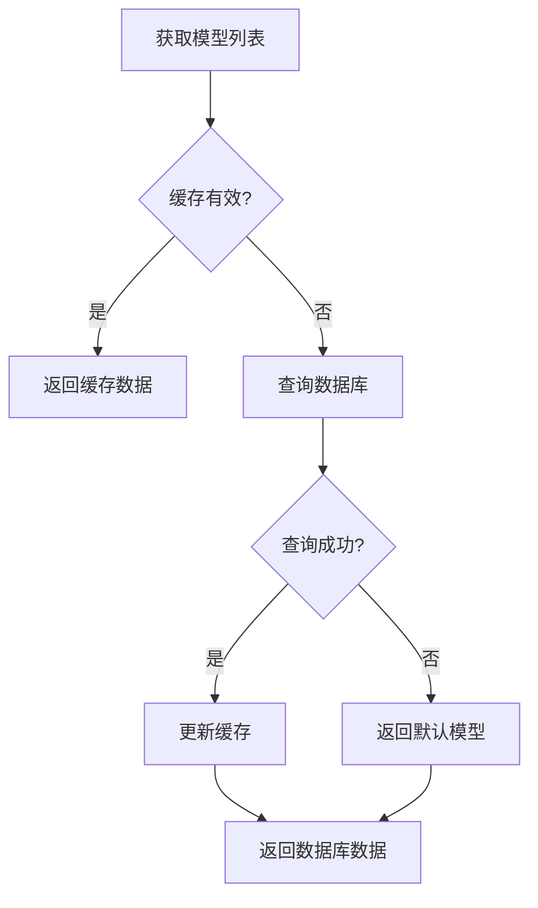
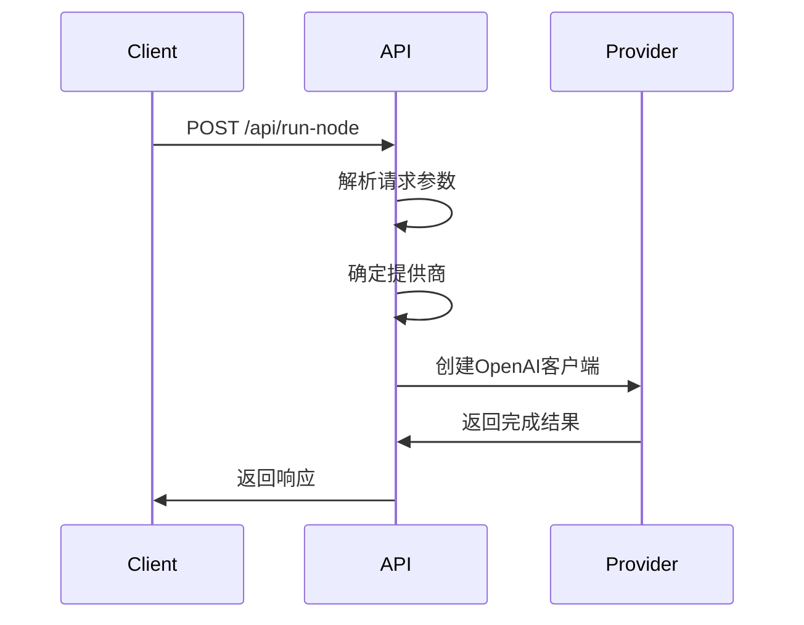
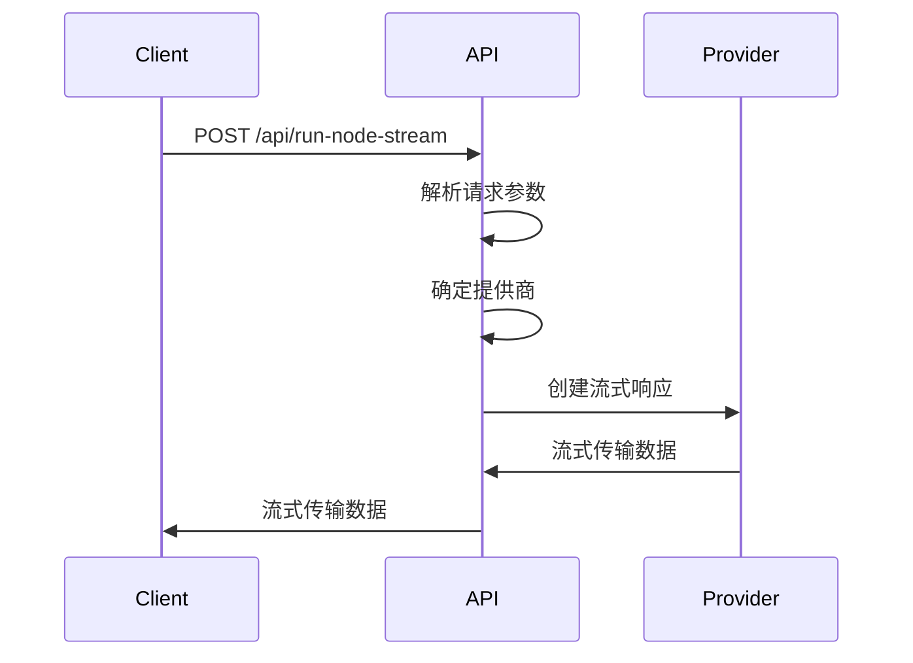
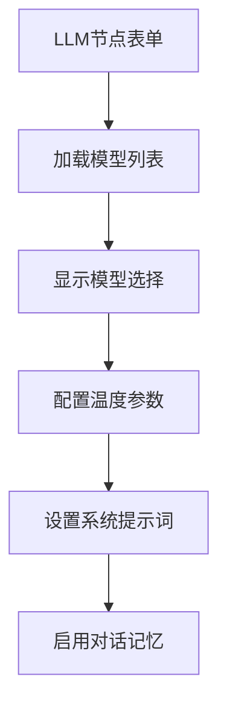
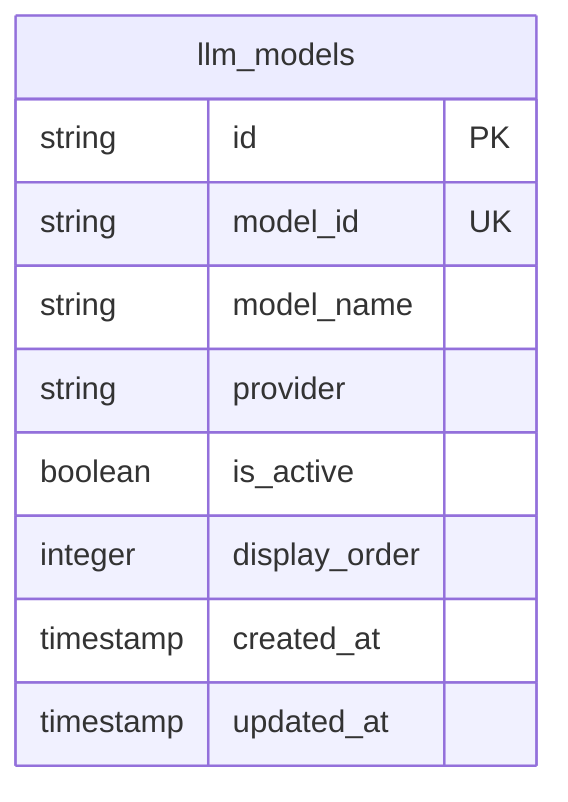
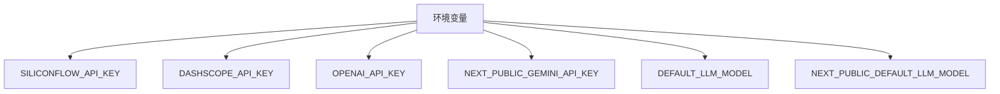
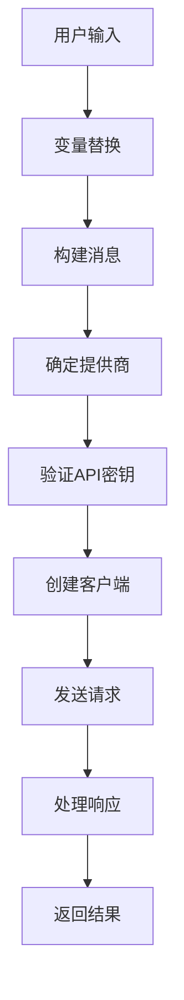

# LLM提供商配置

<cite>
**本文档中引用的文件**   
- [llmProvider.ts](file://src/lib/llmProvider.ts)
- [llmModelsAPI.ts](file://src/services/llmModelsAPI.ts)
- [run-node/route.ts](file://src/app/api/run-node/route.ts)
- [run-node-stream/route.ts](file://src/app/api/run-node-stream/route.ts)
- [LLMNodeForm.tsx](file://src/components/builder/node-forms/LLMNodeForm.tsx)
- [executorConfig.ts](file://src/store/constants/executorConfig.ts)
- [supabase-schema.sql](file://supabase-schema.sql)
</cite>

## 目录
1. [简介](#简介)
2. [核心配置](#核心配置)
3. [模型管理](#模型管理)
4. [API端点](#api端点)
5. [前端集成](#前端集成)
6. [数据库结构](#数据库结构)
7. [环境变量](#环境变量)
8. [执行流程](#执行流程)

## 简介
LLM提供商配置系统是本应用的核心组件，负责管理与不同大型语言模型（LLM）提供商的集成。该系统通过统一的配置接口，实现了对多个LLM提供商的动态路由和管理，包括SiliconFlow、DashScope、OpenAI和Google Gemini等。系统设计注重灵活性和可扩展性，允许通过环境变量和数据库配置来管理模型和提供商信息。

**Section sources**
- [llmProvider.ts](file://src/lib/llmProvider.ts#L1-L54)
- [llmModelsAPI.ts](file://src/services/llmModelsAPI.ts#L1-L122)

## 核心配置
核心配置主要在`llmProvider.ts`文件中定义，包含了所有支持的LLM提供商的配置信息。配置采用常量对象的形式，每个提供商都有其基础URL和API密钥获取函数。

**Diagram sources**
- [llmProvider.ts](file://src/lib/llmProvider.ts#L8-L25)

**Section sources**
- [llmProvider.ts](file://src/lib/llmProvider.ts#L8-L25)

## 模型管理
模型管理通过`llmModelsAPI.ts`文件实现，负责从Supabase数据库中获取和管理LLM模型信息。系统使用内存缓存来提高性能，缓存有效期为5分钟。

**Diagram sources**
- [llmModelsAPI.ts](file://src/services/llmModelsAPI.ts#L44-L88)

**Section sources**
- [llmModelsAPI.ts](file://src/services/llmModelsAPI.ts#L44-L88)

## API端点
系统提供了两个API端点来处理LLM请求：非流式和流式。两个端点都根据模型ID动态路由到相应的提供商。

### 非流式API
非流式API端点位于`run-node/route.ts`，处理一次性完成的LLM请求。

**Diagram sources**
- [run-node/route.ts](file://src/app/api/run-node/route.ts#L10-L74)

### 流式API
流式API端点位于`run-node-stream/route.ts`，处理需要流式输出的LLM请求。

**Diagram sources**
- [run-node-stream/route.ts](file://src/app/api/run-node-stream/route.ts#L9-L110)

**Section sources**
- [run-node/route.ts](file://src/app/api/run-node/route.ts#L10-L74)
- [run-node-stream/route.ts](file://src/app/api/run-node-stream/route.ts#L9-L110)

## 前端集成
前端通过`LLMNodeForm.tsx`组件与LLM提供商配置系统集成，允许用户在构建器界面中配置LLM节点。

**Diagram sources**
- [LLMNodeForm.tsx](file://src/components/builder/node-forms/LLMNodeForm.tsx#L46-L248)

**Section sources**
- [LLMNodeForm.tsx](file://src/components/builder/node-forms/LLMNodeForm.tsx#L46-L248)

## 数据库结构
LLM模型信息存储在Supabase数据库的`llm_models`表中，表结构设计合理，支持模型的动态管理。

**Diagram sources**
- [supabase-schema.sql](file://supabase-schema.sql#L183-L192)

**Section sources**
- [supabase-schema.sql](file://supabase-schema.sql#L183-L192)

## 环境变量
系统通过环境变量来配置默认模型和提供商的API密钥，提高了配置的灵活性和安全性。

**Diagram sources**
- [llmProvider.ts](file://src/lib/llmProvider.ts#L11-L24)
- [executorConfig.ts](file://src/store/constants/executorConfig.ts#L11-L13)

**Section sources**
- [llmProvider.ts](file://src/lib/llmProvider.ts#L11-L24)
- [executorConfig.ts](file://src/store/constants/executorConfig.ts#L11-L13)

## 执行流程
LLM节点的执行流程涉及多个组件的协同工作，从用户输入到最终响应的生成。

**Diagram sources**
- [run-node/route.ts](file://src/app/api/run-node/route.ts#L10-L74)
- [run-node-stream/route.ts](file://src/app/api/run-node-stream/route.ts#L9-L110)

**Section sources**
- [run-node/route.ts](file://src/app/api/run-node/route.ts#L10-L74)
- [run-node-stream/route.ts](file://src/app/api/run-node-stream/route.ts#L9-L110)