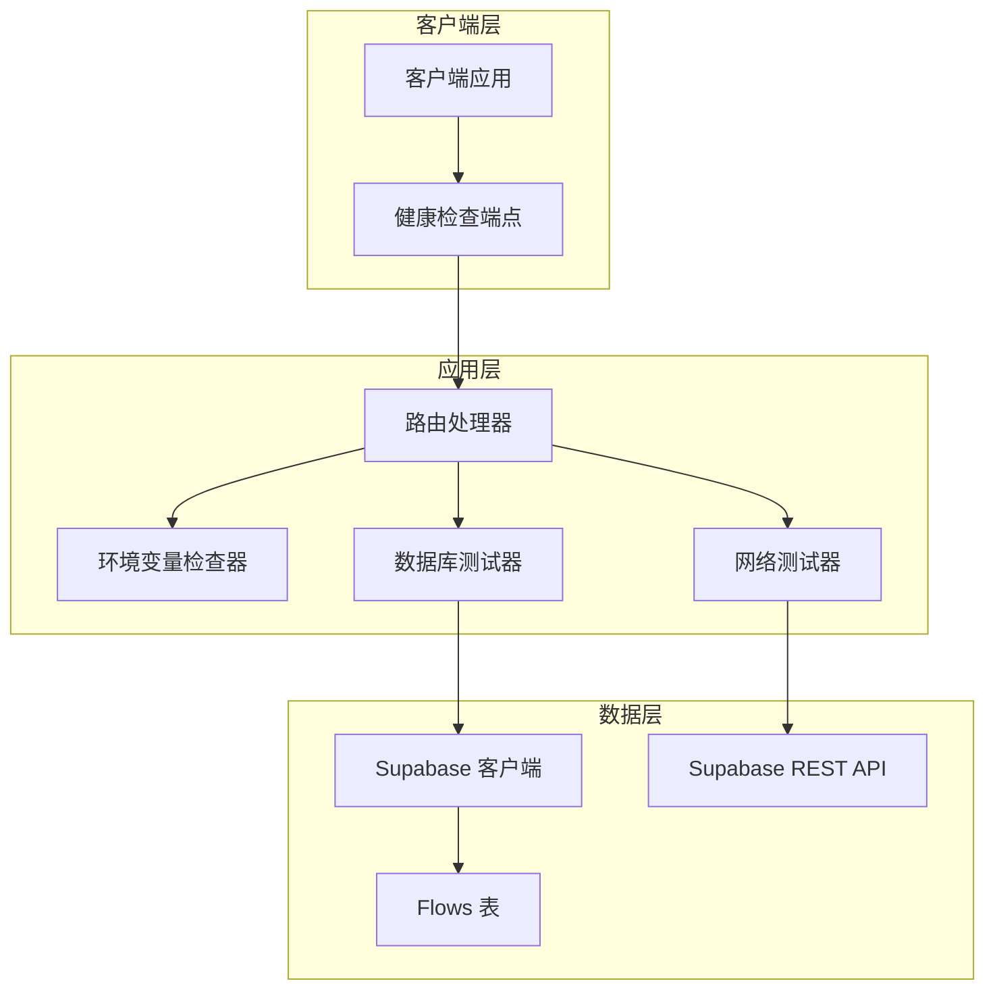
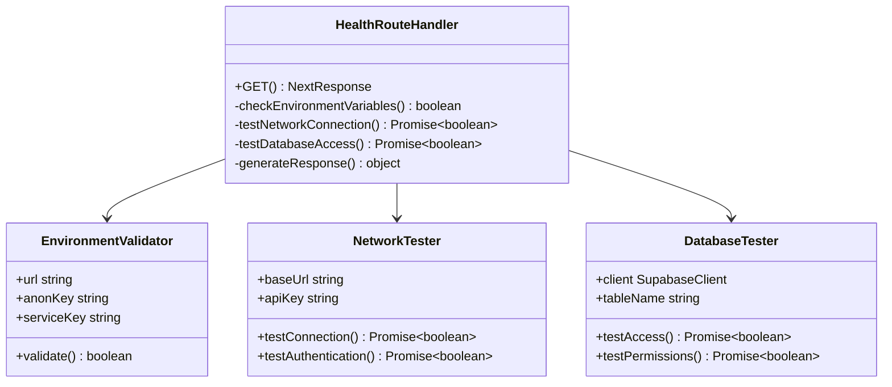
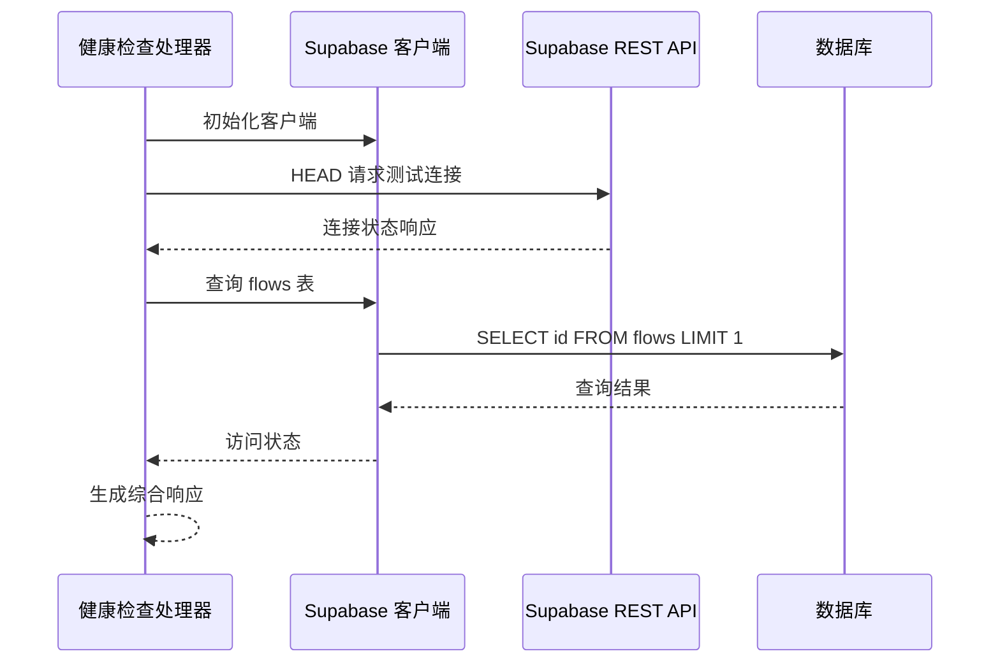
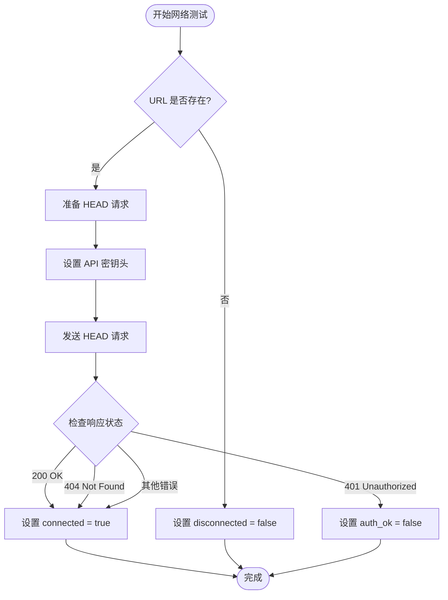

# 健康检查接口 (/api/health)

<cite>
**本文档中引用的文件**
- [route.ts](file://src/app/api/health/route.ts)
- [supabase.ts](file://src/lib/supabase.ts)
- [database.ts](file://src/types/database.ts)
- [flowAPI.ts](file://src/services/flowAPI.ts)
- [package.json](file://package.json)
- [README.md](file://README.md)
</cite>

## 目录
1. [简介](#简介)
2. [接口概述](#接口概述)
3. [技术架构](#技术架构)
4. [详细组件分析](#详细组件分析)
5. [实现逻辑详解](#实现逻辑详解)
6. [返回值结构](#返回值结构)
7. [使用示例](#使用示例)
8. [部署和CI/CD用途](#部署和cicd用途)
9. [故障排除指南](#故障排除指南)
10. [总结](#总结)

## 简介

健康检查接口 `/api/health` 是 Flash Flow SaaS 应用的核心监控组件，专门设计用于验证系统的健康状态和关键依赖项的可用性。该接口通过全面的检查流程确保应用程序能够正常访问 Supabase 数据库，并验证所有必要的环境变量配置正确。

该接口采用分层检查策略，从基础的环境变量验证到复杂的数据库连接测试，为开发者和运维团队提供了快速诊断系统状态的能力。

## 接口概述

### 基本信息
- **端点路径**: `/api/health`
- **HTTP 方法**: `GET`
- **响应格式**: JSON
- **内容类型**: `application/json`

### 主要功能
1. **环境变量完整性检查** - 验证必需的 Supabase 配置变量
2. **网络连通性测试** - 检测与 Supabase 服务的网络连接
3. **认证状态验证** - 测试 API 密钥的有效性和权限级别
4. **数据库表访问测试** - 验证对 `flows` 表的读取权限

## 技术架构



**图表来源**
- [route.ts](file://src/app/api/health/route.ts#L1-L52)
- [supabase.ts](file://src/lib/supabase.ts#L1-L18)

## 详细组件分析

### 路由处理器组件

健康检查接口的主处理器负责协调整个检查流程，采用异步处理模式确保每个检查步骤都能独立执行和报告结果。



**图表来源**
- [route.ts](file://src/app/api/health/route.ts#L4-L51)

### Supabase 客户端集成

系统通过统一的 Supabase 客户端进行数据库操作，确保配置的一致性和安全性。



**图表来源**
- [route.ts](file://src/app/api/health/route.ts#L19-L48)
- [supabase.ts](file://src/lib/supabase.ts#L12-L17)

**节来源**
- [route.ts](file://src/app/api/health/route.ts#L1-L52)
- [supabase.ts](file://src/lib/supabase.ts#L1-L18)

## 实现逻辑详解

### 环境变量验证阶段

系统首先检查三个关键的环境变量配置：

1. **NEXT_PUBLIC_SUPABASE_URL** - Supabase 项目的基础 URL
2. **NEXT_PUBLIC_SUPABASE_ANON_KEY** - 匿名访问密钥（可选）
3. **SUPABASE_SERVICE_ROLE_KEY** - 服务角色密钥（可选）

验证规则：只要 URL 存在且至少有一个认证密钥可用即可通过验证。

### 网络连接测试

采用 HEAD 请求方式测试与 Supabase REST API 的连通性：



**图表来源**
- [route.ts](file://src/app/api/health/route.ts#L20-L28)

### 数据库访问测试

通过查询 `flows` 表来验证数据库读取权限：

1. **查询执行**：使用 `SELECT id FROM flows LIMIT 1` 进行最小化测试
2. **结果验证**：检查返回的数据是否为数组类型
3. **错误处理**：区分网络错误和数据库错误

**节来源**
- [route.ts](file://src/app/api/health/route.ts#L19-L48)

## 返回值结构

健康检查接口返回一个包含五个主要字段的对象：

| 字段名 | 类型 | 描述 | 可能值 |
|--------|------|------|--------|
| `env_ok` | boolean | 环境变量是否齐全 | `true` - 配置完整<br>`false` - 缺少必要变量 |
| `connected` | boolean | 是否可连接到 Supabase | `true` - 连接成功<br>`false` - 连接失败 |
| `auth_ok` | boolean | 认证是否通过 | `true` - 认证成功<br>`false` - 认证失败 |
| `table_ok` | boolean | 能否查询 flows 表 | `true` - 可访问<br>`false` - 访问被拒绝 |
| `error` | string \| null | 错误信息 | 具体错误描述或 null |

### 响应示例

**完全健康的状态**：
```json
{
  "env_ok": true,
  "connected": true,
  "auth_ok": true,
  "table_ok": true,
  "error": null
}
```

**环境变量缺失**：
```json
{
  "env_ok": false,
  "connected": false,
  "auth_ok": false,
  "table_ok": false,
  "error": "missing env"
}
```

**网络连接失败**：
```json
{
  "env_ok": true,
  "connected": false,
  "auth_ok": false,
  "table_ok": false,
  "error": "Failed to fetch"
}
```

**认证失败**：
```json
{
  "env_ok": true,
  "connected": true,
  "auth_ok": false,
  "table_ok": false,
  "error": "Unauthorized"
}
```

**表访问失败**：
```json
{
  "env_ok": true,
  "connected": true,
  "auth_ok": true,
  "table_ok": false,
  "error": "relation \"flows\" does not exist"
}
```

**节来源**
- [route.ts](file://src/app/api/health/route.ts#L9-L17)
- [route.ts](file://src/app/api/health/route.ts#L50-L51)

## 使用示例

### curl 命令示例

**基本健康检查**：
```bash
curl -X GET "https://your-domain.com/api/health" \
  -H "Accept: application/json"
```

**带详细输出的检查**：
```bash
curl -v "https://your-domain.com/api/health" \
  -H "Accept: application/json"
```

**结合 jq 格式化输出**：
```bash
curl -s "https://your-domain.com/api/health" \
  -H "Accept: application/json" | jq '.'
```

### JavaScript/TypeScript 示例

**基本使用**：
```javascript
async function checkHealth() {
  try {
    const response = await fetch('/api/health');
    const data = await response.json();
    return data;
  } catch (error) {
    console.error('健康检查失败:', error);
    return null;
  }
}
```

**条件部署检查**：
```javascript
async function performDeploymentChecks() {
  const health = await checkHealth();
  
  if (!health?.env_ok) {
    console.error('环境变量配置不完整');
    return false;
  }
  
  if (!health.connected) {
    console.error('无法连接到 Supabase');
    return false;
  }
  
  if (!health.table_ok) {
    console.error('flows 表不可访问');
    return false;
  }
  
  console.log('所有健康检查通过');
  return true;
}
```

## 部署和CI/CD用途

### 部署前验证

在生产环境部署前，健康检查接口可用于：

1. **基础设施验证**：确保所有必要的服务和配置都已正确设置
2. **网络连通性测试**：验证应用服务器能够访问 Supabase 服务
3. **权限验证**：确认应用具有访问数据库所需的权限

### CI/CD 集成

**GitHub Actions 示例**：
```yaml
- name: 健康检查
  run: |
    HEALTH_CHECK=$(curl -s -o /dev/null -w "%{http_code}" https://your-domain.com/api/health)
    if [ $HEALTH_CHECK -ne 200 ]; then
      echo "健康检查失败: HTTP $HEALTH_CHECK"
      exit 1
    fi
```

**Docker Compose 健康检查**：
```yaml
healthcheck:
  test: ["CMD", "curl", "-f", "http://localhost:3000/api/health"]
  interval: 30s
  timeout: 10s
  retries: 3
```

### 自动化运维

**监控脚本**：
```bash
#!/bin/bash
HEALTH=$(curl -s https://your-domain.com/api/health | jq -r '.connected')
if [ "$HEALTH" != "true" ]; then
  echo "警告: 应用程序健康状态异常" | mail -s "健康检查警报" admin@yourdomain.com
fi
```

## 故障排除指南

### 常见问题及解决方案

#### 1. 环境变量配置问题

**症状**：
```json
{
  "env_ok": false,
  "connected": false,
  "auth_ok": false,
  "table_ok": false,
  "error": "missing env"
}
```

**原因**：缺少必要的环境变量

**解决方案**：
- 检查 `.env.local` 文件中的配置
- 确保设置了 `NEXT_PUBLIC_SUPABASE_URL`、`NEXT_PUBLIC_SUPABASE_ANON_KEY` 或 `SUPABASE_SERVICE_ROLE_KEY`
- 验证环境变量名称拼写正确

#### 2. 网络连接问题

**症状**：
```json
{
  "env_ok": true,
  "connected": false,
  "auth_ok": false,
  "table_ok": false,
  "error": "Failed to fetch"
}
```

**原因**：
- 网络防火墙阻止连接
- DNS 解析失败
- Supabase 服务暂时不可用

**解决方案**：
- 检查网络连接状态
- 验证防火墙规则
- 查看 Supabase 服务状态页面

#### 3. 认证权限问题

**症状**：
```json
{
  "env_ok": true,
  "connected": true,
  "auth_ok": false,
  "table_ok": false,
  "error": "Unauthorized"
}
```

**原因**：
- API 密钥无效
- 密钥权限不足
- IP 白名单限制

**解决方案**：
- 验证 API 密钥的正确性
- 检查密钥的权限范围
- 更新 IP 白名单设置

#### 4. 数据库表访问问题

**症状**：
```json
{
  "env_ok": true,
  "connected": true,
  "auth_ok": true,
  "table_ok": false,
  "error": "relation \"flows\" does not exist"
}
```

**原因**：
- `flows` 表不存在
- 数据库迁移未完成
- 权限配置错误

**解决方案**：
- 执行数据库迁移脚本
- 检查表结构定义
- 验证用户权限设置

### 调试技巧

**启用详细日志**：
```javascript
// 在开发环境中添加调试信息
console.log('环境变量:', {
  url: process.env.NEXT_PUBLIC_SUPABASE_URL,
  anon: process.env.NEXT_PUBLIC_SUPABASE_ANON_KEY ? '***' : undefined,
  service: process.env.SUPABASE_SERVICE_ROLE_KEY ? '***' : undefined
});
```

**网络测试工具**：
```bash
# 测试 Supabase API 可达性
curl -I "https://your-project.supabase.co/rest/v1" \
  -H "apikey: your-api-key"

# 测试数据库查询
curl -X POST "https://your-project.supabase.co/rest/v1/rpc/test_query" \
  -H "apikey: your-api-key" \
  -H "Content-Type: application/json"
```

**节来源**
- [route.ts](file://src/app/api/health/route.ts#L30-L48)

## 总结

健康检查接口 `/api/health` 是 Flash Flow SaaS 应用的重要监控组件，提供了全面的系统健康状态评估。通过分层检查机制，它能够快速识别和定位系统中的各种问题，为开发者和运维团队提供了强大的诊断工具。

### 关键特性

1. **全面性**：涵盖环境变量、网络连接、认证权限和数据库访问四个维度
2. **实用性**：提供清晰的错误信息和状态指示
3. **易用性**：简单的 GET 请求即可获取完整健康状态
4. **可靠性**：采用异步处理和错误隔离机制

### 最佳实践建议

1. **定期监控**：在生产环境中定期运行健康检查
2. **自动化集成**：将健康检查集成到 CI/CD 流程中
3. **告警设置**：基于健康检查结果设置适当的告警机制
4. **文档维护**：保持健康检查接口文档的及时更新

通过合理利用这个健康检查接口，开发团队可以显著提高应用的可靠性和可维护性，确保用户始终获得稳定的服务体验。