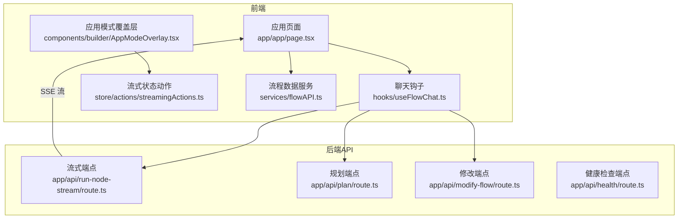
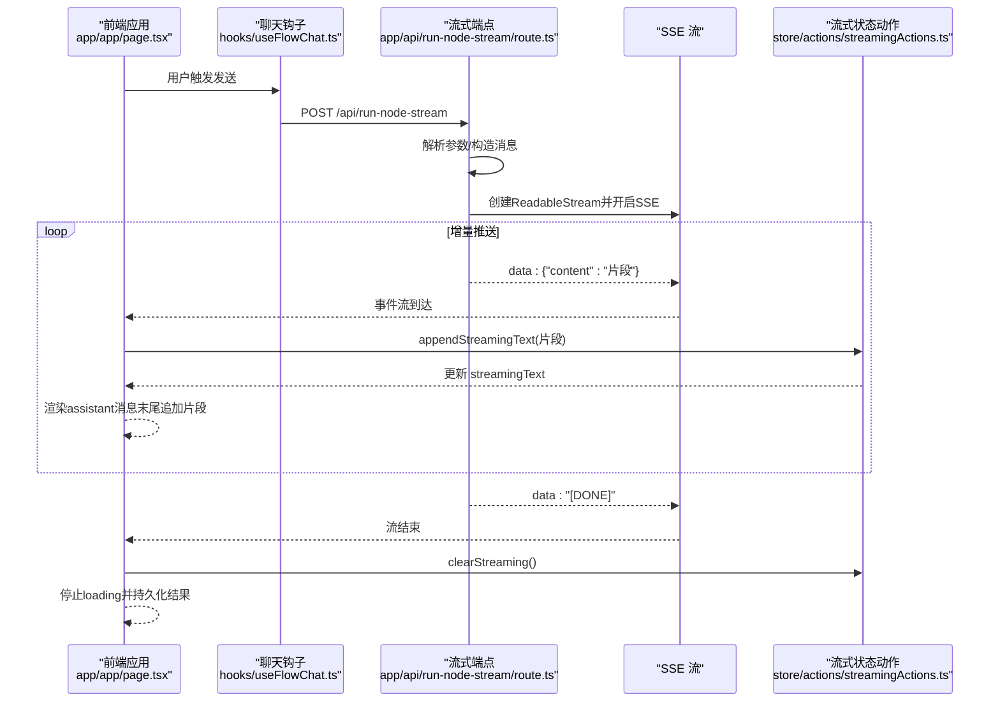
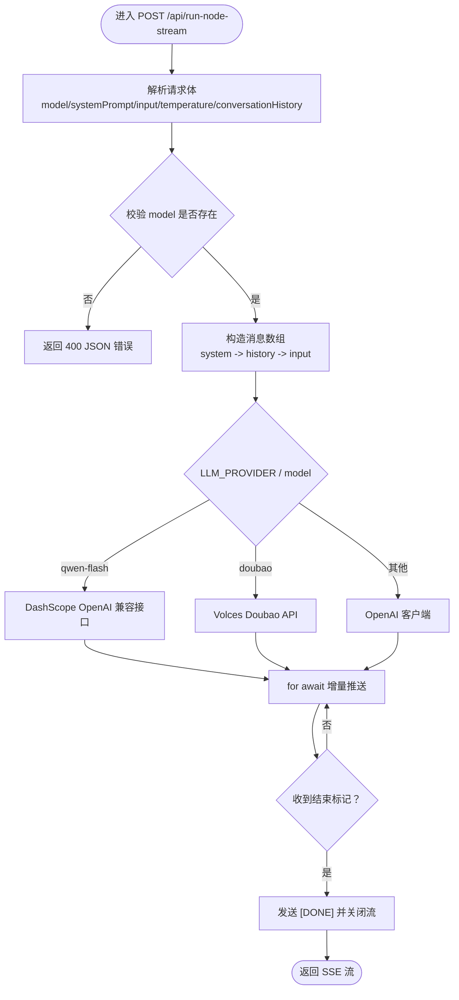
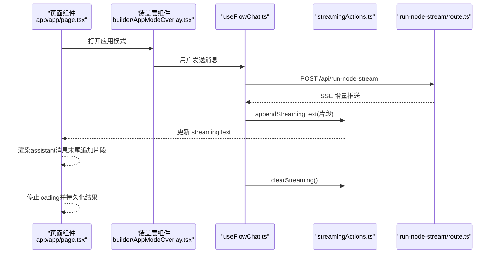
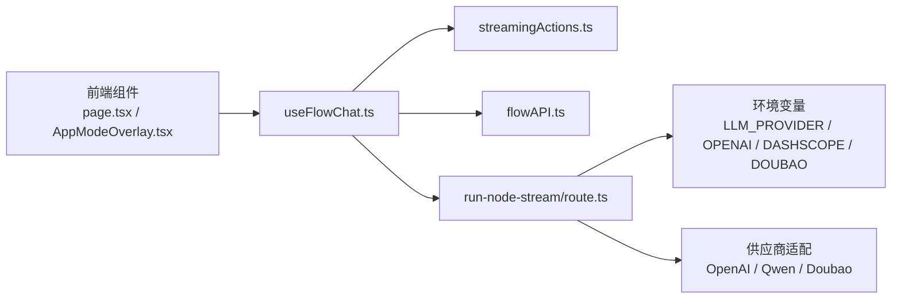

# 流式API端点

<cite>
**本文引用的文件**
- [run-node-stream/route.ts](file://src/app/api/run-node-stream/route.ts)
- [run-node/route.ts](file://src/app/api/run-node/route.ts)
- [plan/route.ts](file://src/app/api/plan/route.ts)
- [modify-flow/route.ts](file://src/app/api/modify-flow/route.ts)
- [health/route.ts](file://src/app/api/health/route.ts)
- [useFlowChat.ts](file://src/hooks/useFlowChat.ts)
- [AppModeOverlay.tsx](file://src/components/builder/AppModeOverlay.tsx)
- [page.tsx](file://src/app/app/page.tsx)
- [streamingActions.ts](file://src/store/actions/streamingActions.ts)
- [flowAPI.ts](file://src/services/flowAPI.ts)
</cite>

## 目录
1. [简介](#简介)
2. [项目结构](#项目结构)
3. [核心组件](#核心组件)
4. [架构总览](#架构总览)
5. [详细组件分析](#详细组件分析)
6. [依赖关系分析](#依赖关系分析)
7. [性能考量](#性能考量)
8. [故障排查指南](#故障排查指南)
9. [结论](#结论)

## 简介
本文件聚焦于“流式API端点”，即后端提供给前端的 Server-Sent Events（SSE）流式接口，用于实现大模型推理的实时打字机式输出体验。文档将从系统架构、数据流、处理逻辑、集成点、错误处理与性能优化等方面进行深入剖析，并辅以可视化图示帮助不同背景的读者理解。

## 项目结构
- 后端API位于 src/app/api 下，包含多个路由文件，其中与流式输出直接相关的是 run-node-stream/route.ts。
- 前端侧通过 hooks/useFlowChat.ts、components/builder/AppModeOverlay.tsx、app/app/page.tsx 等组件与后端流式端点交互。
- 状态管理使用 Zustand，流式状态通过 store/actions/streamingActions.ts 管理。
- 数据持久化与流程数据读写由 services/flowAPI.ts 提供。

图表来源
- [page.tsx](file://src/app/app/page.tsx#L1-L173)
- [useFlowChat.ts](file://src/hooks/useFlowChat.ts#L1-L217)
- [AppModeOverlay.tsx](file://src/components/builder/AppModeOverlay.tsx#L1-L186)
- [streamingActions.ts](file://src/store/actions/streamingActions.ts#L1-L41)
- [flowAPI.ts](file://src/services/flowAPI.ts#L1-L229)
- [run-node-stream/route.ts](file://src/app/api/run-node-stream/route.ts#L1-L167)
- [plan/route.ts](file://src/app/api/plan/route.ts#L1-L264)
- [modify-flow/route.ts](file://src/app/api/modify-flow/route.ts#L1-L302)
- [health/route.ts](file://src/app/api/health/route.ts#L1-L52)

章节来源
- [run-node-stream/route.ts](file://src/app/api/run-node-stream/route.ts#L1-L167)
- [run-node/route.ts](file://src/app/api/run-node/route.ts#L1-L91)
- [plan/route.ts](file://src/app/api/plan/route.ts#L1-L264)
- [modify-flow/route.ts](file://src/app/api/modify-flow/route.ts#L1-L302)
- [health/route.ts](file://src/app/api/health/route.ts#L1-L52)
- [useFlowChat.ts](file://src/hooks/useFlowChat.ts#L1-L217)
- [AppModeOverlay.tsx](file://src/components/builder/AppModeOverlay.tsx#L1-L186)
- [page.tsx](file://src/app/app/page.tsx#L1-L173)
- [streamingActions.ts](file://src/store/actions/streamingActions.ts#L1-L41)
- [flowAPI.ts](file://src/services/flowAPI.ts#L1-L229)

## 核心组件
- 流式端点：src/app/api/run-node-stream/route.ts
  - 接收模型、系统提示、输入、温度、历史对话等参数
  - 根据 LLM_PROVIDER 与模型名称选择 OpenAI/Qwen/Doubao 等供应商
  - 返回 text/event-stream，按 SSE 格式逐片推送增量内容
- 非流式端点：src/app/api/run-node/route.ts
  - 一次性返回完整响应，用于对比与兼容
- 规划端点：src/app/api/plan/route.ts
  - 基于自然语言描述生成工作流计划（节点与边）
- 修改端点：src/app/api/modify-flow/route.ts
  - 基于自然语言描述生成对现有工作流的修改指令
- 健康检查端点：src/app/api/health/route.ts
  - 检查 Supabase 连通性与关键表访问能力

章节来源
- [run-node-stream/route.ts](file://src/app/api/run-node-stream/route.ts#L1-L167)
- [run-node/route.ts](file://src/app/api/run-node/route.ts#L1-L91)
- [plan/route.ts](file://src/app/api/plan/route.ts#L1-L264)
- [modify-flow/route.ts](file://src/app/api/modify-flow/route.ts#L1-L302)
- [health/route.ts](file://src/app/api/health/route.ts#L1-L52)

## 架构总览
下面的序列图展示了从前端发起一次流式推理请求，到后端以 SSE 形式持续推送增量内容，再到前端逐步渲染的过程。

图表来源
- [page.tsx](file://src/app/app/page.tsx#L95-L112)
- [useFlowChat.ts](file://src/hooks/useFlowChat.ts#L132-L171)
- [run-node-stream/route.ts](file://src/app/api/run-node-stream/route.ts#L47-L158)
- [streamingActions.ts](file://src/store/actions/streamingActions.ts#L19-L40)

## 详细组件分析

### 流式端点：run-node-stream/route.ts
- 请求体字段
  - model：模型标识（如 qwen-flash、gpt-4o-mini 等）
  - systemPrompt：系统提示
  - input：用户输入（字符串或对象）
  - temperature：采样温度
  - conversationHistory：对话历史（数组）
- 供应商与模型选择
  - provider 由 LLM_PROVIDER 环境变量决定（默认 openai）
  - 特殊模型 qwen-flash：通过 DashScope OpenAI 兼容接口调用
  - provider=doubao：调用 Doubao API，手动解析 SSE 行
  - 其他：默认 OpenAI 客户端
- SSE 输出
  - Content-Type: text/event-stream
  - 每个增量以 data: JSON 形式推送
  - 结束时发送 data: "[DONE]" 并关闭流
- 错误处理
  - 参数缺失、供应商不可用、读取流异常均会通过 SSE 发送错误信息并关闭流
  - 最外层异常捕获返回 500 JSON

图表来源
- [run-node-stream/route.ts](file://src/app/api/run-node-stream/route.ts#L1-L167)

章节来源
- [run-node-stream/route.ts](file://src/app/api/run-node-stream/route.ts#L1-L167)

### 前端交互与状态更新：useFlowChat.ts 与 AppModeOverlay.tsx
- useFlowChat.ts
  - 在 sendMessage 中准备会话、持久化用户消息、更新输入节点数据并触发 runFlow
  - 成功后从 store 中提取执行结果文本并更新消息列表
  - 异常时清理流式状态并提示错误
- AppModeOverlay.tsx
  - 计算 displayMessages：当 isStreaming 且 streamingText 存在时，将流式文本作为临时 assistant 消息追加
  - 监听 executionStatus：completed/error 时停止 loading 并清理流式状态
- page.tsx
  - 计算 shouldShowLoading：当最后一条消息为用户消息且 isLoading 为真时显示 loading
  - 将 streamingText 作为临时 assistant 消息追加到显示列表

图表来源
- [page.tsx](file://src/app/app/page.tsx#L95-L112)
- [AppModeOverlay.tsx](file://src/components/builder/AppModeOverlay.tsx#L148-L155)
- [useFlowChat.ts](file://src/hooks/useFlowChat.ts#L132-L171)
- [streamingActions.ts](file://src/store/actions/streamingActions.ts#L19-L40)
- [run-node-stream/route.ts](file://src/app/api/run-node-stream/route.ts#L47-L158)

章节来源
- [useFlowChat.ts](file://src/hooks/useFlowChat.ts#L1-L217)
- [AppModeOverlay.tsx](file://src/components/builder/AppModeOverlay.tsx#L1-L186)
- [page.tsx](file://src/app/app/page.tsx#L95-L112)
- [streamingActions.ts](file://src/store/actions/streamingActions.ts#L1-L41)

### 非流式端点对比：run-node/route.ts
- 一次性返回完整响应，便于调试与对比
- 与流式端点相同的供应商与模型选择逻辑
- 适合不需要实时增量展示的场景

章节来源
- [run-node/route.ts](file://src/app/api/run-node/route.ts#L1-L91)

### 规划与修改端点：plan/route.ts 与 modify-flow/route.ts
- plan/route.ts
  - 基于自然语言生成工作流计划（nodes/edges），内部使用 OpenAI 兼容接口
  - 通过 Zod Schema 校验输入
- modify-flow/route.ts
  - 基于自然语言生成对现有工作流的修改指令（增删改重排等）
  - 支持 Doubao/OpenAI 两种供应商

章节来源
- [plan/route.ts](file://src/app/api/plan/route.ts#L1-L264)
- [modify-flow/route.ts](file://src/app/api/modify-flow/route.ts#L1-L302)

### 健康检查端点：health/route.ts
- 检查 Supabase 环境变量、连通性、鉴权与关键表访问
- 返回结构化的健康状态，便于运维监控

章节来源
- [health/route.ts](file://src/app/api/health/route.ts#L1-L52)

## 依赖关系分析
- 前端依赖
  - useFlowChat.ts 依赖 store 的 runFlow、updateNodeData、flowContext 等状态
  - AppModeOverlay.tsx 与 page.tsx 依赖 streamingText/isStreaming 控制 UI 渲染
  - flowAPI.ts 提供流程数据的读写能力
- 后端依赖
  - run-node-stream/route.ts 依赖 OpenAI SDK、环境变量（LLM_PROVIDER、OPENAI_API_KEY、DASHSCOPE_API_KEY、DOUBAO_API_KEY、DOUBAO_MODEL）
  - Doubao 供应商需要自定义解析 SSE 行
- 状态管理
  - streamingActions.ts 提供 setStreamingText、appendStreamingText、clearStreaming、abortStreaming、resetStreamingAbort 等动作

图表来源
- [page.tsx](file://src/app/app/page.tsx#L95-L112)
- [AppModeOverlay.tsx](file://src/components/builder/AppModeOverlay.tsx#L148-L155)
- [useFlowChat.ts](file://src/hooks/useFlowChat.ts#L132-L171)
- [streamingActions.ts](file://src/store/actions/streamingActions.ts#L1-L41)
- [flowAPI.ts](file://src/services/flowAPI.ts#L1-L229)
- [run-node-stream/route.ts](file://src/app/api/run-node-stream/route.ts#L1-L167)

章节来源
- [useFlowChat.ts](file://src/hooks/useFlowChat.ts#L1-L217)
- [AppModeOverlay.tsx](file://src/components/builder/AppModeOverlay.tsx#L1-L186)
- [page.tsx](file://src/app/app/page.tsx#L95-L112)
- [streamingActions.ts](file://src/store/actions/streamingActions.ts#L1-L41)
- [flowAPI.ts](file://src/services/flowAPI.ts#L1-L229)
- [run-node-stream/route.ts](file://src/app/api/run-node-stream/route.ts#L1-L167)

## 性能考量
- SSE 流式传输
  - 降低首屏延迟，提升用户体验；前端按增量渲染，避免等待完整响应
- 供应商选择
  - qwen-flash 通过 DashScope 兼容接口，具备较低延迟与高吞吐
  - Doubao 需要手动解析 SSE 行，注意缓冲与行边界处理
- 状态更新
  - appendStreamingText 采用不可变更新，避免不必要的重渲染
  - _streamingAborted 标志用于在用户主动中断时丢弃后续增量，减少无效渲染
- 错误与回退
  - 流式端点异常时通过 SSE 发送错误信息并关闭流，前端及时清理状态
  - 非流式端点可作为兜底方案

[本节为通用性能讨论，不直接分析具体文件]

## 故障排查指南
- 常见问题定位
  - 环境变量缺失：LLM_PROVIDER、OPENAI_API_KEY、DASHSCOPE_API_KEY、DOUBAO_API_KEY、DOUBAO_MODEL
  - 供应商不可用：检查对应 API Key 与网络连通性
  - Doubao SSE 解析异常：确认行前缀 data: 与 [DONE] 标记
- 前端状态
  - streamingText 未更新：确认 appendStreamingText 是否被调用
  - UI 一直 loading：检查 executionStatus 与 shouldShowLoading 计算逻辑
- 后端错误
  - 400：缺少 model 参数
  - 500：内部异常，查看控制台日志与 SSE 错误推送

章节来源
- [run-node-stream/route.ts](file://src/app/api/run-node-stream/route.ts#L1-L167)
- [useFlowChat.ts](file://src/hooks/useFlowChat.ts#L189-L201)
- [AppModeOverlay.tsx](file://src/components/builder/AppModeOverlay.tsx#L93-L110)
- [page.tsx](file://src/app/app/page.tsx#L95-L112)

## 结论
- 流式API端点通过 SSE 实现了低延迟、实时的打字机式输出体验，配合前端状态管理与 UI 渲染逻辑，提供了流畅的对话与工作流执行反馈。
- 供应商适配完善，支持 OpenAI/Qwen/Doubao 等多家模型服务，满足不同部署与成本需求。
- 健康检查与错误处理机制健全，便于运维与用户侧快速定位问题。
- 建议在生产环境中：
  - 明确并固化 LLM_PROVIDER 与对应 API Key
  - 对 Doubao 的 SSE 行解析做好边界与异常处理
  - 在前端对 _streamingAborted 标志进行统一管理，确保中断后不再接收增量