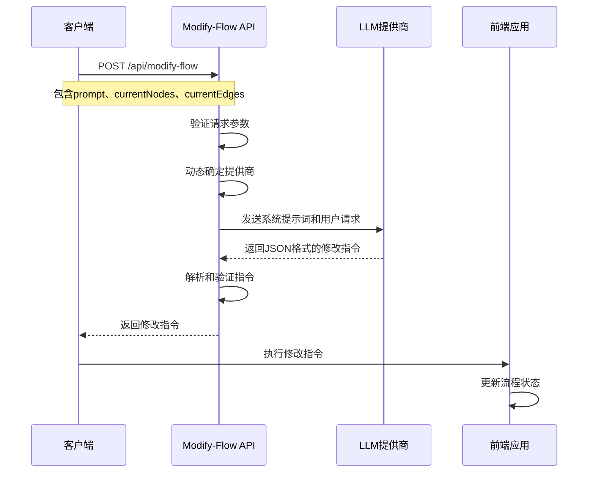
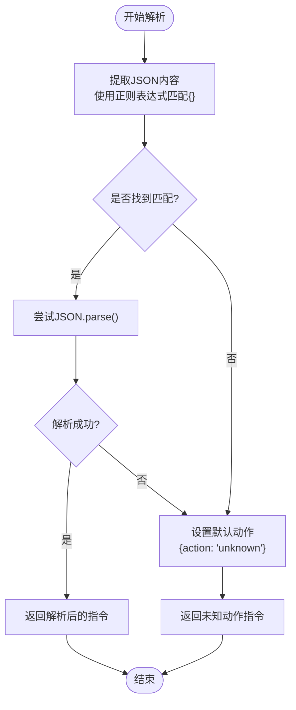
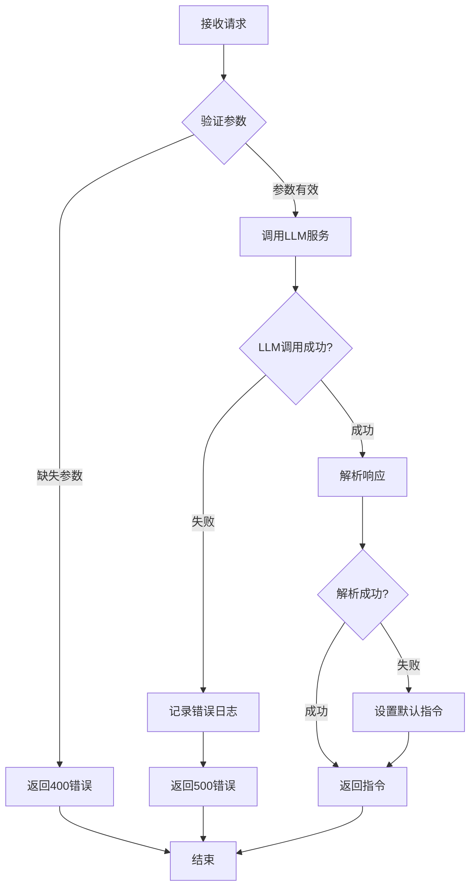
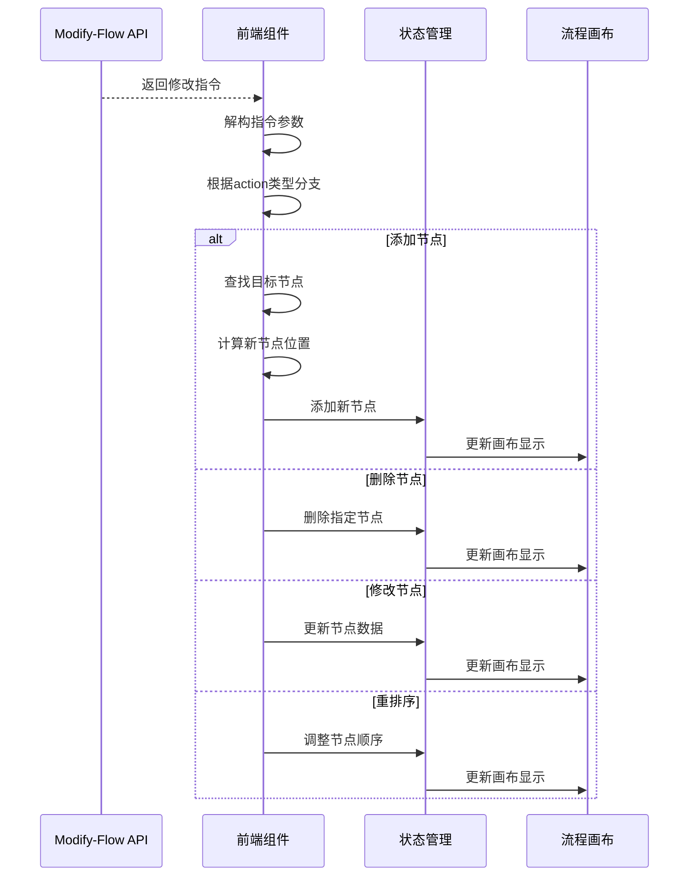
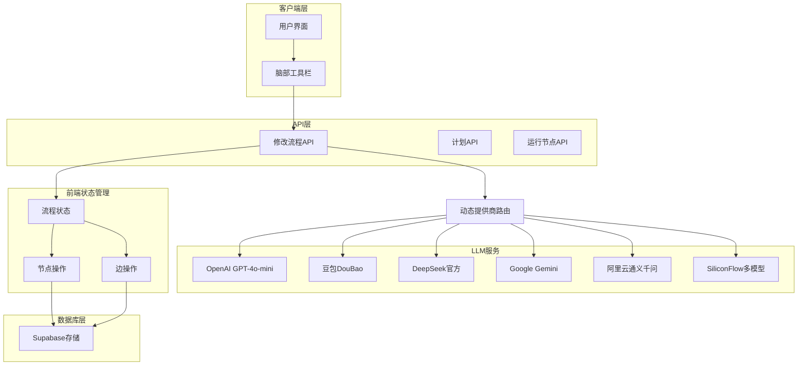
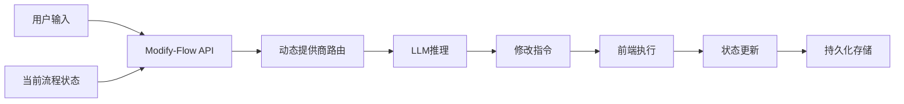

# 流程修改接口 (/api/modify-flow)

<cite>
**本文档中引用的文件**
- [route.ts](file://src/app/api/modify-flow/route.ts)
- [BrainBar.tsx](file://src/components/builder/BrainBar.tsx)
- [flow.ts](file://src/types/flow.ts)
- [flowStore.ts](file://src/store/flowStore.ts)
- [edgeActions.ts](file://src/store/actions/edgeActions.ts)
- [flowAPI.ts](file://src/services/flowAPI.ts)
- [llmProvider.ts](file://src/lib/llmProvider.ts)
</cite>

## 更新摘要
**变更内容**
- 更新了接口概述、系统提示词和架构图部分，以反映从硬编码的SiliconFlow API客户端迁移到基于`getProviderForModel`函数的动态提供商路由机制
- 新增了关于动态提供商路由机制的详细说明
- 更新了架构图以反映新的动态路由流程

## 目录
1. [简介](#简介)
2. [接口概述](#接口概述)
3. [输入参数](#输入参数)
4. [系统提示词](#系统提示词)
5. [LLM响应解析](#llm响应解析)
6. [修改指令类型](#修改指令类型)
7. [典型使用场景](#典型使用场景)
8. [错误处理机制](#错误处理机制)
9. [前端执行逻辑](#前端执行逻辑)
10. [架构图](#架构图)

## 简介

`/api/modify-flow` 是 Flash Flow SaaS 平台的核心接口，它利用大型语言模型（LLM）将用户的自然语言修改需求转换为结构化的流程修改指令。该接口实现了智能的工作流编辑功能，允许用户通过简单的文本描述来添加、删除、修改或重新排序流程中的节点和边。

## 接口概述

该接口采用 POST 方法，接收包含用户修改需求和当前流程状态的 JSON 请求体，返回结构化的修改指令。接口支持多种 LLM 提供商，包括 OpenAI、豆包（Doubao）、DeepSeek、Google Gemini、阿里云通义千问和SiliconFlow。



**图表来源**
- [route.ts](file://src/app/api/modify-flow/route.ts#L4-L103)
- [BrainBar.tsx](file://src/components/builder/BrainBar.tsx#L38-L62)

**章节来源**
- [route.ts](file://src/app/api/modify-flow/route.ts#L1-L104)

## 输入参数

### 必需参数

| 参数名 | 类型 | 描述 | 示例 |
|--------|------|------|------|
| `prompt` | string | 用户的修改需求描述 | "在两个LLM节点间插入一个RAG节点" |
| `currentNodes` | AppNode[] | 当前流程中的所有节点数组 | [{id: "llm-1", type: "llm", data: {...}}] |
| `currentEdges` | AppEdge[] | 当前流程中的所有边数组 | [{source: "llm-1", target: "llm-2"}] |

### 参数详细说明

#### prompt（修改需求）
- **类型**: string
- **必需**: 是
- **描述**: 用户提供的自然语言修改需求，可以是具体的修改指令或模糊的需求描述
- **示例**: 
  - "删除第二个LLM节点"
  - "在LLM1和LLM2之间加一个RAG节点"
  - "把第一个LLM的model改成gpt-4"

#### currentNodes（当前节点）
- **类型**: AppNode[]
- **必需**: 是
- **描述**: 当前工作流中所有节点的完整列表，每个节点包含类型、ID、位置和数据信息
- **结构**: 包含节点ID、类型、位置坐标和自定义数据

#### currentEdges（当前边）
- **类型**: AppEdge[]
- **必需**: 是
- **描述**: 当前工作流中所有连接关系的完整列表，表示节点间的连接
- **结构**: 包含源节点ID、目标节点ID和边的样式信息

**章节来源**
- [route.ts](file://src/app/api/modify-flow/route.ts#L6-L11)
- [flow.ts](file://src/types/flow.ts#L46-L51)

## 系统提示词

系统提示词定义了LLM的行为规范和输出格式要求，确保生成的修改指令符合预期格式。

### 提示词结构

系统提示词分为以下几个部分：

1. **角色定义**: 明确LLM作为工作流修改助手的角色
2. **输出格式**: 规定返回严格的JSON格式
3. **操作类型**: 详细说明四种支持的操作类型及其参数要求
4. **示例**: 提供具体的使用示例帮助LLM理解需求

### 支持的操作类型

#### 1. 添加节点 (add)
- **用途**: 在现有流程中添加新的节点
- **必需参数**:
  - `nodeType`: 节点类型（input、llm、rag、http、output）
  - `nodeData`: 节点配置对象
  - `target`: 目标节点ID或描述
  - `position`: 位置关系（'before' | 'after'）

#### 2. 删除节点 (delete)
- **用途**: 从流程中移除指定节点
- **必需参数**:
  - `target`: 节点ID或描述（如 '第一个LLM' 或 'llm-xxx'）

#### 3. 修改节点 (modify)
- **用途**: 修改现有节点的属性配置
- **必需参数**:
  - `target`: 节点ID或描述
  - `changes`: 要修改的字段对象

#### 4. 重排序节点 (reorder)
- **用途**: 调整节点在流程中的执行顺序
- **必需参数**:
  - `target`: 节点ID
  - `position`: 位置关系（'before' | 'after'）
  - `referenceNode`: 参考节点ID

### 输出格式规范

```typescript
interface ModificationInstruction {
  action: 'add' | 'delete' | 'modify' | 'reorder';
  target?: string;
  nodeType?: NodeKind;
  nodeData?: object;
  position?: 'before' | 'after';
  changes?: object;
  referenceNode?: string;
}
```

**章节来源**
- [route.ts](file://src/app/api/modify-flow/route.ts#L15-L38)

## LLM响应解析

接口实现了robust的JSON解析机制，能够处理LLM可能产生的各种输出格式问题。

### 解析流程



**图表来源**
- [route.ts](file://src/app/api/modify-flow/route.ts#L86-L96)

### 解析策略

1. **正则表达式提取**: 使用`/\{[\s\S]*\}/`模式从LLM响应中提取JSON内容
2. **异常处理**: 捕获JSON.parse异常，防止解析失败导致整个请求失败
3. **默认值处理**: 解析失败时返回`{action: "unknown"}`作为安全默认值

### 错误恢复

当LLM返回非标准JSON格式时，接口会：
- 尝试提取最接近的JSON片段
- 如果无法提取，则返回默认的未知动作指令
- 记录详细的错误日志用于调试

**章节来源**
- [route.ts](file://src/app/api/modify-flow/route.ts#L86-L96)

## 修改指令类型

### 添加节点指令 (Add)

```json
{
  "action": "add",
  "nodeType": "rag",
  "target": "llm-1",
  "position": "after",
  "nodeData": {
    "model": "gpt-4",
    "temperature": 0.7,
    "systemPrompt": "你是一个知识检索助手"
  }
}
```

**参数说明**:
- `nodeType`: 新节点的类型
- `target`: 目标节点ID或描述
- `position`: 在目标节点的前面还是后面添加
- `nodeData`: 节点的具体配置数据

### 删除节点指令 (Delete)

```json
{
  "action": "delete",
  "target": "llm-2"
}
```

**参数说明**:
- `target`: 要删除的节点ID或描述

### 修改节点指令 (Modify)

```json
{
  "action": "modify",
  "target": "llm-1",
  "changes": {
    "model": "gpt-4",
    "temperature": 0.5
  }
}
```

**参数说明**:
- `target`: 目标节点ID或描述
- `changes`: 要修改的字段和新值

### 重排序指令 (Reorder)

```json
{
  "action": "reorder",
  "target": "llm-2",
  "position": "before",
  "referenceNode": "llm-3"
}
```

**参数说明**:
- `target`: 要移动的节点ID
- `position`: 移动到参考节点的前面还是后面
- `referenceNode`: 参考节点ID

**章节来源**
- [route.ts](file://src/app/api/modify-flow/route.ts#L19-L31)

## 典型使用场景

### 场景1: 在两个LLM节点间插入RAG节点

**用户需求**: "在第一个LLM和第二个LLM之间插入一个RAG节点"

**LLM响应**:
```json
{
  "action": "add",
  "nodeType": "rag",
  "target": "llm-1",
  "position": "after",
  "nodeData": {
    "files": [{"name": "knowledge-base.pdf"}],
    "systemPrompt": "基于提供的知识库回答问题"
  }
}
```

**前端执行**: 创建新的RAG节点，放置在LLM-1之后的位置，更新边连接关系

### 场景2: 修改节点参数

**用户需求**: "把第一个LLM的模型参数改为gpt-4"

**LLM响应**:
```json
{
  "action": "modify",
  "target": "llm-1",
  "changes": {
    "model": "gpt-4"
  }
}
```

**前端执行**: 更新LLM-1节点的model参数，保持其他配置不变

### 场景3: 删除节点

**用户需求**: "删除流程中的最后一个节点"

**LLM响应**:
```json
{
  "action": "delete",
  "target": "llm-3"
}
```

**前端执行**: 移除LLM-3节点，同时清理与之相关的所有边

### 场景4: 调整节点顺序

**用户需求**: "把RAG节点移到LLM节点之前"

**LLM响应**:
```json
{
  "action": "reorder",
  "target": "rag-1",
  "position": "before",
  "referenceNode": "llm-1"
}
```

**前端执行**: 调整节点执行顺序，更新边的流向关系

**章节来源**
- [route.ts](file://src/app/api/modify-flow/route.ts#L33-L35)
- [BrainBar.tsx](file://src/components/builder/BrainBar.tsx#L65-L93)

## 错误处理机制

### HTTP状态码

| 错误类型 | HTTP状态码 | 描述 | 处理方式 |
|----------|------------|------|----------|
| 缺少必填字段 | 400 | 请求缺少prompt、currentNodes或currentEdges参数 | 返回错误信息，提示缺少必要参数 |
| LLM服务异常 | 500 | LLM调用失败或解析错误 | 返回通用错误信息，记录详细日志 |

### 错误处理流程



**图表来源**
- [route.ts](file://src/app/api/modify-flow/route.ts#L9-L11)
- [route.ts](file://src/app/api/modify-flow/route.ts#L98-L103)

### 日志记录

接口会记录以下类型的日志：
- 请求参数验证失败
- LLM服务调用异常
- JSON解析失败
- 修改指令执行情况

**章节来源**
- [route.ts](file://src/app/api/modify-flow/route.ts#L9-L11)
- [route.ts](file://src/app/api/modify-flow/route.ts#L98-L103)

## 前端执行逻辑

前端接收到LLM生成的修改指令后，会根据指令类型执行相应的操作。

### 执行流程



**图表来源**
- [BrainBar.tsx](file://src/components/builder/BrainBar.tsx#L65-L93)
- [flowStore.ts](file://src/store/flowStore.ts#L108-L118)

### 节点添加逻辑

前端会根据目标节点的位置计算新节点的坐标，通常在目标节点的左右300像素处创建新节点。

### 边关系维护

删除节点时，前端会自动清理与该节点相关的所有边，确保流程的完整性。

**章节来源**
- [BrainBar.tsx](file://src/components/builder/BrainBar.tsx#L65-L93)

## 架构图

### 系统架构概览



**图表来源**
- [route.ts](file://src/app/api/modify-flow/route.ts#L1-L104)
- [BrainBar.tsx](file://src/components/builder/BrainBar.tsx#L1-L93)
- [flowStore.ts](file://src/store/flowStore.ts#L1-L131)
- [llmProvider.ts](file://src/lib/llmProvider.ts#L51-L70)

### 数据流图



**图表来源**
- [route.ts](file://src/app/api/modify-flow/route.ts#L4-L103)
- [BrainBar.tsx](file://src/components/builder/BrainBar.tsx#L38-L62)
- [llmProvider.ts](file://src/lib/llmProvider.ts#L51-L70)

**章节来源**
- [route.ts](file://src/app/api/modify-flow/route.ts#L1-L104)
- [BrainBar.tsx](file://src/components/builder/BrainBar.tsx#L1-L93)