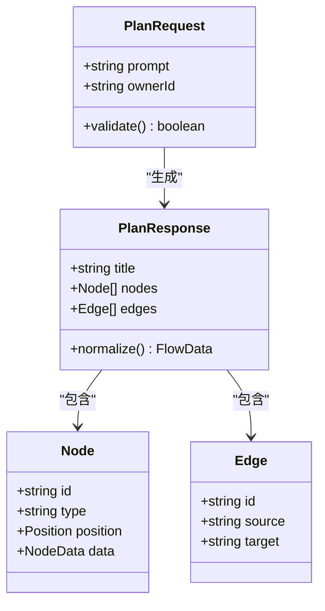
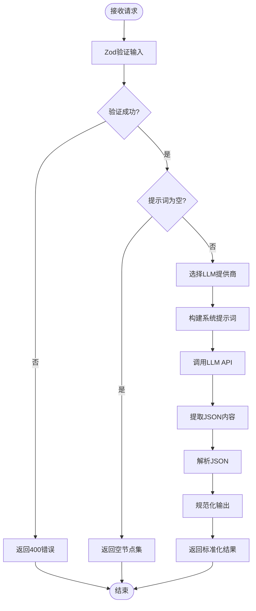
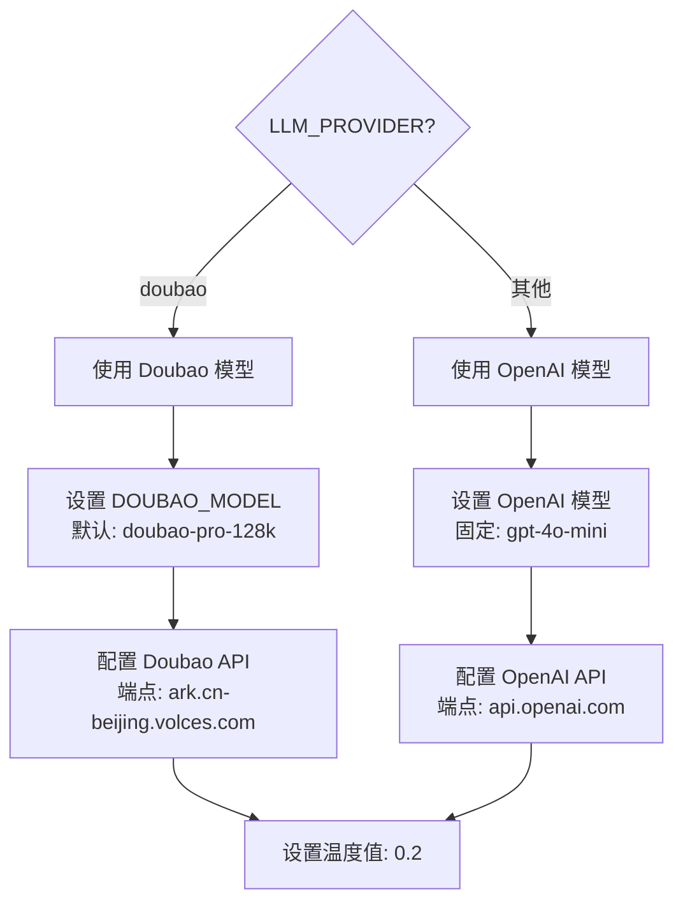
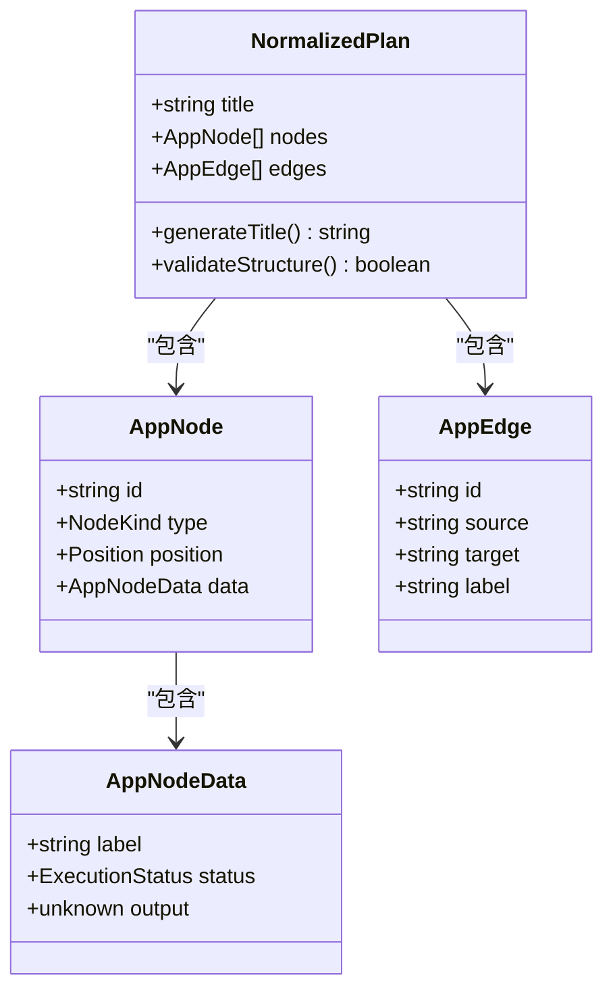
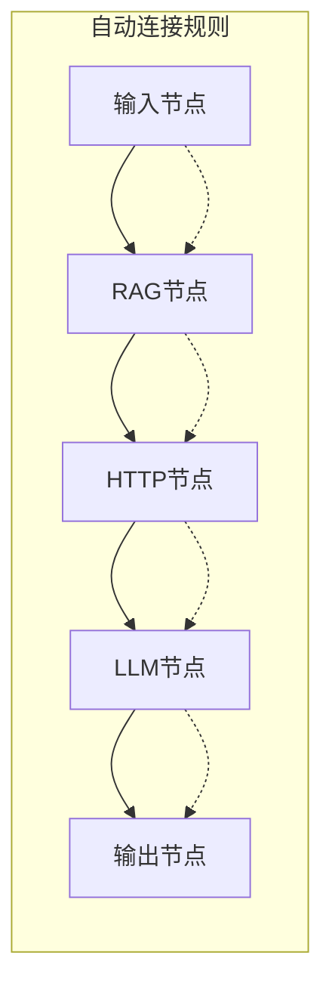
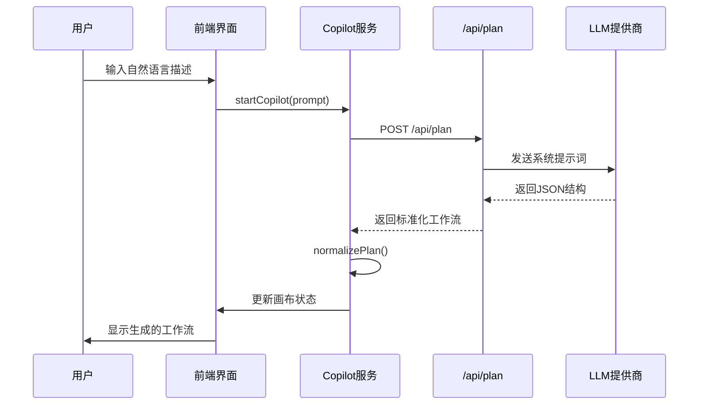
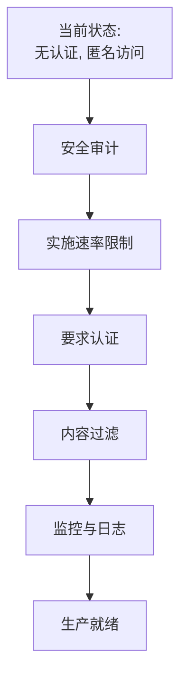
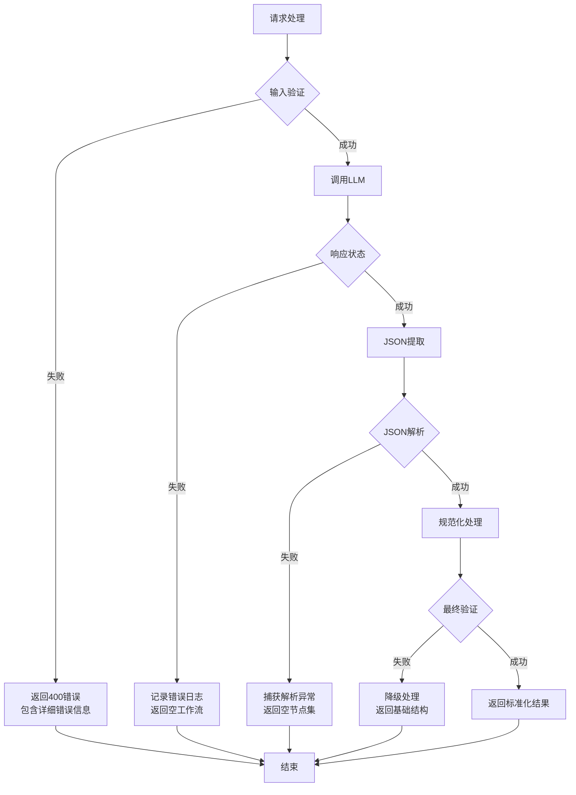

# 流程规划接口 (/api/plan)

<cite>
**本文档中引用的文件**
- [route.ts](file://src/app/api/plan/route.ts)
- [validation.ts](file://src/utils/validation.ts)
- [flow.ts](file://src/types/flow.ts)
- [planNormalizer.ts](file://src/store/utils/planNormalizer.ts)
- [copilotActions.ts](file://src/store/actions/copilotActions.ts)
- [CopilotOverlay.tsx](file://src/components/flow/CopilotOverlay.tsx)
- [builder/page.tsx](file://src/app/builder/page.tsx)
- [package.json](file://package.json)
</cite>

## 目录
1. [简介](#简介)
2. [接口概述](#接口概述)
3. [输入验证与数据结构](#输入验证与数据结构)
4. [核心业务逻辑](#核心业务逻辑)
5. [LLM集成与模型选择](#llm集成与模型选择)
6. [输出结构与规范化](#输出结构与规范化)
7. [前端应用场景](#前端应用场景)
8. [安全边界与认证](#安全边界与认证)
9. [错误处理与容错机制](#错误处理与容错机制)
10. [使用示例](#使用示例)
11. [最佳实践建议](#最佳实践建议)

## 简介

`/api/plan` 接口是 Flash Flow SaaS 平台的核心智能功能，它能够将用户的自然语言描述转换为可视化的流程工作流。该接口通过先进的大语言模型（LLM）技术，将非结构化的用户需求转化为包含节点（nodes）和边（edges）的标准 JSON 结构，支持多种类型的节点类型，包括输入、LLM、RAG、HTTP 和输出节点。

## 接口概述

### 基本信息
- **端点路径**: `/api/plan`
- **HTTP方法**: `POST`
- **内容类型**: `application/json`
- **认证要求**: 无（匿名访问）

### 请求结构



**图表来源**
- [route.ts](file://src/app/api/plan/route.ts#L3-L5)
- [validation.ts](file://src/utils/validation.ts#L3-L6)
- [flow.ts](file://src/types/flow.ts#L46-L51)

**节来源**
- [route.ts](file://src/app/api/plan/route.ts#L1-L123)
- [validation.ts](file://src/utils/validation.ts#L1-L28)

## 输入验证与数据结构

### Zod 验证架构

接口使用 Zod 库进行严格的数据验证，确保输入的完整性和安全性：

| 字段 | 类型 | 验证规则 | 描述 |
|------|------|----------|------|
| prompt | string | min(1), max(1000) | 用户的自然语言描述，不能为空且长度不超过1000字符 |
| ownerId | string | optional() | 所有者标识符（后端忽略，使用认证用户替代） |

### 节点类型限制

系统支持以下五种标准化节点类型：

| 节点类型 | 功能描述 | 主要属性 |
|----------|----------|----------|
| input | 数据输入节点 | label, text |
| llm | 大语言模型节点 | model, temperature, systemPrompt |
| rag | 检索增强生成节点 | files |
| http | HTTP请求节点 | method, url |
| output | 数据输出节点 | label, text |

**节来源**
- [validation.ts](file://src/utils/validation.ts#L3-L6)
- [flow.ts](file://src/types/flow.ts#L3-L9)

## 核心业务逻辑

### 处理流程图



**图表来源**
- [route.ts](file://src/app/api/plan/route.ts#L6-L123)

### 关键处理步骤

1. **输入验证**: 使用 `PlanRequestSchema` 验证请求体结构
2. **空值检查**: 如果提示词为空，直接返回空的工作流结构
3. **LLM提供商选择**: 支持 OpenAI 和 Doubao 两种提供商
4. **系统提示词构建**: 根据节点类型和约束条件生成详细的指导语
5. **JSON提取机制**: 从LLM响应中提取有效的JSON片段
6. **输出规范化**: 将原始JSON转换为标准化的节点和边结构

**节来源**
- [route.ts](file://src/app/api/plan/route.ts#L6-L123)

## LLM集成与模型选择

### 支持的LLM提供商

| 提供商 | 默认模型 | API端点 | 认证方式 |
|--------|----------|---------|----------|
| OpenAI | gpt-4o-mini | OpenAI API | API密钥 |
| Doubao | doubao-pro-128k | Volcengine API | Bearer Token |

### 模型选择策略



**图表来源**
- [route.ts](file://src/app/api/plan/route.ts#L51-L108)

### 温度值设置

- **温度值**: 0.2（低随机性，高一致性）
- **选择理由**: 为了确保生成的工作流结构稳定可靠，避免不必要的随机变化
- **适用场景**: 工作流规划需要精确的结构化输出

### JSON提取机制

接口实现了智能的JSON提取算法：

```typescript
// JSON提取逻辑
const match = content.match(/\{[\s\S]*\}/);
if (match) jsonText = match[0];
```

该正则表达式能够：
- 匹配最外层的大括号包裹的JSON对象
- 忽略LLM响应中的额外文本和注释
- 提取完整的JSON结构

**节来源**
- [route.ts](file://src/app/api/plan/route.ts#L51-L108)

## 输出结构与规范化

### 标准化输出结构



**图表来源**
- [planNormalizer.ts](file://src/store/utils/planNormalizer.ts#L45-L130)
- [flow.ts](file://src/types/flow.ts#L46-L51)

### 节点数据规范化

不同节点类型的规范化处理：

| 节点类型 | 默认属性 | 规范化处理 |
|----------|----------|------------|
| input | text: "" | 保留用户输入文本 |
| llm | model: "doubao-seed-1-6-flash-250828"<br/>temperature: 0.7<br/>systemPrompt: 自动生成 | 使用用户指定的配置 |
| rag | files: [] | 将文件名列表转换为标准格式 |
| http | method: "GET"<br/>url: "" | 保留用户指定的URL和方法 |
| output | text: "" | 保留输出文本 |

### 边连接自动化

当LLM未明确指定边连接时，系统会自动构建合理的连接：



**图表来源**
- [planNormalizer.ts](file://src/store/utils/planNormalizer.ts#L104-L126)

**节来源**
- [planNormalizer.ts](file://src/store/utils/planNormalizer.ts#L1-L130)
- [flow.ts](file://src/types/flow.ts#L1-L153)

## 前端应用场景

### Copilot 功能集成

`/api/plan` 接口深度集成到前端的 Copilot 功能中，提供智能工作流生成功能：



**图表来源**
- [copilotActions.ts](file://src/store/actions/copilotActions.ts#L8-L34)
- [CopilotOverlay.tsx](file://src/components/flow/CopilotOverlay.tsx#L1-L64)

### 构建器页面集成

在构建器页面中，该接口支持：

1. **初始加载**: 从URL参数获取初始提示词，自动生成工作流
2. **实时生成**: 用户输入描述后立即生成对应的工作流
3. **交互反馈**: 通过 CopilotOverlay 提供生成进度指示

**节来源**
- [copilotActions.ts](file://src/store/actions/copilotActions.ts#L1-L58)
- [builder/page.tsx](file://src/app/builder/page.tsx#L20-L207)
- [CopilotOverlay.tsx](file://src/components/flow/CopilotOverlay.tsx#L1-L64)

## 安全边界与认证

### 当前安全状况

**重要警告**: `/api/plan` 接口目前处于无认证状态，存在以下安全风险：

1. **匿名访问**: 任何客户端都可以直接调用该接口
2. **资源滥用**: 可能导致LLM API费用的意外消耗
3. **内容过滤缺失**: 缺少对恶意输入的防护机制
4. **速率限制缺失**: 无法有效防止DDoS攻击

### 建议的安全改进



### 临时安全措施

当前代码中实现了基本的输入验证作为第一道防线：

- **Zod验证**: 确保输入结构正确
- **空值检查**: 防止空提示词导致的无效调用
- **长度限制**: 限制输入长度防止过长请求

**节来源**
- [route.ts](file://src/app/api/plan/route.ts#L18-L49)

## 错误处理与容错机制

### 多层次错误处理



**图表来源**
- [route.ts](file://src/app/api/plan/route.ts#L119-L122)

### 错误类型与处理策略

| 错误类型 | HTTP状态码 | 处理策略 | 用户体验 |
|----------|------------|----------|----------|
| 输入验证失败 | 400 | 返回详细错误信息 | 明确的错误提示 |
| LLM调用失败 | 200 | 返回空工作流 | 静默降级 |
| JSON解析失败 | 200 | 返回空节点集 | 继续工作流编辑 |
| 系统异常 | 200 | 返回空工作流 | 保持界面响应 |

### 容错设计原则

1. **优雅降级**: 即使部分功能失败，系统仍可继续运行
2. **用户友好**: 错误信息清晰，不影响用户体验
3. **数据保护**: 避免因错误导致数据丢失
4. **调试支持**: 记录详细的错误日志便于问题排查

**节来源**
- [route.ts](file://src/app/api/plan/route.ts#L119-L122)

## 使用示例

### 基本使用示例

#### 创建数据清洗流程

**请求示例**:
```json
{
  "prompt": "创建一个数据清洗流程，包括读取CSV文件、去除重复行、填充缺失值、转换日期格式，最后保存为新的CSV文件"
}
```

**预期响应**:
```json
{
  "title": "数据清洗流程",
  "nodes": [
    {
      "id": "input-abc123",
      "type": "input",
      "position": { "x": 100, "y": 200 },
      "data": { "label": "读取CSV文件", "text": "上传CSV文件" }
    },
    {
      "id": "llm-def456",
      "type": "llm",
      "position": { "x": 400, "y": 200 },
      "data": {
        "label": "数据清洗",
        "model": "gpt-4o-mini",
        "temperature": 0.2,
        "systemPrompt": "去除重复行、填充缺失值、转换日期格式"
      }
    },
    {
      "id": "output-ghi789",
      "type": "output",
      "position": { "x": 700, "y": 200 },
      "data": { "label": "保存结果", "text": "保存为CSV文件" }
    }
  ],
  "edges": [
    {
      "id": "e-input-llm-def456-xyz1",
      "source": "input-abc123",
      "target": "llm-def456"
    },
    {
      "id": "e-llm-output-ghi789-xyz2",
      "source": "llm-def456",
      "target": "output-ghi789"
    }
  ]
}
```

### 高级使用示例

#### API集成工作流

**请求示例**:
```json
{
  "prompt": "构建一个API集成流程，从外部API获取产品数据，进行价格比较分析，然后发送邮件通知给销售团队"
}
```

**响应结构**:
- **输入节点**: 外部API凭据配置
- **HTTP节点**: 外部API调用
- **LLM节点**: 价格分析和报告生成
- **HTTP节点**: 邮件发送API调用
- **输出节点**: 邮件发送确认

### 前端集成示例

```typescript
// 在前端组件中使用
async function generateWorkflow(prompt: string) {
  try {
    const response = await fetch('/api/plan', {
      method: 'POST',
      headers: { 'Content-Type': 'application/json' },
      body: JSON.stringify({ prompt })
    });
    
    if (!response.ok) {
      throw new Error('工作流生成失败');
    }
    
    const result = await response.json();
    // 更新画布状态
    updateFlowCanvas(result.nodes, result.edges);
    setFlowTitle(result.title);
    
  } catch (error) {
    console.error('生成工作流时出错:', error);
    // 显示错误提示
    showErrorNotification('无法生成工作流，请稍后重试');
  }
}
```

## 最佳实践建议

### 开发最佳实践

1. **输入质量控制**
   - 提供具体的、结构化的描述
   - 包含必要的上下文信息
   - 避免过于宽泛或模糊的需求

2. **错误处理**
   - 实现适当的重试机制
   - 提供有意义的错误反馈
   - 记录详细的错误日志

3. **性能优化**
   - 控制提示词长度在合理范围内
   - 避免频繁的API调用
   - 实现本地缓存机制

### 生产环境部署建议

1. **安全加固**
   ```typescript
   // 示例：添加基本的速率限制
   const rateLimit = new Map<string, number>();
   
   function checkRateLimit(clientId: string): boolean {
     const currentTime = Date.now();
     const lastRequest = rateLimit.get(clientId) || 0;
     
     if (currentTime - lastRequest < 5000) { // 5秒内最多1次
       return false;
     }
     
     rateLimit.set(clientId, currentTime);
     return true;
   }
   ```

2. **监控与告警**
   - 监控API调用频率
   - 跟踪错误率和响应时间
   - 设置异常告警机制

3. **成本控制**
   - 实施使用量限制
   - 添加计费提醒
   - 提供使用统计报告

### 质量保证

1. **测试策略**
   - 单元测试覆盖核心逻辑
   - 集成测试验证端到端流程
   - 性能测试评估响应时间

2. **持续改进**
   - 收集用户反馈
   - 分析使用模式
   - 优化系统提示词

通过遵循这些最佳实践，可以确保 `/api/plan` 接口在生产环境中稳定、高效地运行，为用户提供优质的智能工作流生成功能。