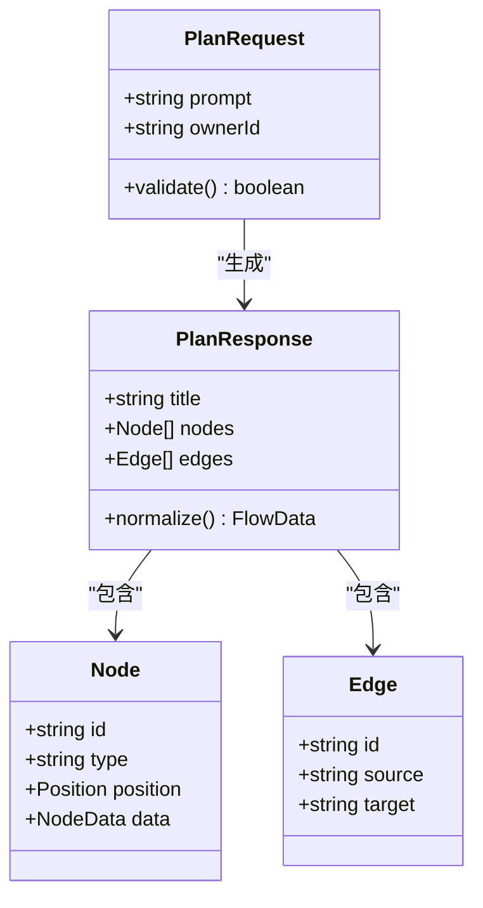
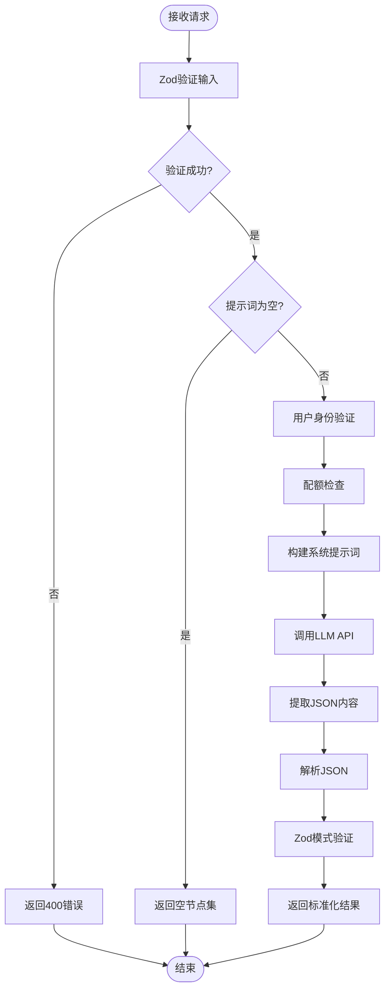
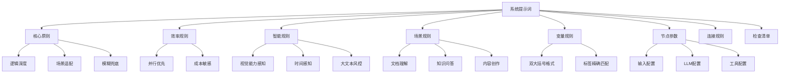
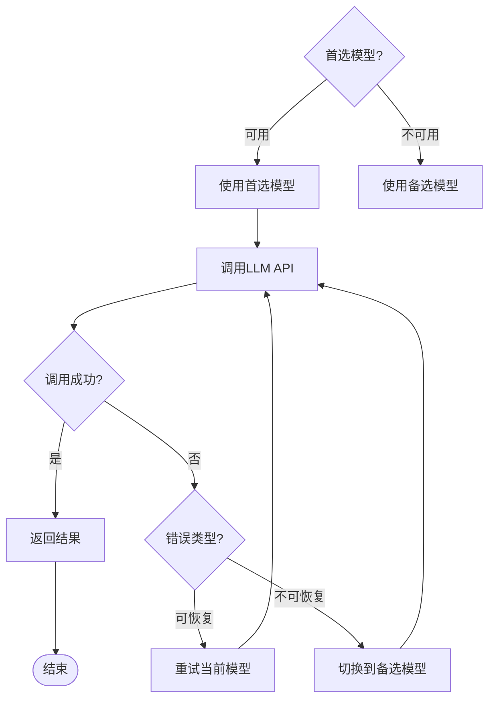
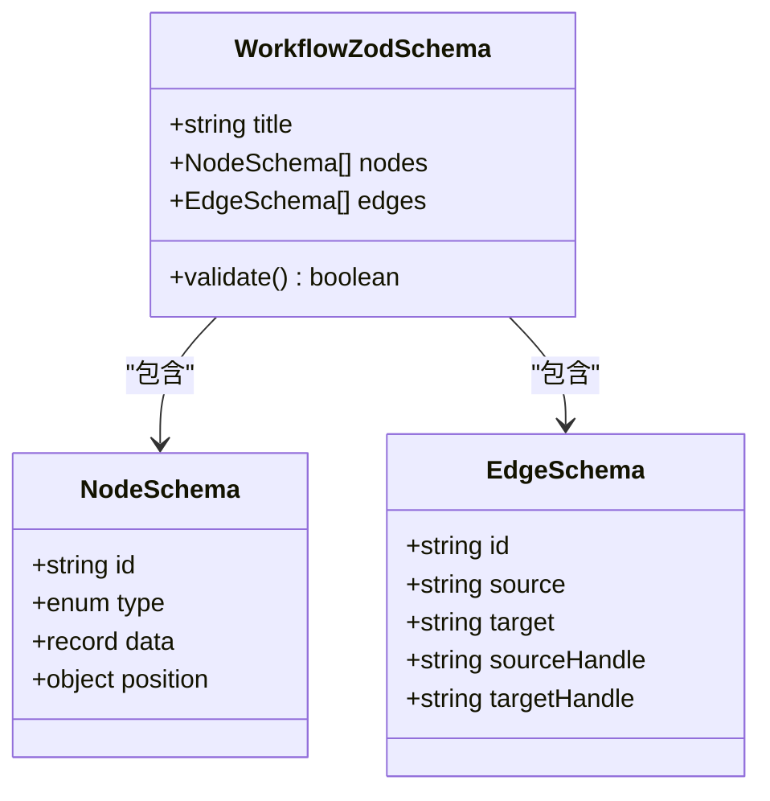
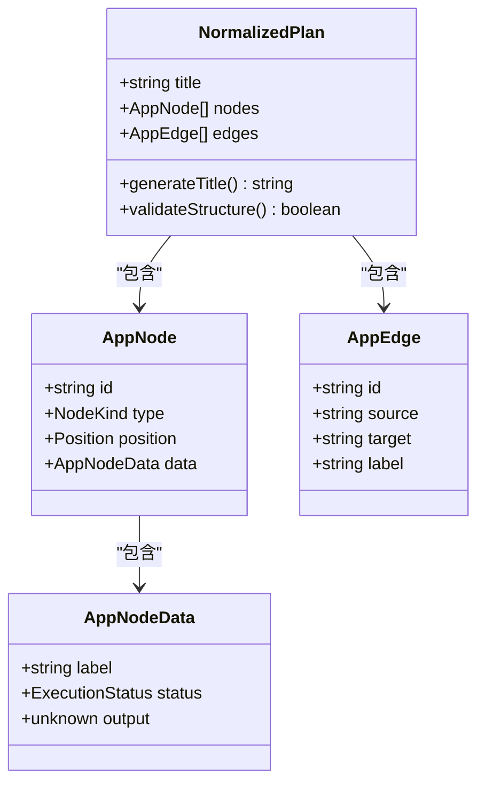
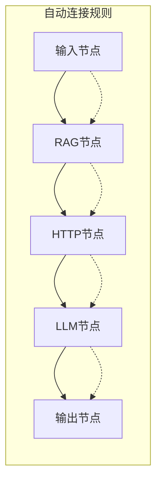
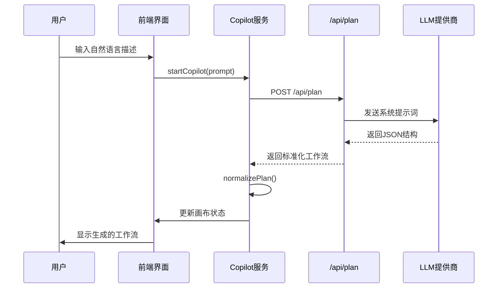
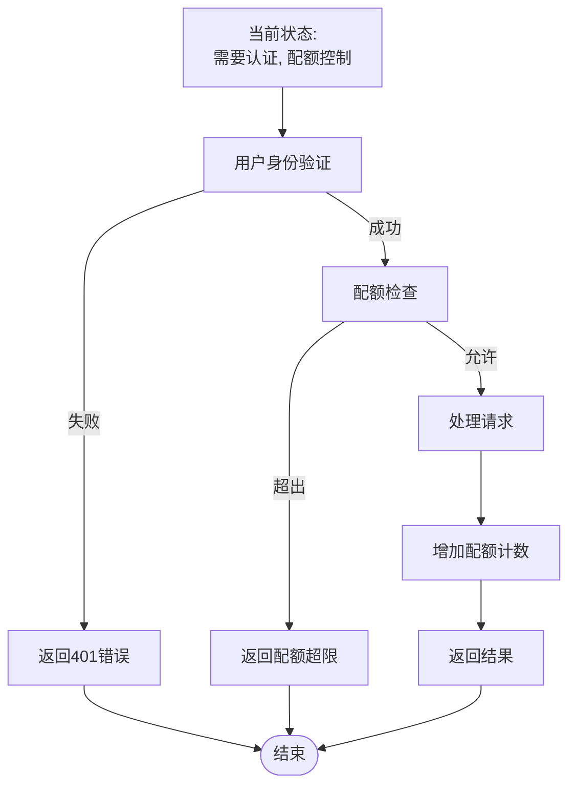
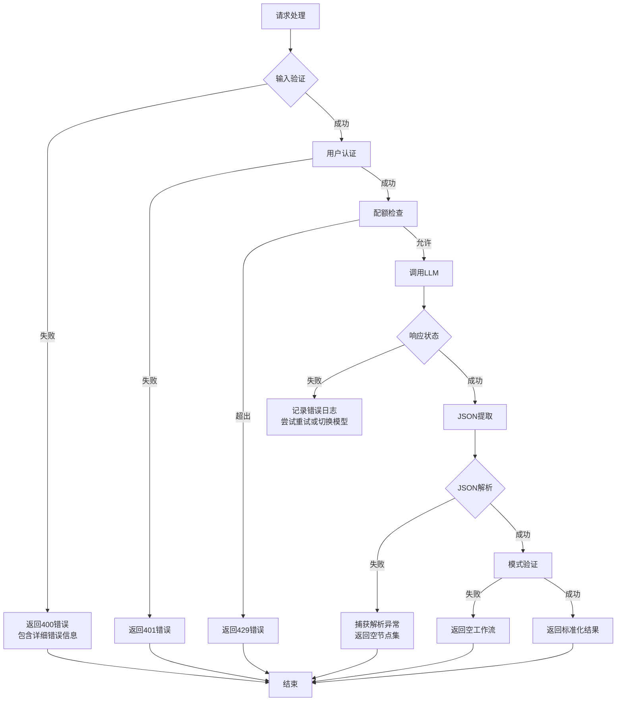

# 流程规划接口 (/api/plan)

<cite>
**本文档中引用的文件**
- [route.ts](file://src/app/api/plan/route.ts)
- [validation.ts](file://src/utils/validation.ts)
- [flow.ts](file://src/types/flow.ts)
- [planNormalizer.ts](file://src/store/utils/planNormalizer.ts)
- [copilotActions.ts](file://src/store/actions/copilotActions.ts)
- [CopilotOverlay.tsx](file://src/components/flow/CopilotOverlay.tsx)
- [builder/page.tsx](file://src/app/builder/page.tsx)
- [package.json](file://package.json)
- [smartRules.ts](file://src/lib/prompts/smartRules.ts)
- [variableRules.ts](file://src/lib/prompts/variableRules.ts)
- [nodeSpecs.ts](file://src/lib/prompts/nodeSpecs.ts)
- [edgeRules.ts](file://src/lib/prompts/edgeRules.ts)
- [scenarioRules.ts](file://src/lib/prompts/scenarioRules.ts)
- [checklists.ts](file://src/lib/prompts/checklists.ts)
- [efficiencyRules.ts](file://src/lib/prompts/efficiencyRules.ts)
- [workflow.ts](file://src/lib/schemas/workflow.ts)
</cite>

## 更新摘要
**变更内容**
- 更新“核心业务逻辑”部分，反映使用规则提示词和工作流模式指导LLM生成有效工作流的新机制
- 新增“规则提示词体系”章节，详细说明SMART_RULES、VARIABLE_RULES等规则模块
- 更新“系统提示词构建”流程图，展示多规则模块的集成方式
- 在“LLM集成与模型选择”中更新模型选择策略，包含备选模型与重试机制
- 更新“输出结构与规范化”部分，反映Zod模式验证的使用
- 更新“使用示例”中的系统提示词内容，体现规则提示词的实际应用

## 目录
1. [简介](#简介)
2. [接口概述](#接口概述)
3. [输入验证与数据结构](#输入验证与数据结构)
4. [核心业务逻辑](#核心业务逻辑)
5. [规则提示词体系](#规则提示词体系)
6. [LLM集成与模型选择](#llm集成与模型选择)
7. [输出结构与规范化](#输出结构与规范化)
8. [前端应用场景](#前端应用场景)
9. [安全边界与认证](#安全边界与认证)
10. [错误处理与容错机制](#错误处理与容错机制)
11. [使用示例](#使用示例)
12. [最佳实践建议](#最佳实践建议)

## 简介

`/api/plan` 接口是 Flash Flow SaaS 平台的核心智能功能，它能够将用户的自然语言描述转换为可视化的流程工作流。该接口通过先进的大语言模型（LLM）技术，将非结构化的用户需求转化为包含节点（nodes）和边（edges）的标准 JSON 结构，支持多种类型的节点类型，包括输入、LLM、RAG、HTTP 和输出节点。

## 接口概述

### 基本信息
- **端点路径**: `/api/plan`
- **HTTP方法**: `POST`
- **内容类型**: `application/json`
- **认证要求**: 有（基于用户身份验证）

### 请求结构



**图表来源**
- [route.ts](file://src/app/api/plan/route.ts#L3-L5)
- [validation.ts](file://src/utils/validation.ts#L3-L6)
- [flow.ts](file://src/types/flow.ts#L46-L51)

**节来源**
- [route.ts](file://src/app/api/plan/route.ts#L1-L297)
- [validation.ts](file://src/utils/validation.ts#L1-L28)

## 输入验证与数据结构

### Zod 验证架构

接口使用 Zod 库进行严格的数据验证，确保输入的完整性和安全性：

| 字段 | 类型 | 验证规则 | 描述 |
|------|------|----------|------|
| prompt | string | min(1), max(1000) | 用户的自然语言描述，不能为空且长度不超过1000字符 |
| ownerId | string | optional() | 所有者标识符（后端忽略，使用认证用户替代） |

### 节点类型限制

系统支持以下标准化节点类型：

| 节点类型 | 功能描述 | 主要属性 |
|----------|----------|----------|
| input | 数据输入节点 | label, text |
| llm | 大语言模型节点 | model, temperature, systemPrompt |
| rag | 检索增强生成节点 | files |
| http | HTTP请求节点 | method, url |
| output | 数据输出节点 | label, text |
| branch | 分支节点 | condition |
| tool | 工具节点 | toolType, inputs |

**节来源**
- [validation.ts](file://src/utils/validation.ts#L3-L6)
- [flow.ts](file://src/types/flow.ts#L3-L9)
- [nodeSpecs.ts](file://src/lib/prompts/nodeSpecs.ts#L1-L192)

## 核心业务逻辑

### 处理流程图



**图表来源**
- [route.ts](file://src/app/api/plan/route.ts#L43-L297)

### 关键处理步骤

1. **输入验证**: 使用 `PlanRequestSchema` 验证请求体结构
2. **空值检查**: 如果提示词为空，直接返回空的工作流结构
3. **用户认证**: 通过 `getAuthenticatedUser` 验证用户身份
4. **配额检查**: 使用 `checkQuotaOnServer` 检查用户配额
5. **系统提示词构建**: 集成多模块规则提示词指导LLM生成
6. **LLM调用**: 支持重试机制和备选模型切换
7. **JSON提取与解析**: 从LLM响应中提取并解析JSON内容
8. **模式验证**: 使用 `WorkflowZodSchema` 验证生成的JSON结构
9. **结果返回**: 返回标准化的工作流结构并增加配额计数

**节来源**
- [route.ts](file://src/app/api/plan/route.ts#L43-L297)

## 规则提示词体系

### 规则模块集成



**图表来源**
- [route.ts](file://src/app/api/plan/route.ts#L89-L138)
- [smartRules.ts](file://src/lib/prompts/smartRules.ts#L1-L23)
- [variableRules.ts](file://src/lib/prompts/variableRules.ts#L1-L21)
- [nodeSpecs.ts](file://src/lib/prompts/nodeSpecs.ts#L1-L192)
- [scenarioRules.ts](file://src/lib/prompts/scenarioRules.ts#L1-L26)

### 核心规则模块

#### 智能规则 (SMART_RULES)
- **视觉与文档能力感知**: 涉及图片/文档处理时必须使用视觉模型（如 `deepseek-ai/DeepSeek-OCR`）
- **时间/环境感知**: 涉及时间相关需求时必须连接 `datetime` 工具节点
- **大文本风控**: 使用 `url_reader` 后建议接摘要LLM节点
- **代码/文件输出**: `code_interpreter` 生成的文件需在Output节点配置 `attachments` 字段

#### 变量引用规则 (VARIABLE_RULES)
- **必须包含双大括号**: 所有引用必须用 `{{ }}` 包裹
- **必须精确匹配标签**: 变量前缀必须与来源节点的 `data.label` 字段完全一致
- **严禁无前缀引用**: 禁止写成 `{{user_input}}` 或 `files`
- **严禁使用ID/Slug**: 必须使用节点标签而非ID进行引用

#### 节点参数规范 (NODE_SPECS)
- **Input节点**: 根据需求配置 `enableTextInput`、`enableFileInput`、`enableStructuredForm`
- **LLM节点**: 选择合适的模型，配置 `temperature` 和 `systemPrompt`
- **Tool节点**: 严格匹配 `registry.ts` 中的参数定义
- **Branch节点**: 配置 `condition` 表达式，支持字符串包含、相等比较等
- **Output节点**: 根据场景选择 `direct`、`select`、`merge` 或 `template` 模式

#### 场景识别规则 (SCENARIO_RULES)
| 用户描述 | 识别场景 | 默认节点组合 |
|---------|---------|------------|
| "看看这个文件/帮我读一下" | 文档理解 | Input(file) → LLM(摘要提取) |
| "做个客服/问答机器人" | 知识问答 | Input(text) → RAG → LLM(memory=true) |
| "帮我写XX/生成XX" | 内容创作 | Input(text+form) → LLM(temp=0.8) |
| "分析数据/做个图表" | 数据分析 | Input(file) → LLM(coder) → code_interpreter |
| "搜一下/查查/帮我找" | 信息检索 | Tool(web_search) → LLM(总结) |
| "识别图片/看看图里有啥" | 图像识别 | Input(img) → LLM(视觉模型) |

**节来源**
- [smartRules.ts](file://src/lib/prompts/smartRules.ts#L1-L23)
- [variableRules.ts](file://src/lib/prompts/variableRules.ts#L1-L21)
- [nodeSpecs.ts](file://src/lib/prompts/nodeSpecs.ts#L1-L192)
- [scenarioRules.ts](file://src/lib/prompts/scenarioRules.ts#L1-L26)
- [checklists.ts](file://src/lib/prompts/checklists.ts#L1-L10)

## LLM集成与模型选择

### 支持的LLM提供商

| 提供商 | 默认模型 | API端点 | 认证方式 |
|--------|----------|---------|----------|
| SiliconFlow | deepseek-ai/DeepSeek-V3.2 | api.siliconflow.cn | API密钥 |
| Volcengine | deepseek-v3-2-251201 | open.volcengineapi.com | API密钥 |
| Gemini | gemini-3-flash-preview | gemini.google.com | API密钥 |

### 模型选择与容错策略



**图表来源**
- [route.ts](file://src/app/api/plan/route.ts#L84-L85)
- [route.ts](file://src/app/api/plan/route.ts#L157-L164)

### 模型配置参数

- **首选模型**: 由环境变量 `DEFAULT_LLM_MODEL` 配置，默认为 `deepseek-ai/DeepSeek-V3.2`
- **备选模型**: `gemini-3-flash-preview`（支持视觉和文本处理）
- **最大重试次数**: 2次
- **重试延迟**: 1000毫秒
- **温度值**: 0.2（低随机性，高一致性）
- **响应格式**: `json_object`（确保返回结构化JSON）

### 容错机制

接口实现了多层次的容错机制：

1. **重试机制**: 对于可恢复性错误（超时、速率限制等），在当前模型上重试
2. **模型切换**: 对于不可恢复性错误（模型不可用、500错误等），切换到备选模型
3. **进度通知**: 在流式响应中发送重试和模型切换的进度事件
4. **兜底策略**: 所有尝试失败后返回空工作流结构

**节来源**
- [route.ts](file://src/app/api/plan/route.ts#L11-L13)
- [route.ts](file://src/app/api/plan/route.ts#L157-L164)
- [route.ts](file://src/app/api/plan/route.ts#L172-L178)

## 输出结构与规范化

### Zod模式验证



**图表来源**
- [workflow.ts](file://src/lib/schemas/workflow.ts#L1-L38)

### 标准化输出结构



**图表来源**
- [planNormalizer.ts](file://src/store/utils/planNormalizer.ts#L45-L130)
- [flow.ts](file://src/types/flow.ts#L46-L51)

### 节点数据规范化

不同节点类型的规范化处理：

| 节点类型 | 默认属性 | 规范化处理 |
|----------|----------|------------|
| input | text: "" | 保留用户输入文本 |
| llm | model: "deepseek-ai/DeepSeek-V3.2"<br/>temperature: 0.2<br/>systemPrompt: 自动生成 | 使用用户指定的配置 |
| rag | files: [] | 将文件名列表转换为标准格式 |
| http | method: "GET"<br/>url: "" | 保留用户指定的URL和方法 |
| output | text: "" | 保留输出文本 |

### 边连接自动化

当LLM未明确指定边连接时，系统会自动构建合理的连接：



**图表来源**
- [planNormalizer.ts](file://src/store/utils/planNormalizer.ts#L104-L126)

**节来源**
- [planNormalizer.ts](file://src/store/utils/planNormalizer.ts#L1-L130)
- [flow.ts](file://src/types/flow.ts#L1-L153)
- [workflow.ts](file://src/lib/schemas/workflow.ts#L1-L38)

## 前端应用场景

### Copilot 功能集成

`/api/plan` 接口深度集成到前端的 Copilot 功能中，提供智能工作流生成功能：



**图表来源**
- [copilotActions.ts](file://src/store/actions/copilotActions.ts#L8-L34)
- [CopilotOverlay.tsx](file://src/components/flow/CopilotOverlay.tsx#L1-L64)

### 构建器页面集成

在构建器页面中，该接口支持：

1. **初始加载**: 从URL参数获取初始提示词，自动生成工作流
2. **实时生成**: 用户输入描述后立即生成对应的工作流
3. **交互反馈**: 通过 CopilotOverlay 提供生成进度指示

**节来源**
- [copilotActions.ts](file://src/store/actions/copilotActions.ts#L1-L58)
- [builder/page.tsx](file://src/app/builder/page.tsx#L20-L207)
- [CopilotOverlay.tsx](file://src/components/flow/CopilotOverlay.tsx#L1-L64)

## 安全边界与认证

### 当前安全状况

**安全改进**: `/api/plan` 接口现在需要用户身份验证，并实施配额控制：

1. **用户认证**: 使用 `getAuthenticatedUser` 验证用户身份
2. **配额控制**: 使用 `checkQuotaOnServer` 和 `incrementQuotaOnServer` 控制使用频率
3. **输入验证**: 通过Zod模式确保输入结构正确
4. **速率限制**: 通过配额系统间接实现速率限制

### 认证与配额流程



**节来源**
- [route.ts](file://src/app/api/plan/route.ts#L49-L58)
- [route.ts](file://src/app/api/plan/route.ts#L243)

## 错误处理与容错机制

### 多层次错误处理



**图表来源**
- [route.ts](file://src/app/api/plan/route.ts#L266-L272)

### 错误类型与处理策略

| 错误类型 | HTTP状态码 | 处理策略 | 用户体验 |
|----------|------------|----------|----------|
| 输入验证失败 | 400 | 返回详细错误信息 | 明确的错误提示 |
| 用户未认证 | 401 | 返回未授权错误 | 引导用户登录 |
| 配额超限 | 429 | 返回配额超限信息 | 提示升级套餐 |
| LLM调用失败 | 200 | 返回空工作流 | 静默降级 |
| JSON解析失败 | 200 | 返回空节点集 | 继续工作流编辑 |
| 模式验证失败 | 200 | 返回空工作流 | 保持界面响应 |

### 容错设计原则

1. **优雅降级**: 即使部分功能失败，系统仍可继续运行
2. **用户友好**: 错误信息清晰，不影响用户体验
3. **数据保护**: 避免因错误导致数据丢失
4. **调试支持**: 记录详细的错误日志便于问题排查

**节来源**
- [route.ts](file://src/app/api/plan/route.ts#L266-L272)

## 使用示例

### 基本使用示例

#### 创建数据清洗流程

**请求示例**:
```json
{
  "prompt": "创建一个数据清洗流程，包括读取CSV文件、去除重复行、填充缺失值、转换日期格式，最后保存为新的CSV文件"
}
```

**系统提示词片段**:
```
你是工作流编排专家。根据用户需求描述，智能生成完整的 JSON 工作流。

# 🧠 核心原则

1. **逻辑深度**: LLM SystemPrompt 必须包含具体的核心业务逻辑（角色/目标/约束），拒绝空洞内容。
2. **场景适配**: 根据需求精准选择节点组合和参数。
3. **模糊兜底**: 需求不明确时，优先生成 Input → LLM → Output 三节点直链，在 LLM 的 systemPrompt 中引导用户补充信息。

# 🚀 效率与成本原则
1.  **避免冗余串联**: 除非逻辑上严格依赖，否则禁止将多个 LLM 节点串联（如 A -> B -> C）。
2.  **并行优先**: 多个独立任务应使用 Branch 节点并行处理，减少总耗时。
3.  **成本敏感**: "如无必要，勿增实体"。如果一个 LLM 节点能解决，不要拆成两个。
4.  **反馈速度**: 尽早让用户看到结果。对于复杂任务，优先输出概览，避免让用户长时间等待。

# ⚠️ 智能规则（必读）
### 1. 🖼️ 视觉与文档能力感知
需求涉及 **图片/文档处理**（分析/识别/OCR/看图/PDF/结构化提炼）时的**铁律**：
- **必须**在 LLM 节点使用视觉模型，**首选** `deepseek-ai/DeepSeek-OCR` (除非不可用则选 `gemini-3-flash-preview`, `doubao-seed-1-6-251015`, `zai-org/GLM-4.6V`)
- ❌ 普通文本模型（deepseek-chat/deepseek-ai/DeepSeek-V3.2/Doubao-pro）**无法处理图片或文件**
- LLM Prompt 中若需引用图片文件，请引用 `{{InputNode.files}}`

# 📌 变量引用铁律 (Ref Strategy)
> 🔴 **变量引用格式铁律 - 必须精确匹配！**
> - **必须包含双大括号**: 所有引用必须用 `{{ }}` 包裹。❌ **严禁写成** `Node.field`。
> - **必须精确匹配 Label**: 变量的前缀必须与来源节点的 `data.label` 字段**完全一致**（包括空格和大小写）。
> - ✅ 正确格式: `{{节点名.属性名}}` (如 `{{用户输入.user_input}}`)
> - ❌ **严禁无前缀**: `{{user_input}}` / `{{files}}`
> - ❌ **严禁用ID/Slug**: 如果节点名称是"小红书改写"，严禁用 `{{xhs_writer.response}}`。必须用 `{{小红书改写.response}}`。
> - ❌ **严禁用点号直连**: 严禁写成 `input_node.formData.type`，必须是 `{{xx.xx}}`。

# 📦 节点参数详解 (Strict Code-Grounding)
## 1. Input 节点
### 1.0 参数表
| 参数 | 类型 | 默认值 | 取值范围/说明 |
|------|------|-------|-------------|
| `enableTextInput` | boolean | `true` | 启用文本输入框 |
| `enableFileInput` | boolean | `false` | 启用文件上传 |
| `enableStructuredForm` | boolean | `false` | 启用结构化表单：预置配置参数（选项/数值），运行时自动弹窗采集，供下游分支判断或 LLM 引用 |
| `greeting` | string | `"我是您的智能助手，请告诉我您的需求。"` | 招呼语，引导用户如何使用该助手 |
| `fileConfig.allowedTypes` | string[] | `["*/*"]` | 允许的文件类型 |
| `fileConfig.maxSizeMB` | number | `100` | 单文件最大体积 (MB) |
| `fileConfig.maxCount` | number | `10` | 最大文件数量 |

# 🔗 连接规则
```json
{"source": "src_id", "target": "tgt_id", "sourceHandle": "handle_id"}
```
- Branch 节点 SourceHandle: `"true"` 或 `"false"`。
- 其他节点: `null` 或不传。
- **DAG 验证**: 禁止环路，Branch 必须接双路。

# ✅ 核心检查清单 (TOP 6)
1. ⚠️ **FormData引用**: 必须是 `{{节点.formData.name}}`
2. ⚠️ **LLM文件引用**: 必须引用 `{{节点.files}}` (勿用下标)
3. 🖼️ **视觉场景**: 必须用视觉模型 (`deepseek-ai/DeepSeek-OCR` / `doubao-seed-1-6-251015` / `gemini-3-flash-preview` / `zai-org/GLM-4.6V`)
4. 🕐 **时间场景**: 必须加 `datetime` 工具
5. 🔀 **分支场景**: Branch 必须配双路径，Output 必须用 `select` 模式
6. 🔴 **user_input 二选一**: 若 systemPrompt 已引用 `{{xx.user_input}}`，则**禁止**配置 `inputMappings.user_input`

# 输出格式
纯 JSON：
```json
{"title": "...", "nodes": [...], "edges": [...]}
```
```

**预期响应**:
```json
{
  "title": "数据清洗流程",
  "nodes": [
    {
      "id": "input-abc123",
      "type": "input",
      "position": { "x": 100, "y": 200 },
      "data": { "label": "读取CSV文件", "enableFileInput": true, "fileConfig": {"allowedTypes": [".csv", ".xlsx"]}}
    },
    {
      "id": "llm-def456",
      "type": "llm",
      "position": { "x": 400, "y": 200 },
      "data": {
        "label": "数据清洗",
        "model": "deepseek-ai/DeepSeek-V3.2",
        "temperature": 0.2,
        "systemPrompt": "分析 {{读取CSV文件.files}}，执行数据清洗任务：去除重复行、填充缺失值、转换日期格式"
      }
    },
    {
      "id": "output-ghi789",
      "type": "output",
      "position": { "x": 700, "y": 200 },
      "data": { "label": "保存结果", "inputMappings": {"mode": "direct", "sources": [{"type": "variable", "value": "{{数据清洗.response}}"}]}}
    }
  ],
  "edges": [
    {
      "source": "input-abc123",
      "target": "llm-def456"
    },
    {
      "source": "llm-def456",
      "target": "output-ghi789"
    }
  ]
}
```

## 最佳实践建议

### 开发最佳实践

1. **输入质量控制**
   - 提供具体的、结构化的描述
   - 包含必要的上下文信息
   - 避免过于宽泛或模糊的需求

2. **错误处理**
   - 实现适当的重试机制
   - 提供有意义的错误反馈
   - 记录详细的错误日志

3. **性能优化**
   - 控制提示词长度在合理范围内
   - 避免频繁的API调用
   - 实现本地缓存机制

### 生产环境部署建议

1. **安全加固**
   ```typescript
   // 示例：添加基本的速率限制
   const rateLimit = new Map<string, number>();
   
   function checkRateLimit(clientId: string): boolean {
     const currentTime = Date.now();
     const lastRequest = rateLimit.get(clientId) || 0;
     
     if (currentTime - lastRequest < 5000) { // 5秒内最多1次
       return false;
     }
     
     rateLimit.set(clientId, currentTime);
     return true;
   }
   ```

2. **监控与告警**
   - 监控API调用频率
   - 跟踪错误率和响应时间
   - 设置异常告警机制

3. **成本控制**
   - 实施使用量限制
   - 添加计费提醒
   - 提供使用统计报告

### 质量保证

1. **测试策略**
   - 单元测试覆盖核心逻辑
   - 集成测试验证端到端流程
   - 性能测试评估响应时间

2. **持续改进**
   - 收集用户反馈
   - 分析使用模式
   - 优化系统提示词

通过遵循这些最佳实践，可以确保 `/api/plan` 接口在生产环境中稳定、高效地运行，为用户提供优质的智能工作流生成功能。