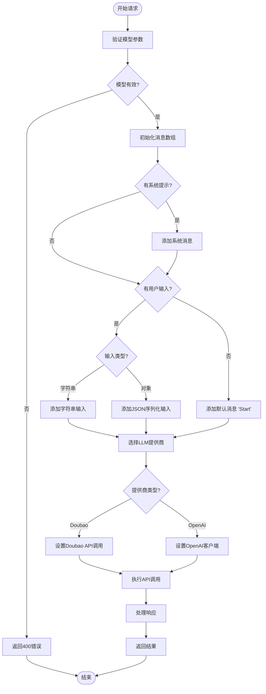
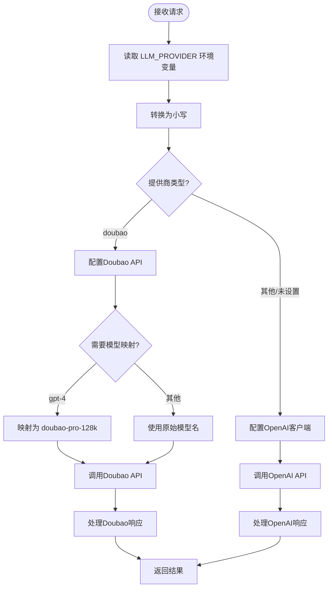
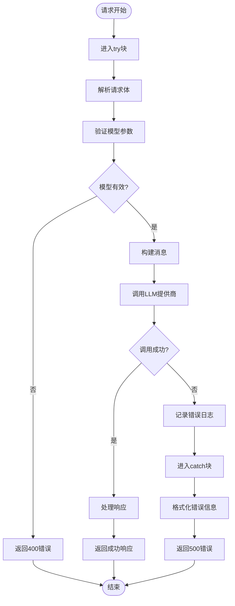
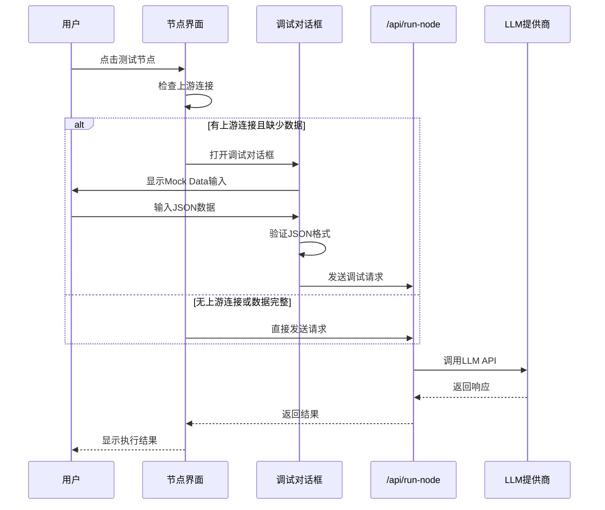

# 节点执行接口 (/api/run-node)

<cite>
**本文档中引用的文件**
- [route.ts](file://src/app/api/run-node/route.ts)
- [flow.ts](file://src/types/flow.ts)
- [executionActions.ts](file://src/store/actions/executionActions.ts)
- [NodeDebugDialog.tsx](file://src/components/flow/NodeDebugDialog.tsx)
- [ContextHUD.tsx](file://src/components/builder/ContextHUD.tsx)
- [CustomNode.tsx](file://src/components/flow/CustomNode.tsx)
- [flowStore.ts](file://src/store/flowStore.ts)
</cite>

## 目录
1. [简介](#简介)
2. [接口概述](#接口概述)
3. [输入参数](#输入参数)
4. [请求构造过程](#请求构造过程)
5. [LLM提供商路由](#llm提供商路由)
6. [响应格式](#响应格式)
7. [错误处理](#错误处理)
8. [集成使用](#集成使用)
9. [性能考量](#性能考量)
10. [调试与故障排除](#调试与故障排除)

## 简介

`/api/run-node` 是 Flash Flow SaaS 平台的核心执行引擎接口，专门用于执行单个工作流节点，特别是LLM（大型语言模型）节点。该接口提供了统一的模型调用抽象层，支持多种LLM提供商，并集成了完整的调试和错误处理机制。

该接口作为工作流执行系统的重要组成部分，负责将用户定义的工作流节点转换为实际的AI模型调用，并返回结构化的执行结果。它不仅支持标准的生产环境调用，还提供了强大的调试功能，允许开发者在不连接上游节点的情况下测试单个节点的功能。

## 接口概述

### 基本信息
- **端点路径**: `/api/run-node`
- **HTTP方法**: `POST`
- **内容类型**: `application/json`
- **用途**: 执行单个工作流节点，主要用于LLM节点的推理计算

### 核心功能特性
- **多提供商支持**: 支持OpenAI和Doubao两大主流LLM平台
- **灵活的消息构建**: 自动将系统提示和用户输入组合成标准消息格式
- **智能模型映射**: 特别针对Doubao平台的模型名称转换
- **完整的错误处理**: 提供详细的错误信息和状态码
- **调试集成**: 与节点调试对话框无缝集成

## 输入参数

### 必需参数

| 参数名 | 类型 | 描述 | 示例值 |
|--------|------|------|--------|
| `model` | string | 模型名称，指定要使用的AI模型 | `"doubao-seed-1-6-flash-250828"` 或 `"gpt-4o-mini"` |

### 可选参数

| 参数名 | 类型 | 默认值 | 描述 |
|--------|------|--------|------|
| `systemPrompt` | string | - | 系统提示词，定义模型的行为和角色 |
| `input` | string \| object | - | 用户输入内容，可以是字符串或JSON对象 |
| `temperature` | number | `0.7` | 采样温度，控制输出的创造性和随机性 |

### 参数详细说明

#### model（模型名称）
- **必需**: 是
- **作用**: 指定要使用的AI模型
- **支持的模型**:
  - **Doubao系列**: `doubao-seed-1-6-flash-250828`、`doubao-pro-128k`等
  - **OpenAI系列**: `gpt-4o-mini`、`gpt-4`等

#### systemPrompt（系统提示）
- **作用**: 定义模型的行为模式和回答风格
- **格式**: 自然语言描述，如"你是一个专业的客服助手"
- **重要性**: 影响模型的输出质量和行为特征

#### input（用户输入）
- **灵活性**: 支持字符串和复杂对象
- **自动处理**: 对非字符串输入会自动进行JSON序列化
- **默认行为**: 如果未提供输入，默认使用"Start"作为初始消息

#### temperature（采样温度）
- **取值范围**: 0.0 - 2.0
- **影响**: 
  - 较低值（0.1-0.3）产生更确定、保守的回答
  - 中等值（0.7）平衡创造性和准确性
  - 较高值（0.8-2.0）产生更具创造性和多样性的回答

**节来源**
- [route.ts](file://src/app/api/run-node/route.ts#L6-L8)

## 请求构造过程

### 消息构建流程



**图表来源**
- [route.ts](file://src/app/api/run-node/route.ts#L15-L26)

### 消息格式标准化

接口将输入参数标准化为标准的聊天消息格式：

```typescript
// 系统消息（可选）
{
  role: "system",
  content: systemPrompt
}

// 用户消息（必需）
{
  role: "user", 
  content: input || "Start"
}
```

### 输入类型处理

接口具备智能的输入类型处理能力：

1. **字符串输入**: 直接使用原始内容
2. **对象输入**: 自动转换为JSON字符串
3. **空输入**: 使用默认值"Start"

**节来源**
- [route.ts](file://src/app/api/run-node/route.ts#L15-L26)

## LLM提供商路由

### 提供商选择机制



**图表来源**
- [route.ts](file://src/app/api/run-node/route.ts#L13-L58)

### Doubao模型映射

Doubao平台具有独特的模型命名规范，接口实现了智能映射：

| OpenAI模型 | Doubao模型 | 映射规则 |
|------------|------------|----------|
| `gpt-4` | `doubao-pro-128k` | 高级模型映射 |
| 其他模型 | 保持原名 | 直接传递 |

### 环境变量配置

| 环境变量 | 用途 | 默认值 |
|----------|------|--------|
| `LLM_PROVIDER` | 指定默认LLM提供商 | `"openai"` |
| `OPENAI_API_KEY` | OpenAI API密钥 | - |
| `DOUBAO_API_KEY` | Doubao API密钥 | - |
| `DOUBAO_MODEL` | 默认Doubao模型 | `"doubao-pro-128k"` |

**节来源**
- [route.ts](file://src/app/api/run-node/route.ts#L13-L13)
- [route.ts](file://src/app/api/run-node/route.ts#L34-L34)

## 响应格式

### 成功响应

当节点成功执行时，接口返回标准的成功响应格式：

```json
{
  "response": "这是模型生成的响应内容"
}
```

### 错误响应

当执行失败时，接口返回详细的错误信息：

```json
{
  "error": "Execution failed",
  "details": "具体的错误描述信息"
}
```

### 响应处理策略

不同提供商的响应处理略有差异：

#### OpenAI响应处理
- 从 `completion.choices[0].message.content` 提取内容
- 默认为空字符串

#### Doubao响应处理
- 优先从 `data.choices[0].message.content` 获取
- 备选方案：`data.output_text`
- 最终兜底：`"Error calling Doubao"`

**节来源**
- [route.ts](file://src/app/api/run-node/route.ts#L60-L60)
- [route.ts](file://src/app/api/run-node/route.ts#L49-L49)

## 错误处理

### 错误分类与处理



**图表来源**
- [route.ts](file://src/app/api/run-node/route.ts#L61-L64)

### 错误类型

| 错误类型 | HTTP状态码 | 描述 | 处理方式 |
|----------|------------|------|----------|
| 缺少模型参数 | 400 | `model` 参数缺失 | 返回具体错误信息 |
| 提供商调用失败 | 500 | LLM提供商API调用异常 | 记录详细错误日志 |
| JSON解析错误 | 500 | 请求体JSON格式无效 | 返回格式化错误信息 |
| API密钥无效 | 500 | 认证失败 | 返回认证错误详情 |

### 错误恢复机制

1. **输入验证**: 在执行前验证所有必需参数
2. **异常捕获**: 使用try-catch确保不会抛出未处理异常
3. **日志记录**: 详细的错误日志便于问题诊断
4. **优雅降级**: 即使部分处理失败，也返回有意义的错误信息

**节来源**
- [route.ts](file://src/app/api/run-node/route.ts#L9-L11)
- [route.ts](file://src/app/api/run-node/route.ts#L61-L64)

## 集成使用

### curl调用示例

以下是使用curl调用该接口的各种场景：

#### 基础LLM调用
```bash
curl -X POST http://localhost:3000/api/run-node \
  -H "Content-Type: application/json" \
  -d '{
    "model": "doubao-seed-1-6-flash-250828",
    "systemPrompt": "你是一个专业的技术顾问",
    "input": "如何优化数据库查询性能？",
    "temperature": 0.7
  }'
```

#### 使用OpenAI模型
```bash
curl -X POST http://localhost:3000/api/run-node \
  -H "Content-Type: application/json" \
  -d '{
    "model": "gpt-4o-mini",
    "systemPrompt": "你是一个经验丰富的软件架构师",
    "input": "设计一个微服务架构的最佳实践",
    "temperature": 0.5
  }'
```

#### 复杂输入对象
```bash
curl -X POST http://localhost:3000/api/run-node \
  -H "Content-Type: application/json" \
  -d '{
    "model": "doubao-seed-1-6-flash-250828",
    "systemPrompt": "你是一个数据分析专家",
    "input": {
      "dataset": "sales_data.csv",
      "analysis_type": "trend_analysis",
      "time_period": "2024-01-01 to 2024-12-31"
    },
    "temperature": 0.8
  }'
```

### 在节点调试对话框中的集成

#### 调试对话框工作流程



**图表来源**
- [executionActions.ts](file://src/store/actions/executionActions.ts#L185-L208)
- [NodeDebugDialog.tsx](file://src/components/flow/NodeDebugDialog.tsx#L20-L28)

#### 调试功能特性

1. **上游数据检查**: 自动检测节点的上游依赖关系
2. **模拟数据输入**: 允许用户手动输入模拟数据
3. **JSON验证**: 实时验证输入的JSON格式正确性
4. **一键运行**: 确认后立即执行调试调用
5. **结果展示**: 将执行结果显示在节点上

**节来源**
- [executionActions.ts](file://src/store/actions/executionActions.ts#L185-L208)
- [NodeDebugDialog.tsx](file://src/components/flow/NodeDebugDialog.tsx#L20-L28)

## 性能考量

### 执行时间分析

根据源码中的延迟设置，接口的性能特征如下：

| 节点类型 | 延迟时间 | 说明 |
|----------|----------|------|
| LLM节点 | 1500ms | 包含网络调用和模型推理时间 |
| 其他节点 | 800ms | 简单处理逻辑的时间 |

### 性能优化策略

1. **异步处理**: 所有API调用都是异步的，避免阻塞主线程
2. **连接复用**: OpenAI客户端会复用HTTP连接
3. **超时控制**: 通过fetch API的内置超时机制保证响应性
4. **内存管理**: 及时清理临时变量和响应数据

### 并发处理能力

- **无状态设计**: 接口设计为无状态，支持高并发调用
- **资源隔离**: 每次调用独立处理，避免相互影响
- **错误隔离**: 单个请求失败不影响其他请求

### 监控指标

建议监控的关键性能指标：
- **响应时间**: 从请求到响应的总耗时
- **成功率**: 请求成功的百分比
- **错误率**: 各类错误的发生频率
- **并发数**: 同时处理的请求数量

**节来源**
- [executionActions.ts](file://src/store/actions/executionActions.ts#L204-L204)

## 调试与故障排除

### 常见问题与解决方案

#### 1. 模型参数错误

**症状**: 返回400错误，提示"Model is required"
**原因**: 请求中缺少`model`参数
**解决**: 确保请求体包含有效的`model`字段

#### 2. API密钥配置错误

**症状**: 返回500错误，提示认证失败
**原因**: 环境变量中缺少正确的API密钥
**解决**: 
- 检查`OPENAI_API_KEY`或`DOUBAO_API_KEY`环境变量
- 确认密钥格式正确且未过期

#### 3. JSON格式错误

**症状**: 调试对话框显示"Invalid JSON format"
**原因**: 输入的模拟数据不是有效的JSON格式
**解决**: 使用在线JSON验证工具检查格式

#### 4. 网络连接问题

**症状**: 请求超时或连接失败
**原因**: 网络不稳定或API服务不可用
**解决**: 
- 检查网络连接
- 验证API端点可达性
- 查看提供商的服务状态

### 调试工具和技术

#### 日志分析
```typescript
// 生产环境日志位置
console.error("Run node error:", error);
```

#### 网络抓包
使用浏览器开发者工具或网络监控工具查看：
- 请求URL和方法
- 请求头信息
- 请求体内容
- 响应状态码和内容

#### 环境变量检查
```bash
# 检查关键环境变量
echo $LLM_PROVIDER
echo $OPENAI_API_KEY
echo $DOUBAO_API_KEY
```

### 最佳实践建议

1. **渐进式调试**: 先测试简单请求，再逐步增加复杂度
2. **参数验证**: 在前端进行基本的参数验证
3. **错误处理**: 实现完善的客户端错误处理逻辑
4. **性能监控**: 监控接口的响应时间和成功率
5. **文档维护**: 保持接口文档与实际实现的一致性

**节来源**
- [route.ts](file://src/app/api/run-node/route.ts#L61-L64)
- [NodeDebugDialog.tsx](file://src/components/flow/NodeDebugDialog.tsx#L26-L26)

## 结论

`/api/run-node` 接口作为Flash Flow SaaS平台的核心组件，提供了强大而灵活的LLM节点执行能力。通过统一的接口设计，它成功地抽象了不同LLM提供商的差异，同时保持了高度的可配置性和可扩展性。

该接口的主要优势包括：
- **多提供商支持**: 无缝切换OpenAI和Doubao
- **智能调试**: 内置的调试对话框简化了开发流程
- **健壮的错误处理**: 完善的错误捕获和恢复机制
- **灵活的输入处理**: 支持多种输入格式和类型
- **性能优化**: 异步处理和合理的延迟设置

对于开发者而言，这个接口不仅是一个技术实现，更是整个工作流系统可靠性和易用性的关键保障。通过深入理解其设计原理和使用方法，可以更好地利用Flash Flow平台的强大功能，构建高质量的AI工作流应用。