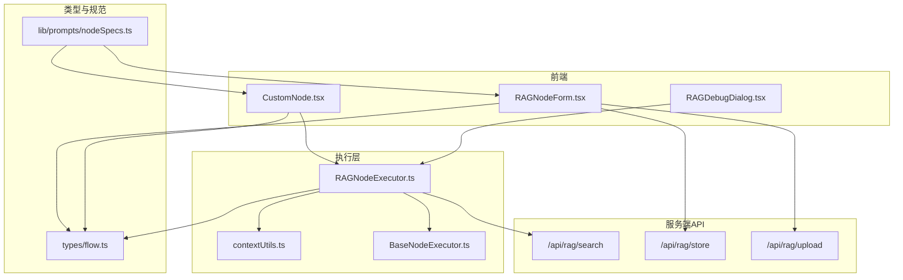
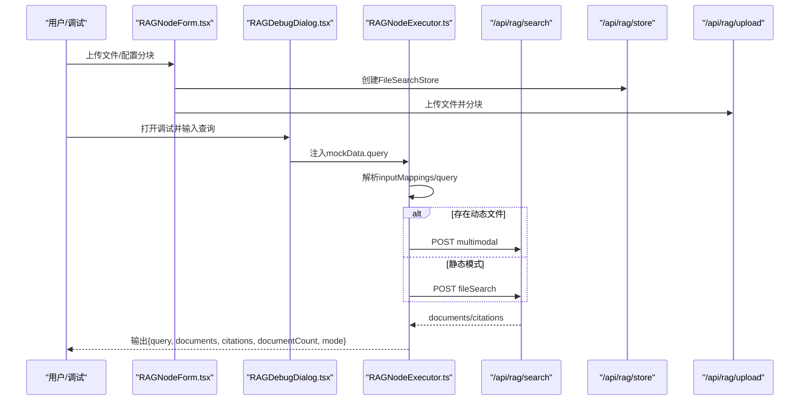
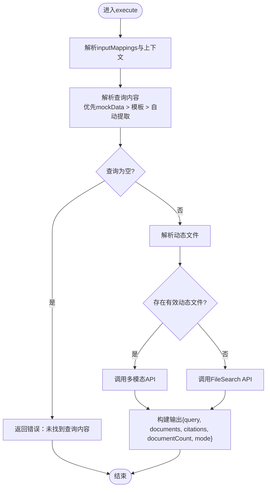
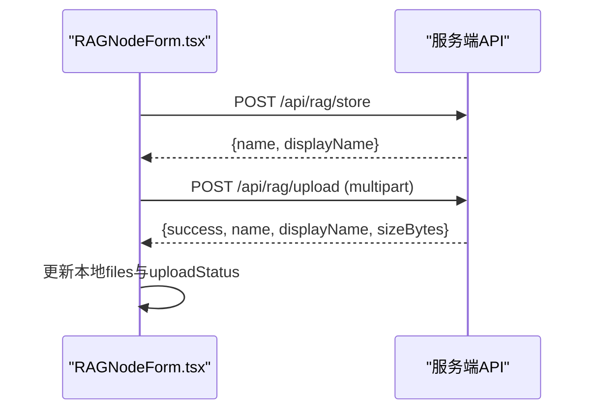
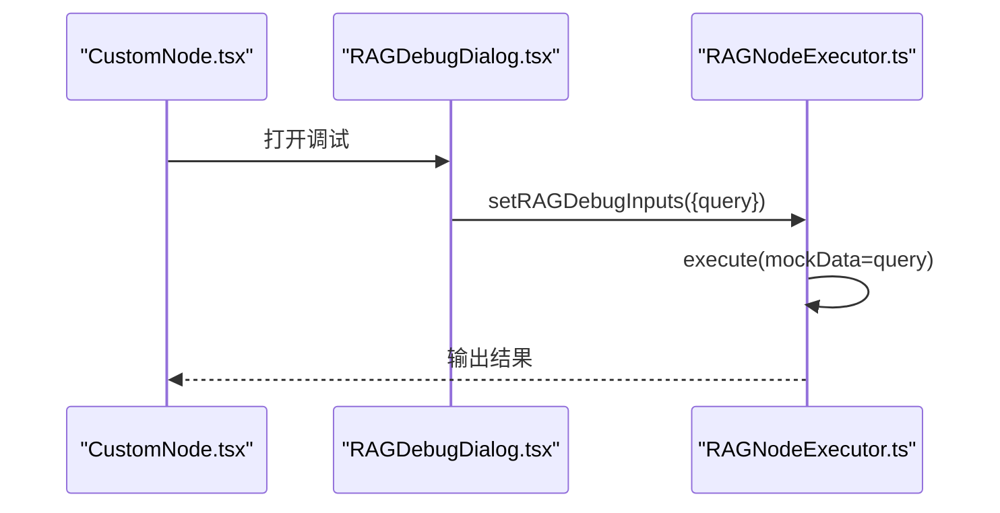
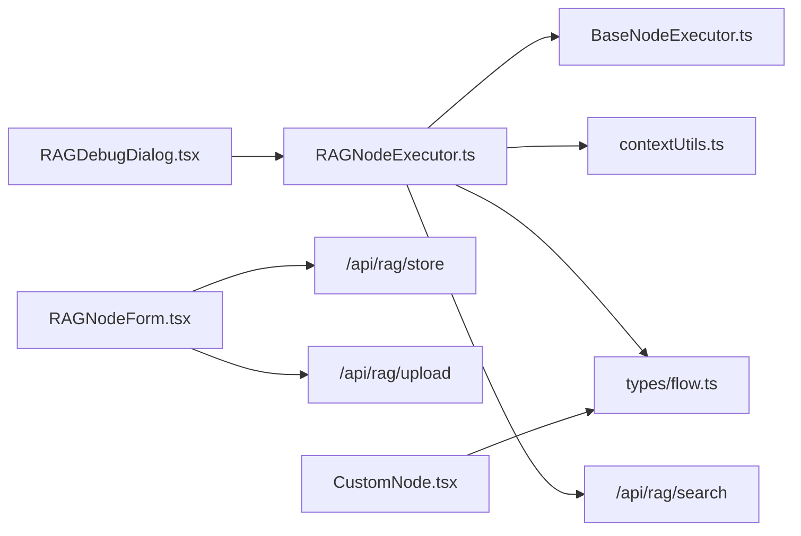

# RAG节点

<cite>
**本文引用的文件**
- [rag节点详情.md](file://docs/design/rag节点详情.md)
- [RAGNodeExecutor.ts](file://src/store/executors/RAGNodeExecutor.ts)
- [RAGNodeForm.tsx](file://src/components/builder/node-forms/RAGNodeForm.tsx)
- [search/route.ts](file://src/app/api/rag/search/route.ts)
- [store/route.ts](file://src/app/api/rag/store/route.ts)
- [upload/route.ts](file://src/app/api/rag/upload/route.ts)
- [flow.ts](file://src/types/flow.ts)
- [contextUtils.ts](file://src/store/executors/contextUtils.ts)
- [BaseNodeExecutor.ts](file://src/store/executors/BaseNodeExecutor.ts)
- [CustomNode.tsx](file://src/components/flow/CustomNode.tsx)
- [RAGDebugDialog.tsx](file://src/components/flow/RAGDebugDialog.tsx)
- [nodeSpecs.ts](file://src/lib/prompts/nodeSpecs.ts)
</cite>

## 目录
1. [简介](#简介)
2. [项目结构](#项目结构)
3. [核心组件](#核心组件)
4. [架构总览](#架构总览)
5. [详细组件分析](#详细组件分析)
6. [依赖关系分析](#依赖关系分析)
7. [性能考量](#性能考量)
8. [故障排查指南](#故障排查指南)
9. [结论](#结论)
10. [附录](#附录)

## 简介
本文件系统性阐述“RAG节点”（检索增强生成）的设计与实现，覆盖从工作流编排、节点执行、服务端API到前端表单与调试交互的全链路。RAG节点支持两种模式：
- 静态模式：使用预配置的知识库（File Search Store）进行检索。
- 动态模式：从上游节点引用用户上传的文件，直接调用多模态能力进行问答。

RAG节点通过变量模板解析、动态文件过滤与服务端API调用，实现灵活、安全、可调试的工作流执行。

## 项目结构
围绕RAG节点的关键文件分布如下：
- 设计文档：docs/design/rag节点详情.md
- 执行器：src/store/executors/RAGNodeExecutor.ts
- 前端表单：src/components/builder/node-forms/RAGNodeForm.tsx
- 服务端API：
  - 检索：src/app/api/rag/search/route.ts
  - 创建Store：src/app/api/rag/store/route.ts
  - 上传文件：src/app/api/rag/upload/route.ts
- 类型定义：src/types/flow.ts
- 上下文工具：src/store/executors/contextUtils.ts
- 基类执行器：src/store/executors/BaseNodeExecutor.ts
- 可视化节点：src/components/flow/CustomNode.tsx
- 调试对话框：src/components/flow/RAGDebugDialog.tsx
- 节点规范：src/lib/prompts/nodeSpecs.ts



**图表来源**
- [RAGNodeForm.tsx](file://src/components/builder/node-forms/RAGNodeForm.tsx#L1-L307)
- [RAGNodeExecutor.ts](file://src/store/executors/RAGNodeExecutor.ts#L1-L272)
- [search/route.ts](file://src/app/api/rag/search/route.ts#L1-L223)
- [store/route.ts](file://src/app/api/rag/store/route.ts#L1-L69)
- [upload/route.ts](file://src/app/api/rag/upload/route.ts#L1-L118)
- [flow.ts](file://src/types/flow.ts#L1-L342)
- [contextUtils.ts](file://src/store/executors/contextUtils.ts#L1-L182)
- [BaseNodeExecutor.ts](file://src/store/executors/BaseNodeExecutor.ts#L1-L26)
- [CustomNode.tsx](file://src/components/flow/CustomNode.tsx#L1-L397)
- [RAGDebugDialog.tsx](file://src/components/flow/RAGDebugDialog.tsx#L1-L96)
- [nodeSpecs.ts](file://src/lib/prompts/nodeSpecs.ts#L1-L192)

**章节来源**
- [rag节点详情.md](file://docs/design/rag节点详情.md#L1-L501)
- [RAGNodeExecutor.ts](file://src/store/executors/RAGNodeExecutor.ts#L1-L272)
- [RAGNodeForm.tsx](file://src/components/builder/node-forms/RAGNodeForm.tsx#L1-L307)
- [search/route.ts](file://src/app/api/rag/search/route.ts#L1-L223)
- [store/route.ts](file://src/app/api/rag/store/route.ts#L1-L69)
- [upload/route.ts](file://src/app/api/rag/upload/route.ts#L1-L118)
- [flow.ts](file://src/types/flow.ts#L1-L342)
- [contextUtils.ts](file://src/store/executors/contextUtils.ts#L1-L182)
- [BaseNodeExecutor.ts](file://src/store/executors/BaseNodeExecutor.ts#L1-L26)
- [CustomNode.tsx](file://src/components/flow/CustomNode.tsx#L1-L397)
- [RAGDebugDialog.tsx](file://src/components/flow/RAGDebugDialog.tsx#L1-L96)
- [nodeSpecs.ts](file://src/lib/prompts/nodeSpecs.ts#L1-L192)

## 核心组件
- RAG节点数据结构：包含文件列表、File Search Store信息、分块配置、上传状态与执行结果等字段。
- RAG执行器：负责解析输入映射、选择模式、调用服务端API并返回统一输出。
- 前端表单：负责自动创建Store、上传文件、配置分块参数与展示上传状态。
- 服务端API：提供创建Store、上传文件、检索（静态/动态）能力，并进行鉴权与参数校验。
- 调试对话框：在节点测试时注入mockData，覆盖查询内容以快速验证。
- 可视化节点：展示RAG节点的元数据（知识库数量、分块大小）与执行状态。

**章节来源**
- [flow.ts](file://src/types/flow.ts#L32-L49)
- [RAGNodeExecutor.ts](file://src/store/executors/RAGNodeExecutor.ts#L73-L271)
- [RAGNodeForm.tsx](file://src/components/builder/node-forms/RAGNodeForm.tsx#L1-L307)
- [search/route.ts](file://src/app/api/rag/search/route.ts#L1-L223)
- [RAGDebugDialog.tsx](file://src/components/flow/RAGDebugDialog.tsx#L1-L96)
- [CustomNode.tsx](file://src/components/flow/CustomNode.tsx#L120-L160)

## 架构总览
RAG节点的执行链路由“前端表单/调试”触发，经“执行器”解析上下文与模板，再调用“服务端API”，最终返回统一输出格式。



**图表来源**
- [RAGNodeForm.tsx](file://src/components/builder/node-forms/RAGNodeForm.tsx#L27-L82)
- [upload/route.ts](file://src/app/api/rag/upload/route.ts#L1-L118)
- [RAGDebugDialog.tsx](file://src/components/flow/RAGDebugDialog.tsx#L1-L96)
- [RAGNodeExecutor.ts](file://src/store/executors/RAGNodeExecutor.ts#L73-L271)
- [search/route.ts](file://src/app/api/rag/search/route.ts#L36-L223)

## 详细组件分析

### 执行器：RAGNodeExecutor
- 职责
  - 解析输入映射与变量模板，支持节点ID/标签/直接字段三种查找路径。
  - 依据是否存在动态文件决定模式：动态（多模态）或静态（File Search）。
  - 统一错误处理与执行耗时统计。
- 关键流程
  - 查询解析优先级：mockData.query > inputMappings.query > 自动从上下文提取。
  - 动态文件解析：过滤含有效url的对象，支持单对象自动包装为数组。
  - 模式选择：若存在有效动态文件则走多模态；否则走静态模式并校验Store与文件列表。
  - 输出格式：统一包含query、documents、citations、documentCount、mode；失败时返回error字段。



**图表来源**
- [RAGNodeExecutor.ts](file://src/store/executors/RAGNodeExecutor.ts#L73-L271)
- [contextUtils.ts](file://src/store/executors/contextUtils.ts#L119-L123)

**章节来源**
- [RAGNodeExecutor.ts](file://src/store/executors/RAGNodeExecutor.ts#L1-L272)
- [contextUtils.ts](file://src/store/executors/contextUtils.ts#L1-L182)

### 前端表单：RAGNodeForm
- 自动创建Store：首次渲染时若未配置Store名称，自动创建并回填名称与显示ID。
- 上传流程：逐文件上传至Store，支持进度回调与错误回填；成功后合并到本地files列表。
- 分块配置：滑条控制maxTokensPerChunk与maxOverlapTokens，影响静态分块质量与召回。
- UI状态：idle/uploading/processing/completed/error五态图标提示。



**图表来源**
- [RAGNodeForm.tsx](file://src/components/builder/node-forms/RAGNodeForm.tsx#L27-L172)
- [store/route.ts](file://src/app/api/rag/store/route.ts#L1-L69)
- [upload/route.ts](file://src/app/api/rag/upload/route.ts#L1-L118)

**章节来源**
- [RAGNodeForm.tsx](file://src/components/builder/node-forms/RAGNodeForm.tsx#L1-L307)
- [store/route.ts](file://src/app/api/rag/store/route.ts#L1-L69)
- [upload/route.ts](file://src/app/api/rag/upload/route.ts#L1-L118)

### 服务端API：检索、Store、上传
- 检索API
  - 静态模式：向Google GenAI发起带工具配置的生成请求，返回documents与citations。
  - 动态模式：下载文件为Base64，构造多模态parts并请求生成，返回AI生成的回答与引用。
  - 错误处理：鉴权失败、API Key缺失、查询为空、Store未指定、文件为空、模式无效等。
- Store API：创建FileSearchStore并返回名称与创建时间。
- 上传API：校验文件大小（≤100MB），上传并分块，轮询操作完成状态，返回文件元信息。

```mermaid
classDiagram
class SearchAPI {
+POST /api/rag/search
-mode : fileSearch|multimodal
-query : string
-fileSearchStoreName? : string
-files? : Array
+返回 : {documents, citations?}
}
class StoreAPI {
+POST /api/rag/store
-displayName : string
+返回 : {name, displayName, createTime}
}
class UploadAPI {
+POST /api/rag/upload
-file : File
-fileSearchStoreName : string
-maxTokensPerChunk : number
-maxOverlapTokens : number
+返回 : {success, name, displayName, sizeBytes}
}
SearchAPI ..> StoreAPI : "静态模式依赖"
SearchAPI ..> UploadAPI : "动态模式依赖"
```

**图表来源**
- [search/route.ts](file://src/app/api/rag/search/route.ts#L1-L223)
- [store/route.ts](file://src/app/api/rag/store/route.ts#L1-L69)
- [upload/route.ts](file://src/app/api/rag/upload/route.ts#L1-L118)

**章节来源**
- [search/route.ts](file://src/app/api/rag/search/route.ts#L1-L223)
- [store/route.ts](file://src/app/api/rag/store/route.ts#L1-L69)
- [upload/route.ts](file://src/app/api/rag/upload/route.ts#L1-L118)

### 可视化与调试
- 可视化节点：展示知识库数量与分块大小，执行完成后显示耗时。
- 调试对话框：在节点测试时注入mockData.query，覆盖模板解析，便于快速验证。



**图表来源**
- [CustomNode.tsx](file://src/components/flow/CustomNode.tsx#L248-L263)
- [RAGDebugDialog.tsx](file://src/components/flow/RAGDebugDialog.tsx#L1-L96)
- [RAGNodeExecutor.ts](file://src/store/executors/RAGNodeExecutor.ts#L73-L113)

**章节来源**
- [CustomNode.tsx](file://src/components/flow/CustomNode.tsx#L120-L160)
- [RAGDebugDialog.tsx](file://src/components/flow/RAGDebugDialog.tsx#L1-L96)

## 依赖关系分析
- 执行器依赖
  - BaseNodeExecutor：提供执行耗时测量与延迟工具。
  - contextUtils：提供自动提取上游文本的能力，作为查询解析的降级路径。
  - types/flow：提供RAGNodeData与AppNode等类型定义。
- 前端表单依赖
  - 服务端API：创建Store与上传文件。
  - 类型定义：RAGNodeData字段与上传状态。
- 服务端API依赖
  - Google GenAI SDK：调用检索与文件处理能力。
  - 鉴权：统一鉴权检查与API Key校验。



**图表来源**
- [RAGNodeExecutor.ts](file://src/store/executors/RAGNodeExecutor.ts#L1-L272)
- [BaseNodeExecutor.ts](file://src/store/executors/BaseNodeExecutor.ts#L1-L26)
- [contextUtils.ts](file://src/store/executors/contextUtils.ts#L1-L182)
- [flow.ts](file://src/types/flow.ts#L1-L342)
- [RAGNodeForm.tsx](file://src/components/builder/node-forms/RAGNodeForm.tsx#L1-L307)
- [search/route.ts](file://src/app/api/rag/search/route.ts#L1-L223)
- [CustomNode.tsx](file://src/components/flow/CustomNode.tsx#L1-L397)
- [RAGDebugDialog.tsx](file://src/components/flow/RAGDebugDialog.tsx#L1-L96)

**章节来源**
- [RAGNodeExecutor.ts](file://src/store/executors/RAGNodeExecutor.ts#L1-L272)
- [BaseNodeExecutor.ts](file://src/store/executors/BaseNodeExecutor.ts#L1-L26)
- [contextUtils.ts](file://src/store/executors/contextUtils.ts#L1-L182)
- [flow.ts](file://src/types/flow.ts#L1-L342)
- [RAGNodeForm.tsx](file://src/components/builder/node-forms/RAGNodeForm.tsx#L1-L307)
- [search/route.ts](file://src/app/api/rag/search/route.ts#L1-L223)
- [CustomNode.tsx](file://src/components/flow/CustomNode.tsx#L1-L397)
- [RAGDebugDialog.tsx](file://src/components/flow/RAGDebugDialog.tsx#L1-L96)

## 性能考量
- 执行耗时：执行器内置耗时测量，可在节点底部显示执行时间，便于优化。
- 分块策略：maxTokensPerChunk与maxOverlapTokens直接影响召回质量与性能，建议结合文档规模与查询复杂度调整。
- 上传与处理：上传API采用Node.js运行时与轮询操作完成，适合大文件处理；建议控制并发与重试策略。
- 多模态请求：动态模式下对每个文件进行下载与Base64编码，建议限制文件数量与大小，避免请求膨胀。

[本节为通用指导，无需特定文件来源]

## 故障排查指南
- 常见错误与定位
  - 未配置API Key：服务端返回“Gemini API Key 未配置”，检查环境变量。
  - 未提供文件：上传API返回“未提供文件”或“未指定 FileSearchStore”，检查表单字段与Store名称。
  - 查询为空：检索API返回“查询内容不能为空”，检查inputMappings.query或调试输入。
  - 文件过大：上传API返回“文件大小超过限制”，调整文件大小或拆分。
  - 无效模式：检索API返回“无效的搜索模式”，确认mode参数。
- 前端状态
  - 上传状态：idle/uploading/processing/completed/error，关注错误提示与重试。
  - 节点状态：可视化节点显示执行状态与耗时，便于定位卡顿环节。
- 调试技巧
  - 使用调试对话框注入mockData.query，快速验证查询解析与输出格式。
  - 若自动提取失败，手动在上游节点提供text/response/user_input/query等字段。

**章节来源**
- [search/route.ts](file://src/app/api/rag/search/route.ts#L44-L61)
- [upload/route.ts](file://src/app/api/rag/upload/route.ts#L38-L58)
- [RAGNodeExecutor.ts](file://src/store/executors/RAGNodeExecutor.ts#L91-L113)
- [RAGNodeForm.tsx](file://src/components/builder/node-forms/RAGNodeForm.tsx#L112-L172)
- [CustomNode.tsx](file://src/components/flow/CustomNode.tsx#L340-L346)
- [RAGDebugDialog.tsx](file://src/components/flow/RAGDebugDialog.tsx#L1-L96)

## 结论
RAG节点通过清晰的模式选择、灵活的变量模板解析与完善的前后端协作，实现了从静态知识库检索到动态文件问答的统一能力。配合调试与可视化工具，开发者可以高效地构建与优化基于RAG的工作流。

[本节为总结，无需特定文件来源]

## 附录
- 节点参数与模式配置参考：节点规范文档中对RAG节点的参数限制、模式配置与输出变量进行了明确说明。
- 类型定义：RAGNodeData字段涵盖文件、Store、分块配置与上传状态，确保前后端一致的数据契约。

**章节来源**
- [nodeSpecs.ts](file://src/lib/prompts/nodeSpecs.ts#L110-L132)
- [flow.ts](file://src/types/flow.ts#L32-L49)