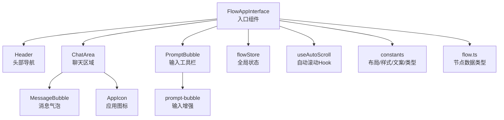
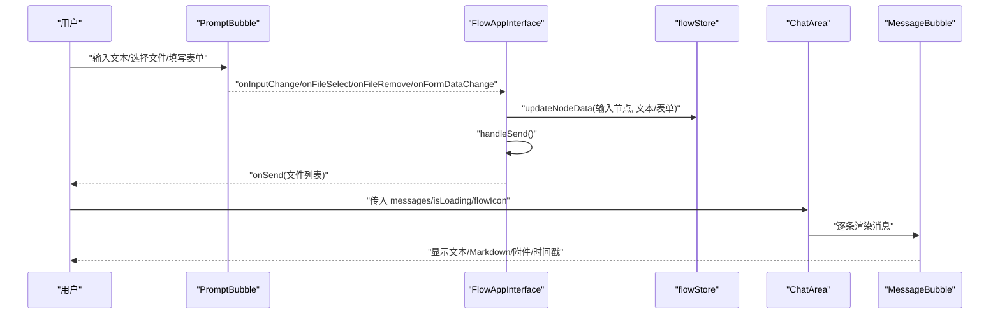
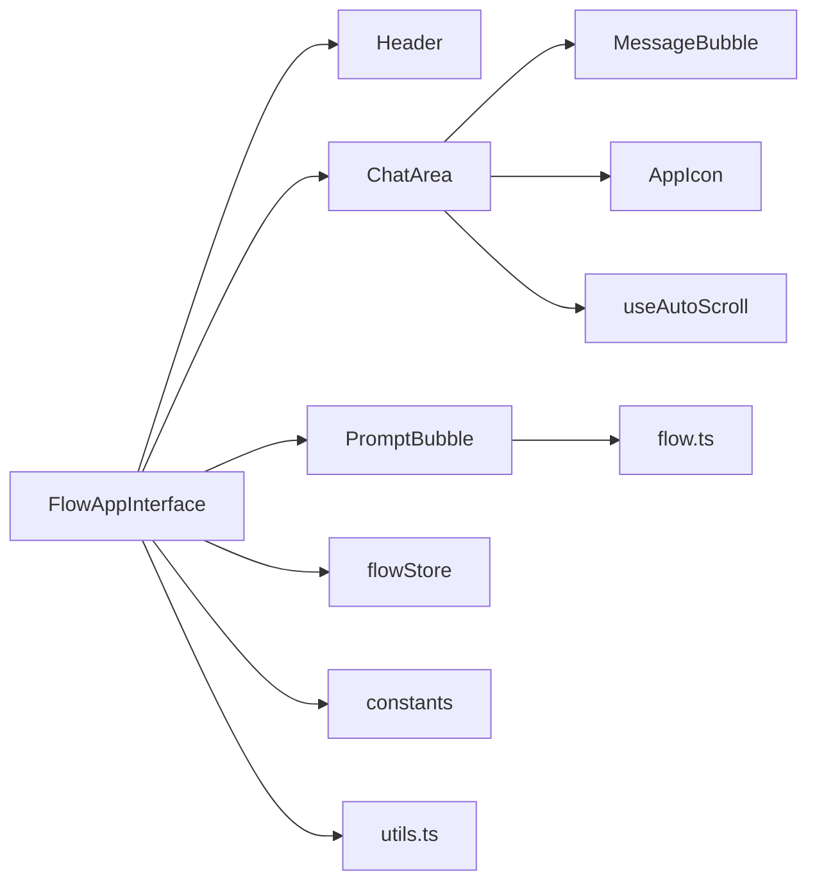
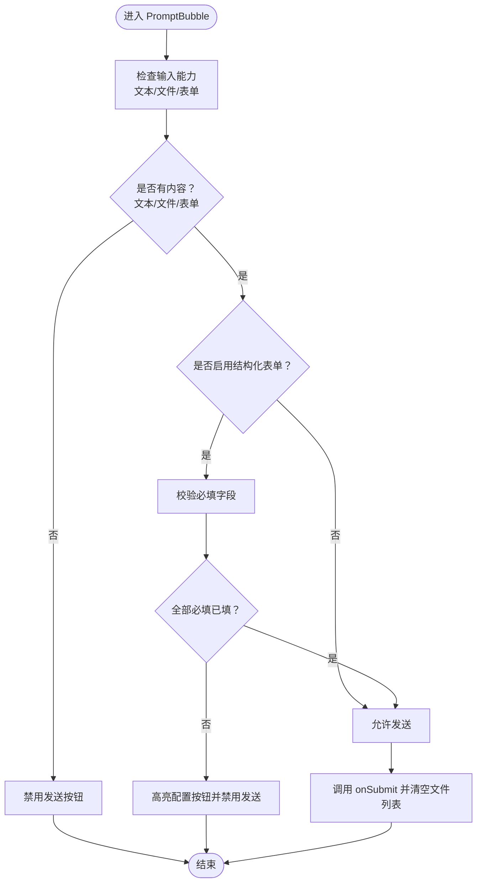

# FlowAppInterface 组件重构

<cite>
**本文引用的文件**
- [index.tsx](file://src/components/apps/FlowAppInterface/index.tsx)
- [ChatArea.tsx](file://src/components/apps/FlowAppInterface/ChatArea.tsx)
- [Header.tsx](file://src/components/apps/FlowAppInterface/Header.tsx)
- [MessageBubble.tsx](file://src/components/apps/FlowAppInterface/MessageBubble.tsx)
- [AppIcon.tsx](file://src/components/apps/FlowAppInterface/AppIcon.tsx)
- [constants.ts](file://src/components/apps/FlowAppInterface/constants.ts)
- [prompt-bubble.tsx](file://src/components/ui/prompt-bubble.tsx)
- [flow.ts](file://src/types/flow.ts)
- [flowStore.ts](file://src/store/flowStore.ts)
- [useAutoScroll.ts](file://src/hooks/useAutoScroll.ts)
- [utils.ts](file://src/lib/utils.ts)
</cite>

## 目录
1. [简介](#简介)
2. [项目结构](#项目结构)
3. [核心组件](#核心组件)
4. [架构总览](#架构总览)
5. [详细组件分析](#详细组件分析)
6. [依赖关系分析](#依赖关系分析)
7. [性能考量](#性能考量)
8. [故障排查指南](#故障排查指南)
9. [结论](#结论)
10. [附录](#附录)

## 简介
本文件围绕 FlowAppInterface 组件进行系统化重构与文档化说明，目标是在不改变现有功能的前提下，提升组件的可维护性、可扩展性与可测试性，并明确各子组件职责边界、数据流与交互流程。FlowAppInterface 是应用模式下的主界面，提供聊天交互体验，包含头部导航、聊天区域、消息气泡以及输入工具栏等模块；同时通过 Store 与节点数据联动，支持结构化表单、文件上传与实时表单数据同步。

## 项目结构
FlowAppInterface 组件位于 src/components/apps/FlowAppInterface 下，采用按功能拆分的组织方式：
- 入口组件：index.tsx，负责整合 Header、ChatArea 与 PromptBubble，协调输入、发送、文件选择与表单数据同步。
- 子组件：Header、ChatArea、MessageBubble、AppIcon，分别承担头部导航、聊天区域、消息展示与图标渲染。
- 常量与类型：constants.ts 定义布局、样式、文案与类型声明。
- 依赖与类型：flow.ts 定义节点数据结构（含 InputNodeData），flowStore.ts 提供全局状态访问，useAutoScroll.ts 提供智能滚动能力，prompt-bubble.ts 提供输入增强（文件预览、结构化表单、发送控制）。

图表来源
- [index.tsx](file://src/components/apps/FlowAppInterface/index.tsx#L1-L95)
- [Header.tsx](file://src/components/apps/FlowAppInterface/Header.tsx#L1-L68)
- [ChatArea.tsx](file://src/components/apps/FlowAppInterface/ChatArea.tsx#L1-L112)
- [MessageBubble.tsx](file://src/components/apps/FlowAppInterface/MessageBubble.tsx#L1-L108)
- [AppIcon.tsx](file://src/components/apps/FlowAppInterface/AppIcon.tsx#L1-L48)
- [prompt-bubble.tsx](file://src/components/ui/prompt-bubble.tsx#L1-L372)
- [flowStore.ts](file://src/store/flowStore.ts#L1-L49)
- [flow.ts](file://src/types/flow.ts#L1-L309)
- [useAutoScroll.ts](file://src/hooks/useAutoScroll.ts#L1-L107)
- [constants.ts](file://src/components/apps/FlowAppInterface/constants.ts#L1-L90)

章节来源
- [index.tsx](file://src/components/apps/FlowAppInterface/index.tsx#L1-L95)
- [constants.ts](file://src/components/apps/FlowAppInterface/constants.ts#L1-L90)

## 核心组件
- FlowAppInterface（入口）：聚合 Header、ChatArea 与 PromptBubble，管理输入、发送、文件选择与表单数据同步，读取 Input 节点配置并更新节点数据。
- Header：显示应用标题、图标与操作按钮（关闭、首页、新建对话）。
- ChatArea：渲染消息列表、空状态与加载指示，集成智能滚动。
- MessageBubble：渲染用户/助手消息，支持 Markdown 渲染、文件附件与时间戳显示。
- AppIcon：根据配置渲染图片、Lucide 图标或 Emoji 图标。
- PromptBubble：增强输入体验，支持文件预览、结构化表单弹窗、必填校验与发送控制。

章节来源
- [index.tsx](file://src/components/apps/FlowAppInterface/index.tsx#L1-L95)
- [Header.tsx](file://src/components/apps/FlowAppInterface/Header.tsx#L1-L68)
- [ChatArea.tsx](file://src/components/apps/FlowAppInterface/ChatArea.tsx#L1-L112)
- [MessageBubble.tsx](file://src/components/apps/FlowAppInterface/MessageBubble.tsx#L1-L108)
- [AppIcon.tsx](file://src/components/apps/FlowAppInterface/AppIcon.tsx#L1-L48)
- [prompt-bubble.tsx](file://src/components/ui/prompt-bubble.tsx#L1-L372)

## 架构总览
FlowAppInterface 的运行时数据流如下：
- 输入层：用户在 PromptBubble 中输入文本、选择文件、填写结构化表单。
- 状态层：FlowAppInterface 将输入与文件选择状态传递给外部回调 onSend/onInputChange/onFileSelect/onFileRemove/onFormDataChange；同时读取 Input 节点配置，调用 flowStore.updateNodeData 实时更新节点数据。
- 展示层：ChatArea 根据 messages、isLoading、flowIcon 渲染消息与空状态；MessageBubble 渲染内容与附件；AppIcon 根据配置渲染头像。
- 交互层：Header 提供关闭、首页与新建对话操作；useAutoScroll 在消息变化时智能滚动至底部。

图表来源
- [index.tsx](file://src/components/apps/FlowAppInterface/index.tsx#L1-L95)
- [prompt-bubble.tsx](file://src/components/ui/prompt-bubble.tsx#L1-L372)
- [ChatArea.tsx](file://src/components/apps/FlowAppInterface/ChatArea.tsx#L1-L112)
- [MessageBubble.tsx](file://src/components/apps/FlowAppInterface/MessageBubble.tsx#L1-L108)
- [flowStore.ts](file://src/store/flowStore.ts#L1-L49)

## 详细组件分析

### FlowAppInterface 入口组件
- 职责：整合 Header、ChatArea 与 PromptBubble；从 flowStore 读取 nodes 并定位 Input 节点；在发送前更新 Input 节点数据；协调文件选择与表单数据同步。
- 关键行为：
  - 查找 Input 节点并读取 InputNodeData。
  - handleSend：更新 Input 节点文本与表单数据，调用外部 onSend 并清空已选文件。
  - handleFileSelect/handleFileRemove：维护本地 selectedFiles 列表。
  - 将 inputNodeData 透传给 PromptBubble，实现“配置参数”按钮与表单联动。
- 性能与可维护性建议：
  - 将 Input 节点查找逻辑抽取为独立 Hook，便于复用与测试。
  - 将文件上传与 URL 回传逻辑外置，避免在组件中直接处理网络请求细节。
  - 将“发送”动作拆分为更细粒度的 Action，便于单元测试。

章节来源
- [index.tsx](file://src/components/apps/FlowAppInterface/index.tsx#L1-L95)
- [flowStore.ts](file://src/store/flowStore.ts#L1-L49)
- [flow.ts](file://src/types/flow.ts#L1-L309)

### Header 头部导航
- 职责：显示应用标题与图标，提供关闭、首页与新建对话按钮。
- 设计要点：按钮样式与文案来自 constants；可选回调由父组件注入。
- 可重构点：将按钮文案与样式进一步抽象为可配置项，便于主题化。

章节来源
- [Header.tsx](file://src/components/apps/FlowAppInterface/Header.tsx#L1-L68)
- [constants.ts](file://src/components/apps/FlowAppInterface/constants.ts#L1-L90)

### ChatArea 聊天区域
- 职责：渲染消息列表、空状态与加载指示；集成 useAutoScroll 实现智能滚动。
- 空状态：当无消息且 Input 节点启用结构化表单时，动态提示必填字段名称。
- 加载指示：显示三个跳动圆点，表示 AI 正在思考。
- 可重构点：将 EmptyState 与 LoadingIndicator 抽离为独立组件，便于主题化与测试；将滚动阈值与行为参数化。

章节来源
- [ChatArea.tsx](file://src/components/apps/FlowAppInterface/ChatArea.tsx#L1-L112)
- [useAutoScroll.ts](file://src/hooks/useAutoScroll.ts#L1-L107)
- [constants.ts](file://src/components/apps/FlowAppInterface/constants.ts#L1-L90)

### MessageBubble 消息气泡
- 职责：渲染用户/助手消息，支持 Markdown 内容、文件附件列表与时间戳显示。
- 时间戳格式化：根据日期差异显示“今天/昨天/日期+时间”，并在鼠标悬停时显示。
- 文件附件：根据文件扩展名映射图标，展示文件名与大小。
- 可重构点：将 Markdown 渲染封装为独立组件；将时间戳格式化逻辑抽取为工具函数。

章节来源
- [MessageBubble.tsx](file://src/components/apps/FlowAppInterface/MessageBubble.tsx#L1-L108)
- [constants.ts](file://src/components/apps/FlowAppInterface/constants.ts#L1-L90)

### AppIcon 应用图标
- 职责：根据配置渲染图片、Lucide 图标或 Emoji；默认回退为 Bot 图标。
- 可扩展性：通过 ICON_MAP 与 DEFAULT_ICON 支持更多图标类型。
- 可重构点：将图标映射与默认图标配置集中管理，便于主题化与扩展。

章节来源
- [AppIcon.tsx](file://src/components/apps/FlowAppInterface/AppIcon.tsx#L1-L48)
- [constants.ts](file://src/components/apps/FlowAppInterface/constants.ts#L1-L90)

### PromptBubble 输入工具栏
- 职责：增强输入体验，支持文件预览、结构化表单弹窗、必填校验与发送控制。
- 结构化表单：根据 InputNodeData.formFields 渲染 Select/MultiSelect/Text 字段，支持默认值与必填校验。
- 文件上传：根据 fileConfig 控制允许类型、最大数量与大小，支持预览与移除。
- 发送控制：根据是否启用文本输入、是否有文件或表单内容决定 canSubmit。
- 可重构点：将表单字段渲染与校验逻辑抽取为独立 Hook；将文件上传逻辑外置为 Service。

章节来源
- [prompt-bubble.tsx](file://src/components/ui/prompt-bubble.tsx#L1-L372)
- [flow.ts](file://src/types/flow.ts#L1-L309)

## 依赖关系分析
- 组件间依赖：
  - FlowAppInterface 依赖 Header、ChatArea、PromptBubble；ChatArea 依赖 MessageBubble 与 AppIcon；PromptBubble 依赖 UI 组件库与 flow.ts 类型。
- 状态依赖：
  - FlowAppInterface 通过 flowStore 访问 nodes 并更新 Input 节点数据；useAutoScroll 依赖 messages/isLoading 等依赖数组。
- 工具依赖：
  - cn 工具函数用于类名合并；ICON_MAP/DEFAULT_ICON/STYLES/UI_TEXT 等来自 constants。

图表来源
- [index.tsx](file://src/components/apps/FlowAppInterface/index.tsx#L1-L95)
- [Header.tsx](file://src/components/apps/FlowAppInterface/Header.tsx#L1-L68)
- [ChatArea.tsx](file://src/components/apps/FlowAppInterface/ChatArea.tsx#L1-L112)
- [MessageBubble.tsx](file://src/components/apps/FlowAppInterface/MessageBubble.tsx#L1-L108)
- [AppIcon.tsx](file://src/components/apps/FlowAppInterface/AppIcon.tsx#L1-L48)
- [prompt-bubble.tsx](file://src/components/ui/prompt-bubble.tsx#L1-L372)
- [flowStore.ts](file://src/store/flowStore.ts#L1-L49)
- [flow.ts](file://src/types/flow.ts#L1-L309)
- [useAutoScroll.ts](file://src/hooks/useAutoScroll.ts#L1-L107)
- [utils.ts](file://src/lib/utils.ts#L1-L7)
- [constants.ts](file://src/components/apps/FlowAppInterface/constants.ts#L1-L90)

章节来源
- [flowStore.ts](file://src/store/flowStore.ts#L1-L49)
- [flow.ts](file://src/types/flow.ts#L1-L309)
- [useAutoScroll.ts](file://src/hooks/useAutoScroll.ts#L1-L107)
- [utils.ts](file://src/lib/utils.ts#L1-L7)

## 性能考量
- 滚动性能：useAutoScroll 通过事件节流与阈值判断减少不必要的滚动计算，仅在用户未主动滚动时自动滚动至底部。
- 渲染优化：MessageBubble 对时间戳显示采用悬停控制透明度过渡，避免频繁重排；PromptBubble 对表单字段渲染使用稳定依赖键，避免无效重渲染。
- 数据同步：FlowAppInterface 在发送前更新 Input 节点数据，避免重复计算与状态漂移。
- 可选优化：
  - 将 ChatArea 的消息列表改为虚拟滚动，适用于长对话场景。
  - 将 PromptBubble 的表单字段渲染与校验逻辑缓存，减少重复计算。
  - 将文件上传与 URL 回传逻辑异步化，避免阻塞 UI。

[本节为通用性能讨论，无需列出具体文件来源]

## 故障排查指南
- 发送按钮不可用
  - 检查 PromptBubble 的 canSubmit 判断：是否启用了结构化表单且存在必填字段未填写；是否启用了文本输入但无内容且无文件/表单。
  - 确认 onFormDataChange 是否正确触发并更新 Input 节点数据。
- 文件上传异常
  - 检查 fileConfig 的 allowedTypes/maxCount/maxSizeMB 设置是否合理；确认 handleFileSelect 的错误提示逻辑。
- 消息未自动滚动
  - 检查 useAutoScroll 的依赖数组与阈值设置；确认用户是否主动滚动导致暂停。
- 图标显示异常
  - 检查 FlowIconConfig 的 kind/name/url 配置；确认 ICON_MAP 与 DEFAULT_ICON 的映射关系。

章节来源
- [prompt-bubble.tsx](file://src/components/ui/prompt-bubble.tsx#L1-L372)
- [ChatArea.tsx](file://src/components/apps/FlowAppInterface/ChatArea.tsx#L1-L112)
- [useAutoScroll.ts](file://src/hooks/useAutoScroll.ts#L1-L107)
- [AppIcon.tsx](file://src/components/apps/FlowAppInterface/AppIcon.tsx#L1-L48)

## 结论
FlowAppInterface 组件通过清晰的职责划分与合理的状态管理，实现了良好的聊天交互体验。建议在保持现有功能不变的基础上，进一步抽取可复用逻辑（如 Input 节点查找、文件上传服务、表单校验 Hook）、增强可测试性（通过更细粒度的 Action 与 Hook），并引入虚拟滚动与异步上传等优化手段，以提升整体性能与可维护性。

[本节为总结性内容，无需列出具体文件来源]

## 附录
- 类型与常量
  - FlowIconConfig：支持 emoji/lucide/image 三种图标类型。
  - Message：包含 role/content/files/timestamp。
  - FlowAppInterfaceProps：定义入口组件对外暴露的属性与回调。
  - LAYOUT/STYLES/ANIMATION/UI_TEXT：统一布局、样式、动画与文案。
- 关键流程图：发送消息的决策流程

图表来源
- [prompt-bubble.tsx](file://src/components/ui/prompt-bubble.tsx#L1-L372)
- [index.tsx](file://src/components/apps/FlowAppInterface/index.tsx#L1-L95)