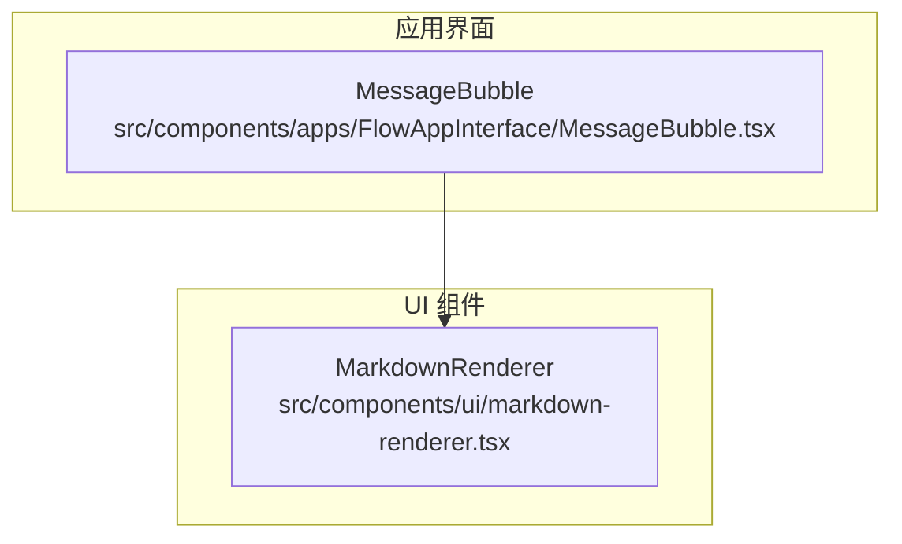
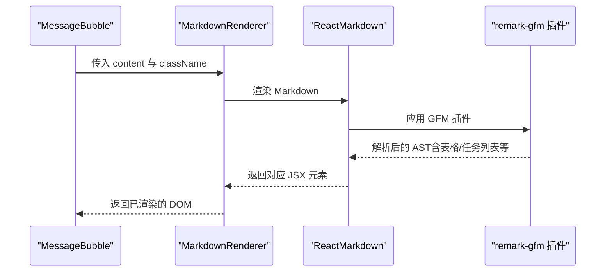
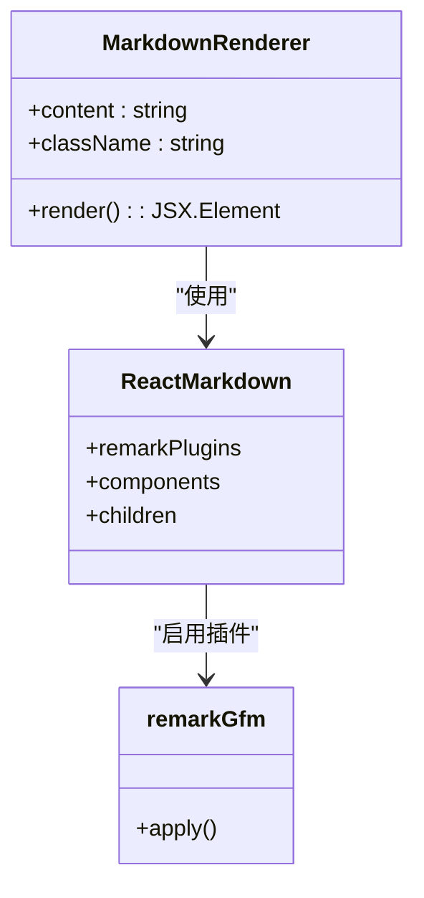
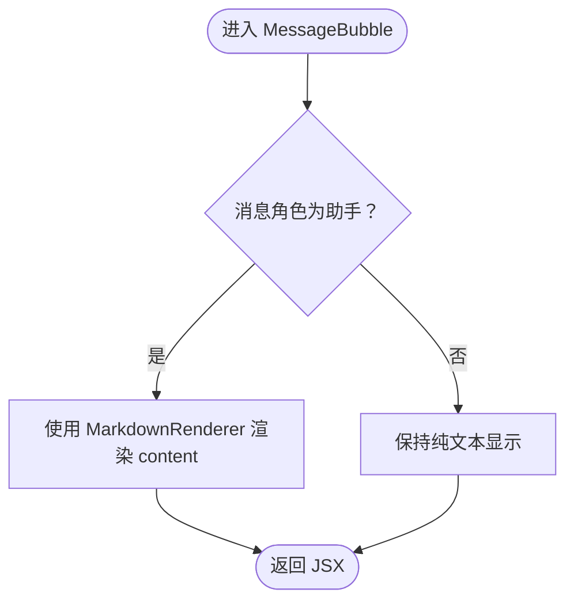
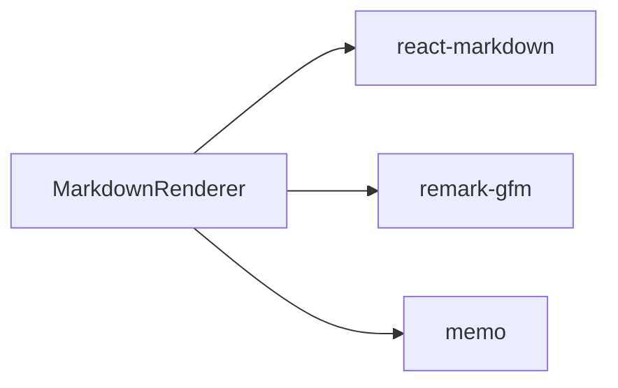

# Markdown 渲染器

<cite>
**本文引用的文件**
- [markdown-renderer.tsx](file://src/components/ui/markdown-renderer.tsx)
- [MessageBubble.tsx](file://src/components/apps/FlowAppInterface/MessageBubble.tsx)
- [package.json](file://package.json)
</cite>

## 目录
1. [简介](#简介)
2. [项目结构](#项目结构)
3. [核心组件](#核心组件)
4. [架构总览](#架构总览)
5. [详细组件分析](#详细组件分析)
6. [依赖关系分析](#依赖关系分析)
7. [性能考量](#性能考量)
8. [故障排查指南](#故障排查指南)
9. [结论](#结论)

## 简介
本文件聚焦于项目中的 Markdown 渲染器组件，系统性梳理其实现方式、支持的语法、样式与交互、以及在聊天界面中的集成路径。Markdown 渲染器基于 react-markdown 与 remark-gfm 插件，提供标题、段落、强调、列表、代码块/行内代码、链接、图片、表格、分隔线、任务列表、引用块等常见语法的渲染，并通过 memo 包装提升渲染性能。该组件主要被用于 AI 助手消息的富文本展示，确保用户在聊天界面中获得一致且美观的 Markdown 内容呈现。

## 项目结构
Markdown 渲染器位于通用 UI 组件目录下，作为可复用的渲染组件；在聊天界面中，MessageBubble 将根据消息角色决定是否使用该渲染器。

图表来源
- [markdown-renderer.tsx](file://src/components/ui/markdown-renderer.tsx#L1-L179)
- [MessageBubble.tsx](file://src/components/apps/FlowAppInterface/MessageBubble.tsx#L1-L108)

章节来源
- [markdown-renderer.tsx](file://src/components/ui/markdown-renderer.tsx#L1-L179)
- [MessageBubble.tsx](file://src/components/apps/FlowAppInterface/MessageBubble.tsx#L1-L108)

## 核心组件
- MarkdownRenderer：负责将 Markdown 文本转换为结构化的 HTML 元素，并应用统一的样式类名，支持标题、段落、强调、列表、代码、链接、图片、表格、分隔线、任务列表、引用块等语法。
- MessageBubble：聊天气泡组件，在助手消息场景下将 content 交由 MarkdownRenderer 渲染，用户消息则保持纯文本。

章节来源
- [markdown-renderer.tsx](file://src/components/ui/markdown-renderer.tsx#L1-L179)
- [MessageBubble.tsx](file://src/components/apps/FlowAppInterface/MessageBubble.tsx#L47-L106)

## 架构总览
Markdown 渲染器通过 ReactMarkdown 解析 Markdown，借助 remark-gfm 插件启用 GFM（GitHub Flavored Markdown）特性，如表格与任务列表。渲染器内部对各标签进行自定义组件映射，统一设置样式类名，保证在不同容器中的一致性。

图表来源
- [MessageBubble.tsx](file://src/components/apps/FlowAppInterface/MessageBubble.tsx#L77-L84)
- [markdown-renderer.tsx](file://src/components/ui/markdown-renderer.tsx#L24-L177)
- [package.json](file://package.json#L40-L50)

## 详细组件分析

### MarkdownRenderer 组件
- 功能定位：通用 Markdown 渲染器，支持标题、段落、强调、列表、代码、链接、图片、表格、分隔线、任务列表、引用块等。
- 插件与解析：使用 remark-gfm 插件增强 Markdown 语义，确保表格与任务列表等 GFM 特性生效。
- 标签映射与样式：对 h1-h4、p、strong、em、del、ul/ol/li、code/pre、a、img、table/thead/tbody/tr/th/td、hr、input（任务列表）等标签进行自定义组件映射，并统一添加样式类名，便于主题化与一致性。
- 性能优化：通过 memo 包装，避免不必要的重渲染，提高聊天界面滚动与频繁更新时的流畅度。
- 使用方式：接收 content 与可选 className，渲染时将 className 透传至外层容器，便于上层布局控制。

图表来源
- [markdown-renderer.tsx](file://src/components/ui/markdown-renderer.tsx#L1-L179)
- [package.json](file://package.json#L40-L50)

章节来源
- [markdown-renderer.tsx](file://src/components/ui/markdown-renderer.tsx#L1-L179)

### MessageBubble 集成点
- 角色区分：当消息角色为助手时，使用 MarkdownRenderer 渲染 content；当为用户时，保持纯文本显示。
- 交互细节：助手消息气泡支持鼠标悬停显示时间戳，提升阅读体验。
- 文件附件：消息气泡还支持文件列表展示，与 Markdown 渲染互不干扰。

图表来源
- [MessageBubble.tsx](file://src/components/apps/FlowAppInterface/MessageBubble.tsx#L47-L106)

章节来源
- [MessageBubble.tsx](file://src/components/apps/FlowAppInterface/MessageBubble.tsx#L47-L106)

## 依赖关系分析
- react-markdown：Markdown 解析与渲染核心库。
- remark-gfm：启用 GitHub 风格的 Markdown 扩展（表格、任务列表等）。
- memo：对组件进行浅比较缓存，减少重渲染。

图表来源
- [markdown-renderer.tsx](file://src/components/ui/markdown-renderer.tsx#L1-L179)
- [package.json](file://package.json#L40-L50)

章节来源
- [package.json](file://package.json#L40-L50)

## 性能考量
- 渲染性能：通过 memo 包装，避免 content 未变化时的重复渲染，适合在高频更新的聊天场景中稳定运行。
- 样式开销：组件对每个标签都设置了样式类名，建议在上层容器中统一管理样式，避免过多内联样式带来的重绘成本。
- 图片懒加载：图片标签默认启用懒加载，有助于首屏加载与滚动性能。
- 代码块字体与尺寸：代码块与行内代码采用较小字号与等宽字体，兼顾可读性与空间利用。

[本节为通用性能建议，不直接分析具体文件，故无“章节来源”标注]

## 故障排查指南
- 渲染空白或异常：确认传入的 content 是否为合法 Markdown 字符串；若为空或包含不受支持的 HTML 片段，ReactMarkdown 默认会忽略或报错，可在上层进行校验。
- 链接无法打开：组件为链接设置了新窗口打开与安全属性，若仍无法跳转，请检查浏览器弹窗策略或网络环境。
- 图片不显示：检查图片 URL 是否有效、跨域策略是否允许；组件已启用懒加载，长时间未出现可检查网络请求。
- 表格/任务列表不生效：确认 remark-gfm 插件已正确启用；若禁用插件，表格与任务列表将不会按预期渲染。
- 样式冲突：组件为各标签设置了样式类名，若与全局样式冲突，可在上层容器中覆盖或调整 className。

章节来源
- [markdown-renderer.tsx](file://src/components/ui/markdown-renderer.tsx#L1-L179)

## 结论
Markdown 渲染器以简洁稳定的实现方式，为项目提供了可靠的 Markdown 富文本渲染能力。结合 remark-gfm 插件与自定义标签映射，既能满足日常聊天内容的排版需求，又能在性能上通过 memo 得到保障。在聊天界面中，MessageBubble 对助手消息的 Markdown 渲染实现了自然衔接，提升了用户体验。未来如需扩展，可在现有基础上增加更多标签映射或主题化样式，以适配更丰富的展示场景。