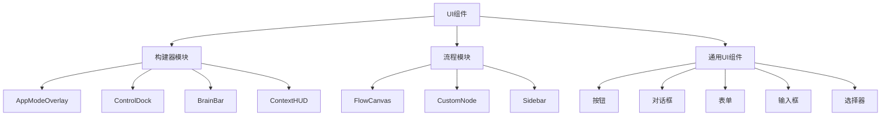
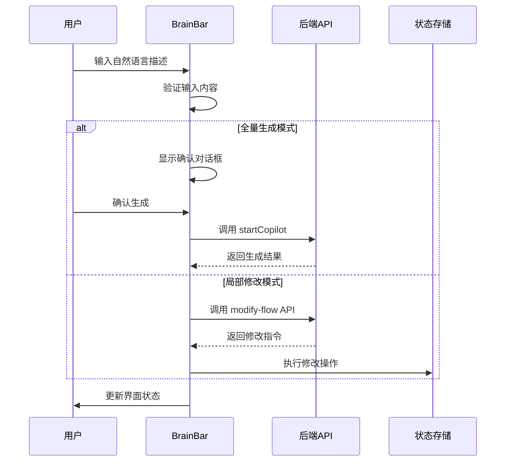
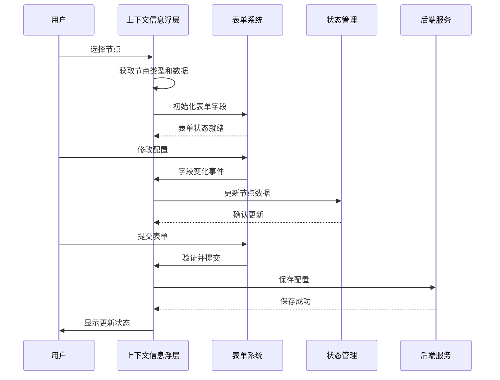

# UI组件架构

<cite>
**本文档引用的文件**  
- [AppModeOverlay.tsx](file://src/components/builder/AppModeOverlay.tsx)
- [ControlDock.tsx](file://src/components/builder/ControlDock.tsx)
- [FlowCanvas.tsx](file://src/components/flow/FlowCanvas.tsx)
- [CustomNode.tsx](file://src/components/flow/CustomNode.tsx)
- [button.tsx](file://src/components/ui/button.tsx)
- [dialog.tsx](file://src/components/ui/dialog.tsx)
- [form.tsx](file://src/components/ui/form.tsx)
- [card.tsx](file://src/components/ui/card.tsx)
- [input.tsx](file://src/components/ui/input.tsx)
- [textarea.tsx](file://src/components/ui/textarea.tsx)
- [select.tsx](file://src/components/ui/select.tsx)
- [switch.tsx](file://src/components/ui/switch.tsx)
- [slider.tsx](file://src/components/ui/slider.tsx)
- [tooltip.tsx](file://src/components/ui/tooltip.tsx)
- [dropdown-menu.tsx](file://src/components/ui/dropdown-menu.tsx)
- [BrainBar.tsx](file://src/components/builder/BrainBar.tsx)
- [ContextHUD.tsx](file://src/components/builder/ContextHUD.tsx)
- [Sidebar.tsx](file://src/components/flow/Sidebar.tsx)
</cite>

## 目录
1. [项目结构](#项目结构)
2. [核心UI组件概览](#核心ui组件概览)
3. [构建器模块组件](#构建器模块组件)
4. [流程模块组件](#流程模块组件)
5. [通用UI组件](#通用ui组件)
6. [设计系统与实现策略](#设计系统与实现策略)

## 项目结构

项目中的UI组件按照功能模块化组织，主要分为三大类：构建器（builder）、流程（flow）和通用UI组件（ui）。这种分层结构确保了组件的可维护性和复用性。

**图示来源**  
- [AppModeOverlay.tsx](file://src/components/builder/AppModeOverlay.tsx#L8-103)
- [ControlDock.tsx](file://src/components/builder/ControlDock.tsx#L12-227)
- [BrainBar.tsx](file://src/components/builder/BrainBar.tsx#L1-L278)
- [ContextHUD.tsx](file://src/components/builder/ContextHUD.tsx#L1-L143)
- [FlowCanvas.tsx](file://src/components/flow/FlowCanvas.tsx#L12-81)
- [CustomNode.tsx](file://src/components/flow/CustomNode.tsx#L29-186)
- [Sidebar.tsx](file://src/components/flow/Sidebar.tsx#L1-L146)
- [button.tsx](file://src/components/ui/button.tsx#L39-58)
- [dialog.tsx](file://src/components/ui/dialog.tsx#L9-81)
- [form.tsx](file://src/components/ui/form.tsx#L19-43)

## 核心UI组件概览

本项目采用模块化组件设计，所有UI组件均基于Radix UI原语构建，并通过Tailwind CSS进行样式定制。组件体系分为三个层级：应用特定组件、流程专用组件和可复用的通用UI组件。

**组件分类结构**
- **构建器模块组件**：提供流程构建界面的核心交互功能，包括BrainBar、ControlDock、ContextHUD等
- **流程模块组件**：实现流程可视化和节点操作，包括FlowCanvas、CustomNode、Sidebar等
- **通用UI组件**：基于Radix UI封装的基础交互元素

## 构建器模块组件

### AppModeOverlay 组件

AppModeOverlay 组件实现了应用模式的全屏覆盖界面，提供用户与流程交互的沉浸式体验。该组件通过状态管理集成流程执行结果，并支持消息历史展示。

**核心特性**
- 使用 Framer Motion 实现平滑的进入/退出动画
- 集成 FlowAppInterface 组件处理用户输入和流程执行
- 响应式设计适配移动和桌面设备
- 自动滚动至最新消息位置

**调用上下文**
- 通过 useFlowStore 钩子访问全局流程状态
- 在应用模式激活时动态渲染
- 处理用户输入并触发流程执行

**组件属性接口**
- `flowTitle`: 流程标题
- `flowIcon`: 图标配置
- `messages`: 消息历史
- `isLoading`: 加载状态
- `input`: 输入内容
- `onInputChange`: 输入变更回调
- `onSend`: 发送消息回调
- `onClose`: 关闭回调

**图示来源**  
- [AppModeOverlay.tsx](file://src/components/builder/AppModeOverlay.tsx#L8-103)

### ControlDock 组件

ControlDock 组件提供流程画布的控制面板，包含交互模式切换、缩放控制和流程执行功能。该组件采用浮动定位设计，确保在任何视图下都可访问。

**功能模块**
- **交互模式**：支持选择和拖拽两种模式
- **缩放控制**：提供缩放按钮和下拉菜单
- **流程执行**：一键运行流程并显示执行状态
- **错误通知**：执行失败时显示错误信息和重试选项

**状态管理**
- 通过 useFlowStore 订阅执行状态
- 使用 useState 管理局部UI状态
- 利用 useEffect 处理状态变化的副作用

**图示来源**  
- [ControlDock.tsx](file://src/components/builder/ControlDock.tsx#L12-227)

### BrainBar 组件

BrainBar 组件是构建器界面的智能辅助工具，提供AI驱动的流程生成功能和节点管理能力。它支持两种操作模式：全量生成和局部修改。

**核心特性**
- **双模式操作**：通过模式切换按钮实现"全量生成"和"局部修改"两种工作模式
- **AI驱动生成**：基于自然语言描述自动生成流程结构，集成 `/api/modify-flow` 接口
- **节点库访问**：提供预定义节点模板快速添加功能，通过节点库对话框实现
- **实时反馈**：在生成过程中提供视觉反馈和状态指示，使用动画效果

**交互流程**

**与状态管理集成**
- **状态访问**：获取节点列表、边连接、当前状态
- **动作触发**：触发节点添加、删除、修改操作
- **AI交互**：调用copilot相关API和状态管理

**图示来源**  
- [BrainBar.tsx](file://src/components/builder/BrainBar.tsx#L1-L278)

### ContextHUD 组件

ContextHUD 组件是一个上下文感知的信息面板，当用户选择特定节点时自动显示，提供节点级别的配置和调试功能。

**核心特性**
- **节点类型适配**：支持不同类型的节点配置
  - **LLM节点**：配置模型参数、系统提示词、温度设置
  - **HTTP节点**：设置请求方法、URL地址
  - **RAG节点**：管理知识库文件上传
  - **输入输出节点**：配置文本内容
- **实时配置管理**：表单验证和错误提示、实时预览配置效果、自动保存变更
- **执行结果展示**：显示最近一次执行的输出结果、JSON格式化展示、滚动浏览大段数据

**交互逻辑**

**图示来源**  
- [ContextHUD.tsx](file://src/components/builder/ContextHUD.tsx#L1-L143)

## 流程模块组件

### FlowCanvas 组件

FlowCanvas 组件基于 React Flow 库构建，提供流程的可视化编辑界面。该组件集成了节点管理、连接操作和用户交互控制。

**核心功能**
- 支持节点拖拽创建
- 实现节点连接和布局管理
- 集成上下文菜单和调试对话框
- 响应式交互模式切换

**技术实现**
- 使用 useReactFlow 钩子访问画布API
- 通过 useFlowStore 同步节点和边的状态
- 实现 onDrop 事件处理节点创建
- 集成背景网格增强视觉体验

**图示来源**  
- [FlowCanvas.tsx](file://src/components/flow/FlowCanvas.tsx#L12-81)

### CustomNode 组件

CustomNode 组件是流程中所有节点的统一渲染组件，支持多种节点类型并提供丰富的状态可视化。

**设计特点**
- 使用 React.memo 优化渲染性能
- 支持多种节点类型（输入、LLM、输出、RAG、HTTP）
- 提供状态指示器（空闲、运行、完成、错误）
- 集成执行时间和操作按钮

**智能测试功能**
- 自动检测上游节点数据
- 缺失数据时提示填充模拟数据
- 支持直接运行或调试模式

**图示来源**  
- [CustomNode.tsx](file://src/components/flow/CustomNode.tsx#L29-186)

### Sidebar 组件

Sidebar 组件提供节点库功能，支持拖拽式添加节点到画布。

**核心功能**
- **分类展示**：将节点按功能分类展示，包括"Input / Output"、"AI Capabilities"等
- **拖拽添加**：支持从侧边栏拖拽节点到画布，通过HTML5 Drag and Drop API实现
- **折叠/展开**：支持侧边栏的折叠和展开，提供更好的空间利用
- **工具提示**：在折叠状态下提供工具提示显示节点名称

**技术实现**
- 使用 useState 管理折叠状态
- 通过 onDragStart 事件处理拖拽操作
- 使用 Tooltip 组件提供工具提示
- 支持响应式设计，适配不同屏幕尺寸

**图示来源**  
- [Sidebar.tsx](file://src/components/flow/Sidebar.tsx#L1-L146)

## 通用UI组件

### 按钮组件 (button.tsx)

基于 Radix UI 的按钮封装，提供多种变体和尺寸选项。

**变体类型**
- 默认：主色调背景
- 破坏性：红色警示样式
- 轮廓：边框样式
- 次要：浅色背景
- 幽灵：透明背景悬停效果
- 链接：文本链接样式

**尺寸选项**
- 默认：标准尺寸
- 小型：紧凑布局
- 大型：突出显示
- 图标：纯图标按钮

**图示来源**  
- [button.tsx](file://src/components/ui/button.tsx#L39-58)

### 对话框组件 (dialog.tsx)

完整的模态对话框实现，包含遮罩层、内容区域和各种辅助组件。

**组件组成**
- Dialog：根容器
- DialogTrigger：触发器
- DialogContent：内容区域
- DialogHeader：头部区域
- DialogFooter：底部区域
- DialogTitle：标题
- DialogDescription：描述文本

**无障碍特性**
- 自动焦点管理
- 键盘导航支持
- 屏幕阅读器兼容
- 关闭按钮语义化

**图示来源**  
- [dialog.tsx](file://src/components/ui/dialog.tsx#L9-81)

### 表单组件 (form.tsx)

基于 react-hook-form 的表单系统封装，提供完整的表单验证和状态管理。

**核心组件**
- Form：表单提供者
- FormField：字段控制器
- FormItem：字段容器
- FormLabel：标签
- FormControl：控件
- FormDescription：描述
- FormMessage：错误消息

**集成特性**
- 与 Radix UI 组件无缝集成
- 支持自定义验证规则
- 提供错误状态样式
- 完整的可访问性支持

**图示来源**  
- [form.tsx](file://src/components/ui/form.tsx#L19-43)

### 其他通用组件

#### 卡片组件 (card.tsx)
提供标准化的内容容器，支持头部、主体、底部和操作区域。

#### 输入组件 (input.tsx, textarea.tsx)
基础输入控件，集成验证状态和占位符样式。

#### 选择器组件 (select.tsx)
下拉选择控件，支持滚动按钮和分组选项。

#### 开关组件 (switch.tsx)
布尔值切换控件，提供平滑的动画过渡。

#### 滑块组件 (slider.tsx)
数值范围选择控件，支持多手柄。

#### 工具提示组件 (tooltip.tsx)
悬浮提示控件，自动处理位置计算。

#### 下拉菜单组件 (dropdown-menu.tsx)
完整的下拉菜单系统，支持嵌套子菜单。

**图示来源**  
- [card.tsx](file://src/components/ui/card.tsx#L5-14)
- [input.tsx](file://src/components/ui/input.tsx#L5-18)
- [textarea.tsx](file://src/components/ui/textarea.tsx#L5-15)
- [select.tsx](file://src/components/ui/select.tsx#L9-51)
- [switch.tsx](file://src/components/ui/switch.tsx#L8-28)
- [slider.tsx](file://src/components/ui/slider.tsx#L8-63)
- [tooltip.tsx](file://src/components/ui/tooltip.tsx#L21-58)
- [dropdown-menu.tsx](file://src/components/ui/dropdown-menu.tsx#L9-51)

## 设计系统与实现策略

### 基于Radix UI的实现

所有UI组件均基于Radix UI原语构建，确保了：
- 最佳的可访问性实践
- 跨浏览器兼容性
- 键盘导航支持
- 语义化HTML结构

### Tailwind CSS样式定制

通过Tailwind CSS实现样式定制，主要策略包括：
- 使用 `cn` 工具函数合并类名
- 定义组件特定的样式变体
- 支持响应式设计
- 实现主题切换

### 组件复用策略

**分层复用**
- 基础层：Radix UI原语
- 通用层：项目级UI组件
- 业务层：功能特定组件

**组合模式**
- 通过插槽（Slot）实现内容组合
- 使用Provider模式共享状态
- 支持asChild属性扩展用法

### 可访问性保障

**键盘导航**
- 所有交互元素支持Tab键导航
- 提供焦点可见性
- 支持Enter/Space键激活

**屏幕阅读器支持**
- 语义化标签
- ARIA属性
- 状态变更通知

**高对比度模式**
- 支持深色主题
- 确保文本可读性
- 提供足够的色彩对比

**图示来源**  
- [button.tsx](file://src/components/ui/button.tsx)
- [dialog.tsx](file://src/components/ui/dialog.tsx)
- [form.tsx](file://src/components/ui/form.tsx)