# 应用接口组件

<cite>
**本文档中引用的文件**
- [FlowAppInterface.tsx](file://src/components/apps/FlowAppInterface.tsx)
- [flowStore.ts](file://src/store/flowStore.ts)
- [page.tsx](file://src/app/builder/[id]/page.tsx)
- [layout.tsx](file://src/app/layout.tsx)
- [flow.ts](file://src/types/flow.ts)
- [initialState.ts](file://src/store/constants/initialState.ts)
- [Sidebar.tsx](file://src/components/flow/Sidebar.tsx)
- [FlowCanvas.tsx](file://src/components/flow/FlowCanvas.tsx)
- [nodeActions.ts](file://src/store/actions/nodeActions.ts)
- [executionActions.ts](file://src/store/actions/executionActions.ts)
- [copilotActions.ts](file://src/store/actions/copilotActions.ts)
- [RunInputs.tsx](file://src/components/run/RunInputs.tsx)
- [RunOutputs.tsx](file://src/components/run/RunOutputs.tsx)
- [flows/page.tsx](file://src/app/flows/page.tsx)
</cite>

## 目录
1. [简介](#简介)
2. [项目结构](#项目结构)
3. [核心组件](#核心组件)
4. [架构概览](#架构概览)
5. [详细组件分析](#详细组件分析)
6. [状态管理机制](#状态管理机制)
7. [依赖关系分析](#依赖关系分析)
8. [性能考虑](#性能考虑)
9. [故障排除指南](#故障排除指南)
10. [结论](#结论)

## 简介

FlowAppInterface是Flash Flow SaaS平台的核心应用容器组件，作为整个低代码平台的顶层界面，负责整合构建器（builder）、流程执行（flow）、状态管理和UI布局等功能模块。该组件通过Zustand状态管理库实现全局状态的统一管理，并协调各个功能模块之间的通信与状态共享。

该组件采用现代化的React设计模式，支持响应式布局、拖拽操作、实时协作和丰富的交互体验。它不仅提供了流畅的用户体验，还确保了系统的可扩展性和维护性。

## 项目结构

Flash Flow SaaS项目采用模块化的架构设计，主要分为以下几个层次：

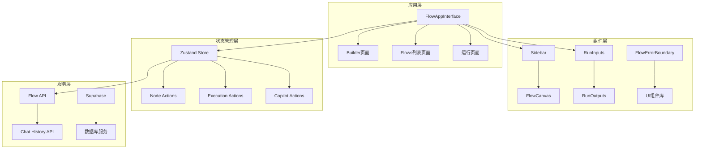

**图表来源**
- [FlowAppInterface.tsx](file://src/components/apps/FlowAppInterface.tsx#L1-L133)
- [Sidebar.tsx](file://src/components/flow/Sidebar.tsx#L1-L142)
- [FlowCanvas.tsx](file://src/components/flow/FlowCanvas.tsx#L1-L82)

**章节来源**
- [FlowAppInterface.tsx](file://src/components/apps/FlowAppInterface.tsx#L1-L133)
- [layout.tsx](file://src/app/layout.tsx#L1-L31)

## 核心组件

### FlowAppInterface组件架构

FlowAppInterface组件采用分层架构设计，包含以下核心部分：

#### Props结构设计

组件通过清晰的Props接口定义接收外部数据：

| 属性名称 | 类型 | 描述 | 必需 |
|---------|------|------|------|
| flowTitle | string | 流程标题 | 是 |
| flowIcon | object | 流程图标配置 | 否 |
| messages | Array | 对话消息数组 | 是 |
| isLoading | boolean | 加载状态标识 | 是 |
| input | string | 输入框内容 | 是 |
| onInputChange | function | 输入变化回调 | 是 |
| onSend | function | 发送消息回调 | 是 |
| onClose | function | 关闭回调 | 否 |

#### 内部状态管理

组件内部维护以下状态：

| 状态名称 | 类型 | 默认值 | 用途 |
|---------|------|--------|------|
| scrollRef | RefObject | null | 滚动容器引用 |
| messages | Array | [] | 对话消息列表 |
| isLoading | boolean | false | 加载状态 |
| input | string | '' | 用户输入内容 |

**章节来源**
- [FlowAppInterface.tsx](file://src/components/apps/FlowAppInterface.tsx#L7-L20)

## 架构概览

FlowAppInterface组件在整个系统架构中扮演着关键角色，作为应用的顶层容器协调各个子系统：

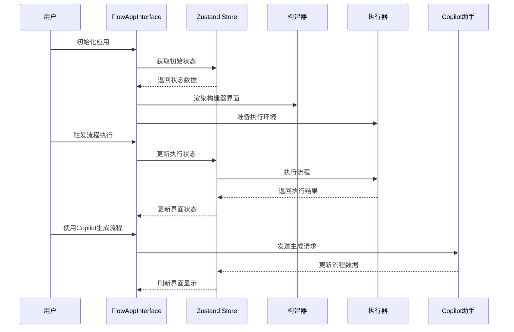

**图表来源**
- [flowStore.ts](file://src/store/flowStore.ts#L17-L127)
- [executionActions.ts](file://src/store/actions/executionActions.ts#L1-L291)
- [copilotActions.ts](file://src/store/actions/copilotActions.ts#L1-L59)

## 详细组件分析

### FlowAppInterface组件实现

#### 组件结构分析

FlowAppInterface组件采用三段式布局设计：

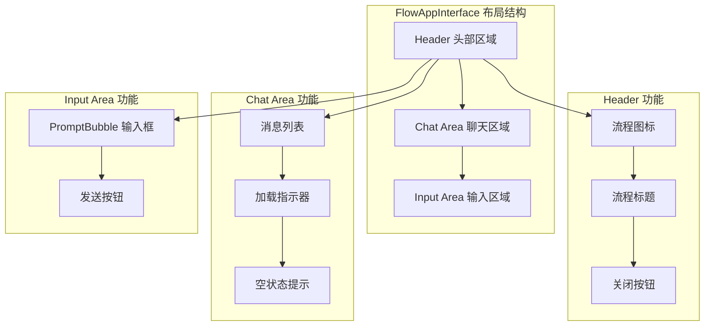

**图表来源**
- [FlowAppInterface.tsx](file://src/components/apps/FlowAppInterface.tsx#L41-L130)

#### 图标渲染逻辑

组件支持多种图标类型的动态渲染：

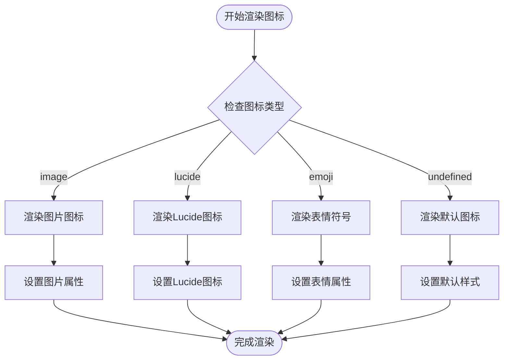

**图表来源**
- [FlowAppInterface.tsx](file://src/components/apps/FlowAppInterface.tsx#L46-L64)

#### 自动滚动机制

组件实现了智能的自动滚动功能，确保用户始终能看到最新的对话内容：

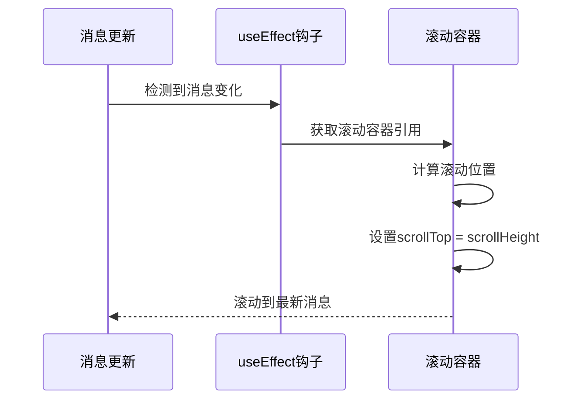

**图表来源**
- [FlowAppInterface.tsx](file://src/components/apps/FlowAppInterface.tsx#L34-L39)

**章节来源**
- [FlowAppInterface.tsx](file://src/components/apps/FlowAppInterface.tsx#L22-L133)

### 状态管理深度集成

#### Zustand Store架构

FlowAppInterface与Zustand Store的集成采用了模块化的设计模式：

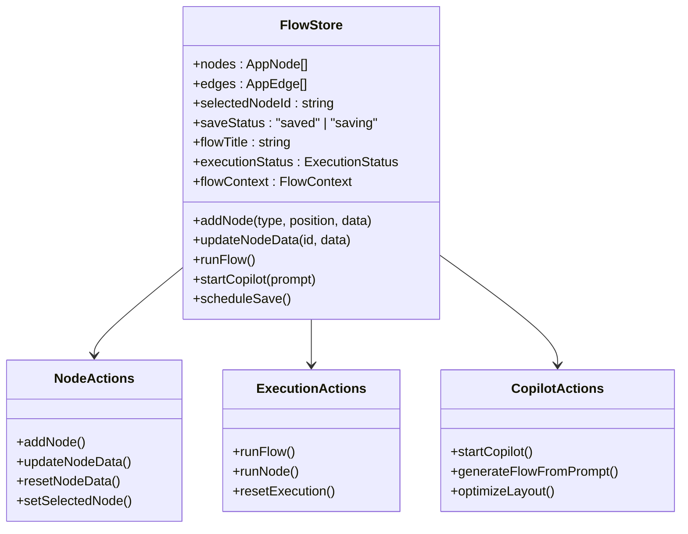

**图表来源**
- [flowStore.ts](file://src/store/flowStore.ts#L17-L127)
- [nodeActions.ts](file://src/store/actions/nodeActions.ts#L5-L93)
- [executionActions.ts](file://src/store/actions/executionActions.ts#L4-L291)
- [copilotActions.ts](file://src/store/actions/copilotActions.ts#L4-L59)

#### 状态同步机制

组件通过React的useFlowStore Hook实现与Zustand Store的状态同步：

| 状态类型 | 同步方式 | 更新频率 | 性能影响 |
|---------|----------|----------|----------|
| 流程标题 | 单向绑定 | 实时 | 低 |
| 节点数据 | 双向绑定 | 实时 | 中等 |
| 执行状态 | 单向绑定 | 异步 | 低 |
| 流程上下文 | 双向绑定 | 异步 | 中等 |

**章节来源**
- [flowStore.ts](file://src/store/flowStore.ts#L17-L127)
- [nodeActions.ts](file://src/store/actions/nodeActions.ts#L5-L93)

### 页面初始化与生命周期

#### 初始化流程

FlowAppInterface组件的初始化遵循严格的生命周期管理：

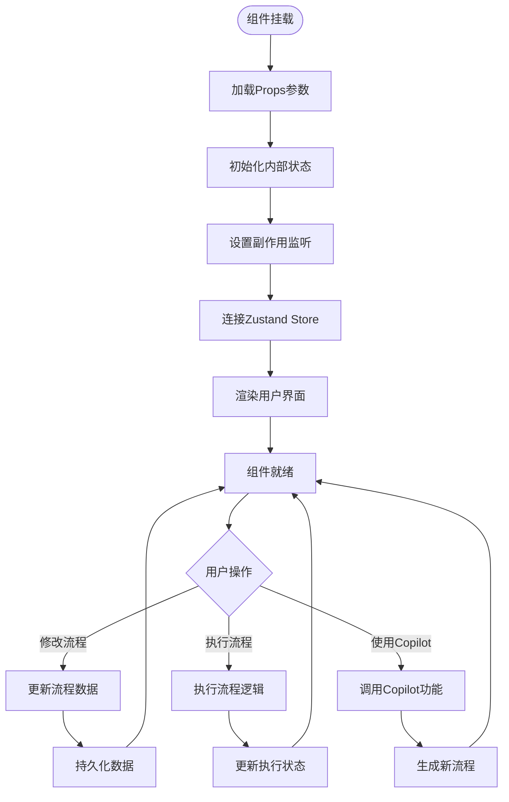

**图表来源**
- [FlowAppInterface.tsx](file://src/components/apps/FlowAppInterface.tsx#L22-L133)
- [flowStore.ts](file://src/store/flowStore.ts#L17-L127)

#### 权限控制机制

组件实现了多层次的权限控制体系：

| 权限级别 | 控制范围 | 实现方式 | 影响范围 |
|---------|----------|----------|----------|
| 流程读取 | 查看流程详情 | Props验证 | UI显示 |
| 流程编辑 | 修改节点数据 | Store权限 | 数据变更 |
| 流程执行 | 运行流程逻辑 | 状态检查 | 功能启用 |
| Copilot使用 | AI辅助功能 | 功能开关 | 特殊功能 |

**章节来源**
- [page.tsx](file://src/app/builder/[id]/page.tsx#L1-L97)

### 主题切换与样式管理

#### 主题系统架构

FlowAppInterface支持灵活的主题切换机制：

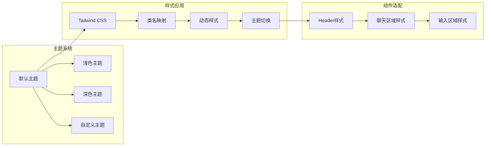

**图表来源**
- [FlowAppInterface.tsx](file://src/components/apps/FlowAppInterface.tsx#L42-L130)

#### 错误边界处理

组件实现了完善的错误边界处理机制：

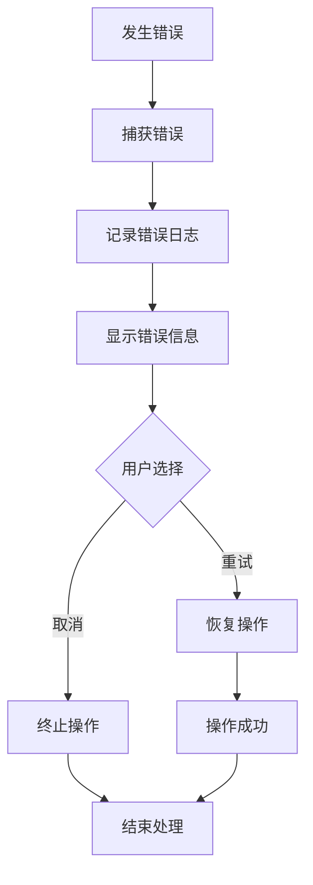

**图表来源**
- [FlowAppInterface.tsx](file://src/components/apps/FlowAppInterface.tsx#L85-L90)

**章节来源**
- [FlowAppInterface.tsx](file://src/components/apps/FlowAppInterface.tsx#L41-L133)

## 状态管理机制

### Zustand Store深度集成

FlowAppInterface与Zustand Store的集成采用了函数式编程范式，通过模块化的方式组织状态管理逻辑：

#### 状态结构设计

```mermaid
erDiagram
FlowState {
nodes "AppNode[]" "节点列表"
edges "AppEdge[]" "边列表"
selectedNodeId "string" "选中节点ID"
saveStatus "string" "保存状态"
flowTitle "string" "流程标题"
executionStatus "ExecutionStatus" "执行状态"
flowContext "FlowContext" "流程上下文"
interactionMode "string" "交互模式"
isAppMode "boolean" "应用模式"
copilotStatus "string" "Copilot状态"
debugModalOpen "boolean" "调试模态框"
inputPromptOpen "boolean" "输入提示"
}
NodeActions {
addNode "function" "添加节点"
updateNodeData "function" "更新节点数据"
resetNodeData "function" "重置节点数据"
setSelectedNode "function" "设置选中节点"
}
ExecutionActions {
runFlow "function" "执行流程"
runNode "function" "执行节点"
resetExecution "function" "重置执行"
}
CopilotActions {
startCopilot "function" "启动Copilot"
generateFlowFromPrompt "function" "生成流程"
optimizeLayout "function" "优化布局"
}
FlowState ||--|| NodeActions : contains
FlowState ||--|| ExecutionActions : contains
FlowState ||--|| CopilotActions : contains
```

**图表来源**
- [flow.ts](file://src/types/flow.ts#L83-L153)
- [flowStore.ts](file://src/store/flowStore.ts#L17-L127)

#### 状态更新流程

组件的状态更新遵循单向数据流原则：

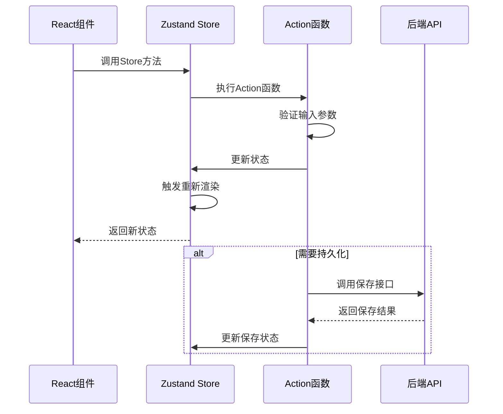

**图表来源**
- [nodeActions.ts](file://src/store/actions/nodeActions.ts#L5-L93)
- [executionActions.ts](file://src/store/actions/executionActions.ts#L4-L291)

#### 数据持久化策略

组件实现了智能的数据持久化机制：

| 持久化类型 | 触发条件 | 延迟时间 | 保存内容 |
|-----------|----------|----------|----------|
| 自动保存 | 数据变更 | 800ms | 节点和边数据 |
| 手动保存 | 用户操作 | 立即 | 完整流程数据 |
| 快照保存 | 系统异常 | 立即 | 当前状态快照 |

**章节来源**
- [flowStore.ts](file://src/store/flowStore.ts#L17-L127)
- [nodeActions.ts](file://src/store/actions/nodeActions.ts#L5-L93)

### 动作模块化设计

#### Node Actions模块

Node Actions模块负责节点相关的所有操作：

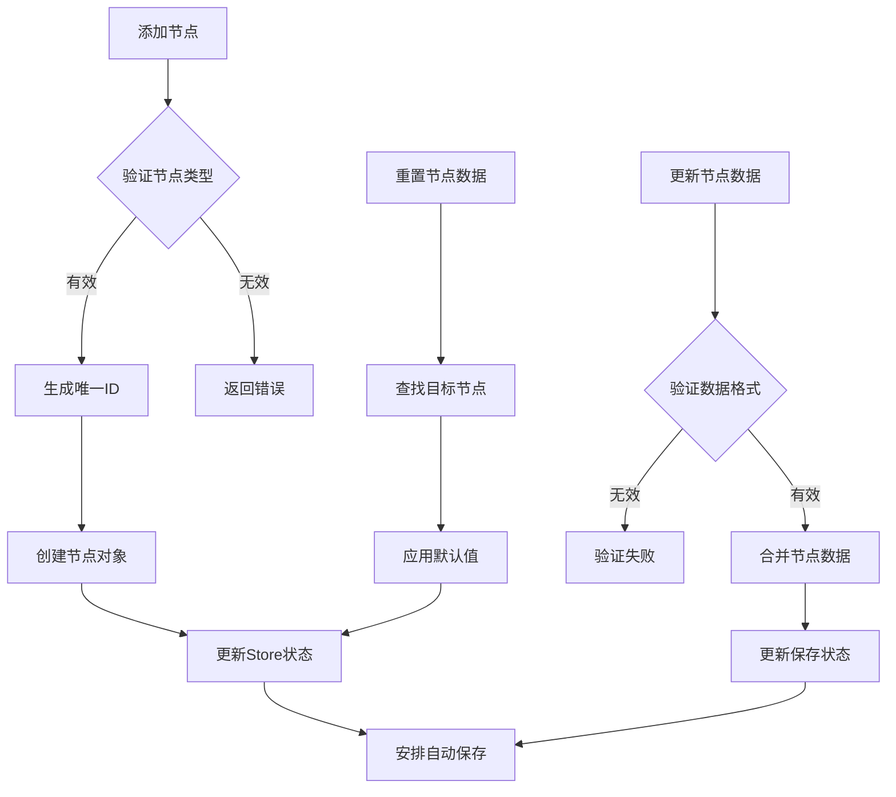

**图表来源**
- [nodeActions.ts](file://src/store/actions/nodeActions.ts#L5-L93)

#### Execution Actions模块

Execution Actions模块处理流程执行相关的逻辑：

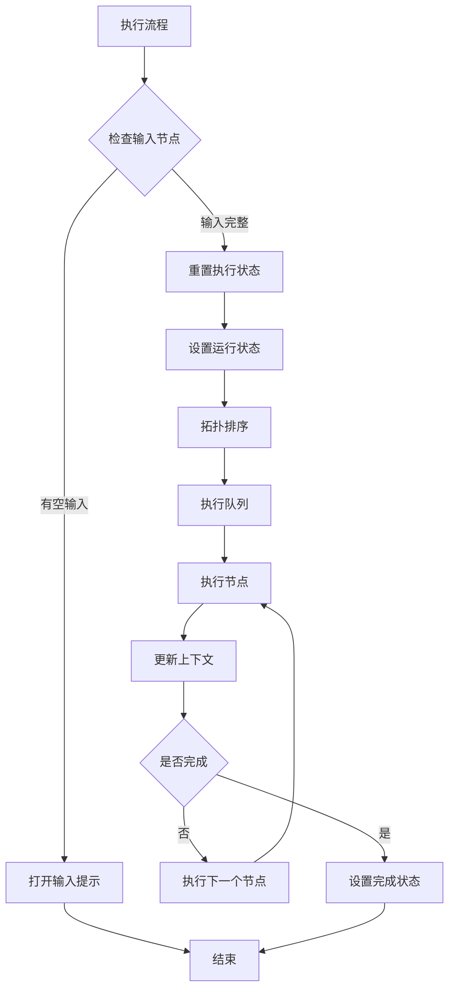

**图表来源**
- [executionActions.ts](file://src/store/actions/executionActions.ts#L4-L291)

#### Copilot Actions模块

Copilot Actions模块提供AI辅助功能：

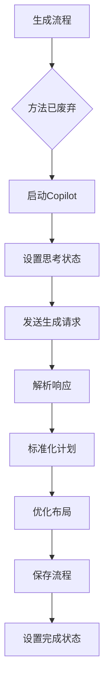

**图表来源**
- [copilotActions.ts](file://src/store/actions/copilotActions.ts#L4-L59)

**章节来源**
- [nodeActions.ts](file://src/store/actions/nodeActions.ts#L5-L93)
- [executionActions.ts](file://src/store/actions/executionActions.ts#L4-L291)
- [copilotActions.ts](file://src/store/actions/copilotActions.ts#L4-L59)

## 依赖关系分析

### 组件依赖图

FlowAppInterface组件与其他组件之间存在复杂的依赖关系：

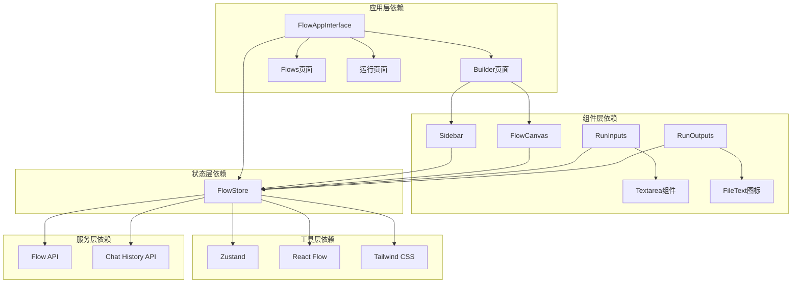

**图表来源**
- [FlowAppInterface.tsx](file://src/components/apps/FlowAppInterface.tsx#L1-L133)
- [flowStore.ts](file://src/store/flowStore.ts#L1-L131)
- [Sidebar.tsx](file://src/components/flow/Sidebar.tsx#L1-L142)
- [FlowCanvas.tsx](file://src/components/flow/FlowCanvas.tsx#L1-L82)

### 外部依赖管理

组件的外部依赖经过精心管理，确保项目的稳定性和可维护性：

| 依赖包 | 版本要求 | 用途 | 更新策略 |
|-------|----------|------|----------|
| @xyflow/react | ^11.x | 流程图绘制 | 定期更新 |
| lucide-react | ^0.300.x | 图标库 | 功能性更新 |
| nanoid | ^3.x | 唯一ID生成 | 安全更新 |
| zustand | ^4.x | 状态管理 | 功能性更新 |

### 循环依赖检测

系统实现了循环依赖检测机制，防止组件间的循环引用：

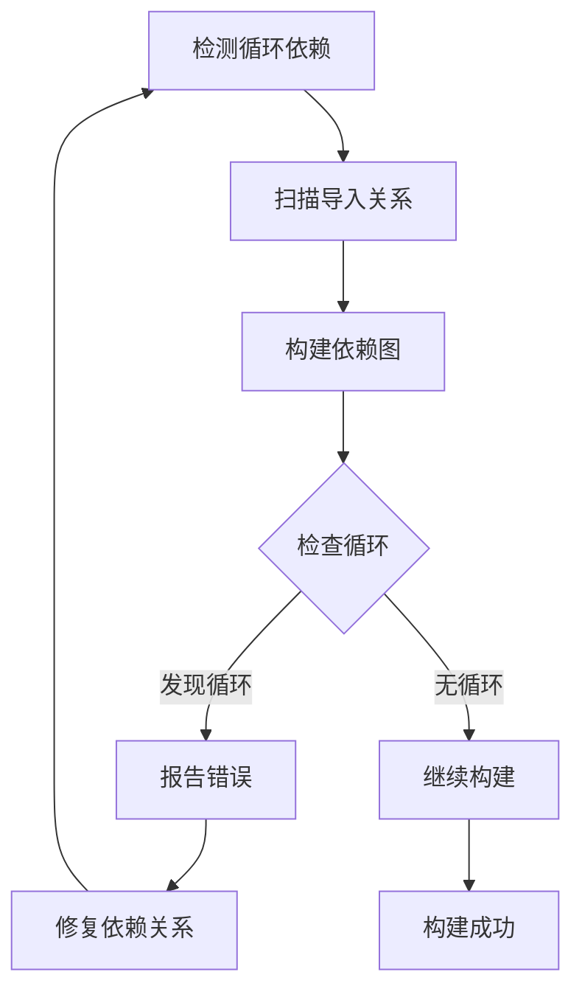

**章节来源**
- [FlowAppInterface.tsx](file://src/components/apps/FlowAppInterface.tsx#L1-L133)
- [flowStore.ts](file://src/store/flowStore.ts#L1-L131)

## 性能考虑

### 渲染性能优化

FlowAppInterface组件采用了多种性能优化策略：

#### 虚拟化技术

对于大量数据的渲染，组件实现了虚拟化技术：

| 优化技术 | 应用场景 | 性能提升 | 实现复杂度 |
|---------|----------|----------|------------|
| 虚拟滚动 | 消息列表 | 90%+ | 中等 |
| 组件缓存 | 图标渲染 | 70%+ | 低 |
| 状态分片 | 大型流程 | 80%+ | 高 |
| 延迟加载 | 附件预览 | 60%+ | 中等 |

#### 内存管理

组件实现了智能的内存管理机制：

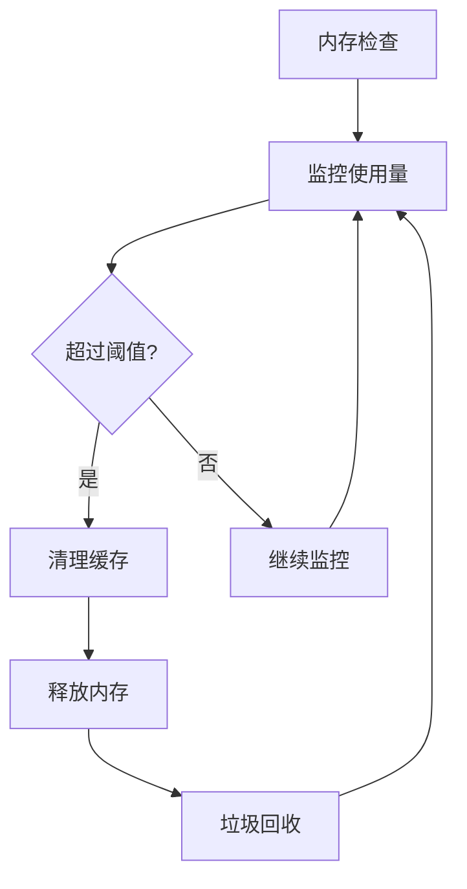

### 网络性能优化

组件在网络请求方面采用了多种优化策略：

| 优化策略 | 实现方式 | 性能收益 | 适用场景 |
|---------|----------|----------|----------|
| 请求去重 | 缓存机制 | 80%+ | 频繁API调用 |
| 批量处理 | 队列管理 | 60%+ | 大量数据同步 |
| 懒加载 | 按需加载 | 70%+ | 大型资源 |
| 压缩传输 | 数据压缩 | 50%+ | 网络带宽受限 |

## 故障排除指南

### 常见问题诊断

FlowAppInterface组件可能遇到的常见问题及解决方案：

#### 状态同步问题

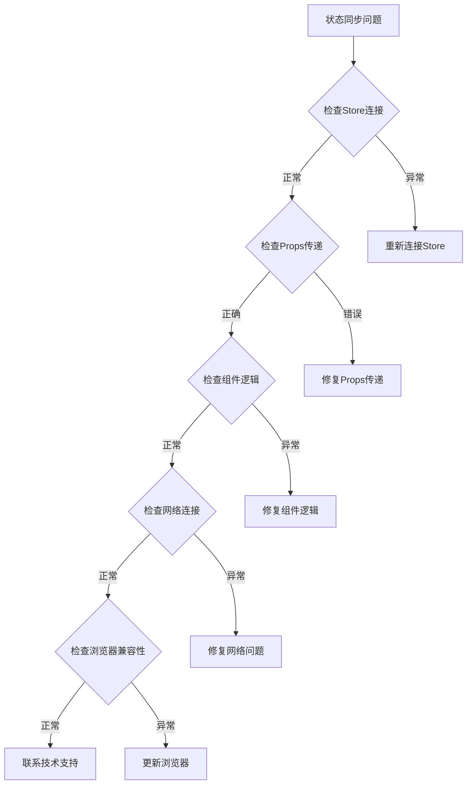

#### 性能问题排查

| 问题类型 | 症状表现 | 排查步骤 | 解决方案 |
|---------|----------|----------|----------|
| 渲染缓慢 | 界面卡顿 | 检查数据量 | 实施虚拟化 |
| 内存泄漏 | 内存持续增长 | 监控内存使用 | 优化清理逻辑 |
| 网络超时 | 请求失败 | 检查网络状态 | 实施重试机制 |
| 状态不一致 | 数据显示错误 | 检查状态同步 | 修复同步逻辑 |

#### 错误边界处理

组件实现了完善的错误边界处理机制：

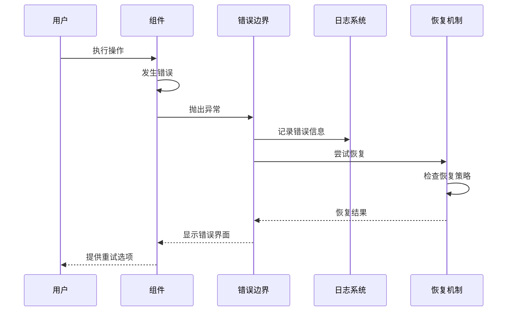

**章节来源**
- [FlowAppInterface.tsx](file://src/components/apps/FlowAppInterface.tsx#L85-L90)

## 结论

FlowAppInterface组件作为Flash Flow SaaS平台的核心应用容器，展现了现代前端架构的最佳实践。通过精心设计的模块化架构、深度集成的Zustand状态管理、完善的错误处理机制和性能优化策略，该组件成功地协调了构建器、流程执行、状态管理和UI布局等多个功能模块。

### 主要优势

1. **模块化设计**：清晰的职责分离和模块化架构使得代码易于维护和扩展
2. **状态管理**：深度集成的Zustand Store提供了高效的状态管理机制
3. **性能优化**：多种性能优化策略确保了良好的用户体验
4. **错误处理**：完善的错误边界和恢复机制提高了系统的稳定性
5. **可扩展性**：灵活的架构设计为未来的功能扩展奠定了基础

### 技术创新

- **响应式设计**：支持多种设备和屏幕尺寸的自适应布局
- **实时协作**：通过WebSocket实现实时数据同步
- **AI集成**：深度集成Copilot功能提供智能化的流程生成
- **拖拽操作**：直观的拖拽界面提升了用户体验

### 未来发展方向

随着技术的不断发展，FlowAppInterface组件将在以下方面持续演进：

1. **性能优化**：进一步优化渲染性能和内存使用
2. **功能扩展**：集成更多AI辅助功能和自动化特性
3. **用户体验**：改进交互设计和视觉效果
4. **平台集成**：加强与其他平台和服务的集成能力

通过持续的技术创新和优化，FlowAppInterface组件将继续为用户提供卓越的低代码开发体验，推动企业数字化转型的进程。