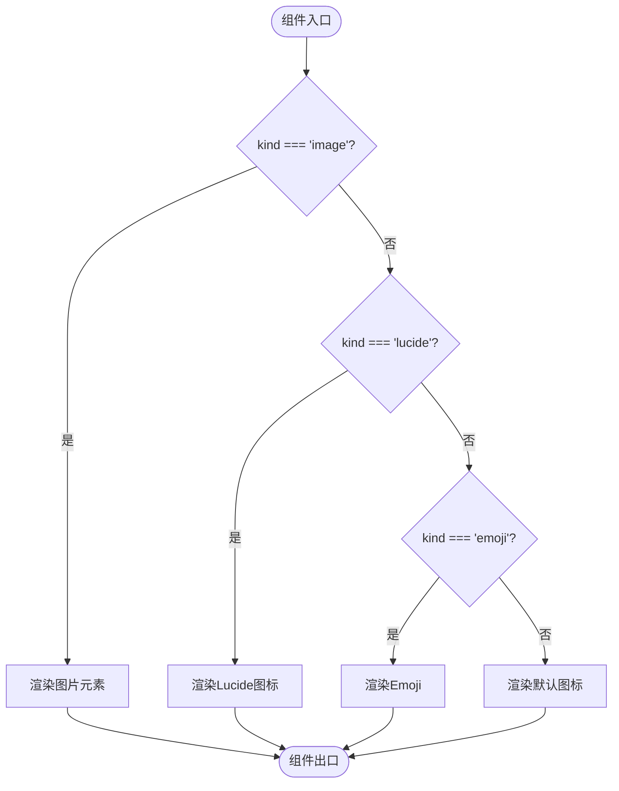
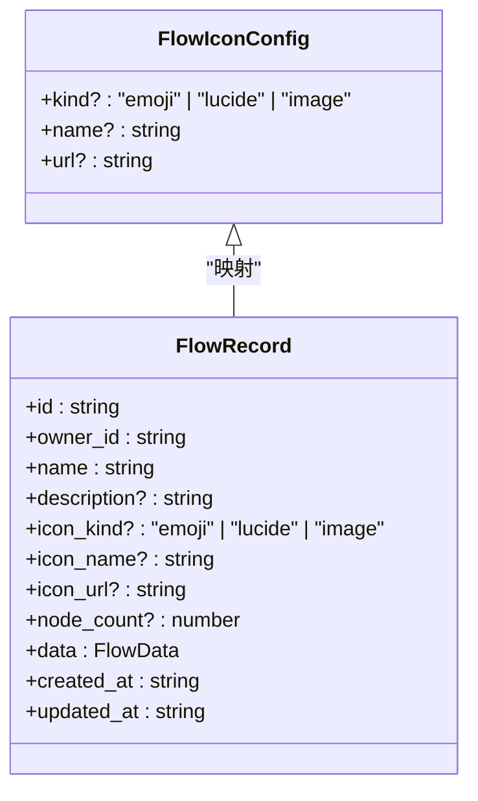
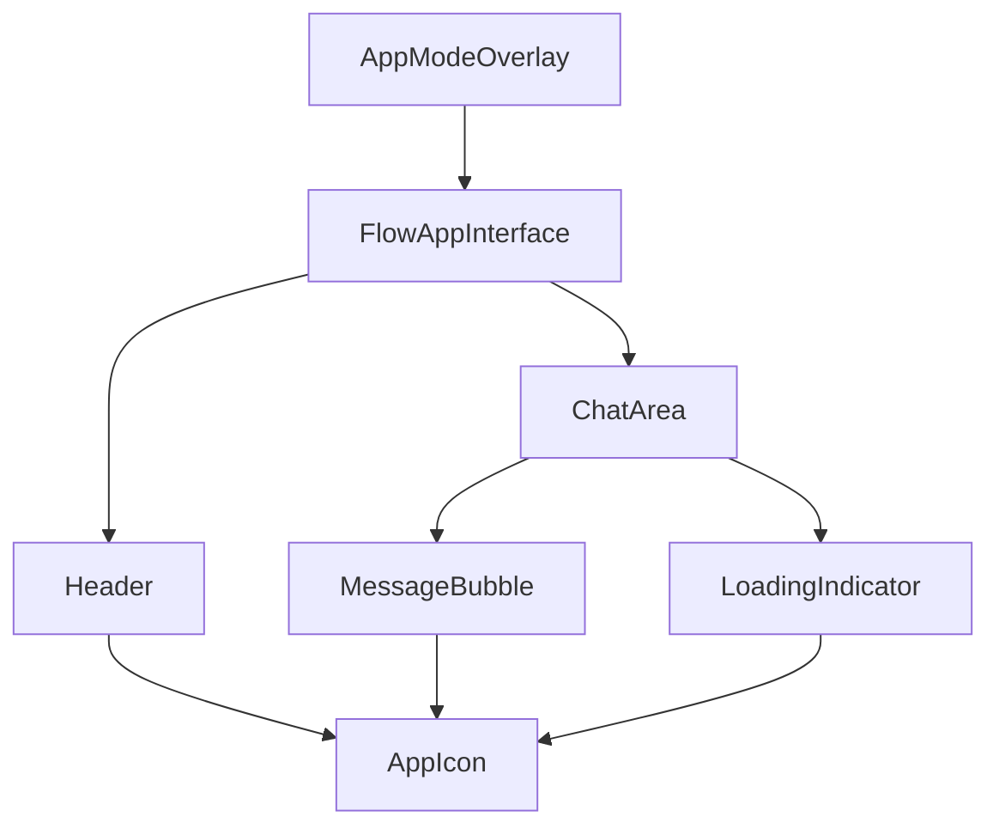
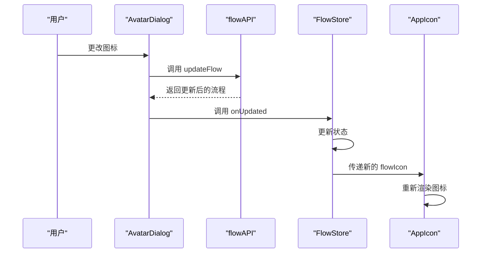

# AppIcon 组件

<cite>
**本文档引用的文件**
- [AppIcon.tsx](file://src/components/apps/FlowAppInterface/AppIcon.tsx)
- [constants.ts](file://src/components/apps/FlowAppInterface/constants.ts)
- [Header.tsx](file://src/components/apps/FlowAppInterface/Header.tsx)
- [ChatArea.tsx](file://src/components/apps/FlowAppInterface/ChatArea.tsx)
- [MessageBubble.tsx](file://src/components/apps/FlowAppInterface/MessageBubble.tsx)
- [flowCardUtils.ts](file://src/components/flows/flowCardUtils.ts)
- [FlowCard.tsx](file://src/components/flows/FlowCard.tsx)
- [AvatarDialog.tsx](file://src/components/flows/AvatarDialog.tsx)
- [flow.ts](file://src/types/flow.ts)
- [AppModeOverlay.tsx](file://src/components/builder/AppModeOverlay.tsx)
</cite>

## 目录
1. [简介](#简介)
2. [核心功能](#核心功能)
3. [组件结构](#组件结构)
4. [使用场景](#使用场景)
5. [类型定义](#类型定义)
6. [样式与常量](#样式与常量)
7. [与其他组件的集成](#与其他组件的集成)
8. [数据流与状态管理](#数据流与状态管理)
9. [错误处理与默认行为](#错误处理与默认行为)
10. [性能与优化](#性能与优化)

## 简介

AppIcon 组件是 Flash Flow SaaS 应用中的核心图标显示组件，用于在多个界面中统一展示流程应用的图标。该组件支持多种图标类型，包括图片、Lucide 图标和 Emoji 表情符号，为用户提供一致的视觉体验。

**Section sources**
- [AppIcon.tsx](file://src/components/apps/FlowAppInterface/AppIcon.tsx#L1-L47)

## 核心功能

AppIcon 组件的主要功能是根据传入的配置对象动态渲染不同类型的图标。它支持以下三种图标类型：

1. **图片图标**：通过 URL 加载外部图片作为图标
2. **Lucide 图标**：使用 Lucide React 图标库中的矢量图标
3. **Emoji 图标**：使用 Unicode Emoji 作为图标

组件会根据 `flowIcon` 属性的 `kind` 字段判断图标类型，并相应地渲染对应的 UI 元素。如果未提供有效的图标配置，组件将显示默认的机器人图标。

**Section sources**
- [AppIcon.tsx](file://src/components/apps/FlowAppInterface/AppIcon.tsx#L15-L46)

## 组件结构

AppIcon 组件采用条件渲染的方式处理不同类型的图标。其结构主要由以下几个部分组成：

- **Props 接口**：定义了 `AppIconProps` 接口，包含 `flowIcon` 和 `className` 两个可选属性
- **条件判断**：通过一系列 if 语句判断图标类型并渲染相应的内容
- **默认图标**：当没有提供有效的图标配置时，显示默认的机器人图标

组件使用了 Tailwind CSS 的 `cn` 工具函数来合并类名，确保样式的一致性和可扩展性。

**Diagram sources**
- [AppIcon.tsx](file://src/components/apps/FlowAppInterface/AppIcon.tsx#L15-L46)

**Section sources**
- [AppIcon.tsx](file://src/components/apps/FlowAppInterface/AppIcon.tsx#L5-L8)

## 使用场景

AppIcon 组件在应用中有多个使用场景，主要分布在以下几个界面中：

1. **应用头部**：在 FlowAppInterface 的 Header 组件中显示应用图标
2. **聊天区域**：在 ChatArea 和 MessageBubble 组件中显示助手的头像
3. **加载指示器**：在加载过程中显示动态的图标动画
4. **流程卡片**：在 FlowCard 组件中显示流程的缩略图

这些使用场景确保了在整个应用中图标显示的一致性，提升了用户体验。

**Section sources**
- [Header.tsx](file://src/components/apps/FlowAppInterface/Header.tsx#L28)
- [ChatArea.tsx](file://src/components/apps/FlowAppInterface/ChatArea.tsx#L59)
- [MessageBubble.tsx](file://src/components/apps/FlowAppInterface/MessageBubble.tsx#L65)

## 类型定义

AppIcon 组件依赖于 `FlowIconConfig` 类型定义，该类型在 constants.ts 文件中声明。`FlowIconConfig` 接口定义了图标配置对象的结构：

- `kind`：图标类型，可选值为 "emoji"、"lucide" 或 "image"
- `name`：图标名称，对于 Lucide 图标和 Emoji 图标是必需的
- `url`：图片图标的 URL 地址

此外，`FlowRecord` 类型在 flow.ts 文件中定义了数据库中存储的流程记录结构，包含 `icon_kind`、`icon_name` 和 `icon_url` 字段，与 `FlowIconConfig` 类型相对应。

**Diagram sources**
- [constants.ts](file://src/components/apps/FlowAppInterface/constants.ts#L50-L54)
- [flow.ts](file://src/types/flow.ts#L173-L175)

**Section sources**
- [constants.ts](file://src/components/apps/FlowAppInterface/constants.ts#L50-L54)

## 样式与常量

AppIcon 组件使用了 constants.ts 文件中定义的常量来管理样式。其中，`STYLES` 对象包含了 `iconSize` 常量，定义了图标的基本尺寸为 "w-8 h-8"。

组件还使用了 `ICON_MAP` 常量来映射 Lucide 图标的名称和对应的组件。目前支持的图标包括：
- zap：闪电图标
- globe：地球图标
- doc：文档图标
- link：链接图标

当指定的 Lucide 图标名称不存在时，组件会使用 `DEFAULT_ICON`（机器人图标）作为默认值。

**Section sources**
- [constants.ts](file://src/components/apps/FlowAppInterface/constants.ts#L5-L16)
- [constants.ts](file://src/components/apps/FlowAppInterface/constants.ts#L29-L35)

## 与其他组件的集成

AppIcon 组件被多个上层组件集成使用，形成了完整的应用界面。主要的集成关系包括：

1. **Header 组件**：在应用头部显示流程图标和标题
2. **ChatArea 组件**：在聊天区域显示消息气泡和加载指示器
3. **MessageBubble 组件**：在用户和助手的消息中显示头像
4. **AppModeOverlay 组件**：在预览模式下显示完整的应用界面

这些组件通过 `flowIcon` 属性将图标配置传递给 AppIcon 组件，实现了数据的单向流动。

**Diagram sources**
- [AppModeOverlay.tsx](file://src/components/builder/AppModeOverlay.tsx#L185-L191)
- [Header.tsx](file://src/components/apps/FlowAppInterface/Header.tsx#L28)
- [ChatArea.tsx](file://src/components/apps/FlowAppInterface/ChatArea.tsx#L59)
- [MessageBubble.tsx](file://src/components/apps/FlowAppInterface/MessageBubble.tsx#L65)

**Section sources**
- [AppModeOverlay.tsx](file://src/components/builder/AppModeOverlay.tsx#L185-L191)

## 数据流与状态管理

AppIcon 组件的数据流主要通过 `flowIcon` 属性从上层组件传递。在 AppModeOverlay 组件中，图标配置从 FlowStore 中获取，包括 `flowIconKind`、`flowIconName` 和 `flowIconUrl` 三个字段。

当用户在 AvatarDialog 中更改图标时，会通过 `onImageSelect` 或 `onEmojiSelect` 回调函数更新流程记录中的图标信息，然后通过 FlowStore 同步到所有使用 AppIcon 的组件，实现状态的统一管理。

**Diagram sources**
- [AvatarDialog.tsx](file://src/components/flows/AvatarDialog.tsx#L77)
- [FlowCard.tsx](file://src/components/flows/FlowCard.tsx#L124)
- [AppModeOverlay.tsx](file://src/components/builder/AppModeOverlay.tsx#L188-L190)

**Section sources**
- [AvatarDialog.tsx](file://src/components/flows/AvatarDialog.tsx#L77-L78)
- [FlowCard.tsx](file://src/components/flows/FlowCard.tsx#L118-L133)

## 错误处理与默认行为

AppIcon 组件具有完善的错误处理机制和默认行为：

1. **空值处理**：当 `flowIcon` 属性未提供时，组件会显示默认的机器人图标
2. **类型验证**：在渲染每种图标类型前，都会检查必要的属性是否存在
3. **安全访问**：使用可选链操作符（?.）安全地访问嵌套属性
4. **默认回退**：当指定的 Lucide 图标不存在时，使用默认图标作为回退

这些机制确保了组件在各种边界情况下都能正常工作，不会因为数据缺失而导致渲染错误。

**Section sources**
- [AppIcon.tsx](file://src/components/apps/FlowAppInterface/AppIcon.tsx#L15-L46)

## 性能与优化

AppIcon 组件在设计上考虑了性能优化：

1. **条件渲染**：使用 if 语句而非 switch 或查找表，减少不必要的计算
2. **类名合并**：使用 `cn` 工具函数高效合并 Tailwind CSS 类名
3. **静态常量**：将样式和图标映射定义为静态常量，避免重复创建
4. **类型安全**：使用 TypeScript 类型系统在编译时捕获潜在错误

此外，组件的轻量级设计和单一职责原则使其易于维护和测试，符合现代前端开发的最佳实践。

**Section sources**
- [AppIcon.tsx](file://src/components/apps/FlowAppInterface/AppIcon.tsx)
- [constants.ts](file://src/components/apps/FlowAppInterface/constants.ts)