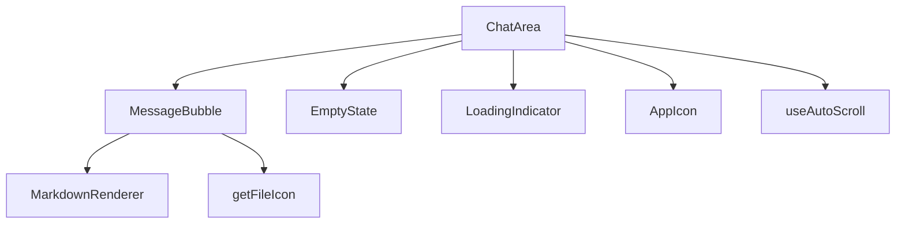
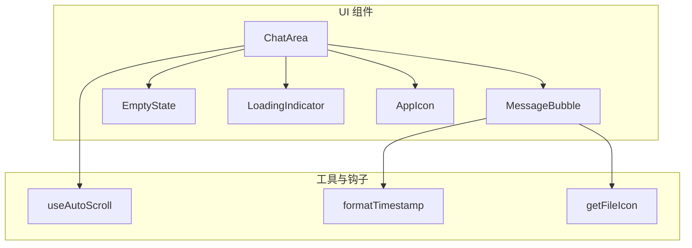
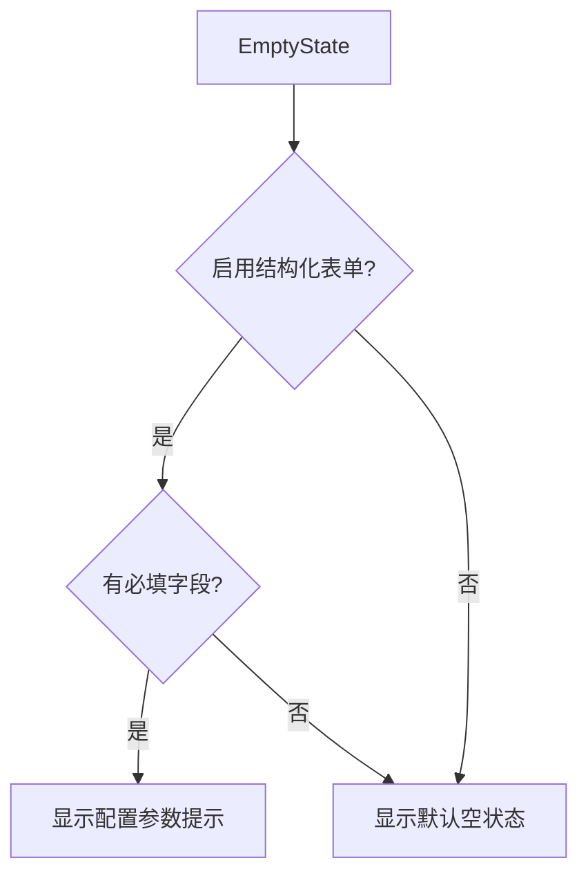
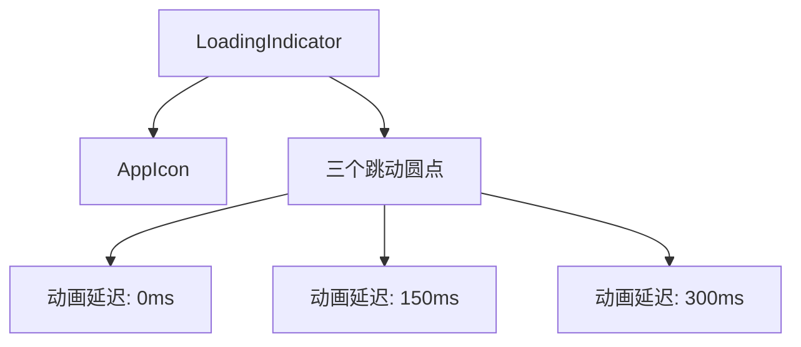
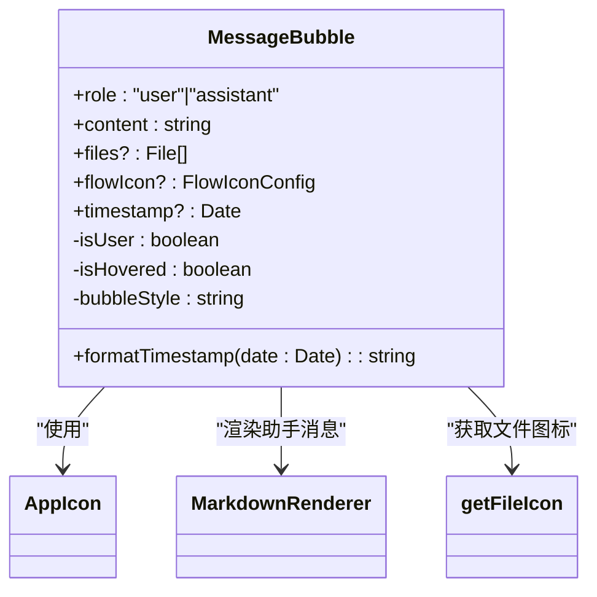
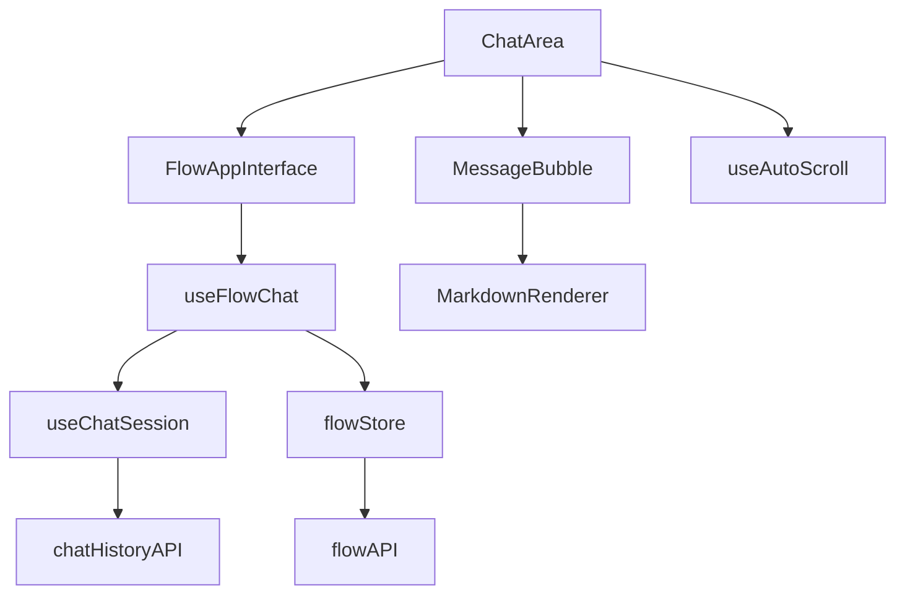

# ChatArea 组件

<cite>
**本文档中引用的文件**  
- [ChatArea.tsx](file://src/components/apps/FlowAppInterface/ChatArea.tsx)
- [MessageBubble.tsx](file://src/components/apps/FlowAppInterface/MessageBubble.tsx)
- [constants.ts](file://src/components/apps/FlowAppInterface/constants.ts)
- [AppIcon.tsx](file://src/components/apps/FlowAppInterface/AppIcon.tsx)
- [useAutoScroll.ts](file://src/hooks/useAutoScroll.ts)
- [index.tsx](file://src/components/apps/FlowAppInterface/index.tsx)
- [Header.tsx](file://src/components/apps/FlowAppInterface/Header.tsx)
- [prompt-bubble.tsx](file://src/components/ui/prompt-bubble.tsx)
- [flowAPI.ts](file://src/services/flowAPI.ts)
- [flowStore.ts](file://src/store/flowStore.ts)
- [useFlowChat.ts](file://src/hooks/useFlowChat.ts)
- [useChatSession.ts](file://src/hooks/useChatSession.ts)
- [chatHistoryAPI.ts](file://src/services/chatHistoryAPI.ts)
- [markdown-renderer.tsx](file://src/components/ui/markdown-renderer.tsx)
</cite>

## 目录
1. [简介](#简介)
2. [项目结构](#项目结构)
3. [核心组件](#核心组件)
4. [架构概述](#架构概述)
5. [详细组件分析](#详细组件分析)
6. [依赖分析](#依赖分析)
7. [性能考虑](#性能考虑)
8. [故障排除指南](#故障排除指南)
9. [结论](#结论)

## 简介
ChatArea 组件是 Flash Flow SaaS 应用中的核心聊天界面组件，负责展示用户与 AI 助手之间的对话历史、加载状态和空状态提示。该组件支持结构化表单输入、文件上传、Markdown 渲染和智能自动滚动，为用户提供流畅的交互体验。

## 项目结构
ChatArea 组件位于 `src/components/apps/FlowAppInterface/` 目录下，是 FlowAppInterface 应用界面的一部分。该组件依赖于多个子组件和工具，包括消息气泡、图标、常量定义和自动滚动钩子。

**图示来源**  
- [ChatArea.tsx](file://src/components/apps/FlowAppInterface/ChatArea.tsx)
- [MessageBubble.tsx](file://src/components/apps/FlowAppInterface/MessageBubble.tsx)
- [AppIcon.tsx](file://src/components/apps/FlowAppInterface/AppIcon.tsx)
- [useAutoScroll.ts](file://src/hooks/useAutoScroll.ts)

**本节来源**  
- [ChatArea.tsx](file://src/components/apps/FlowAppInterface/ChatArea.tsx)
- [MessageBubble.tsx](file://src/components/apps/FlowAppInterface/MessageBubble.tsx)
- [constants.ts](file://src/components/apps/FlowAppInterface/constants.ts)

## 核心组件
ChatArea 组件是 FlowAppInterface 的核心部分，负责管理聊天区域的显示逻辑。它根据消息列表、加载状态和输入节点配置来决定显示空状态、消息列表或加载指示器。

**本节来源**  
- [ChatArea.tsx](file://src/components/apps/FlowAppInterface/ChatArea.tsx)
- [index.tsx](file://src/components/apps/FlowAppInterface/index.tsx)

## 架构概述
ChatArea 组件采用组合式设计，由多个子组件构成。它通过 props 接收消息列表、加载状态、流程图标和输入节点数据，并根据这些状态决定渲染内容。

**图示来源**  
- [ChatArea.tsx](file://src/components/apps/FlowAppInterface/ChatArea.tsx)
- [MessageBubble.tsx](file://src/components/apps/FlowAppInterface/MessageBubble.tsx)
- [useAutoScroll.ts](file://src/hooks/useAutoScroll.ts)

## 详细组件分析
ChatArea 组件包含三个主要子组件：EmptyState、LoadingIndicator 和主 ChatArea 组件本身。这些组件共同构成了完整的聊天界面。

### EmptyState 分析
EmptyState 组件在没有对话历史时显示，提供用户引导。当启用了结构化表单且存在必填字段时，会显示动态提示，指导用户先配置参数。

**图示来源**  
- [ChatArea.tsx](file://src/components/apps/FlowAppInterface/ChatArea.tsx#L17-L44)

**本节来源**  
- [ChatArea.tsx](file://src/components/apps/FlowAppInterface/ChatArea.tsx#L9-L44)

### LoadingIndicator 分析
LoadingIndicator 组件显示 AI 正在思考的加载动画，包含三个跳动的圆点和流程图标。

**图示来源**  
- [ChatArea.tsx](file://src/components/apps/FlowAppInterface/ChatArea.tsx#L55-L71)

**本节来源**  
- [ChatArea.tsx](file://src/components/apps/FlowAppInterface/ChatArea.tsx#L46-L71)

### MessageBubble 分析
MessageBubble 组件负责渲染单条消息，支持用户和助手两种角色，能够显示文本内容、文件附件和时间戳。

**图示来源**  
- [MessageBubble.tsx](file://src/components/apps/FlowAppInterface/MessageBubble.tsx)
- [AppIcon.tsx](file://src/components/apps/FlowAppInterface/AppIcon.tsx)
- [markdown-renderer.tsx](file://src/components/ui/markdown-renderer.tsx)

**本节来源**  
- [MessageBubble.tsx](file://src/components/apps/FlowAppInterface/MessageBubble.tsx)

## 依赖分析
ChatArea 组件依赖于多个其他组件和服务，形成了一个完整的聊天交互系统。

**图示来源**  
- [ChatArea.tsx](file://src/components/apps/FlowAppInterface/ChatArea.tsx)
- [index.tsx](file://src/components/apps/FlowAppInterface/index.tsx)
- [useFlowChat.ts](file://src/hooks/useFlowChat.ts)
- [useChatSession.ts](file://src/hooks/useChatSession.ts)
- [chatHistoryAPI.ts](file://src/services/chatHistoryAPI.ts)
- [flowStore.ts](file://src/store/flowStore.ts)
- [flowAPI.ts](file://src/services/flowAPI.ts)

**本节来源**  
- [ChatArea.tsx](file://src/components/apps/FlowAppInterface/ChatArea.tsx)
- [useFlowChat.ts](file://src/hooks/useFlowChat.ts)
- [useChatSession.ts](file://src/hooks/useChatSession.ts)
- [chatHistoryAPI.ts](file://src/services/chatHistoryAPI.ts)

## 性能考虑
ChatArea 组件使用了智能自动滚动机制，通过 useAutoScroll 钩子实现。该钩子能够检测用户是否主动滚动，只有在用户未主动滚动或滚动回底部时才自动滚动到底部，避免了干扰用户查看历史消息。

**本节来源**  
- [useAutoScroll.ts](file://src/hooks/useAutoScroll.ts)

## 故障排除指南
当 ChatArea 组件无法正常工作时，可以检查以下常见问题：

1. **消息未自动滚动到底部**：检查 useAutoScroll 的依赖项是否正确传递
2. **结构化表单提示不显示**：确认 inputNodeData 中的 enableStructuredForm 和 formFields 配置正确
3. **文件图标显示错误**：检查 getFileIcon 函数的文件扩展名映射
4. **时间戳格式不正确**：验证 formatTimestamp 函数的日期处理逻辑

**本节来源**  
- [ChatArea.tsx](file://src/components/apps/FlowAppInterface/ChatArea.tsx)
- [MessageBubble.tsx](file://src/components/apps/FlowAppInterface/MessageBubble.tsx)
- [useAutoScroll.ts](file://src/hooks/useAutoScroll.ts)

## 结论
ChatArea 组件是一个功能丰富、设计良好的聊天界面组件，通过组合多个子组件实现了完整的聊天功能。它不仅提供了基本的消息显示功能，还支持结构化输入、文件上传和智能滚动，为用户提供了优质的交互体验。组件的模块化设计使得维护和扩展变得更加容易。