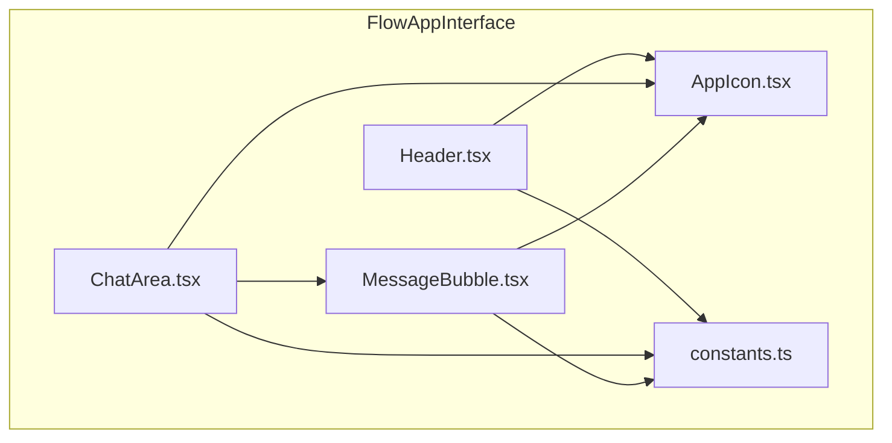
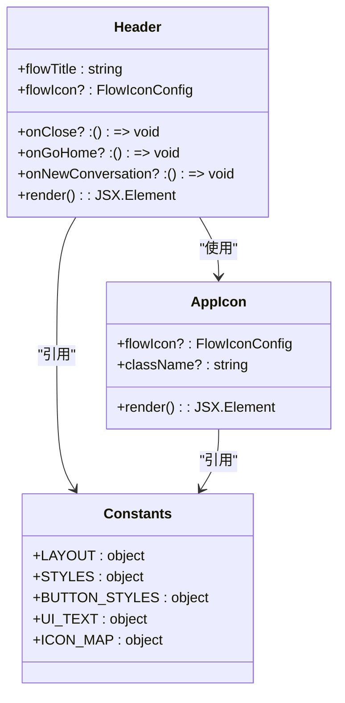
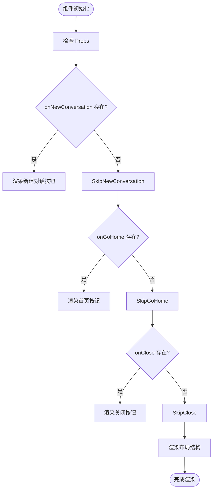
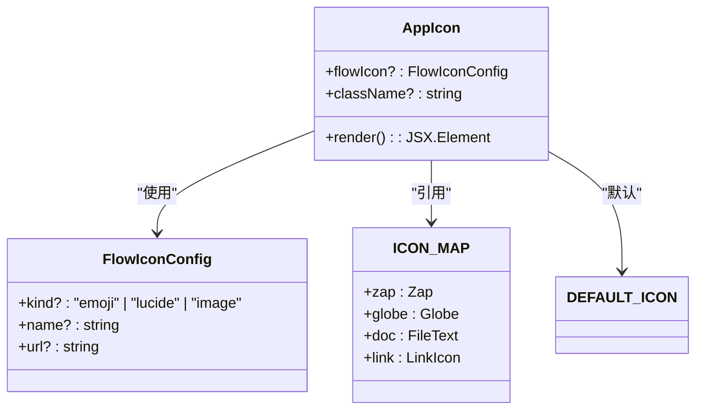
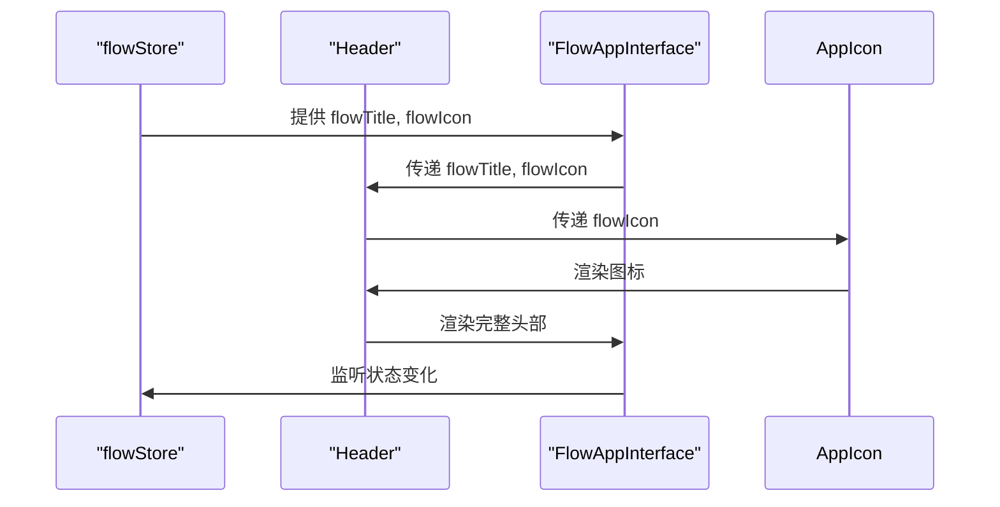
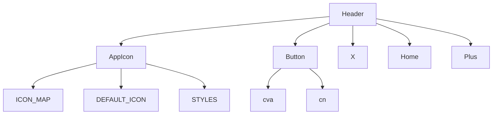

# Header 组件

<cite>
**本文档引用的文件**
- [Header.tsx](file://src/components/apps/FlowAppInterface/Header.tsx)
- [constants.ts](file://src/components/apps/FlowAppInterface/constants.ts)
- [AppIcon.tsx](file://src/components/apps/FlowAppInterface/AppIcon.tsx)
- [index.tsx](file://src/components/apps/FlowAppInterface/index.tsx)
- [tailwind.config.ts](file://tailwind.config.ts)
- [flowStore.ts](file://src/store/flowStore.ts)
</cite>

## 目录
1. [介绍](#介绍)
2. [项目结构](#项目结构)
3. [核心组件](#核心组件)
4. [架构概述](#架构概述)
5. [详细组件分析](#详细组件分析)
6. [依赖分析](#依赖分析)
7. [性能考虑](#性能考虑)
8. [故障排除指南](#故障排除指南)
9. [结论](#结论)

## 介绍
Header 组件是 Flash Flow SaaS 应用中的关键导航组件，主要用于在应用界面顶部显示流程标题、图标和操作按钮。该组件为用户提供关闭对话、返回首页和新建对话的功能，是用户与应用交互的重要入口点。Header 组件设计简洁，遵循现代 UI 设计原则，提供良好的用户体验。

## 项目结构
Header 组件位于 `src/components/apps/FlowAppInterface/` 目录下，是 FlowAppInterface 应用界面的一部分。该组件与其他相关组件（如 AppIcon、ChatArea 等）共同构成了完整的聊天交互界面。



**Diagram sources**
- [Header.tsx](file://src/components/apps/FlowAppInterface/Header.tsx)
- [AppIcon.tsx](file://src/components/apps/FlowAppInterface/AppIcon.tsx)
- [constants.ts](file://src/components/apps/FlowAppInterface/constants.ts)

## 核心组件
Header 组件是一个功能丰富的导航头部，包含流程标题、自定义图标和多个操作按钮。它通过 props 接收流程标题、图标配置以及各种事件处理函数，实现了高度的可配置性和复用性。组件使用 Tailwind CSS 进行样式设计，确保了响应式布局和一致的视觉风格。

**Section sources**
- [Header.tsx](file://src/components/apps/FlowAppInterface/Header.tsx)
- [constants.ts](file://src/components/apps/FlowAppInterface/constants.ts)

## 架构概述
Header 组件采用函数式组件模式，通过 React Hooks 实现状态管理和生命周期控制。组件的架构设计遵循单一职责原则，专注于处理头部导航区域的展示和交互。它与 AppIcon 组件紧密协作，实现多样化的图标展示功能。



**Diagram sources**
- [Header.tsx](file://src/components/apps/FlowAppInterface/Header.tsx)
- [AppIcon.tsx](file://src/components/apps/FlowAppInterface/AppIcon.tsx)
- [constants.ts](file://src/components/apps/FlowAppInterface/constants.ts)

## 详细组件分析

### Header 组件分析
Header 组件是 FlowAppInterface 的核心导航组件，负责展示流程信息和提供用户操作入口。组件通过 props 接收外部数据和回调函数，实现了高度的灵活性和可复用性。

#### 组件结构
Header 组件采用 Flexbox 布局，分为左右两个主要区域：
- 左侧区域：显示应用图标和流程标题
- 右侧区域：显示操作按钮（首页、关闭等）

组件使用了 Tailwind CSS 的实用类进行样式设计，确保了响应式布局和一致的视觉风格。

#### 属性定义
Header 组件定义了清晰的 TypeScript 接口，明确了所有 props 的类型和可选性：

```typescript
interface HeaderProps {
    flowTitle: string;
    flowIcon?: FlowIconConfig;
    onClose?: () => void;
    onGoHome?: () => void;
    onNewConversation?: () => void;
}
```

这种类型定义确保了组件的类型安全，提高了代码的可维护性。

#### 样式管理
组件通过 constants.ts 文件集中管理样式常量，实现了样式的一致性和可维护性。LAYOUT、STYLES 和 BUTTON_STYLES 等常量对象定义了组件的尺寸、间距和视觉样式。



**Diagram sources**
- [Header.tsx](file://src/components/apps/FlowAppInterface/Header.tsx)
- [constants.ts](file://src/components/apps/FlowAppInterface/constants.ts)

**Section sources**
- [Header.tsx](file://src/components/apps/FlowAppInterface/Header.tsx)
- [constants.ts](file://src/components/apps/FlowAppInterface/constants.ts)

### AppIcon 组件分析
AppIcon 组件是 Header 组件的重要依赖，负责渲染流程的自定义图标。该组件支持多种图标类型，包括 emoji、Lucide 图标和图片。

#### 图标类型支持
AppIcon 组件通过 flowIcon 的 kind 属性判断图标类型，并相应地渲染不同的 UI 元素：
- image 类型：渲染 img 标签显示图片
- lucide 类型：渲染对应的 Lucide React 图标
- emoji 类型：直接显示 emoji 字符

#### 样式设计
组件使用了统一的样式常量（如 STYLES.iconSize）确保图标大小的一致性。对于非图片类型的图标，还添加了背景色、边框和圆角等视觉效果，提升了整体美观度。



**Diagram sources**
- [AppIcon.tsx](file://src/components/apps/FlowAppInterface/AppIcon.tsx)
- [constants.ts](file://src/components/apps/FlowAppInterface/constants.ts)

**Section sources**
- [AppIcon.tsx](file://src/components/apps/FlowAppInterface/AppIcon.tsx)
- [constants.ts](file://src/components/apps/FlowAppInterface/constants.ts)

### FlowAppInterface 集成分析
Header 组件作为 FlowAppInterface 的一部分，与其他组件协同工作，构建完整的应用界面。

#### 组件集成
FlowAppInterface 将 Header 组件作为其布局结构的第一部分，通过传递必要的 props 实现功能集成：

```jsx
<Header 
    flowTitle={flowTitle} 
    flowIcon={flowIcon} 
    onClose={onClose} 
    onGoHome={onGoHome} 
    onNewConversation={onNewConversation} 
/>
```

#### 状态管理
组件通过 flowStore 状态管理器获取流程标题和图标信息，并在需要时更新这些状态。这种集中式状态管理确保了数据的一致性和可预测性。



**Diagram sources**
- [index.tsx](file://src/components/apps/FlowAppInterface/index.tsx)
- [flowStore.ts](file://src/store/flowStore.ts)

**Section sources**
- [index.tsx](file://src/components/apps/FlowAppInterface/index.tsx)
- [flowStore.ts](file://src/store/flowStore.ts)

## 依赖分析
Header 组件依赖于多个其他组件和库，形成了清晰的依赖关系网络。



**Diagram sources**
- [Header.tsx](file://src/components/apps/FlowAppInterface/Header.tsx)
- [AppIcon.tsx](file://src/components/apps/FlowAppInterface/AppIcon.tsx)
- [constants.ts](file://src/components/apps/FlowAppInterface/constants.ts)

**Section sources**
- [Header.tsx](file://src/components/apps/FlowAppInterface/Header.tsx)
- [AppIcon.tsx](file://src/components/apps/FlowAppInterface/AppIcon.tsx)
- [constants.ts](file://src/components/apps/FlowAppInterface/constants.ts)

## 性能考虑
Header 组件的设计考虑了性能优化，通过以下方式确保高效的渲染性能：
- 使用函数式组件和 React.memo 优化渲染
- 集中管理样式常量，减少重复计算
- 采用按需渲染策略，只在必要时渲染操作按钮
- 使用轻量级的 UI 组件库（如 Lucide React）减少包体积

## 故障排除指南
在使用 Header 组件时可能遇到的常见问题及解决方案：

1. **图标不显示**：检查 flowIcon 配置是否正确，确保 url 属性有效
2. **按钮无响应**：确认对应的回调函数已正确传递
3. **布局错乱**：检查 Tailwind CSS 类名是否正确，确保没有样式冲突
4. **响应式问题**：验证媒体查询设置，确保在不同设备上正常显示

**Section sources**
- [Header.tsx](file://src/components/apps/FlowAppInterface/Header.tsx)
- [AppIcon.tsx](file://src/components/apps/FlowAppInterface/AppIcon.tsx)

## 结论
Header 组件是 Flash Flow SaaS 应用中一个设计精良、功能完整的导航组件。它通过清晰的接口定义、合理的架构设计和高效的性能表现，为用户提供了一致且直观的交互体验。组件的可配置性和可复用性使其能够适应不同的应用场景，是整个应用界面的重要组成部分。