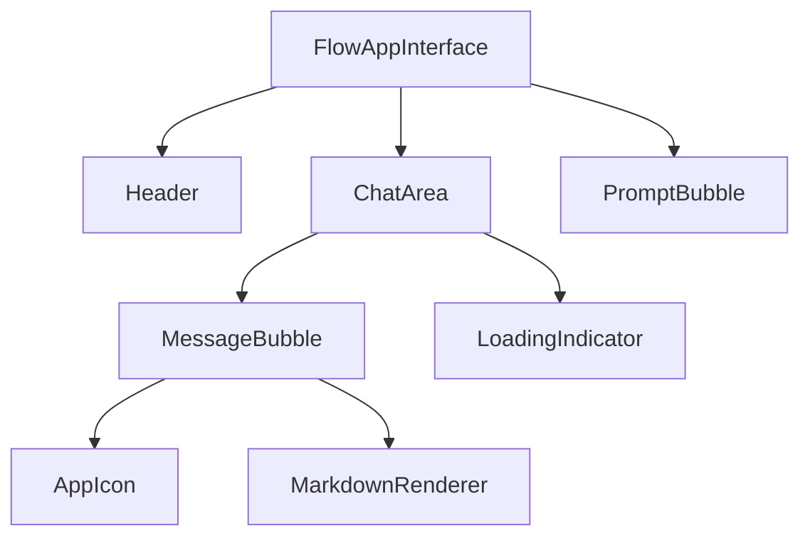
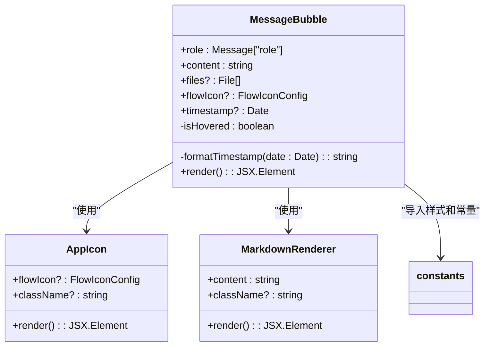
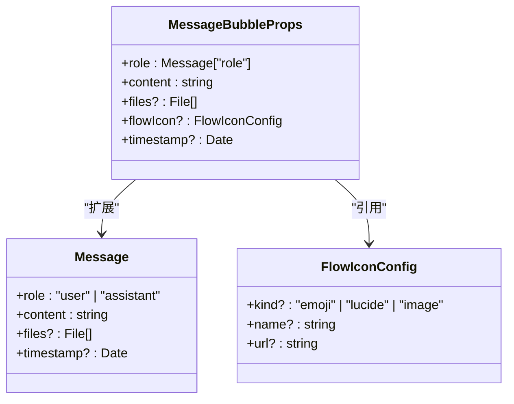
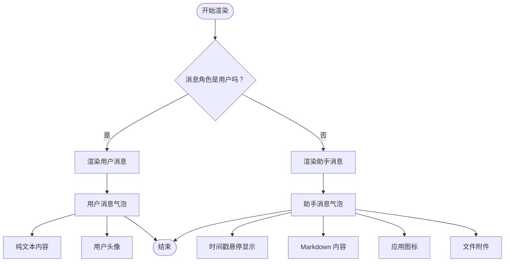
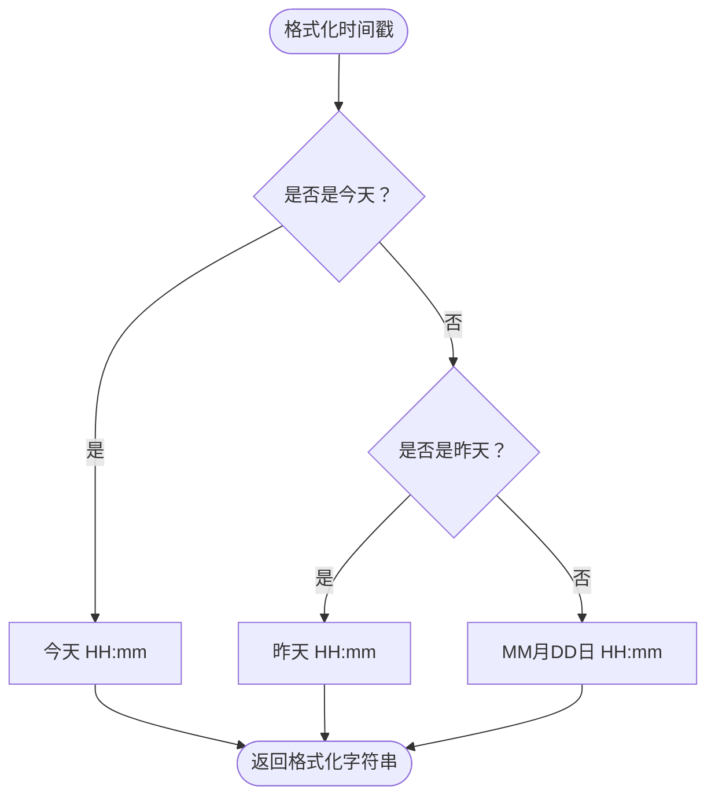
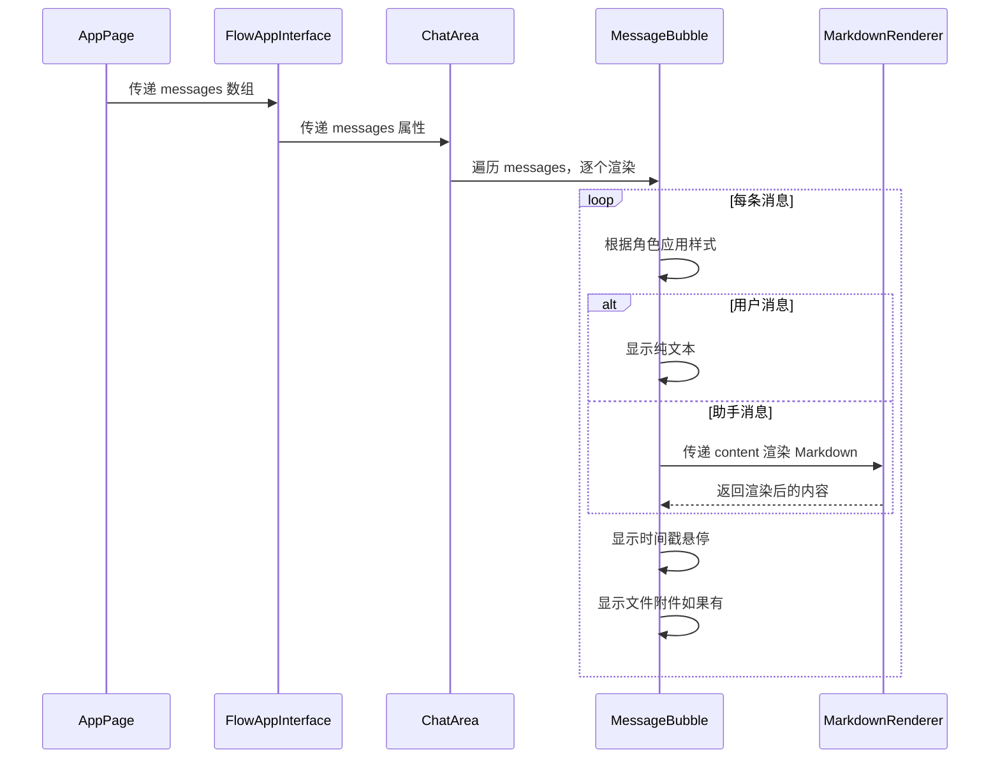

# MessageBubble 组件

<cite>
**本文档中引用的文件**   
- [MessageBubble.tsx](file://src/components/apps/FlowAppInterface/MessageBubble.tsx)
- [constants.ts](file://src/components/apps/FlowAppInterface/constants.ts)
- [ChatArea.tsx](file://src/components/apps/FlowAppInterface/ChatArea.tsx)
- [AppIcon.tsx](file://src/components/apps/FlowAppInterface/AppIcon.tsx)
- [markdown-renderer.tsx](file://src/components/ui/markdown-renderer.tsx)
- [useAutoScroll.ts](file://src/hooks/useAutoScroll.ts)
- [FlowAppInterface/index.tsx](file://src/components/apps/FlowAppInterface/index.tsx)
- [app/app/page.tsx](file://src/app/app/page.tsx)
- [useFlowChat.ts](file://src/hooks/useFlowChat.ts)
- [useChatSession.ts](file://src/hooks/useChatSession.ts)
</cite>

## 目录
1. [简介](#简介)
2. [项目结构](#项目结构)
3. [核心组件](#核心组件)
4. [架构概述](#架构概述)
5. [详细组件分析](#详细组件分析)
6. [依赖分析](#依赖分析)
7. [性能考虑](#性能考虑)
8. [故障排除指南](#故障排除指南)
9. [结论](#结论)

## 简介
MessageBubble 组件是 Flash Flow SaaS 平台中用于显示聊天消息的核心 UI 组件。该组件支持用户和助手两种角色的消息展示，能够渲染 Markdown 格式内容，并支持文件附件显示。组件具有现代化的 UI 设计，包括消息气泡、时间戳显示和响应式布局。

## 项目结构
MessageBubble 组件位于 `src/components/apps/FlowAppInterface/` 目录下，是 FlowAppInterface 应用界面的一部分。该组件与其他聊天界面组件（如 ChatArea、Header 等）共同构成了完整的聊天交互体验。



**Diagram sources**
- [index.tsx](file://src/components/apps/FlowAppInterface/index.tsx)
- [ChatArea.tsx](file://src/components/apps/FlowAppInterface/ChatArea.tsx)

**Section sources**
- [MessageBubble.tsx](file://src/components/apps/FlowAppInterface/MessageBubble.tsx)
- [ChatArea.tsx](file://src/components/apps/FlowAppInterface/ChatArea.tsx)

## 核心组件
MessageBubble 组件是聊天界面的核心组成部分，负责渲染单条消息。该组件根据消息角色（用户或助手）应用不同的样式，并支持多种内容类型，包括纯文本、Markdown 格式文本和文件附件。

**Section sources**
- [MessageBubble.tsx](file://src/components/apps/FlowAppInterface/MessageBubble.tsx)
- [constants.ts](file://src/components/apps/FlowAppInterface/constants.ts)

## 架构概述
MessageBubble 组件采用 React 函数组件实现，通过 props 接收消息数据，并根据消息类型应用相应的 UI 逻辑。组件与其他 UI 组件（如 AppIcon、MarkdownRenderer）协同工作，构建完整的消息展示功能。



**Diagram sources**
- [MessageBubble.tsx](file://src/components/apps/FlowAppInterface/MessageBubble.tsx)
- [AppIcon.tsx](file://src/components/apps/FlowAppInterface/AppIcon.tsx)
- [markdown-renderer.tsx](file://src/components/ui/markdown-renderer.tsx)

## 详细组件分析

### MessageBubble 组件分析
MessageBubble 组件是聊天界面中用于显示单条消息的核心组件。它根据消息角色（用户或助手）应用不同的样式和布局，并支持多种内容类型。

#### 组件属性
MessageBubble 组件接受以下 props：



**Diagram sources**
- [MessageBubble.tsx](file://src/components/apps/FlowAppInterface/MessageBubble.tsx)
- [constants.ts](file://src/components/apps/FlowAppInterface/constants.ts)

#### 渲染逻辑
MessageBubble 组件的渲染逻辑根据消息角色进行分支处理，用户消息和助手消息有不同的 UI 表现。



**Diagram sources**
- [MessageBubble.tsx](file://src/components/apps/FlowAppInterface/MessageBubble.tsx)

#### 时间戳格式化
MessageBubble 组件包含一个辅助函数 `formatTimestamp`，用于将日期对象格式化为可读的中文时间字符串。



**Diagram sources**
- [MessageBubble.tsx](file://src/components/apps/FlowAppInterface/MessageBubble.tsx)

**Section sources**
- [MessageBubble.tsx](file://src/components/apps/FlowAppInterface/MessageBubble.tsx)

### 消息流分析
MessageBubble 组件在聊天界面中的数据流和调用关系。



**Diagram sources**
- [app/app/page.tsx](file://src/app/app/page.tsx)
- [FlowAppInterface/index.tsx](file://src/components/apps/FlowAppInterface/index.tsx)
- [ChatArea.tsx](file://src/components/apps/FlowAppInterface/ChatArea.tsx)
- [MessageBubble.tsx](file://src/components/apps/FlowAppInterface/MessageBubble.tsx)

## 依赖分析
MessageBubble 组件依赖于多个其他组件和工具，形成了一个完整的消息展示系统。

```mermaid
graph TD
MessageBubble --> AppIcon : "显示助手头像"
MessageBubble --> MarkdownRenderer : "渲染 Markdown 内容"
MessageBubble --> constants : "获取样式和常量"
MessageBubble --> useAutoScroll : "自动滚动支持"
AppIcon --> constants : "获取图标配置"
MarkdownRenderer --> react-markdown : "Markdown 解析"
MarkdownRenderer --> remark-gfm : "GFM 语法支持"
```

**Diagram sources**
- [MessageBubble.tsx](file://src/components/apps/FlowAppInterface/MessageBubble.tsx)
- [AppIcon.tsx](file://src/components/apps/FlowAppInterface/AppIcon.tsx)
- [markdown-renderer.tsx](file://src/components/ui/markdown-renderer.tsx)
- [useAutoScroll.ts](file://src/hooks/useAutoScroll.ts)

**Section sources**
- [MessageBubble.tsx](file://src/components/apps/FlowAppInterface/MessageBubble.tsx)
- [AppIcon.tsx](file://src/components/apps/FlowAppInterface/AppIcon.tsx)
- [markdown-renderer.tsx](file://src/components/ui/markdown-renderer.tsx)

## 性能考虑
MessageBubble 组件在性能方面有以下考虑：

1. **条件渲染**：仅在需要时渲染时间戳和文件附件，避免不必要的 DOM 操作。
2. **样式优化**：使用预定义的 CSS 类（通过 STYLES 常量），减少内联样式计算。
3. **事件处理**：使用 onMouseEnter 和 onMouseLeave 事件处理悬停状态，避免频繁的 re-render。
4. **文件附件**：对文件附件使用 key 属性（文件索引），确保列表渲染的稳定性。

**Section sources**
- [MessageBubble.tsx](file://src/components/apps/FlowAppInterface/MessageBubble.tsx)
- [constants.ts](file://src/components/apps/FlowAppInterface/constants.ts)

## 故障排除指南
在使用 MessageBubble 组件时可能遇到的常见问题及解决方案：

1. **Markdown 内容未正确渲染**：确保传递给组件的 content 字符串是有效的 Markdown 格式。
2. **时间戳不显示**：检查是否为助手消息且提供了 timestamp 属性。
3. **文件附件显示异常**：确保 files 数组中的每个文件对象都有有效的 name 和 size 属性。
4. **图标显示错误**：检查 flowIcon 配置是否正确，特别是 kind 和 name/url 属性。

**Section sources**
- [MessageBubble.tsx](file://src/components/apps/FlowAppInterface/MessageBubble.tsx)
- [AppIcon.tsx](file://src/components/apps/FlowAppInterface/AppIcon.tsx)
- [constants.ts](file://src/components/apps/FlowAppInterface/constants.ts)

## 结论
MessageBubble 组件是 Flash Flow SaaS 平台聊天界面的核心组件，提供了灵活且功能丰富消息展示能力。通过合理的架构设计和组件化实现，该组件能够高效地处理不同类型的消息，并提供良好的用户体验。组件的可扩展性和可维护性良好，便于未来添加新功能或修改现有功能。