# 构建器组件

<cite>
**本文档中引用的文件**
- [AppModeOverlay.tsx](file://src/components/builder/AppModeOverlay.tsx)
- [BrainBar.tsx](file://src/components/builder/BrainBar.tsx)
- [ContextHUD.tsx](file://src/components/builder/ContextHUD.tsx)
- [ControlDock.tsx](file://src/components/builder/ControlDock.tsx)
- [LaunchCard.tsx](file://src/components/builder/LaunchCard.tsx)
- [FlowAppInterface.tsx](file://src/components/apps/FlowAppInterface.tsx)
- [page.tsx](file://src/app/builder/page.tsx)
- [flowStore.ts](file://src/store/flowStore.ts)
- [flow.ts](file://src/types/flow.ts)
- [prompt-bubble.tsx](file://src/components/ui/prompt-bubble.tsx)
- [zIndex.ts](file://src/lib/zIndex.ts)
</cite>

## 目录
1. [简介](#简介)
2. [项目结构](#项目结构)
3. [核心组件概览](#核心组件概览)
4. [AppModeOverlay（应用模式覆盖层）](#appmodeoverlay应用模式覆盖层)
5. [BrainBar（智能辅助栏）](#brainbar智能辅助栏)
6. [ContextHUD（上下文信息浮层）](#contexthud上下文信息浮层)
7. [ControlDock（控制面板）](#controldock控制面板)
8. [LaunchCard（启动卡片）](#launchcard启动卡片)
9. [组件间协作关系](#组件间协作关系)
10. [状态管理架构](#状态管理架构)
11. [最佳实践与定制化建议](#最佳实践与定制化建议)
12. [总结](#总结)

## 简介

Flash Flow构建器界面是一个基于React和Tailwind CSS的现代化工作流构建平台，采用分层UI架构设计，提供了丰富的交互功能和直观的操作体验。该系统的核心由五个主要UI组件构成：AppModeOverlay（应用模式覆盖层）、BrainBar（智能辅助栏）、ContextHUD（上下文信息浮层）、ControlDock（控制面板）和LaunchCard（启动卡片），它们协同工作为用户提供完整的工作流构建体验。

## 项目结构

构建器组件位于`src/components/builder/`目录下，采用模块化设计，每个组件都有明确的职责分工：

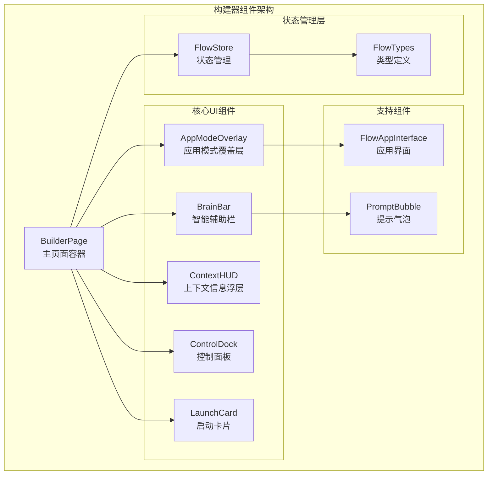

**图表来源**
- [page.tsx](file://src/app/builder/page.tsx#L1-L208)
- [AppModeOverlay.tsx](file://src/components/builder/AppModeOverlay.tsx#L1-L104)
- [BrainBar.tsx](file://src/components/builder/BrainBar.tsx#L1-L281)
- [ContextHUD.tsx](file://src/components/builder/ContextHUD.tsx#L1-L317)
- [ControlDock.tsx](file://src/components/builder/ControlDock.tsx#L1-L228)
- [LaunchCard.tsx](file://src/components/builder/LaunchCard.tsx#L1-L56)

**章节来源**
- [page.tsx](file://src/app/builder/page.tsx#L1-L208)

## 核心组件概览

### 组件层次结构

构建器界面采用分层设计，通过z-index层级管理确保正确的显示顺序：

| 层级 | 组件 | 功能描述 | Z-Index |
|------|------|----------|---------|
| 0 | FlowCanvas | 无限画布区域 | CANVAS (0) |
| 10 | BrainBar | 智能辅助栏 | CONTROLS (10) |
| 20 | ContextHUD | 上下文信息浮层 | HUD (20) |
| 30 | ControlDock | 控制面板 | CONTROLS (10) |
| 40 | LaunchCard | 启动卡片 | HUD (20) |
| 50 | AppModeOverlay | 应用模式覆盖层 | MODAL (50) |
| 100 | CopilotOverlay | 智能助手覆盖层 | COPILOT_OVERLAY (100) |

### 视觉设计原则

所有组件都遵循统一的设计语言：
- **色彩系统**：白色背景搭配灰色系边框，突出重点元素
- **圆角设计**：采用圆角卡片和按钮，营造现代感
- **阴影效果**：适当的阴影增强层次感
- **动画过渡**：使用Framer Motion实现流畅的进入退出动画

**章节来源**
- [zIndex.ts](file://src/lib/zIndex.ts#L1-L24)

## AppModeOverlay（应用模式覆盖层）

### 组件功能概述

AppModeOverlay是构建器界面的核心交互组件，负责在应用模式下提供类似聊天机器人的交互体验。它将整个画布区域转换为一个可交互的应用界面，支持实时对话和流程执行反馈。

### 视觉设计

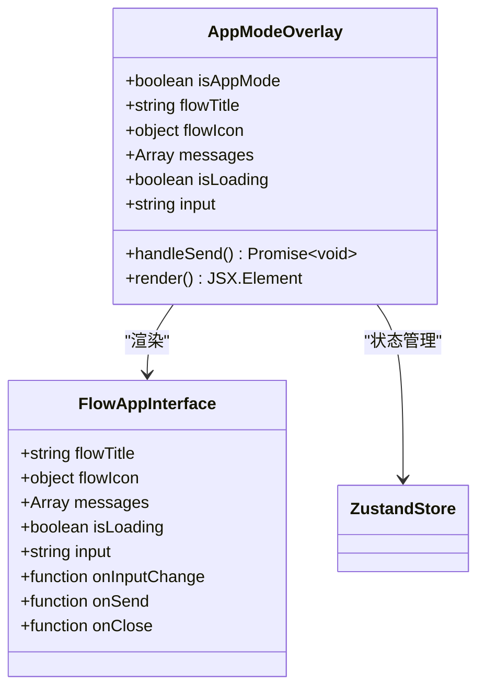

**图表来源**
- [AppModeOverlay.tsx](file://src/components/builder/AppModeOverlay.tsx#L8-L104)
- [FlowAppInterface.tsx](file://src/components/apps/FlowAppInterface.tsx#L7-L133)

### 核心特性

#### 1. 实时消息交互
- 支持用户与流程进行自然语言对话
- 实时显示AI响应和系统反馈
- 自动滚动到底部功能

#### 2. 流程执行监控
- 显示当前执行状态
- 提供执行结果可视化
- 错误处理和重试机制

#### 3. 状态同步
- 与Zustand store保持实时同步
- 监听执行状态变化
- 自动更新消息历史

### Props接口定义

| 属性名 | 类型 | 必需 | 描述 |
|--------|------|------|------|
| flowTitle | string | 是 | 流程标题 |
| flowIcon | object | 是 | 流程图标配置 |
| messages | Array | 是 | 消息历史数组 |
| isLoading | boolean | 是 | 加载状态 |
| input | string | 是 | 用户输入内容 |
| onInputChange | function | 是 | 输入变化回调 |
| onSend | function | 是 | 发送消息回调 |
| onClose | function | 否 | 关闭回调 |

### 交互逻辑

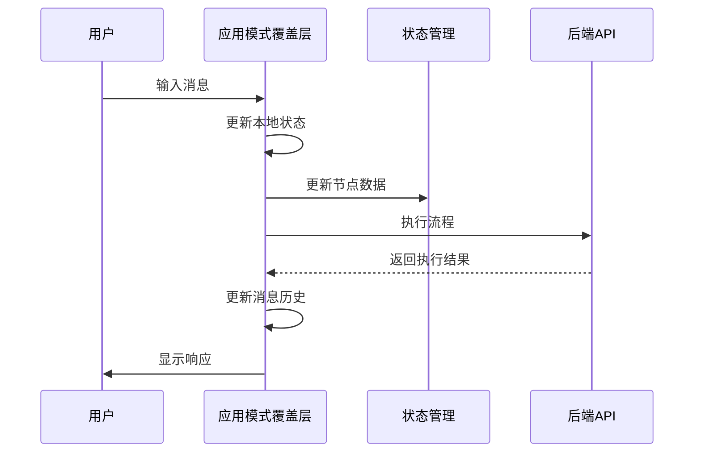

**图表来源**
- [AppModeOverlay.tsx](file://src/components/builder/AppModeOverlay.tsx#L58-L74)

### 与Zustand Store集成

AppModeOverlay通过以下方式与状态管理集成：

- **状态订阅**：监听`isAppMode`状态变化
- **数据获取**：获取流程标题、图标、节点数据
- **状态更新**：触发流程执行和消息更新

**章节来源**
- [AppModeOverlay.tsx](file://src/components/builder/AppModeOverlay.tsx#L1-L104)
- [FlowAppInterface.tsx](file://src/components/apps/FlowAppInterface.tsx#L1-L133)

## BrainBar（智能辅助栏）

### 组件功能概述

BrainBar是构建器界面的智能辅助工具，提供AI驱动的流程生成功能和节点管理能力。它支持两种操作模式：全量生成和局部修改，为用户提供智能化的工作流构建体验。

### 视觉设计

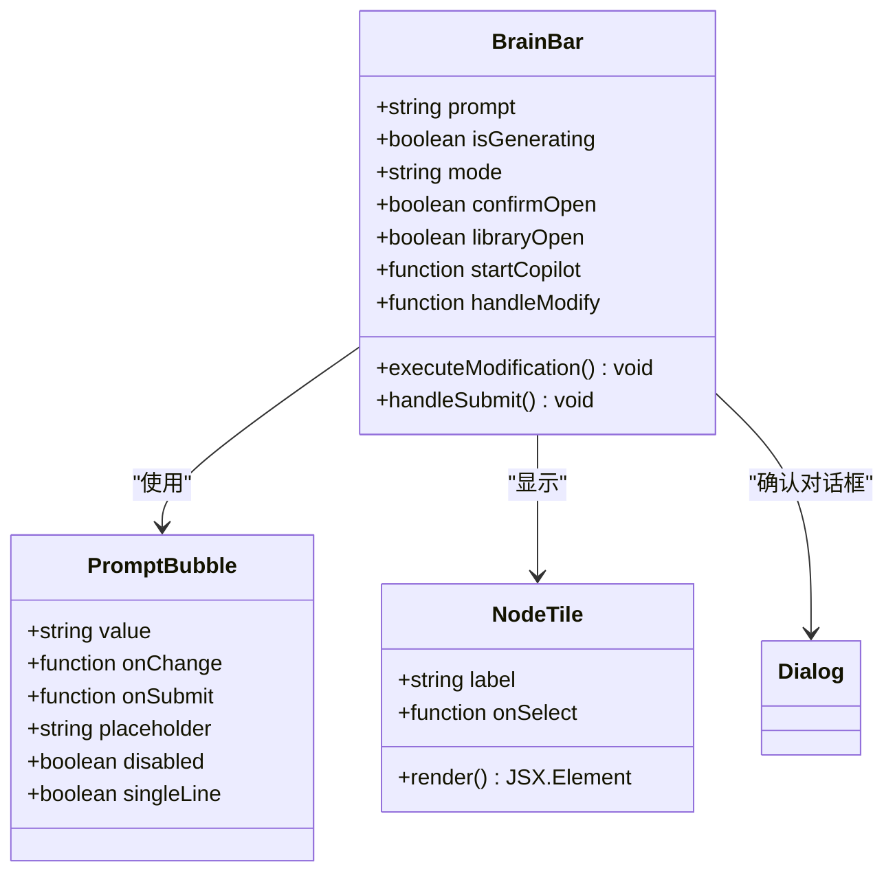

**图表来源**
- [BrainBar.tsx](file://src/components/builder/BrainBar.tsx#L13-L281)
- [prompt-bubble.tsx](file://src/components/ui/prompt-bubble.tsx#L8-L113)

### 核心特性

#### 1. AI驱动的流程生成
- 基于自然语言描述自动生成工作流
- 支持复杂的业务逻辑推理
- 提供可视化编辑和确认机制

#### 2. 节点库管理
- 预设多种节点类型（输入、LLM、RAG、HTTP、输出）
- 可拖拽添加到画布
- 支持自定义节点配置

#### 3. 局部修改功能
- 基于现有流程进行精确修改
- 支持删除、添加、修改节点操作
- 提供操作确认机制

### 操作模式对比

| 模式 | 功能描述 | 使用场景 | 输出结果 |
|------|----------|----------|----------|
| 全量生成 | 根据描述重新生成完整流程 | 新建复杂流程 | 完整的节点和连接 |
| 局部修改 | 在现有流程基础上进行修改 | 优化或调整现有流程 | 修改后的流程状态 |

### 交互流程

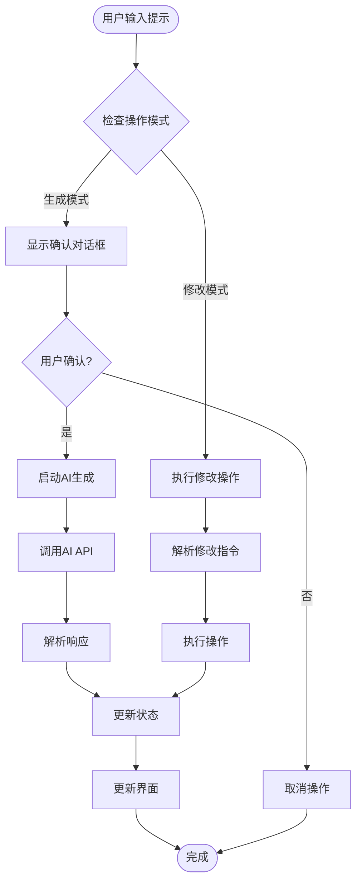

**图表来源**
- [BrainBar.tsx](file://src/components/builder/BrainBar.tsx#L29-L62)

### 与Zustand Store集成

BrainBar通过以下方式与状态管理深度集成：

- **状态访问**：获取节点列表、边连接、当前状态
- **动作触发**：触发节点添加、删除、修改操作
- **AI交互**：调用copilot相关API和状态管理

**章节来源**
- [BrainBar.tsx](file://src/components/builder/BrainBar.tsx#L1-L281)
- [prompt-bubble.tsx](file://src/components/ui/prompt-bubble.tsx#L1-L113)

## ContextHUD（上下文信息浮层）

### 组件功能概述

ContextHUD是一个上下文感知的信息面板，当用户选择特定节点时自动显示，提供节点级别的配置和调试功能。它支持不同类型的节点配置，包括LLM参数、HTTP设置、RAG文件管理和输入输出配置。

### 视觉设计

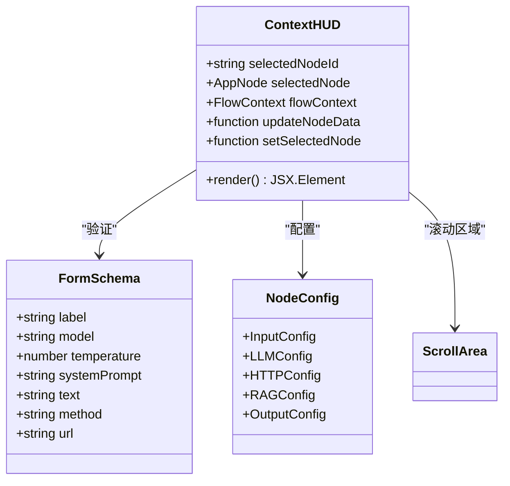

**图表来源**
- [ContextHUD.tsx](file://src/components/builder/ContextHUD.tsx#L41-L317)
- [flow.ts](file://src/types/flow.ts#L31-L42)

### 核心特性

#### 1. 节点类型适配
- **LLM节点**：配置模型参数、系统提示词、温度设置
- **HTTP节点**：设置请求方法、URL地址
- **RAG节点**：管理知识库文件上传
- **输入输出节点**：配置文本内容

#### 2. 实时配置管理
- 表单验证和错误提示
- 实时预览配置效果
- 自动保存变更

#### 3. 执行结果展示
- 显示最近一次执行的输出结果
- JSON格式化展示
- 滚动浏览大段数据

### 节点配置表

| 节点类型 | 主要配置项 | 验证规则 | 默认值 |
|----------|------------|----------|--------|
| LLM | 模型、温度、系统提示词 | 温度范围0-1 | Doubao-Seed-1-6-Flash |
| HTTP | 请求方法、URL | URL格式验证 | GET |
| RAG | 文件上传 | 多文件支持 | 无 |
| Input | 文本内容 | 字符串验证 | 空字符串 |
| Output | 文本内容 | 字符串验证 | 空字符串 |

### 交互逻辑

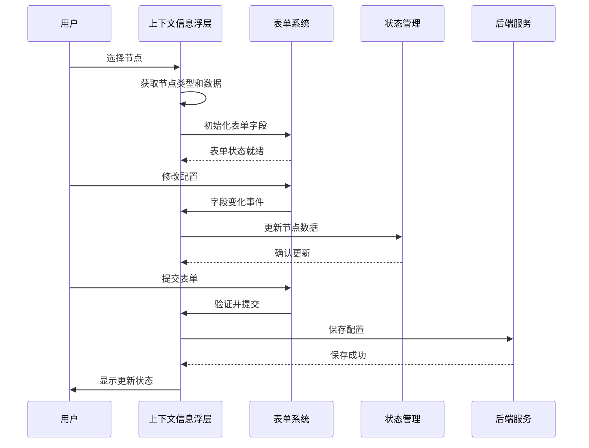

**图表来源**
- [ContextHUD.tsx](file://src/components/builder/ContextHUD.tsx#L58-L79)

### 与Zustand Store集成

ContextHUD通过以下方式与状态管理集成：

- **状态监听**：监听选中节点变化
- **数据获取**：获取节点配置和执行上下文
- **状态更新**：触发节点数据更新
- **表单管理**：使用react-hook-form进行表单状态管理

**章节来源**
- [ContextHUD.tsx](file://src/components/builder/ContextHUD.tsx#L1-L317)

## ControlDock（控制面板）

### 组件功能概述

ControlDock是构建器界面的核心控制中心，提供画布导航、缩放控制、执行管理和错误处理等功能。它采用浮动设计，始终保持在用户视野范围内，提供便捷的操作入口。

### 视觉设计

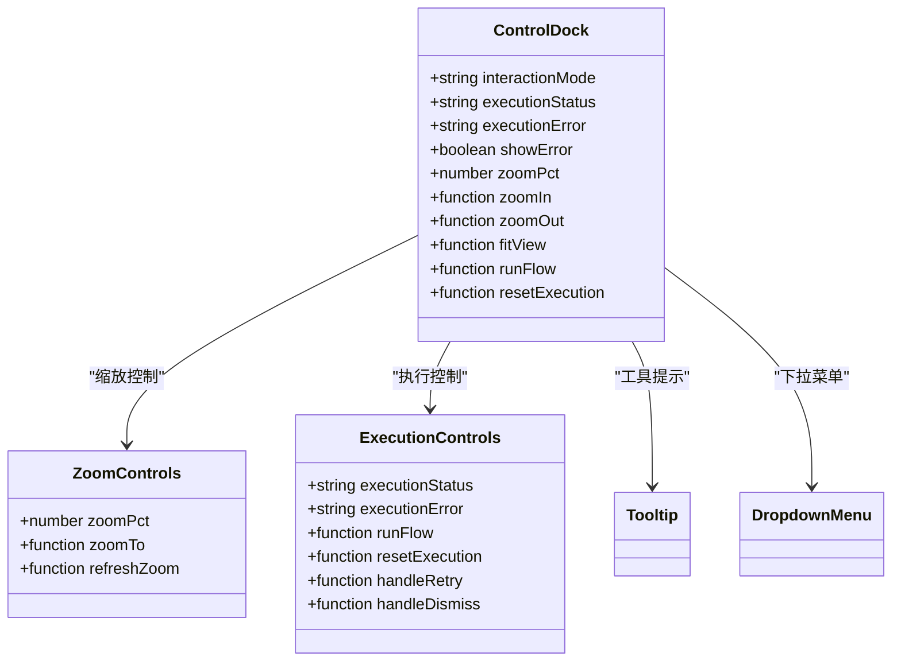

**图表来源**
- [ControlDock.tsx](file://src/components/builder/ControlDock.tsx#L12-L228)

### 核心特性

#### 1. 画布导航控制
- **缩放功能**：支持放大、缩小、自适应视图
- **视图定位**：提供预设缩放级别选项
- **平移控制**：鼠标模式和触控板模式切换

#### 2. 执行状态管理
- **运行控制**：一键运行整个流程
- **状态指示**：实时显示执行状态
- **错误处理**：提供错误通知和重试机制

#### 3. 交互模式切换
- **选择模式**：用于节点选择和编辑
- **平移模式**：用于画布导航
- **智能切换**：根据用户操作自动调整

### 缩放控制系统

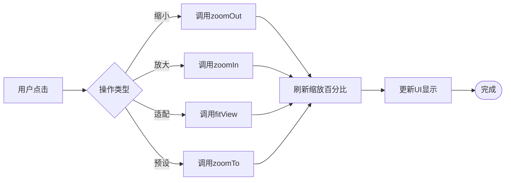

**图表来源**
- [ControlDock.tsx](file://src/components/builder/ControlDock.tsx#L95-L148)

### 错误处理机制

ControlDock实现了完善的错误处理系统：

| 错误状态 | 显示形式 | 用户操作 | 处理逻辑 |
|----------|----------|----------|----------|
| idle | 隐藏 | 无 | 正常状态 |
| running | 运行中状态 | 禁用 | 执行中不可操作 |
| completed | 成功状态 | 无 | 显示成功标识 |
| error | 错误通知 | 重试/关闭 | 显示错误详情和操作按钮 |

### 与Zustand Store集成

ControlDock通过以下方式与状态管理集成：

- **状态订阅**：监听交互模式、执行状态变化
- **动作触发**：触发缩放、执行、重置等操作
- **错误管理**：监听执行错误并显示通知

**章节来源**
- [ControlDock.tsx](file://src/components/builder/ControlDock.tsx#L1-L228)

## LaunchCard（启动卡片）

### 组件功能概述

LaunchCard是构建器界面的启动提示组件，在流程执行完成后自动显示，提供快速打开应用的功能。它采用渐显动画，引导用户从构建模式过渡到应用模式。

### 视觉设计

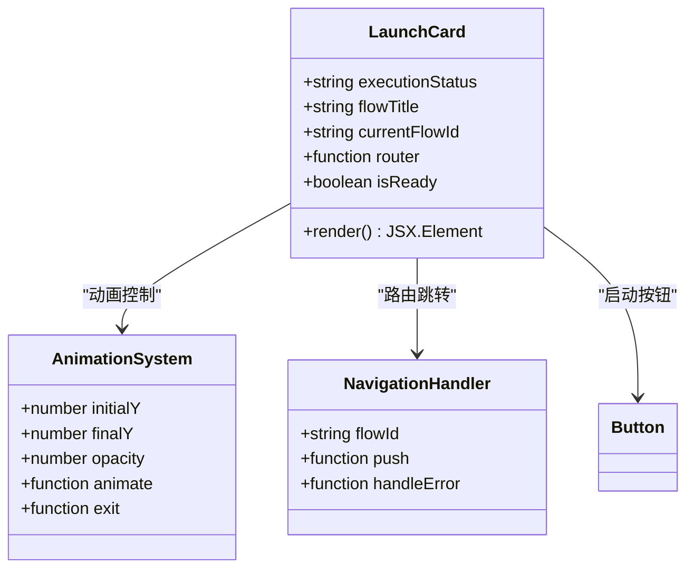

**图表来源**
- [LaunchCard.tsx](file://src/components/builder/LaunchCard.tsx#L8-L56)

### 核心特性

#### 1. 状态感知显示
- 基于执行状态自动显示/隐藏
- 使用AnimatePresence实现流畅动画
- 支持Ready状态检测

#### 2. 快速启动功能
- 一键跳转到应用模式
- 自动携带流程ID参数
- 提供视觉反馈

#### 3. 动画效果
- 从底部滑入的进入动画
- 从顶部滑出的退出动画
- 缓动曲线保证流畅体验

### 显示条件

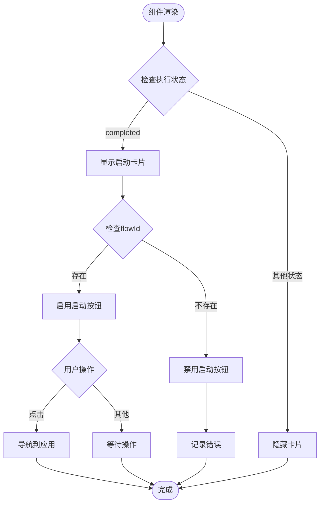

**图表来源**
- [LaunchCard.tsx](file://src/components/builder/LaunchCard.tsx#L14-L16)

### 与Zustand Store集成

LaunchCard通过以下方式与状态管理集成：

- **状态监听**：监听执行状态变化
- **数据获取**：获取流程标题和ID
- **路由控制**：触发页面导航

**章节来源**
- [LaunchCard.tsx](file://src/components/builder/LaunchCard.tsx#L1-L56)

## 组件间协作关系

### 层级关系

构建器组件按照功能和视觉层级形成有机的整体：

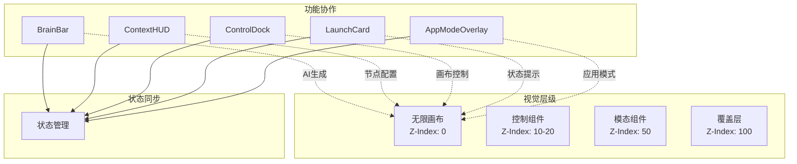

**图表来源**
- [page.tsx](file://src/app/builder/page.tsx#L127-L198)
- [zIndex.ts](file://src/lib/zIndex.ts#L6-L21)

### 数据流向

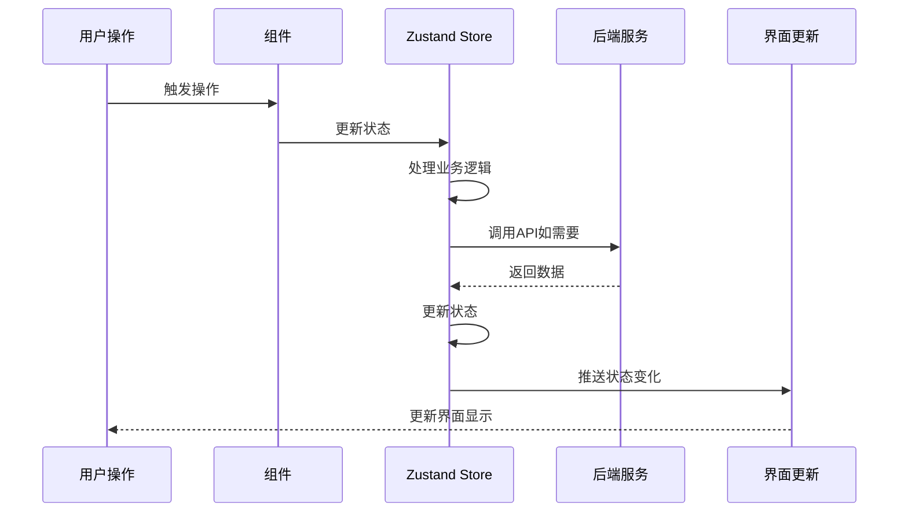

### 协作模式

#### 1. AI驱动的流程生成
- BrainBar接收用户提示
- 调用AI API生成流程
- 更新Zustand store
- 其他组件响应状态变化

#### 2. 节点配置管理
- ContextHUD监听选中节点
- 用户修改配置
- 触发状态更新
- Canvas实时反映变化

#### 3. 执行状态同步
- ControlDock显示执行状态
- LaunchCard响应完成状态
- AppModeOverlay提供应用模式
- 各组件协调工作

**章节来源**
- [page.tsx](file://src/app/builder/page.tsx#L127-L198)

## 状态管理架构

### Zustand Store设计

构建器组件的状态管理采用Zustand库，通过模块化的方式组织功能：

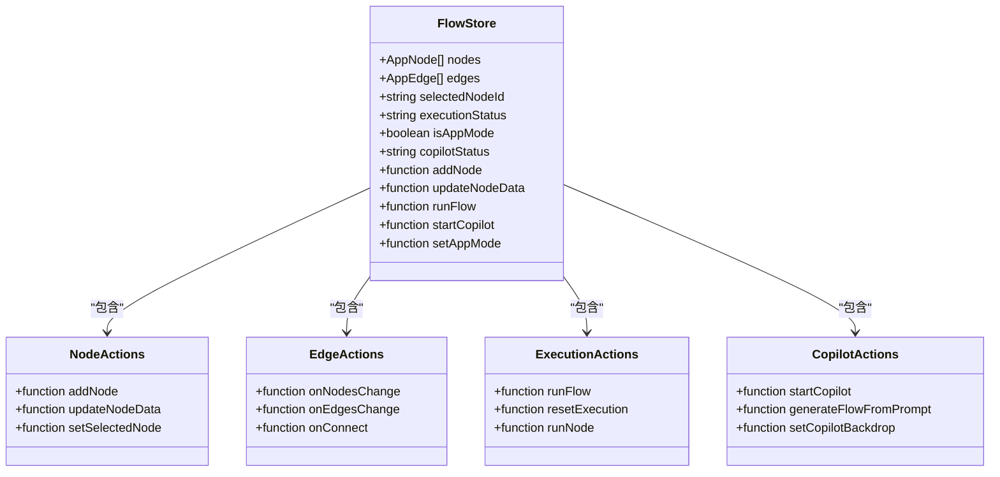

**图表来源**
- [flowStore.ts](file://src/store/flowStore.ts#L17-L131)
- [flow.ts](file://src/types/flow.ts#L83-L152)

### 状态类型定义

| 状态属性 | 类型 | 描述 | 默认值 |
|----------|------|------|--------|
| nodes | AppNode[] | 节点列表 | [] |
| edges | AppEdge[] | 边连接列表 | [] |
| selectedNodeId | string \| null | 选中节点ID | null |
| executionStatus | ExecutionStatus | 执行状态 | "idle" |
| isAppMode | boolean | 应用模式状态 | false |
| copilotStatus | "idle" \| "thinking" \| "completed" | AI助手状态 | "idle" |

### 状态更新流程

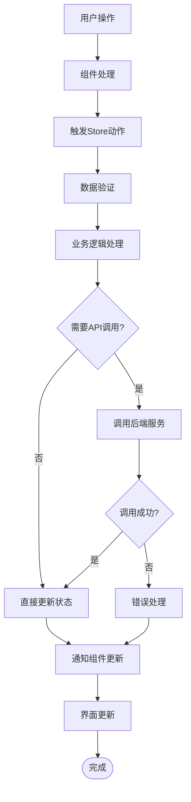

**图表来源**
- [flowStore.ts](file://src/store/flowStore.ts#L17-L131)

**章节来源**
- [flowStore.ts](file://src/store/flowStore.ts#L1-L131)
- [flow.ts](file://src/types/flow.ts#L83-L152)

## 最佳实践与定制化建议

### 开发最佳实践

#### 1. 组件设计原则
- **单一职责**：每个组件专注于特定功能
- **松耦合**：通过props和状态管理解耦
- **可测试性**：提供清晰的接口和状态

#### 2. 性能优化策略
- **懒加载**：按需加载大型组件
- **状态缓存**：合理使用状态缓存避免重复计算
- **事件防抖**：对频繁触发的操作进行防抖处理

#### 3. 错误处理规范
- **渐进式增强**：优雅降级处理错误
- **用户友好的错误提示**：提供清晰的错误信息
- **日志记录**：记录关键操作和错误信息

### 定制化扩展建议

#### 1. 节点类型扩展
```typescript
// 扩展NodeKind类型
export type NodeKind =
  | "input"
  | "llm"
  | "rag"
  | "output"
  | "branch"
  | "http"
  | "custom"  // 新增自定义节点类型

// 扩展节点数据类型
export interface CustomNodeData extends BaseNodeData {
  customProperty: string;
  config?: Record<string, unknown>;
}
```

#### 2. 组件主题定制
```typescript
// 创建主题配置
export const THEME_CONFIG = {
  colors: {
    primary: "#000000",
    secondary: "#4B5563",
    background: "#FFFFFF",
    surface: "#F3F4F6",
  },
  spacing: {
    small: "0.5rem",
    medium: "1rem",
    large: "2rem",
  },
  typography: {
    fontFamily: "Inter, sans-serif",
    fontSize: {
      base: "16px",
      small: "14px",
      large: "18px",
    },
  },
}
```

#### 3. 动画系统扩展
```typescript
// 创建动画配置
export const ANIMATION_CONFIG = {
  duration: {
    fast: 150,
    medium: 300,
    slow: 500,
  },
  easing: {
    easeInOut: "cubic-bezier(0.455, 0.03, 0.515, 0.955)",
    easeOut: "cubic-bezier(0.215, 0.61, 0.355, 1)",
  },
  variants: {
    fadeIn: { opacity: 1, scale: 1 },
    fadeOut: { opacity: 0, scale: 0.95 },
  },
}
```

### 集成指南

#### 1. 第三方服务集成
- **AI服务**：集成不同的AI提供商API
- **存储服务**：集成文件存储和数据库服务
- **认证服务**：集成OAuth和JWT认证

#### 2. 移动端适配
- **触摸交互**：优化触摸操作体验
- **响应式设计**：适配不同屏幕尺寸
- **性能优化**：针对移动设备优化性能

#### 3. 国际化支持
- **多语言**：支持国际化文本
- **本地化**：适配不同地区的日期、时间格式
- **RTL支持**：支持从右到左的语言

### 故障排除指南

#### 常见问题及解决方案

| 问题类型 | 症状 | 可能原因 | 解决方案 |
|----------|------|----------|----------|
| 组件不显示 | 组件元素缺失 | 条件渲染错误 | 检查显示条件和状态 |
| 状态不同步 | 界面不更新 | 状态更新失败 | 检查状态更新逻辑 |
| 性能问题 | 界面卡顿 | 频繁重渲染 | 优化组件结构和状态 |
| 动画异常 | 动画不流畅 | 动画配置错误 | 检查动画参数和依赖 |

#### 调试技巧
- **状态检查**：使用浏览器开发者工具检查状态
- **网络监控**：监控API调用和响应
- **性能分析**：使用React Profiler分析性能瓶颈
- **错误边界**：实现错误边界捕获异常

**章节来源**
- [flowStore.ts](file://src/store/flowStore.ts#L17-L131)
- [BrainBar.tsx](file://src/components/builder/BrainBar.tsx#L1-L281)
- [ContextHUD.tsx](file://src/components/builder/ContextHUD.tsx#L1-L317)

## 总结

Flash Flow构建器界面通过精心设计的五大核心组件，为用户提供了完整而强大的工作流构建体验。每个组件都有明确的职责分工和协作机制：

- **AppModeOverlay**提供应用模式下的交互体验
- **BrainBar**实现AI驱动的智能辅助功能  
- **ContextHUD**提供节点级别的配置管理
- **ControlDock**负责画布控制和执行管理
- **LaunchCard**引导用户从构建到应用的过渡

这些组件通过Zustand状态管理系统实现高效的数据流转和状态同步，采用模块化的架构设计确保了系统的可维护性和扩展性。整体设计遵循现代UI设计原则，注重用户体验和交互流畅性。

通过合理的组件划分、清晰的接口定义和完善的错误处理机制，这套构建器组件体系不仅满足了当前的功能需求，还为未来的功能扩展和定制化提供了良好的基础。开发者可以基于现有的架构模式，轻松地添加新的节点类型、扩展交互功能或集成第三方服务，从而构建更加丰富和强大的工作流平台。