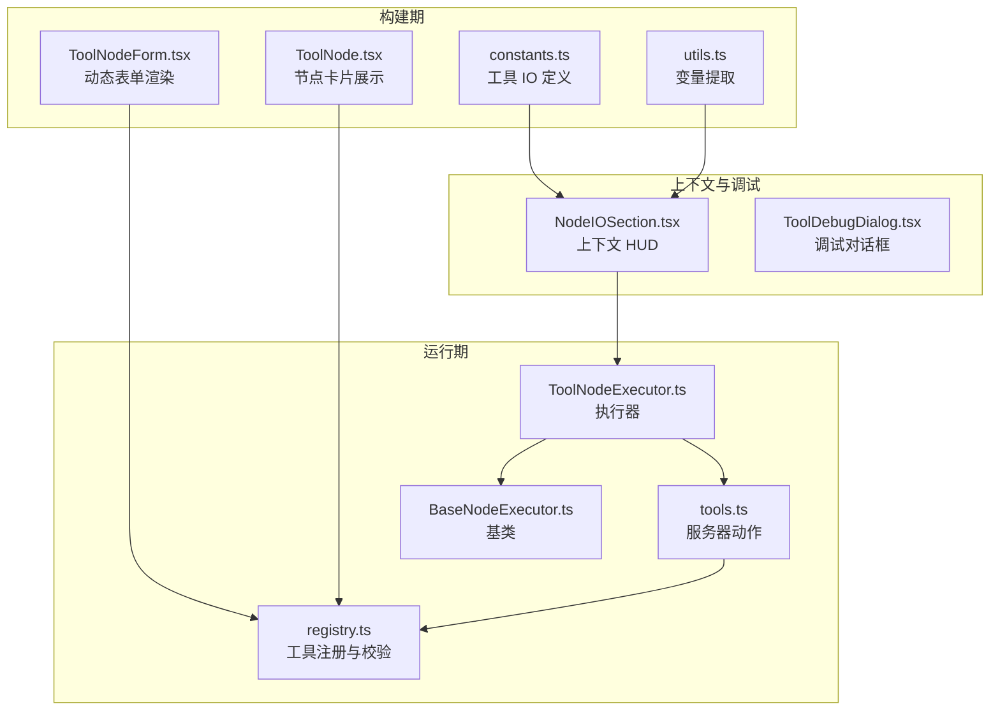
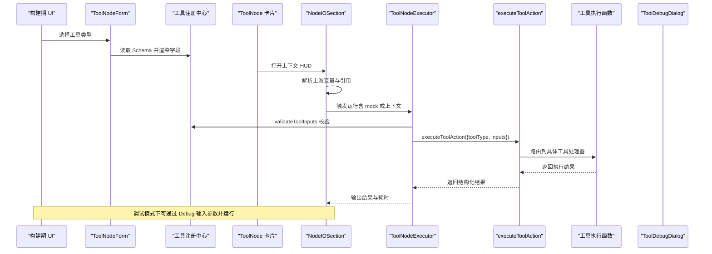
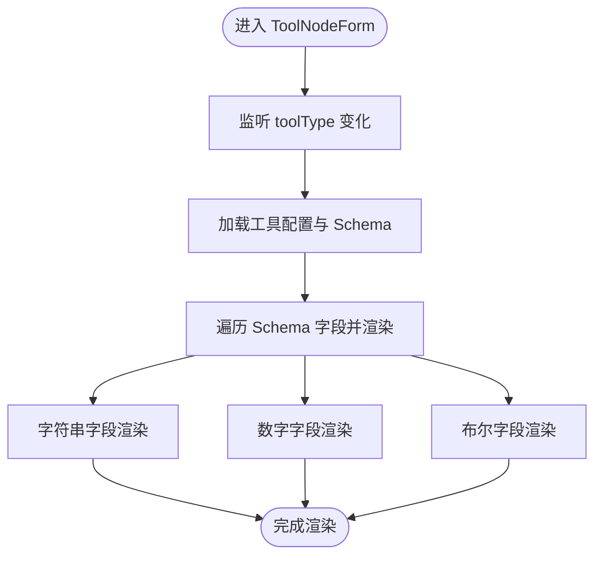
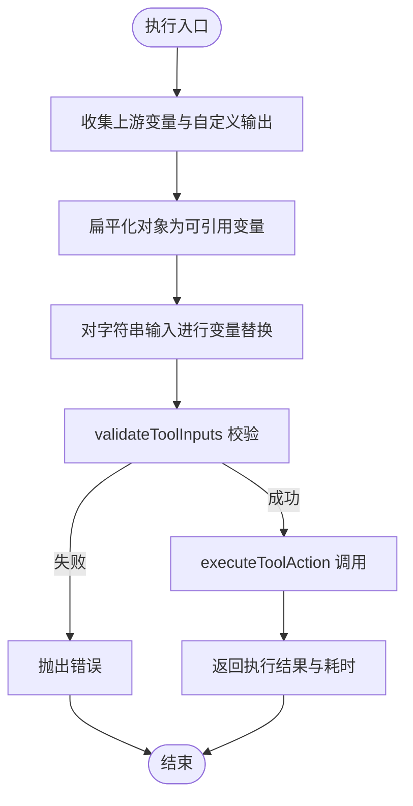
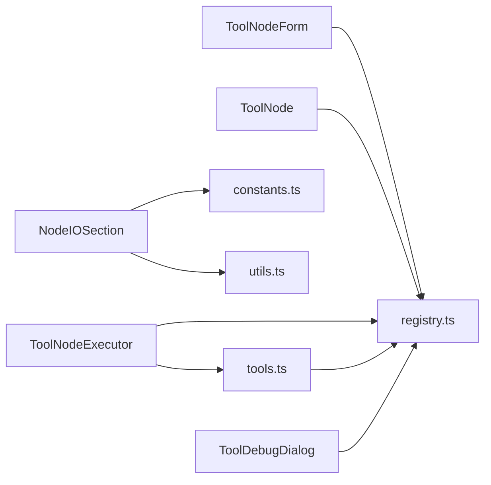

# 工具节点表单

<cite>
**本文引用的文件**
- [ToolNodeForm.tsx](file://src/components/builder/node-forms/ToolNodeForm.tsx)
- [ToolNode.tsx](file://src/components/flow/nodes/ToolNode.tsx)
- [ToolNodeExecutor.ts](file://src/store/executors/ToolNodeExecutor.ts)
- [registry.ts](file://src/lib/tools/registry.ts)
- [tools.ts](file://src/app/actions/tools.ts)
- [flow.ts](file://src/types/flow.ts)
- [ToolDebugDialog.tsx](file://src/components/flow/ToolDebugDialog.tsx)
- [NodeIOSection.tsx](file://src/components/builder/context-hud/NodeIOSection.tsx)
- [constants.ts](file://src/components/builder/context-hud/constants.ts)
- [utils.ts](file://src/components/builder/context-hud/utils.ts)
- [BaseNodeExecutor.ts](file://src/store/executors/BaseNodeExecutor.ts)
</cite>

## 目录
1. [简介](#简介)
2. [项目结构](#项目结构)
3. [核心组件](#核心组件)
4. [架构总览](#架构总览)
5. [详细组件分析](#详细组件分析)
6. [依赖关系分析](#依赖关系分析)
7. [性能与扩展性考虑](#性能与扩展性考虑)
8. [故障排查指南](#故障排查指南)
9. [结论](#结论)

## 简介
本文件聚焦“工具节点表单”的设计与实现，涵盖表单渲染、参数校验、调试运行、执行流程以及与上下文变量系统的集成。工具节点通过统一的工具注册中心定义输入参数的 Zod Schema，并在构建期与运行期分别进行前端表单渲染与后端执行。本文将从架构、数据流、处理逻辑、集成点、错误处理与性能等方面进行系统化梳理，帮助开发者快速理解与扩展工具节点能力。

## 项目结构
围绕工具节点表单的关键文件组织如下：
- 构建期表单与节点展示：ToolNodeForm.tsx、ToolNode.tsx
- 工具注册与参数校验：registry.ts
- 服务器动作与工具执行：tools.ts
- 执行器与运行期行为：ToolNodeExecutor.ts、BaseNodeExecutor.ts
- 上下文 HUD 与变量引用：NodeIOSection.tsx、constants.ts、utils.ts
- 调试对话框：ToolDebugDialog.tsx
- 类型定义：flow.ts

图表来源
- [ToolNodeForm.tsx](file://src/components/builder/node-forms/ToolNodeForm.tsx#L1-L176)
- [ToolNode.tsx](file://src/components/flow/nodes/ToolNode.tsx#L1-L98)
- [constants.ts](file://src/components/builder/context-hud/constants.ts#L1-L137)
- [utils.ts](file://src/components/builder/context-hud/utils.ts#L1-L19)
- [ToolNodeExecutor.ts](file://src/store/executors/ToolNodeExecutor.ts#L1-L155)
- [BaseNodeExecutor.ts](file://src/store/executors/BaseNodeExecutor.ts#L1-L26)
- [tools.ts](file://src/app/actions/tools.ts#L1-L523)
- [registry.ts](file://src/lib/tools/registry.ts#L1-L229)
- [NodeIOSection.tsx](file://src/components/builder/context-hud/NodeIOSection.tsx#L1-L606)
- [ToolDebugDialog.tsx](file://src/components/flow/ToolDebugDialog.tsx#L1-L148)

章节来源
- [ToolNodeForm.tsx](file://src/components/builder/node-forms/ToolNodeForm.tsx#L1-L176)
- [ToolNode.tsx](file://src/components/flow/nodes/ToolNode.tsx#L1-L98)
- [registry.ts](file://src/lib/tools/registry.ts#L1-L229)
- [tools.ts](file://src/app/actions/tools.ts#L1-L523)
- [ToolNodeExecutor.ts](file://src/store/executors/ToolNodeExecutor.ts#L1-L155)
- [NodeIOSection.tsx](file://src/components/builder/context-hud/NodeIOSection.tsx#L1-L606)
- [constants.ts](file://src/components/builder/context-hud/constants.ts#L1-L137)
- [utils.ts](file://src/components/builder/context-hud/utils.ts#L1-L19)
- [BaseNodeExecutor.ts](file://src/store/executors/BaseNodeExecutor.ts#L1-L26)
- [ToolDebugDialog.tsx](file://src/components/flow/ToolDebugDialog.tsx#L1-L148)
- [flow.ts](file://src/types/flow.ts#L138-L141)

## 核心组件
- 工具节点表单渲染：基于工具注册中心的 Schema 动态生成输入字段，支持字符串、数字、布尔等类型。
- 工具节点卡片：展示工具类型与描述，提供“测试工具”入口。
- 工具执行器：收集上游变量、替换模板变量、二次校验、调用服务器动作并返回执行结果与耗时。
- 服务器动作：按工具类型路由到具体执行函数，统一进行输入校验与错误处理。
- 上下文 HUD：展示上游变量、工具参数配置状态、变量引用有效性与输出字段。
- 调试对话框：以简单键值形式输入工具参数，触发一次性的调试运行。

章节来源
- [ToolNodeForm.tsx](file://src/components/builder/node-forms/ToolNodeForm.tsx#L1-L176)
- [ToolNode.tsx](file://src/components/flow/nodes/ToolNode.tsx#L1-L98)
- [ToolNodeExecutor.ts](file://src/store/executors/ToolNodeExecutor.ts#L1-L155)
- [tools.ts](file://src/app/actions/tools.ts#L1-L523)
- [NodeIOSection.tsx](file://src/components/builder/context-hud/NodeIOSection.tsx#L1-L606)
- [ToolDebugDialog.tsx](file://src/components/flow/ToolDebugDialog.tsx#L1-L148)

## 架构总览
工具节点表单贯穿“构建期表单渲染—运行期执行—调试运行—上下文变量集成”的完整链路。Schema 决定表单字段与校验规则；执行器负责变量收集与替换；服务器动作负责真实外部服务调用；上下文 HUD 提供可视化配置与变量引用校验。

图表来源
- [ToolNodeForm.tsx](file://src/components/builder/node-forms/ToolNodeForm.tsx#L1-L176)
- [registry.ts](file://src/lib/tools/registry.ts#L1-L229)
- [ToolNode.tsx](file://src/components/flow/nodes/ToolNode.tsx#L1-L98)
- [NodeIOSection.tsx](file://src/components/builder/context-hud/NodeIOSection.tsx#L1-L606)
- [ToolNodeExecutor.ts](file://src/store/executors/ToolNodeExecutor.ts#L1-L155)
- [tools.ts](file://src/app/actions/tools.ts#L1-L523)
- [ToolDebugDialog.tsx](file://src/components/flow/ToolDebugDialog.tsx#L1-L148)

## 详细组件分析

### 工具节点表单渲染（ToolNodeForm）
- 功能要点
  - 监听工具类型变化，动态解析对应 Schema 的字段集合。
  - 根据字段类型渲染输入控件：字符串、数字、布尔开关。
  - 展示工具名称与描述，便于用户理解工具用途。
  - 重要变更：移除动态输入字段渲染，工具参数改由调试对话框或上游变量配置。

图表来源
- [ToolNodeForm.tsx](file://src/components/builder/node-forms/ToolNodeForm.tsx#L1-L176)
- [registry.ts](file://src/lib/tools/registry.ts#L1-L229)

章节来源
- [ToolNodeForm.tsx](file://src/components/builder/node-forms/ToolNodeForm.tsx#L1-L176)

### 工具节点卡片（ToolNode）
- 功能要点
  - 展示工具图标、名称与描述。
  - 提供“测试工具”按钮，打开调试对话框。

章节来源
- [ToolNode.tsx](file://src/components/flow/nodes/ToolNode.tsx#L1-L98)

### 工具执行器（ToolNodeExecutor）
- 功能要点
  - 收集上游节点输出与自定义输出，扁平化为可引用变量。
  - 支持标签名与节点 ID 前缀的变量引用，统一替换字符串类型的输入。
  - 二次校验：在执行前再次调用注册中心的校验函数，确保输入合法。
  - 调用服务器动作执行工具，捕获错误并返回结果与耗时。

图表来源
- [ToolNodeExecutor.ts](file://src/store/executors/ToolNodeExecutor.ts#L1-L155)
- [registry.ts](file://src/lib/tools/registry.ts#L1-L229)
- [tools.ts](file://src/app/actions/tools.ts#L1-L523)

章节来源
- [ToolNodeExecutor.ts](file://src/store/executors/ToolNodeExecutor.ts#L1-L155)
- [BaseNodeExecutor.ts](file://src/store/executors/BaseNodeExecutor.ts#L1-L26)

### 服务器动作与工具执行（tools.ts）
- 功能要点
  - 接收工具类型与输入，先经注册中心校验。
  - 根据工具类型分派到具体执行函数（如网络搜索、计算器、日期时间、天气、网页读取）。
  - 统一返回结构化结果或错误信息，包含成功标志、数据或错误描述。

章节来源
- [tools.ts](file://src/app/actions/tools.ts#L1-L523)
- [registry.ts](file://src/lib/tools/registry.ts#L1-L229)

### 上下文 HUD 与变量引用（NodeIOSection）
- 功能要点
  - 计算上游节点集合，提取标准输出字段与自定义输出变量。
  - 对工具节点，依据工具类型定义的输入需求，检查配置状态与变量引用有效性。
  - 支持直接编辑工具参数（字符串值或变量引用），并提供复制变量引用的便捷操作。
  - 展示工具输出字段定义，支持添加自定义输出变量。

章节来源
- [NodeIOSection.tsx](file://src/components/builder/context-hud/NodeIOSection.tsx#L1-L606)
- [constants.ts](file://src/components/builder/context-hud/constants.ts#L1-L137)
- [utils.ts](file://src/components/builder/context-hud/utils.ts#L1-L19)

### 调试对话框（ToolDebugDialog）
- 功能要点
  - 基于工具 Schema 动态生成调试输入项。
  - 必填字段校验，确认后将输入以键值形式传递给执行器，触发一次性运行。

章节来源
- [ToolDebugDialog.tsx](file://src/components/flow/ToolDebugDialog.tsx#L1-L148)
- [registry.ts](file://src/lib/tools/registry.ts#L1-L229)

### 类型与数据模型（flow.ts）
- 关键类型
  - ToolNodeData：包含工具类型与动态输入映射。
  - FlowContext：节点输出的全局上下文，用于变量替换与引用校验。
  - 调试输入状态：工具调试对话框的输入与运行控制。

章节来源
- [flow.ts](file://src/types/flow.ts#L138-L141)
- [flow.ts](file://src/types/flow.ts#L182-L309)

## 依赖关系分析
- 组件耦合
  - ToolNodeForm 依赖工具注册中心以动态渲染字段。
  - ToolNodeExecutor 依赖注册中心进行二次校验，并调用服务器动作。
  - NodeIOSection 依赖工具 IO 定义与变量提取工具，用于可视化配置与引用校验。
  - ToolDebugDialog 依赖注册中心的 Schema 生成调试输入项。
- 外部依赖
  - 环境变量：TAVILY_API_KEY、QWEATHER_API_KEY。
  - 第三方服务：Tavily 搜索、和风天气、网页读取。

图表来源
- [ToolNodeForm.tsx](file://src/components/builder/node-forms/ToolNodeForm.tsx#L1-L176)
- [ToolNode.tsx](file://src/components/flow/nodes/ToolNode.tsx#L1-L98)
- [NodeIOSection.tsx](file://src/components/builder/context-hud/NodeIOSection.tsx#L1-L606)
- [constants.ts](file://src/components/builder/context-hud/constants.ts#L1-L137)
- [utils.ts](file://src/components/builder/context-hud/utils.ts#L1-L19)
- [ToolNodeExecutor.ts](file://src/store/executors/ToolNodeExecutor.ts#L1-L155)
- [tools.ts](file://src/app/actions/tools.ts#L1-L523)
- [registry.ts](file://src/lib/tools/registry.ts#L1-L229)
- [ToolDebugDialog.tsx](file://src/components/flow/ToolDebugDialog.tsx#L1-L148)

章节来源
- [ToolNodeForm.tsx](file://src/components/builder/node-forms/ToolNodeForm.tsx#L1-L176)
- [ToolNodeExecutor.ts](file://src/store/executors/ToolNodeExecutor.ts#L1-L155)
- [NodeIOSection.tsx](file://src/components/builder/context-hud/NodeIOSection.tsx#L1-L606)
- [constants.ts](file://src/components/builder/context-hud/constants.ts#L1-L137)
- [utils.ts](file://src/components/builder/context-hud/utils.ts#L1-L19)
- [registry.ts](file://src/lib/tools/registry.ts#L1-L229)
- [tools.ts](file://src/app/actions/tools.ts#L1-L523)
- [ToolDebugDialog.tsx](file://src/components/flow/ToolDebugDialog.tsx#L1-L148)
- [ToolNode.tsx](file://src/components/flow/nodes/ToolNode.tsx#L1-L98)

## 性能与扩展性考虑
- 渲染性能
  - ToolNodeForm 使用 useMemo 缓存 Schema 字段解析，避免重复计算。
  - NodeIOSection 对上游变量与引用校验采用 useMemo 与去重策略，减少不必要的重渲染。
- 执行性能
  - 执行器内部使用计时方法测量执行耗时，便于监控与优化。
  - 变量替换仅作用于字符串类型，避免对复杂对象造成额外开销。
- 扩展性
  - 新增工具只需在注册中心定义 Schema 与执行函数，即可自动获得表单渲染、调试与上下文 HUD 支持。
  - 工具 IO 定义集中管理，便于维护与统一展示。

[本节为通用建议，不直接分析具体文件]

## 故障排查指南
- 参数校验失败
  - 现象：执行器或服务器动作返回参数校验错误。
  - 排查：检查工具 Schema 的必填字段与范围约束；确认调试对话框或上下文 HUD 中的输入值是否满足要求。
- 环境变量缺失
  - 现象：外部服务调用失败（如搜索或天气）。
  - 排查：确认环境变量是否配置（例如搜索 API Key、天气 API Key）。
- 变量引用无效
  - 现象：上下文 HUD 标记变量无效或工具参数未生效。
  - 排查：确认变量引用格式为 {{节点名.字段}} 或 {{节点ID.字段}}，且上游节点确实存在对应输出。
- 调试运行无响应
  - 现象：点击“运行测试”后无结果。
  - 排查：检查调试对话框中必填字段是否填写；确认工具类型与输入一致。

章节来源
- [ToolNodeExecutor.ts](file://src/store/executors/ToolNodeExecutor.ts#L1-L155)
- [tools.ts](file://src/app/actions/tools.ts#L1-L523)
- [NodeIOSection.tsx](file://src/components/builder/context-hud/NodeIOSection.tsx#L1-L606)
- [ToolDebugDialog.tsx](file://src/components/flow/ToolDebugDialog.tsx#L1-L148)

## 结论
工具节点表单通过“Schema 驱动的动态表单 + 注册中心 + 执行器 + 服务器动作 + 上下文 HUD + 调试对话框”的完整链路，实现了高内聚、低耦合的工具扩展机制。新增工具仅需在注册中心定义 Schema 与执行函数，即可自动获得表单渲染、调试与上下文变量支持。建议在新增工具时同步完善工具 IO 定义与描述，提升用户体验与可维护性。