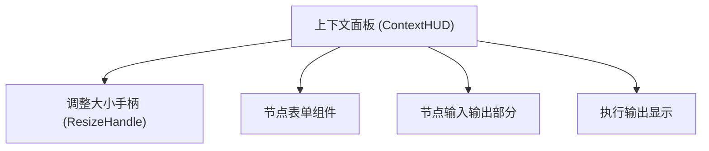
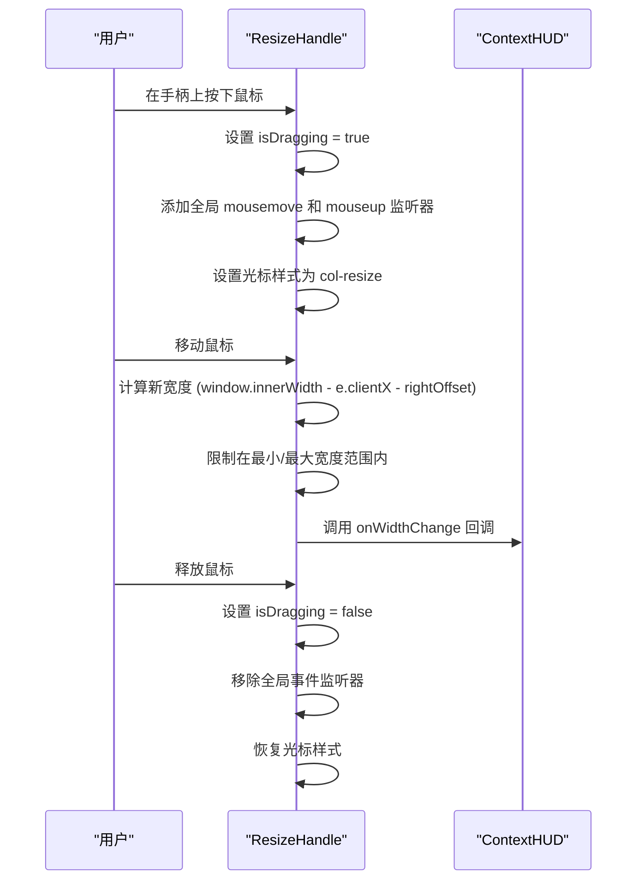
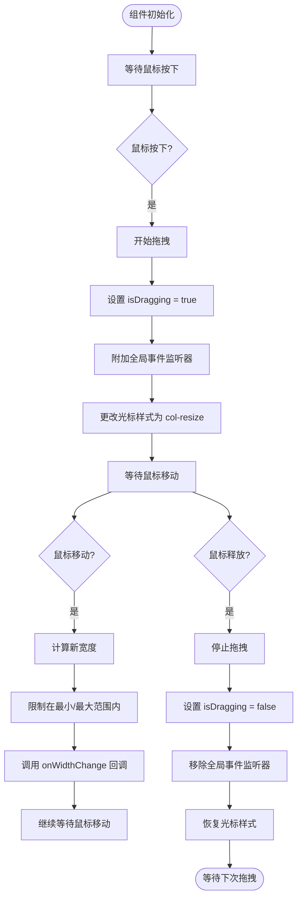

# 调整大小手柄组件

<cite>
**本文档引用的文件**  
- [ResizeHandle.tsx](file://src/components/builder/context-hud/ResizeHandle.tsx)
- [index.tsx](file://src/components/builder/context-hud/index.tsx)
- [constants.ts](file://src/components/builder/context-hud/constants.ts)
- [flowStore.ts](file://src/store/flowStore.ts)
- [uiActions.ts](file://src/store/actions/uiActions.ts)
</cite>

## 目录
1. [简介](#简介)
2. [项目结构](#项目结构)
3. [核心组件](#核心组件)
4. [架构概述](#架构概述)
5. [详细组件分析](#详细组件分析)
6. [依赖分析](#依赖分析)
7. [性能考虑](#性能考虑)
8. [故障排除指南](#故障排除指南)
9. [结论](#结论)
10. [附录](#附录)（如有必要）

## 简介
调整大小手柄组件（ResizeHandle）是工作流构建器中上下文面板（Context HUD）的一个关键交互元素。该组件允许用户通过拖拽来动态调整右侧配置面板的宽度，从而优化工作区布局和用户体验。本组件作为上下文面板的一部分，与节点选择、表单配置和执行输出等功能紧密集成，为用户提供灵活的界面定制能力。

## 项目结构
调整大小手柄组件位于工作流构建器的上下文面板模块中，是面板可交互性的重要组成部分。该组件与其他UI元素协同工作，共同构成了节点配置的完整界面。



**图表来源**  
- [index.tsx](file://src/components/builder/context-hud/index.tsx#L139-L157)
- [ResizeHandle.tsx](file://src/components/builder/context-hud/ResizeHandle.tsx#L23-L29)

**章节来源**  
- [index.tsx](file://src/components/builder/context-hud/index.tsx#L1-L226)
- [ResizeHandle.tsx](file://src/components/builder/context-hud/ResizeHandle.tsx#L1-L110)

## 核心组件
调整大小手柄组件是一个独立的React函数组件，负责处理用户拖拽操作并实时更新面板宽度。它通过回调函数与父组件通信，实现了无状态的交互逻辑。该组件的设计注重用户体验，提供了视觉反馈和边界限制，确保调整过程平滑且符合预期。

**章节来源**  
- [ResizeHandle.tsx](file://src/components/builder/context-hud/ResizeHandle.tsx#L1-L110)

## 架构概述
调整大小手柄组件采用客户端事件驱动架构，通过监听鼠标事件来实现拖拽功能。当用户在手柄上按下鼠标时，组件进入拖拽状态，并监听全局的鼠标移动和释放事件。宽度计算基于视口宽度和鼠标位置，确保调整的准确性。整个过程通过React的状态管理和回调机制与父组件同步。



**图表来源**  
- [ResizeHandle.tsx](file://src/components/builder/context-hud/ResizeHandle.tsx#L30-L70)
- [index.tsx](file://src/components/builder/context-hud/index.tsx#L151-L157)

## 详细组件分析
调整大小手柄组件的实现细节体现了对用户体验和代码可维护性的重视。组件通过TypeScript接口定义了清晰的API，使用React Hooks管理状态和副作用，并通过Tailwind CSS实现了现代化的视觉效果。

### 组件分析
调整大小手柄组件通过一系列精心设计的交互逻辑，实现了流畅的面板宽度调整功能。组件的状态管理、事件处理和视觉反馈共同构成了完整的用户体验。

#### 组件属性定义
```mermaid
classDiagram
class ResizeHandleProps {
+width : number
+minWidth? : number
+maxWidth? : number
+onWidthChange : (newWidth : number) => void
+rightOffset? : number
}
note right of ResizeHandleProps
width : 当前面板宽度
minWidth : 最小允许宽度，默认280px
maxWidth : 最大允许宽度，默认800px
onWidthChange : 宽度变化时的回调函数
rightOffset : 面板右侧偏移量，默认24px
end note
```

**图表来源**  
- [ResizeHandle.tsx](file://src/components/builder/context-hud/ResizeHandle.tsx#L5-L16)

#### 交互逻辑流程


**图表来源**  
- [ResizeHandle.tsx](file://src/components/builder/context-hud/ResizeHandle.tsx#L30-L70)

**章节来源**  
- [ResizeHandle.tsx](file://src/components/builder/context-hud/ResizeHandle.tsx#L1-L110)

## 依赖分析
调整大小手柄组件的依赖关系清晰且合理，主要依赖于React框架的核心功能和项目内部的工具函数。组件通过props接收所有必要的参数，保持了良好的封装性和可复用性。

```mermaid
graph LR
ResizeHandle["ResizeHandle组件"]
React["React框架"]
Utils["项目工具函数"]
Tailwind["Tailwind CSS"]
ResizeHandle --> React
ResizeHandle --> Utils
ResizeHandle --> Tailwind
subgraph "React依赖"
React --> useState
React --> useCallback
React --> useEffect
end
subgraph "工具依赖"
Utils --> cn["cn() 工具函数"]
end
subgraph "样式依赖"
Tailwind --> "Tailwind实用类"
end
```

**图表来源**  
- [ResizeHandle.tsx](file://src/components/builder/context-hud/ResizeHandle.tsx#L2-L3)
- [ResizeHandle.tsx](file://src/components/builder/context-hud/ResizeHandle.tsx#L80-L89)

**章节来源**  
- [ResizeHandle.tsx](file://src/components/builder/context-hud/ResizeHandle.tsx#L1-L110)

## 性能考虑
调整大小手柄组件在性能方面进行了优化，通过useCallback和useEffect等React Hooks避免了不必要的重新渲染和事件监听器重复绑定。组件的事件处理逻辑简洁高效，宽度计算仅涉及基本的数学运算，确保了拖拽过程的流畅性。视觉反馈通过CSS过渡效果实现，利用了浏览器的硬件加速，进一步提升了用户体验。

## 故障排除指南
在使用调整大小手柄组件时，可能会遇到一些常见问题。以下是一些可能的问题及其解决方案：

1. **手柄无法拖拽**：检查是否在组件渲染时正确传递了onWidthChange回调函数，确保父组件能够正确处理宽度变化。
2. **拖拽时页面内容被选中**：组件已通过设置document.body.style.userSelect = "none"防止文本选择，如果问题仍然存在，请检查是否有其他样式冲突。
3. **宽度调整不准确**：确保rightOffset参数与面板的实际右侧偏移量匹配，通常为24px（1.5rem）。
4. **光标样式未改变**：检查浏览器是否阻止了光标样式的更改，或是否有其他CSS规则覆盖了cursor: col-resize样式。

**章节来源**  
- [ResizeHandle.tsx](file://src/components/builder/context-hud/ResizeHandle.tsx#L62-L63)
- [ResizeHandle.tsx](file://src/components/builder/context-hud/ResizeHandle.tsx#L51-L53)

## 结论
调整大小手柄组件是工作流构建器中一个精心设计的交互元素，它通过简洁的代码实现了流畅的用户体验。组件的模块化设计使其易于维护和扩展，而清晰的API定义则保证了其在不同场景下的可复用性。该组件的成功实现体现了对细节的关注和对用户需求的深刻理解，为整个应用的交互质量做出了重要贡献。

## 附录
### 常量定义
| 常量 | 值 | 描述 |
|------|-----|------|
| PANEL_DEFAULT_WIDTH | 320 | 面板默认宽度（px） |
| PANEL_MIN_WIDTH | 280 | 面板最小宽度（px） |
| PANEL_MAX_WIDTH | 800 | 面板最大宽度（px） |
| PANEL_RIGHT_OFFSET | 24 | 面板右侧偏移量（px） |

**章节来源**  
- [index.tsx](file://src/components/builder/context-hud/index.tsx#L32-L35)