# 流程画布组件深度解析

<cite>
**本文档引用的文件**
- [FlowCanvas.tsx](file://src/components/flow/FlowCanvas.tsx)
- [CustomNode.tsx](file://src/components/flow/CustomNode.tsx)
- [Sidebar.tsx](file://src/components/flow/Sidebar.tsx)
- [CopilotOverlay.tsx](file://src/components/flow/CopilotOverlay.tsx)
- [NodeDebugDialog.tsx](file://src/components/flow/NodeDebugDialog.tsx)
- [InputPromptDialog.tsx](file://src/components/flow/InputPromptDialog.tsx)
- [flowStore.ts](file://src/store/flowStore.ts)
- [flow.ts](file://src/types/flow.ts)
- [nodeActions.ts](file://src/store/actions/nodeActions.ts)
- [edgeActions.ts](file://src/store/actions/edgeActions.ts)
- [copilotActions.ts](file://src/store/actions/copilotActions.ts)
- [nodeDefaults.ts](file://src/store/utils/nodeDefaults.ts)
- [cycleDetection.ts](file://src/store/utils/cycleDetection.ts)
- [layoutAlgorithm.ts](file://src/store/utils/layoutAlgorithm.ts)
</cite>

## 目录
1. [项目概述](#项目概述)
2. [架构总览](#架构总览)
3. [核心组件详解](#核心组件详解)
4. [状态管理机制](#状态管理机制)
5. [节点渲染与交互](#节点渲染与交互)
6. [事件处理流程](#事件处理流程)
7. [性能优化策略](#性能优化策略)
8. [AI辅助功能](#ai辅助功能)
9. [调试与错误处理](#调试与错误处理)
10. [最佳实践与扩展](#最佳实践与扩展)

## 项目概述

Flash Flow 是一个基于 React 和 @xyflow/react 的可视化流程设计器，提供了完整的节点拖拽、连接、编辑与调试功能。系统采用模块化架构设计，通过 Zustand 状态管理实现组件间的高效通信。

### 主要特性
- **可视化画布**：基于 @xyflow/react 的强大画布引擎
- **多类型节点支持**：LLM、HTTP、RAG、输入输出节点
- **智能拖拽**：节点库侧边栏提供拖拽式添加
- **AI辅助设计**：Copilot 功能提供智能流程生成
- **实时调试**：内置调试对话框和输入提示
- **性能优化**：React.memo 和虚拟化技术确保流畅体验

## 架构总览

系统采用分层架构设计，主要包含以下几个层次：

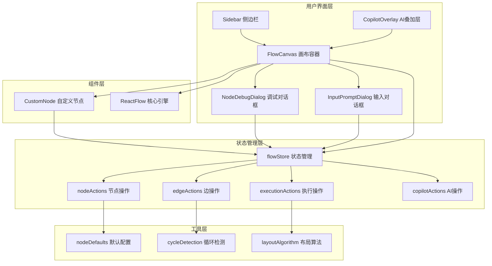

**图表来源**
- [FlowCanvas.tsx](file://src/components/flow/FlowCanvas.tsx#L1-L82)
- [CustomNode.tsx](file://src/components/flow/CustomNode.tsx#L1-L187)
- [flowStore.ts](file://src/store/flowStore.ts#L1-L131)

## 核心组件详解

### FlowCanvas - 画布容器

FlowCanvas 是整个流程设计器的核心容器，负责协调所有子组件的工作。

#### 核心功能
- **节点类型注册**：统一管理所有自定义节点类型
- **拖拽事件处理**：支持从侧边栏拖拽节点到画布
- **交互模式控制**：支持选择和拖拽两种交互模式
- **背景网格显示**：提供视觉参考网格

#### 关键特性
- **响应式设计**：自动适配容器尺寸变化
- **缩放限制**：最小0.1倍，最大2倍
- **平滑滚动**：支持鼠标滚轮和平移操作
- **选择模式**：支持框选和单选

**章节来源**
- [FlowCanvas.tsx](file://src/components/flow/FlowCanvas.tsx#L1-L82)

### CustomNode - 自定义节点渲染器

CustomNode 是系统中最复杂的组件，负责渲染不同类型的节点并提供交互功能。

#### 节点类型支持

| 节点类型 | 图标 | 主要功能 | 特殊属性 |
|---------|------|----------|----------|
| input | 🧑‍💼 | 数据输入 | 文本内容 |
| llm | 🧠 | 大语言模型 | 模型名称、温度参数 |
| output | 📥 | 数据输出 | 文本内容 |
| rag | 🔎 | 检索增强生成 | 文件列表 |
| http | 🔗 | HTTP请求 | 方法、URL |

#### 渲染逻辑

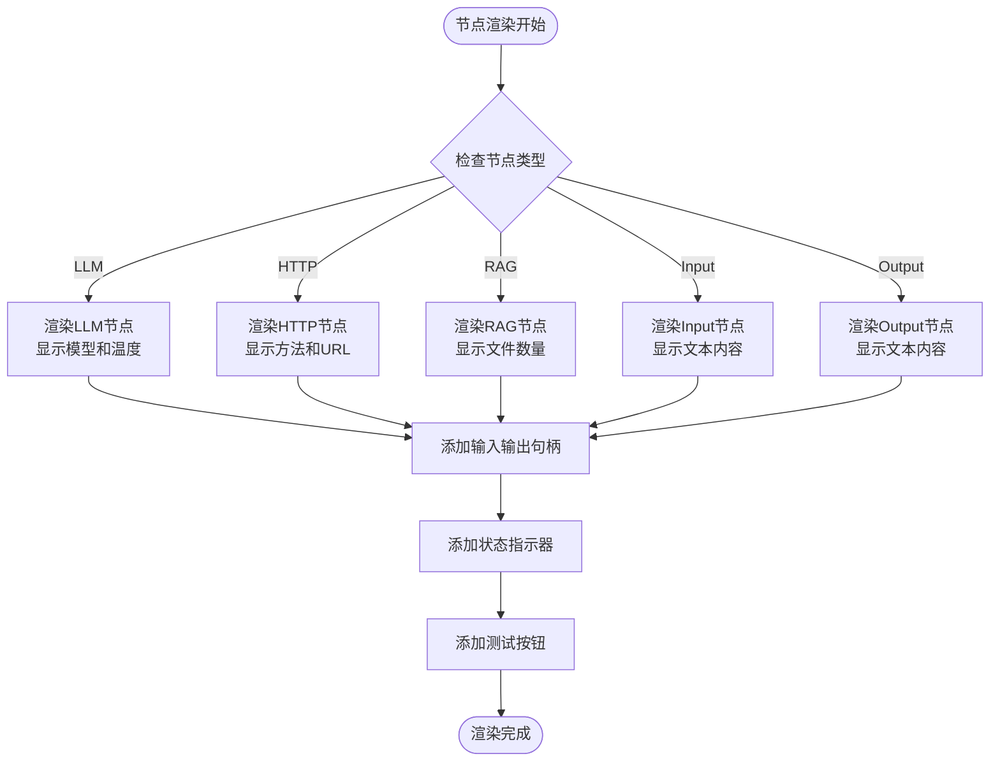

**图表来源**
- [CustomNode.tsx](file://src/components/flow/CustomNode.tsx#L42-L81)

#### 性能优化

CustomNode 实现了多项性能优化措施：

- **React.memo 包装**：防止不必要的重新渲染
- **条件渲染**：根据节点类型选择性渲染内容
- **图标缓存**：预定义图标对象避免重复创建
- **状态图标**：使用静态图标提升渲染速度

**章节来源**
- [CustomNode.tsx](file://src/components/flow/CustomNode.tsx#L27-L187)

### Sidebar - 节点库侧边栏

Sidebar 提供节点库功能，支持拖拽式添加节点到画布。

#### 组件分类

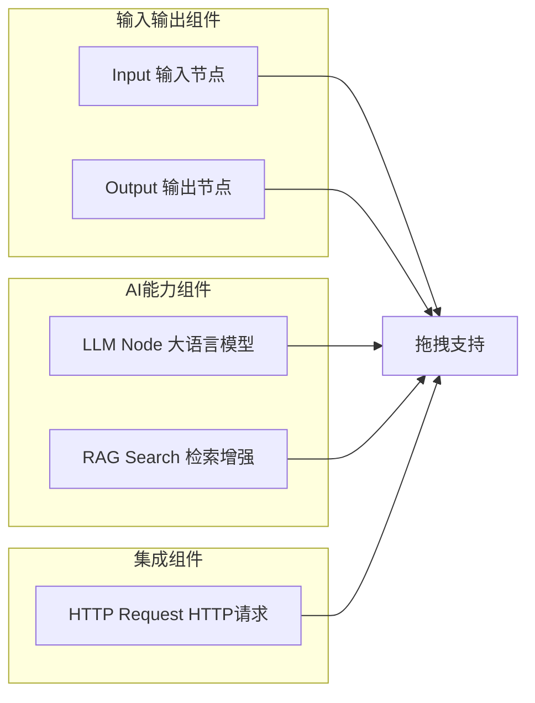

**图表来源**
- [Sidebar.tsx](file://src/components/flow/Sidebar.tsx#L78-L137)

#### 拖拽机制

Sidebar 实现了完整的拖拽支持：

- **数据传输**：通过 `application/reactflow` 类型传递节点类型
- **视觉反馈**：拖拽时显示移动效果
- **折叠支持**：支持侧边栏折叠以节省空间
- **工具提示**：为每个节点提供详细的工具提示

**章节来源**
- [Sidebar.tsx](file://src/components/flow/Sidebar.tsx#L1-L142)

### CopilotOverlay - AI辅助叠加层

CopilotOverlay 提供 AI 辅助功能的视觉反馈，展示 AI 处理过程。

#### 状态管理

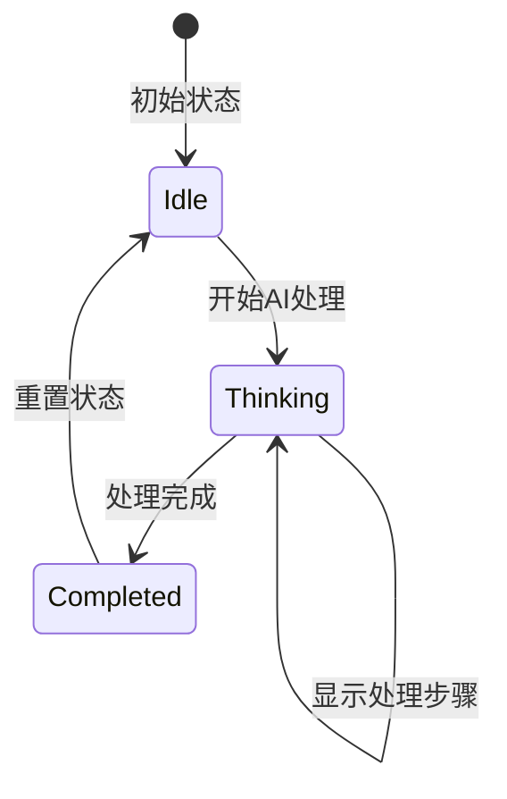

**图表来源**
- [CopilotOverlay.tsx](file://src/components/flow/CopilotOverlay.tsx#L9-L64)

#### 动画效果

CopilotOverlay 使用 framer-motion 实现流畅的动画效果：

- **入场动画**：淡入效果
- **出场动画**：淡出效果  
- **图标动画**：脉冲效果
- **文字动画**：弹跳效果

**章节来源**
- [CopilotOverlay.tsx](file://src/components/flow/CopilotOverlay.tsx#L1-L64)

### NodeDebugDialog - 节点调试对话框

NodeDebugDialog 提供节点调试功能，允许用户为节点输入模拟数据。

#### 核心功能

- **JSON验证**：确保输入数据格式正确
- **智能预填充**：根据节点类型预设默认数据
- **实时验证**：输入时实时检查JSON格式
- **确认运行**：调试完成后直接运行节点

#### 支持的节点类型

| 节点类型 | 默认模拟数据 |
|---------|-------------|
| LLM | `{ "input": "Sample input for LLM" }` |
| RAG | `{ "query": "Sample query for RAG" }` |
| HTTP | `{ "payload": "Sample HTTP payload" }` |

**章节来源**
- [NodeDebugDialog.tsx](file://src/components/flow/NodeDebugDialog.tsx#L1-L69)

### InputPromptDialog - 输入提示对话框

InputPromptDialog 确保所有输入节点都有有效数据后才能运行流程。

#### 验证逻辑

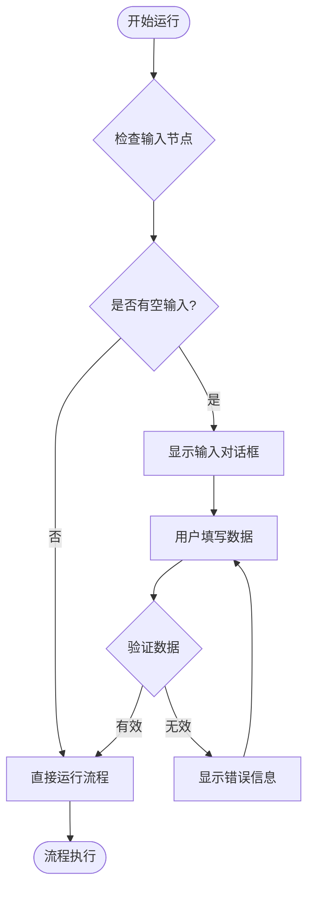

**图表来源**
- [InputPromptDialog.tsx](file://src/components/flow/InputPromptDialog.tsx#L19-L32)

**章节来源**
- [InputPromptDialog.tsx](file://src/components/flow/InputPromptDialog.tsx#L1-L84)

## 状态管理机制

系统采用 Zustand 作为状态管理解决方案，实现了集中式的状态管理。

### 状态结构

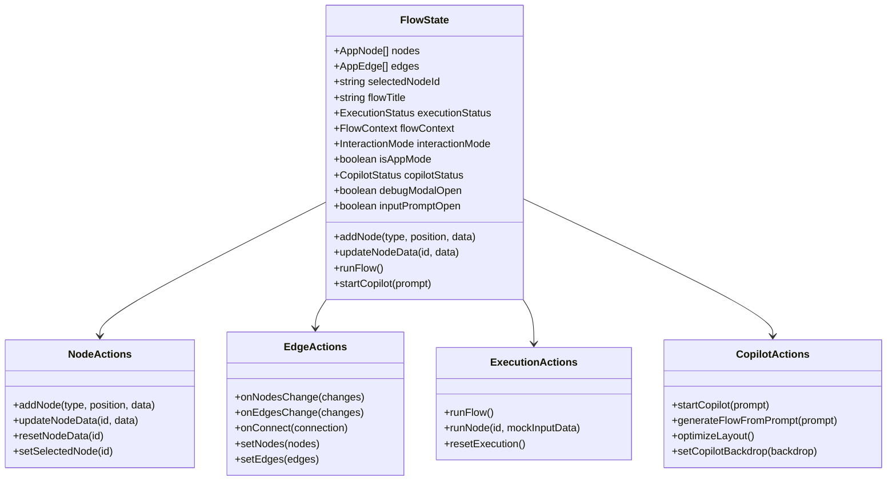

**图表来源**
- [flowStore.ts](file://src/store/flowStore.ts#L84-L152)
- [nodeActions.ts](file://src/store/actions/nodeActions.ts#L5-L93)
- [edgeActions.ts](file://src/store/actions/edgeActions.ts#L12-L80)

### 状态持久化

系统实现了智能的自动保存机制：

- **防抖处理**：800毫秒延迟避免频繁保存
- **增量更新**：只保存变更的部分
- **错误恢复**：保存失败时保持状态一致性

**章节来源**
- [flowStore.ts](file://src/store/flowStore.ts#L50-L75)

## 节点渲染与交互

### 节点生命周期

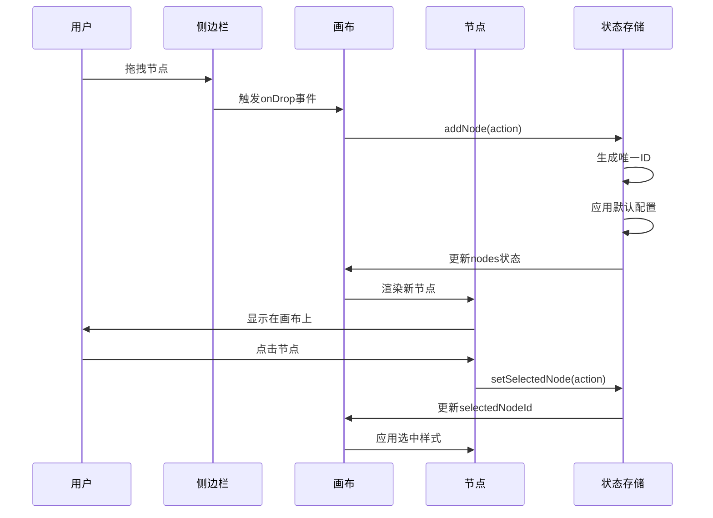

**图表来源**
- [FlowCanvas.tsx](file://src/components/flow/FlowCanvas.tsx#L28-L36)
- [nodeActions.ts](file://src/store/actions/nodeActions.ts#L9-L18)

### 连接机制

系统实现了智能的节点连接功能：

#### 连接规则

- **自环检测**：禁止节点连接到自身
- **循环检测**：防止形成闭环导致死循环
- **类型兼容性**：确保连接的节点类型兼容

#### 循环检测算法

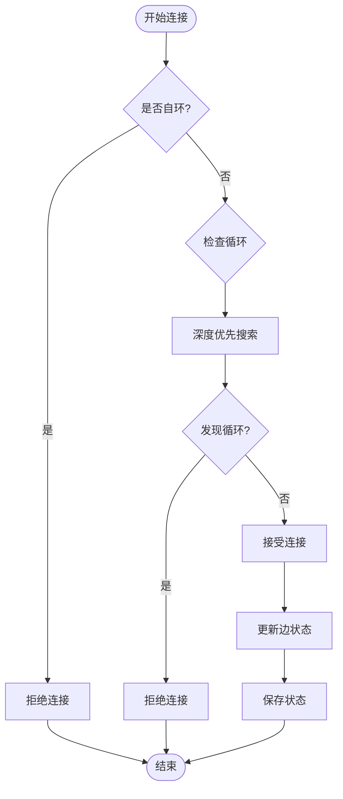

**图表来源**
- [edgeActions.ts](file://src/store/actions/edgeActions.ts#L46-L67)
- [cycleDetection.ts](file://src/store/utils/cycleDetection.ts#L13-L33)

**章节来源**
- [edgeActions.ts](file://src/store/actions/edgeActions.ts#L46-L67)

## 事件处理流程

### 拖拽事件处理

系统实现了完整的拖拽事件处理链：

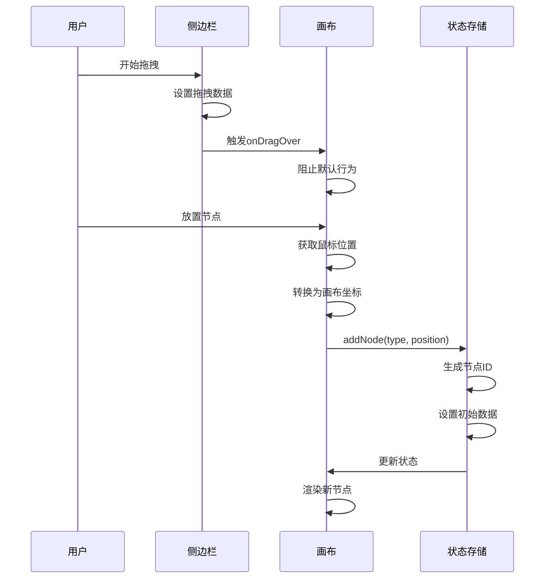

**图表来源**
- [FlowCanvas.tsx](file://src/components/flow/FlowCanvas.tsx#L23-L36)

### 节点交互事件

#### 点击事件处理

- **节点点击**：选中节点并高亮显示
- **画布点击**：取消节点选中状态
- **双击事件**：触发节点编辑功能

#### 键盘快捷键

- **删除键**：删除选中的节点或边
- **Ctrl+A**：全选节点
- **Ctrl+Z**：撤销操作

**章节来源**
- [FlowCanvas.tsx](file://src/components/flow/FlowCanvas.tsx#L49-L56)

## 性能优化策略

### 渲染优化

#### React.memo 实现

CustomNode 使用 React.memo 防止不必要的重新渲染：

```typescript
// 性能优化：使用React.memo防止不必要重渲染
export default React.memo(CustomNode);
```

#### 条件渲染

节点内部实现智能的条件渲染：

- **类型特定内容**：只渲染当前节点类型的相关内容
- **状态切换**：根据执行状态动态调整显示内容
- **懒加载**：非关键内容延迟加载

### 内存管理

#### 状态清理

- **节点删除**：自动清理相关边和上下文数据
- **循环检测**：及时发现并阻止内存泄漏
- **定时器清理**：自动清理保存定时器

#### 对象池化

- **节点复用**：重用节点对象减少垃圾回收
- **样式缓存**：缓存计算过的样式对象
- **图标缓存**：预创建图标对象避免重复创建

### 大规模节点场景优化

#### 虚拟化技术

对于包含大量节点的流程：

- **视口裁剪**：只渲染可见区域的节点
- **层级管理**：合理管理节点层级关系
- **批量更新**：合并多个状态变更

#### 布局算法优化

系统使用 Dagre 算法进行智能布局：

- **自动避让**：避免节点重叠
- **路径优化**：减少边的交叉
- **响应式布局**：适应画布尺寸变化

**章节来源**
- [layoutAlgorithm.ts](file://src/store/utils/layoutAlgorithm.ts#L1-L120)

## AI辅助功能

### Copilot 功能架构

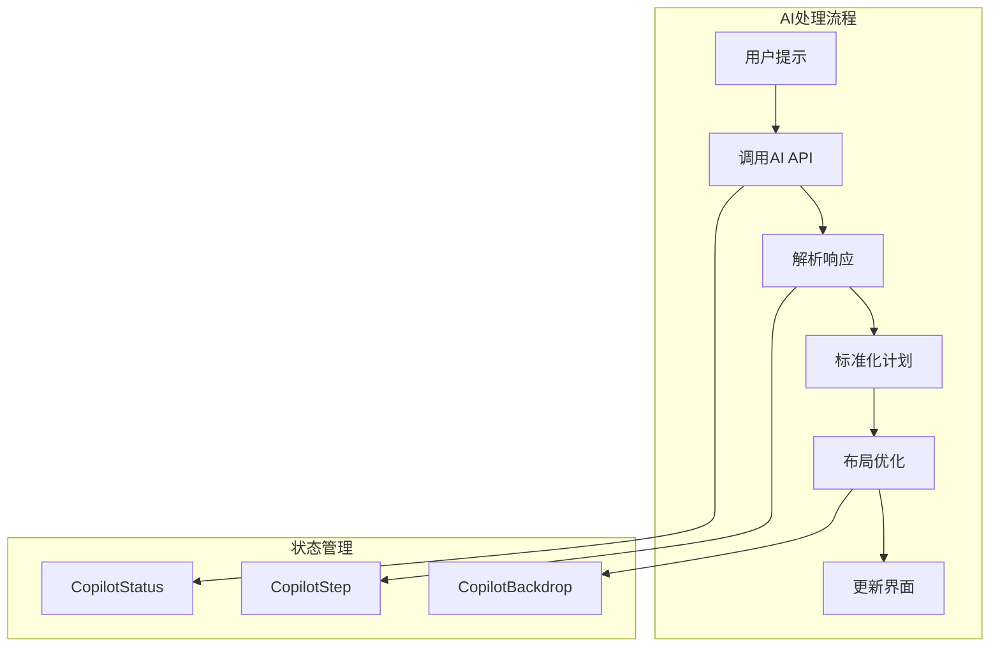

**图表来源**
- [copilotActions.ts](file://src/store/actions/copilotActions.ts#L8-L34)

### AI功能特性

#### 流程生成

- **自然语言理解**：将用户描述转换为流程图
- **智能推荐**：根据需求推荐合适的节点组合
- **布局优化**：自动生成美观的布局

#### 实时反馈

- **处理进度**：显示AI处理的各个阶段
- **视觉反馈**：通过覆盖层提供沉浸式体验
- **错误处理**：优雅处理AI调用失败的情况

**章节来源**
- [copilotActions.ts](file://src/store/actions/copilotActions.ts#L8-L34)

## 调试与错误处理

### 调试系统架构

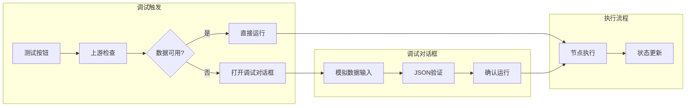

**图表来源**
- [CustomNode.tsx](file://src/components/flow/CustomNode.tsx#L84-L105)
- [NodeDebugDialog.tsx](file://src/components/flow/NodeDebugDialog.tsx#L18-L28)

### 错误处理机制

#### 节点验证

系统实现了多层次的节点验证：

- **类型验证**：确保节点数据符合类型定义
- **范围验证**：检查数值参数的有效范围
- **格式验证**：验证字符串格式（如URL）

#### 执行错误处理

- **异常捕获**：捕获并处理执行过程中的异常
- **错误回滚**：执行失败时恢复到之前状态
- **错误报告**：提供详细的错误信息

**章节来源**
- [nodeActions.ts](file://src/store/actions/nodeActions.ts#L32-L58)

## 最佳实践与扩展

### 组件扩展指南

#### 添加新节点类型

1. **类型定义**：在 `flow.ts` 中添加新的节点类型
2. **默认配置**：在 `nodeDefaults.ts` 中添加默认数据
3. **渲染逻辑**：在 `CustomNode.tsx` 中添加渲染支持
4. **状态管理**：在 `flowStore.ts` 中添加相关操作

#### 自定义节点样式

- **CSS类名**：使用 Tailwind CSS 类名确保样式一致性
- **主题支持**：支持深色和浅色主题
- **响应式设计**：适配不同屏幕尺寸

### 性能监控

#### 关键指标

- **渲染时间**：测量节点渲染耗时
- **内存使用**：监控内存占用情况
- **交互响应**：测量用户操作响应时间

#### 优化建议

- **代码分割**：按需加载大型组件
- **缓存策略**：缓存计算结果
- **异步处理**：将耗时操作移到后台线程

### 可访问性支持

#### 键盘导航

- **焦点管理**：确保所有可交互元素可以键盘访问
- **快捷键**：提供常用操作的键盘快捷键
- **屏幕阅读器**：为视觉障碍用户提供支持

#### 视觉辅助

- **高对比度**：支持高对比度模式
- **字体大小**：支持字体大小调整
- **颜色盲友好**：使用颜色盲友好的配色方案

## 结论

Flash Flow 的流程可视化画布组件系统展现了现代前端应用的最佳实践。通过模块化架构、智能状态管理和性能优化，系统实现了流畅的用户体验和强大的功能性。各个组件之间通过清晰的接口和事件机制协同工作，形成了一个完整而灵活的流程设计器。

系统的成功在于：

1. **架构设计**：清晰的分层架构便于维护和扩展
2. **性能优化**：多项性能优化措施确保大规模场景下的流畅体验
3. **用户体验**：直观的交互设计和智能的AI辅助功能
4. **可扩展性**：模块化的组件设计支持功能扩展

这个系统为构建复杂的可视化应用提供了优秀的参考范例，其设计理念和实现技巧值得在类似项目中借鉴和应用。