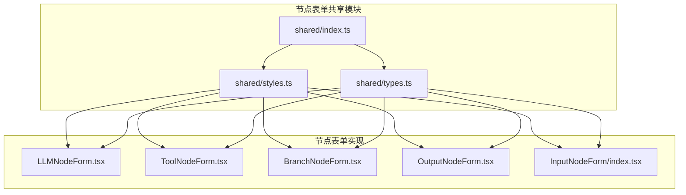
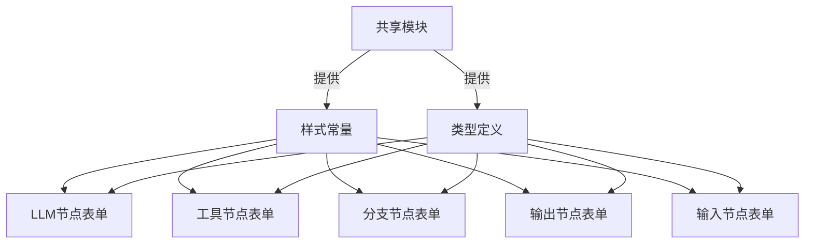
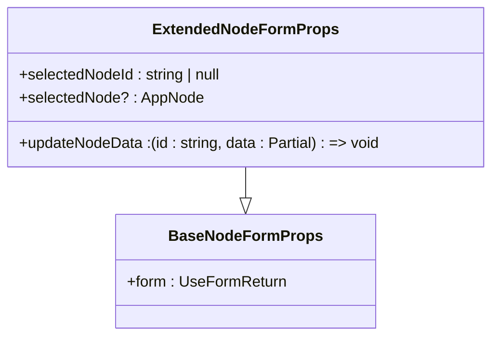
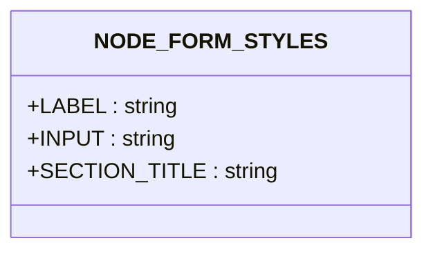

# 节点表单共享组件

<cite>
**本文档引用的文件**  
- [shared/types.ts](file://src/components/builder/node-forms/shared/types.ts)
- [shared/styles.ts](file://src/components/builder/node-forms/shared/styles.ts)
- [shared/index.ts](file://src/components/builder/node-forms/shared/index.ts)
- [LLMNodeForm.tsx](file://src/components/builder/node-forms/LLMNodeForm.tsx)
- [InputNodeForm/index.tsx](file://src/components/builder/node-forms/InputNodeForm/index.tsx)
- [InputNodeForm/constants.ts](file://src/components/builder/node-forms/InputNodeForm/constants.ts)
- [RAGNodeForm.tsx](file://src/components/builder/node-forms/RAGNodeForm.tsx)
- [ToolNodeForm.tsx](file://src/components/builder/node-forms/ToolNodeForm.tsx)
- [BranchNodeForm.tsx](file://src/components/builder/node-forms/BranchNodeForm.tsx)
- [OutputNodeForm.tsx](file://src/components/builder/node-forms/OutputNodeForm.tsx)
- [flow.ts](file://src/types/flow.ts)
</cite>

## 目录
1. [简介](#简介)
2. [项目结构](#项目结构)
3. [核心组件](#核心组件)
4. [架构概述](#架构概述)
5. [详细组件分析](#详细组件分析)
6. [依赖分析](#依赖分析)
7. [性能考虑](#性能考虑)
8. [故障排除指南](#故障排除指南)
9. [结论](#结论)

## 简介
本文档详细分析了“节点表单共享组件”在代码库中的实现和使用。该组件旨在为工作流构建器中的各种节点表单提供统一的样式和类型定义，确保用户界面的一致性和开发效率。通过共享模块，不同类型的节点（如LLM、工具、分支、输出等）可以复用相同的样式常量和基础类型，减少重复代码并提高维护性。

## 项目结构
节点表单共享组件位于 `src/components/builder/node-forms/shared` 目录下，是整个节点配置表单系统的核心基础。该目录下的文件为所有节点表单提供统一的样式类名和类型定义。



**图示来源**
- [shared/index.ts](file://src/components/builder/node-forms/shared/index.ts)
- [shared/styles.ts](file://src/components/builder/node-forms/shared/styles.ts)
- [shared/types.ts](file://src/components/builder/node-forms/shared/types.ts)
- [LLMNodeForm.tsx](file://src/components/builder/node-forms/LLMNodeForm.tsx)
- [InputNodeForm/index.tsx](file://src/components/builder/node-forms/InputNodeForm/index.tsx)

**节来源**
- [shared/index.ts](file://src/components/builder/node-forms/shared/index.ts)
- [shared/styles.ts](file://src/components/builder/node-forms/shared/styles.ts)
- [shared/types.ts](file://src/components/builder/node-forms/shared/types.ts)

## 核心组件
节点表单共享组件由两个核心文件组成：`types.ts` 和 `styles.ts`。`types.ts` 定义了所有节点表单通用的 TypeScript 接口，而 `styles.ts` 则导出了统一的 CSS 类名常量。`index.ts` 作为入口文件，将这两个模块的导出内容重新导出，方便其他组件一次性导入。

**节来源**
- [shared/types.ts](file://src/components/builder/node-forms/shared/types.ts#L1-L36)
- [shared/styles.ts](file://src/components/builder/node-forms/shared/styles.ts#L1-L20)
- [shared/index.ts](file://src/components/builder/node-forms/shared/index.ts#L1-L7)

## 架构概述
节点表单共享组件的架构设计遵循了前端开发中的“单一职责”和“关注点分离”原则。通过将样式和类型定义从具体的表单实现中抽离出来，实现了高度的模块化和可复用性。所有节点表单都依赖于这个共享模块，从而保证了整个应用中表单元素的视觉和行为一致性。



**图示来源**
- [shared/styles.ts](file://src/components/builder/node-forms/shared/styles.ts)
- [shared/types.ts](file://src/components/builder/node-forms/shared/types.ts)
- [LLMNodeForm.tsx](file://src/components/builder/node-forms/LLMNodeForm.tsx)
- [ToolNodeForm.tsx](file://src/components/builder/node-forms/ToolNodeForm.tsx)
- [BranchNodeForm.tsx](file://src/components/builder/node-forms/BranchNodeForm.tsx)
- [OutputNodeForm.tsx](file://src/components/builder/node-forms/OutputNodeForm.tsx)
- [InputNodeForm/index.tsx](file://src/components/builder/node-forms/InputNodeForm/index.tsx)

## 详细组件分析
本节将深入分析节点表单共享组件的各个组成部分，包括其类型定义、样式常量以及在具体节点表单中的使用方式。

### 类型定义分析
`types.ts` 文件定义了两个关键的 TypeScript 接口：`BaseNodeFormProps` 和 `ExtendedNodeFormProps`。`BaseNodeFormProps` 是所有简单节点表单的基础，仅包含一个 `form` 属性，该属性是 `react-hook-form` 的表单实例。`ExtendedNodeFormProps` 继承自 `BaseNodeFormProps`，并添加了 `selectedNodeId`、`updateNodeData` 和可选的 `selectedNode` 属性，适用于需要直接更新节点数据的复杂节点（如 Input 和 RAG 节点）。



**图示来源**
- [shared/types.ts](file://src/components/builder/node-forms/shared/types.ts#L15-L35)

**节来源**
- [shared/types.ts](file://src/components/builder/node-forms/shared/types.ts#L1-L36)

### 样式常量分析
`styles.ts` 文件导出了一个名为 `NODE_FORM_STYLES` 的常量对象，其中包含了三个用于表单元素的 CSS 类名：`LABEL` 用于表单标签，`INPUT` 用于输入框，`SECTION_TITLE` 用于分区标题。这种做法将样式与逻辑分离，使得样式修改变得集中且安全，避免了在多个文件中分散的样式定义。



**图示来源**
- [shared/styles.ts](file://src/components/builder/node-forms/shared/styles.ts#L7-L14)

**节来源**
- [shared/styles.ts](file://src/components/builder/node-forms/shared/styles.ts#L1-L20)

### 具体节点表单使用分析
本节分析共享组件在不同节点表单中的实际应用。

#### LLM节点表单
`LLMNodeForm` 使用 `BaseNodeFormProps` 作为其组件的 Props 类型。它通过 `NODE_FORM_STYLES` 常量来应用统一的样式，例如在 `FormLabel` 和 `Input` 组件上使用 `STYLES.LABEL` 和 `STYLES.INPUT`。该表单包含了节点名称、模型选择、温度参数、系统提示词和对话记忆等配置项。

**节来源**
- [LLMNodeForm.tsx](file://src/components/builder/node-forms/LLMNodeForm.tsx#L37-L264)

#### 输入节点表单
`InputNodeForm` 使用 `ExtendedNodeFormProps` 作为其 Props 类型，因为它需要 `updateNodeData` 回调来直接更新节点数据。它不仅使用了共享的样式常量，还从 `constants.ts` 文件中导入了 `LABEL_CLASS`、`INPUT_CLASS` 和 `SECTION_TITLE_CLASS`。该表单支持文本输入、文件上传和结构化表单三种输入方式，并提供了相应的配置选项。

**节来源**
- [InputNodeForm/index.tsx](file://src/components/builder/node-forms/InputNodeForm/index.tsx#L24-L215)
- [InputNodeForm/constants.ts](file://src/components/builder/node-forms/InputNodeForm/constants.ts#L5-L7)

#### RAG节点表单
`RAGNodeForm` 同样使用 `ExtendedNodeFormProps`，因为它需要处理文件上传和存储创建等复杂操作。它通过 `NODE_FORM_STYLES` 来保持与其它表单一致的视觉风格。该表单的核心功能是管理知识库文件的上传和分块配置。

**节来源**
- [RAGNodeForm.tsx](file://src/components/builder/node-forms/RAGNodeForm.tsx#L84-L306)

#### 工具节点表单
`ToolNodeForm` 使用 `BaseNodeFormProps`，其主要功能是让用户选择要使用的工具类型。它通过 `NODE_FORM_STYLES` 来应用统一的样式，并在工具类型选择后显示相应的工具描述。

**节来源**
- [ToolNodeForm.tsx](file://src/components/builder/node-forms/ToolNodeForm.tsx#L10-L75)

#### 分支节点表单
`BranchNodeForm` 是最简单的表单之一，仅使用 `BaseNodeFormProps`。它允许用户配置节点名称和判断条件，条件支持 JavaScript 表达式。

**节来源**
- [BranchNodeForm.tsx](file://src/components/builder/node-forms/BranchNodeForm.tsx#L8-L45)

#### 输出节点表单
`OutputNodeForm` 仅包含一个用于配置节点名称的输入框，是所有表单中最简单的。它同样遵循了使用 `BaseNodeFormProps` 和 `NODE_FORM_STYLES` 的规范。

**节来源**
- [OutputNodeForm.tsx](file://src/components/builder/node-forms/OutputNodeForm.tsx#L8-L28)

## 依赖分析
节点表单共享组件的依赖关系清晰且合理。`shared` 目录下的文件不依赖于任何其他节点表单，而是被它们所依赖。这确保了共享模块的独立性和稳定性。`types.ts` 依赖于 `@/types/flow` 中的 `AppNode` 和 `AppNodeData` 类型，而 `styles.ts` 没有外部依赖。所有具体的节点表单都通过相对路径或别名导入 `./shared` 模块。

```mermaid
graph TD
A[shared/types.ts] --> B[@/types/flow]
C[LLMNodeForm.tsx] --> D[./shared]
E[ToolNodeForm.tsx] --> D
F[BranchNodeForm.tsx] --> D
G[OutputNodeForm.tsx] --> D
H[InputNodeForm/index.tsx] --> D
D --> I[shared/styles.ts]
D --> J[shared/types.ts]
```

**图示来源**
- [shared/types.ts](file://src/components/builder/node-forms/shared/types.ts#L4)
- [LLMNodeForm.tsx](file://src/components/builder/node-forms/LLMNodeForm.tsx#L13)
- [ToolNodeForm.tsx](file://src/components/builder/node-forms/ToolNodeForm.tsx#L6)
- [BranchNodeForm.tsx](file://src/components/builder/node-forms/BranchNodeForm.tsx#L4)
- [OutputNodeForm.tsx](file://src/components/builder/node-forms/OutputNodeForm.tsx#L4)
- [InputNodeForm/index.tsx](file://src/components/builder/node-forms/InputNodeForm/index.tsx#L9)
- [shared/index.ts](file://src/components/builder/node-forms/shared/index.ts#L5-L6)

**节来源**
- [shared/types.ts](file://src/components/builder/node-forms/shared/types.ts)
- [LLMNodeForm.tsx](file://src/components/builder/node-forms/LLMNodeForm.tsx)
- [ToolNodeForm.tsx](file://src/components/builder/node-forms/ToolNodeForm.tsx)
- [BranchNodeForm.tsx](file://src/components/builder/node-forms/BranchNodeForm.tsx)
- [OutputNodeForm.tsx](file://src/components/builder/node-forms/OutputNodeForm.tsx)
- [InputNodeForm/index.tsx](file://src/components/builder/node-forms/InputNodeForm/index.tsx)

## 性能考虑
节点表单共享组件的设计对性能有积极影响。通过集中管理样式和类型，减少了代码体积和重复。使用 `as const` 断言的样式常量是不可变的，有助于 JavaScript 引擎进行优化。此外，将共享模块独立出来，使得 Webpack 等打包工具可以更有效地进行代码分割和缓存。

## 故障排除指南
如果在使用节点表单共享组件时遇到问题，可以按照以下步骤进行排查：
1. **检查导入路径**：确保所有节点表单都正确地从 `./shared` 导入了所需的类型和样式。
2. **验证类型定义**：如果出现 TypeScript 错误，请检查 `BaseNodeFormProps` 或 `ExtendedNodeFormProps` 是否满足当前表单的需求。
3. **样式未生效**：确认是否正确地将 `NODE_FORM_STYLES` 中的类名应用到了相应的 UI 组件上。
4. **构建错误**：检查 `shared/index.ts` 是否正确地重新导出了所有需要的成员。

**节来源**
- [shared/index.ts](file://src/components/builder/node-forms/shared/index.ts)
- [shared/types.ts](file://src/components/builder/node-forms/shared/types.ts)
- [shared/styles.ts](file://src/components/builder/node-forms/shared/styles.ts)

## 结论
节点表单共享组件是整个工作流构建器前端架构中的一个关键设计。它通过提供统一的类型和样式，极大地提高了代码的可维护性和一致性。该组件的设计模式值得在项目中推广，对于任何需要在多个地方复用的 UI 元素或类型定义，都应考虑创建类似的共享模块。这种做法不仅减少了重复代码，还使得全局样式的调整变得简单而安全。