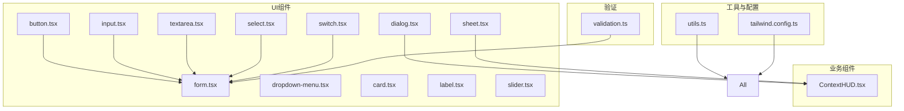
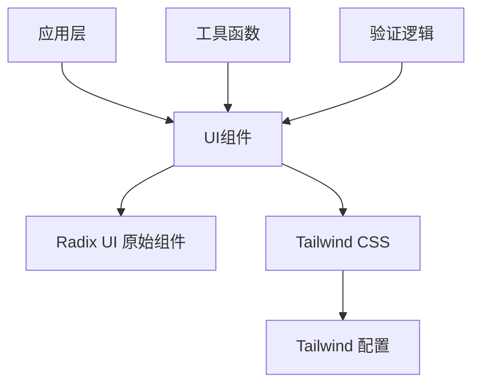
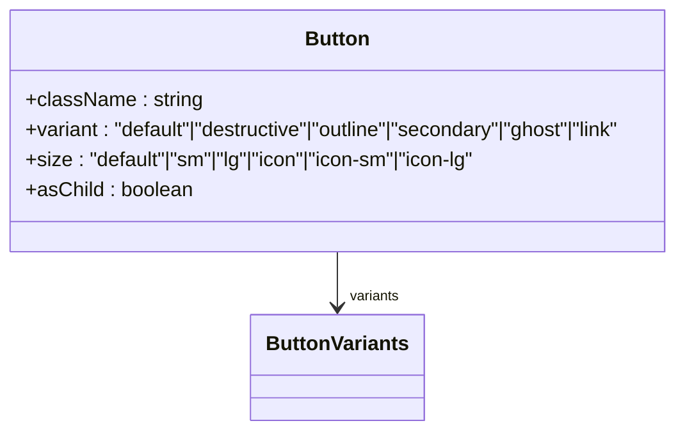
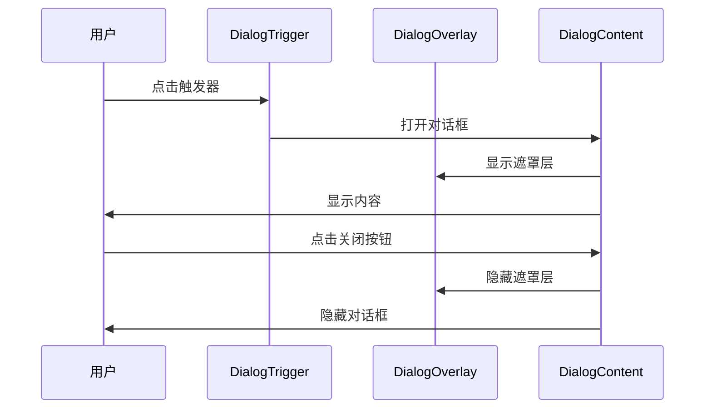
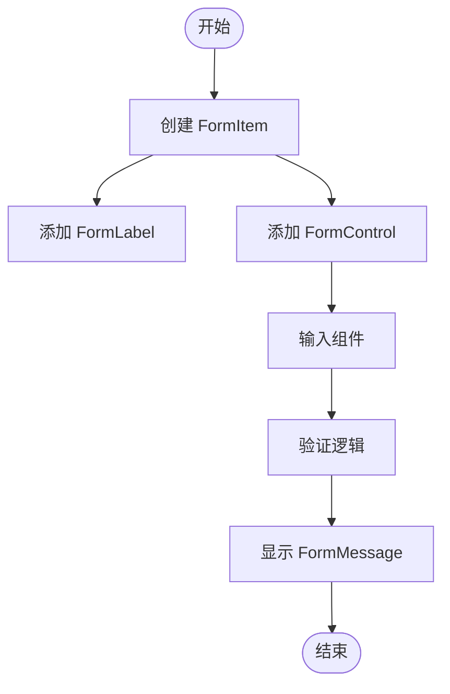
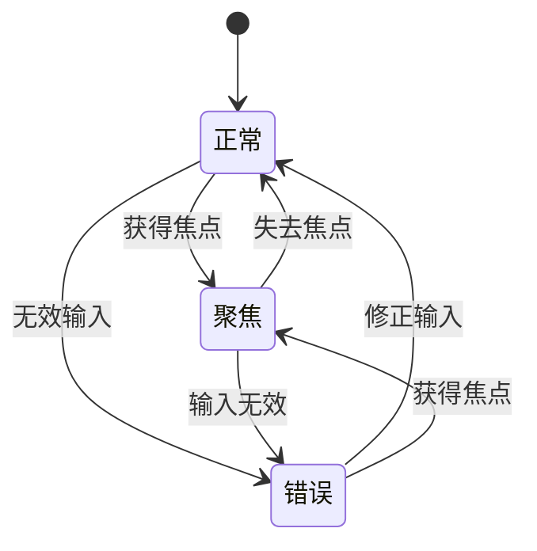
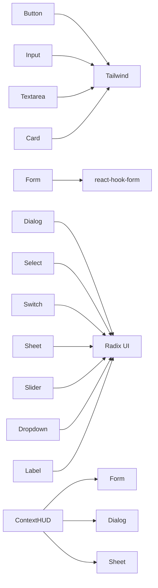

# 通用UI组件

<cite>
**本文档中引用的文件**  
- [button.tsx](file://src/components/ui/button.tsx)
- [dialog.tsx](file://src/components/ui/dialog.tsx)
- [form.tsx](file://src/components/ui/form.tsx)
- [input.tsx](file://src/components/ui/input.tsx)
- [textarea.tsx](file://src/components/ui/textarea.tsx)
- [dropdown-menu.tsx](file://src/components/ui/dropdown-menu.tsx)
- [select.tsx](file://src/components/ui/select.tsx)
- [switch.tsx](file://src/components/ui/switch.tsx)
- [card.tsx](file://src/components/ui/card.tsx)
- [label.tsx](file://src/components/ui/label.tsx)
- [sheet.tsx](file://src/components/ui/sheet.tsx)
- [slider.tsx](file://src/components/ui/slider.tsx)
- [utils.ts](file://src/lib/utils.ts)
- [tailwind.config.ts](file://tailwind.config.ts)
- [ContextHUD.tsx](file://src/components/builder/ContextHUD.tsx)
- [validation.ts](file://src/utils/validation.ts)
</cite>

## 目录
1. [简介](#简介)
2. [项目结构](#项目结构)
3. [核心组件](#核心组件)
4. [架构概述](#架构概述)
5. [详细组件分析](#详细组件分析)
6. [依赖分析](#依赖分析)
7. [性能考虑](#性能考虑)
8. [故障排除指南](#故障排除指南)
9. [结论](#结论)

## 简介
本项目是一个基于Radix UI和Tailwind CSS构建的通用组件库，旨在为开发者提供一套高度可复用、可访问性强且主题可定制的UI组件。这些组件包括按钮、对话框、表单、输入框、文本域等基础元素，通过封装提升了开发的一致性与效率。

## 项目结构
该项目采用模块化设计，主要分为以下几个部分：
- `src/app/`: 应用页面和API路由
- `src/components/`: UI组件和业务组件
- `src/lib/`: 工具函数和配置
- `src/services/`: API服务
- `src/store/`: 状态管理
- `src/types/`: 类型定义
- `src/utils/`: 验证工具

**图源**
- [button.tsx](file://src/components/ui/button.tsx)
- [form.tsx](file://src/components/ui/form.tsx)
- [input.tsx](file://src/components/ui/input.tsx)
- [textarea.tsx](file://src/components/ui/textarea.tsx)
- [select.tsx](file://src/components/ui/select.tsx)
- [switch.tsx](file://src/components/ui/switch.tsx)
- [dialog.tsx](file://src/components/ui/dialog.tsx)
- [sheet.tsx](file://src/components/ui/sheet.tsx)
- [ContextHUD.tsx](file://src/components/builder/ContextHUD.tsx)
- [utils.ts](file://src/lib/utils.ts)
- [tailwind.config.ts](file://tailwind.config.ts)
- [validation.ts](file://src/utils/validation.ts)

**本节来源**
- [src/components/ui](file://src/components/ui)
- [src/lib/utils.ts](file://src/lib/utils.ts)
- [tailwind.config.ts](file://tailwind.config.ts)

## 核心组件
该组件库的核心在于其基于Radix UI构建的基础组件，结合Tailwind CSS实现样式定制。所有组件都遵循一致的设计原则，支持可访问性（ARIA属性）、响应式行为和主题定制能力。

**本节来源**
- [button.tsx](file://src/components/ui/button.tsx)
- [dialog.tsx](file://src/components/ui/dialog.tsx)
- [form.tsx](file://src/components/ui/form.tsx)
- [input.tsx](file://src/components/ui/input.tsx)
- [textarea.tsx](file://src/components/ui/textarea.tsx)

## 架构概述
整个组件库采用分层架构，底层依赖Radix UI提供无障碍访问支持，中间层使用Tailwind CSS进行样式控制，上层通过`cn`工具函数合并类名，确保灵活性和一致性。

**图源**
- [button.tsx](file://src/components/ui/button.tsx)
- [utils.ts](file://src/lib/utils.ts)
- [tailwind.config.ts](file://tailwind.config.ts)

**本节来源**
- [src/components/ui](file://src/components/ui)
- [src/lib/utils.ts](file://src/lib/utils.ts)
- [tailwind.config.ts](file://tailwind.config.ts)

## 详细组件分析

### 按钮组件分析
按钮组件提供了多种变体和尺寸选项，支持通过`asChild`属性将样式应用到子元素上。

#### 按钮类图

**图源**
- [button.tsx](file://src/components/ui/button.tsx)

**本节来源**
- [button.tsx](file://src/components/ui/button.tsx)

### 对话框组件分析
对话框组件提供模态框功能，包含标题、内容、页脚等结构化部分，并支持关闭按钮显示控制。

#### 对话框序列图

**图源**
- [dialog.tsx](file://src/components/ui/dialog.tsx)

**本节来源**
- [dialog.tsx](file://src/components/ui/dialog.tsx)

### 表单组件分析
表单组件基于`react-hook-form`构建，提供完整的表单管理解决方案，包括字段验证、错误提示和状态管理。

#### 表单组件流程图

**图源**
- [form.tsx](file://src/components/ui/form.tsx)
- [validation.ts](file://src/utils/validation.ts)

**本节来源**
- [form.tsx](file://src/components/ui/form.tsx)
- [validation.ts](file://src/utils/validation.ts)

### 输入与文本域组件分析
输入框和文本域组件专注于提供一致的交互体验，支持无障碍访问和错误状态可视化。

#### 输入组件状态图

**图源**
- [input.tsx](file://src/components/ui/input.tsx)
- [textarea.tsx](file://src/components/ui/textarea.tsx)

**本节来源**
- [input.tsx](file://src/components/ui/input.tsx)
- [textarea.tsx](file://src/components/ui/textarea.tsx)

## 依赖分析
组件库的依赖关系清晰，各组件之间耦合度低，便于维护和扩展。

**图源**
- [package-lock.json](file://package-lock.json)
- [components.json](file://components.json)

**本节来源**
- [package-lock.json](file://package-lock.json)
- [components.json](file://components.json)

## 性能考虑
所有组件均采用函数式组件和React Hooks，避免不必要的渲染。通过`React.memo`和`useMemo`等优化手段提升性能。

## 故障排除指南
常见问题包括样式冲突、无障碍访问问题和表单验证失败。建议检查类名合并逻辑、ARIA属性设置和验证规则定义。

**本节来源**
- [utils.ts](file://src/lib/utils.ts)
- [form.tsx](file://src/components/ui/form.tsx)
- [validation.ts](file://src/utils/validation.ts)

## 结论
该组件库通过合理的设计和实现，提供了一套高效、可访问且易于定制的UI解决方案。开发者可以快速集成这些组件，提升开发效率和用户体验一致性。