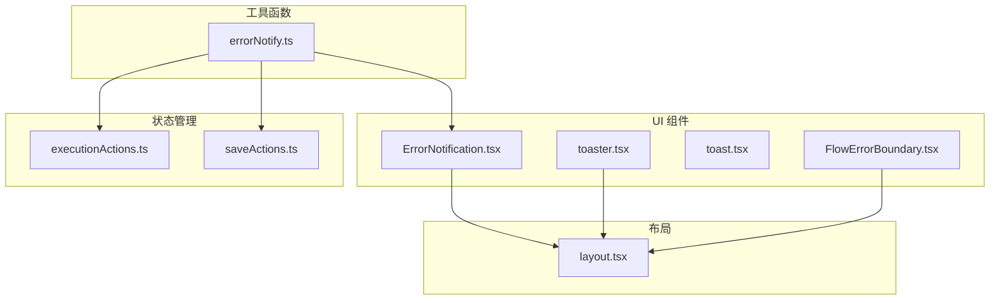
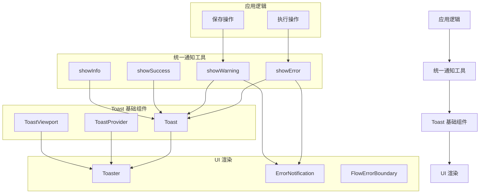
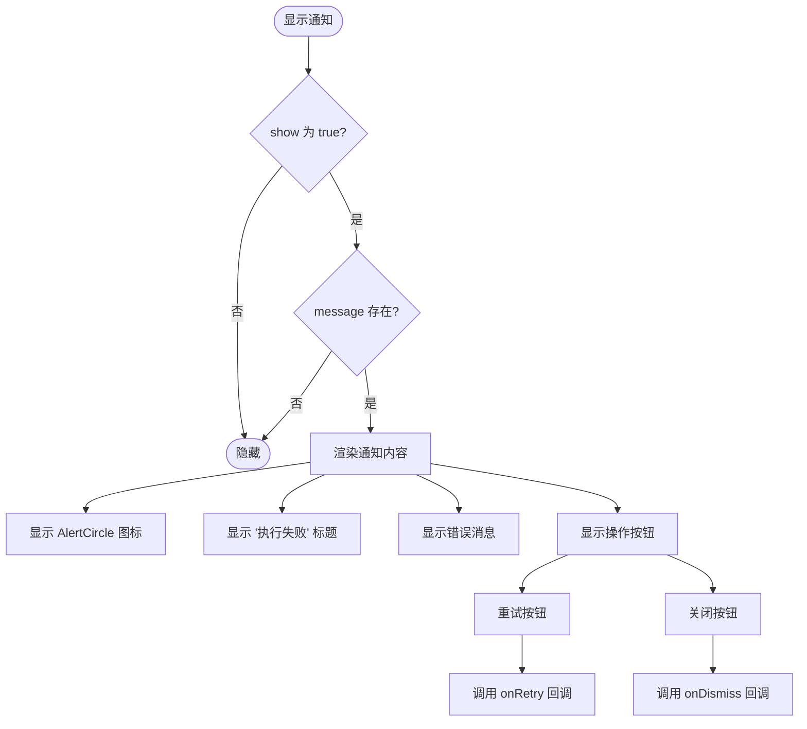
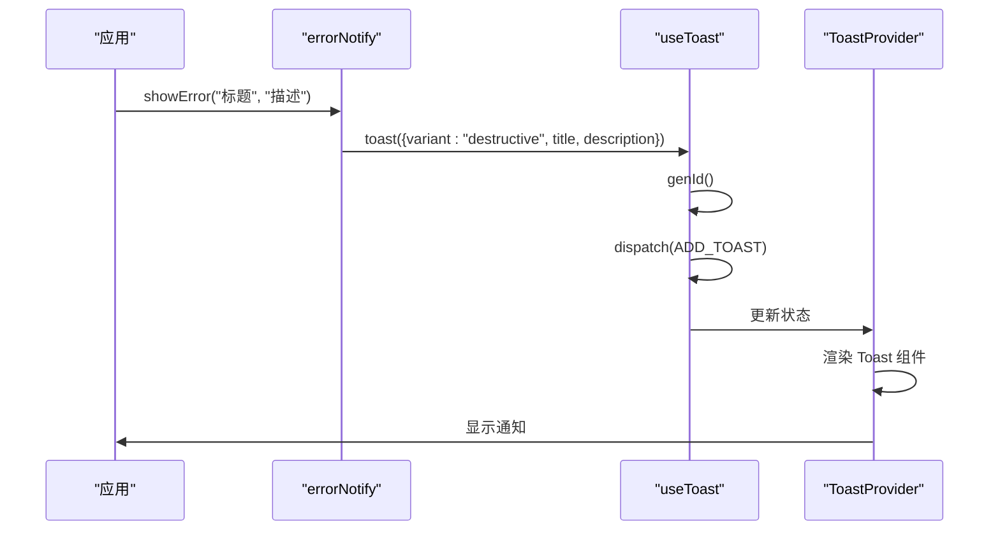
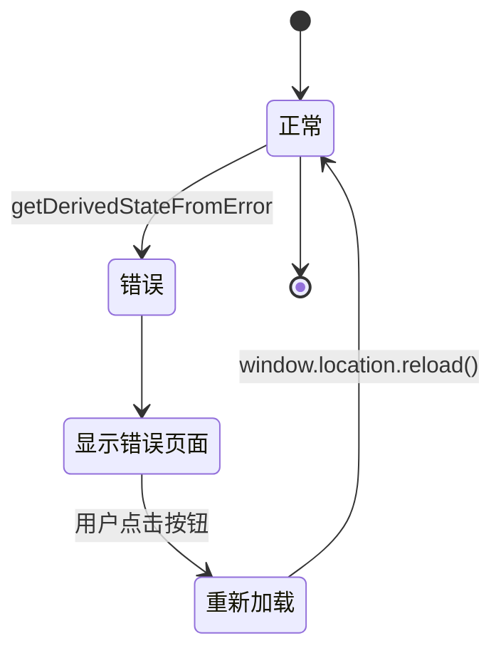
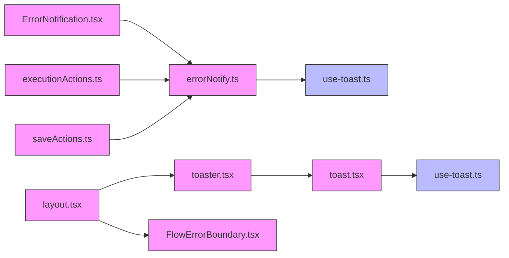

# 错误通知系统

<cite>
**本文档引用的文件**
- [errorNotify.ts](file://src/utils/errorNotify.ts)
- [ErrorNotification.tsx](file://src/components/builder/ErrorNotification.tsx)
- [use-toast.ts](file://src/hooks/use-toast.ts)
- [toaster.tsx](file://src/components/ui/toaster.tsx)
- [toast.tsx](file://src/components/ui/toast.tsx)
- [FlowErrorBoundary.tsx](file://src/components/FlowErrorBoundary.tsx)
- [executionActions.ts](file://src/store/actions/executionActions.ts)
- [saveActions.ts](file://src/store/actions/saveActions.ts)
- [layout.tsx](file://src/app/layout.tsx)
</cite>

## 目录
1. [简介](#简介)
2. [项目结构](#项目结构)
3. [核心组件](#核心组件)
4. [架构概述](#架构概述)
5. [详细组件分析](#详细组件分析)
6. [依赖分析](#依赖分析)
7. [性能考虑](#性能考虑)
8. [故障排除指南](#故障排除指南)
9. [结论](#结论)

## 简介
错误通知系统是 Flash Flow SaaS 平台的关键组成部分，负责向用户提供一致、直观的错误、警告、成功和信息反馈。该系统采用分层架构，包含统一的工具函数、UI 组件和错误边界，确保在各种场景下都能提供良好的用户体验。

## 项目结构
错误通知系统分布在多个目录中，主要包含工具函数、UI 组件和状态管理逻辑。系统通过模块化设计实现了关注点分离，便于维护和扩展。



**图示来源**
- [errorNotify.ts](file://src/utils/errorNotify.ts)
- [ErrorNotification.tsx](file://src/components/builder/ErrorNotification.tsx)
- [toaster.tsx](file://src/components/ui/toaster.tsx)
- [toast.tsx](file://src/components/ui/toast.tsx)
- [FlowErrorBoundary.tsx](file://src/components/FlowErrorBoundary.tsx)
- [executionActions.ts](file://src/store/actions/executionActions.ts)
- [saveActions.ts](file://src/store/actions/saveActions.ts)
- [layout.tsx](file://src/app/layout.tsx)

**节来源**
- [src/utils/errorNotify.ts](file://src/utils/errorNotify.ts)
- [src/components/builder/ErrorNotification.tsx](file://src/components/builder/ErrorNotification.tsx)
- [src/components/ui/toaster.tsx](file://src/components/ui/toaster.tsx)
- [src/components/ui/toast.tsx](file://src/components/ui/toast.tsx)
- [src/components/FlowErrorBoundary.tsx](file://src/components/FlowErrorBoundary.tsx)
- [src/store/actions/executionActions.ts](file://src/store/actions/executionActions.ts)
- [src/store/actions/saveActions.ts](file://src/store/actions/saveActions.ts)
- [src/app/layout.tsx](file://src/app/layout.tsx)

## 核心组件
错误通知系统的核心组件包括统一的错误通知工具函数、执行失败通知组件、全局 Toast 组件和错误边界组件。这些组件协同工作，为用户提供一致的反馈体验。

**节来源**
- [errorNotify.ts](file://src/utils/errorNotify.ts)
- [ErrorNotification.tsx](file://src/components/builder/ErrorNotification.tsx)
- [toaster.tsx](file://src/components/ui/toaster.tsx)
- [FlowErrorBoundary.tsx](file://src/components/FlowErrorBoundary.tsx)

## 架构概述
错误通知系统采用分层架构，从底层的 Toast 基础组件到上层的应用逻辑，形成了完整的通知链条。系统通过统一的工具函数封装了不同类型的反馈，确保了 UI 的一致性。



**图示来源**
- [errorNotify.ts](file://src/utils/errorNotify.ts)
- [use-toast.ts](file://src/hooks/use-toast.ts)
- [toaster.tsx](file://src/components/ui/toaster.tsx)
- [toast.tsx](file://src/components/ui/toast.tsx)
- [ErrorNotification.tsx](file://src/components/builder/ErrorNotification.tsx)

## 详细组件分析

### 统一通知工具分析
统一通知工具提供了四种类型的反馈：错误、警告、成功和信息。这些工具函数封装了底层的 Toast 调用，简化了上层组件的使用。

```mermaid
classDiagram
class errorNotify {
+showError(title : string, description? : string) : void
+showWarning(title : string, description? : string) : void
+showSuccess(title : string, description? : string) : void
+showInfo(title : string, description? : string) : void
}
class useToast {
+toast(props : Toast) : {id, dismiss, update}
+useToast() : {toasts, toast, dismiss}
}
errorNotify --> useToast : "使用"
```

**图示来源**
- [errorNotify.ts](file://src/utils/errorNotify.ts)
- [use-toast.ts](file://src/hooks/use-toast.ts)

**节来源**
- [errorNotify.ts](file://src/utils/errorNotify.ts)

### 执行失败通知组件分析
执行失败通知组件是一个固定在页面左下角的浮动通知，用于显示工作流执行失败的信息。用户可以通过该组件重试操作或关闭通知。



**图示来源**
- [ErrorNotification.tsx](file://src/components/builder/ErrorNotification.tsx)

**节来源**
- [ErrorNotification.tsx](file://src/components/builder/ErrorNotification.tsx)

### 全局 Toast 系统分析
全局 Toast 系统基于 React 状态管理和 Radix UI 组件构建，提供了一个可配置的通知系统。系统支持多种变体（默认、破坏性、警告），并具有自动移除功能。



**图示来源**
- [errorNotify.ts](file://src/utils/errorNotify.ts)
- [use-toast.ts](file://src/hooks/use-toast.ts)
- [toaster.tsx](file://src/components/ui/toaster.tsx)

**节来源**
- [errorNotify.ts](file://src/utils/errorNotify.ts)
- [use-toast.ts](file://src/hooks/use-toast.ts)
- [toaster.tsx](file://src/components/ui/toaster.tsx)

### 错误边界组件分析
错误边界组件用于捕获并处理工作流编辑器中的 JavaScript 错误，防止整个应用崩溃。当捕获到错误时，会显示一个友好的错误页面，允许用户重新加载应用。



**图示来源**
- [FlowErrorBoundary.tsx](file://src/components/FlowErrorBoundary.tsx)

**节来源**
- [FlowErrorBoundary.tsx](file://src/components/FlowErrorBoundary.tsx)

## 依赖分析
错误通知系统与其他模块存在明确的依赖关系，通过依赖注入和模块导入的方式实现功能集成。



**图示来源**
- [errorNotify.ts](file://src/utils/errorNotify.ts)
- [use-toast.ts](file://src/hooks/use-toast.ts)
- [ErrorNotification.tsx](file://src/components/builder/ErrorNotification.tsx)
- [executionActions.ts](file://src/store/actions/executionActions.ts)
- [saveActions.ts](file://src/store/actions/saveActions.ts)
- [layout.tsx](file://src/app/layout.tsx)
- [toaster.tsx](file://src/components/ui/toaster.tsx)
- [toast.tsx](file://src/components/ui/toast.tsx)
- [FlowErrorBoundary.tsx](file://src/components/FlowErrorBoundary.tsx)

**节来源**
- [src/utils/errorNotify.ts](file://src/utils/errorNotify.ts)
- [src/hooks/use-toast.ts](file://src/hooks/use-toast.ts)
- [src/components/builder/ErrorNotification.tsx](file://src/components/builder/ErrorNotification.tsx)
- [src/store/actions/executionActions.ts](file://src/store/actions/executionActions.ts)
- [src/store/actions/saveActions.ts](file://src/store/actions/saveActions.ts)
- [src/app/layout.tsx](file://src/app/layout.tsx)
- [src/components/ui/toaster.tsx](file://src/components/ui/toaster.tsx)
- [src/components/ui/toast.tsx](file://src/components/ui/toast.tsx)
- [src/components/FlowErrorBoundary.tsx](file://src/components/FlowErrorBoundary.tsx)

## 性能考虑
错误通知系统在设计时考虑了性能因素，通过以下方式优化了用户体验：
- Toast 通知限制为同时只显示一个，避免通知堆积
- 使用 React 的 useEffect 和状态管理优化渲染性能
- 通过防抖机制减少不必要的保存操作通知
- 错误边界组件仅在发生错误时渲染备用 UI，不影响正常情况下的性能

## 故障排除指南
当错误通知系统出现问题时，可以参考以下排查步骤：

1. **检查 Toast 不显示问题**
   - 确认 `Toaster` 组件已在布局中正确渲染
   - 检查 `use-toast.ts` 中的状态管理是否正常工作
   - 验证 `toast` 函数是否被正确调用

2. **检查错误边界不生效问题**
   - 确认 `FlowErrorBoundary` 组件已正确包裹目标组件
   - 检查 `getDerivedStateFromError` 和 `componentDidCatch` 方法是否正确实现
   - 验证错误是否为 React 可捕获的渲染错误

3. **检查通知样式问题**
   - 确认 Tailwind CSS 类名是否正确应用
   - 检查 `toastVariants` 配置是否正确
   - 验证主题变量是否正确设置

**节来源**
- [toaster.tsx](file://src/components/ui/toaster.tsx)
- [FlowErrorBoundary.tsx](file://src/components/FlowErrorBoundary.tsx)
- [toast.tsx](file://src/components/ui/toast.tsx)

## 结论
错误通知系统通过分层架构和模块化设计，为 Flash Flow SaaS 平台提供了可靠、一致的用户反馈机制。系统不仅包含了基本的 Toast 通知功能，还实现了特定场景的执行失败通知和全局错误边界，全面覆盖了各种错误处理需求。通过统一的工具函数和清晰的依赖关系，系统易于维护和扩展，为用户提供良好的使用体验。