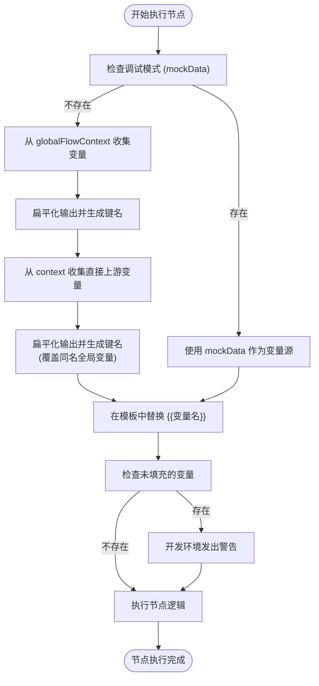

# 变量规则

<cite>
**本文档引用的文件**  
- [variableRules.ts](file://src/lib/prompts/variableRules.ts)
- [variableUtils.ts](file://src/store/executors/utils/variableUtils.ts)
- [promptParser.ts](file://src/lib/promptParser.ts)
- [contextUtils.ts](file://src/store/executors/contextUtils.ts)
- [LLMNodeExecutor.ts](file://src/store/executors/LLMNodeExecutor.ts)
- [RAGNodeExecutor.ts](file://src/store/executors/RAGNodeExecutor.ts)
- [ToolNodeExecutor.ts](file://src/store/executors/ToolNodeExecutor.ts)
- [InputNodeExecutor.ts](file://src/store/executors/InputNodeExecutor.ts)
- [flow.ts](file://src/types/flow.ts)
</cite>

## 目录
1. [引言](#引言)
2. [变量引用核心规则](#变量引用核心规则)
3. [变量收集与解析机制](#变量收集与解析机制)
4. [变量在各节点类型中的应用](#变量在各节点类型中的应用)
5. [变量解析流程图](#变量解析流程图)
6. [最佳实践与常见错误](#最佳实践与常见错误)

## 引言

本项目中的变量系统是工作流执行的核心机制，它允许用户在不同节点之间传递和引用数据。变量通过特定的语法格式在提示词（Prompt）、工具输入、RAG 查询等场景中被动态替换，从而实现复杂的数据流转和逻辑编排。该系统的设计强调精确性、可预测性和易用性。

变量的生命周期始于上游节点的输出，经过上下文（FlowContext）的传递，最终在下游节点中被收集、解析并用于实际执行。整个过程依赖于一套严格的命名和引用规则，确保数据能够被准确无误地定位和使用。

**本文档来源**
- [variableRules.ts](file://src/lib/prompts/variableRules.ts#L1-L21)

## 变量引用核心规则

变量引用必须遵循一套严格的“铁律”，以确保系统的稳定性和可维护性。这些规则定义了变量的书写格式、命名空间和匹配方式。

### 必须使用双大括号语法

所有变量引用必须使用双大括号 `{{ }}` 进行包裹。这是系统识别变量的唯一方式。
- ✅ **正确**: `{{用户输入.user_input}}`
- ❌ **错误**: `用户输入.user_input` 或 `{{user_input}}`

### 必须精确匹配节点标签（Label）

变量的前缀必须与来源节点的 `data.label` 字段完全一致，包括大小写和空格。系统不接受节点ID或自定义别名作为前缀。
- ✅ **正确**: 如果节点标签是“小红书改写”，则必须使用 `{{小红书改写.response}}`
- ❌ **错误**: 使用 `{{xhs_writer.response}}` 或 `{{小红书改写 .response}}` (标签后有空格)

### 禁止使用无前缀或点号直连

- **严禁无前缀**: `{{user_input}}` 或 `{{files}}` 是无效的，因为它们无法确定数据来源。
- **严禁点号直连**: `input_node.formData.type` 不被支持，必须转换为 `{{节点名.formData.type}}` 的格式。

### 引用格式对照表

| 引用目标 | ✅ 正确写法 (假设节点 Label 为 "上传数据") | ❌ 错误写法 (严禁！) |
|---------|-----------|------------|
| 用户文本 | `{{上传数据.user_input}}` | `上传数据.user_input` / `{{user_input}}` |
| 用户文件 | `{{上传数据.files}}` | `{{upload_node.files}}` / `files` |
| 表单字段 | `{{配置参数.formData.mode}}` | `{{form.mode}}` / `{{formData.mode}}` |
| LLM回复 | `{{内容生成.response}}` | `{{llm_node.response}}` / `response` |
| 工具结果 | `{{网页搜索.results}}` | `{{search.results}}` / `results` |
| RAG文档 | `{{知识检索.documents}}` | `{{rag.documents}}` / `documents` |

**本节来源**
- [variableRules.ts](file://src/lib/prompts/variableRules.ts#L1-L21)

## 变量收集与解析机制

变量的处理是一个多步骤的过程，涉及从上下文中收集数据、展开嵌套结构、生成可引用的键名，以及最终的字符串替换。

### 变量收集 (`collectVariables`)

`collectVariables` 函数是变量系统的核心，它负责从当前执行上下文（`context`）和全局流程上下文（`globalFlowContext`）中提取所有可用的变量。

1.  **调试模式优先**: 如果提供了 `mockData`，则直接使用它作为变量源，用于调试和预览。
2.  **全局上下文填充**: 遍历 `globalFlowContext`，将所有非直接上游节点的输出数据进行扁平化处理，并生成三种前缀的键名：
    -   无前缀: `user_input`
    -   节点标签前缀: `{{上传数据.user_input}}`
    -   节点ID前缀: `{{node_abc123.user_input}}`
3.  **直接上游覆盖**: 遍历 `context`，将直接上游节点的输出数据进行同样的扁平化处理。这一步会覆盖全局上下文中的同名变量，确保了“直接上游优先”的原则。

### 变量扁平化 (`flattenObject`)

由于节点输出可能是嵌套的JSON对象，`flattenObject` 函数会递归地将其展开成一层键值对。
-   例如，一个输出 `{ formatted: "2025-12-07", timestamp: 123 }` 会被展开为 `{"formatted": "2025-12-07", "timestamp": "123"}`。
-   数组会被转换为JSON字符串。
-   内部字段（以 `_` 开头）会被忽略。

### 变量替换 (`replaceVariables`)

`replaceVariables` 函数负责在模板字符串（如Prompt）中查找并替换变量。
-   它使用正则表达式 `\{\{([^}]+)\}\}` 来匹配所有 `{{变量名}}` 格式的占位符。
-   对于每个匹配到的变量名，它会在 `values` 映射中查找对应的值并进行替换。
-   在开发环境下，如果存在未找到的变量，会发出警告。

**本节来源**
- [variableUtils.ts](file://src/store/executors/utils/variableUtils.ts#L12-L139)
- [promptParser.ts](file://src/lib/promptParser.ts#L50-L80)

## 变量在各节点类型中的应用

不同的节点类型以不同的方式使用和处理变量。

### LLM 节点

LLM 节点是变量的主要消费者。其 `systemPrompt` 字段是一个模板，其中的 `{{ }}` 占位符会被 `collectVariables` 收集到的变量所替换。
-   **执行流程**: 在 `LLMNodeExecutor` 的 `execute` 方法中，首先调用 `collectVariables` 获取所有变量，然后调用 `replaceVariables` 替换 `systemPrompt` 中的内容。
-   **输入解析**: LLM 节点的输入内容（`user_input`）通常来自上游 `Input` 节点的输出。

### RAG 节点

RAG 节点使用变量来动态指定查询内容和文件源。
-   **查询 (`query`)**: `inputMappings.query` 字段可以包含 `{{ }}` 变量，这些变量会被 `resolveVariableTemplate` 函数解析。
-   **文件 (`files`)**: `inputMappings.files` 可以引用上游节点的 `files` 字段，实现动态文件处理。
-   **解析机制**: `resolveVariableTemplate` 函数支持 `节点标签.字段名` 的路径语法，并能处理数组和嵌套对象。

### Tool 节点

工具节点的输入参数可以是包含变量的字符串。
-   **参数替换**: 在 `ToolNodeExecutor` 中，会收集所有可用变量，并对 `inputs` 对象中的字符串值进行 `replaceVariables` 替换。
-   **验证**: 替换后的参数会经过 `validateToolInputs` 的验证，确保符合工具的执行要求。

### Input 节点

Input 节点是变量的主要生产者之一。
-   **输出结构**: 它的输出包含 `user_input` (用户输入的文本)、`files` (上传的文件元数据) 和 `formData` (表单字段)。
-   **数据来源**: 这些数据在节点执行时被直接提取并构建成输出对象，供下游节点引用。

**本节来源**
- [LLMNodeExecutor.ts](file://src/store/executors/LLMNodeExecutor.ts#L158-L172)
- [RAGNodeExecutor.ts](file://src/store/executors/RAGNodeExecutor.ts#L118-L128)
- [ToolNodeExecutor.ts](file://src/store/executors/ToolNodeExecutor.ts#L123-L134)
- [InputNodeExecutor.ts](file://src/store/executors/InputNodeExecutor.ts#L15-L30)

## 变量解析流程图

**图表来源**
- [variableUtils.ts](file://src/store/executors/utils/variableUtils.ts#L55-L138)
- [promptParser.ts](file://src/lib/promptParser.ts#L50-L80)

## 最佳实践与常见错误

### 最佳实践

1.  **使用清晰的节点标签**: 为节点设置明确、无歧义的标签，这将直接成为变量引用的前缀。
2.  **利用上下文HUD**: 在构建器中，使用上下文HUD查看当前可用的变量列表，避免拼写错误。
3.  **在调试模式下测试**: 使用调试对话框为变量提供模拟值，验证Prompt和逻辑的正确性。

### 常见错误

1.  **拼写错误**: 节点标签或字段名拼写错误会导致变量无法匹配。
2.  **忽略大小写**: `{{用户输入.User_Input}}` 与 `{{用户输入.user_input}}` 被视为两个不同的变量。
3.  **使用ID而非标签**: 试图使用节点ID（如 `node_abc123`）作为前缀，而不是用户定义的标签。
4.  **未连接上游节点**: 在引用一个变量时，确保产生该变量的上游节点已正确连接。

**本节来源**
- [variableRules.ts](file://src/lib/prompts/variableRules.ts#L1-L21)
- [promptParser.ts](file://src/lib/promptParser.ts#L68-L77)