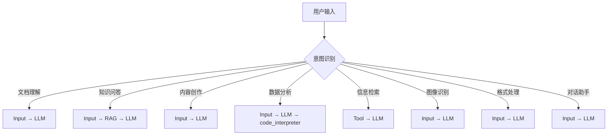
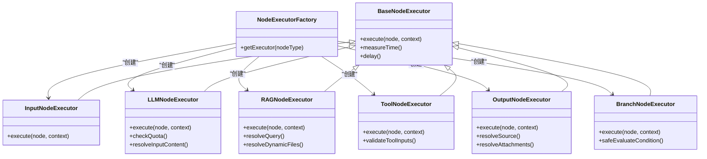
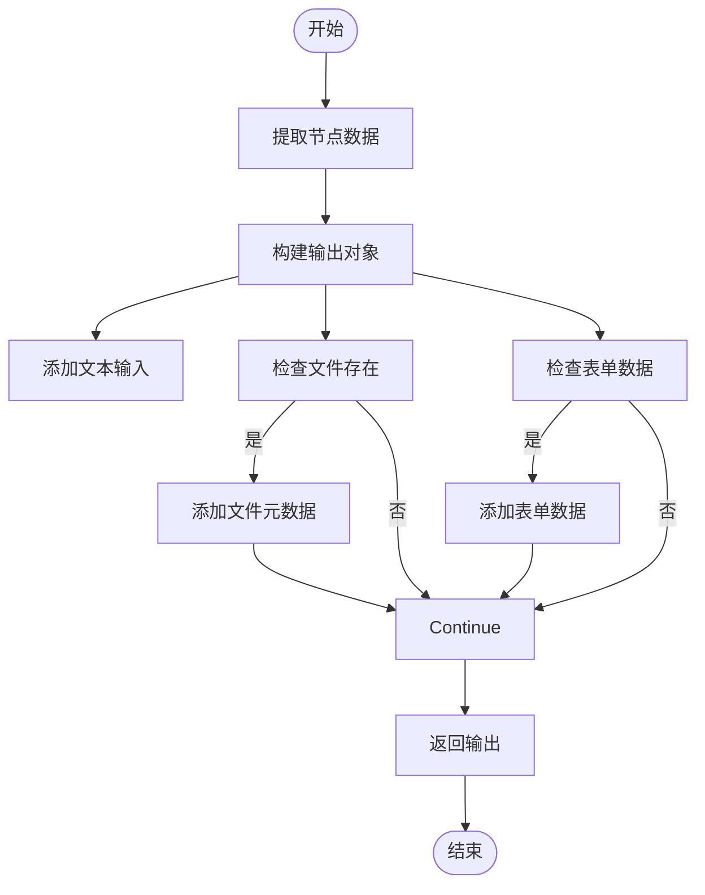
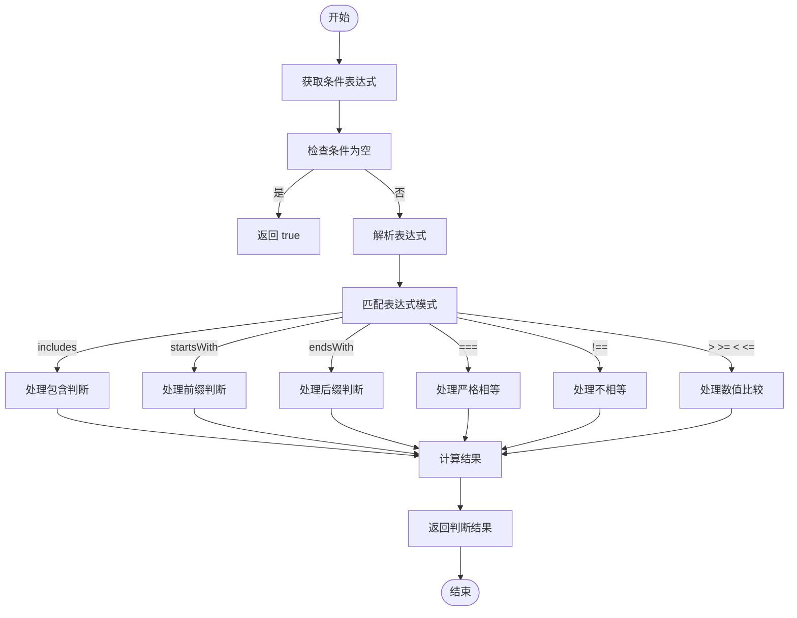
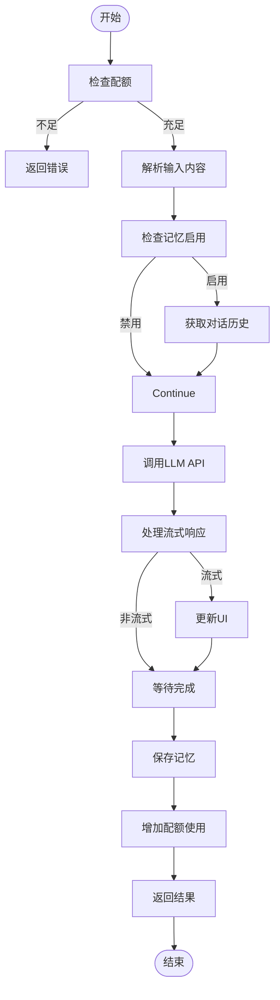

# 场景规则

<cite>
**本文档引用的文件**  
- [scenarioRules.ts](file://src/lib/prompts/scenarioRules.ts)
- [README.md](file://README.md)
- [NodeExecutorFactory.ts](file://src/store/executors/NodeExecutorFactory.ts)
- [BranchNodeExecutor.ts](file://src/store/executors/BranchNodeExecutor.ts)
- [InputNodeExecutor.ts](file://src/store/executors/InputNodeExecutor.ts)
- [LLMNodeExecutor.ts](file://src/store/executors/LLMNodeExecutor.ts)
- [RAGNodeExecutor.ts](file://src/store/executors/RAGNodeExecutor.ts)
- [ToolNodeExecutor.ts](file://src/store/executors/ToolNodeExecutor.ts)
- [OutputNodeExecutor.ts](file://src/store/executors/OutputNodeExecutor.ts)
- [flow.ts](file://src/types/flow.ts)
</cite>

## 目录
1. [简介](#简介)
2. [场景规则概述](#场景规则概述)
3. [核心执行器分析](#核心执行器分析)
4. [场景识别与节点组合](#场景识别与节点组合)
5. [默认假设规则](#默认假设规则)
6. [节点执行逻辑](#节点执行逻辑)
7. [变量引用系统](#变量引用系统)
8. [安全与验证机制](#安全与验证机制)
9. [总结](#总结)

## 简介

Flash Flow 是一个基于自然语言描述生成 AI 工作流的平台，其核心功能之一是通过"场景规则"将用户的口语化需求自动映射到标准化的工作流结构。本文档深入分析了场景规则的实现机制、执行逻辑和相关组件。

**本文档引用的文件**  
- [README.md](file://README.md)

## 场景规则概述

场景规则是 Flash Flow 的核心智能引擎，负责将用户口语化的自然语言描述转换为可执行的工作流。系统通过预定义的规则库识别用户意图，并自动生成相应的节点组合。



**图表来源**  
- [scenarioRules.ts](file://src/lib/prompts/scenarioRules.ts)

**本节来源**  
- [scenarioRules.ts](file://src/lib/prompts/scenarioRules.ts)
- [README.md](file://README.md)

## 核心执行器分析

Flash Flow 采用模块化的执行器架构，每个节点类型都有对应的执行器负责处理其逻辑。执行器工厂模式确保了节点执行的统一管理和扩展性。



**图表来源**  
- [NodeExecutorFactory.ts](file://src/store/executors/NodeExecutorFactory.ts)
- [BaseNodeExecutor.ts](file://src/store/executors/BaseNodeExecutor.ts)

**本节来源**  
- [NodeExecutorFactory.ts](file://src/store/executors/NodeExecutorFactory.ts)

## 场景识别与节点组合

场景识别系统通过匹配用户输入与预定义的模式来确定最佳的工作流结构。每种场景都有对应的默认节点组合，确保生成的工作流既符合用户需求又具有最佳实践。

### 场景映射规则

| 用户可能说 | 识别为 | 默认节点组合 |
|-----------|-------|------------|
| "看看这个文件/帮我读一下/总结这份文档" | **文档理解** | Input(file) → LLM(摘要提取) |
| "做个客服/问答机器人/智能助手" | **知识问答** | Input(text) → RAG → LLM(memory=true) |
| "帮我写XX/生成XX/创作XX" | **内容创作** | Input(text+form) → LLM(temp=0.8) |
| "分析数据/做个图表/可视化" | **数据分析** | Input(file) → LLM(coder) → code_interpreter |
| "搜一下/查查/帮我找" | **信息检索** | Tool(web_search) → LLM(总结) |
| "识别图片/看看图里有啥/OCR" | **图像识别** | Input(img) → LLM(视觉模型) |
| "翻译/转格式/提取" | **格式处理** | Input → LLM(temp=0.1) |
| "聊天/陪我说话/闲聊" | **对话助手** | Input → LLM(memory=true) |

**本节来源**  
- [scenarioRules.ts](file://src/lib/prompts/scenarioRules.ts)

### 场景组合机制

复杂需求可以通过多个基础场景的叠加来实现。例如：
- "分析财报并做图表" = 文档理解 + 数据分析
- "根据用户意图路由到不同处理" = 智能分流 + 多场景组合

> **场景组合**: 复杂需求 = 多场景叠加

## 默认假设规则

当用户未明确说明某些配置时，系统会应用一系列默认假设规则，确保工作流的完整性和可用性。

### 默认配置规则

| 未说明项 | 默认假设 |
|---------|--------|
| 输入方式 | `enableTextInput: true` |
| 提到"文件/图片/文档" | 启用 `enableFileInput` |
| 提到"选择/模式/类型" | 启用 `enableStructuredForm` |
| 记忆设置 | `enableMemory: false` |
| 温度设置 | `temperature: 0.7` |

这些默认规则确保了即使用户描述不完整，系统也能生成合理的工作流结构。

**本节来源**  
- [scenarioRules.ts](file://src/lib/prompts/scenarioRules.ts)

## 节点执行逻辑

每个节点类型的执行器都有特定的执行逻辑，处理输入、执行操作并生成输出。

### 输入节点执行器

输入节点执行器负责收集用户输入的各种形式，包括文本、文件和表单数据。



**图表来源**  
- [InputNodeExecutor.ts](file://src/store/executors/InputNodeExecutor.ts)

**本节来源**  
- [InputNodeExecutor.ts](file://src/store/executors/InputNodeExecutor.ts)

### 分支节点执行器

分支节点执行器实现了安全的条件判断功能，支持多种比较操作。



**图表来源**  
- [BranchNodeExecutor.ts](file://src/store/executors/BranchNodeExecutor.ts)

**本节来源**  
- [BranchNodeExecutor.ts](file://src/store/executors/BranchNodeExecutor.ts)

### LLM节点执行器

LLM节点执行器处理大语言模型的调用，支持流式响应和对话记忆。



**图表来源**  
- [LLMNodeExecutor.ts](file://src/store/executors/LLMNodeExecutor.ts)

**本节来源**  
- [LLMNodeExecutor.ts](file://src/store/executors/LLMNodeExecutor.ts)

## 变量引用系统

变量引用系统允许在工作流中引用上游节点的输出，实现数据的传递和重用。

### 引用语法

| 格式 | 示例 | 说明 |
|:---:|:---|:---|
| **字段名** | `{{user_input}}` | 自动匹配上游节点 |
| **节点.字段** | `{{用户输入.user_input}}` | 精确指定节点（推荐） |
| **嵌套访问** | `{{输入.formData.stock}}` | 访问表单字段 |
| **数组索引** | `{{输入.files[0].url}}` | 访问文件属性 |

变量引用系统通过`replaceVariables`函数实现，支持在提示词、工具输入等场景中动态替换变量值。

**本节来源**  
- [README.md](file://README.md)
- [promptParser.ts](file://src/lib/promptParser.ts)

## 安全与验证机制

系统内置了多层安全机制，确保工作流执行的安全性和稳定性。

### 安全特性

| 机制 | 说明 |
|:---:|:---|
| ✅ **循环检测** | 执行前DFS校验，防止工作流无限循环 |
| ✅ **并发控制** | 乐观锁机制防止配额竞态条件 |
| ✅ **参数验证** | Zod Schema强类型校验，拒绝非法输入 |
| ✅ **表达式白名单** | Branch节点内置安全表达式引擎，防代码注入 |
| ✅ **数据隔离** | Supabase Row Level Security多租户隔离 |
| ✅ **沙箱执行** | 代码执行器在E2B隔离沙箱中运行 |

### 表达式安全校验

分支节点的条件表达式经过严格的安全校验，只允许特定的操作模式：

```javascript
// 字符串判断
用户输入.user_input.includes('咨询')

// 数值比较  
计算结果.result > 60

// 等值判断
状态检查.type === 'VIP'
```

系统通过预编译的正则表达式模式匹配来验证表达式格式，防止代码注入攻击。

**本节来源**  
- [BranchNodeExecutor.ts](file://src/store/executors/BranchNodeExecutor.ts)
- [README.md](file://README.md)

## 总结

Flash Flow 的场景规则系统通过智能的意图识别和节点组合机制，将用户的自然语言描述转换为可执行的工作流。系统采用模块化的执行器架构，每个节点类型都有专门的执行器处理其逻辑。通过默认假设规则和安全验证机制，确保了工作流生成的准确性和安全性。

场景规则的核心价值在于：
1. **降低使用门槛**：用户无需了解技术细节即可创建复杂工作流
2. **提高效率**：从想法到落地仅需30秒
3. **保证质量**：基于最佳实践的默认配置和节点组合
4. **确保安全**：多层安全机制保护用户数据和系统稳定

该系统展示了AI如何真正赋能普通用户，让复杂的技术应用变得简单易用。