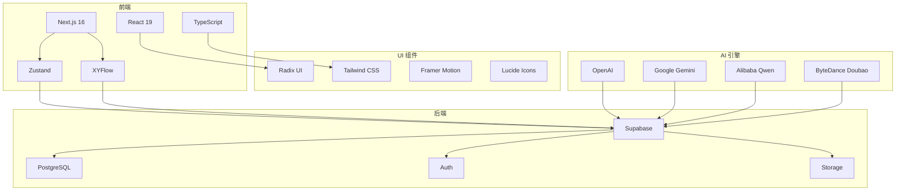
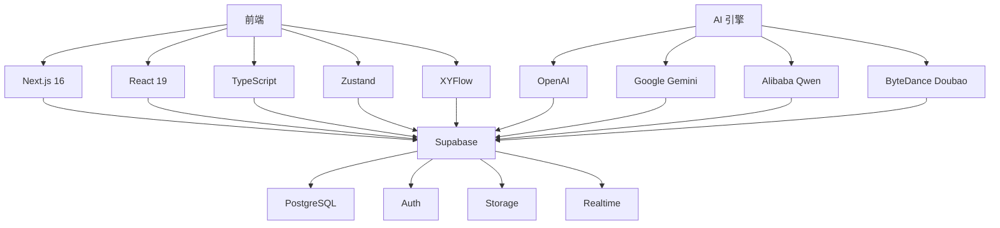
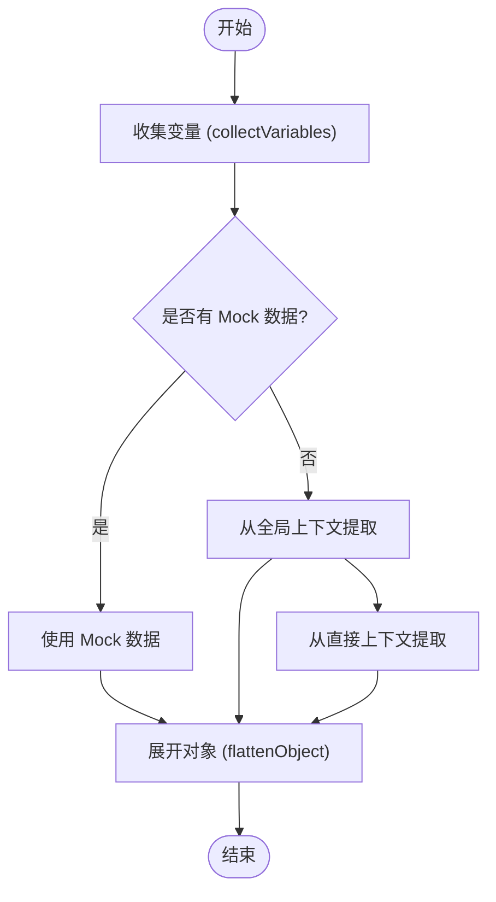
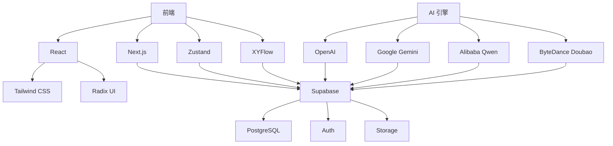

# 工作流模式

<cite>
**本文档中引用的文件**  
- [workflow.ts](file://src/lib/schemas/workflow.ts)
- [initialState.ts](file://src/store/constants/initialState.ts)
- [BaseNodeExecutor.ts](file://src/store/executors/BaseNodeExecutor.ts)
- [NodeExecutorFactory.ts](file://src/store/executors/NodeExecutorFactory.ts)
- [contextUtils.ts](file://src/store/executors/contextUtils.ts)
- [variableUtils.ts](file://src/store/executors/utils/variableUtils.ts)
- [nodeSpecs.ts](file://src/lib/prompts/nodeSpecs.ts)
- [edgeRules.ts](file://src/lib/prompts/edgeRules.ts)
- [variableRules.ts](file://src/lib/prompts/variableRules.ts)
- [flow.ts](file://src/types/flow.ts)
- [run-node/route.ts](file://src/app/api/run-node/route.ts)
- [run-node-stream/route.ts](file://src/app/api/run-node-stream/route.ts)
</cite>

## 目录
1. [简介](#简介)
2. [项目结构](#项目结构)
3. [核心组件](#核心组件)
4. [架构概述](#架构概述)
5. [详细组件分析](#详细组件分析)
6. [依赖分析](#依赖分析)
7. [性能考虑](#性能考虑)
8. [故障排除指南](#故障排除指南)
9. [结论](#结论)

## 简介

Flash Flow 是一款革命性的 AI 工作流生成平台，允许用户通过自然语言描述需求，AI 自动生成完整的工作流。该系统支持多种节点类型，包括输入、LLM、RAG、输出、分支和工具节点，覆盖了从数据输入到复杂逻辑处理的各类场景。平台具备可视化编排、流式响应、多模型动态路由等先进特性，旨在简化 AI 应用开发流程，实现“说出来，就做出来”的理念。

**本文档中引用的文件**  
- [README.md](file://README.md)

## 项目结构

该项目采用模块化设计，主要分为以下几个部分：
- `docs/design/`：包含各种节点和工作流编排机制的详细说明文档。
- `src/`：源代码目录，包含应用逻辑、组件、服务、存储和类型定义。
- `src/app/`：Next.js 应用的核心部分，包含页面、API 路由和布局。
- `src/components/`：可复用的 UI 组件，如构建器、流程节点、侧边栏等。
- `src/store/`：状态管理模块，使用 Zustand 实现，包含执行器、服务和工具函数。
- `src/types/`：类型定义，确保代码的类型安全。
- `src/lib/`：通用库，包含提示词、模式和工具函数。



**Diagram sources**
- [README.md](file://README.md)

**本文档中引用的文件**  
- [project_structure](file://project_structure)

## 核心组件

Flash Flow 的核心组件包括节点执行器、上下文工具、变量工具和 API 路由。这些组件共同协作，实现了从用户输入到最终输出的完整工作流。

**本文档中引用的文件**  
- [BaseNodeExecutor.ts](file://src/store/executors/BaseNodeExecutor.ts)
- [NodeExecutorFactory.ts](file://src/store/executors/NodeExecutorFactory.ts)
- [contextUtils.ts](file://src/store/executors/contextUtils.ts)
- [variableUtils.ts](file://src/store/executors/utils/variableUtils.ts)

## 架构概述

Flash Flow 的架构分为前端、后端和 AI 引擎三个主要部分。前端使用 Next.js 和 React 构建，通过 Zustand 管理状态，XYFlow 提供可视化编排能力。后端基于 Supabase，提供数据库、认证和文件存储服务。AI 引擎集成多个 LLM 服务商，支持多模型动态路由和流式响应。



**Diagram sources**
- [README.md](file://README.md)

## 详细组件分析

### 节点执行器分析

节点执行器是 Flash Flow 的核心逻辑单元，负责执行不同类型节点的任务。每个节点类型都有对应的执行器类，继承自 `BaseNodeExecutor`。

#### 节点执行器类图
```mermaid
classDiagram
class BaseNodeExecutor {
+execute(node : AppNode, context : FlowContext, mockData? : Record<string, unknown>) : Promise~ExecutionResult~
-measureTime~T~(fn : () => Promise~T~) : Promise~{ result : T; time : number }~
-delay(ms : number) : Promise~void~
}
class NodeExecutorFactory {
+getExecutor(nodeType : NodeKind) : NodeExecutor
}
class InputNodeExecutor {
+execute(node : AppNode, context : FlowContext, mockData? : Record<string, unknown>) : Promise~ExecutionResult~
}
class LLMNodeExecutor {
+execute(node : AppNode, context : FlowContext, mockData? : Record<string, unknown>) : Promise~ExecutionResult~
}
class RAGNodeExecutor {
+execute(node : AppNode, context : FlowContext, mockData? : Record<string, unknown>) : Promise~ExecutionResult~
}
class OutputNodeExecutor {
+execute(node : AppNode, context : FlowContext, mockData? : Record<string, unknown>) : Promise~ExecutionResult~
}
class BranchNodeExecutor {
+execute(node : AppNode, context : FlowContext, mockData? : Record<string, unknown>) : Promise~ExecutionResult~
}
class ToolNodeExecutor {
+execute(node : AppNode, context : FlowContext, mockData? : Record<string, unknown>) : Promise~ExecutionResult~
}
BaseNodeExecutor <|-- InputNodeExecutor
BaseNodeExecutor <|-- LLMNodeExecutor
BaseNodeExecutor <|-- RAGNodeExecutor
BaseNodeExecutor <|-- OutputNodeExecutor
BaseNodeExecutor <|-- BranchNodeExecutor
BaseNodeExecutor <|-- ToolNodeExecutor
NodeExecutorFactory --> InputNodeExecutor
NodeExecutorFactory --> LLMNodeExecutor
NodeExecutorFactory --> RAGNodeExecutor
NodeExecutorFactory --> OutputNodeExecutor
NodeExecutorFactory --> BranchNodeExecutor
NodeExecutorFactory --> ToolNodeExecutor
```

**Diagram sources**
- [BaseNodeExecutor.ts](file://src/store/executors/BaseNodeExecutor.ts)
- [NodeExecutorFactory.ts](file://src/store/executors/NodeExecutorFactory.ts)

**本文档中引用的文件**  
- [BaseNodeExecutor.ts](file://src/store/executors/BaseNodeExecutor.ts)
- [NodeExecutorFactory.ts](file://src/store/executors/NodeExecutorFactory.ts)

### 上下文与变量工具分析

上下文与变量工具负责处理工作流中的数据流动和变量替换。`contextUtils.ts` 提供了从上下文中提取数据的工具函数，而 `variableUtils.ts` 则负责收集和展开变量。

#### 上下文与变量工具流程图


**Diagram sources**
- [contextUtils.ts](file://src/store/executors/contextUtils.ts)
- [variableUtils.ts](file://src/store/executors/utils/variableUtils.ts)

**本文档中引用的文件**  
- [contextUtils.ts](file://src/store/executors/contextUtils.ts)
- [variableUtils.ts](file://src/store/executors/utils/variableUtils.ts)

## 依赖分析

Flash Flow 的依赖关系清晰，前端依赖于 React 和 Next.js，状态管理使用 Zustand，UI 组件基于 Radix UI 和 Tailwind CSS。后端依赖 Supabase 提供数据库、认证和文件存储服务。AI 引擎依赖多个 LLM 服务商，通过动态路由选择最佳模型。



**Diagram sources**
- [package.json](file://package.json)

**本文档中引用的文件**  
- [package.json](file://package.json)

## 性能考虑

Flash Flow 在设计时充分考虑了性能优化。前端使用 Next.js 的服务端渲染和静态生成，减少客户端加载时间。状态管理使用 Zustand，避免不必要的重新渲染。AI 引擎支持流式响应，提供打字机效果，提升用户体验。此外，系统还实现了配额管理和并发控制，防止资源滥用。

**本文档中引用的文件**  
- [run-node/route.ts](file://src/app/api/run-node/route.ts)
- [run-node-stream/route.ts](file://src/app/api/run-node-stream/route.ts)

## 故障排除指南

在使用 Flash Flow 时，可能会遇到一些常见问题。以下是一些解决方案：

1. **API 密钥未配置**：确保在 `.env.local` 文件中正确配置了所有必要的 API 密钥。
2. **节点执行失败**：检查节点配置是否正确，特别是变量引用和参数设置。
3. **流式响应中断**：确认网络连接稳定，服务器端没有异常。
4. **配额超限**：检查用户的配额使用情况，必要时升级配额。

**本文档中引用的文件**  
- [authEdge.ts](file://src/lib/authEdge.ts)
- [quotaEdge.ts](file://src/lib/quotaEdge.ts)

## 结论

Flash Flow 通过自然语言生成工作流的方式，极大地简化了 AI 应用的开发过程。其模块化的设计、丰富的节点类型和强大的 AI 引擎，使其能够应对各种复杂的业务场景。未来，可以进一步优化性能，增加更多节点类型和支持更多的 LLM 服务商，提升用户体验。