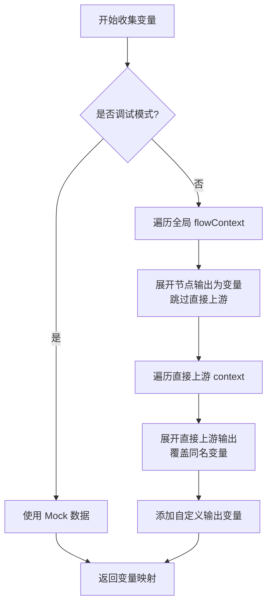
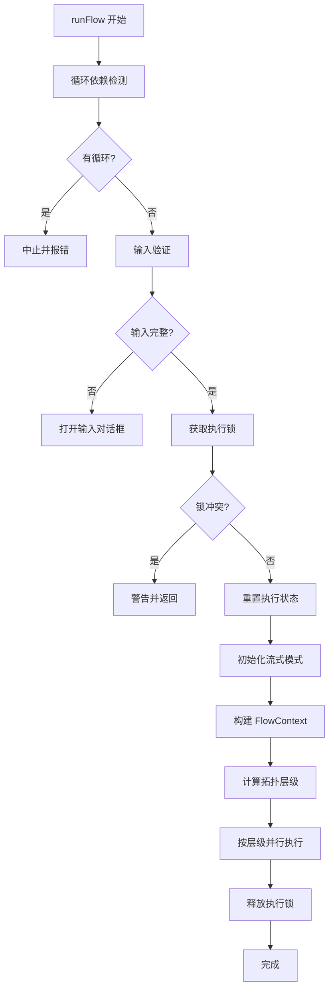
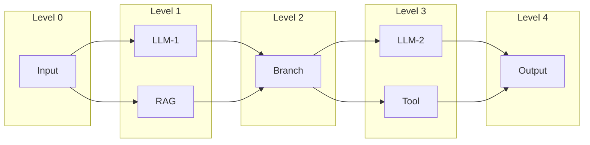
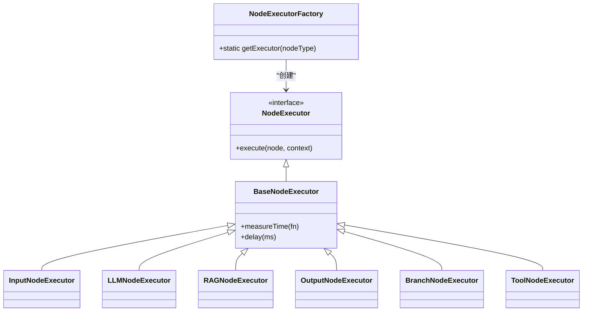
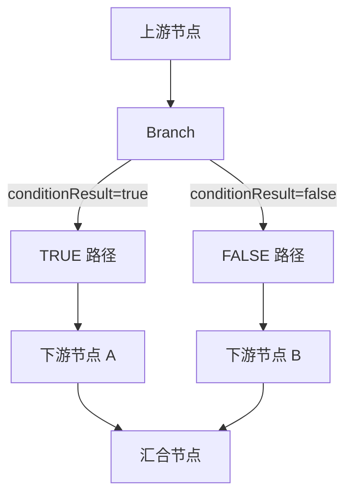

# 工作流编排机制

<cite>
**本文档引用的文件**
- [工作流编排机制详情.md](file://docs/design/工作流编排机制详情.md)
- [workflow.ts](file://src/lib/schemas/workflow.ts)
- [BaseNodeExecutor.ts](file://src/store/executors/BaseNodeExecutor.ts)
- [NodeExecutorFactory.ts](file://src/store/executors/NodeExecutorFactory.ts)
- [planNormalizer.ts](file://src/store/utils/planNormalizer.ts)
- [cycleDetection.ts](file://src/store/utils/cycleDetection.ts)
- [parallelExecutionUtils.ts](file://src/store/utils/parallelExecutionUtils.ts)
- [flow.ts](file://src/types/flow.ts)
- [executionActions.ts](file://src/store/actions/executionActions.ts)
- [InputNodeExecutor.ts](file://src/store/executors/InputNodeExecutor.ts)
- [OutputNodeExecutor.ts](file://src/store/executors/OutputNodeExecutor.ts)
- [BranchNodeExecutor.ts](file://src/store/executors/BranchNodeExecutor.ts)
- [LLMNodeExecutor.ts](file://src/store/executors/LLMNodeExecutor.ts)
- [RAGNodeExecutor.ts](file://src/store/executors/RAGNodeExecutor.ts)
- [ToolNodeExecutor.ts](file://src/store/executors/ToolNodeExecutor.ts)
- [variableUtils.ts](file://src/store/executors/utils/variableUtils.ts)
</cite>

## 目录
1. [简介](#简介)
2. [上下文管理](#上下文管理)
3. [变量系统](#变量系统)
4. [执行引擎](#执行引擎)
5. [节点执行器架构](#节点执行器架构)
6. [分支控制](#分支控制)
7. [流式输出机制](#流式输出机制)
8. [安全与容错](#安全与容错)
9. [性能优化](#性能优化)

## 简介
本文档详细阐述了 Flash Flow 工作流的底层编排机制。该系统是一个基于有向无环图（DAG）的并行执行引擎，通过 `FlowContext` 管理全局数据流，利用节点执行器（Node Executor）模式实现功能扩展，并通过安全的表达式求值和流式输出等机制，为用户提供高效、可靠且直观的自动化体验。

**Section sources**
- [工作流编排机制详情.md](file://docs/design/工作流编排机制详情.md)

## 上下文管理
工作流的执行依赖于一个名为 `FlowContext` 的全局上下文对象，它作为所有节点间数据传递的中心枢纽。

### FlowContext 结构
`FlowContext` 本质上是一个以节点ID为键的键值对映射，用于存储每个节点的输出数据。其核心结构定义在 `src/types/flow.ts` 中。

```mermaid
erDiagram
FlowContext ||--o{ NodeOutput : "包含"
class FlowContext {
+[nodeId: string]: Record<string, unknown>
+_meta?: FlowContextMeta
}
class NodeOutput {
+任意字段: unknown
}
class FlowContextMeta {
+flowId?: string
+sessionId?: string
+nodeLabels?: Record<string, string>
}
```

**Diagram sources**
- [flow.ts](file://src/types/flow.ts)

### 上下文示例
一个典型的 `FlowContext` 实例可能如下所示，它记录了从用户输入到AI生成再到工具调用的完整数据流。

```json
{
  "input_abc123": {
    "user_input": "帮我写一篇文章",
    "files": [],
    "formData": {}
  },
  "llm_def456": {
    "response": "这是生成的文章内容..."
  },
  "tool_ghi789": {
    "formatted": "2025-12-15 12:00:00",
    "timestamp": 1734220800000,
    "timezone": "Asia/Shanghai"
  },
  "_meta": {
    "flowId": "flow_xyz",
    "sessionId": "session_123",
    "nodeLabels": {
      "input_abc123": "用户输入",
      "llm_def456": "文章生成",
      "tool_ghi789": "获取当前时间"
    }
  }
}
```

### 上下文访问工具
系统提供了一套标准化的函数来访问上下文数据，确保了数据提取的一致性和安全性。

| 函数 | 功能 |
|------|------|
| `getUpstreamData(context)` | 获取第一个上游节点的输出数据 |
| `getUpstreamEntries(context)` | 获取所有上游节点的 `[nodeId, output]` 数组 |
| `extractTextFromUpstream(data)` | 按优先级智能提取文本内容 |
| `extractInputFromContext(context)` | 组合提取输入文本 |
| `extractOutputFromContext(nodes, context)` | 提取 Output 节点的完整输出（含附件） |

**Section sources**
- [工作流编排机制详情.md](file://docs/design/工作流编排机制详情.md)
- [flow.ts](file://src/types/flow.ts)
- [contextUtils.ts](file://src/store/executors/contextUtils.ts)

## 变量系统
变量系统是连接节点、实现动态内容的核心。它允许用户在节点配置中通过 `{{变量名}}` 的语法引用上游节点的输出。

### 变量引用格式
系统支持三种引用格式，推荐使用节点标签以提高可读性。

| 格式 | 说明 | 示例 |
|------|------|------|
| `{{field_name}}` | 直接使用字段名（在所有上游节点中查找） | `{{user_input}}`, `{{response}}` |
| `{{节点名称.field_name}}` | 使用节点 label 前缀（**推荐**，更明确） | `{{获取当前时间.formatted}}` |
| `{{node_id.field_name}}` | 使用节点 ID 前缀 | `{{tool_abc123.formatted}}` |

### 变量收集流程
变量的收集由 `collectVariables` 函数实现，其流程如下：



**Diagram sources**
- [variableUtils.ts](file://src/store/executors/utils/variableUtils.ts)

### 变量优先级
当存在同名变量时，系统遵循严格的优先级规则：
1.  **直接上游** context 中的节点输出（**最高优先级**）
2.  **全局** flowContext 中的节点输出

### 变量未找到处理
如果引用的变量在上下文中不存在，系统会将其替换为空字符串，并在控制台输出警告信息。

**Section sources**
- [工作流编排机制详情.md](file://docs/design/工作流编排机制详情.md)
- [variableUtils.ts](file://src/store/executors/utils/variableUtils.ts)

## 执行引擎
执行引擎是工作流的核心，负责调度和执行所有节点，确保流程按预期进行。

### 执行流程概览
整个工作流的执行流程是一个严谨的序列，包含了完整性检查和状态管理。



**Diagram sources**
- [executionActions.ts](file://src/store/actions/executionActions.ts)

### 拓扑层级计算
系统采用基于拓扑排序的并行执行策略。`calculateTopologicalLevels` 函数会为每个节点计算一个层级（Level），规则如下：
- **Level 0**: 入口节点（无上游依赖）
- **Level N**: 所有前置节点的最大层级 + 1

### 层级并行执行
计算出层级后，引擎会按层级顺序执行：
- **同层级并行**: 同一层级内的所有节点通过 `Promise.allSettled` 并行执行。
- **层级间串行**: 必须等待当前层级所有节点（包括失败的）完成后，才会执行下一个层级。
- **错误处理**: 任一节点执行失败，该层级结束后会中止整个流程。



**Diagram sources**
- [parallelExecutionUtils.ts](file://src/store/utils/parallelExecutionUtils.ts)

### 执行锁机制
为了防止并发执行导致状态混乱，系统引入了 `_executionLock` 执行锁。在 `runFlow` 开始时检查并设置锁，执行完成后释放。

**Section sources**
- [工作流编排机制详情.md](file://docs/design/工作流编排机制详情.md)
- [executionActions.ts](file://src/store/actions/executionActions.ts)
- [parallelExecutionUtils.ts](file://src/store/utils/parallelExecutionUtils.ts)

## 节点执行器架构
系统采用“节点执行器”（Node Executor）模式来实现不同节点类型的执行逻辑，保证了代码的可扩展性和可维护性。

### 执行器工厂模式
`NodeExecutorFactory` 是一个单例工厂类，负责管理和提供所有类型的节点执行器。



**Diagram sources**
- [NodeExecutorFactory.ts](file://src/store/executors/NodeExecutorFactory.ts)
- [BaseNodeExecutor.ts](file://src/store/executors/BaseNodeExecutor.ts)

### 核心执行器列表
| 执行器类 | 节点类型 | 主要功能 |
|---------|---------|---------|
| `InputNodeExecutor` | `input` | 提取用户输入（`user_input`, `files`, `formData`） |
| `LLMNodeExecutor` | `llm` | 调用 LLM API，支持流式输出和对话记忆 |
| `RAGNodeExecutor` | `rag` | Gemini File Search 检索 |
| `OutputNodeExecutor` | `output` | 4 种模式（direct/select/merge/template）+ 附件解析 |
| `BranchNodeExecutor` | `branch` | 安全表达式求值 + 上游数据透传 |
| `ToolNodeExecutor` | `tool` | 工具执行 + Zod Schema 验证 |

**Section sources**
- [工作流编排机制详情.md](file://docs/design/工作流编排机制详情.md)
- [NodeExecutorFactory.ts](file://src/store/executors/NodeExecutorFactory.ts)

## 分支控制
`Branch` 节点通过安全的表达式求值来控制流程的走向，实现条件分支逻辑。

### 支持的条件表达式
系统支持一系列白名单内的安全表达式，避免了代码注入风险。

| 表达式类型 | 格式 | 示例 |
|-----------|------|------|
| **包含判断** | `节点名.字段.includes('关键词')` | `LLM1.response.includes('成功')` |
| **前缀判断** | `节点名.字段.startsWith('前缀')` | `Input.text.startsWith('查询')` |
| **后缀判断** | `节点名.字段.endsWith('后缀')` | `Tool.result.endsWith('.pdf')` |
| **相等判断** | `节点名.字段 === 'value'` | `Branch.status === 'active'` |
| **不等判断** | `节点名.字段 !== 'value'` | `LLM.type !== 'error'` |
| **数值比较** | `节点名.字段 > 数值` | `Score.value >= 60` |
| **长度比较** | `节点名.字段.length > 数值` | `Input.text.length > 10` |

### 分支路径阻塞
当 `Branch` 节点执行后，会根据 `conditionResult` 的布尔值，通过 `getDescendants` 函数获取未选中分支的所有下游节点，并将它们加入 `blockedNodes` 集合。在后续的层级执行中，这些被阻塞的节点将被跳过。



**Section sources**
- [工作流编排机制详情.md](file://docs/design/工作流编排机制详情.md)
- [BranchNodeExecutor.ts](file://src/store/executors/BranchNodeExecutor.ts)
- [parallelExecutionUtils.ts](file://src/store/utils/parallelExecutionUtils.ts)

## 流式输出机制
`Output` 节点支持多种流式输出模式，以适应不同的交互场景。

### 三种流式模式
| 模式 | 说明 | 适用场景 |
|------|------|----------|
| `single` | 单源直接输出（默认） | 单个 LLM 节点直连 Output |
| `segmented` | 分段流式（merge 模式） | 多个 LLM 并行执行，顺序显示每段结果 |
| `select` | 首字锁定（select 模式） | 分支场景，只显示首个输出的分支 |

### 模式初始化
- **`initSegmentedStreaming`**: 为每个源创建一个 `segment`，用于分段显示。
- **`initSelectStreaming`**: 初始化 `select` 模式，等待首个输出的节点“锁定”输出流。

### 首字锁定机制
`tryLockSource` 函数是 `select` 模式的核心。当一个节点开始输出时，它会尝试锁定输出流。如果成功（`lockedSourceId` 为空），则该节点获得输出权；如果已锁定，则只有锁定的节点才能继续输出。

**Section sources**
- [工作流编排机制详情.md](file://docs/design/工作流编排机制详情.md)
- [LLMNodeExecutor.ts](file://src/store/executors/LLMNodeExecutor.ts)
- [executionActions.ts](file://src/store/actions/executionActions.ts)

## 安全与容错
系统内置了多层次的安全与容错机制，确保工作流的稳定运行。

### 循环依赖检测
在执行前，系统会使用深度优先搜索（DFS）算法检测图中是否存在循环。该算法通过 `visited` 集合和 `stack` 路径栈来实现，时间复杂度为 O(V + E)。


**Diagram sources**
- [cycleDetection.ts](file://src/store/utils/cycleDetection.ts)

### 执行完整性检查
为了防止在执行过程中节点被删除导致状态混乱，系统在每个层级执行前都会调用 `checkFlowIntegrity` 函数，检查当前节点列表是否与执行开始时一致。

### 错误传播机制
在并行执行一个层级时，所有节点的执行结果通过 `Promise.allSettled` 收集。系统会遍历结果，将所有失败的节点及其错误信息记录下来。如果存在任何错误，整个工作流将中止，并将所有错误信息汇总抛出。

**Section sources**
- [工作流编排机制详情.md](file://docs/design/工作流编排机制详情.md)
- [cycleDetection.ts](file://src/store/utils/cycleDetection.ts)
- [executionActions.ts](file://src/store/actions/executionActions.ts)

## 性能优化
系统在多个关键路径上进行了性能优化，以提升执行效率。

### 节点索引优化
在 `runFlow` 的执行过程中，会预先创建一个 `nodeMap`，将所有节点ID映射到节点对象。这使得在执行期间对节点的查找从 O(n) 降低到 O(1)。

### 正则预编译
在 `BranchNodeExecutor` 中，所有用于匹配表达式的正则表达式（如 `INCLUDES_PATTERN`）都在模块级别进行预编译，避免了在每次执行时重复创建，减少了性能开销。

### 记忆化优化
在计算拓扑层级时，`calculateTopologicalLevels` 函数会缓存已计算过的节点层级，避免对同一子图进行重复计算。

**Section sources**
- [工作流编排机制详情.md](file://docs/design/工作流编排机制详情.md)
- [executionActions.ts](file://src/store/actions/executionActions.ts)
- [BranchNodeExecutor.ts](file://src/store/executors/BranchNodeExecutor.ts)
- [parallelExecutionUtils.ts](file://src/store/utils/parallelExecutionUtils.ts)