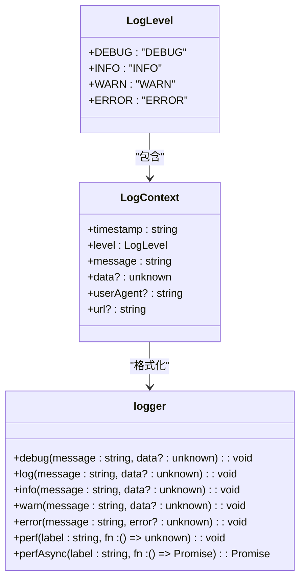
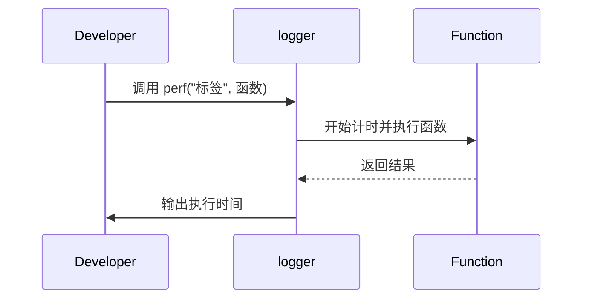

# 开发日志记录器

<cite>
**本文档引用的文件**   
- [logger.ts](file://src/utils/logger.ts)
</cite>

## 目录
1. [简介](#简介)
2. [核心功能](#核心功能)
3. [使用方法](#使用方法)
4. [性能监控](#性能监控)
5. [集成指南](#集成指南)
6. [迁移建议](#迁移建议)

## 简介
开发日志记录器是一个专为生产环境设计的日志工具，旨在提供灵活的日志输出策略。在开发环境中，日志会正常输出到控制台；而在生产环境中，日志输出会被静默处理，并可选择性地发送到监控服务。

**Section sources**
- [logger.ts](file://src/utils/logger.ts#L1-L197)

## 核心功能
日志记录器支持多种日志级别，包括调试、信息、警告和错误。每个级别都有特定的用途，确保开发者可以根据需要记录不同严重程度的信息。



**Diagram sources **
- [logger.ts](file://src/utils/logger.ts#L22-L39)

**Section sources**
- [logger.ts](file://src/utils/logger.ts#L22-L39)

## 使用方法
使用日志记录器非常简单。首先导入 `logger` 对象，然后根据需要调用相应的方法来记录日志。例如，记录一条信息日志可以这样操作：

```typescript
import { logger } from '@/utils/logger';

logger.log('用户操作', { userId: '123' });
```

对于错误日志，可以传递错误对象以便更好地追踪问题：

```typescript
logger.error('API 错误', error);
```

**Section sources**
- [logger.ts](file://src/utils/logger.ts#L117-L152)

## 性能监控
除了基本的日志记录功能外，日志记录器还提供了性能监控功能。通过 `perf` 和 `perfAsync` 方法，可以测量函数的执行时间，这对于优化应用性能非常有帮助。



**Diagram sources **
- [logger.ts](file://src/utils/logger.ts#L156-L184)

**Section sources**
- [logger.ts](file://src/utils/logger.ts#L156-L184)

## 集成指南
要将日志记录器集成到监控服务中，可以在 `sendToMonitoring` 函数中添加相应的代码。目前该函数仅在生产环境中且日志级别为错误时才会触发，可以在此处集成 Sentry、LogRocket 或自定义服务。

```typescript
function sendToMonitoring(context: LogContext): void {
  if (!isDev && context.level === LogLevel.ERROR) {
    // TODO: 集成监控服务
    // 示例：Sentry
    // if (typeof window !== 'undefined' && window.Sentry) {
    //   window.Sentry.captureException(new Error(context.message), {
    //     extra: context.data,
    //   });
    // }
  }
}
```

**Section sources**
- [logger.ts](file://src/utils/logger.ts#L71-L82)

## 迁移建议
为了更好地利用日志记录器的功能，建议逐步替换现有的 `console.log`、`console.error` 和 `console.warn` 调用。具体的迁移建议如下：

- `console.log(...)` → `logger.log('描述', data)`
- `console.error(...)` → `logger.error('错误描述', error)`
- `console.warn(...)` → `logger.warn('警告描述', data)`

这样做不仅可以统一日志格式，还能更方便地管理和分析日志信息。

**Section sources**
- [logger.ts](file://src/utils/logger.ts#L186-L193)