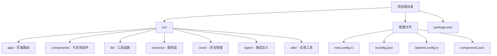
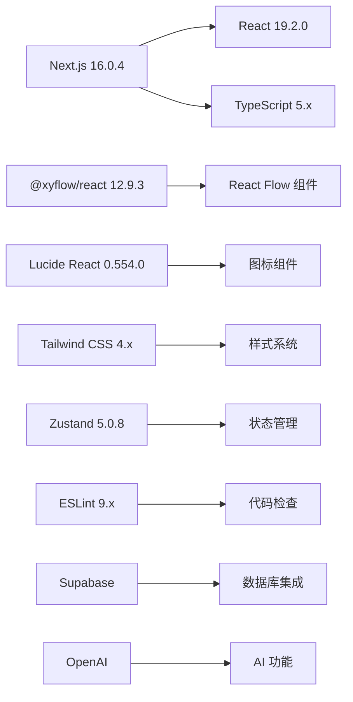
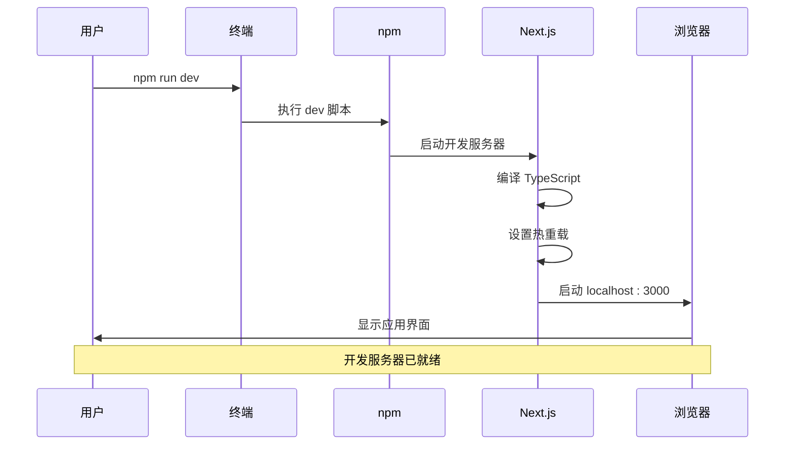
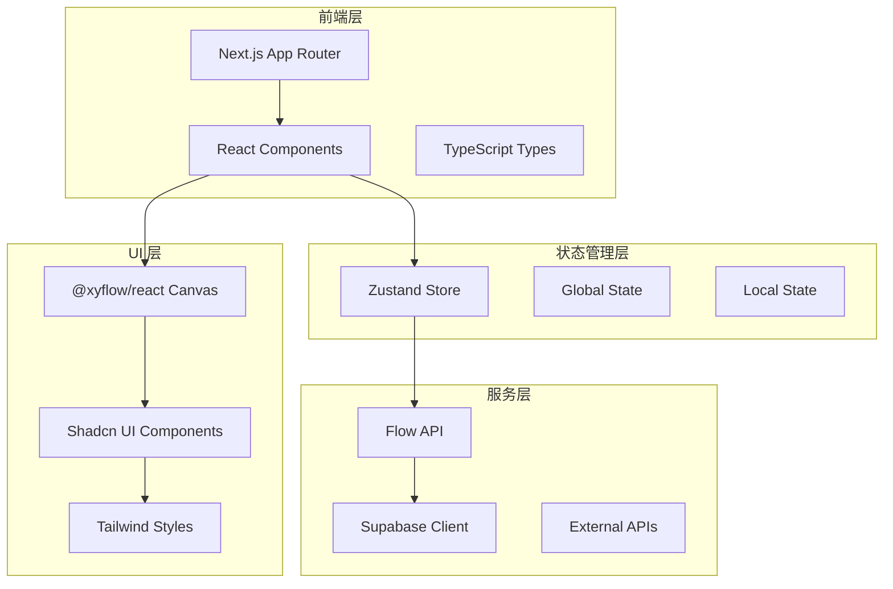
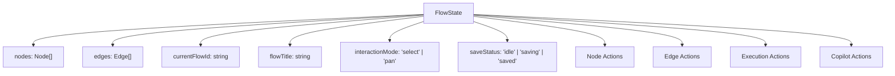
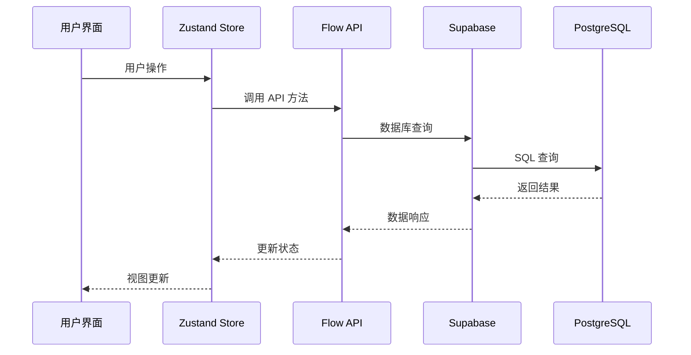

# 快速开始

<cite>
**本文档中引用的文件**
- [package.json](file://package.json)
- [README.md](file://README.md)
- [next.config.ts](file://next.config.ts)
- [tsconfig.json](file://tsconfig.json)
- [tailwind.config.ts](file://tailwind.config.ts)
- [components.json](file://components.json)
- [src/app/layout.tsx](file://src/app/layout.tsx)
- [src/app/page.tsx](file://src/app/page.tsx)
- [src/store/flowStore.ts](file://src/store/flowStore.ts)
- [src/components/flow/FlowCanvas.tsx](file://src/components/flow/FlowCanvas.tsx)
- [src/services/flowAPI.ts](file://src/services/flowAPI.ts)
- [src/lib/supabase.ts](file://src/lib/supabase.ts)
</cite>

## 目录
1. [项目简介](#项目简介)
2. [系统要求](#系统要求)
3. [项目克隆与初始化](#项目克隆与初始化)
4. [依赖安装详解](#依赖安装详解)
5. [开发服务器启动](#开发服务器启动)
6. [项目架构概览](#项目架构概览)
7. [核心技术栈解析](#核心技术栈解析)
8. [常见问题排查](#常见问题排查)
9. [下一步学习建议](#下一步学习建议)

## 项目简介

Flash Flow 是一个基于 Next.js 的可视化工作流构建平台，允许用户通过拖拽节点的方式创建自动化工作流。该项目采用现代化的前端技术栈，集成了 React 19、TypeScript、Tailwind CSS 和 Zustand 状态管理等先进技术。

### 主要特性
- **可视化工作流编辑器**：基于 @xyflow/react 的拖拽式界面
- **实时状态管理**：使用 Zustand 进行全局状态控制
- **AI 集成**：支持 LLM（大语言模型）节点
- **数据库集成**：使用 Supabase 进行数据持久化
- **响应式设计**：基于 Tailwind CSS 的现代化 UI

## 系统要求

在开始之前，请确保您的开发环境满足以下要求：

| 组件 | 最低版本 | 推荐版本 | 说明 |
|------|----------|----------|------|
| Node.js | 18.0+ | 20.0+ | JavaScript 运行时环境 |
| npm | 8.0+ | 9.0+ | 包管理工具 |
| Git | 2.20+ | 最新版本 | 版本控制系统 |

### 检查环境

在终端中运行以下命令验证环境：

```bash
node --version  # 应输出 v18.x 或更高版本
npm --version   # 应输出 8.x 或更高版本
git --version   # 应输出 2.20 或更高版本
```

## 项目克隆与初始化

### 步骤 1：克隆项目

打开终端，导航到您希望安装项目的目录，然后执行以下命令：

```bash
git clone https://github.com/your-repository/flash-flow.git
cd flash-flow
```

### 步骤 2：项目结构概览

项目采用标准的 Next.js 结构：



**图表来源**
- [package.json](file://package.json#L1-L57)
- [next.config.ts](file://next.config.ts#L1-L9)

### 步骤 3：环境准备

项目目前没有 `.env` 文件，但会检查以下环境变量：

| 变量名 | 用途 | 是否必需 |
|--------|------|----------|
| NEXT_PUBLIC_SUPABASE_URL | Supabase 项目 URL | 是 |
| NEXT_PUBLIC_SUPABASE_ANON_KEY | Supabase 匿名密钥 | 是 |

**章节来源**
- [src/lib/supabase.ts](file://src/lib/supabase.ts#L4-L8)

## 依赖安装详解

### 安装命令

在项目根目录下运行以下命令安装所有依赖：

```bash
npm install
```

### 核心依赖分析

项目的主要依赖包括：

#### 前端框架
- **Next.js 16.0.4**：React 全栈框架
- **React 19.2.0**：用户界面库
- **TypeScript 5.x**：类型安全的 JavaScript 超集

#### UI 组件库
- **@xyflow/react 12.9.3**：可视化工作流编辑器
- **Lucide React 0.554.0**：图标库
- **Tailwind CSS 4.x**：实用优先的 CSS 框架

#### 状态管理
- **Zustand 5.0.8**：轻量级状态管理库

#### 开发工具
- **ESLint 9.x**：代码质量检查
- **PostCSS**：CSS 后处理器

### 依赖关系图



**图表来源**
- [package.json](file://package.json#L11-L41)

**章节来源**
- [package.json](file://package.json#L11-L57)

## 开发服务器启动

### 启动命令

在项目根目录下运行：

```bash
npm run dev
```

### 命令详解

#### npm run dev
- **作用**：启动 Next.js 开发服务器
- **功能**：
  - 启动热重载开发服务器
  - 自动编译 TypeScript 代码
  - 提供实时错误检查
  - 支持模块热替换（HMR）

#### 其他可用命令
- `npm run build`：构建生产版本
- `npm run start`：启动生产服务器
- `npm run lint`：运行 ESLint 代码检查

### 服务器启动流程



**图表来源**
- [package.json](file://package.json#L5-L10)

### 访问应用

启动完成后，在浏览器中访问：
```
http://localhost:3000
```

### 首页界面介绍

首次访问时，您将看到 Flash Flow 的主界面：

- **标题栏**：显示 "Flash Flow" 标志
- **提示输入框**：用于输入工作流描述
- **示例按钮**：提供预设的工作流建议
- **加载动画**：在页面转换时显示

**章节来源**
- [README.md](file://README.md#L5-L17)
- [src/app/page.tsx](file://src/app/page.tsx#L1-L85)

## 项目架构概览

### 整体架构



**图表来源**
- [src/app/layout.tsx](file://src/app/layout.tsx#L1-L31)
- [src/store/flowStore.ts](file://src/store/flowStore.ts#L1-L131)

### 目录结构说明

| 目录 | 用途 | 关键文件 |
|------|------|----------|
| `/src/app` | Next.js 页面和 API 路由 | `page.tsx`, `layout.tsx` |
| `/src/components` | 可复用 React 组件 | `flow/`, `ui/`, `builder/` |
| `/src/store` | Zustand 状态管理 | `flowStore.ts`, `actions/` |
| `/src/services` | 数据服务层 | `flowAPI.ts`, `chatHistoryAPI.ts` |
| `/src/lib` | 工具函数和配置 | `supabase.ts`, `utils.ts` |
| `/src/types` | TypeScript 类型定义 | `flow.ts`, `database.ts` |

**章节来源**
- [src/app/layout.tsx](file://src/app/layout.tsx#L1-L31)
- [src/store/flowStore.ts](file://src/store/flowStore.ts#L1-L131)

## 核心技术栈解析

### Next.js 16.0.4

Next.js 是项目的全栈框架基础：

#### 特性
- **App Router**：现代路由系统
- **React Compiler**：性能优化编译器
- **TypeScript 支持**：内置类型安全
- **静态生成**：可选的静态页面生成

#### 配置特点
- 启用了 React Compiler 以获得更好的性能
- 使用了最新的 TypeScript 配置

**章节来源**
- [next.config.ts](file://next.config.ts#L1-L9)
- [tsconfig.json](file://tsconfig.json#L1-L35)

### React 19.2.0

React 19 带来了多项改进：

#### 新特性
- **并发渲染**：更好的用户体验
- **React Compiler**：自动优化
- **新的 Hooks**：增强的功能
- **改进的 TypeScript 支持**

### Zustand 状态管理

项目使用 Zustand 进行全局状态管理：

#### 核心优势
- **轻量级**：无样板代码
- **TypeScript 友好**：完整的类型支持
- **易于调试**：内置时间旅行调试
- **高性能**：最小化重新渲染

#### 状态结构


**图表来源**
- [src/store/flowStore.ts](file://src/store/flowStore.ts#L17-L131)

### @xyflow/react 可视化编辑器

@xyflow/react 提供了强大的可视化工作流编辑功能：

#### 核心功能
- **拖拽节点**：支持拖放操作
- **连接线**：智能的边连接
- **画布交互**：缩放、平移、选择
- **自定义节点**：支持多种节点类型

#### 节点类型
- **input**：输入节点
- **llm**：大语言模型节点
- **output**：输出节点
- **rag**：检索增强生成节点
- **http**：HTTP 请求节点

**章节来源**
- [src/components/flow/FlowCanvas.tsx](file://src/components/flow/FlowCanvas.tsx#L1-L82)

### Supabase 数据库集成

项目使用 Supabase 进行数据持久化：

#### 功能特性
- **实时数据库**：WebSocket 连接
- **认证系统**：用户身份验证
- **存储服务**：文件上传下载
- **边缘函数**：后端逻辑处理

#### 数据流


**图表来源**
- [src/services/flowAPI.ts](file://src/services/flowAPI.ts#L1-L240)
- [src/lib/supabase.ts](file://src/lib/supabase.ts#L1-L18)

### Tailwind CSS 4.x

Tailwind CSS 提供了现代化的样式解决方案：

#### 配置特点
- **暗色模式支持**：自动切换主题
- **自定义颜色**：项目特定的颜色方案
- **响应式设计**：移动优先的布局
- **实用类**：直接在 HTML 中使用

**章节来源**
- [tailwind.config.ts](file://tailwind.config.ts#L1-L39)
- [components.json](file://components.json#L1-L23)

## 常见问题排查

### 问题 1：端口占用

**症状**：启动时出现 "Port 3000 is already in use" 错误

**解决方案**：
```bash
# 查找占用端口的进程
lsof -i :3000

# 杀死占用进程（假设 PID 为 12345）
kill -9 12345

# 或者使用不同的端口启动
npm run dev -- -p 3001
```

### 问题 2：依赖安装失败

**症状**：`npm install` 失败或依赖不完整

**解决方案**：
```bash
# 清理缓存
npm cache clean --force

# 删除 node_modules 和 package-lock.json
rm -rf node_modules package-lock.json

# 重新安装
npm install
```

### 问题 3：环境变量缺失

**症状**：应用启动正常但功能异常（如无法保存工作流）

**解决方案**：
1. 创建 `.env.local` 文件
2. 添加必要的环境变量：

```bash
NEXT_PUBLIC_SUPABASE_URL=your_supabase_url
NEXT_PUBLIC_SUPABASE_ANON_KEY=your_anon_key
```

### 问题 4：TypeScript 类型错误

**症状**：编辑器显示类型错误或编译失败

**解决方案**：
```bash
# 检查 TypeScript 类型
npx tsc --noEmit

# 如果需要，可以清理类型缓存
rm -rf .next/types
```

### 问题 5：热重载不工作

**症状**：修改代码后页面不自动刷新

**解决方案**：
```bash
# 检查文件监听限制（Linux/MacOS）
echo fs.inotify.max_user_watches=524288 | sudo tee -a /etc/sysctl.conf
sudo sysctl -p

# 重启开发服务器
npm run dev
```

### 调试技巧

#### 启用详细日志
在 `next.config.ts` 中添加：
```typescript
reactCompiler: {
  debug: true
}
```

#### 检查网络请求
使用浏览器开发者工具的 Network 面板监控 API 请求。

#### 状态调试
在浏览器控制台中访问 Zustand store：
```javascript
window.__NEXT_DEVTOOLS_GLOBAL_HOOK__.stores
```

## 下一步学习建议

### 学习路径

1. **深入 Next.js**
   - 学习 App Router 的高级用法
   - 探索 API 路由的实现
   - 了解静态生成和增量静态再生

2. **掌握 Zustand**
   - 学习复杂状态管理模式
   - 实现中间件和插件
   - 优化性能和内存使用

3. **熟悉 @xyflow/react**
   - 学习自定义节点开发
   - 实现复杂的连接逻辑
   - 优化渲染性能

4. **数据库设计**
   - 学习 Supabase 的查询语法
   - 设计更复杂的数据模型
   - 实现数据迁移策略

### 项目贡献

如果您想为项目做出贡献：

1. **Fork 项目仓库**
2. **创建功能分支**
3. **遵循代码规范**
4. **提交 Pull Request**

### 扩展功能建议

- **添加单元测试**：使用 Jest 或 Vitest
- **实现国际化**：添加多语言支持
- **优化移动端体验**：响应式设计改进
- **添加用户认证**：完善用户系统

### 参考资源

- [Next.js 官方文档](https://nextjs.org/docs)
- [React 19 新特性](https://react.dev/blog/)
- [Zustand 文档](https://zustand-demo.pmnd.rs/)
- [@xyflow/react 文档](https://reactflow.dev/)
- [Supabase 文档](https://supabase.com/docs)

通过本指南，您应该能够在 5 分钟内完成项目的本地环境搭建并成功运行。如果遇到任何问题，请参考常见问题排查部分或查阅相关技术文档。祝您开发愉快！