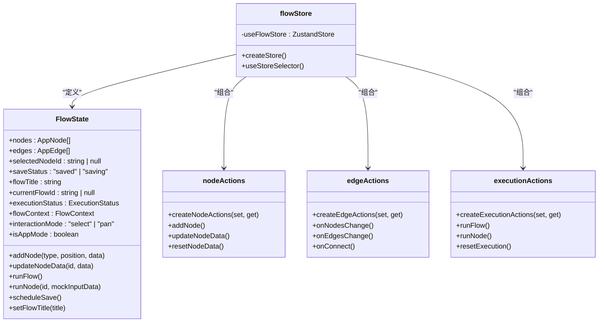
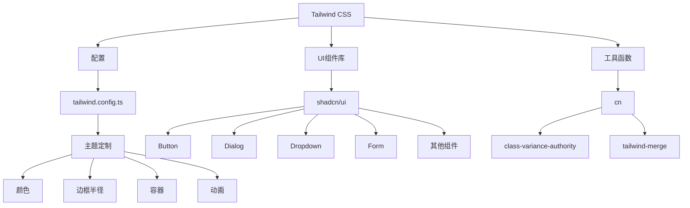
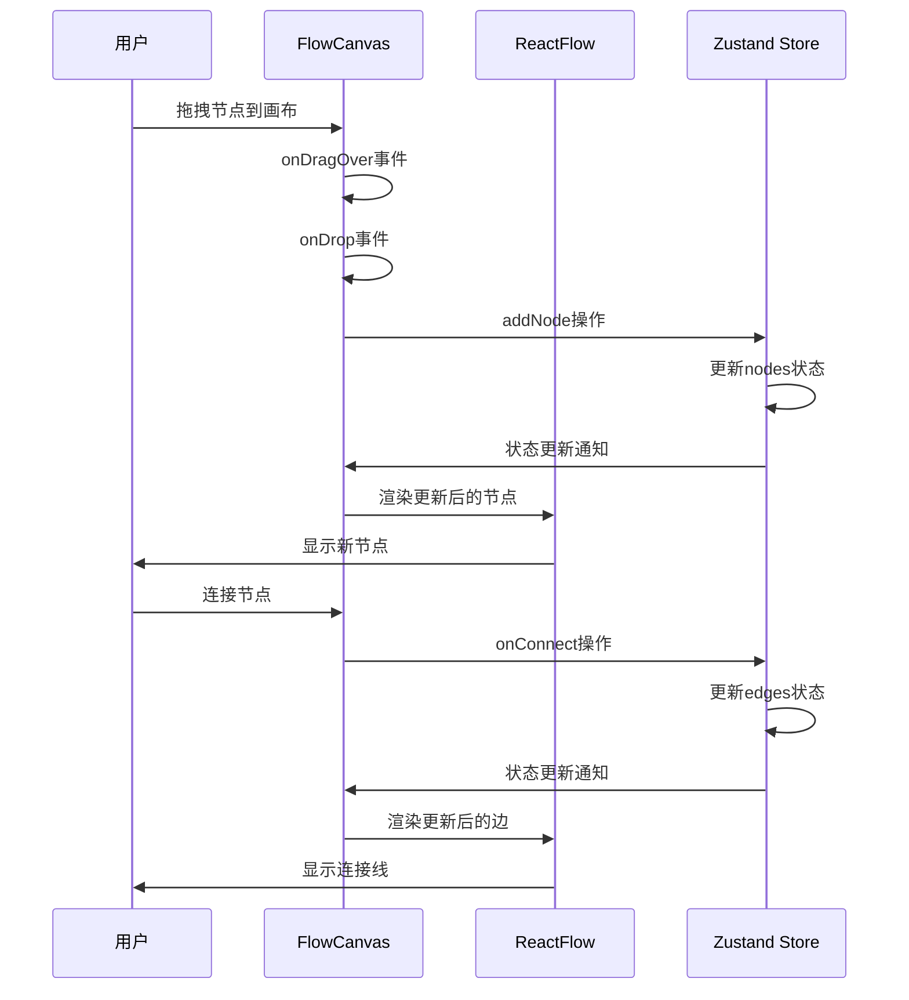
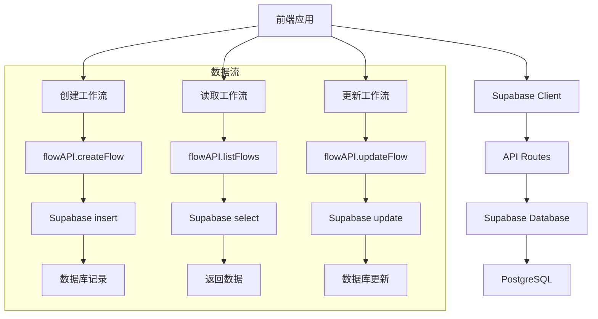
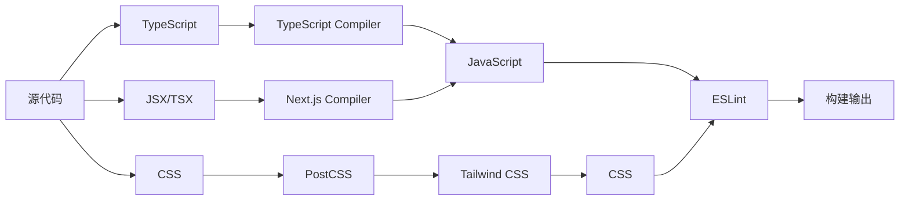

# 技术栈与依赖

<cite>
**本文档中引用的文件**  
- [package.json](file://package.json)
- [next.config.ts](file://next.config.ts)
- [tsconfig.json](file://tsconfig.json)
- [tailwind.config.ts](file://tailwind.config.ts)
- [postcss.config.mjs](file://postcss.config.mjs)
- [supabase.ts](file://src/lib/supabase.ts)
- [flowStore.ts](file://src/store/flowStore.ts)
- [layout.tsx](file://src/app/layout.tsx)
- [FlowCanvas.tsx](file://src/components/flow/FlowCanvas.tsx)
- [utils.ts](file://src/lib/utils.ts)
- [flowAPI.ts](file://src/services/flowAPI.ts)
- [flow.ts](file://src/types/flow.ts)
- [components.json](file://components.json)
- [eslint.config.mjs](file://eslint.config.mjs)
</cite>

## 目录
1. [简介](#简介)
2. [核心前端技术栈](#核心前端技术栈)
3. [状态管理](#状态管理)
4. [样式与UI组件](#样式与ui组件)
5. [可视化引擎](#可视化引擎)
6. [后端集成](#后端集成)
7. [构建与开发工具链](#构建与开发工具链)
8. [架构视图](#架构视图)
9. [升级路径与兼容性注意事项](#升级路径与兼容性注意事项)

## 简介
本项目是一个基于现代Web技术栈构建的SaaS应用，专注于工作流可视化与自动化。项目采用Next.js App Router架构，结合React 19、TypeScript等前沿技术，实现了高性能、类型安全的全栈应用。通过Zustand进行状态管理，Tailwind CSS实现响应式样式，@xyflow/react提供强大的可视化能力，并通过Supabase实现后端服务集成。该技术栈的选择旨在提供开发效率、性能和可维护性的最佳平衡。

## 核心前端技术栈

### Next.js App Router
项目采用Next.js 16.0.4版本，充分利用其App Router架构的优势。App Router提供了基于文件系统的路由机制，支持服务器端渲染（SSR）、静态生成（SSG）和增量静态再生（ISR）等多种渲染策略。通过`src/app`目录下的文件结构，实现了清晰的路由组织和嵌套路由支持。

Next.js配置中启用了React Compiler（`reactCompiler: true`），这是React 19引入的编译优化功能，能够自动优化组件渲染性能，减少不必要的重渲染，提升应用整体性能。

### React 19
项目使用React 19.2.0版本，利用其最新的特性如自动批处理、新的编译器优化和改进的Suspense机制。React 19的稳定性和性能优化为复杂的工作流可视化界面提供了坚实的基础。

### TypeScript
项目采用TypeScript 5+版本，提供了完整的类型安全保证。通过`tsconfig.json`配置，项目启用了严格模式（`"strict": true`），确保了代码的类型安全性。类型系统在`src/types/flow.ts`等文件中定义了复杂的数据结构，如工作流节点、边、状态等，有效防止了运行时类型错误。

**Section sources**
- [package.json](file://package.json#L33-L36)
- [next.config.ts](file://next.config.ts#L5)
- [tsconfig.json](file://tsconfig.json)

## 状态管理

### Zustand
项目采用Zustand作为状态管理解决方案，版本为5.0.8。Zustand以其轻量级、简单直观的API和优秀的TypeScript支持而著称。在`src/store/flowStore.ts`中，项目创建了一个全局的`useFlowStore`，集中管理工作流应用的所有状态，包括节点、边、执行状态、调试信息等。

Zustand的状态管理模式采用单一状态树，通过`create`函数创建store，并将状态和操作方法统一管理。项目还采用了模块化的设计，将不同的操作逻辑分离到`actions`目录下的不同文件中，如`nodeActions.ts`、`edgeActions.ts`等，通过扩展操作来组织store。

状态持久化通过`scheduleSave`方法实现，该方法在状态变化后延迟800毫秒自动保存到Supabase数据库，提供了良好的用户体验。



**Diagram sources**
- [flowStore.ts](file://src/store/flowStore.ts)
- [flow.ts](file://src/types/flow.ts)

**Section sources**
- [flowStore.ts](file://src/store/flowStore.ts)
- [flow.ts](file://src/types/flow.ts)

## 样式与UI组件

### Tailwind CSS
项目采用Tailwind CSS作为样式解决方案，版本为4+。通过`tailwind.config.ts`配置文件，项目自定义了主题，包括颜色、边框半径、容器样式等。配置中启用了暗色模式（`darkMode: "class"`），支持用户在不同主题间切换。

Tailwind的实用类系统与项目中的UI组件库紧密结合，提供了高度一致的视觉设计。`content`配置指定了需要扫描的文件路径，确保生成的CSS包含所有使用的类名。

### UI组件库
项目基于shadcn/ui构建了自定义的UI组件库，位于`src/components/ui`目录。通过`components.json`配置文件，项目定义了组件库的样式为"new-york"，使用TypeScript和React Server Components（RSC）。组件库使用Lucide作为图标库，并通过别名配置了路径映射。

`cn`工具函数在`src/lib/utils.ts`中定义，结合`class-variance-authority`和`tailwind-merge`，提供了条件类名合并的能力，简化了组件的样式逻辑。



**Diagram sources**
- [tailwind.config.ts](file://tailwind.config.ts)
- [utils.ts](file://src/lib/utils.ts)
- [components.json](file://components.json)

**Section sources**
- [tailwind.config.ts](file://tailwind.config.ts)
- [utils.ts](file://src/lib/utils.ts)
- [components.json](file://components.json)

## 可视化引擎

### @xyflow/react
项目采用@xyflow/react作为可视化引擎，版本为12.9.3。该库提供了强大的流程图和节点图渲染能力，完美契合工作流可视化的需求。在`src/components/flow/FlowCanvas.tsx`中，项目使用`ReactFlow`组件构建了核心的工作流画布。

`FlowCanvas`组件集成了节点拖拽、连接、选择等多种交互功能。通过`nodeTypes`配置，项目定义了不同类型的工作流节点（如input、llm、rag等），并统一使用`CustomNode`组件进行渲染。背景采用点状图案，增强了视觉效果。

项目还实现了交互模式切换（选择模式和拖拽模式），通过`interactionMode`状态控制画布的行为，提升了用户体验。



**Diagram sources**
- [FlowCanvas.tsx](file://src/components/flow/FlowCanvas.tsx)
- [flowStore.ts](file://src/store/flowStore.ts)

**Section sources**
- [FlowCanvas.tsx](file://src/components/flow/FlowCanvas.tsx)

## 后端集成

### Supabase
项目采用Supabase作为后端服务，通过`@supabase/supabase-js`（版本2.84.0）和`@supabase/ssr`（版本0.7.0）进行集成。在`src/lib/supabase.ts`中，项目创建了Supabase客户端实例，用于浏览器端的数据访问。

Supabase提供了身份验证、数据库、存储等全套后端服务。项目主要使用其PostgreSQL数据库功能，通过`flowAPI.ts`中的服务类进行数据操作。`flowAPI`封装了工作流的CRUD操作，包括创建、读取、更新、删除和自动保存等功能。

类型安全通过`@/types/database`中的类型定义实现，确保了前端与数据库模式的一致性。环境变量`NEXT_PUBLIC_SUPABASE_URL`和`NEXT_PUBLIC_SUPABASE_ANON_KEY`用于配置Supabase连接。



**Diagram sources**
- [supabase.ts](file://src/lib/supabase.ts)
- [flowAPI.ts](file://src/services/flowAPI.ts)

**Section sources**
- [supabase.ts](file://src/lib/supabase.ts)
- [flowAPI.ts](file://src/services/flowAPI.ts)

## 构建与开发工具链

### ESLint
项目采用ESLint进行代码质量检查，版本为9+。通过`eslint.config.mjs`配置文件，项目集成了`eslint-config-next`的配置，包括核心Web Vitals和TypeScript支持。配置中明确忽略了构建输出目录（如`.next/**`），避免了不必要的检查。

### PostCSS
项目使用PostCSS作为CSS处理工具，通过`postcss.config.mjs`配置文件集成了Tailwind CSS插件。这种配置方式与Next.js的默认构建流程无缝集成，确保了CSS的正确处理和优化。

### 其他开发依赖
项目包含多个开发依赖，如`@types`系列包提供了TypeScript类型定义，`framer-motion`（版本12.23.24）用于实现复杂的动画效果，`tw-animate-css`提供了预设的CSS动画类。



**Diagram sources**
- [eslint.config.mjs](file://eslint.config.mjs)
- [postcss.config.mjs](file://postcss.config.mjs)
- [package.json](file://package.json#L43-L54)

**Section sources**
- [eslint.config.mjs](file://eslint.config.mjs)
- [postcss.config.mjs](file://postcss.config.mjs)

## 架构视图
项目采用分层架构设计，从前端到后端形成了清晰的技术栈层次。Next.js作为应用框架，提供了路由、渲染和构建能力。React 19作为UI库，Zustand作为状态管理，Tailwind CSS作为样式方案，共同构成了前端技术栈。@xyflow/react提供了可视化能力，Supabase提供了后端服务。

各组件通过明确定义的接口和类型进行通信，确保了系统的可维护性和可扩展性。状态流从Zustand store流向UI组件，数据流通过Supabase API在前端和后端之间同步。

```mermaid
graph TD
subgraph "前端"
A[Next.js App Router] --> B[React 19]
B --> C[Zustand]
C --> D[Tailwind CSS]
B --> E[@xyflow/react]
B --> F[shadcn/ui]
end
subgraph "后端"
G[Supabase]
G --> H[PostgreSQL]
G --> I[Auth]
G --> J[Storage]
end
C --> K[flowAPI]
K --> G
E --> C
F --> D
A --> C
```

**Diagram sources**
- [package.json](file://package.json)
- [next.config.ts](file://next.config.ts)
- [flowStore.ts](file://src/store/flowStore.ts)
- [flowAPI.ts](file://src/services/flowAPI.ts)

## 升级路径与兼容性注意事项

### React 19迁移
项目已采用React 19，但需注意React Compiler的稳定性和兼容性。虽然`next.config.ts`中已启用`reactCompiler: true`，但在生产环境中应密切监控性能和潜在的bug。建议保持Next.js和React版本的同步更新，以获得最佳的兼容性支持。

### Zustand版本升级
当前使用Zustand 5.0.8，未来升级到更高版本时需注意API变化，特别是中间件和持久化插件的兼容性。项目中的自定义操作模式（通过扩展函数组合）在未来的版本中可能需要调整。

### @xyflow/react升级
@xyflow/react版本12.9.3相对稳定，但未来升级时需注意节点类型、边类型和事件处理API的变化。项目中自定义的`CustomNode`组件可能需要相应调整以适应新的渲染机制。

### Supabase集成
Supabase的JavaScript库版本2.84.0较为稳定，但需注意其TypeScript类型定义的准确性。项目中通过`Database`类型进行类型安全访问，当Supabase模式发生变化时，需要同步更新类型定义。

### 构建工具链
ESLint和PostCSS的配置相对稳定，但随着Next.js版本的更新，可能需要调整配置以适应新的构建流程。特别是ESLint配置从`.eslintrc`迁移到`eslint.config.mjs`是较新的变化，需确保所有团队成员使用兼容的工具版本。

**Section sources**
- [next.config.ts](file://next.config.ts)
- [package.json](file://package.json)
- [tsconfig.json](file://tsconfig.json)