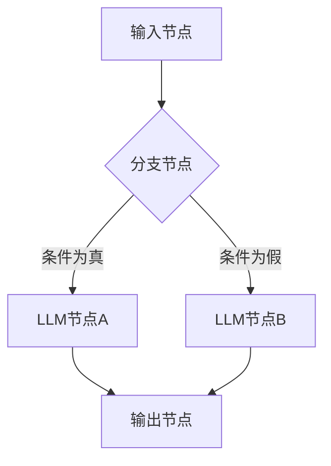
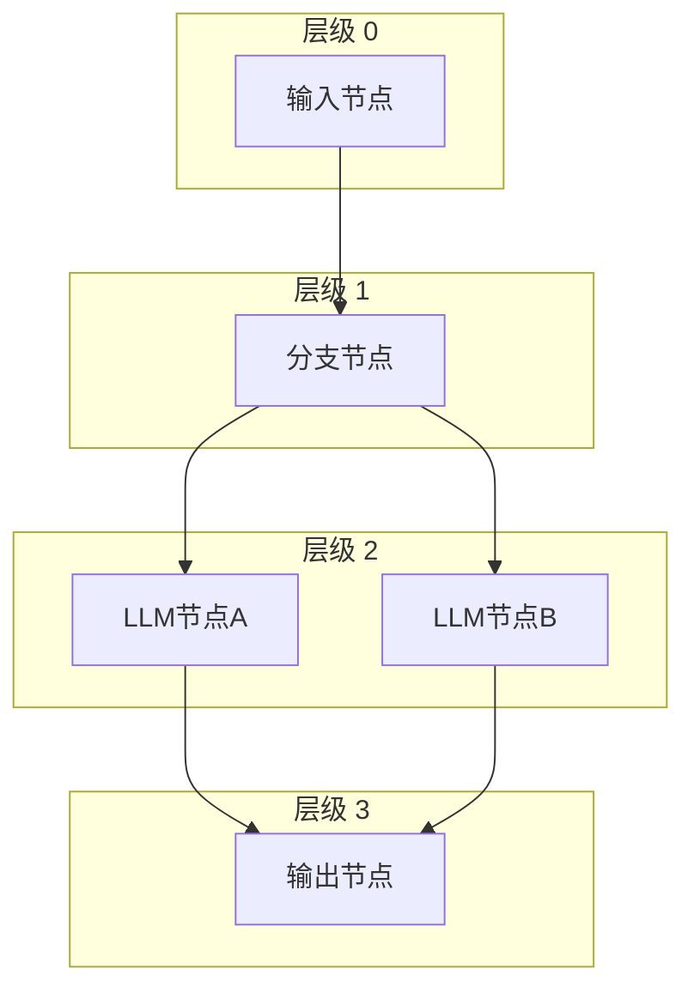
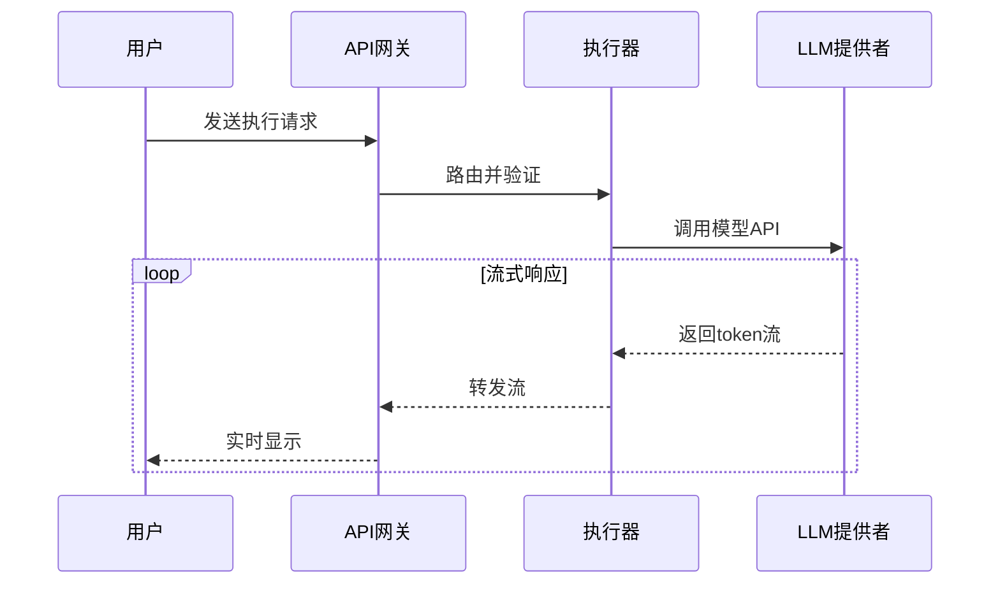

# 效率规则

<cite>
**本文档引用的文件**
- [efficiencyRules.ts](file://src/lib/prompts/efficiencyRules.ts)
- [BranchNodeExecutor.ts](file://src/store/executors/BranchNodeExecutor.ts)
- [parallelExecutionUtils.ts](file://src/store/utils/parallelExecutionUtils.ts)
- [nodeSpecs.ts](file://src/lib/prompts/nodeSpecs.ts)
- [run-node/route.ts](file://src/app/api/run-node/route.ts)
- [run-node-stream/route.ts](file://src/app/api/run-node-stream/route.ts)
</cite>

## 目录
1. [简介](#简介)
2. [效率规则详解](#效率规则详解)
3. [并行执行机制](#并行执行机制)
4. [性能与成本优化](#性能与成本优化)
5. [最佳实践与应用示例](#最佳实践与应用示例)
6. [结论](#结论)

## 简介
本项目是一个基于工作流的智能应用编排系统，支持多种节点类型（输入、LLM、RAG、工具、分支、输出）的可视化编排。系统通过严格的规则体系确保工作流的高效性、正确性和成本效益。其中，“效率规则”是指导用户构建高性能工作流的核心准则，强调避免冗余串联、优先使用并行处理、控制成本和提升反馈速度。

**Section sources**
- [efficiencyRules.ts](file://src/lib/prompts/efficiencyRules.ts)

## 效率规则详解

### 避免冗余串联
在工作流设计中，应避免将多个LLM节点进行不必要的串联（如 A -> B -> C）。这种模式不仅执行速度慢，而且成本高昂，因为每个LLM调用都会产生独立的费用和延迟。

- **错误示例**：`Input -> LLM(大纲) -> LLM(第一章) -> LLM(第二章)`。这种线性流程需要等待前一个节点完成后才能启动下一个，总耗时是各节点之和。
- **正确示例**：`Input -> Branch -> [LLM(大纲), LLM(全文)]`。通过使用Branch节点，可以将独立的任务并行化处理，显著减少总执行时间。

### 并行优先
对于多个独立且无依赖关系的任务，应优先使用Branch节点进行并行处理。并行执行可以充分利用系统资源，减少用户等待时间，提升整体效率。

### 成本敏感
遵循“如无必要，勿增实体”的原则。如果一个LLM节点能够完成的任务，就不要将其拆分成两个或多个节点。每次LLM调用都涉及API费用和计算资源，减少不必要的节点可以有效控制成本。

### 反馈速度
应尽早向用户提供结果。对于复杂的任务，可以优先输出一个概览或初步结果，避免让用户长时间等待最终的完整输出。这有助于提升用户体验和交互感。

**Section sources**
- [efficiencyRules.ts](file://src/lib/prompts/efficiencyRules.ts)

## 并行执行机制

### Branch节点执行器
`BranchNodeExecutor` 是实现并行逻辑的核心组件。它通过评估条件表达式来决定工作流的走向。该执行器支持安全的表达式求值，允许基于上游节点的输出数据进行条件判断，从而激活不同的执行路径。

**Diagram sources**
- [BranchNodeExecutor.ts](file://src/store/executors/BranchNodeExecutor.ts)

### 并行执行工具
`parallelExecutionUtils.ts` 提供了计算拓扑层级和分组节点的功能，为并行执行提供了基础支持。通过`calculateTopologicalLevels`函数，系统可以确定每个节点在工作流中的层级，从而识别出可以并行执行的节点组。

**Diagram sources**
- [parallelExecutionUtils.ts](file://src/store/utils/parallelExecutionUtils.ts)

## 性能与成本优化

### API执行优化
系统的API端点（如`run-node`和`run-node-stream`）设计为边缘函数（Edge Function），能够在靠近用户的地理位置快速响应。这些端点负责处理LLM调用的路由、认证和配额检查。

- **非流式API** (`run-node/route.ts`)：适用于需要完整响应后再返回的场景。
- **流式API** (`run-node-stream/route.ts`)：适用于需要实时流式输出的场景，可以立即向用户展示部分结果，提升感知速度。

**Diagram sources**
- [run-node/route.ts](file://src/app/api/run-node/route.ts)
- [run-node-stream/route.ts](file://src/app/api/run-node-stream/route.ts)

### 资源管理
系统通过`quotaEdge`模块在服务器端进行配额检查和计费，确保每个用户的使用量在允许范围内。这不仅防止了资源滥用，也帮助用户控制成本。

**Section sources**
- [run-node/route.ts](file://src/app/api/run-node/route.ts)
- [run-node-stream/route.ts](file://src/app/api/run-node-stream/route.ts)

## 最佳实践与应用示例

### 场景：文档分析与报告生成
假设用户需要分析一份财务报告并生成摘要和图表。

- **低效设计**：`Input -> LLM(摘要) -> LLM(分析) -> code_interpreter(图表)`。这种设计是线性的，耗时长。
- **高效设计**：`Input -> Branch -> [LLM(摘要), LLM(分析)]` 和 `Input -> code_interpreter(图表)` 并行执行，最后通过`Output`节点合并结果。这充分利用了并行处理的优势。

### 变量引用规范
在配置节点时，必须严格遵守变量引用规则。所有引用必须使用`{{节点标签.属性}}`的格式，确保前缀与节点的`label`字段完全一致，避免因引用错误导致的执行失败。

**Section sources**
- [nodeSpecs.ts](file://src/lib/prompts/nodeSpecs.ts)
- [efficiencyRules.ts](file://src/lib/prompts/efficiencyRules.ts)

## 结论
“效率规则”是本工作流系统的核心设计原则，旨在引导用户构建既高效又经济的工作流。通过避免冗余串联、优先使用并行处理、严格控制成本和提升反馈速度，用户可以创建出响应迅速、成本可控的智能应用。系统的底层执行器和工具库为这些规则的实现提供了坚实的技术支持。