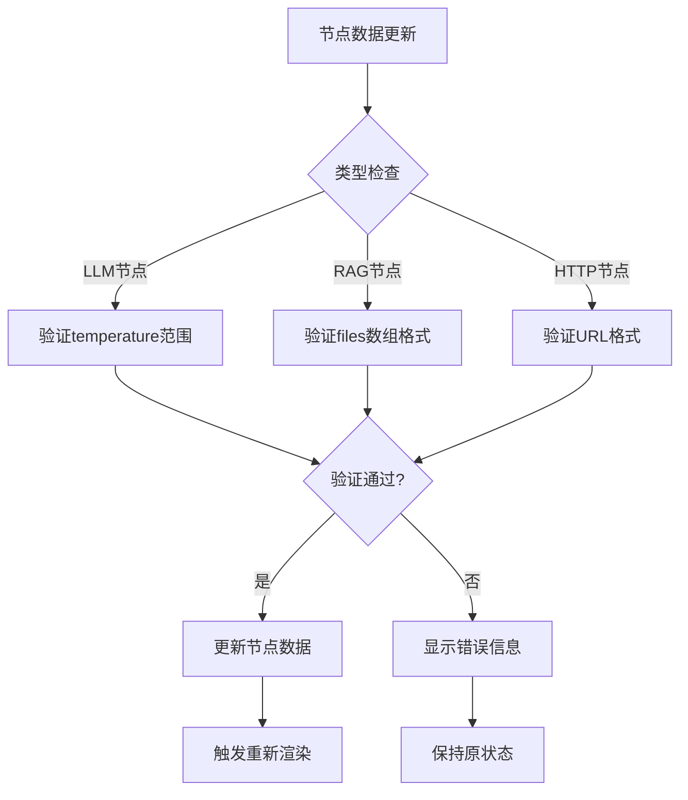
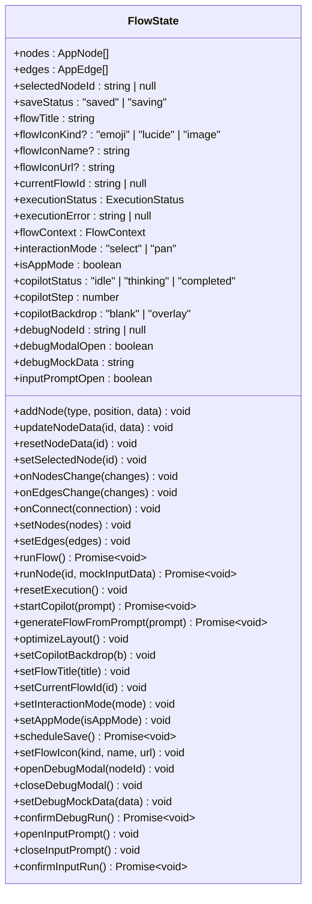
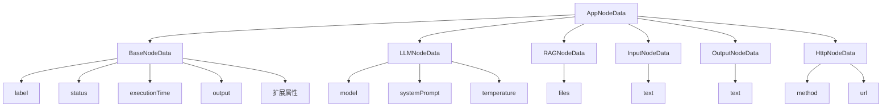
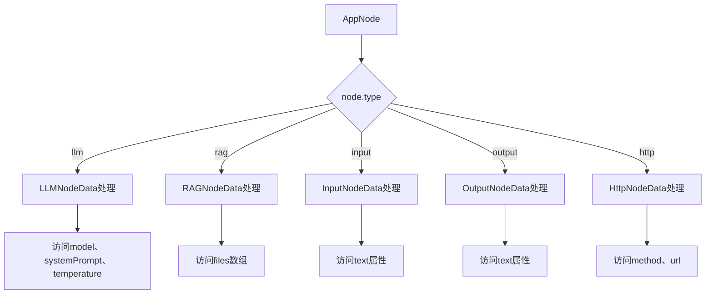
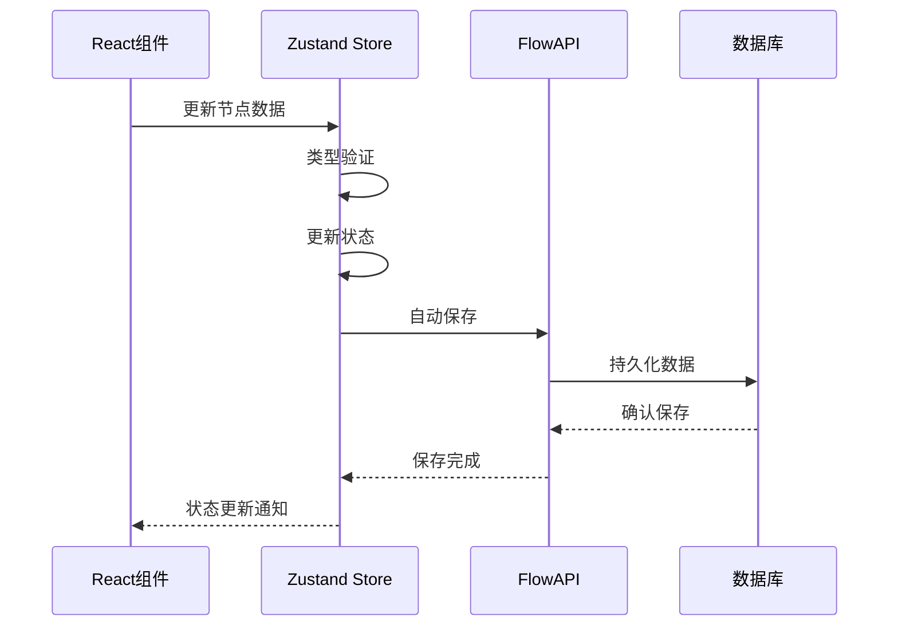
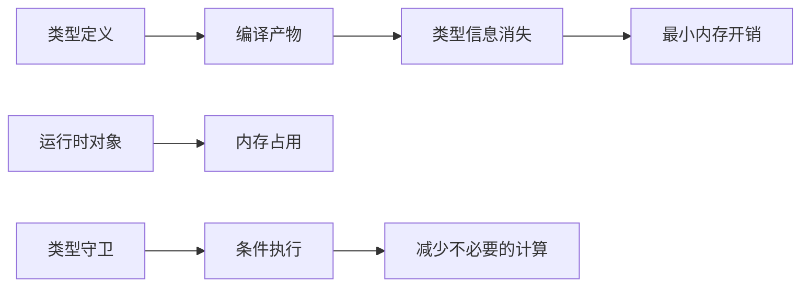

# 前端类型定义

<cite>
**本文档中引用的文件**
- [src/types/flow.ts](file://src/types/flow.ts)
- [src/store/flowStore.ts](file://src/store/flowStore.ts)
- [src/store/constants/initialState.ts](file://src/store/constants/initialState.ts)
- [src/store/actions/nodeActions.ts](file://src/store/actions/nodeActions.ts)
- [src/store/actions/executionActions.ts](file://src/store/actions/executionActions.ts)
- [src/store/actions/edgeActions.ts](file://src/store/actions/edgeActions.ts)
- [src/store/actions/copilotActions.ts](file://src/store/actions/copilotActions.ts)
- [src/store/utils/nodeDefaults.ts](file://src/store/utils/nodeDefaults.ts)
- [src/store/utils/planNormalizer.ts](file://src/store/utils/planNormalizer.ts)
- [src/store/utils/cycleDetection.ts](file://src/store/utils/cycleDetection.ts)
- [src/components/flow/CustomNode.tsx](file://src/components/flow/CustomNode.tsx)
- [src/components/flow/FlowCanvas.tsx](file://src/components/flow/FlowCanvas.tsx)
- [src/components/builder/ContextHUD.tsx](file://src/components/builder/ContextHUD.tsx)
- [src/services/flowAPI.ts](file://src/services/flowAPI.ts)
</cite>

## 目录
1. [简介](#简介)
2. [项目架构概览](#项目架构概览)
3. [核心类型系统](#核心类型系统)
4. [AppNode与AppEdge类型](#appnode与appedge类型)
5. [节点数据类型设计](#节点数据类型设计)
6. [BaseNodeData基类分析](#basenodedata基类分析)
7. [FlowState状态管理](#flowstate状态管理)
8. [类型继承关系与联合类型](#类型继承关系与联合类型)
9. [类型收窄与判别式联合](#类型收窄与判别式联合)
10. [Zustand状态仓库集成](#zustand状态仓库集成)
11. [实际应用示例](#实际应用示例)
12. [性能优化考虑](#性能优化考虑)
13. [总结](#总结)

## 简介

Flash Flow是一个基于React和TypeScript构建的可视化流程设计器，采用现代化的类型系统设计。该系统的核心是[src/types/flow.ts](file://src/types/flow.ts)文件中定义的类型体系，它与@xyflow/react库深度集成，提供了完整的类型安全保障和智能开发体验。

本文档将深入分析这个类型系统的架构设计、实现原理以及在实际项目中的应用方式，帮助开发者理解如何利用TypeScript的强大功能构建可维护的前端应用程序。

## 项目架构概览

Flash Flow的类型系统采用了分层架构设计，主要包含以下层次：

```mermaid
graph TB
subgraph "类型定义层"
A[NodeKind 枚举] --> B[BaseNodeData 基类]
B --> C[LLMNodeData]
B --> D[RAGNodeData]
B --> E[InputNodeData]
B --> F[OutputNodeData]
B --> G[HttpNodeData]
H[AppNodeData 联合类型] --> C
H --> D
H --> E
H --> F
H --> G
I[AppNode 类型] --> J[AppEdge 类型]
K[FlowData 接口] --> I
K --> J
end
subgraph "状态管理层"
L[FlowState 接口] --> M[Zustand Store]
N[FlowContext 接口] --> L
end
subgraph "集成层"
O[@xyflow/react] --> I
P[React 组件] --> I
Q[API服务] --> K
end
```

**图表来源**
- [src/types/flow.ts](file://src/types/flow.ts#L3-L63)

## 核心类型系统

### NodeKind枚举

NodeKind定义了流程图中可用的所有节点类型，这是一个基础的字符串字面量类型联合：

```typescript
export type NodeKind =
  | "input"
  | "llm"
  | "rag"
  | "output"
  | "branch"
  | "http";
```

这个枚举为每个节点类型提供了类型安全的标识符，确保在添加新节点类型时不会出现拼写错误或类型不匹配的问题。

### ExecutionStatus状态类型

ExecutionStatus定义了节点执行的各种状态，支持流程执行过程中的状态跟踪：

```typescript
export type ExecutionStatus = "idle" | "running" | "completed" | "error";
```

这种设计允许组件根据节点的不同状态显示相应的UI反馈，提升用户体验。

**章节来源**
- [src/types/flow.ts](file://src/types/flow.ts#L3-L11)

## AppNode与AppEdge类型

### AppNode类型设计

AppNode是Flow Flow类型系统的核心类型，它扩展了@xyflow/react的Node类型，并添加了必需的type字段：

```typescript
export type AppNode = Node<AppNodeData> & { type: NodeKind };
```

这个设计的关键特点：
- **类型安全**：通过Node<AppNodeData>确保数据类型正确
- **必需类型**：通过type: NodeKind确保每个节点都有明确的类型标识
- **扩展性**：可以轻松添加新的节点类型而无需修改现有代码

### AppEdge类型增强

AppEdge扩展了基本的Edge类型，增加了流程图特有的属性：

```typescript
export type AppEdge = Edge & {
  label?: string;
  animated?: boolean;
  style?: React.CSSProperties;
};
```

这些额外的属性支持：
- **标签显示**：为连接线添加描述性文本
- **动画效果**：支持连接线的动画过渡
- **样式定制**：允许自定义连接线的视觉表现

**章节来源**
- [src/types/flow.ts](file://src/types/flow.ts#L46-L51)

## 节点数据类型设计

### 具体节点数据接口

每个节点类型都有专门的数据接口，继承自BaseNodeData并添加特定属性：

#### LLMNodeData - 大语言模型节点
```typescript
export interface LLMNodeData extends BaseNodeData {
  model: string;
  systemPrompt: string;
  temperature: number;
}
```

#### RAGNodeData - 检索增强生成节点
```typescript
export interface RAGNodeData extends BaseNodeData {
  files?: { id?: string; name: string; size?: number; type?: string; url?: string }[];
}
```

#### HttpNodeData - HTTP请求节点
```typescript
export interface HttpNodeData extends BaseNodeData {
  method?: "GET" | "POST" | "PUT" | "DELETE" | "PATCH";
  url?: string;
}
```

### 类型验证机制

系统实现了运行时类型验证，确保数据完整性：



**图表来源**
- [src/store/actions/nodeActions.ts](file://src/store/actions/nodeActions.ts#L32-L58)

**章节来源**
- [src/types/flow.ts](file://src/types/flow.ts#L21-L42)

## BaseNodeData基类分析

### 基础属性设计

BaseNodeData定义了所有节点共享的基础属性，采用可选属性设计以提高灵活性：

```typescript
export interface BaseNodeData {
  label?: string;           // 节点显示名称
  status?: ExecutionStatus; // 执行状态
  executionTime?: number;   // 执行耗时（毫秒）
  output?: Record<string, unknown>; // 执行输出
  [key: string]: unknown;   // 支持扩展属性
}
```

### 设计原则

1. **最小化原则**：只包含所有节点都可能需要的基本属性
2. **可扩展性**：通过索引签名支持任意扩展属性
3. **类型安全**：使用Record<string, unknown>确保类型安全
4. **向后兼容**：新增属性不会破坏现有代码

### 属性用途分析

- **label**：用于节点的可视化显示和用户交互
- **status**：支持流程执行状态的实时反馈
- **executionTime**：提供性能监控和用户体验优化
- **output**：存储节点执行结果，支持数据传递和调试

**章节来源**
- [src/types/flow.ts](file://src/types/flow.ts#L13-L19)

## FlowState状态管理

### 完整的状态类型定义

FlowState是Zustand状态仓库的完整类型定义，包含了流程设计器的所有状态和操作：



**图表来源**
- [src/types/flow.ts](file://src/types/flow.ts#L83-L152)

### 状态分类

FlowState按功能分为多个类别：

#### 基础状态
- `nodes` 和 `edges`：流程图的基本元素
- `selectedNodeId`：当前选中的节点
- `saveStatus`：保存状态指示器

#### 流程元数据
- `flowTitle`、`flowIconKind`等：流程的基本信息

#### 执行状态
- `executionStatus`、`executionError`：流程执行状态
- `flowContext`：节点间的数据传递上下文

#### 用户界面状态
- `interactionMode`：交互模式（选择/平移）
- `isAppMode`：应用模式状态
- 各种模态框状态（debug、inputPrompt等）

#### 动作方法
状态类型还包含了所有相关的操作方法，形成了一个完整的状态管理模式。

**章节来源**
- [src/types/flow.ts](file://src/types/flow.ts#L83-L152)

## 类型继承关系与联合类型

### AppNodeData联合类型

AppNodeData是所有节点数据类型的联合类型，体现了TypeScript的联合类型强大功能：

```typescript
export type AppNodeData = BaseNodeData | LLMNodeData | RAGNodeData | InputNodeData | OutputNodeData | HttpNodeData;
```

### 类型层次结构



**图表来源**
- [src/types/flow.ts](file://src/types/flow.ts#L44-L45)

### 联合类型的优势

1. **类型安全性**：编译时就能发现类型错误
2. **代码复用**：相同的操作可以应用于所有节点类型
3. **扩展性**：添加新节点类型只需扩展联合类型
4. **智能提示**：IDE能提供准确的类型提示

**章节来源**
- [src/types/flow.ts](file://src/types/flow.ts#L44-L45)

## 类型收窄与判别式联合

### 判别式联合的应用

TypeScript的判别式联合（Discriminated Union）在节点类型处理中得到了广泛应用：



**图表来源**
- [src/store/actions/executionActions.ts](file://src/store/actions/executionActions.ts#L67-L133)

### 类型收窄技术

#### 字面量类型收窄
```typescript
if (node.type === 'llm') {
    // 在这个块中，node.data自动收窄为LLMNodeData
    const llmData = node.data as LLMNodeData;
    // 可以安全访问llmData.model、llmData.systemPrompt等属性
}
```

#### 运行时类型检查
```typescript
const incomingEdges = get().edges.filter((e: AppEdge) => e.target === nodeId);
let inputContent = "Start";
if (incomingEdges.length > 0) {
    const incomerId = incomingEdges[0].source;
    const prevOut = get().flowContext[incomerId];
    // 类型守卫确保prevOut是对象
    if (prevOut && typeof prevOut === 'object') {
        const prevObj = prevOut as Record<string, unknown>;
        // 可以安全访问prevObj的属性
    }
}
```

### 实际应用场景

#### 节点执行逻辑
在执行节点时，根据节点类型执行不同的业务逻辑：

```typescript
if (node.type === 'llm') {
    // LLM节点执行逻辑
    const llmData = node.data as LLMNodeData;
    // 调用LLM API
} else if (node.type === 'rag') {
    // RAG节点执行逻辑
    const ragData = node.data as RAGNodeData;
    // 处理检索逻辑
}
```

#### 数据验证
在更新节点数据时进行类型验证：

```typescript
if (node.type === 'llm' && 'temperature' in data) {
    const temp = data.temperature as number;
    if (typeof temp === 'number' && (temp < 0 || temp > 1)) {
        console.error('Invalid temperature: must be between 0 and 1');
        return;
    }
}
```

**章节来源**
- [src/store/actions/executionActions.ts](file://src/store/actions/executionActions.ts#L67-L133)
- [src/store/actions/nodeActions.ts](file://src/store/actions/nodeActions.ts#L32-L58)

## Zustand状态仓库集成

### Store初始化与类型绑定

Zustand Store通过FlowState类型确保状态的类型安全：

```typescript
export const useFlowStore = create<FlowState>((set, get) => ({
    // 状态初始化
    ...INITIAL_FLOW_STATE,
    
    // 动作方法
    ...createNodeActions(set, get),
    ...createEdgeActions(set, get),
    ...createExecutionActions(set, get),
    ...createCopilotActions(set, get),
    
    // 简单状态设置器
    setFlowTitle: (title: string) => {
        set({ flowTitle: title, saveStatus: "saving" });
        get().scheduleSave();
    },
    
    // 其他动作...
}));
```

### 状态同步机制



**图表来源**
- [src/store/flowStore.ts](file://src/store/flowStore.ts#L17-L127)

### 类型安全的Action设计

每个Action都经过精心设计以确保类型安全：

#### 节点操作Action
```typescript
addNode: (type: NodeKind, position: { x: number; y: number }, data?: Partial<AppNodeData>) => void;
updateNodeData: (id: string, data: Partial<AppNodeData>) => void;
resetNodeData: (id: string) => void;
```

#### 执行Action
```typescript
runFlow: () => Promise<void>;
runNode: (id: string, mockInputData?: Record<string, unknown>) => Promise<void>;
resetExecution: () => void;
```

#### Copilot Action
```typescript
startCopilot: (prompt: string) => Promise<void>;
generateFlowFromPrompt: (prompt: string) => Promise<void>;
optimizeLayout: () => void;
```

**章节来源**
- [src/store/flowStore.ts](file://src/store/flowStore.ts#L17-L127)

## 实际应用示例

### ContextHUD组件中的类型使用

ContextHUD是节点属性编辑面板的核心组件，展示了类型系统的实际应用：

#### 条件渲染逻辑
```typescript
{type === "llm" && (
    <>
        <FormField control={form.control} name="model" render={({ field }) => (
            <FormItem>
                <FormLabel className="text-[10px] font-bold uppercase tracking-wider text-gray-400">模型</FormLabel>
                <Select onValueChange={field.onChange} defaultValue={field.value}>
                    <FormControl>
                        <SelectTrigger className="bg-white/50">
                            <SelectValue placeholder="选择模型" />
                        </SelectTrigger>
                    </FormControl>
                    <SelectContent>
                        <SelectItem value="doubao-seed-1-6-flash-250828">豆包-1-6-flash</SelectItem>
                    </SelectContent>
                </Select>
                <FormMessage />
            </FormItem>
        )} />
        {/* 温度和系统提示词字段 */}
    </>
)}

{type === "input" && (
    <FormField control={form.control} name="text" render={({ field }) => (
        <FormItem>
            <FormLabel className="text-[10px] font-bold uppercase tracking-wider text-gray-400">用户输入的文本内容</FormLabel>
            <FormControl>
                <Textarea {...field} placeholder="输入文本…" className="min-h-[100px] bg-white/50" />
            </FormControl>
            <FormMessage />
        </FormItem>
    )} />
)}
```

#### 类型守卫的使用
```typescript
useEffect(() => {
    if (selectedNode) {
        const type = selectedNode.type as NodeKind;
        const d = selectedNode.data || {};
        const has = (k: string) => k in d;
        form.reset({
            label: String(d.label || ""),
            model: type === "llm" && has("model") ? String((d as { model?: string }).model || "doubao-seed-1-6-flash-250828") : "doubao-seed-1-6-flash-250828",
            temperature: type === "llm" && has("temperature") ? Number((d as { temperature?: number }).temperature ?? 0.7) : 0.7,
            systemPrompt: type === "llm" && has("systemPrompt") ? String((d as { systemPrompt?: string }).systemPrompt || "") : "",
            text: (type === "input" || type === "output") && has("text") ? String((d as { text?: string }).text || "") : "",
            method: type === "http" && has("method") ? ((d as { method?: "GET" | "POST" | "PUT" | "DELETE" | "PATCH" }).method || "GET") : "GET",
            url: type === "http" && has("url") ? String((d as { url?: string }).url || "") : "",
        });
    }
}, [selectedNode, form]);
```

### CustomNode组件中的类型处理

CustomNode组件展示了如何在React组件中安全地访问节点数据：

```typescript
const CustomNode = ({ id, data, type, selected }: NodeProps) => {
    // 类型断言，确保类型安全
    const llm = data as LLMNodeData;
    const http = data as HttpNodeData;
    const rag = data as RAGNodeData;
    const input = data as InputNodeData;
    const status = (data.status as ExecutionStatus) || "idle";
    const executionTime = data.executionTime as number | undefined;
    
    // 根据节点类型渲染不同的内容
    const meta = (() => {
        if (type === "llm") {
            return (
                <div className="text-xs text-gray-500">
                    <span>{llm.model}</span><br/>
                    <span>{llm.temperature.toFixed(1)}</span>
                </div>
            );
        }
        if (type === "rag") {
            const files = rag?.files || [];
            return <span className="text-xs text-gray-500">已上传文件：{files.length}</span>;
        }
        if (type === "input") {
            const txt = input?.text || "无输入";
            return <div className="text-xs text-gray-500 whitespace-pre-wrap break-words">{txt}</div>;
        }
        return null;
    })();
    
    // 执行节点的处理逻辑
    const handleTestNode = () => {
        const incomingEdges = edges.filter(e => e.target === id);
        
        if (incomingEdges.length > 0) {
            const upstreamData = incomingEdges.map(e => flowContext[e.source]);
            const hasMissingData = upstreamData.some(d => !d || (typeof d === 'object' && Object.keys(d).length === 0));
            
            if (hasMissingData) {
                openDebugModal(id as string);
            } else {
                runNode(id as string);
            }
        } else {
            runNode(id as string);
        }
    };
    
    return /* 节点渲染逻辑 */;
};
```

### 执行引擎中的类型应用

执行引擎展示了复杂场景下的类型使用：

```typescript
const executeNode = async (nodeId: string) => {
    const node = get().nodes.find((n: AppNode) => n.id === nodeId);
    if (!node) return;
    
    // 更新节点状态为运行中
    set((state: any) => ({
        nodes: state.nodes.map((n: AppNode) =>
            n.id === nodeId ? { ...n, data: { ...n.data, status: "running" } } : n
        )
    }));
    
    // 根据节点类型执行不同的逻辑
    let output: Record<string, unknown> = {};
    
    if (node.type === 'input') {
        const inputData = node.data as InputNodeData;
        output = { query: inputData.text || "默认查询", timestamp: new Date().toISOString() };
    } else if (node.type === 'llm') {
        try {
            const incomingEdges = get().edges.filter((e: AppEdge) => e.target === nodeId);
            let inputContent = "Start";
            if (incomingEdges.length > 0) {
                const incomerId = incomingEdges[0].source;
                const prevOut = get().flowContext[incomerId];
                if (prevOut && typeof prevOut === 'object') {
                    const prevObj = prevOut as Record<string, unknown>;
                    inputContent =
                        (typeof prevObj.text === 'string' ? prevObj.text : '') ||
                        (typeof prevObj.response === 'string' ? prevObj.response : '') ||
                        JSON.stringify(prevOut);
                }
            }
            
            const llmData = node.data as LLMNodeData;
            const resp = await fetch("/api/run-node", {
                method: "POST",
                headers: { "Content-Type": "application/json" },
                body: JSON.stringify({
                    model: llmData.model || "doubao-seed-1-6-flash-250828",
                    systemPrompt: llmData.systemPrompt || "你是AI助手",
                    temperature: llmData.temperature ?? 0.7,
                    input: inputContent
                }),
            });
            const resData = await resp.json();
            output = { response: resData.response || resData.error };
        } catch (e) {
            output = { error: String(e) };
        }
    }
    
    // 更新上下文和状态
    context[nodeId] = output;
    set({ flowContext: { ...context } });
    
    set((state: any) => ({
        nodes: state.nodes.map((n: AppNode) => n.id === nodeId ? {
            ...n,
            data: {
                ...n.data,
                status: "completed",
                executionTime: endTime - startTime,
                output: output,
                ...(n.type === 'output' && outputText ? { text: outputText } : {})
            }
        } : n)
    }));
};
```

**章节来源**
- [src/components/builder/ContextHUD.tsx](file://src/components/builder/ContextHUD.tsx#L58-L72)
- [src/components/flow/CustomNode.tsx](file://src/components/flow/CustomNode.tsx#L27-L105)
- [src/store/actions/executionActions.ts](file://src/store/actions/executionActions.ts#L49-L170)

## 性能优化考虑

### 类型系统的性能影响

1. **编译时优化**：TypeScript在编译时进行类型检查，不会影响运行时性能
2. **类型擦除**：编译后的JavaScript不包含类型信息，避免运行时开销
3. **智能缓存**：TypeScript编译器会缓存类型检查结果，提高开发效率

### 内存使用优化



### 渲染性能优化

1. **React.memo使用**：在CustomNode中使用React.memo防止不必要的重渲染
2. **状态分割**：将不同类型的状态分离，避免全局状态变化导致的重渲染
3. **类型收窄**：在条件语句中使用类型收窄，减少运行时类型检查

### 开发体验优化

1. **智能提示**：完整的类型定义提供精确的IDE提示
2. **重构安全**：类型系统确保重构时不会引入类型错误
3. **文档生成**：类型定义本身就是良好的API文档

## 总结

Flash Flow的类型系统设计体现了现代TypeScript应用的最佳实践：

### 核心优势

1. **类型安全**：通过严格的类型定义防止运行时错误
2. **开发效率**：智能提示和类型检查提高开发速度
3. **可维护性**：清晰的类型层次结构便于代码维护
4. **扩展性**：灵活的联合类型支持新节点类型的添加
5. **性能友好**：编译时类型检查不影响运行时性能

### 设计亮点

- **判别式联合**的应用使得复杂的类型处理变得简单直观
- **BaseNodeData基类**提供了统一的节点属性接口
- **Zustand集成**展示了现代状态管理的最佳实践
- **组件级类型安全**确保了UI层的可靠性

### 应用价值

这套类型系统不仅保证了代码的质量和稳定性，更重要的是为团队协作和长期维护奠定了坚实的基础。通过合理的类型设计，开发者可以专注于业务逻辑的实现，而不必担心类型相关的错误。

对于希望学习现代TypeScript应用开发的开发者来说，Flash Flow的类型系统设计是一个优秀的参考案例，展示了如何在复杂的前端应用中有效地使用TypeScript的强大功能。