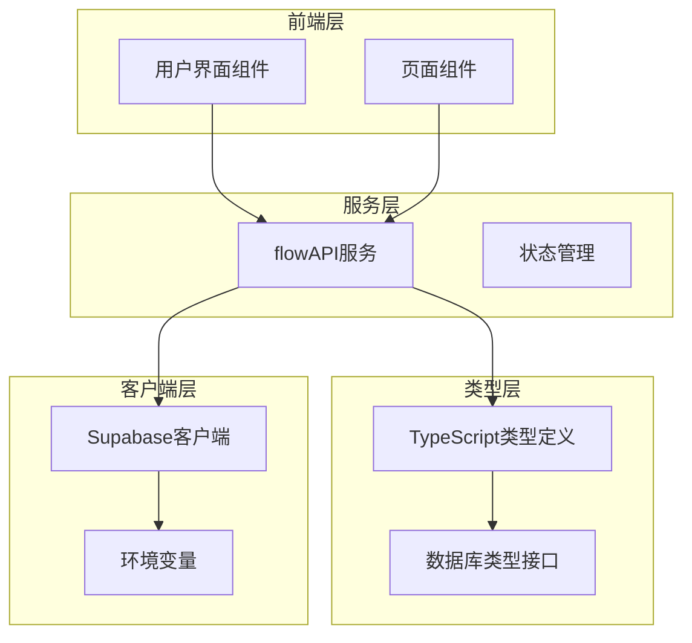
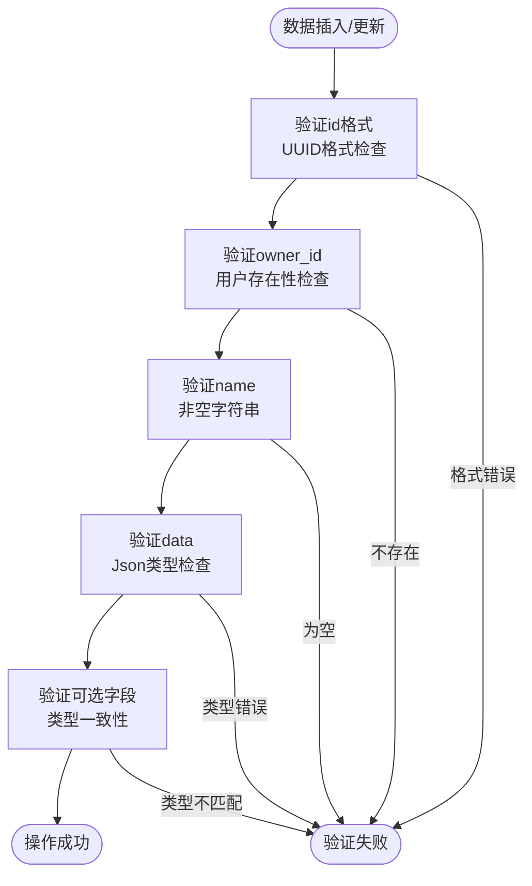
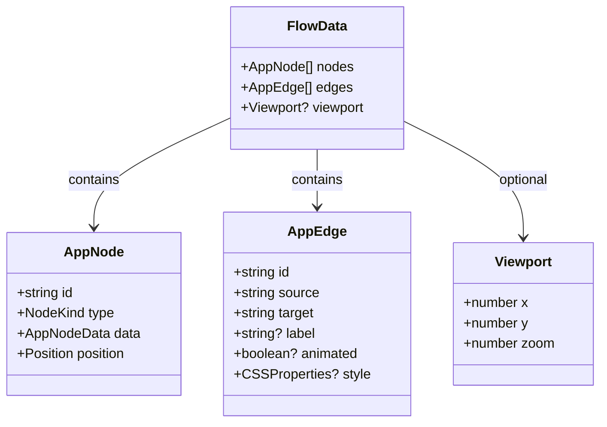
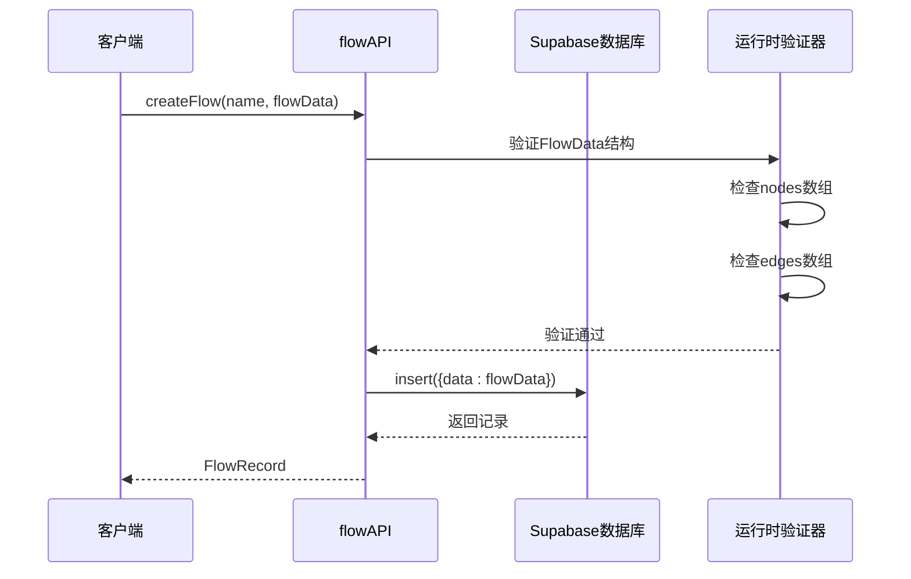
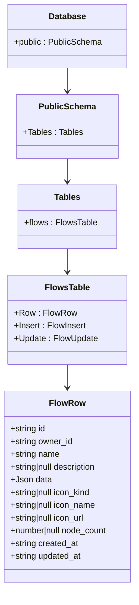
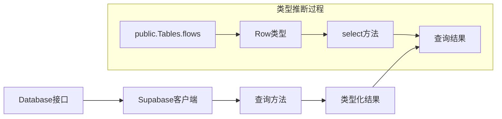
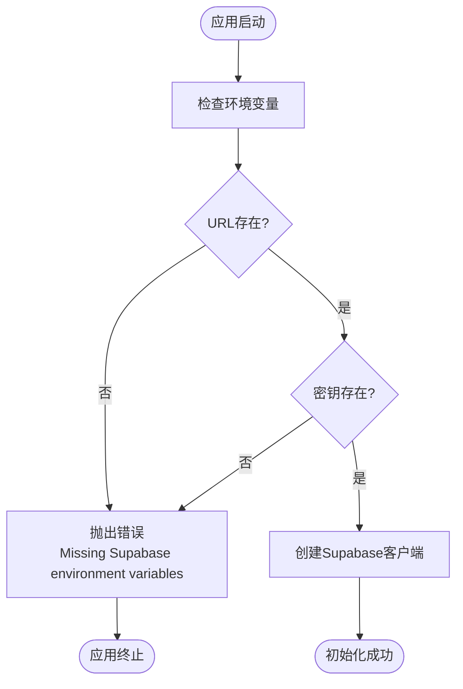

# 数据库模式

<cite>
**本文档中引用的文件**
- [database.ts](file://src/types/database.ts)
- [flow.ts](file://src/types/flow.ts)
- [supabase.ts](file://src/lib/supabase.ts)
- [flowAPI.ts](file://src/services/flowAPI.ts)
- [health/route.ts](file://src/app/api/health/route.ts)
- [flows/page.tsx](file://src/app/flows/page.tsx)
- [FlowCard.tsx](file://src/components/flows/FlowCard.tsx)
</cite>

## 目录
1. [简介](#简介)
2. [项目结构概览](#项目结构概览)
3. [flows表结构详解](#flowstable结构详解)
4. [TypeScript类型映射](#typescript类型映射)
5. [Json类型别名设计](#jsontype别名设计)
6. [Database接口层次结构](#database接口层次结构)
7. [类型安全的数据库查询](#类型安全的数据库查询)
8. [环境变量配置](#环境变量配置)
9. [数据库查询代码示例](#数据库查询代码示例)
10. [最佳实践与故障排除](#最佳实践与故障排除)

## 简介

本文档深入分析了Supabase数据库中flows表的结构设计及其在TypeScript中的完整类型映射体系。该系统采用强类型设计，通过精心构建的类型层次结构确保数据库操作的类型安全性，同时支持复杂的流程数据存储和管理。

## 项目结构概览

项目采用分层架构设计，主要包含以下核心模块：



**图表来源**
- [flowAPI.ts](file://src/services/flowAPI.ts#L1-L240)
- [supabase.ts](file://src/lib/supabase.ts#L1-L18)

## flows表结构详解

### 核心字段分析

flows表是整个应用的核心数据表，存储着所有用户的工作流信息。以下是各字段的详细说明：

| 字段名 | 类型 | 约束 | 语义描述 |
|--------|------|------|----------|
| `id` | `string` | 主键，必填 | 流程唯一标识符，UUID格式 |
| `owner_id` | `string` | 必填 | 所有者标识符，关联用户系统 |
| `name` | `string` | 必填 | 流程名称，显示用标题 |
| `description` | `string \| null` | 可选 | 流程描述信息 |
| `data` | `Json` | 必填 | 复杂流程数据，JSON格式存储 |
| `icon_kind` | `string \| null` | 可选 | 图标类型：emoji、lucide、image |
| `icon_name` | `string \| null` | 可选 | 图标名称或字符内容 |
| `icon_url` | `string \| null` | 可选 | 图标图片URL地址 |
| `node_count` | `number \| null` | 可选 | 节点数量统计 |
| `created_at` | `string` | 自动设置 | 记录创建时间戳 |
| `updated_at` | `string` | 自动更新 | 记录最后修改时间戳 |

### 字段约束与验证



**图表来源**
- [database.ts](file://src/types/database.ts#L13-L25)
- [flowAPI.ts](file://src/services/flowAPI.ts#L107-L142)

**章节来源**
- [database.ts](file://src/types/database.ts#L13-L25)
- [flowAPI.ts](file://src/services/flowAPI.ts#L107-L142)

## TypeScript类型映射

### Json类型别名

项目定义了一个递归的Json类型别名，用于处理复杂的嵌套JSON数据结构：

```typescript
export type Json =
    | string
    | number
    | boolean
    | null
    | { [key: string]: Json | undefined }
    | Json[]
```

这种设计具有以下特点：
- 支持基本数据类型（string、number、boolean、null）
- 允许对象类型的递归定义
- 支持数组类型的递归定义
- 包含undefined类型的可选属性支持

### FlowData类型结构

FlowData是存储在flows表data字段中的复杂数据结构：



**图表来源**
- [flow.ts](file://src/types/flow.ts#L59-L63)
- [flow.ts](file://src/types/flow.ts#L45-L51)

**章节来源**
- [database.ts](file://src/types/database.ts#L1-L8)
- [flow.ts](file://src/types/flow.ts#L59-L63)

## Json类型别名设计

### 设计目的

Json类型别名的设计旨在解决以下问题：

1. **类型安全性**：确保数据库中存储的数据符合预期的JSON结构
2. **递归支持**：允许嵌套的对象和数组结构
3. **灵活性**：支持可选属性和null值
4. **性能优化**：避免运行时类型检查开销

### 应用场景

在flows表中，Json类型主要用于存储复杂的流程数据：



**图表来源**
- [flowAPI.ts](file://src/services/flowAPI.ts#L37-L54)
- [flowAPI.ts](file://src/services/flowAPI.ts#L119-L120)

**章节来源**
- [database.ts](file://src/types/database.ts#L1-L8)
- [flowAPI.ts](file://src/services/flowAPI.ts#L37-L54)

## Database接口层次结构

### Tables.flows.Row类型

Tables.flows.Row类型精确映射数据库的实际字段结构：



**图表来源**
- [database.ts](file://src/types/database.ts#L9-L58)

### Insert和Update类型的差异

Insert和Update类型实现了精确的字段可选性控制：

| 特性 | Insert类型 | Update类型 |
|------|------------|------------|
| `id` | 可选（自动生成） | 可选（可更新） |
| `owner_id` | 必填 | 可选 |
| `name` | 必填 | 可选 |
| `description` | 可选 | 可选 |
| `data` | 必填 | 可选 |
| `icon_*` | 可选 | 可选 |
| `node_count` | 可选 | 可选 |
| `created_at` | 自动设置 | 不可更新 |
| `updated_at` | 自动更新 | 自动更新 |

**章节来源**
- [database.ts](file://src/types/database.ts#L13-L54)

## 类型安全的数据库查询

### createClient<Database>泛型

Supabase客户端通过泛型参数启用完整的类型安全：

```typescript
// 类型安全的客户端创建
export const supabase = createClient<Database>(url, anon);

// 查询结果自动获得类型提示
const { data, error } = await supabase
    .from('flows')
    .select('*')
    .order('updated_at', { ascending: false });
```

### 类型推断机制



**图表来源**
- [supabase.ts](file://src/lib/supabase.ts#L12)
- [flowAPI.ts](file://src/services/flowAPI.ts#L14-L17)

**章节来源**
- [supabase.ts](file://src/lib/supabase.ts#L12)
- [flowAPI.ts](file://src/services/flowAPI.ts#L14-L17)

## 环境变量配置

### 必需的环境变量

项目依赖以下环境变量进行数据库连接：

| 变量名 | 描述 | 示例值 |
|--------|------|--------|
| `NEXT_PUBLIC_SUPABASE_URL` | Supabase项目URL | `https://your-project.supabase.co` |
| `NEXT_PUBLIC_SUPABASE_ANON_KEY` | 匿名访问密钥 | `eyJhbGciOiJIUzI1NiIs...` |

### 配置验证

系统提供了环境变量验证机制：



**图表来源**
- [supabase.ts](file://src/lib/supabase.ts#L7-L9)

### getSupabaseClient函数

服务器端使用模式：

```typescript
// 服务器端客户端获取
export function getSupabaseClient() {
    return supabase;
}

// 在API路由中使用
export async function GET() {
    const { data, error } = await getSupabaseClient()
        .from("flows")
        .select("id")
        .limit(1);
}
```

**章节来源**
- [supabase.ts](file://src/lib/supabase.ts#L4-L17)
- [health/route.ts](file://src/app/api/health/route.ts#L4-L5)

## 数据库查询代码示例

### 基本CRUD操作

#### 创建流程

```typescript
// 类型安全的创建操作
const newFlow = await flowAPI.createFlow(
    "数据分析流程",           // name: string
    { nodes: [], edges: [] }, // flowData: FlowData
    "user123",               // ownerId: string
    "处理CSV数据集"          // description?: string
);
```

#### 查询流程列表

```typescript
// 类型安全的查询操作
const flows = await flowAPI.listFlows("user123");

// 查询结果自动获得类型提示
flows.forEach(flow => {
    console.log(flow.name);           // string类型
    console.log(flow.node_count);     // number | null类型
    console.log(flow.data.nodes);     // AppNode[]类型
});
```

#### 更新流程

```typescript
// 类型安全的部分更新
const updatedFlow = await flowAPI.updateFlow(flowId, {
    name: "更新后的流程名称",
    description: "新的描述信息",
    data: { nodes: [...], edges: [...] },
    icon_kind: "emoji",
    icon_name: "🚀"
});
```

### 高级查询模式

#### 条件查询

```typescript
// 使用条件查询
const query = supabase
    .from('flows')
    .select('*')
    .eq('owner_id', userId)
    .ilike('name', `%${searchTerm}%`)
    .order('updated_at', { ascending: false });

const { data, error } = await query;
```

#### 聚合查询

```typescript
// 统计用户流程数量
const { count, error } = await supabase
    .from('flows')
    .select('*', { count: 'exact' })
    .eq('owner_id', userId);
```

**章节来源**
- [flowAPI.ts](file://src/services/flowAPI.ts#L107-L239)
- [flows/page.tsx](file://src/app/flows/page.tsx#L23-L49)

## 最佳实践与故障排除

### 类型安全最佳实践

1. **始终使用泛型参数**：创建客户端时指定Database类型
2. **利用类型推断**：让TypeScript自动推断查询结果类型
3. **运行时验证**：对复杂数据结构进行运行时验证
4. **错误处理**：妥善处理数据库操作中的错误

### 常见问题与解决方案

#### 类型不匹配问题

```typescript
// 错误：类型不匹配
const result = await supabase.from('flows').select('invalid_field');

// 正确：使用正确的字段名
const result = await supabase.from('flows').select('name, description');
```

#### Json类型转换问题

```typescript
// 错误：类型转换不当
const data = { nodes: [], edges: [] };
const result = await supabase.from('flows').insert({ data });

// 正确：使用类型断言
const result = await supabase.from('flows').insert({
    data: data as unknown as Record<string, unknown>
});
```

### 性能优化建议

1. **选择性查询**：只查询需要的字段
2. **索引优化**：为常用查询字段建立索引
3. **批量操作**：使用批量插入和更新
4. **缓存策略**：合理使用客户端缓存

### 监控与调试

```typescript
// 健康检查端点
export async function GET() {
    const { data, error } = await supabase.from("flows").select("id").limit(1);
    
    return NextResponse.json({
        connected: error === null,
        table_ok: Array.isArray(data),
        error: error?.message
    });
}
```

**章节来源**
- [health/route.ts](file://src/app/api/health/route.ts#L29-L42)
- [flowAPI.ts](file://src/services/flowAPI.ts#L37-L54)

## 结论

该Supabase数据库模式通过精心设计的TypeScript类型系统，实现了完整的类型安全保障。flows表作为核心数据结构，支持复杂的工作流数据存储，同时保持了良好的扩展性和维护性。通过合理的类型映射和运行时验证，系统能够在编译时捕获大部分类型错误，大大降低了运行时错误的风险。

这种设计模式为现代Web应用提供了可参考的最佳实践，特别是在处理复杂数据结构和保证类型安全方面。开发者可以基于此模式构建更加健壮和可维护的应用程序。