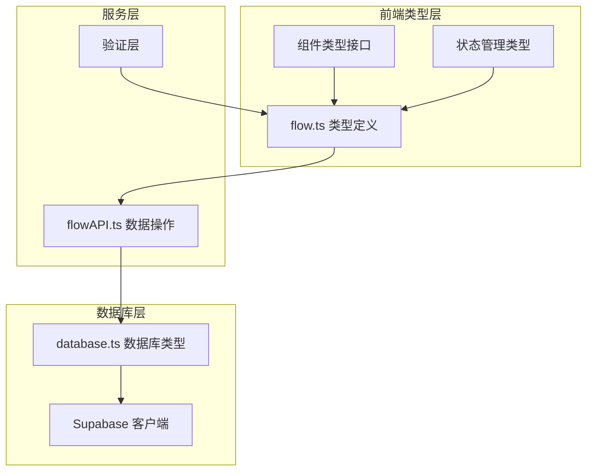
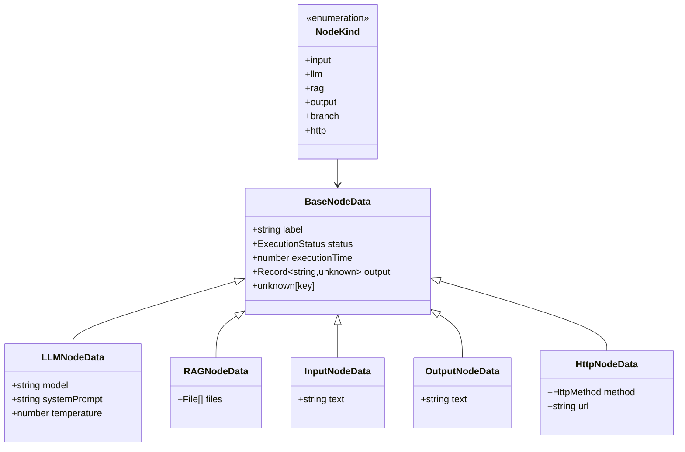
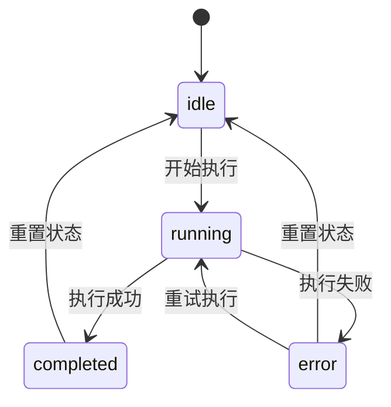
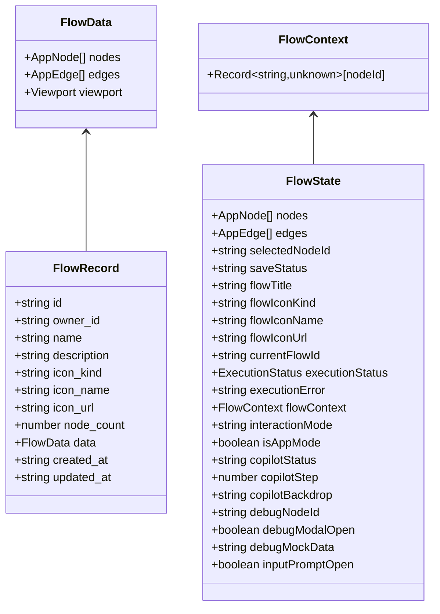
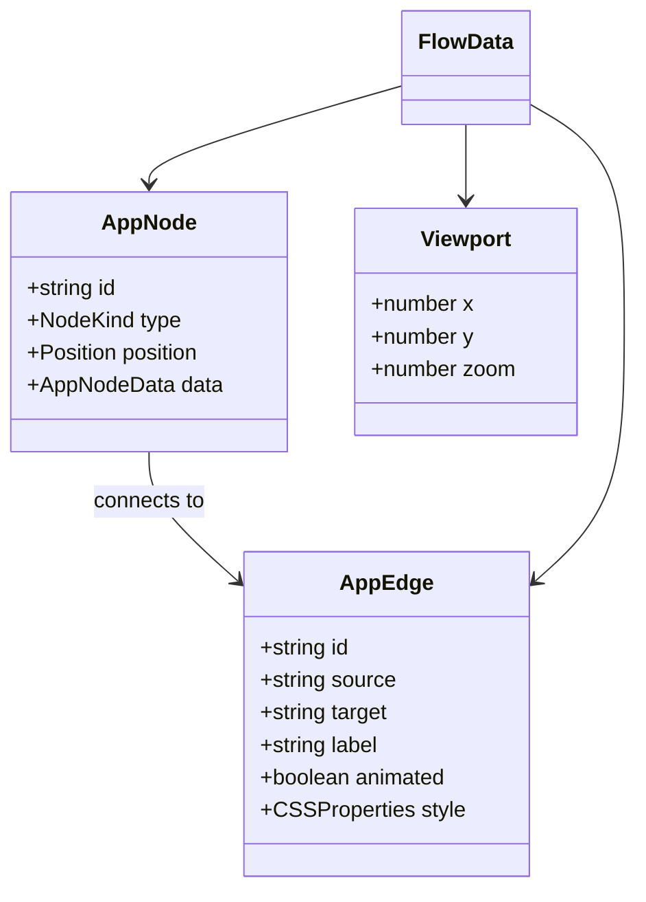
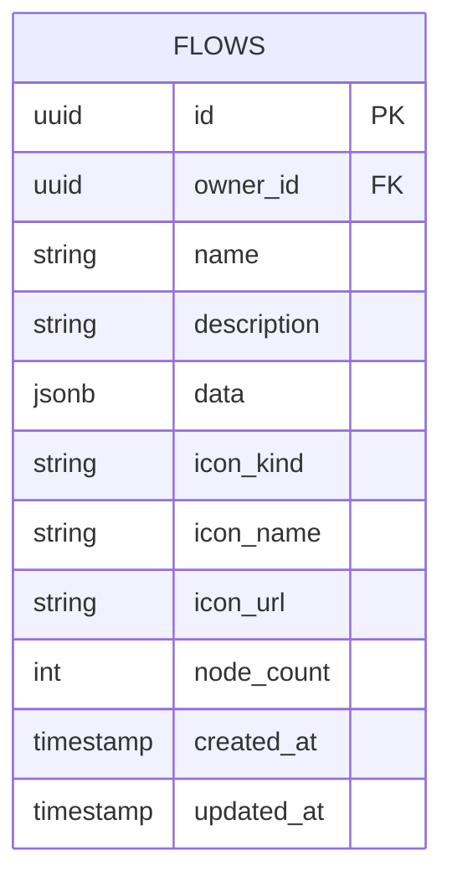
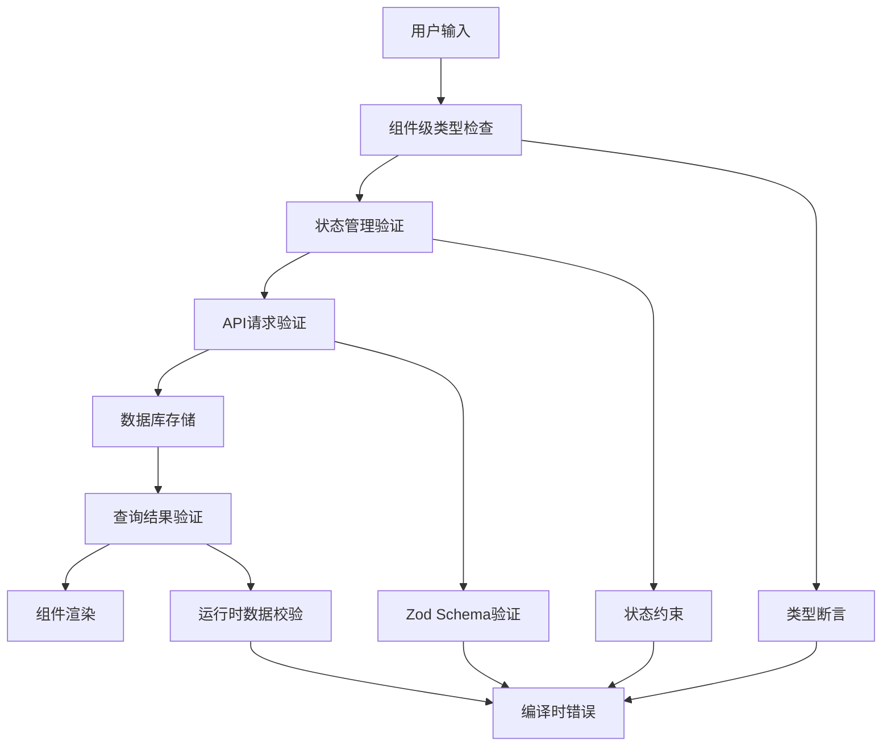
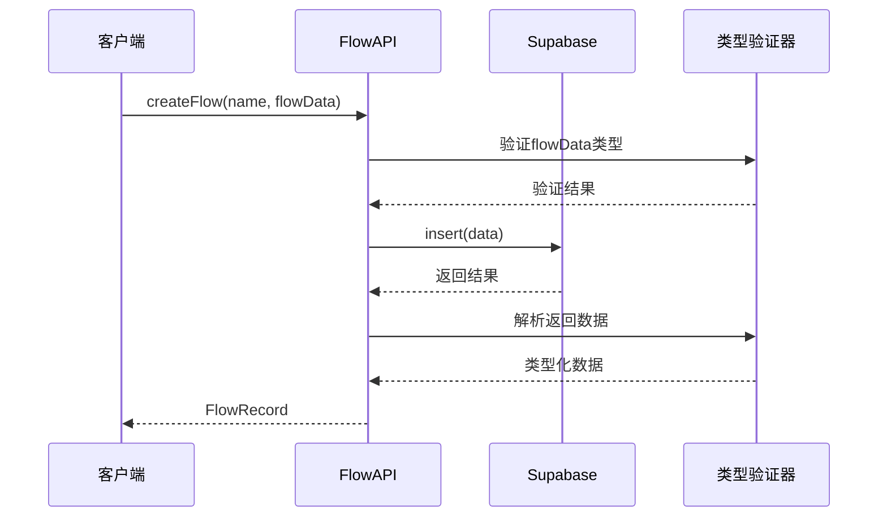
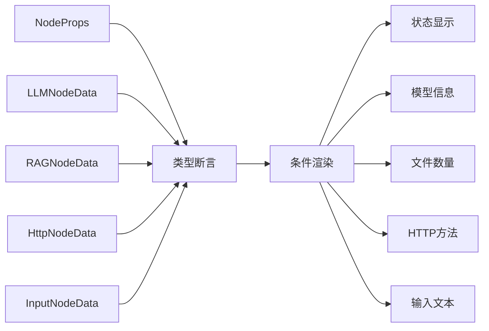

# 数据模型与类型定义

<cite>
**本文档中引用的文件**
- [src/types/flow.ts](file://src/types/flow.ts)
- [src/types/database.ts](file://src/types/database.ts)
- [src/lib/supabase.ts](file://src/lib/supabase.ts)
- [src/services/flowAPI.ts](file://src/services/flowAPI.ts)
- [src/store/flowStore.ts](file://src/store/flowStore.ts)
- [src/components/flow/CustomNode.tsx](file://src/components/flow/CustomNode.tsx)
- [src/store/actions/nodeActions.ts](file://src/store/actions/nodeActions.ts)
- [src/store/actions/edgeActions.ts](file://src/store/actions/edgeActions.ts)
- [src/utils/validation.ts](file://src/utils/validation.ts)
- [src/store/utils/nodeDefaults.ts](file://src/store/utils/nodeDefaults.ts)
</cite>

## 目录
1. [简介](#简介)
2. [项目架构概览](#项目架构概览)
3. [核心类型系统](#核心类型系统)
4. [流程数据模型](#流程数据模型)
5. [数据库类型映射](#数据库类型映射)
6. [类型安全保障机制](#类型安全保障机制)
7. [服务层类型处理](#服务层类型处理)
8. [组件层类型使用](#组件层类型使用)
9. [类型扩展指南](#类型扩展指南)
10. [最佳实践与故障排除](#最佳实践与故障排除)
11. [总结](#总结)

## 简介

Flash Flow项目采用强类型设计，通过精心设计的TypeScript类型系统确保数据一致性和开发体验。该系统涵盖了从数据库层到用户界面的完整类型链路，包括流程定义、节点类型、边关系以及执行状态等核心概念。

## 项目架构概览

项目采用分层架构，类型系统贯穿每个层次：



**图表来源**
- [src/types/flow.ts](file://src/types/flow.ts#L1-L153)
- [src/services/flowAPI.ts](file://src/services/flowAPI.ts#L1-L240)
- [src/types/database.ts](file://src/types/database.ts#L1-L59)

## 核心类型系统

### 节点类型定义

项目定义了六种核心节点类型，每种类型都有特定的数据结构：



**图表来源**
- [src/types/flow.ts](file://src/types/flow.ts#L3-L51)

### 执行状态类型



**图表来源**
- [src/types/flow.ts](file://src/types/flow.ts#L11)

**章节来源**
- [src/types/flow.ts](file://src/types/flow.ts#L1-L153)

## 流程数据模型

### 流程结构定义



**图表来源**
- [src/types/flow.ts](file://src/types/flow.ts#L59-L153)

### 边和节点类型



**图表来源**
- [src/types/flow.ts](file://src/types/flow.ts#L46-L52)

**章节来源**
- [src/types/flow.ts](file://src/types/flow.ts#L59-L153)

## 数据库类型映射

### Supabase数据库类型定义

项目通过自动生成的数据库类型确保数据库操作的类型安全：



**图表来源**
- [src/types/database.ts](file://src/types/database.ts#L12-L55)

### JSON类型处理

项目定义了通用的JSON类型以支持复杂的数据存储：

| 类型名称 | 描述 | 使用场景 |
|---------|------|----------|
| `Json` | 支持嵌套的对象和数组 | 流程数据存储 |
| `Database` | Supabase数据库模式 | 数据库操作类型 |
| `Database.Tables.flows.Row` | 流水线表行结构 | 查询结果类型 |
| `Database.Tables.flows.Insert` | 插入操作类型 | 创建数据类型 |
| `Database.Tables.flows.Update` | 更新操作类型 | 修改数据类型 |

**章节来源**
- [src/types/database.ts](file://src/types/database.ts#L1-L59)
- [src/lib/supabase.ts](file://src/lib/supabase.ts#L1-L18)

## 类型安全保障机制

### 运行时类型验证

项目实现了多层次的类型安全保障：



**图表来源**
- [src/store/actions/nodeActions.ts](file://src/store/actions/nodeActions.ts#L32-L67)
- [src/utils/validation.ts](file://src/utils/validation.ts#L1-L28)

### 类型守卫实现

项目在多个层面实现了类型守卫：

| 层面 | 实现方式 | 示例 |
|------|----------|------|
| 组件渲染 | 类型断言和可选链 | `const llm = data as LLMNodeData;` |
| 状态管理 | 条件验证 | `if (node.type === 'llm' && 'temperature' in data)` |
| API调用 | Zod Schema验证 | `PlanRequestSchema` |
| 数据库操作 | 运行时验证 | `try-catch` 块中的数据解析 |

**章节来源**
- [src/store/actions/nodeActions.ts](file://src/store/actions/nodeActions.ts#L32-L67)
- [src/services/flowAPI.ts](file://src/services/flowAPI.ts#L36-L54)
- [src/utils/validation.ts](file://src/utils/validation.ts#L1-L28)

## 服务层类型处理

### FlowAPI类型安全

FlowAPI服务提供了完整的类型安全保障：



**图表来源**
- [src/services/flowAPI.ts](file://src/services/flowAPI.ts#L107-L142)

### 数据转换和验证

服务层实现了智能的数据转换机制：

| 操作 | 类型处理 | 错误处理 |
|------|----------|----------|
| 创建流程 | 强制类型转换 | 抛出详细错误 |
| 查询流程 | 运行时验证 | 降级处理 |
| 更新流程 | 部分更新验证 | 空值处理 |
| 删除流程 | 简单验证 | 错误日志记录 |

**章节来源**
- [src/services/flowAPI.ts](file://src/services/flowAPI.ts#L107-L238)

## 组件层类型使用

### 节点组件类型处理

CustomNode组件展示了复杂的类型使用模式：



**图表来源**
- [src/components/flow/CustomNode.tsx](file://src/components/flow/CustomNode.tsx#L27-L82)

### 状态管理集成

FlowStore集成了完整的类型系统：

| 状态属性 | 类型定义 | 用途 |
|----------|----------|------|
| `nodes` | `AppNode[]` | 节点列表 |
| `edges` | `AppEdge[]` | 边关系列表 |
| `executionStatus` | `ExecutionStatus` | 执行状态 |
| `flowContext` | `FlowContext` | 上下文数据 |
| `selectedNodeId` | `string \| null` | 选中节点ID |

**章节来源**
- [src/store/flowStore.ts](file://src/store/flowStore.ts#L17-L131)
- [src/components/flow/CustomNode.tsx](file://src/components/flow/CustomNode.tsx#L27-L186)

## 类型扩展指南

### 添加新的节点类型

要添加新的节点类型，需要以下步骤：

1. **扩展NodeKind枚举**：
```typescript
export type NodeKind =
  | "input"
  | "llm"
  | "rag"
  | "output"
  | "branch"
  | "http"
  | "newType"; // 新增类型
```

2. **定义新的节点数据接口**：
```typescript
export interface NewNodeTypeData extends BaseNodeData {
  // 新类型特有的字段
  config?: Record<string, unknown>;
  settings?: { [key: string]: unknown };
}
```

3. **更新AppNodeData联合类型**：
```typescript
export type AppNodeData = 
  | BaseNodeData 
  | LLMNodeData 
  | RAGNodeData 
  | InputNodeData 
  | OutputNodeData 
  | HttpNodeData 
  | NewNodeTypeData; // 新增类型
```

4. **更新节点默认值**：
```typescript
export function getDefaultNodeData(type: NodeKind): Partial<AppNodeData> {
  const defaults: Record<NodeKind, Partial<AppNodeData>> = {
    // ... 现有默认值
    newType: { label: "新类型", config: {}, status: "idle" },
  };
  return defaults[type] || {};
}
```

### 添加新的字段

扩展现有类型字段的步骤：

1. **修改基础接口**：
```typescript
export interface BaseNodeData {
  // 现有字段...
  customField?: string; // 新增字段
  [key: string]: unknown;
}
```

2. **更新默认值**：
```typescript
const defaults = {
  input: { label: "输入", text: "", status: "idle", customField: "" },
  // 其他类型...
};
```

3. **更新验证逻辑**：
```typescript
if (node.type === 'newType' && 'customField' in data) {
  const field = data.customField as string;
  if (field && typeof field !== 'string') {
    console.error('Invalid custom field');
    return;
  }
}
```

### 数据库字段扩展

扩展数据库字段需要：

1. **更新数据库类型**：
```typescript
export interface Database {
  public: {
    Tables: {
      flows: {
        Row: {
          // 现有字段...
          custom_field: string | null; // 新增字段
        }
        Insert: {
          // 现有字段...
          custom_field?: string | null; // 新增字段
        }
        Update: {
          // 现有字段...
          custom_field?: string | null; // 新增字段
        }
      }
    }
  }
}
```

2. **更新API服务**：
```typescript
async updateFlow(id: string, updates: {
  // 现有字段...
  custom_field?: string | null;
}): Promise<FlowRecord> {
  const updateData: Record<string, unknown> = {};
  if (updates.custom_field !== undefined) {
    updateData.custom_field = updates.custom_field ?? null;
  }
  // ... 其他更新逻辑
}
```

## 最佳实践与故障排除

### 类型使用最佳实践

1. **优先使用类型断言而非类型守卫**
   - 在已知类型的情况下使用直接断言
   - 避免过度使用类型守卫导致性能问题

2. **实现渐进式类型安全**
   - 从编译时类型检查开始
   - 添加运行时验证作为第二层保护
   - 提供详细的错误信息

3. **保持类型的一致性**
   - 统一的命名约定
   - 一致的字段组织方式
   - 明确的类型边界

### 常见问题解决

| 问题 | 原因 | 解决方案 |
|------|------|----------|
| 类型不匹配错误 | 运行时数据与声明类型不符 | 添加运行时验证和降级处理 |
| 类型断言失败 | 数据结构发生变化 | 更新类型定义和验证逻辑 |
| 性能问题 | 过度的类型检查 | 优化类型断言和缓存策略 |
| 类型丢失 | 泛型推导失败 | 明确指定类型参数 |

### 调试技巧

1. **类型检查工具**：
   - 使用TypeScript的严格模式
   - 启用编译器的类型检查选项
   - 利用IDE的类型提示功能

2. **运行时调试**：
   - 添加类型验证日志
   - 使用console.log输出类型信息
   - 实现类型守卫函数

3. **测试策略**：
   - 编写类型安全的单元测试
   - 使用类型测试库验证类型正确性
   - 实施端到端类型测试

**章节来源**
- [src/store/actions/nodeActions.ts](file://src/store/actions/nodeActions.ts#L32-L67)
- [src/services/flowAPI.ts](file://src/services/flowAPI.ts#L36-L54)

## 总结

Flash Flow项目的类型系统展现了现代TypeScript应用的最佳实践。通过分层的设计、严格的类型约束和完善的错误处理机制，系统确保了数据的一致性和开发的安全性。

### 关键优势

1. **类型安全性**：从数据库到UI的完整类型链路
2. **扩展性**：易于添加新的节点类型和字段
3. **错误处理**：多层次的类型验证和降级机制
4. **开发体验**：丰富的类型提示和编译时检查

### 未来发展方向

1. **类型生成自动化**：进一步减少手动类型定义的工作量
2. **类型测试增强**：引入更多的类型安全测试
3. **性能优化**：优化类型检查对运行时性能的影响
4. **工具链完善**：开发专门的类型检查和验证工具

通过这套完整的类型系统，开发者可以构建更加可靠和可维护的应用程序，同时享受TypeScript带来的强大类型安全保障。