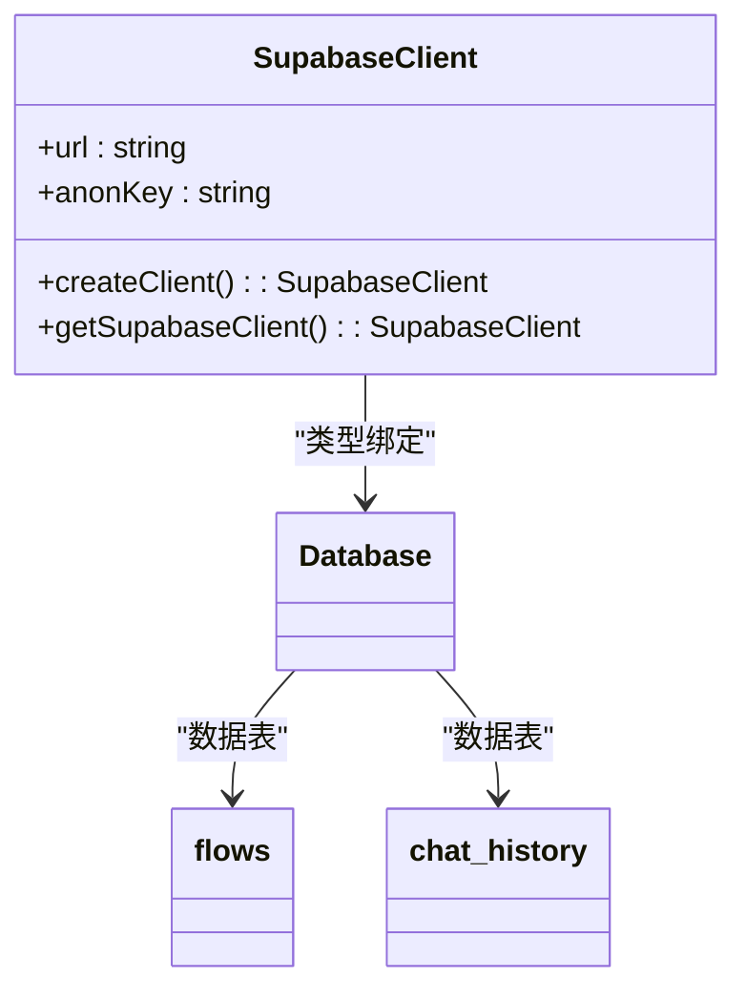
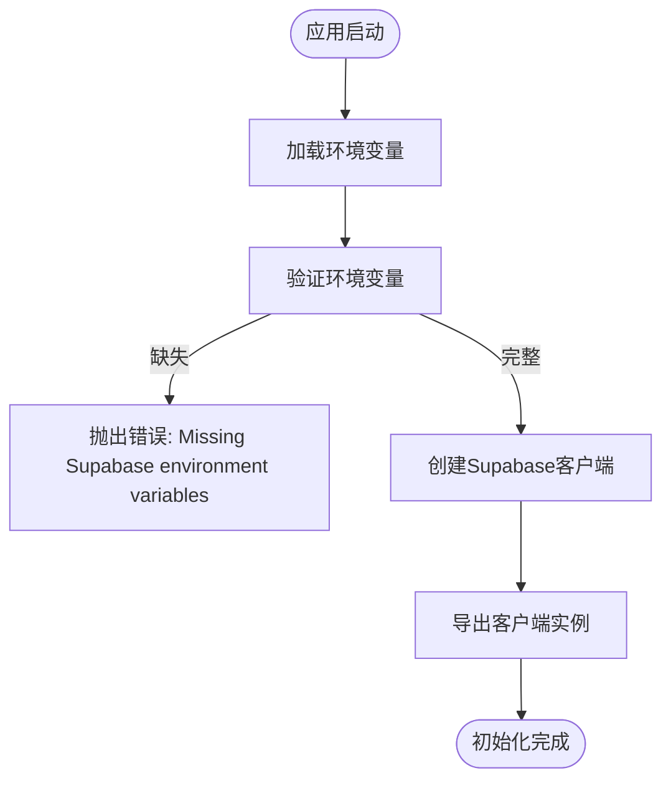
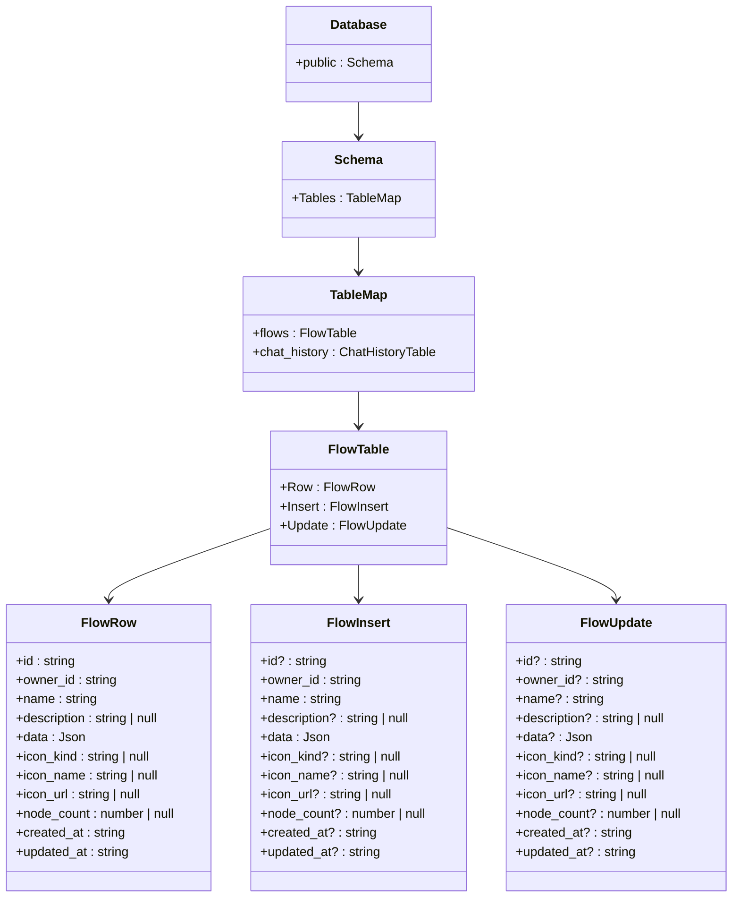
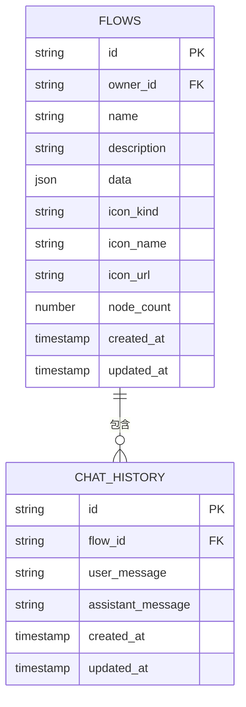
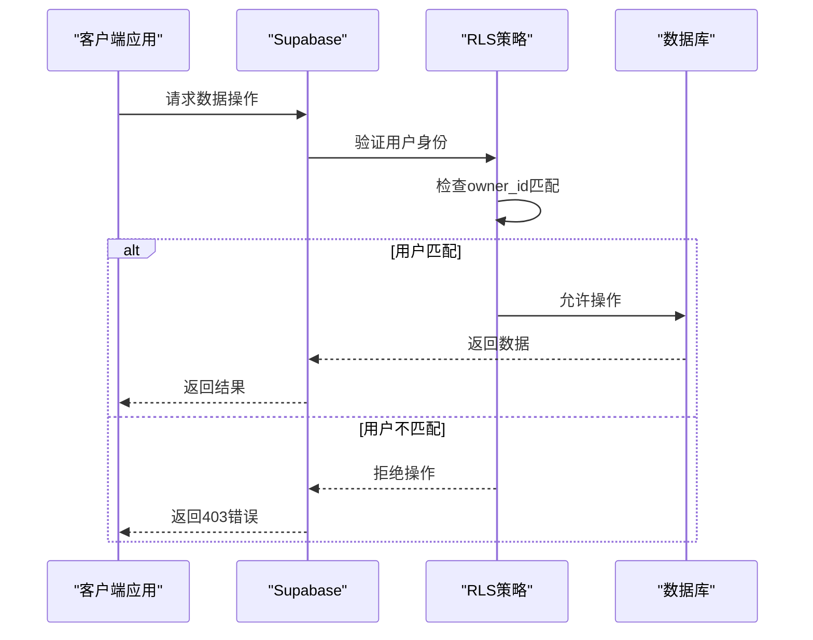
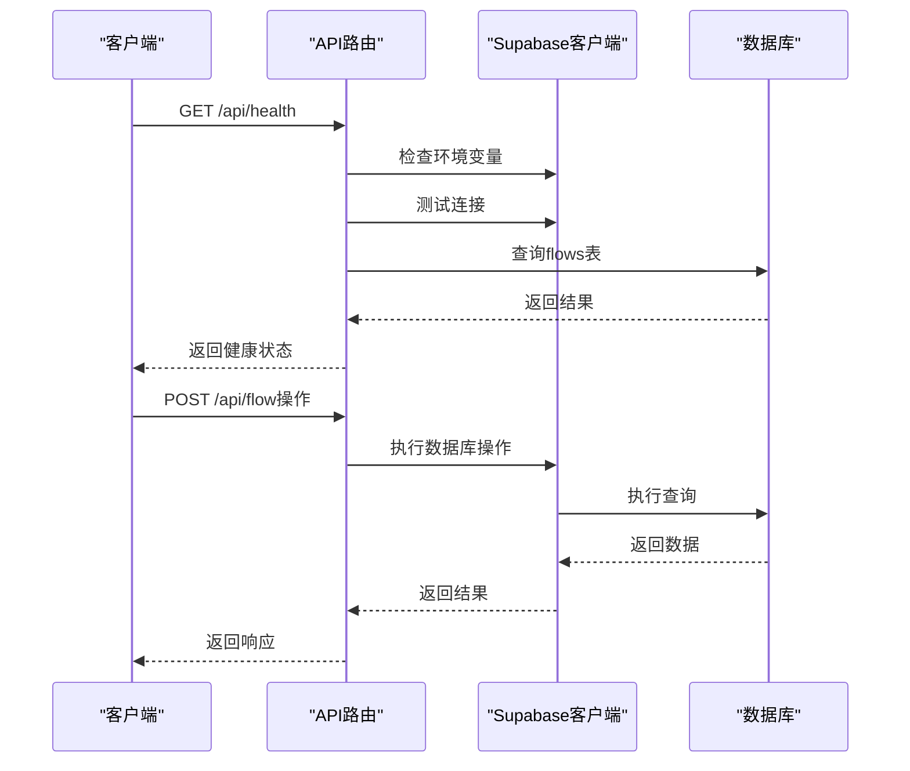
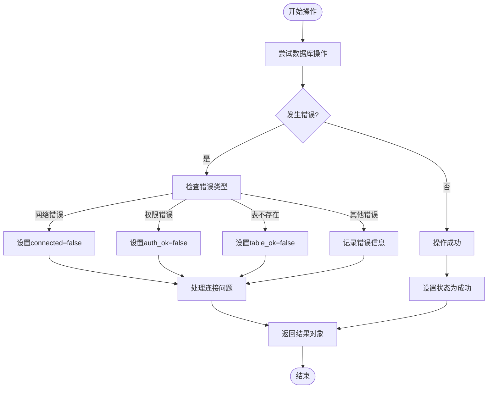
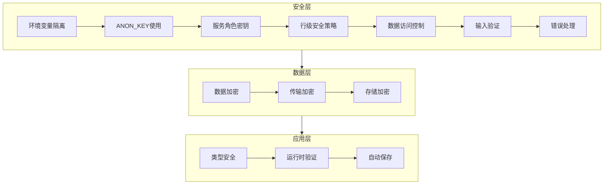

# Supabase集成与配置

<cite>
**本文档引用的文件**
- [supabase.ts](file://src/lib/supabase.ts)
- [database.ts](file://src/types/database.ts)
- [flowAPI.ts](file://src/services/flowAPI.ts)
- [chatHistoryAPI.ts](file://src/services/chatHistoryAPI.ts)
- [health/route.ts](file://src/app/api/health/route.ts)
- [flowStore.ts](file://src/store/flowStore.ts)
- [package.json](file://package.json)
</cite>

## 目录
1. [简介](#简介)
2. [Supabase客户端初始化](#supabase客户端初始化)
3. [环境变量配置](#环境变量配置)
4. [类型安全实现](#类型安全实现)
5. [数据表结构设计](#数据表结构设计)
6. [行级安全策略](#行级安全策略)
7. [服务端API交互机制](#服务端api交互机制)
8. [连接管理与错误处理](#连接管理与错误处理)
9. [安全考虑事项](#安全考虑事项)

## 简介
本架构文档系统描述了Flash Flow SaaS应用如何通过Supabase实现数据持久化和实时同步。文档详细说明了supabase客户端的初始化过程、环境变量配置要求和类型安全实现方案，解释了客户端在浏览器环境中的使用模式以及与服务端API的安全交互机制。文档还阐述了身份验证、数据表结构设计、行级安全策略的应用，并提供了连接管理、错误处理、重试机制和性能监控的最佳实践。

## Supabase客户端初始化

Supabase客户端的初始化在`src/lib/supabase.ts`文件中完成，采用单例模式创建客户端实例，确保在整个应用中共享同一个连接。

**图表来源**
- [supabase.ts](file://src/lib/supabase.ts#L1-L17)
- [database.ts](file://src/types/database.ts#L1-L58)

**本节来源**
- [supabase.ts](file://src/lib/supabase.ts#L1-L17)

## 环境变量配置

Supabase集成需要配置关键的环境变量，这些变量在应用启动时被读取并用于初始化客户端。

**图表来源**
- [supabase.ts](file://src/lib/supabase.ts#L4-L8)
- [health/route.ts](file://src/app/api/health/route.ts#L5-L7)

**本节来源**
- [supabase.ts](file://src/lib/supabase.ts#L4-L8)
- [health/route.ts](file://src/app/api/health/route.ts#L5-L7)

## 类型安全实现

项目通过TypeScript类型系统实现了与Supabase数据库模式的类型安全集成，确保了数据操作的类型正确性。

**图表来源**
- [database.ts](file://src/types/database.ts#L9-L58)
- [flowAPI.ts](file://src/services/flowAPI.ts#L22-L34)

**本节来源**
- [database.ts](file://src/types/database.ts#L9-L58)
- [flowAPI.ts](file://src/services/flowAPI.ts#L22-L34)

## 数据表结构设计

系统设计了两个主要的数据表：`flows`和`chat_history`，用于存储工作流数据和聊天历史记录。

**图表来源**
- [database.ts](file://src/types/database.ts#L12-L58)
- [chatHistoryAPI.ts](file://src/services/chatHistoryAPI.ts#L4-L11)

**本节来源**
- [database.ts](file://src/types/database.ts#L12-L58)
- [chatHistoryAPI.ts](file://src/services/chatHistoryAPI.ts#L4-L11)

## 行级安全策略

系统通过行级安全策略（RLS）控制数据访问权限，确保用户只能访问自己的数据。

**图表来源**
- [flowAPI.ts](file://src/services/flowAPI.ts#L15-L16)
- [chatHistoryAPI.ts](file://src/services/chatHistoryAPI.ts#L18-L22)

**本节来源**
- [flowAPI.ts](file://src/services/flowAPI.ts#L15-L16)
- [chatHistoryAPI.ts](file://src/services/chatHistoryAPI.ts#L18-L22)

## 服务端API交互机制

服务端API通过Supabase客户端与数据库交互，实现了健康检查、数据操作等功能。

**图表来源**
- [health/route.ts](file://src/app/api/health/route.ts#L4-L51)
- [flowAPI.ts](file://src/services/flowAPI.ts#L14-L240)

**本节来源**
- [health/route.ts](file://src/app/api/health/route.ts#L4-L51)
- [flowAPI.ts](file://src/services/flowAPI.ts#L14-L240)

## 连接管理与错误处理

系统实现了健壮的连接管理和错误处理机制，确保在各种网络条件下都能正常工作。

**图表来源**
- [health/route.ts](file://src/app/api/health/route.ts#L19-L48)
- [flowAPI.ts](file://src/services/flowAPI.ts#L18-L20)

**本节来源**
- [health/route.ts](file://src/app/api/health/route.ts#L19-L48)
- [flowAPI.ts](file://src/services/flowAPI.ts#L18-L20)

## 安全考虑事项

系统在安全方面采取了多项措施，包括密钥管理、数据加密和访问控制策略。

**图表来源**
- [supabase.ts](file://src/lib/supabase.ts#L4-L5)
- [health/route.ts](file://src/app/api/health/route.ts#L7)
- [flowAPI.ts](file://src/services/flowAPI.ts#L37-L54)

**本节来源**
- [supabase.ts](file://src/lib/supabase.ts#L4-L5)
- [health/route.ts](file://src/app/api/health/route.ts#L7)
- [flowAPI.ts](file://src/services/flowAPI.ts#L37-L54)