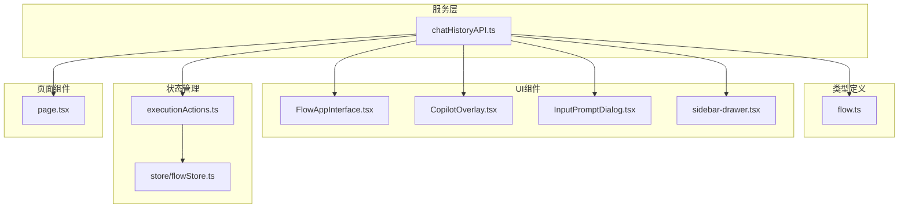
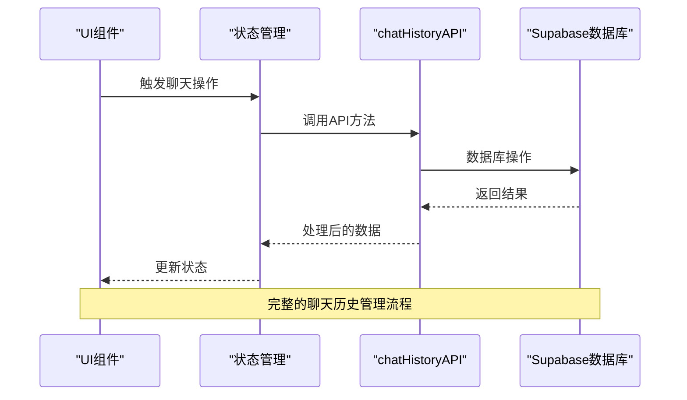
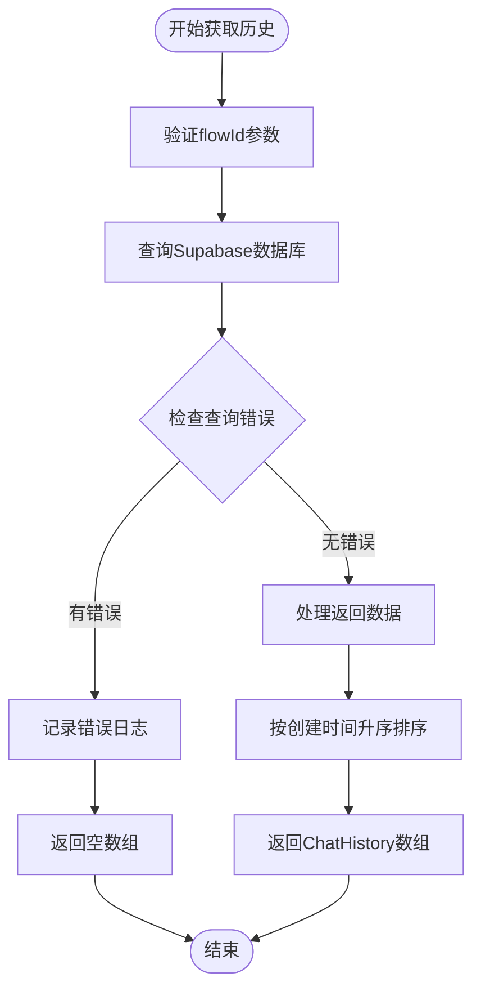
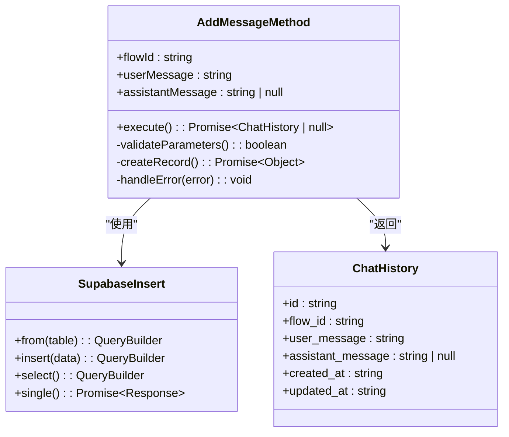
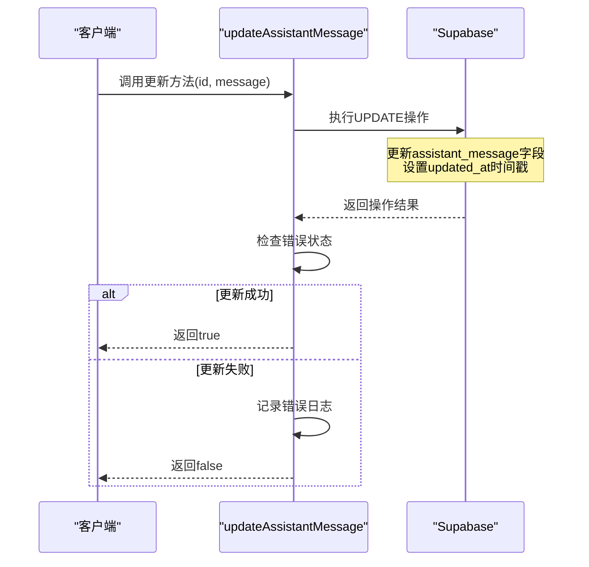
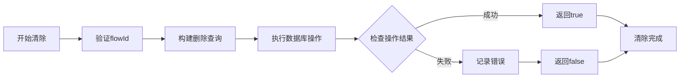
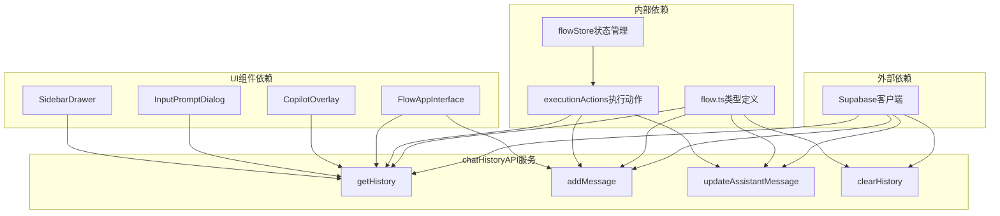

# 会话历史服务

<cite>
**本文档中引用的文件**
- [chatHistoryAPI.ts](file://src/services/chatHistoryAPI.ts)
- [flow.ts](file://src/types/flow.ts)
- [FlowAppInterface.tsx](file://src/components/apps/FlowAppInterface.tsx)
- [CopilotOverlay.tsx](file://src/components/flow/CopilotOverlay.tsx)
- [InputPromptDialog.tsx](file://src/components/flow/InputPromptDialog.tsx)
- [sidebar-drawer.tsx](file://src/components/ui/sidebar-drawer.tsx)
- [executionActions.ts](file://src/store/actions/executionActions.ts)
- [copilotActions.ts](file://src/store/actions/copilotActions.ts)
- [page.tsx](file://src/app/app/page.tsx)
</cite>

## 目录
1. [简介](#简介)
2. [项目结构](#项目结构)
3. [核心组件](#核心组件)
4. [架构概览](#架构概览)
5. [详细组件分析](#详细组件分析)
6. [依赖关系分析](#依赖关系分析)
7. [性能考虑](#性能考虑)
8. [故障排除指南](#故障排除指南)
9. [结论](#结论)

## 简介

chatHistoryAPI服务是Flash Flow平台的核心聊天历史管理系统，负责维护和管理用户与AI助手之间的对话记录。该服务提供了完整的CRUD操作功能，支持对话式工作流的调试与交互，确保用户能够追踪和回放他们的AI交互历史。

该服务采用客户端服务模式，基于Supabase数据库进行数据持久化，为前端组件提供统一的API接口。通过精心设计的接口和错误处理机制，确保了系统的稳定性和用户体验的流畅性。

## 项目结构

chatHistoryAPI服务位于`src/services/`目录下，作为独立的服务模块与其他系统组件协作：

**图表来源**
- [chatHistoryAPI.ts](file://src/services/chatHistoryAPI.ts#L1-L95)
- [flow.ts](file://src/types/flow.ts#L1-L153)

**章节来源**
- [chatHistoryAPI.ts](file://src/services/chatHistoryAPI.ts#L1-L95)

## 核心组件

### ChatHistory接口定义

ChatHistory接口定义了聊天记录的标准数据结构，包含以下核心字段：

| 字段名 | 类型 | 描述 | 必填 |
|--------|------|------|------|
| id | string | 唯一标识符 | 是 |
| flow_id | string | 关联的工作流ID | 是 |
| user_message | string | 用户发送的消息内容 | 是 |
| assistant_message | string \| null | 助手回复的消息内容 | 否 |
| created_at | string | 记录创建时间戳 | 是 |
| updated_at | string | 记录最后更新时间戳 | 是 |

### 核心API方法

chatHistoryAPI提供了四个核心方法，每个方法都有明确的职责和使用场景：

1. **getHistory(flowId)** - 获取指定工作流的历史记录
2. **addMessage(flowId, userMessage, assistantMessage)** - 添加新的聊天记录
3. **updateAssistantMessage(id, assistantMessage)** - 更新助手回复内容
4. **clearHistory(flowId)** - 清除指定工作流的所有历史记录

**章节来源**
- [chatHistoryAPI.ts](file://src/services/chatHistoryAPI.ts#L4-L11)
- [chatHistoryAPI.ts](file://src/services/chatHistoryAPI.ts#L13-L94)

## 架构概览

chatHistoryAPI服务采用分层架构设计，确保了良好的可维护性和扩展性：

**图表来源**
- [chatHistoryAPI.ts](file://src/services/chatHistoryAPI.ts#L17-L30)
- [executionActions.ts](file://src/store/actions/executionActions.ts#L118-L145)

## 详细组件分析

### getHistory方法分析

getHistory方法负责获取指定工作流的完整聊天历史记录，支持按时间顺序排列：

**图表来源**
- [chatHistoryAPI.ts](file://src/services/chatHistoryAPI.ts#L17-L30)

#### 方法特性
- **异步操作**：使用Promise确保非阻塞执行
- **错误处理**：完善的错误捕获和日志记录
- **数据排序**：自动按时间顺序排列记录
- **类型安全**：返回类型明确为ChatHistory[]

**章节来源**
- [chatHistoryAPI.ts](file://src/services/chatHistoryAPI.ts#L17-L30)

### addMessage方法分析

addMessage方法实现了聊天记录的创建功能，支持同时保存用户消息和助手回复：

**图表来源**
- [chatHistoryAPI.ts](file://src/services/chatHistoryAPI.ts#L35-L56)
- [chatHistoryAPI.ts](file://src/services/chatHistoryAPI.ts#L4-L11)

#### 参数处理机制
- **flowId**：必需参数，用于关联工作流
- **userMessage**：必需参数，用户输入内容
- **assistantMessage**：可选参数，默认为null

#### 返回值处理
- 成功时返回完整的ChatHistory对象
- 失败时返回null并记录错误日志

**章节来源**
- [chatHistoryAPI.ts](file://src/services/chatHistoryAPI.ts#L35-L56)

### updateAssistantMessage方法分析

updateAssistantMessage方法专门处理助手回复内容的更新操作：

**图表来源**
- [chatHistoryAPI.ts](file://src/services/chatHistoryAPI.ts#L61-L76)

#### 更新策略
- **原子操作**：单次数据库更新包含消息内容和时间戳
- **时间同步**：自动更新updated_at字段确保数据一致性
- **幂等性**：多次调用同一ID不会产生副作用

**章节来源**
- [chatHistoryAPI.ts](file://src/services/chatHistoryAPI.ts#L61-L76)

### clearHistory方法分析

clearHistory方法提供批量删除功能，用于清理指定工作流的历史记录：

**图表来源**
- [chatHistoryAPI.ts](file://src/services/chatHistoryAPI.ts#L81-L94)

#### 清理范围
- **精确匹配**：只删除与指定flowId关联的记录
- **批量操作**：一次性删除所有相关记录
- **级联效果**：不涉及外键约束的级联删除

**章节来源**
- [chatHistoryAPI.ts](file://src/services/chatHistoryAPI.ts#L81-L94)

## 依赖关系分析

chatHistoryAPI服务的依赖关系展现了清晰的分层架构：

**图表来源**
- [chatHistoryAPI.ts](file://src/services/chatHistoryAPI.ts#L2-L3)
- [flow.ts](file://src/types/flow.ts#L1-L153)

### 主要依赖项

1. **Supabase客户端**：提供数据库连接和操作能力
2. **flow.ts类型定义**：确保类型安全和数据结构一致性
3. **状态管理模块**：协调UI组件与服务层的交互

**章节来源**
- [chatHistoryAPI.ts](file://src/services/chatHistoryAPI.ts#L2-L3)
- [flow.ts](file://src/types/flow.ts#L1-L153)

## 性能考虑

### 查询优化策略

1. **索引利用**：flow_id字段应建立索引以加速查询
2. **分页支持**：对于大量历史记录，考虑实现分页加载
3. **缓存机制**：在适当场景下引入内存缓存减少数据库访问

### 并发控制

1. **事务处理**：关键操作使用数据库事务保证一致性
2. **乐观锁**：通过updated_at字段实现并发冲突检测
3. **请求限流**：防止恶意或意外的高频请求

### 内存管理

1. **及时释放**：处理完成后立即释放临时数据结构
2. **垃圾回收**：避免创建不必要的闭包和循环引用
3. **资源池化**：对于频繁的小对象创建考虑对象池技术

## 故障排除指南

### 常见错误及解决方案

#### 数据库连接问题
- **症状**：getHistory返回空数组但无错误日志
- **原因**：Supabase连接配置错误或网络问题
- **解决方案**：检查环境变量和网络连接状态

#### 数据完整性问题
- **症状**：updateAssistantMessage返回false
- **原因**：记录不存在或数据格式不正确
- **解决方案**：验证ID存在性和消息格式

#### 性能问题
- **症状**：历史记录加载缓慢
- **原因**：数据量过大或查询条件不当
- **解决方案**：实施分页查询和索引优化

### 错误处理最佳实践

1. **渐进式降级**：优先保证核心功能可用
2. **用户友好的错误提示**：避免暴露技术细节
3. **日志记录**：详细记录错误信息便于调试
4. **重试机制**：对临时性错误实施指数退避重试

**章节来源**
- [chatHistoryAPI.ts](file://src/services/chatHistoryAPI.ts#L24-L26)
- [chatHistoryAPI.ts](file://src/services/chatHistoryAPI.ts#L50-L52)
- [chatHistoryAPI.ts](file://src/services/chatHistoryAPI.ts#L70-L72)
- [chatHistoryAPI.ts](file://src/services/chatHistoryAPI.ts#L87-L89)

## 结论

chatHistoryAPI服务作为Flash Flow平台的核心组件，成功实现了聊天历史管理的完整功能集。通过精心设计的接口、完善的错误处理和合理的架构分层，该服务为用户提供了可靠、高效的对话式交互体验。

### 主要优势

1. **类型安全**：完整的TypeScript类型定义确保编译时检查
2. **错误处理**：完善的异常捕获和日志记录机制
3. **性能优化**：合理的数据库查询策略和缓存考虑
4. **扩展性**：模块化设计便于功能扩展和维护

### 未来改进方向

1. **实时通信**：集成WebSocket实现实时聊天更新
2. **数据分析**：添加历史记录统计和分析功能
3. **多语言支持**：国际化和本地化功能扩展
4. **备份恢复**：提供历史记录的导出和导入功能

该服务的成功实施为Flash Flow平台的AI交互功能奠定了坚实基础，展现了现代Web应用中服务层设计的最佳实践。