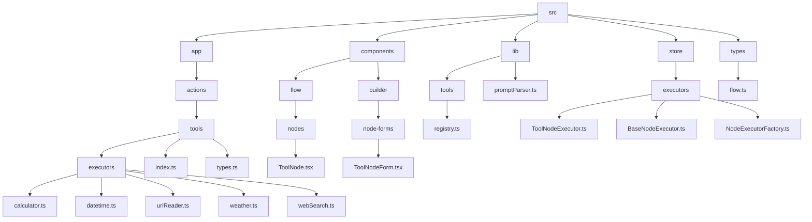
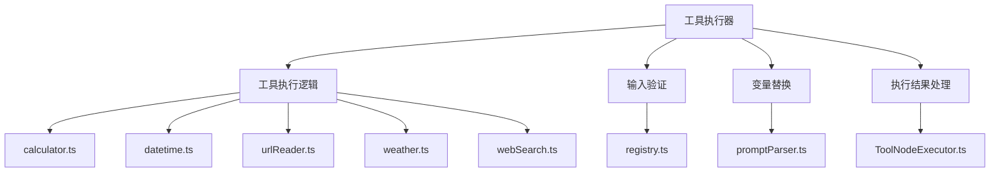
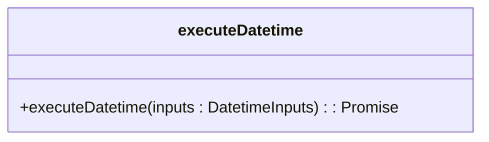
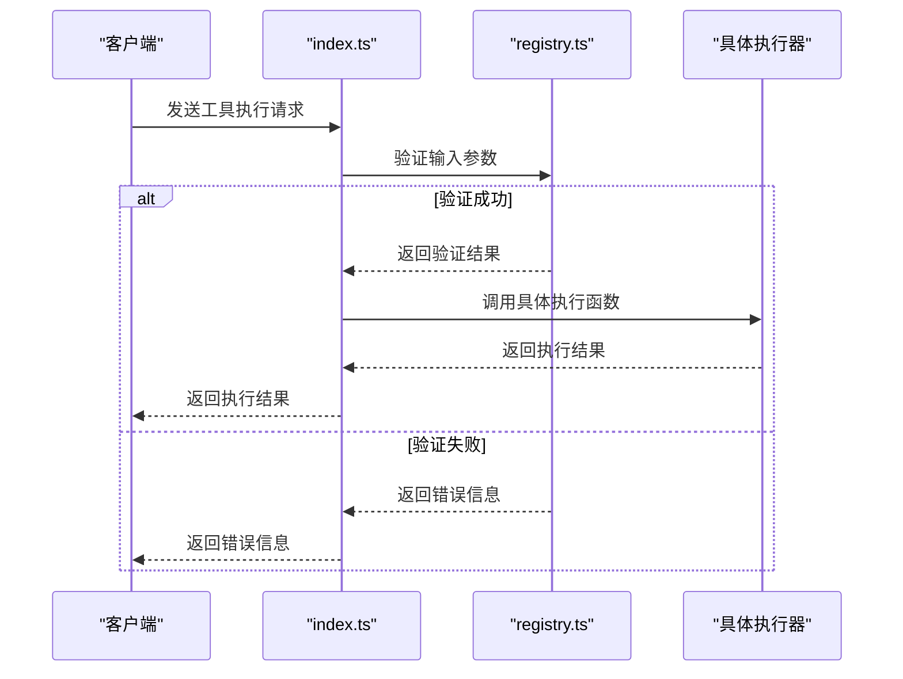
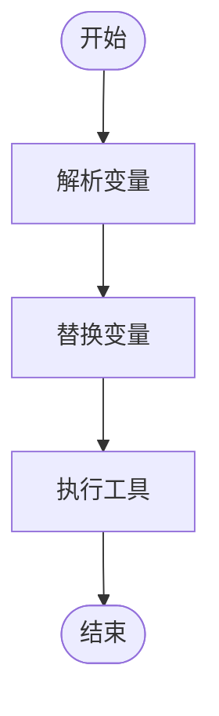
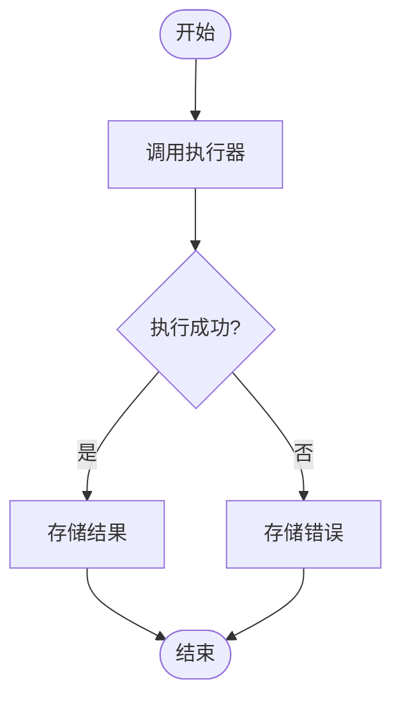

# 工具执行器

<cite>
**本文档引用的文件**  
- [calculator.ts](file://src/app/actions/tools/executors/calculator.ts)
- [datetime.ts](file://src/app/actions/tools/executors/datetime.ts)
- [urlReader.ts](file://src/app/actions/tools/executors/urlReader.ts)
- [weather.ts](file://src/app/actions/tools/executors/weather.ts)
- [webSearch.ts](file://src/app/actions/tools/executors/webSearch.ts)
- [index.ts](file://src/app/actions/tools/index.ts)
- [types.ts](file://src/app/actions/tools/types.ts)
- [registry.ts](file://src/lib/tools/registry.ts)
- [ToolNodeExecutor.ts](file://src/store/executors/ToolNodeExecutor.ts)
- [BaseNodeExecutor.ts](file://src/store/executors/BaseNodeExecutor.ts)
- [NodeExecutorFactory.ts](file://src/store/executors/NodeExecutorFactory.ts)
- [ToolNode.tsx](file://src/components/flow/nodes/ToolNode.tsx)
- [ToolNodeForm.tsx](file://src/components/builder/node-forms/ToolNodeForm.tsx)
- [flow.ts](file://src/types/flow.ts)
- [promptParser.ts](file://src/lib/promptParser.ts)
</cite>

## 目录
1. [简介](#简介)
2. [项目结构](#项目结构)
3. [核心组件](#核心组件)
4. [架构概述](#架构概述)
5. [详细组件分析](#详细组件分析)
6. [依赖分析](#依赖分析)
7. [性能考虑](#性能考虑)
8. [故障排除指南](#故障排除指南)
9. [结论](#结论)

## 简介
“工具执行器”是 FlashFlow SaaS 平台中的关键模块，负责执行各种工具操作，如网页搜索、计算、日期时间处理、天气查询和网页内容读取。该模块通过统一的接口和类型定义，确保了不同类型工具的一致性和可扩展性。每个工具都有其特定的输入验证规则和执行逻辑，这些规则和逻辑在前端和后端都得到了严格的实施。此外，工具执行器还支持变量替换，允许用户在运行时动态地修改输入参数。整个系统设计为高度模块化，便于维护和扩展。

## 项目结构
本项目的结构清晰，主要分为以下几个部分：
- `src/app/actions/tools/executors/`：包含各个工具的具体执行逻辑。
- `src/app/actions/tools/`：包含工具执行的主入口和类型定义。
- `src/lib/tools/registry.ts`：定义了所有可用工具的注册表，包括它们的ID、名称、描述、图标、输入验证模式和分类。
- `src/store/executors/`：实现了工具节点的执行器，负责调用具体的工具执行函数。
- `src/components/flow/nodes/`：包含了工具节点的UI组件。
- `src/components/builder/node-forms/`：提供了工具节点的配置表单。



**Diagram sources**
- [src/app/actions/tools/executors/calculator.ts](file://src/app/actions/tools/executors/calculator.ts)
- [src/app/actions/tools/executors/datetime.ts](file://src/app/actions/tools/executors/datetime.ts)
- [src/app/actions/tools/executors/urlReader.ts](file://src/app/actions/tools/executors/urlReader.ts)
- [src/app/actions/tools/executors/weather.ts](file://src/app/actions/tools/executors/weather.ts)
- [src/app/actions/tools/executors/webSearch.ts](file://src/app/actions/tools/executors/webSearch.ts)
- [src/app/actions/tools/index.ts](file://src/app/actions/tools/index.ts)
- [src/app/actions/tools/types.ts](file://src/app/actions/tools/types.ts)
- [src/lib/tools/registry.ts](file://src/lib/tools/registry.ts)
- [src/store/executors/ToolNodeExecutor.ts](file://src/store/executors/ToolNodeExecutor.ts)
- [src/store/executors/BaseNodeExecutor.ts](file://src/store/executors/BaseNodeExecutor.ts)
- [src/store/executors/NodeExecutorFactory.ts](file://src/store/executors/NodeExecutorFactory.ts)
- [src/components/flow/nodes/ToolNode.tsx](file://src/components/flow/nodes/ToolNode.tsx)
- [src/components/builder/node-forms/ToolNodeForm.tsx](file://src/components/builder/node-forms/ToolNodeForm.tsx)
- [src/types/flow.ts](file://src/types/flow.ts)
- [src/lib/promptParser.ts](file://src/lib/promptParser.ts)

**Section sources**
- [src/app/actions/tools/executors/calculator.ts](file://src/app/actions/tools/executors/calculator.ts)
- [src/app/actions/tools/executors/datetime.ts](file://src/app/actions/tools/executors/datetime.ts)
- [src/app/actions/tools/executors/urlReader.ts](file://src/app/actions/tools/executors/urlReader.ts)
- [src/app/actions/tools/executors/weather.ts](file://src/app/actions/tools/executors/weather.ts)
- [src/app/actions/tools/executors/webSearch.ts](file://src/app/actions/tools/executors/webSearch.ts)
- [src/app/actions/tools/index.ts](file://src/app/actions/tools/index.ts)
- [src/app/actions/tools/types.ts](file://src/app/actions/tools/types.ts)
- [src/lib/tools/registry.ts](file://src/lib/tools/registry.ts)
- [src/store/executors/ToolNodeExecutor.ts](file://src/store/executors/ToolNodeExecutor.ts)
- [src/store/executors/BaseNodeExecutor.ts](file://src/store/executors/BaseNodeExecutor.ts)
- [src/store/executors/NodeExecutorFactory.ts](file://src/store/executors/NodeExecutorFactory.ts)
- [src/components/flow/nodes/ToolNode.tsx](file://src/components/flow/nodes/ToolNode.tsx)
- [src/components/builder/node-forms/ToolNodeForm.tsx](file://src/components/builder/node-forms/ToolNodeForm.tsx)
- [src/types/flow.ts](file://src/types/flow.ts)
- [src/lib/promptParser.ts](file://src/lib/promptParser.ts)

## 核心组件
工具执行器的核心组件包括工具执行逻辑、输入验证、变量替换和执行结果处理。每个工具都有一个独立的执行函数，这些函数位于 `src/app/actions/tools/executors/` 目录下。主入口文件 `index.ts` 负责路由到相应的工具执行函数，并进行输入验证。`registry.ts` 文件定义了所有可用工具的注册表，包括它们的ID、名称、描述、图标、输入验证模式和分类。`ToolNodeExecutor.ts` 实现了工具节点的执行器，负责调用具体的工具执行函数并处理执行结果。

**Section sources**
- [src/app/actions/tools/executors/calculator.ts](file://src/app/actions/tools/executors/calculator.ts)
- [src/app/actions/tools/executors/datetime.ts](file://src/app/actions/tools/executors/datetime.ts)
- [src/app/actions/tools/executors/urlReader.ts](file://src/app/actions/tools/executors/urlReader.ts)
- [src/app/actions/tools/executors/weather.ts](file://src/app/actions/tools/executors/weather.ts)
- [src/app/actions/tools/executors/webSearch.ts](file://src/app/actions/tools/executors/webSearch.ts)
- [src/app/actions/tools/index.ts](file://src/app/actions/tools/index.ts)
- [src/lib/tools/registry.ts](file://src/lib/tools/registry.ts)
- [src/store/executors/ToolNodeExecutor.ts](file://src/store/executors/ToolNodeExecutor.ts)

## 架构概述
工具执行器的架构设计遵循了模块化和分层的原则。最底层是具体的工具执行逻辑，每个工具都有一个独立的执行函数。中间层是工具执行的主入口，负责路由到相应的工具执行函数，并进行输入验证。最上层是工具节点的执行器，负责调用具体的工具执行函数并处理执行结果。此外，系统还提供了变量替换功能，允许用户在运行时动态地修改输入参数。整个架构通过统一的接口和类型定义，确保了不同类型工具的一致性和可扩展性。



**Diagram sources**
- [src/app/actions/tools/executors/calculator.ts](file://src/app/actions/tools/executors/calculator.ts)
- [src/app/actions/tools/executors/datetime.ts](file://src/app/actions/tools/executors/datetime.ts)
- [src/app/actions/tools/executors/urlReader.ts](file://src/app/actions/tools/executors/urlReader.ts)
- [src/app/actions/tools/executors/weather.ts](file://src/app/actions/tools/executors/weather.ts)
- [src/app/actions/tools/executors/webSearch.ts](file://src/app/actions/tools/executors/webSearch.ts)
- [src/lib/tools/registry.ts](file://src/lib/tools/registry.ts)
- [src/lib/promptParser.ts](file://src/lib/promptParser.ts)
- [src/store/executors/ToolNodeExecutor.ts](file://src/store/executors/ToolNodeExecutor.ts)

## 详细组件分析
### 工具执行逻辑
每个工具的执行逻辑都封装在一个独立的函数中，这些函数位于 `src/app/actions/tools/executors/` 目录下。例如，`calculator.ts` 文件中的 `executeCalculator` 函数负责执行数学计算，`datetime.ts` 文件中的 `executeDatetime` 函数负责处理日期时间操作。这些函数接收输入参数，执行相应的操作，并返回执行结果。

#### 计算器工具
```mermaid
classDiagram
class executeCalculator {
+executeCalculator(inputs : { expression : string }) : Promise<ToolExecutionResult>
}
```

**Diagram sources**
- [src/app/actions/tools/executors/calculator.ts](file://src/app/actions/tools/executors/calculator.ts)

#### 日期时间工具


**Diagram sources**
- [src/app/actions/tools/executors/datetime.ts](file://src/app/actions/tools/executors/datetime.ts)

#### 网页读取工具
```mermaid
classDiagram
class executeUrlReader {
+executeUrlReader(inputs : { url : string; maxLength? : number }) : Promise<ToolExecutionResult>
}
```

**Diagram sources**
- [src/app/actions/tools/executors/urlReader.ts](file://src/app/actions/tools/executors/urlReader.ts)

#### 天气查询工具
```mermaid
classDiagram
class executeWeather {
+executeWeather(inputs : { city : string }) : Promise<ToolExecutionResult>
}
```

**Diagram sources**
- [src/app/actions/tools/executors/weather.ts](file://src/app/actions/tools/executors/weather.ts)

#### 网页搜索工具
```mermaid
classDiagram
class executeWebSearch {
+executeWebSearch(inputs : { query : string; maxResults? : number }) : Promise<ToolExecutionResult>
}
```

**Diagram sources**
- [src/app/actions/tools/executors/webSearch.ts](file://src/app/actions/tools/executors/webSearch.ts)

### 输入验证
输入验证是确保工具执行安全和正确的重要环节。`registry.ts` 文件中定义了每个工具的输入验证模式，使用 Zod 库进行验证。主入口文件 `index.ts` 在调用具体工具执行函数之前，会先对输入参数进行验证。如果验证失败，将返回错误信息。



**Diagram sources**
- [src/app/actions/tools/index.ts](file://src/app/actions/tools/index.ts)
- [src/lib/tools/registry.ts](file://src/lib/tools/registry.ts)

### 变量替换
变量替换功能允许用户在运行时动态地修改输入参数。`promptParser.ts` 文件中定义了 `replaceVariables` 函数，用于替换输入参数中的变量。`ToolNodeExecutor.ts` 在执行工具之前，会调用 `replaceVariables` 函数，将输入参数中的变量替换为实际值。



**Diagram sources**
- [src/lib/promptParser.ts](file://src/lib/promptParser.ts)
- [src/store/executors/ToolNodeExecutor.ts](file://src/store/executors/ToolNodeExecutor.ts)

### 执行结果处理
执行结果处理是工具执行器的最后一环。`ToolNodeExecutor.ts` 在调用具体工具执行函数后，会处理返回的执行结果。如果执行成功，将结果存储在节点的输出中；如果执行失败，将错误信息存储在节点的状态中。



**Diagram sources**
- [src/store/executors/ToolNodeExecutor.ts](file://src/store/executors/ToolNodeExecutor.ts)

**Section sources**
- [src/app/actions/tools/executors/calculator.ts](file://src/app/actions/tools/executors/calculator.ts)
- [src/app/actions/tools/executors/datetime.ts](file://src/app/actions/tools/executors/datetime.ts)
- [src/app/actions/tools/executors/urlReader.ts](file://src/app/actions/tools/executors/urlReader.ts)
- [src/app/actions/tools/executors/weather.ts](file://src/app/actions/tools/executors/weather.ts)
- [src/app/actions/tools/executors/webSearch.ts](file://src/app/actions/tools/executors/webSearch.ts)
- [src/app/actions/tools/index.ts](file://src/app/actions/tools/index.ts)
- [src/lib/tools/registry.ts](file://src/lib/tools/registry.ts)
- [src/lib/promptParser.ts](file://src/lib/promptParser.ts)
- [src/store/executors/ToolNodeExecutor.ts](file://src/store/executors/ToolNodeExecutor.ts)

## 依赖分析
工具执行器的依赖关系清晰，主要依赖于以下几个模块：
- `zod`：用于输入验证。
- `mathjs`：用于数学计算。
- `lucide-react`：用于图标显示。
- `@xyflow/react`：用于节点和边的渲染。
- `zustand`：用于状态管理。

```mermaid
graph TD
A[工具执行器] --> B[zod]
A --> C[mathjs]
A --> D[lucide-react]
A --> E[@xyflow/react]
A --> F[zustand]
```

**Diagram sources**
- [src/app/actions/tools/executors/calculator.ts](file://src/app/actions/tools/executors/calculator.ts)
- [src/lib/tools/registry.ts](file://src/lib/tools/registry.ts)
- [src/components/flow/nodes/ToolNode.tsx](file://src/components/flow/nodes/ToolNode.tsx)
- [src/types/flow.ts](file://src/types/flow.ts)
- [src/store/flowStore.ts](file://src/store/flowStore.ts)

## 性能考虑
工具执行器在设计时充分考虑了性能问题。首先，通过模块化的设计，每个工具的执行逻辑都是独立的，可以并行执行。其次，输入验证和变量替换都在执行前完成，避免了在执行过程中进行不必要的计算。最后，执行结果的处理也非常高效，直接将结果存储在节点的输出中，减少了数据传输的开销。

## 故障排除指南
在使用工具执行器时，可能会遇到一些常见问题。以下是一些故障排除建议：
- **输入验证失败**：检查输入参数是否符合工具的输入验证模式。
- **执行失败**：查看返回的错误信息，根据错误信息进行相应的调整。
- **变量替换失败**：确保变量名正确无误，并且变量值已正确设置。

**Section sources**
- [src/app/actions/tools/index.ts](file://src/app/actions/tools/index.ts)
- [src/lib/tools/registry.ts](file://src/lib/tools/registry.ts)
- [src/lib/promptParser.ts](file://src/lib/promptParser.ts)
- [src/store/executors/ToolNodeExecutor.ts](file://src/store/executors/ToolNodeExecutor.ts)

## 结论
工具执行器是 FlashFlow SaaS 平台中的重要组成部分，它通过模块化和分层的设计，实现了多种工具的统一管理和执行。每个工具都有其独立的执行逻辑和输入验证规则，确保了系统的安全性和可靠性。同时，工具执行器还支持变量替换，允许用户在运行时动态地修改输入参数，提高了系统的灵活性。整体架构设计合理，性能优越，易于维护和扩展。