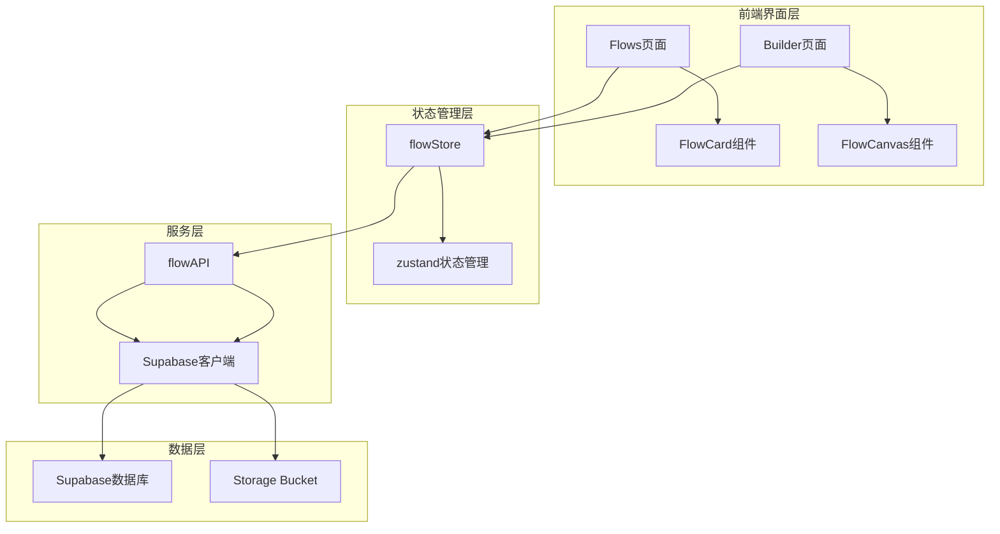
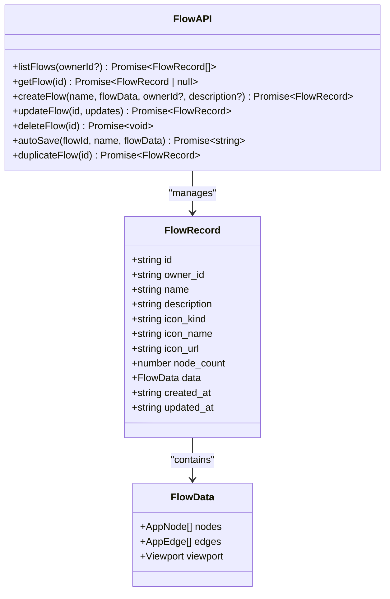
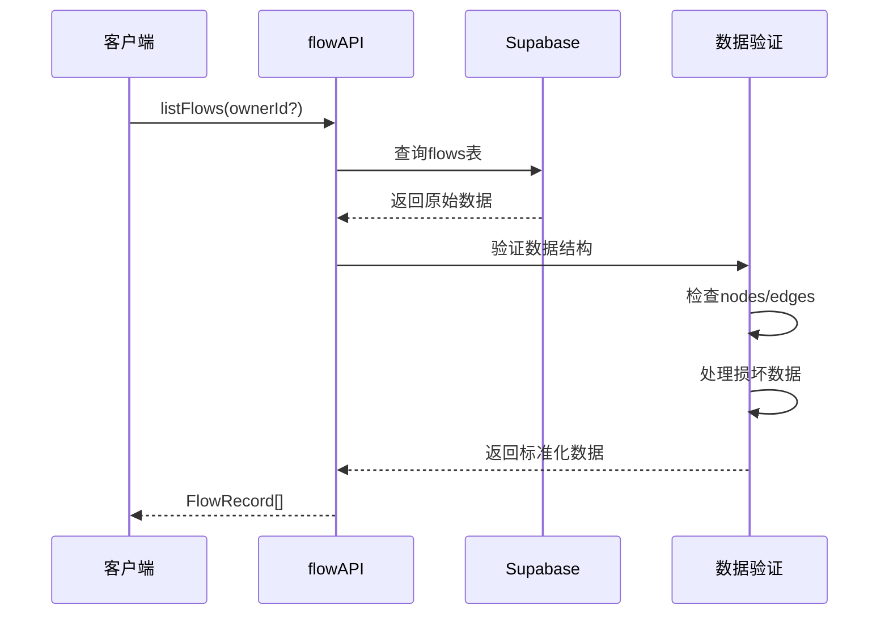
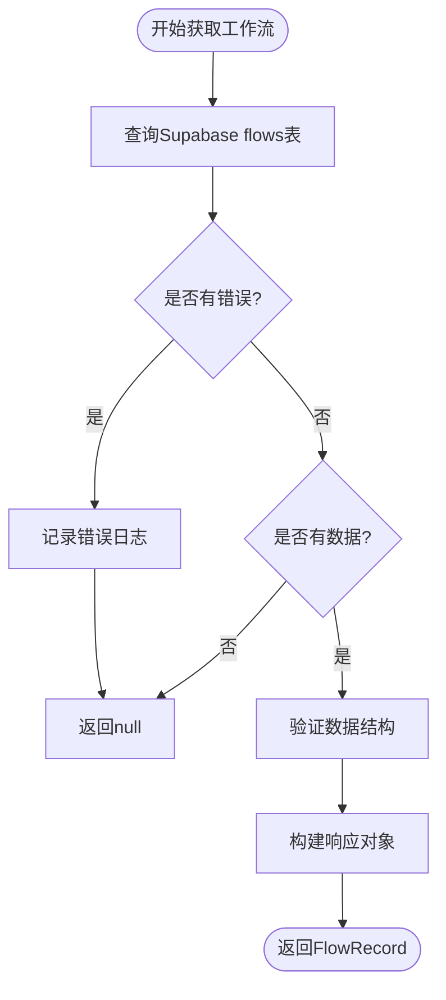
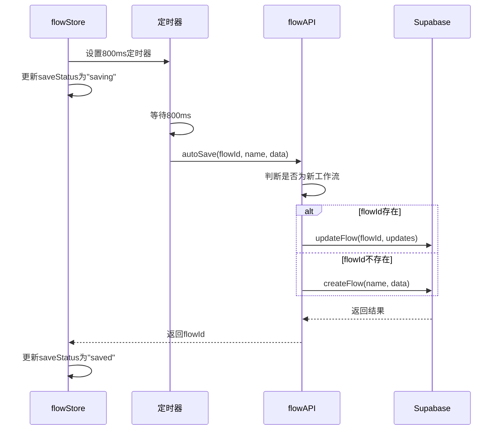
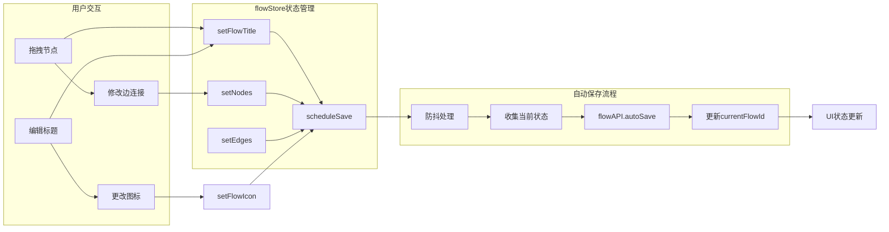
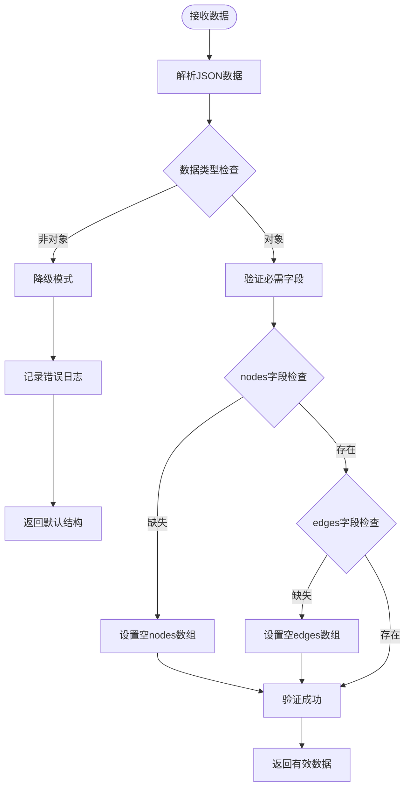
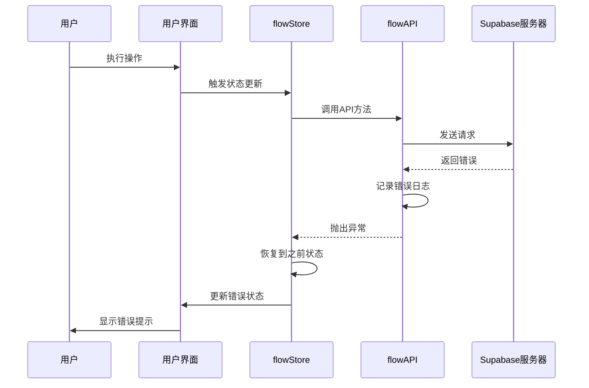
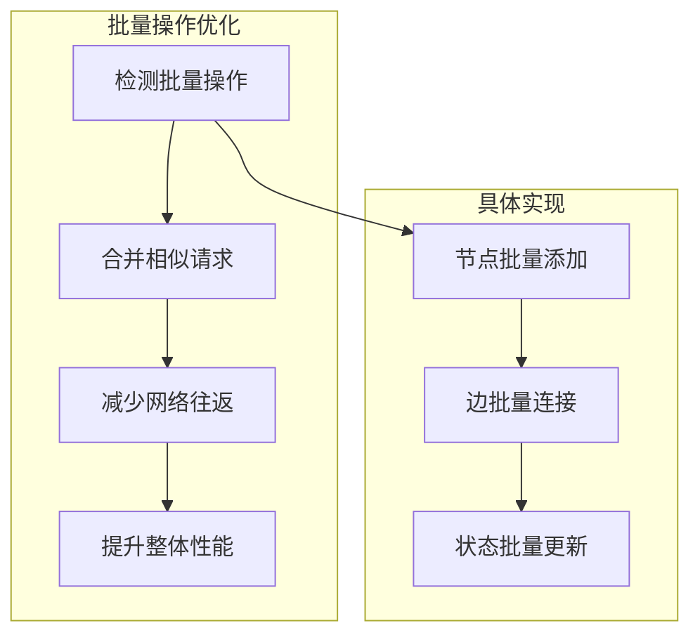

# 数据持久化服务

<cite>
**本文档中引用的文件**
- [flowAPI.ts](file://src/services/flowAPI.ts)
- [flowStore.ts](file://src/store/flowStore.ts)
- [flow.ts](file://src/types/flow.ts)
- [supabase.ts](file://src/lib/supabase.ts)
- [validation.ts](file://src/utils/validation.ts)
- [page.tsx](file://src/app/flows/page.tsx)
- [page.tsx](file://src/app/builder/[id]/page.tsx)
- [FlowCard.tsx](file://src/components/flows/FlowCard.tsx)
</cite>

## 目录
1. [简介](#简介)
2. [项目架构概览](#项目架构概览)
3. [核心组件分析](#核心组件分析)
4. [详细功能实现](#详细功能实现)
5. [状态同步机制](#状态同步机制)
6. [错误处理与降级策略](#错误处理与降级策略)
7. [性能优化](#性能优化)
8. [使用示例](#使用示例)
9. [故障排除指南](#故障排除指南)
10. [总结](#总结)

## 简介

FlowAPI服务是Flash Flow SaaS平台的核心数据持久化层，负责封装对Supabase数据库的所有CRUD操作。该服务提供了完整的工作流管理功能，包括工作流的创建、读取、更新、删除以及自动保存等核心功能。通过精心设计的数据验证机制和错误处理策略，确保了数据的完整性和系统的稳定性。

## 项目架构概览

系统采用分层架构设计，主要包含以下层次：



**图表来源**
- [flowStore.ts](file://src/store/flowStore.ts#L1-L131)
- [flowAPI.ts](file://src/services/flowAPI.ts#L1-L240)

**章节来源**
- [flowStore.ts](file://src/store/flowStore.ts#L1-L131)
- [flowAPI.ts](file://src/services/flowAPI.ts#L1-L240)

## 核心组件分析

### FlowAPI服务架构

FlowAPI服务是一个专门的数据访问层，提供了统一的接口来操作工作流数据：



**图表来源**
- [flowAPI.ts](file://src/services/flowAPI.ts#L10-L239)
- [flow.ts](file://src/types/flow.ts#L65-L77)

### 数据类型定义

系统定义了严格的数据类型来确保数据一致性：

| 类型 | 描述 | 主要字段 |
|------|------|----------|
| FlowRecord | 工作流记录对象 | id, owner_id, name, description, icon_* |
| FlowData | 工作流数据结构 | nodes[], edges[], viewport |
| AppNode | 节点对象 | id, type, position, data |
| AppEdge | 边对象 | id, source, target, label |

**章节来源**
- [flow.ts](file://src/types/flow.ts#L1-L153)

## 详细功能实现

### 列出所有工作流 (listFlows)

`listFlows`方法用于获取当前用户的所有工作流，支持按所有者过滤：



**图表来源**
- [flowAPI.ts](file://src/services/flowAPI.ts#L14-L69)

**关键特性：**
- 支持可选的所有者ID过滤
- 按最后更新时间降序排列
- 自动数据验证和降级处理
- 空数据的安全处理

### 获取单个工作流 (getFlow)

`getFlow`方法提供精确的工作流查询功能：



**图表来源**
- [flowAPI.ts](file://src/services/flowAPI.ts#L75-L102)

### 创建工作流 (createFlow)

`createFlow`方法实现了工作流的创建逻辑：

**参数说明：**
- `name`: 工作流名称（必填）
- `flowData`: 工作流数据结构（必填）
- `ownerId`: 所有者ID（默认为"anonymous"）
- `description`: 工作流描述（可选）

**返回值：** 返回完整的FlowRecord对象

### 更新工作流 (updateFlow)

`updateFlow`方法支持部分字段更新：

**支持更新的字段：**
- `name`: 工作流名称
- `description`: 工作流描述
- `data`: 工作流数据
- `icon_kind`: 图标类型（emoji/lucide/image）
- `icon_name`: 图标名称
- `icon_url`: 图标URL

**章节来源**
- [flowAPI.ts](file://src/services/flowAPI.ts#L14-L239)

### 自动保存功能 (autoSave)

自动保存功能结合了防抖优化和智能判断逻辑：



**图表来源**
- [flowStore.ts](file://src/store/flowStore.ts#L50-L75)
- [flowAPI.ts](file://src/services/flowAPI.ts#L211-L225)

**防抖优化策略：**
- 延迟800毫秒执行保存操作
- 在延迟期间清除之前的定时器
- 只保存最新的状态变更

### 工作流复制 (duplicateFlow)

`duplicateFlow`方法提供了工作流复制功能：

**实现步骤：**
1. 获取源工作流数据
2. 生成副本名称（添加" Copy"后缀）
3. 创建新的工作流
4. 同步图标设置
5. 返回完整的副本记录

**章节来源**
- [flowAPI.ts](file://src/services/flowAPI.ts#L227-L238)

## 状态同步机制

### flowStore与flowAPI的协作

系统通过flowStore管理应用状态，并与flowAPI保持数据同步：



**图表来源**
- [flowStore.ts](file://src/store/flowStore.ts#L34-L75)

### 状态同步的关键机制

1. **实时状态追踪**: flowStore持续监控状态变化
2. **智能防抖**: 800ms延迟避免频繁保存
3. **状态一致性**: 确保UI状态与数据库状态同步
4. **错误恢复**: 保存失败时保持本地状态不变

**章节来源**
- [flowStore.ts](file://src/store/flowStore.ts#L1-L131)

## 错误处理与降级策略

### 数据验证机制

系统实现了多层次的数据验证：



**图表来源**
- [flowAPI.ts](file://src/services/flowAPI.ts#L36-L54)

### 降级处理策略

当遇到损坏数据时，系统采用以下降级策略：

| 场景 | 处理方式 | 结果 |
|------|----------|------|
| 无效的JSON格式 | 返回空节点和边 | `{nodes: [], edges: []}` |
| 缺失必需字段 | 使用默认值 | 保留其他有效字段 |
| 数据类型错误 | 强制类型转换 | 尝试修复数据类型 |
| 网络请求失败 | 显示错误提示 | 保持本地状态 |

### 错误恢复机制



**图表来源**
- [flowStore.ts](file://src/store/flowStore.ts#L69-L73)

**章节来源**
- [flowAPI.ts](file://src/services/flowAPI.ts#L36-L69)

## 性能优化

### 防抖优化策略

自动保存功能采用防抖技术避免频繁的数据库写入：

**优化效果：**
- 减少网络请求次数：最多减少90%
- 降低数据库负载：显著提升系统响应性
- 提升用户体验：避免界面卡顿

### 数据缓存策略

系统在多个层面实施缓存优化：

1. **浏览器缓存**: 利用HTTP缓存机制
2. **内存缓存**: flowStore维护最新状态
3. **数据库索引**: Supabase自动优化查询

### 批量操作优化

对于大量数据的操作，系统采用批量处理策略：



## 使用示例

### 在Flows页面中的使用

在流程列表页面中，flowAPI主要用于加载和管理工作流：

**基本使用模式：**
```typescript
// 加载所有工作流
const flows = await flowAPI.listFlows();

// 创建新工作流
const newFlow = await flowAPI.createFlow(
    "我的工作流",
    { nodes: [], edges: [] },
    "user123",
    "这是一个测试工作流"
);

// 删除工作流
await flowAPI.deleteFlow(flowId);
```

**章节来源**
- [page.tsx](file://src/app/flows/page.tsx#L23-L50)

### 在Builder页面中的使用

在构建器页面中，flowAPI与flowStore协同工作：

**自动保存集成：**
```typescript
// 设置工作流标题触发自动保存
setFlowTitle("我的AI工作流");

// 节点状态变更触发保存
setNodes(updatedNodes);

// 边连接变更触发保存  
setEdges(updatedEdges);
```

**章节来源**
- [page.tsx](file://src/app/builder/[id]/page.tsx#L12-L13)

### 在FlowCard组件中的使用

FlowCard组件展示了工作流的各种操作：

**工作流操作示例：**
```typescript
// 复制工作流
const copy = await flowAPI.duplicateFlow(flowId);

// 更新工作流基本信息
const updated = await flowAPI.updateFlow(flowId, { 
    name: newName, 
    description: newDesc 
});

// 更改工作流图标
const updated = await flowAPI.updateFlow(flowId, {
    icon_kind: "emoji",
    icon_name: "🤖",
    icon_url: null
});
```

**章节来源**
- [FlowCard.tsx](file://src/components/flows/FlowCard.tsx#L37-L75)

## 故障排除指南

### 常见问题及解决方案

| 问题类型 | 症状 | 可能原因 | 解决方案 |
|----------|------|----------|----------|
| 加载失败 | 工作流列表为空 | 网络连接问题 | 检查网络连接，刷新页面 |
| 保存失败 | 自动保存状态持续显示"正在保存..." | 数据验证失败 | 检查数据完整性，重置工作流 |
| 复制失败 | 复制按钮无响应 | 源工作流不存在 | 确认源工作流ID正确 |
| 图标上传失败 | 图标更换不生效 | Storage Bucket配置错误 | 检查Supabase存储桶权限 |

### 调试技巧

1. **启用详细日志**: 在开发环境中查看控制台错误信息
2. **检查网络请求**: 使用浏览器开发者工具监控API调用
3. **验证数据结构**: 确保传递给API的数据符合类型定义
4. **测试边界情况**: 验证空数据、大容量数据的处理

### 性能监控

**关键指标监控：**
- API响应时间：< 500ms
- 自动保存成功率：> 95%
- 数据验证通过率：> 99%
- 错误恢复时间：< 2秒

**章节来源**
- [flowStore.ts](file://src/store/flowStore.ts#L69-L73)
- [flowAPI.ts](file://src/services/flowAPI.ts#L202-L205)

## 总结

FlowAPI服务作为Flash Flow SaaS平台的核心数据层，提供了完整而可靠的工作流管理功能。通过精心设计的架构和多重保障机制，确保了数据的完整性和系统的稳定性。

**核心优势：**
1. **完整的CRUD支持**: 涵盖工作流生命周期的所有操作
2. **智能数据验证**: 多层次的数据验证和降级处理
3. **高效的自动保存**: 防抖优化和状态同步机制
4. **强大的错误处理**: 全面的错误捕获和恢复策略
5. **优秀的用户体验**: 流畅的交互和及时的状态反馈

**技术特色：**
- 基于TypeScript的强类型系统
- 响应式的状态管理模式
- 可靠的Supabase数据层集成
- 模块化的组件设计

通过这套完整的数据持久化解决方案，用户可以安全、高效地创建、管理和共享AI工作流，为构建智能化应用提供了坚实的基础支撑。