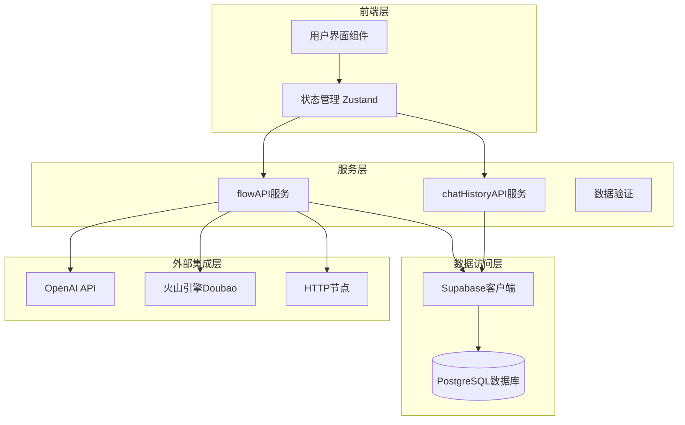
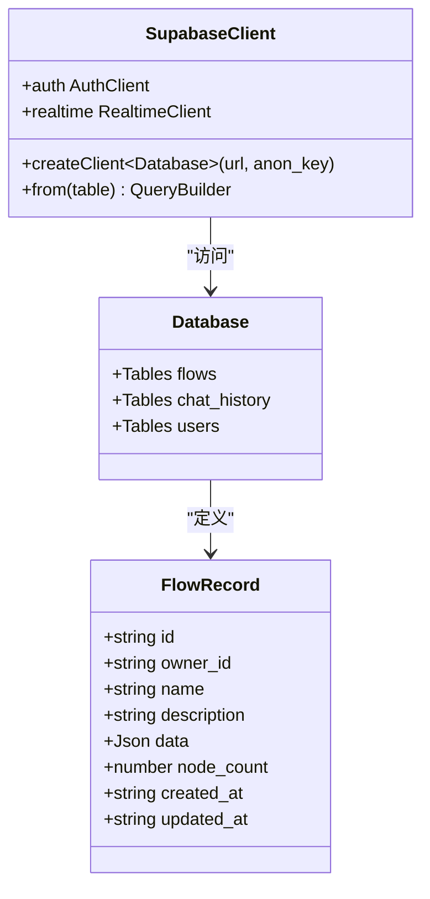
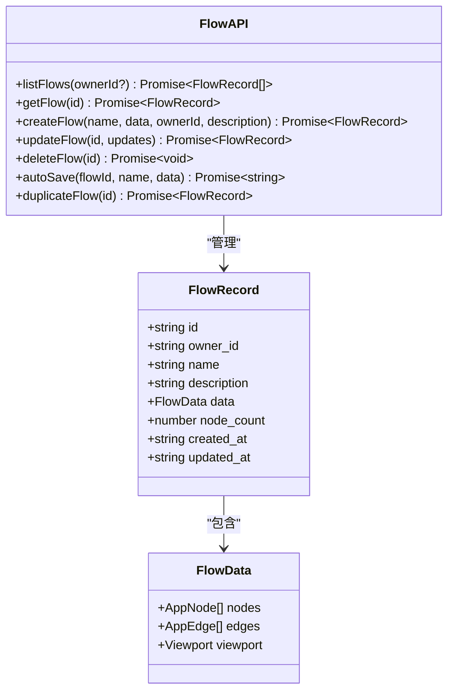
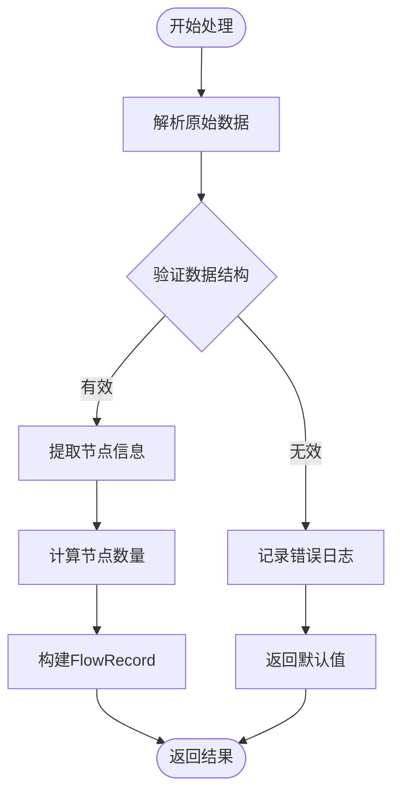
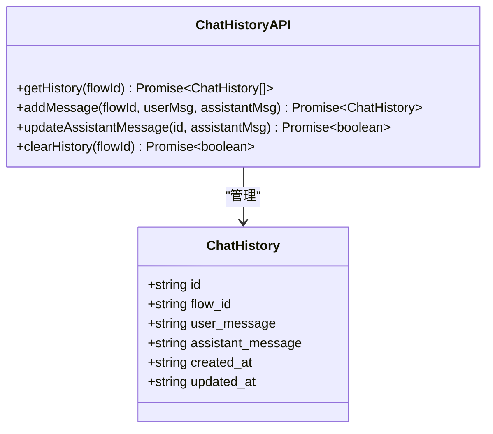
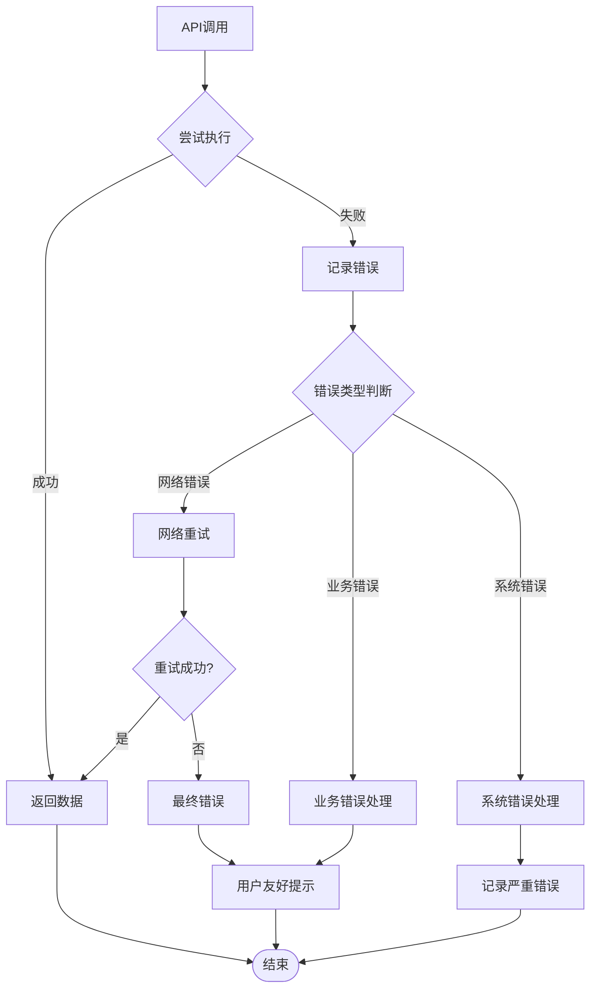
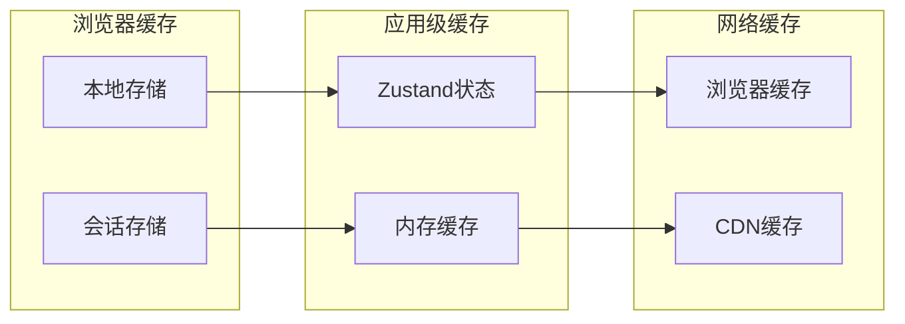
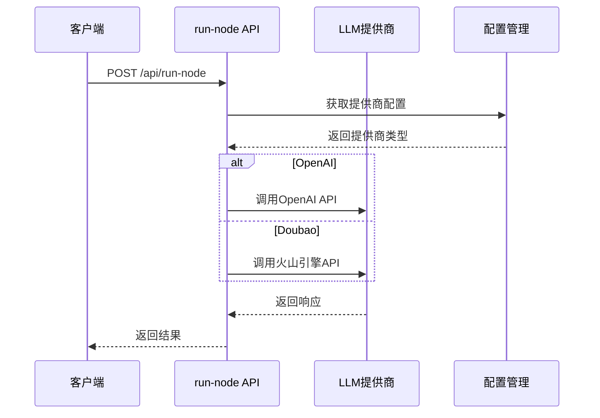
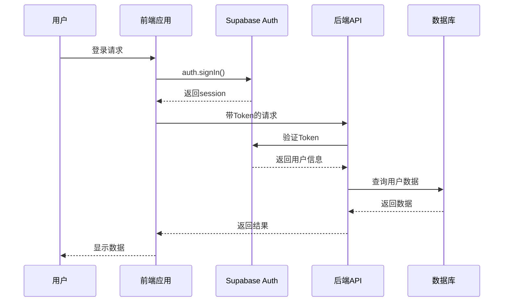

# 服务层与外部集成

<cite>
**本文档中引用的文件**
- [flowAPI.ts](file://src/services/flowAPI.ts)
- [chatHistoryAPI.ts](file://src/services/chatHistoryAPI.ts)
- [supabase.ts](file://src/lib/supabase.ts)
- [database.ts](file://src/types/database.ts)
- [flow.ts](file://src/types/flow.ts)
- [validation.ts](file://src/utils/validation.ts)
- [flowStore.ts](file://src/store/flowStore.ts)
- [executionActions.ts](file://src/store/actions/executionActions.ts)
- [run-node/route.ts](file://src/app/api/run-node/route.ts)
- [plan/route.ts](file://src/app/api/plan/route.ts)
- [health/route.ts](file://src/app/api/health/route.ts)
</cite>

## 目录
1. [简介](#简介)
2. [项目架构概览](#项目架构概览)
3. [Supabase集成设计](#supabase集成设计)
4. [flowAPI服务层详解](#flowapi服务层详解)
5. [chatHistoryAPI服务层详解](#chathistoryapi服务层详解)
6. [错误处理与重试机制](#错误处理与重试机制)
7. [缓存策略与性能优化](#缓存策略与性能优化)
8. [外部API集成](#外部api集成)
9. [安全机制与认证](#安全机制与认证)
10. [服务扩展指南](#服务扩展指南)
11. [最佳实践与建议](#最佳实践与建议)

## 简介

Flash Flow SaaS是一个基于Next.js构建的低代码工作流平台，采用现代化的服务层架构设计。本文档详细阐述了服务层的设计理念、实现方式以及与外部系统的集成策略，重点分析flowAPI和chatHistoryAPI如何封装对Supabase的CRUD操作，并探讨了可扩展性和安全性的实现方案。

## 项目架构概览

系统采用分层架构设计，核心包含以下层次：



**图表来源**
- [flowStore.ts](file://src/store/flowStore.ts#L1-L131)
- [flowAPI.ts](file://src/services/flowAPI.ts#L1-L240)
- [chatHistoryAPI.ts](file://src/services/chatHistoryAPI.ts#L1-L95)

## Supabase集成设计

### 客户端初始化

Supabase客户端采用单例模式，在应用启动时初始化，确保全局一致性：



**图表来源**
- [supabase.ts](file://src/lib/supabase.ts#L1-L18)
- [database.ts](file://src/types/database.ts#L1-L59)

### 数据库类型安全

通过TypeScript泛型确保数据库操作的类型安全：

**章节来源**
- [supabase.ts](file://src/lib/supabase.ts#L1-L18)
- [database.ts](file://src/types/database.ts#L1-L59)

## flowAPI服务层详解

### 核心功能架构

flowAPI提供了完整的工作流数据管理能力，封装了所有CRUD操作：



**图表来源**
- [flowAPI.ts](file://src/services/flowAPI.ts#L10-L240)
- [flow.ts](file://src/types/flow.ts#L59-L77)

### CRUD操作实现

#### 列表查询功能

实现了灵活的查询过滤机制，支持按所有者筛选：

**章节来源**
- [flowAPI.ts](file://src/services/flowAPI.ts#L14-L39)

#### 单条记录查询

提供强类型的单条记录查询，包含完善的错误处理：

**章节来源**
- [flowAPI.ts](file://src/services/flowAPI.ts#L75-L102)

#### 创建操作

支持自动填充元数据，确保数据完整性：

**章节来源**
- [flowAPI.ts](file://src/services/flowAPI.ts#L107-L143)

#### 更新操作

实现了增量更新机制，支持部分字段更新：

**章节来源**
- [flowAPI.ts](file://src/services/flowAPI.ts#L148-L194)

#### 自动保存机制

集成了防抖机制，提升用户体验：

**章节来源**
- [flowAPI.ts](file://src/services/flowAPI.ts#L211-L225)
- [flowStore.ts](file://src/store/flowStore.ts#L49-L75)

### 数据验证与转换

flowAPI内置了完善的数据验证和转换机制：



**图表来源**
- [flowAPI.ts](file://src/services/flowAPI.ts#L36-L69)

**章节来源**
- [flowAPI.ts](file://src/services/flowAPI.ts#L36-L69)

## chatHistoryAPI服务层详解

### 聊天历史管理

chatHistoryAPI专注于对话历史的管理，提供了完整的CRUD操作：



**图表来源**
- [chatHistoryAPI.ts](file://src/services/chatHistoryAPI.ts#L13-L95)

### 操作流程

#### 获取历史记录

按时间顺序排列，支持流式加载：

**章节来源**
- [chatHistoryAPI.ts](file://src/services/chatHistoryAPI.ts#L17-L30)

#### 添加消息

支持用户消息和助手回复的配对存储：

**章节来源**
- [chatHistoryAPI.ts](file://src/services/chatHistoryAPI.ts#L35-L56)

#### 更新助手消息

支持延迟更新，允许逐步完善回复内容：

**章节来源**
- [chatHistoryAPI.ts](file://src/services/chatHistoryAPI.ts#L61-L76)

#### 清理历史

批量删除指定flow的所有历史记录：

**章节来源**
- [chatHistoryAPI.ts](file://src/services/chatHistoryAPI.ts#L81-L94)

## 错误处理与重试机制

### 统一错误处理模式

系统采用分层错误处理策略：



### 错误处理实现

#### flowAPI错误处理

每个CRUD操作都包含详细的错误捕获和日志记录：

**章节来源**
- [flowAPI.ts](file://src/services/flowAPI.ts#L18-L20)
- [flowAPI.ts](file://src/services/flowAPI.ts#L82-L85)
- [flowAPI.ts](file://src/services/flowAPI.ts#L125-L128)

#### chatHistoryAPI错误处理

聊天历史API同样实现了完善的错误处理：

**章节来源**
- [chatHistoryAPI.ts](file://src/services/chatHistoryAPI.ts#L24-L27)
- [chatHistoryAPI.ts](file://src/services/chatHistoryAPI.ts#L50-L53)
- [chatHistoryAPI.ts](file://src/services/chatHistoryAPI.ts#L70-L73)
- [chatHistoryAPI.ts](file://src/services/chatHistoryAPI.ts#L87-L90)

### 重试机制设计

虽然当前实现没有显式的重试逻辑，但可以通过以下方式扩展：

```typescript
// 示例：添加指数退避重试机制
async function retryOperation<T>(
  operation: () => Promise<T>,
  maxRetries: number = 3,
  baseDelay: number = 1000
): Promise<T> {
  let lastError: Error;
  
  for (let i = 0; i < maxRetries; i++) {
    try {
      return await operation();
    } catch (error) {
      lastError = error as Error;
      if (i < maxRetries - 1) {
        const delay = baseDelay * Math.pow(2, i);
        await new Promise(resolve => setTimeout(resolve, delay));
      }
    }
  }
  
  throw lastError!;
}
```

## 缓存策略与性能优化

### 前端缓存策略

系统在多个层面实现了缓存机制：



### 防抖与节流

flowStore实现了智能的自动保存防抖机制：

**章节来源**
- [flowStore.ts](file://src/store/flowStore.ts#L49-L75)

### 数据预加载

对于频繁访问的数据，可以实现预加载策略：

```typescript
// 示例：预加载工作流数据
class DataLoader {
  private cache = new Map<string, FlowRecord>();
  
  async preloadFlows(ownerId: string): Promise<void> {
    const cached = this.cache.get(ownerId);
    if (cached) return;
    
    const flows = await flowAPI.listFlows(ownerId);
    flows.forEach(flow => {
      this.cache.set(flow.id, flow);
    });
  }
}
```

## 外部API集成

### OpenAI集成

系统支持多种LLM提供商的无缝切换：



**图表来源**
- [run-node/route.ts](file://src/app/api/run-node/route.ts#L1-L66)

### HTTP节点集成

支持自定义HTTP请求节点：

**章节来源**
- [run-node/route.ts](file://src/app/api/run-node/route.ts#L1-L66)
- [flow.ts](file://src/types/flow.ts#L39-L42)

### 多提供商支持

系统设计支持多种LLM提供商：

**章节来源**
- [run-node/route.ts](file://src/app/api/run-node/route.ts#L13-L14)
- [executionActions.ts](file://src/store/actions/executionActions.ts#L89-L106)

## 安全机制与认证

### Supabase认证集成

系统利用Supabase提供的完整认证解决方案：



### 访问控制

通过Supabase Row Level Security (RLS) 实现细粒度访问控制：

**章节来源**
- [health/route.ts](file://src/app/api/health/route.ts#L1-L51)

### 数据验证

使用Zod进行输入验证，防止恶意数据注入：

**章节来源**
- [validation.ts](file://src/utils/validation.ts#L1-L28)

### 环境变量保护

敏感信息通过环境变量管理：

**章节来源**
- [supabase.ts](file://src/lib/supabase.ts#L4-L8)
- [run-node/route.ts](file://src/app/api/run-node/route.ts#L31-L35)

## 服务扩展指南

### 添加新的外部API集成

#### 步骤1：创建API适配器

```typescript
// 示例：添加新的LLM提供商
export const newLLMProvider = {
  async call(model: string, messages: Message[], options: RequestOptions) {
    // 实现具体的API调用逻辑
    const response = await fetch('https://api.new-provider.com/v1/chat', {
      method: 'POST',
      headers: {
        'Content-Type': 'application/json',
        'Authorization': `Bearer ${process.env.NEW_PROVIDER_API_KEY}`
      },
      body: JSON.stringify({ model, messages, ...options })
    });
    
    const data = await response.json();
    return data.choices[0].message.content;
  }
};
```

#### 步骤2：更新配置系统

```typescript
// 在运行时配置中添加新提供商
const PROVIDER_CONFIG = {
  openai: {
    name: 'OpenAI',
    endpoint: 'https://api.openai.com/v1/chat/completions',
    apiKey: process.env.OPENAI_API_KEY
  },
  doubao: {
    name: '火山引擎',
    endpoint: 'https://ark.cn-beijing.volces.com/api/v3/chat/completions',
    apiKey: process.env.DOUBAO_API_KEY
  },
  newProvider: {
    name: '新提供商',
    endpoint: 'https://api.new-provider.com/v1/chat',
    apiKey: process.env.NEW_PROVIDER_API_KEY
  }
};
```

#### 步骤3：更新节点类型定义

```typescript
// 扩展NodeKind类型
export type NodeKind =
  | "input"
  | "llm"
  | "rag"
  | "output"
  | "branch"
  | "http"
  | "newProvider"; // 新增提供商节点

// 扩展对应的节点数据接口
export interface NewProviderNodeData extends BaseNodeData {
  model: string;
  systemPrompt: string;
  temperature: number;
}
```

### 实现HTTP节点

#### 节点配置

```typescript
// HTTP节点的默认配置
export function getDefaultHttpNodeData(): HttpNodeData {
  return {
    label: "HTTP",
    method: "GET",
    url: "https://api.example.com",
    status: "idle"
  };
}
```

#### 执行逻辑

```typescript
// HTTP节点的执行逻辑
async function executeHttpNode(node: AppNode, context: FlowContext): Promise<Record<string, unknown>> {
  const httpData = node.data as HttpNodeData;
  const { method, url } = httpData;
  
  try {
    const response = await fetch(url, {
      method,
      headers: {
        'Content-Type': 'application/json'
      },
      body: method !== 'GET' ? JSON.stringify(context) : undefined
    });
    
    const data = await response.json();
    return { status: response.status, data };
  } catch (error) {
    return { error: error.message };
  }
}
```

### 扩展数据验证

#### 添加新的验证规则

```typescript
// 扩展验证模式
export const HttpNodeSchema = z.object({
  method: z.enum(['GET', 'POST', 'PUT', 'DELETE', 'PATCH']),
  url: z.string().url(),
  headers: z.record(z.string()).optional(),
  body: z.any().optional()
});

// 在节点验证中添加HTTP节点验证
export const NodeSchema = z.object({
  id: z.string(),
  type: z.enum([
    "input", 
    "llm", 
    "rag", 
    "http", // 新增HTTP节点类型
    "output", 
    "branch"
  ]),
  position: z.object({
    x: z.number(),
    y: z.number(),
  }),
  data: z.union([
    InputNodeSchema,
    LLMNodeSchema,
    RagNodeSchema,
    HttpNodeSchema, // 新增HTTP节点验证
    OutputNodeSchema,
    BranchNodeSchema
  ]),
});
```

### 性能监控集成

#### 添加性能指标收集

```typescript
// 性能监控服务
class PerformanceMonitor {
  private metrics = new Map<string, number[]>();
  
  recordMetric(operation: string, duration: number): void {
    const ops = this.metrics.get(operation) || [];
    ops.push(duration);
    this.metrics.set(operation, ops);
    
    // 保持最近100次记录
    if (ops.length > 100) {
      ops.shift();
    }
  }
  
  getAverageDuration(operation: string): number {
    const ops = this.metrics.get(operation) || [];
    if (ops.length === 0) return 0;
    
    const sum = ops.reduce((a, b) => a + b, 0);
    return sum / ops.length;
  }
}

// 在API调用中集成监控
const monitor = new PerformanceMonitor();

async function monitoredAPICall<T>(
  operation: string, 
  apiCall: () => Promise<T>
): Promise<T> {
  const start = performance.now();
  try {
    const result = await apiCall();
    const duration = performance.now() - start;
    monitor.recordMetric(operation, duration);
    return result;
  } catch (error) {
    const duration = performance.now() - start;
    monitor.recordMetric(`${operation}_error`, duration);
    throw error;
  }
}
```

## 最佳实践与建议

### 代码组织原则

1. **单一职责原则**：每个服务类只负责特定的功能领域
2. **依赖注入**：通过构造函数注入依赖，提高可测试性
3. **接口隔离**：定义清晰的接口边界，避免过度耦合

### 错误处理最佳实践

1. **分层错误处理**：在不同层级采用不同的错误处理策略
2. **用户友好的错误信息**：向用户显示易于理解的错误信息
3. **详细的日志记录**：记录足够的上下文信息用于问题排查

### 性能优化建议

1. **合理使用缓存**：在适当的地方引入缓存机制
2. **批量操作**：尽可能合并多个API调用
3. **懒加载**：按需加载数据，减少初始加载时间

### 安全考虑

1. **输入验证**：严格验证所有用户输入
2. **权限检查**：确保用户只能访问授权资源
3. **敏感信息保护**：妥善保管API密钥等敏感信息

### 可扩展性设计

1. **插件架构**：设计可插拔的模块化架构
2. **配置驱动**：通过配置文件控制行为
3. **版本兼容**：保持API的向后兼容性

通过遵循这些最佳实践，可以构建出既强大又灵活的服务层架构，为Flash Flow SaaS平台提供稳定可靠的技术支撑。