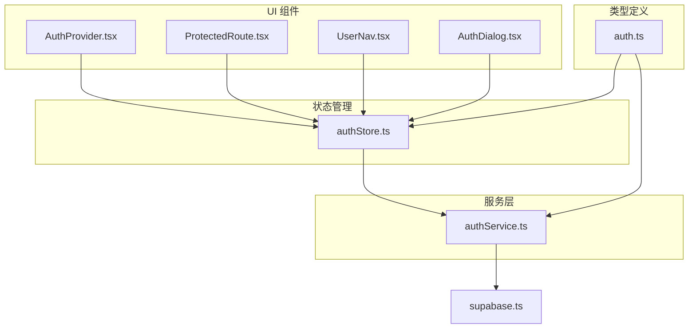
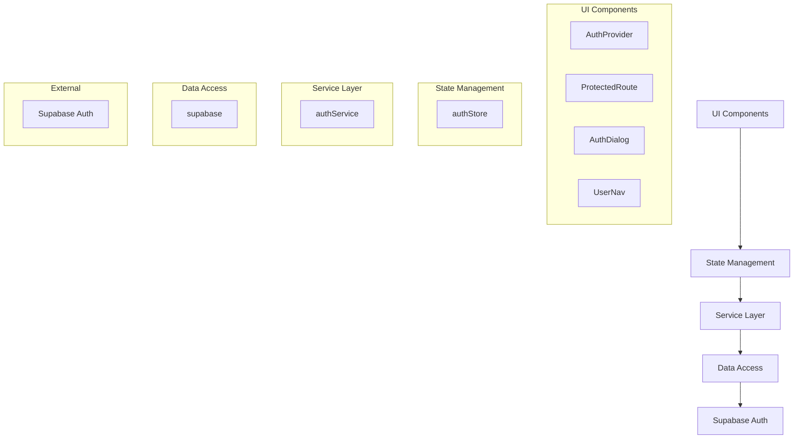
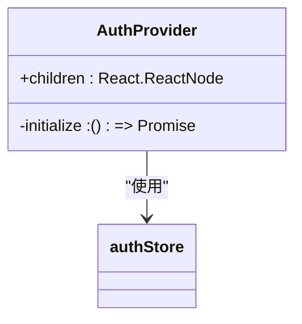
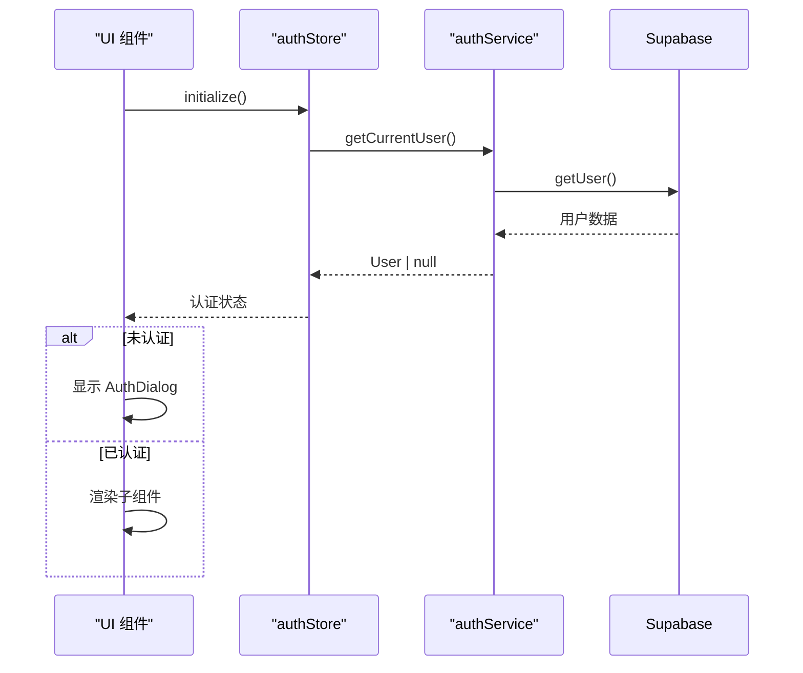
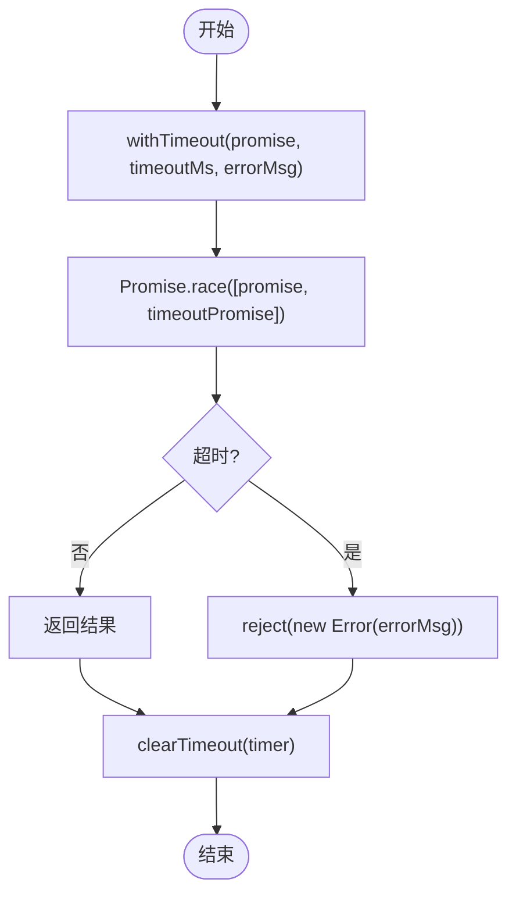
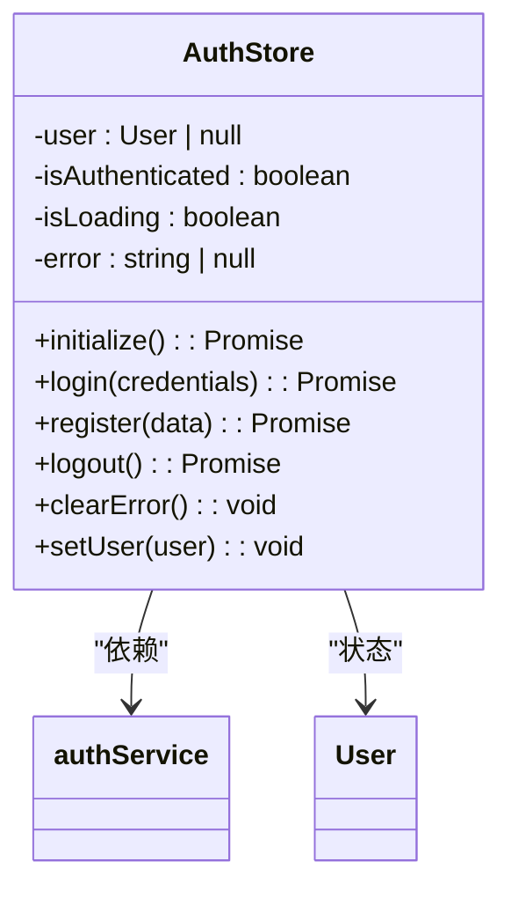
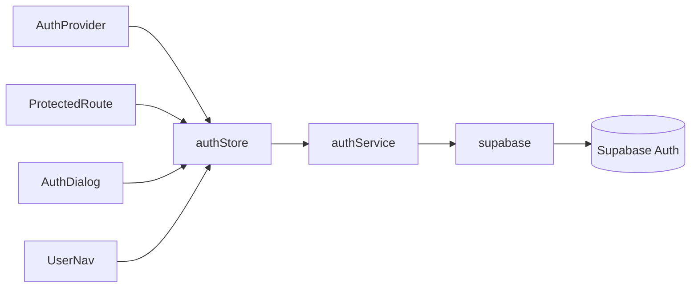

# 认证系统

<cite>
**本文档引用的文件**
- [AuthProvider.tsx](file://src/components/auth/AuthProvider.tsx)
- [ProtectedRoute.tsx](file://src/components/auth/ProtectedRoute.tsx)
- [AuthDialog.tsx](file://src/components/auth/AuthDialog.tsx)
- [UserNav.tsx](file://src/components/auth/UserNav.tsx)
- [authService.ts](file://src/services/authService.ts)
- [authStore.ts](file://src/store/authStore.ts)
- [auth.ts](file://src/types/auth.ts)
- [supabase.ts](file://src/lib/supabase.ts)
</cite>

## 目录
1. [简介](#简介)
2. [项目结构](#项目结构)
3. [核心组件](#核心组件)
4. [架构概述](#架构概述)
5. [详细组件分析](#详细组件分析)
6. [依赖分析](#依赖分析)
7. [性能考虑](#性能考虑)
8. [故障排除指南](#故障排除指南)
9. [结论](#结论)

## 简介
认证系统是 Flash Flow 平台的核心安全模块，负责用户身份验证、会话管理和访问控制。该系统基于 Supabase Auth 构建，提供完整的登录、注册、登出功能，并与配额管理系统集成，确保平台资源的安全使用。

## 项目结构
认证系统主要分布在 `src/components/auth`、`src/services` 和 `src/store` 目录中，形成清晰的分层架构。

**图示来源**
- [AuthProvider.tsx](file://src/components/auth/AuthProvider.tsx)
- [ProtectedRoute.tsx](file://src/components/auth/ProtectedRoute.tsx)
- [AuthDialog.tsx](file://src/components/auth/AuthDialog.tsx)
- [UserNav.tsx](file://src/components/auth/UserNav.tsx)
- [authService.ts](file://src/services/authService.ts)
- [authStore.ts](file://src/store/authStore.ts)
- [auth.ts](file://src/types/auth.ts)
- [supabase.ts](file://src/lib/supabase.ts)

**本节来源**
- [src/components/auth](file://src/components/auth)
- [src/services/authService.ts](file://src/services/authService.ts)
- [src/store/authStore.ts](file://src/store/authStore.ts)

## 核心组件
认证系统由四个核心组件构成：AuthProvider 提供全局认证上下文，ProtectedRoute 实现路由保护，AuthDialog 提供统一的登录/注册界面，UserNav 显示用户状态和配额信息。这些组件通过 authStore 统一管理状态，确保整个应用的认证状态一致性。

**本节来源**
- [AuthProvider.tsx](file://src/components/auth/AuthProvider.tsx)
- [ProtectedRoute.tsx](file://src/components/auth/ProtectedRoute.tsx)
- [AuthDialog.tsx](file://src/components/auth/AuthDialog.tsx)
- [UserNav.tsx](file://src/components/auth/UserNav.tsx)

## 架构概述
认证系统采用分层架构设计，从上至下分为 UI 组件层、状态管理层、服务层和数据访问层。这种设计实现了关注点分离，提高了代码的可维护性和可测试性。

**图示来源**
- [AuthProvider.tsx](file://src/components/auth/AuthProvider.tsx)
- [ProtectedRoute.tsx](file://src/components/auth/ProtectedRoute.tsx)
- [authStore.ts](file://src/store/authStore.ts)
- [authService.ts](file://src/services/authService.ts)
- [supabase.ts](file://src/lib/supabase.ts)

## 详细组件分析

### AuthProvider 分析
AuthProvider 组件在应用启动时初始化认证状态，监听认证状态变化，为整个应用提供认证上下文。

**图示来源**
- [AuthProvider.tsx](file://src/components/auth/AuthProvider.tsx)
- [authStore.ts](file://src/store/authStore.ts)

**本节来源**
- [AuthProvider.tsx](file://src/components/auth/AuthProvider.tsx)

### ProtectedRoute 分析
ProtectedRoute 组件保护需要认证才能访问的页面，未认证用户将被重定向到登录对话框。

**图示来源**
- [ProtectedRoute.tsx](file://src/components/auth/ProtectedRoute.tsx)
- [authStore.ts](file://src/store/authStore.ts)
- [authService.ts](file://src/services/authService.ts)

**本节来源**
- [ProtectedRoute.tsx](file://src/components/auth/ProtectedRoute.tsx)

### AuthService 分析
AuthService 封装了所有与 Supabase Auth 的交互，提供超时控制和错误处理。

**图示来源**
- [authService.ts](file://src/services/authService.ts)

**本节来源**
- [authService.ts](file://src/services/authService.ts)

### AuthStore 分析
authStore 使用 Zustand 管理认证状态，提供初始化、登录、注册、登出等操作。

**图示来源**
- [authStore.ts](file://src/store/authStore.ts)
- [authService.ts](file://src/services/authService.ts)
- [auth.ts](file://src/types/auth.ts)

**本节来源**
- [authStore.ts](file://src/store/authStore.ts)

## 依赖分析
认证系统依赖于 Supabase Auth 服务进行用户管理，通过 supabase.ts 提供的客户端实例进行通信。各组件之间通过清晰的依赖关系协同工作。

**图示来源**
- [AuthProvider.tsx](file://src/components/auth/AuthProvider.tsx)
- [ProtectedRoute.tsx](file://src/components/auth/ProtectedRoute.tsx)
- [AuthDialog.tsx](file://src/components/auth/AuthDialog.tsx)
- [UserNav.tsx](file://src/components/auth/UserNav.tsx)
- [authStore.ts](file://src/store/authStore.ts)
- [authService.ts](file://src/services/authService.ts)
- [supabase.ts](file://src/lib/supabase.ts)

**本节来源**
- [src/components/auth](file://src/components/auth)
- [src/services/authService.ts](file://src/services/authService.ts)
- [src/store/authStore.ts](file://src/store/authStore.ts)
- [src/lib/supabase.ts](file://src/lib/supabase.ts)

## 性能考虑
认证系统在性能方面进行了多项优化：使用 withTimeout 方法防止请求无限等待，通过 onAuthStateChange 监听器实现状态的实时同步，避免频繁的 API 调用。此外，状态管理采用 Zustand，确保了高效的重新渲染。

## 故障排除指南
当遇到认证相关问题时，请按以下步骤排查：
1. 检查环境变量 NEXT_PUBLIC_SUPABASE_URL 和 NEXT_PUBLIC_SUPABASE_ANON_KEY 是否正确配置
2. 确认 Supabase 项目中的 Auth 设置是否启用邮箱/密码登录
3. 检查浏览器控制台是否有网络请求错误
4. 验证用户是否已确认邮箱（email_confirmed 字段）

**本节来源**
- [authService.ts](file://src/services/authService.ts)
- [authStore.ts](file://src/store/authStore.ts)
- [supabase.ts](file://src/lib/supabase.ts)

## 结论
Flash Flow 的认证系统设计合理，层次分明，通过组件化和状态管理实现了高内聚低耦合。系统安全性高，用户体验良好，为平台的稳定运行提供了坚实的基础。