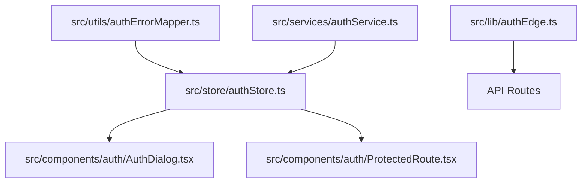
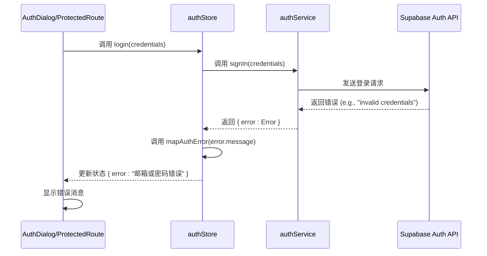
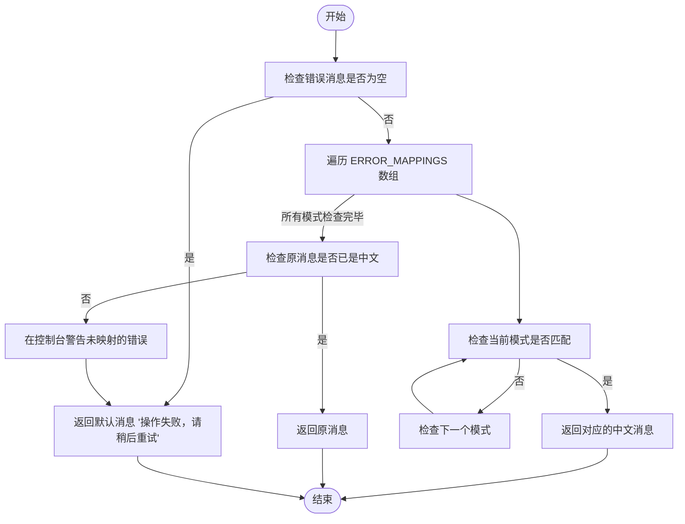
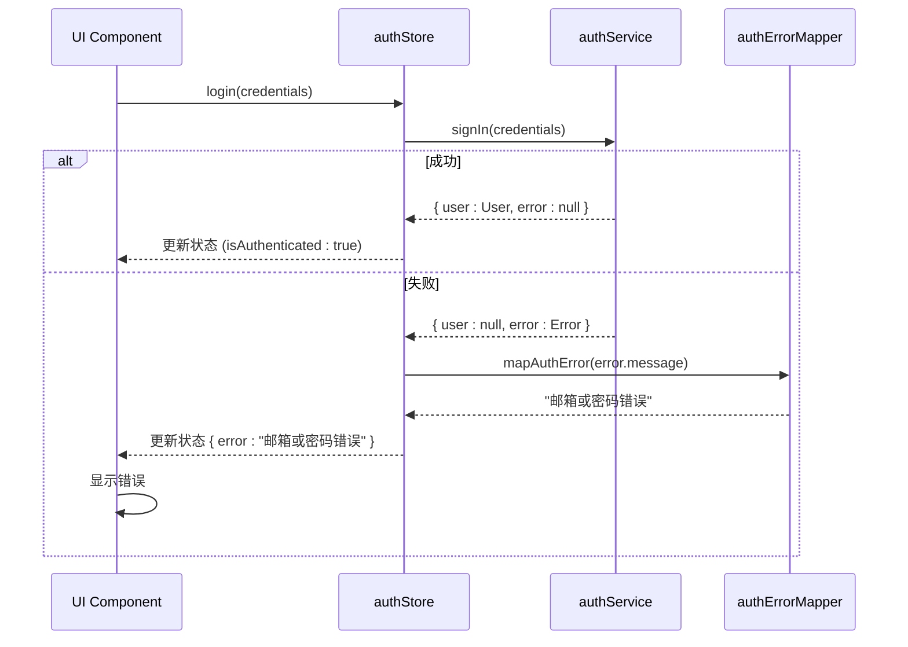
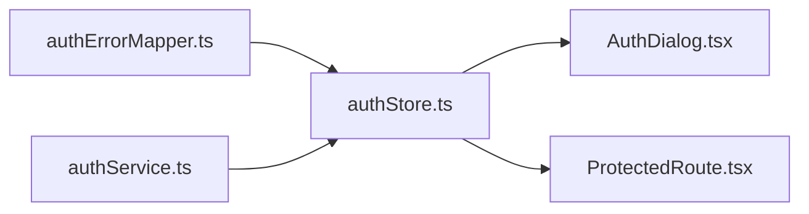

# 认证错误映射器

<cite>
**本文档引用的文件**   
- [authErrorMapper.ts](file://src/utils/authErrorMapper.ts)
- [authStore.ts](file://src/store/authStore.ts)
- [authService.ts](file://src/services/authService.ts)
- [AuthDialog.tsx](file://src/components/auth/AuthDialog.tsx)
- [ProtectedRoute.tsx](file://src/components/auth/ProtectedRoute.tsx)
- [authEdge.ts](file://src/lib/authEdge.ts)
- [auth.ts](file://src/types/auth.ts)
</cite>

## 目录
1. [简介](#简介)
2. [项目结构](#项目结构)
3. [核心组件](#核心组件)
4. [架构概述](#架构概述)
5. [详细组件分析](#详细组件分析)
6. [依赖分析](#依赖分析)
7. [性能考虑](#性能考虑)
8. [故障排除指南](#故障排除指南)
9. [结论](#结论)
10. [附录](#附录)（如有必要）

## 简介
认证错误映射器是 Flash Flow 项目中的一个关键工具，负责将 Supabase 认证系统返回的英文错误消息转换为用户友好的中文提示。该模块通过预定义的错误模式匹配机制，确保用户在登录、注册、密码重置等操作中遇到问题时，能够获得清晰、准确的中文错误信息，从而提升整体用户体验。该映射器被广泛集成于前端状态管理、服务层和用户界面组件中，是保障应用国际化和用户友好性的核心组成部分。

## 项目结构
认证错误映射功能主要分布在项目的 `utils`、`store`、`services` 和 `components` 目录中。其核心逻辑位于 `src/utils/authErrorMapper.ts`，并通过 `authStore` 进行调用，最终在 `AuthDialog` 等 UI 组件中呈现给用户。

**Diagram sources**
- [authErrorMapper.ts](file://src/utils/authErrorMapper.ts)
- [authStore.ts](file://src/store/authStore.ts)
- [AuthDialog.tsx](file://src/components/auth/AuthDialog.tsx)
- [ProtectedRoute.tsx](file://src/components/auth/ProtectedRoute.tsx)
- [authService.ts](file://src/services/authService.ts)
- [authEdge.ts](file://src/lib/authEdge.ts)

**Section sources**
- [authErrorMapper.ts](file://src/utils/authErrorMapper.ts)
- [authStore.ts](file://src/store/authStore.ts)
- [authService.ts](file://src/services/authService.ts)
- [AuthDialog.tsx](file://src/components/auth/AuthDialog.tsx)
- [ProtectedRoute.tsx](file://src/components/auth/ProtectedRoute.tsx)
- [authEdge.ts](file://src/lib/authEdge.ts)

## 核心组件
认证错误映射器的核心是一个名为 `mapAuthError` 的函数，它接收原始的错误消息作为输入，并返回一个预定义的、用户友好的中文错误提示。该函数通过遍历一个包含正则表达式和字符串模式的映射表 `ERROR_MAPPINGS` 来实现错误消息的转换。此机制被 `authStore` 中的多个异步操作（如登录、注册、发送验证码等）所调用，以确保所有来自 `authService` 的错误都能被正确地本地化。

**Section sources**
- [authErrorMapper.ts](file://src/utils/authErrorMapper.ts#L58-L82)
- [authStore.ts](file://src/store/authStore.ts#L88-L101)

## 架构概述
整个认证错误处理流程遵循一个清晰的分层架构。最底层是 `authService`，它直接与 Supabase API 交互并可能抛出原始的英文错误。中间层是 `authStore`，它调用 `authService` 并在捕获到错误后，立即使用 `mapAuthError` 函数将错误消息转换为中文。最上层是 `AuthDialog` 和 `ProtectedRoute` 等 UI 组件，它们订阅 `authStore` 的状态，一旦 `error` 状态被更新，就会将转换后的中文错误消息展示给用户。这种分层设计实现了关注点分离，使得错误处理逻辑集中且易于维护。

**Diagram sources**
- [authService.ts](file://src/services/authService.ts#L62-L85)
- [authStore.ts](file://src/store/authStore.ts#L82-L109)
- [AuthDialog.tsx](file://src/components/auth/AuthDialog.tsx#L116-L186)

## 详细组件分析

### 认证错误映射器分析
`authErrorMapper.ts` 文件是整个错误本地化机制的核心。它定义了一个详尽的 `ERROR_MAPPINGS` 数组，其中包含了从常见 Supabase 错误模式到中文消息的映射。这些模式涵盖了凭证错误、用户存在性、密码强度、OTP 验证、速率限制、会话过期和网络问题等多个方面。

#### 错误映射逻辑

**Diagram sources**
- [authErrorMapper.ts](file://src/utils/authErrorMapper.ts#L58-L82)

**Section sources**
- [authErrorMapper.ts](file://src/utils/authErrorMapper.ts#L1-L93)

### 认证存储分析
`authStore.ts` 是连接错误映射器和用户界面的桥梁。它使用 Zustand 库管理应用的认证状态，包括用户信息、加载状态和错误消息。每当一个认证操作（如 `login`、`sendSignUpOtp`）失败时，`authStore` 会捕获来自 `authService` 的错误对象，并立即调用 `mapAuthError` 函数来处理错误消息。

#### 认证操作中的错误处理

**Diagram sources**
- [authStore.ts](file://src/store/authStore.ts#L82-L109)
- [authErrorMapper.ts](file://src/utils/authErrorMapper.ts#L58-L82)

**Section sources**
- [authStore.ts](file://src/store/authStore.ts#L6-L41)

## 依赖分析
认证错误映射器的依赖关系清晰且单一。其主要依赖是 `authStore`，后者在处理认证流程中的错误时会调用它。`authStore` 本身又依赖于 `authService` 来执行实际的认证操作。UI 组件（如 `AuthDialog`）则依赖 `authStore` 的状态来决定是否显示错误消息。这种依赖链确保了错误处理逻辑的集中化，避免了在多个组件中重复实现相同的映射逻辑。

**Diagram sources**
- [authErrorMapper.ts](file://src/utils/authErrorMapper.ts)
- [authStore.ts](file://src/store/authStore.ts)
- [AuthDialog.tsx](file://src/components/auth/AuthDialog.tsx)
- [ProtectedRoute.tsx](file://src/components/auth/ProtectedRoute.tsx)
- [authService.ts](file://src/services/authService.ts)

**Section sources**
- [authErrorMapper.ts](file://src/utils/authErrorMapper.ts)
- [authStore.ts](file://src/store/authStore.ts)

## 性能考虑
认证错误映射器的设计具有很高的性能效率。其核心函数 `mapAuthError` 是一个同步的、纯函数，执行时间极短。错误映射表 `ERROR_MAPPINGS` 是一个静态数组，其大小固定，遍历开销可以忽略不计。由于错误处理不是高频操作，该模块对应用整体性能的影响微乎其微。其设计优先考虑了可维护性和准确性，而非极致的性能优化，这在当前的使用场景下是完全合理的。

## 故障排除指南
当用户在认证过程中遇到问题时，应首先检查 `authErrorMapper.ts` 中的 `ERROR_MAPPINGS` 表是否覆盖了该场景。如果出现未映射的英文错误消息，说明 `ERROR_MAPPINGS` 表中缺少相应的条目。此时，应在 `console.warn` 的日志中找到具体的错误消息，然后在 `ERROR_MAPPINGS` 数组中添加一个新的映射项。例如，如果日志显示 `"[mapAuthError] Unmapped error: email not confirmed"`，则应添加 `{ pattern: /email.*not.*confirmed/i, message: "邮箱未验证，请查收邮件完成验证" }`。

**Section sources**
- [authErrorMapper.ts](file://src/utils/authErrorMapper.ts#L80-L81)
- [authStore.ts](file://src/store/authStore.ts)

## 结论
认证错误映射器是 Flash Flow 项目中一个虽小但至关重要的模块。它通过简洁而有效的模式匹配机制，成功地将技术性的英文错误转换为用户友好的中文提示，极大地提升了应用的可用性和用户体验。其与 `authStore` 的紧密集成，确保了错误处理逻辑的统一和集中，是项目中实现国际化和用户关怀的一个典范。该设计模式清晰，易于维护和扩展，为未来可能增加的其他语言支持奠定了良好的基础。