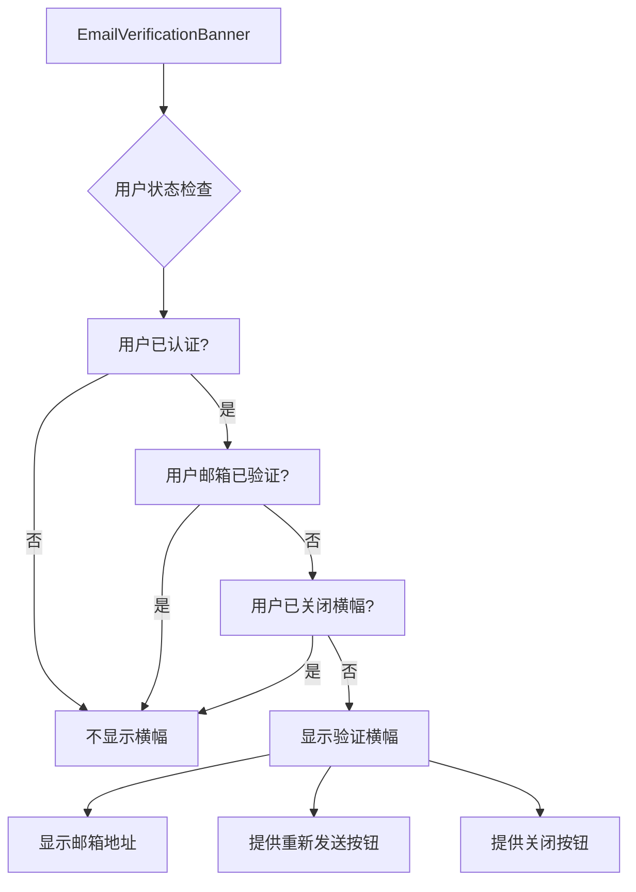
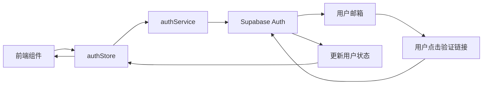

# 邮箱验证检查钩子

<cite>
**本文档引用文件**   
- [useRequireEmailVerified.ts](file://src/hooks/useRequireEmailVerified.ts)
- [EmailVerificationBanner.tsx](file://src/components/auth/EmailVerificationBanner.tsx)
- [authService.ts](file://src/services/authService.ts)
- [authStore.ts](file://src/store/authStore.ts)
- [ProtectedRoute.tsx](file://src/components/auth/ProtectedRoute.tsx)
</cite>

## 目录
1. [简介](#简介)
2. [核心功能分析](#核心功能分析)
3. [邮箱验证检查钩子实现](#邮箱验证检查钩子实现)
4. [相关组件分析](#相关组件分析)
5. [认证服务与状态管理](#认证服务与状态管理)
6. [使用场景与流程](#使用场景与流程)
7. [总结](#总结)

## 简介

"邮箱验证检查钩子"是Flash Flow应用中的一个重要功能组件，用于确保用户在执行关键操作前已完成邮箱验证。该功能通过React Hook的形式实现，为应用提供了统一的邮箱验证检查机制。本文档将深入分析该功能的实现原理、相关组件以及在整个应用中的作用。

**Section sources**
- [useRequireEmailVerified.ts](file://src/hooks/useRequireEmailVerified.ts)

## 核心功能分析

邮箱验证检查钩子（useRequireEmailVerified）是一个自定义React Hook，其主要功能是检查当前用户的邮箱验证状态，并在必要时阻止未验证邮箱的用户执行特定操作。该钩子提供了两种使用方式：一种是通过`requireVerification`高阶函数包装需要验证的操作，另一种是通过`checkVerification`方法手动检查验证状态。

该功能的设计考虑了用户体验，当用户未验证邮箱时，会显示友好的提示信息，引导用户完成验证。同时，该钩子还处理了用户未登录的情况，确保了应用的安全性。

**Section sources**
- [useRequireEmailVerified.ts](file://src/hooks/useRequireEmailVerified.ts)

## 邮箱验证检查钩子实现

```mermaid
flowchart TD
A[useRequireEmailVerified Hook] --> B[从authStore获取用户状态]
B --> C{用户是否已认证?}
C --> |否| D[显示"请先登录"提示]
C --> |是| E{邮箱是否已验证?}
E --> |否| F[显示"请验证邮箱"提示]
E --> |是| G[允许执行操作]
D --> H[阻止操作执行]
F --> H
G --> I[执行原操作]
```

**Diagram sources**
- [useRequireEmailVerified.ts](file://src/hooks/useRequireEmailVerified.ts)

**Section sources**
- [useRequireEmailVerified.ts](file://src/hooks/useRequireEmailVerified.ts)

## 相关组件分析

### 邮箱验证横幅组件

邮箱验证横幅组件（EmailVerificationBanner）在用户未验证邮箱时显示一个醒目的提示横幅。该组件会显示用户的邮箱地址，并提供重新发送验证邮件的功能。用户可以选择关闭横幅，但下次访问时如果邮箱仍未验证，横幅会再次显示。



**Diagram sources**
- [EmailVerificationBanner.tsx](file://src/components/auth/EmailVerificationBanner.tsx)

### 受保护路由组件

受保护路由组件（ProtectedRoute）确保只有经过身份验证的用户才能访问特定页面。该组件在渲染子组件前会检查用户的认证状态，如果用户未登录，则会显示登录对话框。

**Section sources**
- [EmailVerificationBanner.tsx](file://src/components/auth/EmailVerificationBanner.tsx)
- [ProtectedRoute.tsx](file://src/components/auth/ProtectedRoute.tsx)

## 认证服务与状态管理

### 认证服务

认证服务（authService）提供了发送和验证邮箱验证码的功能。`resendVerificationEmail`方法用于重新发送验证邮件，`sendSignUpOtp`方法用于发送注册/登录验证码。

### 状态管理

认证状态管理（authStore）使用Zustand库管理应用的认证状态。`resendVerification`方法用于触发重新发送验证邮件的操作，该方法会调用认证服务的相应功能。



**Diagram sources**
- [authService.ts](file://src/services/authService.ts)
- [authStore.ts](file://src/store/authStore.ts)

**Section sources**
- [authService.ts](file://src/services/authService.ts)
- [authStore.ts](file://src/store/authStore.ts)

## 使用场景与流程

1. **用户注册/登录流程**：用户通过邮箱验证码完成注册或登录
2. **功能访问控制**：关键功能（如创建工作流）需要邮箱验证后才能使用
3. **持续提醒**：未验证用户会持续收到验证提醒，直到完成验证
4. **重新发送机制**：提供便捷的重新发送验证邮件功能

该功能确保了用户身份的真实性，同时通过友好的用户界面引导用户完成验证过程，平衡了安全性和用户体验。

**Section sources**
- [useRequireEmailVerified.ts](file://src/hooks/useRequireEmailVerified.ts)
- [EmailVerificationBanner.tsx](file://src/components/auth/EmailVerificationBanner.tsx)

## 总结

邮箱验证检查钩子是Flash Flow应用中保障用户身份真实性的重要安全机制。通过自定义Hook的形式，该功能实现了代码的复用性和易用性。结合邮箱验证横幅和受保护路由，形成了完整的邮箱验证体系，既保证了应用的安全性，又提供了良好的用户体验。

该实现展示了现代前端应用中常见的认证模式：使用状态管理库集中管理认证状态，通过自定义Hook封装业务逻辑，利用组件化思想构建可复用的UI元素。这种架构设计使得代码结构清晰，易于维护和扩展。

**Section sources**
- [useRequireEmailVerified.ts](file://src/hooks/useRequireEmailVerified.ts)
- [EmailVerificationBanner.tsx](file://src/components/auth/EmailVerificationBanner.tsx)
- [authService.ts](file://src/services/authService.ts)
- [authStore.ts](file://src/store/authStore.ts)
- [ProtectedRoute.tsx](file://src/components/auth/ProtectedRoute.tsx)