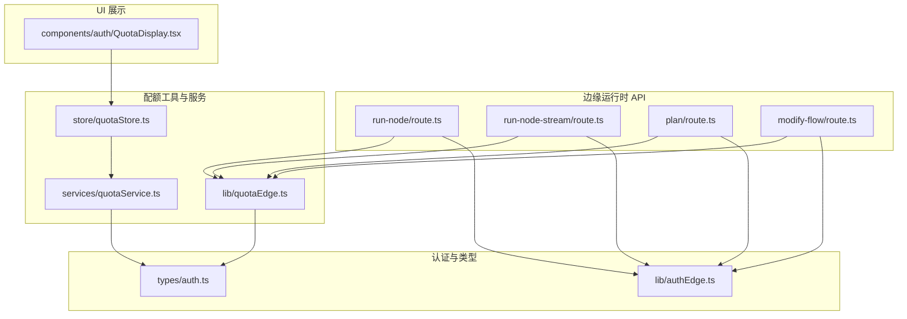
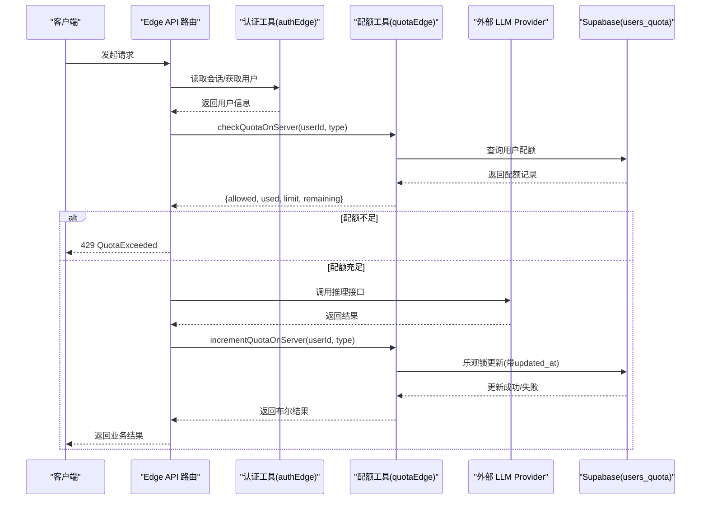
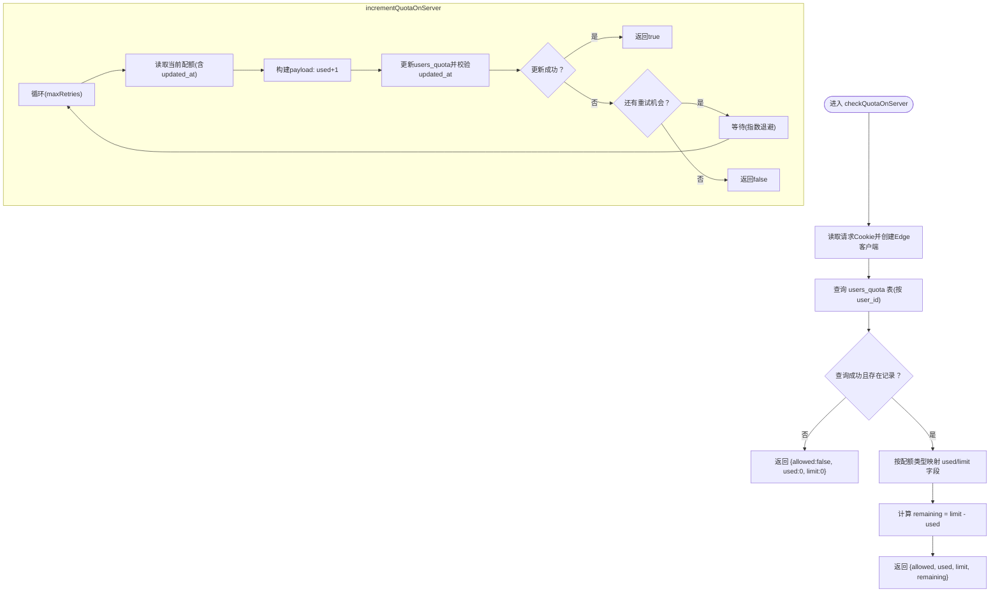
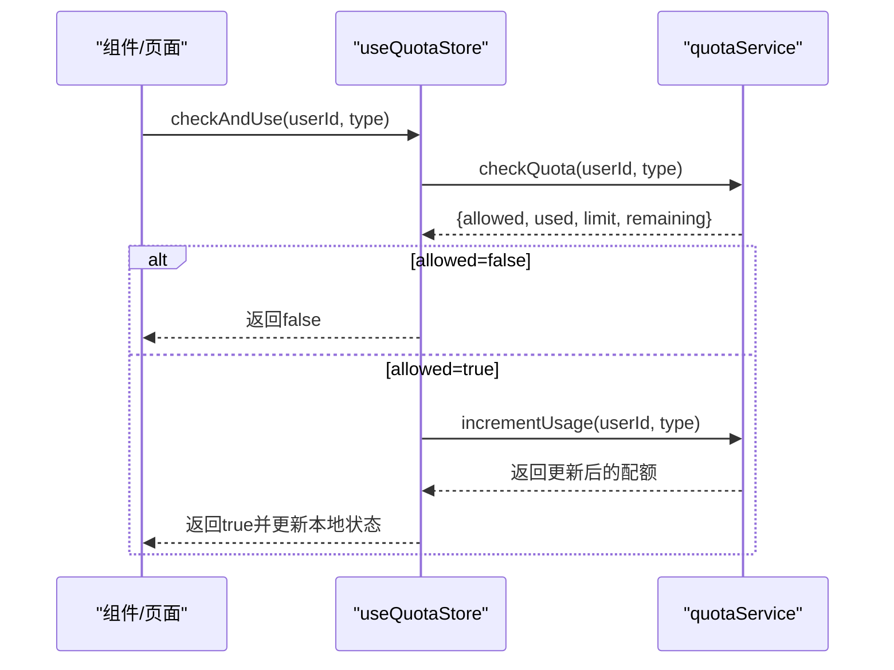
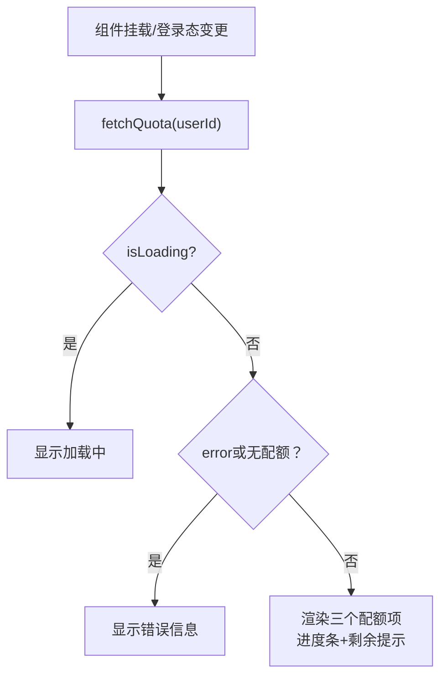
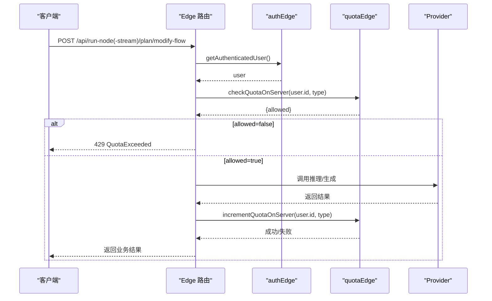
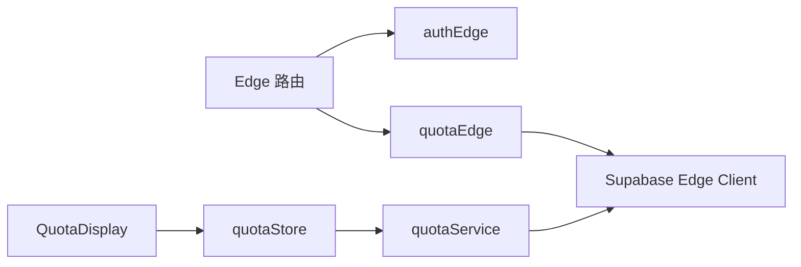

# 边缘运行时配额管理

<cite>
**本文引用的文件**
- [src/lib/quotaEdge.ts](file://src/lib/quotaEdge.ts)
- [src/services/quotaService.ts](file://src/services/quotaService.ts)
- [src/store/quotaStore.ts](file://src/store/quotaStore.ts)
- [src/components/auth/QuotaDisplay.tsx](file://src/components/auth/QuotaDisplay.tsx)
- [src/types/auth.ts](file://src/types/auth.ts)
- [src/lib/authEdge.ts](file://src/lib/authEdge.ts)
- [src/app/api/run-node/route.ts](file://src/app/api/run-node/route.ts)
- [src/app/api/run-node-stream/route.ts](file://src/app/api/run-node-stream/route.ts)
- [src/app/api/plan/route.ts](file://src/app/api/plan/route.ts)
- [src/app/api/modify-flow/route.ts](file://src/app/api/modify-flow/route.ts)
</cite>

## 目录
1. [引言](#引言)
2. [项目结构](#项目结构)
3. [核心组件](#核心组件)
4. [架构总览](#架构总览)
5. [详细组件分析](#详细组件分析)
6. [依赖关系分析](#依赖关系分析)
7. [性能考量](#性能考量)
8. [故障排查指南](#故障排查指南)
9. [结论](#结论)

## 引言
本文件系统性梳理“边缘运行时配额管理”的实现与使用，覆盖服务端边缘路由中的配额检查、乐观锁并发控制、客户端状态管理与展示、以及与认证体系的集成。目标读者既包括前端/全栈开发者，也包括对系统架构感兴趣的非技术用户。本文将从架构、流程、数据模型、依赖关系、性能与可靠性等方面进行深入分析，并提供可视化图示帮助理解。

## 项目结构
围绕配额管理的关键文件分布如下：
- 边缘运行时配额工具：用于在 Edge Runtime API 中进行配额检查与增量更新
- 服务层配额服务：通用的数据库读写与乐观锁实现
- 客户端状态与展示：Zustand store 与 UI 组件
- 类型定义：用户配额、配额类型、检查结果等
- 认证工具：Edge 端会话读取与鉴权
- API 路由：在 LLM 推理、工作流生成等边缘路由中应用配额



**图表来源**
- [src/app/api/run-node/route.ts](file://src/app/api/run-node/route.ts#L1-L103)
- [src/app/api/run-node-stream/route.ts](file://src/app/api/run-node-stream/route.ts#L1-L135)
- [src/app/api/plan/route.ts](file://src/app/api/plan/route.ts#L1-L561)
- [src/app/api/modify-flow/route.ts](file://src/app/api/modify-flow/route.ts#L1-L363)
- [src/lib/quotaEdge.ts](file://src/lib/quotaEdge.ts#L1-L160)
- [src/services/quotaService.ts](file://src/services/quotaService.ts#L1-L237)
- [src/store/quotaStore.ts](file://src/store/quotaStore.ts#L1-L87)
- [src/lib/authEdge.ts](file://src/lib/authEdge.ts#L1-L95)
- [src/components/auth/QuotaDisplay.tsx](file://src/components/auth/QuotaDisplay.tsx#L1-L163)
- [src/types/auth.ts](file://src/types/auth.ts#L1-L90)

**章节来源**
- [src/lib/quotaEdge.ts](file://src/lib/quotaEdge.ts#L1-L160)
- [src/services/quotaService.ts](file://src/services/quotaService.ts#L1-L237)
- [src/store/quotaStore.ts](file://src/store/quotaStore.ts#L1-L87)
- [src/components/auth/QuotaDisplay.tsx](file://src/components/auth/QuotaDisplay.tsx#L1-L163)
- [src/types/auth.ts](file://src/types/auth.ts#L1-L90)
- [src/lib/authEdge.ts](file://src/lib/authEdge.ts#L1-L95)
- [src/app/api/run-node/route.ts](file://src/app/api/run-node/route.ts#L1-L103)
- [src/app/api/run-node-stream/route.ts](file://src/app/api/run-node-stream/route.ts#L1-L135)
- [src/app/api/plan/route.ts](file://src/app/api/plan/route.ts#L1-L561)
- [src/app/api/modify-flow/route.ts](file://src/app/api/modify-flow/route.ts#L1-L363)

## 核心组件
- 边缘配额工具（quotaEdge）
  - 在 Edge Runtime API 中进行配额检查与增量更新，采用乐观锁避免并发冲突
  - 提供统一的 429 响应构造器
- 服务层配额服务（quotaService）
  - 面向浏览器端的通用配额读取、检查、增量更新与重置
  - 实现乐观锁与重试，保证并发安全
- 客户端配额状态（quotaStore）
  - 使用 Zustand 管理用户配额状态，提供“检查并使用”动作
- UI 展示（QuotaDisplay）
  - 展示各配额类型的使用进度与剩余量，支持紧凑/完整两种模式
- 类型定义（auth.ts）
  - 定义用户配额结构、配额类型枚举、检查结果等
- 认证工具（authEdge）
  - Edge 端从 Cookie 中读取会话，获取当前用户

**章节来源**
- [src/lib/quotaEdge.ts](file://src/lib/quotaEdge.ts#L1-L160)
- [src/services/quotaService.ts](file://src/services/quotaService.ts#L1-L237)
- [src/store/quotaStore.ts](file://src/store/quotaStore.ts#L1-L87)
- [src/components/auth/QuotaDisplay.tsx](file://src/components/auth/QuotaDisplay.tsx#L1-L163)
- [src/types/auth.ts](file://src/types/auth.ts#L1-L90)
- [src/lib/authEdge.ts](file://src/lib/authEdge.ts#L1-L95)

## 架构总览
边缘运行时配额管理贯穿“认证—配额检查—执行—增量更新—响应”的闭环。Edge 路由在执行前进行配额检查，成功后再调用外部 LLM 服务；成功后进行增量更新。浏览器端通过 store 与 UI 组件展示配额状态。



**图表来源**
- [src/app/api/run-node/route.ts](file://src/app/api/run-node/route.ts#L1-L103)
- [src/app/api/run-node-stream/route.ts](file://src/app/api/run-node-stream/route.ts#L1-L135)
- [src/lib/authEdge.ts](file://src/lib/authEdge.ts#L1-L95)
- [src/lib/quotaEdge.ts](file://src/lib/quotaEdge.ts#L1-L160)

## 详细组件分析

### 边缘配额工具（quotaEdge）
- 功能要点
  - checkQuotaOnServer：按用户与配额类型查询并返回允许状态、已用、上限、剩余
  - incrementQuotaOnServer：乐观锁增量更新，带重试，避免并发丢失更新
  - quotaExceededResponse：统一 429 响应构造
- 设计细节
  - 使用 Supabase Edge 客户端从请求头读取 Cookie，确保会话一致性
  - 乐观锁通过 updated_at 字段实现，更新时同时校验时间戳
  - 失败即“拒之门外”，fail-closed 策略保障资源安全
- 复杂度与性能
  - 查询与更新均为 O(1) 读写，乐观锁冲突概率低时开销极小
  - 重试采用指数退避，降低热点竞争下的抖动



**图表来源**
- [src/lib/quotaEdge.ts](file://src/lib/quotaEdge.ts#L1-L160)

**章节来源**
- [src/lib/quotaEdge.ts](file://src/lib/quotaEdge.ts#L1-L160)

### 服务层配额服务（quotaService）
- 功能要点
  - getUserQuota：按用户查询配额
  - checkQuota：类型安全地计算剩余并返回允许状态
  - incrementUsage/incrementUsageFallback：乐观锁增量更新，带重试
  - resetQuota/resetAllQuotas/updateLimits：管理员功能
  - isQuotaLow/getQuotaPercentage：辅助 UI 展示
- 设计细节
  - 类型安全字段映射，避免字符串拼接导致的运行时错误
  - 乐观锁通过 updated_at 比较，失败自动重试
  - 支持多种配额类型（LLM 执行、Flow 生成、App 使用）

```mermaid
classDiagram
class QuotaService {
+getUserQuota(userId) UserQuota|null
+checkQuota(userId, type) QuotaCheckResult
+incrementUsage(userId, type) UserQuota|null
+incrementUsageFallback(userId, type) UserQuota|null
+resetQuota(userId, type) boolean
+resetAllQuotas(userId) boolean
+updateLimits(userId, limits) boolean
+isQuotaLow(used, limit) boolean
+getQuotaPercentage(used, limit) number
-getQuotaFields(quota, type) {used, limit}
-buildIncrementPayload(type, newValue) Partial<UserQuota>
}
```

**图表来源**
- [src/services/quotaService.ts](file://src/services/quotaService.ts#L1-L237)
- [src/types/auth.ts](file://src/types/auth.ts#L1-L90)

**章节来源**
- [src/services/quotaService.ts](file://src/services/quotaService.ts#L1-L237)
- [src/types/auth.ts](file://src/types/auth.ts#L1-L90)

### 客户端配额状态（quotaStore）
- 功能要点
  - fetchQuota：拉取用户配额
  - checkAndUse：先检查再增量更新，成功后刷新本地状态
  - refreshQuota：静默刷新
  - clearQuota：清理状态
- 设计细节
  - 与 quotaService 解耦，便于在 UI 中复用
  - 错误与加载状态清晰分离，提升用户体验



**图表来源**
- [src/store/quotaStore.ts](file://src/store/quotaStore.ts#L1-L87)
- [src/services/quotaService.ts](file://src/services/quotaService.ts#L1-L237)

**章节来源**
- [src/store/quotaStore.ts](file://src/store/quotaStore.ts#L1-L87)

### UI 展示（QuotaDisplay）
- 功能要点
  - 登录态与用户存在时自动拉取配额
  - 支持紧凑/完整两种布局，显示使用量、上限与进度条
  - 低配额（<10%）与高使用率（>80%）给出视觉提示
- 设计细节
  - 与 quotaService 的百分比与低配额判断配合
  - 紧凑模式适合侧边栏/卡片内嵌展示



**图表来源**
- [src/components/auth/QuotaDisplay.tsx](file://src/components/auth/QuotaDisplay.tsx#L1-L163)
- [src/services/quotaService.ts](file://src/services/quotaService.ts#L1-L237)

**章节来源**
- [src/components/auth/QuotaDisplay.tsx](file://src/components/auth/QuotaDisplay.tsx#L1-L163)
- [src/services/quotaService.ts](file://src/services/quotaService.ts#L1-L237)

### API 路由中的配额应用
- run-node（非流式）
  - 认证后检查 LLM 执行配额，通过后调用 Provider，成功后增量更新
- run-node-stream（流式）
  - 同上，但使用 SSE 流式返回，成功后增量更新
- plan（工作流生成）
  - 认证后检查 Flow 生成配额，成功后生成工作流并增量更新
- modify-flow（工作流修改）
  - 认证后检查 Flow 生成配额，成功后生成修改指令并增量更新



**图表来源**
- [src/app/api/run-node/route.ts](file://src/app/api/run-node/route.ts#L1-L103)
- [src/app/api/run-node-stream/route.ts](file://src/app/api/run-node-stream/route.ts#L1-L135)
- [src/app/api/plan/route.ts](file://src/app/api/plan/route.ts#L1-L561)
- [src/app/api/modify-flow/route.ts](file://src/app/api/modify-flow/route.ts#L1-L363)
- [src/lib/authEdge.ts](file://src/lib/authEdge.ts#L1-L95)
- [src/lib/quotaEdge.ts](file://src/lib/quotaEdge.ts#L1-L160)

**章节来源**
- [src/app/api/run-node/route.ts](file://src/app/api/run-node/route.ts#L1-L103)
- [src/app/api/run-node-stream/route.ts](file://src/app/api/run-node-stream/route.ts#L1-L135)
- [src/app/api/plan/route.ts](file://src/app/api/plan/route.ts#L1-L561)
- [src/app/api/modify-flow/route.ts](file://src/app/api/modify-flow/route.ts#L1-L363)
- [src/lib/authEdge.ts](file://src/lib/authEdge.ts#L1-L95)
- [src/lib/quotaEdge.ts](file://src/lib/quotaEdge.ts#L1-L160)

## 依赖关系分析
- 组件耦合
  - Edge 路由依赖 authEdge 与 quotaEdge，二者均依赖 Supabase Edge 客户端
  - quotaService 与 quotaStore 与 UI 组件解耦，通过 store 与 service 交互
- 外部依赖
  - Supabase：用户会话与配额表 users_quota
  - 外部 LLM Provider：OpenAI 客户端（不同路由按模型动态选择）
- 循环依赖
  - 未发现循环依赖，模块职责清晰



**图表来源**
- [src/lib/authEdge.ts](file://src/lib/authEdge.ts#L1-L95)
- [src/lib/quotaEdge.ts](file://src/lib/quotaEdge.ts#L1-L160)
- [src/services/quotaService.ts](file://src/services/quotaService.ts#L1-L237)
- [src/store/quotaStore.ts](file://src/store/quotaStore.ts#L1-L87)
- [src/components/auth/QuotaDisplay.tsx](file://src/components/auth/QuotaDisplay.tsx#L1-L163)

**章节来源**
- [src/lib/authEdge.ts](file://src/lib/authEdge.ts#L1-L95)
- [src/lib/quotaEdge.ts](file://src/lib/quotaEdge.ts#L1-L160)
- [src/services/quotaService.ts](file://src/services/quotaService.ts#L1-L237)
- [src/store/quotaStore.ts](file://src/store/quotaStore.ts#L1-L87)
- [src/components/auth/QuotaDisplay.tsx](file://src/components/auth/QuotaDisplay.tsx#L1-L163)

## 性能考量
- 乐观锁与重试
  - 通过 updated_at 校验与有限重试，显著降低并发丢失更新的概率
  - 指数退避减少热点竞争下的抖动
- 边缘路由
  - Edge Runtime 降低跨区域延迟，提升配额检查与增量更新的响应速度
- UI 展示
  - 百分比与低配额阈值计算为 O(1)，渲染成本低
- 建议
  - 对高频热点用户可考虑缓存短期配额视图，结合服务端最终一致性
  - 对于大量并发的生成类 API，可在上游增加队列或限速策略

[本节为通用指导，无需特定文件来源]

## 故障排查指南
- 常见问题
  - 429 QuotaExceeded：检查用户配额是否耗尽或查询失败
  - 未登录/会话缺失：Edge 路由会返回 401，确认 Cookie 是否随请求发送
  - 增量更新失败：乐观锁冲突导致重试仍失败，检查并发压力与重试上限
- 定位步骤
  - 查看 Edge 路由日志与返回码
  - 在浏览器端检查 QuotaDisplay 是否显示错误或加载中
  - 使用 quotaStore 的 fetchQuota 与 refreshQuota 验证本地状态
- 相关实现参考
  - quotaExceededResponse：统一 429 响应
  - checkQuotaOnServer/incrementQuotaOnServer：配额检查与增量更新
  - getAuthenticatedUser：Edge 端会话读取
  - QuotaDisplay：错误与加载态展示

**章节来源**
- [src/lib/quotaEdge.ts](file://src/lib/quotaEdge.ts#L1-L160)
- [src/lib/authEdge.ts](file://src/lib/authEdge.ts#L1-L95)
- [src/components/auth/QuotaDisplay.tsx](file://src/components/auth/QuotaDisplay.tsx#L1-L163)

## 结论
本项目在边缘运行时实现了可靠的配额管理：通过 Edge 路由前置检查与乐观锁增量更新，确保资源使用的可控与一致；服务层与客户端状态分别承担“通用读写”与“UI 展示”的职责，形成清晰的分层。整体设计在安全性、可维护性与性能之间取得良好平衡，适合在生产环境中稳定运行。