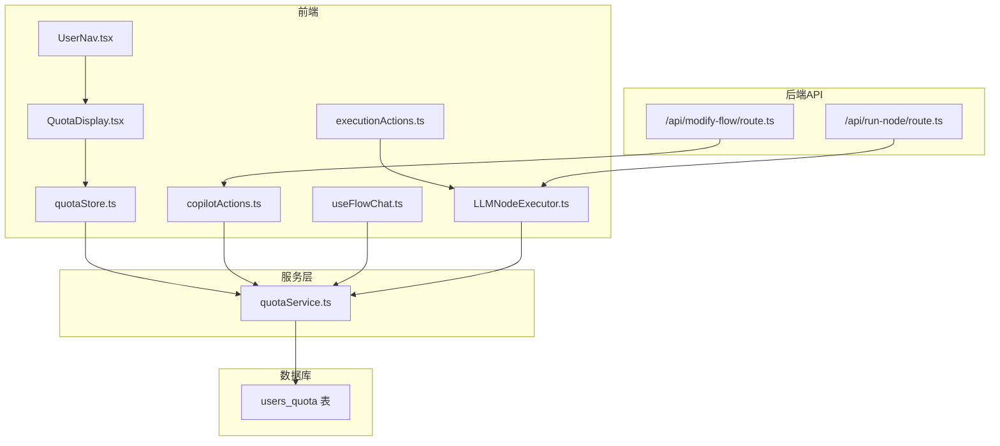
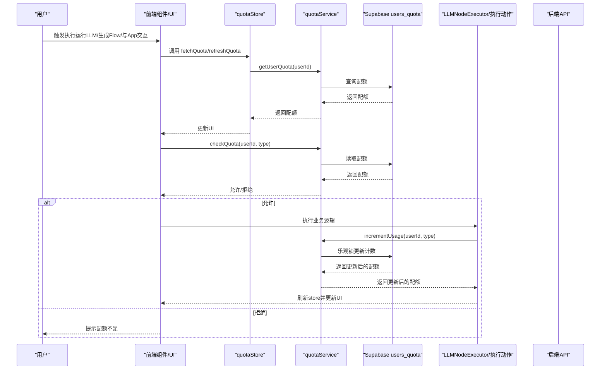
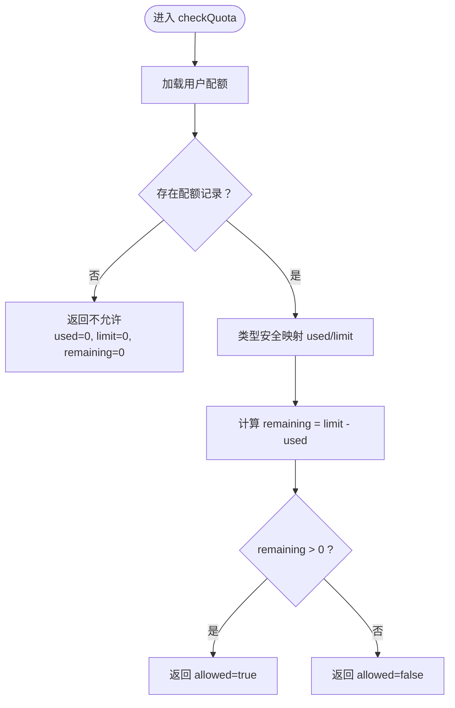
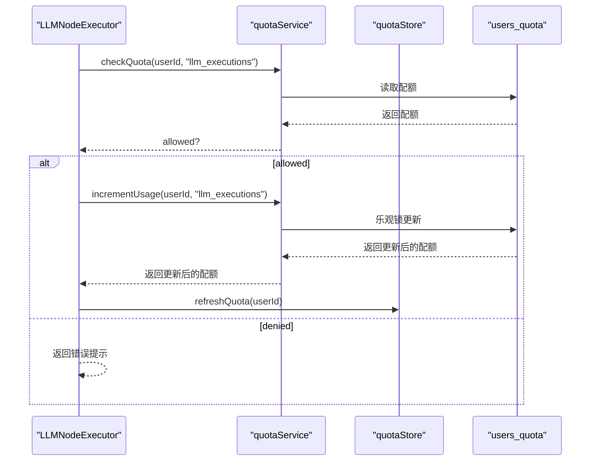
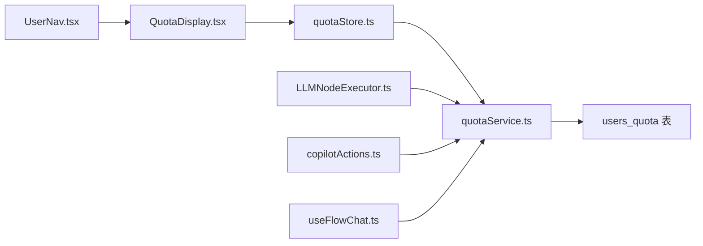

# 配额管理

<cite>
**本文引用的文件**
- [README.md](file://README.md)
- [supabase-schema.sql](file://supabase-schema.sql)
- [auth.ts](file://src/types/auth.ts)
- [quotaService.ts](file://src/services/quotaService.ts)
- [quotaStore.ts](file://src/store/quotaStore.ts)
- [QuotaDisplay.tsx](file://src/components/auth/QuotaDisplay.tsx)
- [UserNav.tsx](file://src/components/auth/UserNav.tsx)
- [LLMNodeExecutor.ts](file://src/store/executors/LLMNodeExecutor.ts)
- [executionActions.ts](file://src/store/actions/executionActions.ts)
- [copilotActions.ts](file://src/store/actions/copilotActions.ts)
- [useFlowChat.ts](file://src/hooks/useFlowChat.ts)
- [run-node/route.ts](file://src/app/api/run-node/route.ts)
- [modify-flow/route.ts](file://src/app/api/modify-flow/route.ts)
</cite>

## 目录
1. [简介](#简介)
2. [项目结构](#项目结构)
3. [核心组件](#核心组件)
4. [架构总览](#架构总览)
5. [详细组件分析](#详细组件分析)
6. [依赖关系分析](#依赖关系分析)
7. [性能考量](#性能考量)
8. [故障排查指南](#故障排查指南)
9. [结论](#结论)
10. [附录](#附录)

## 简介
本项目提供细粒度的用户使用量控制能力，覆盖三大配额维度：
- LLM 执行次数：限制用户在工作流中调用大语言模型的次数
- Flow（助手）生成次数：限制用户通过 AI 助手一键生成工作流的次数
- App（助手）使用次数：限制用户在应用内与助手交互的次数

配额管理贯穿“前端状态管理 + 后端服务 + 数据库”的全链路，既保证用户体验（低延迟、友好提示），又确保系统资源可控（防滥用、并发安全）。

## 项目结构
围绕配额管理的关键目录与文件：
- 类型定义：src/types/auth.ts
- 服务层：src/services/quotaService.ts
- 状态层：src/store/quotaStore.ts
- UI 展示：src/components/auth/QuotaDisplay.tsx、src/components/auth/UserNav.tsx
- 执行拦截与扣减：src/store/executors/LLMNodeExecutor.ts、src/store/actions/copilotActions.ts、src/hooks/useFlowChat.ts
- 数据库模式：supabase-schema.sql
- API 路由：src/app/api/run-node/route.ts、src/app/api/modify-flow/route.ts



图表来源
- [quotaService.ts](file://src/services/quotaService.ts#L1-L246)
- [quotaStore.ts](file://src/store/quotaStore.ts#L1-L87)
- [QuotaDisplay.tsx](file://src/components/auth/QuotaDisplay.tsx#L1-L140)
- [UserNav.tsx](file://src/components/auth/UserNav.tsx#L61-L83)
- [LLMNodeExecutor.ts](file://src/store/executors/LLMNodeExecutor.ts#L1-L342)
- [executionActions.ts](file://src/store/actions/executionActions.ts#L1-L277)
- [copilotActions.ts](file://src/store/actions/copilotActions.ts#L1-L133)
- [useFlowChat.ts](file://src/hooks/useFlowChat.ts#L97-L130)
- [run-node/route.ts](file://src/app/api/run-node/route.ts#L1-L91)
- [modify-flow/route.ts](file://src/app/api/modify-flow/route.ts#L1-L302)
- [supabase-schema.sql](file://supabase-schema.sql#L129-L151)

章节来源
- [README.md](file://README.md#L27-L52)
- [supabase-schema.sql](file://supabase-schema.sql#L129-L151)

## 核心组件
- 类型与枚举：定义用户配额结构与配额类型枚举，确保跨模块类型一致
- 服务层：提供查询配额、检查配额、增量扣减、重置配额、更新限额等能力，并内置乐观锁避免并发丢失更新
- 状态层：Zustand store 封装配额的获取、刷新与使用检查
- UI 展示：在用户导航栏中悬浮展示配额使用情况，支持紧凑/完整两种样式
- 执行拦截：在 LLM 节点执行前进行配额检查；在 Flow 生成与 App 交互中同样进行配额检查与扣减
- 数据库：users_quota 表存储每个用户的三类配额使用与限额

章节来源
- [auth.ts](file://src/types/auth.ts#L20-L40)
- [quotaService.ts](file://src/services/quotaService.ts#L1-L246)
- [quotaStore.ts](file://src/store/quotaStore.ts#L1-L87)
- [QuotaDisplay.tsx](file://src/components/auth/QuotaDisplay.tsx#L1-L140)
- [UserNav.tsx](file://src/components/auth/UserNav.tsx#L61-L83)
- [supabase-schema.sql](file://supabase-schema.sql#L129-L151)

## 架构总览
配额管理的端到端流程如下：
- 用户操作触发（如运行 LLM 节点、生成 Flow、与 App 交互）
- 前端在执行前调用 quotaService.checkQuota 检查剩余配额
- 若允许，执行完成后调用 quotaService.incrementUsage 增量扣减
- store 层刷新本地配额状态，UI 展示更新
- 后端 API 与前端执行器协同，确保执行与扣减的一致性



图表来源
- [quotaService.ts](file://src/services/quotaService.ts#L1-L246)
- [quotaStore.ts](file://src/store/quotaStore.ts#L1-L87)
- [LLMNodeExecutor.ts](file://src/store/executors/LLMNodeExecutor.ts#L195-L226)
- [executionActions.ts](file://src/store/actions/executionActions.ts#L1-L277)
- [copilotActions.ts](file://src/store/actions/copilotActions.ts#L1-L133)
- [useFlowChat.ts](file://src/hooks/useFlowChat.ts#L97-L130)
- [run-node/route.ts](file://src/app/api/run-node/route.ts#L1-L91)
- [modify-flow/route.ts](file://src/app/api/modify-flow/route.ts#L1-L302)

## 详细组件分析

### 类型与数据模型
- 用户配额结构：包含三个使用计数与三个限额字段，以及创建/更新时间戳
- 配额类型枚举：llm_executions、flow_generations、app_usages
- 配额检查结果：包含是否允许、已用、限额、剩余

```mermaid
classDiagram
class UserQuota {
+string id
+string user_id
+number llm_executions_used
+number flow_generations_used
+number app_usages_used
+number llm_executions_limit
+number flow_generations_limit
+number app_usages_limit
+string created_at
+string updated_at
}
class QuotaType {
<<enum>>
"llm_executions"
"flow_generations"
"app_usages"
}
class QuotaCheckResult {
+boolean allowed
+number used
+number limit
+number remaining
}
class quotaService {
+getUserQuota(userId) UserQuota|null
+checkQuota(userId, type) QuotaCheckResult
+incrementUsage(userId, type) UserQuota|null
+resetQuota(userId, type) boolean
+resetAllQuotas(userId) boolean
+updateLimits(userId, limits) boolean
+isQuotaLow(used, limit) boolean
+getQuotaPercentage(used, limit) number
}
UserQuota <.. quotaService : "读写"
QuotaType <.. quotaService : "使用"
QuotaCheckResult <.. quotaService : "返回"
```

图表来源
- [auth.ts](file://src/types/auth.ts#L20-L40)
- [quotaService.ts](file://src/services/quotaService.ts#L1-L246)

章节来源
- [auth.ts](file://src/types/auth.ts#L20-L40)
- [supabase-schema.sql](file://supabase-schema.sql#L129-L151)

### 服务层：quotaService
- 查询配额：按用户ID查询 users_quota 表
- 检查配额：根据类型安全地映射使用计数与限额，计算剩余并返回允许状态
- 增量扣减：采用乐观锁重试策略，避免并发场景下的丢失更新
- 重置与更新：支持按类型或全部重置使用计数，支持更新限额
- 辅助方法：计算剩余百分比、判断配额是否低于阈值



图表来源
- [quotaService.ts](file://src/services/quotaService.ts#L36-L59)

章节来源
- [quotaService.ts](file://src/services/quotaService.ts#L1-L246)

### 状态层：quotaStore
- fetchQuota：异步获取用户配额并更新 store
- checkAndUse：先检查配额，再调用服务层增量扣减，最后刷新本地状态
- refreshQuota：无加载态刷新
- clearQuota：清空配额状态

章节来源
- [quotaStore.ts](file://src/store/quotaStore.ts#L1-L87)

### UI 展示：QuotaDisplay 与 UserNav
- QuotaDisplay：在用户导航栏的下拉面板中展示三类配额的使用进度与剩余数量，支持紧凑样式
- UserNav：在用户头像区域悬停显示配额详情，包含提示联系管理员升级额度的说明

章节来源
- [QuotaDisplay.tsx](file://src/components/auth/QuotaDisplay.tsx#L1-L140)
- [UserNav.tsx](file://src/components/auth/UserNav.tsx#L61-L83)

### 执行拦截与扣减

#### LLM 节点执行拦截
- 在 LLMNodeExecutor.execute 中，于正常模式下执行前调用 quotaService.checkQuota 检查 llm_executions
- 成功后通过 quotaService.incrementUsage 增量扣减，并刷新 store
- 调试模式（mockData 存在）跳过配额检查与扣减



图表来源
- [LLMNodeExecutor.ts](file://src/store/executors/LLMNodeExecutor.ts#L195-L226)
- [quotaService.ts](file://src/services/quotaService.ts#L36-L59)
- [quotaService.ts](file://src/services/quotaService.ts#L83-L133)
- [quotaStore.ts](file://src/store/quotaStore.ts#L73-L87)

章节来源
- [LLMNodeExecutor.ts](file://src/store/executors/LLMNodeExecutor.ts#L195-L226)
- [executionActions.ts](file://src/store/actions/executionActions.ts#L1-L277)

#### Flow（助手）生成拦截
- copilotActions.startCopilot 在生成 Flow 前调用 quotaService.checkQuota 检查 flow_generations
- 成功后调用 quotaService.incrementUsage 并刷新 store

章节来源
- [copilotActions.ts](file://src/store/actions/copilotActions.ts#L1-L133)

#### App（助手）使用拦截
- useFlowChat 在发起会话前调用 quotaService.checkQuota 检查 app_usages
- 成功后继续会话流程

章节来源
- [useFlowChat.ts](file://src/hooks/useFlowChat.ts#L97-L130)

### 数据库模式
- users_quota 表：唯一约束 user_id，包含三类使用计数与限额，默认初始限额可在数据库脚本中配置
- RLS：启用行级安全，确保用户只能访问自己的配额

章节来源
- [supabase-schema.sql](file://supabase-schema.sql#L129-L151)

### 后端 API 与配额的关系
- /api/run-node：执行单次 LLM 请求，不涉及配额扣减（配额在前端执行器中处理）
- /api/modify-flow：AI 修改工作流指令生成，不涉及配额扣减（配额在前端执行器中处理）

章节来源
- [run-node/route.ts](file://src/app/api/run-node/route.ts#L1-L91)
- [modify-flow/route.ts](file://src/app/api/modify-flow/route.ts#L1-L302)

## 依赖关系分析
- 组件耦合
  - QuotaDisplay 依赖 quotaStore 与 quotaService，负责展示与计算百分比、低配额提醒
  - UserNav 依赖 QuotaDisplay，作为入口容器
  - LLMNodeExecutor 依赖 authService、quotaService、llmMemoryService，负责配额检查与扣减
  - copilotActions 与 useFlowChat 依赖 quotaService，分别在 Flow 生成与 App 交互中进行配额检查
- 外部依赖
  - Supabase：users_quota 表提供持久化存储
  - OpenAI/DashScope/Doubao：LLM 执行由后端 API 或前端执行器调用



图表来源
- [QuotaDisplay.tsx](file://src/components/auth/QuotaDisplay.tsx#L1-L140)
- [UserNav.tsx](file://src/components/auth/UserNav.tsx#L61-L83)
- [quotaStore.ts](file://src/store/quotaStore.ts#L1-L87)
- [quotaService.ts](file://src/services/quotaService.ts#L1-L246)
- [LLMNodeExecutor.ts](file://src/store/executors/LLMNodeExecutor.ts#L195-L226)
- [copilotActions.ts](file://src/store/actions/copilotActions.ts#L1-L133)
- [useFlowChat.ts](file://src/hooks/useFlowChat.ts#L97-L130)
- [supabase-schema.sql](file://supabase-schema.sql#L129-L151)

## 性能考量
- 乐观锁重试：在高并发场景下，incrementUsageFallback 通过重试与指数退避降低丢失更新概率
- UI 本地刷新：成功扣减后立即刷新 store，避免额外网络往返
- 条件跳过：调试模式不进行配额检查与扣减，减少不必要的网络请求
- 低配额提示：当剩余小于阈值时，UI 提示用户注意，避免频繁失败重试

[本节为通用指导，不直接分析具体文件]

## 故障排查指南
- 配额检查失败
  - 现象：执行前提示“配额检查失败，请稍后重试或联系支持”
  - 排查：确认 quotaService.checkQuota 是否抛出异常；检查用户是否已登录；查看后端日志
- 增量扣减失败
  - 现象：执行成功但未扣减配额或扣减异常
  - 排查：检查 quotaService.incrementUsageFallback 的重试与回退逻辑；确认 updated_at 字段是否被正确传递；查看数据库更新是否成功
- UI 不显示配额
  - 现象：用户导航中看不到配额
  - 排查：确认用户已登录且 fetchQuota 已调用；检查 QuotaDisplay 是否渲染；确认 store 中 quota 是否存在
- Flow 生成被拒
  - 现象：生成 Flow 时报“Flow 生成次数已用完”
  - 排查：检查 flow_generations 配额；确认 copilotActions.startCopilot 的配额检查逻辑
- App 交互被拒
  - 现象：与助手交互时报“APP 使用次数已用完”
  - 排查：检查 app_usages 配额；确认 useFlowChat 的配额检查逻辑

章节来源
- [quotaService.ts](file://src/services/quotaService.ts#L83-L133)
- [quotaService.ts](file://src/services/quotaService.ts#L229-L246)
- [LLMNodeExecutor.ts](file://src/store/executors/LLMNodeExecutor.ts#L195-L226)
- [copilotActions.ts](file://src/store/actions/copilotActions.ts#L1-L133)
- [useFlowChat.ts](file://src/hooks/useFlowChat.ts#L97-L130)
- [QuotaDisplay.tsx](file://src/components/auth/QuotaDisplay.tsx#L1-L140)

## 结论
本项目的配额管理通过“类型安全 + 乐观锁 + 前端拦截 + UI 反馈”的组合，实现了对 LLM 执行、Flow 生成与 App 交互的细粒度控制。其优点在于：
- 明确的配额边界与清晰的错误提示
- 并发安全的增量扣减
- 低侵入的前端拦截，不影响后端 API 的职责划分

建议后续可考虑：
- 在数据库层面引入原子计数或事务，进一步降低竞态风险
- 提供配额变更通知与审计日志
- 支持按租户/团队维度的配额策略

[本节为总结性内容，不直接分析具体文件]

## 附录
- 配额类型枚举与含义
  - llm_executions：限制 LLM 节点的执行次数
  - flow_generations：限制通过 AI 助手生成工作流的次数
  - app_usages：限制在应用内与助手交互的次数
- 默认限额参考（数据库脚本）
  - llm_executions_limit：默认 100
  - flow_generations_limit：默认 20
  - app_usages_limit：默认 50

章节来源
- [auth.ts](file://src/types/auth.ts#L36-L40)
- [supabase-schema.sql](file://supabase-schema.sql#L129-L151)