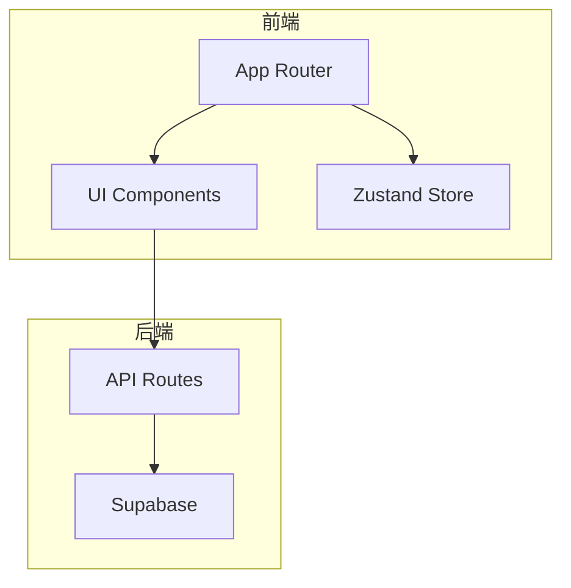
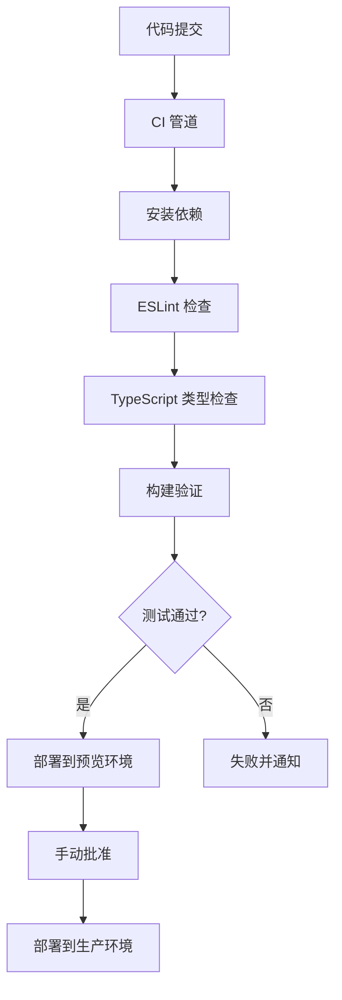

# 构建与部署配置

<cite>
**本文档引用的文件**   
- [next.config.ts](file://next.config.ts)
- [tsconfig.json](file://tsconfig.json)
- [postcss.config.mjs](file://postcss.config.mjs)
- [tailwind.config.ts](file://tailwind.config.ts)
- [package.json](file://package.json)
- [src/lib/supabase.ts](file://src/lib/supabase.ts)
- [src/app/api/health/route.ts](file://src/app/api/health/route.ts)
- [src/types/database.ts](file://src/types/database.ts)
- [eslint.config.mjs](file://eslint.config.mjs)
- [README.md](file://README.md)
</cite>

## 目录
1. [简介](#简介)
2. [项目结构](#项目结构)
3. [核心构建配置](#核心构建配置)
4. [TypeScript 编译配置](#typescript-编译配置)
5. [PostCSS 与样式处理](#postcss-与样式处理)
6. [生产构建优化](#生产构建优化)
7. [环境变量与 Supabase 配置](#环境变量与-supabase-配置)
8. [部署到 Vercel](#部署到-vercel)
9. [CI/CD 集成建议](#cicd-集成建议)
10. [性能监控配置](#性能监控配置)

## 简介
本指南详细说明了 Flash Flow SaaS 项目的构建和部署流程，涵盖从开发环境配置到生产部署的完整路径。项目基于 Next.js 16 构建，采用现代化的前端技术栈，包括 React 19、TypeScript、Tailwind CSS 和 Supabase 后端集成。本文档将指导您完成自定义构建配置、环境变量设置、生产优化以及部署到 Vercel 等关键步骤。

**Section sources**
- [README.md](file://README.md#L1-L37)

## 项目结构
项目采用标准的 Next.js App Router 架构，主要目录包括：
- `src/app/`：应用路由和页面组件
- `src/components/`：可复用的 UI 组件
- `src/lib/`：核心库和工具函数
- `src/services/`：API 服务层
- `src/store/`：状态管理
- `src/types/`：类型定义

应用主要功能包括流程构建器（builder）、流程管理（flows）和运行时接口（run），通过 API 路由与 Supabase 数据库交互。



**Diagram sources**
- [src/app/page.tsx](file://src/app/page.tsx)
- [src/components/ui/](file://src/components/ui/)
- [src/app/api/](file://src/app/api/)

**Section sources**
- [src/app/](file://src/app/)
- [src/components/](file://src/components/)

## 核心构建配置
项目通过 `next.config.ts` 进行核心构建配置，启用了 React Compiler 功能以优化组件渲染性能。该配置确保在构建过程中自动优化 React 组件的渲染逻辑，提升应用性能。

```typescript
const nextConfig: NextConfig = {
  reactCompiler: true,
};
```

此配置与 Next.js 16 的新特性兼容，为应用提供了最新的 React 编译优化能力。

**Section sources**
- [next.config.ts](file://next.config.ts#L1-L9)

## TypeScript 编译配置
项目的 `tsconfig.json` 文件定义了完整的 TypeScript 编译选项，确保类型安全和现代 JavaScript 特性支持。关键配置包括：

- **目标版本**：ES2017，确保兼容现代浏览器
- **模块系统**：esnext，支持最新的模块语法
- **路径映射**：`@/*` 映射到 `./src/*`，简化模块导入
- **严格模式**：启用 `strict: true`，提供更强的类型检查
- **增量编译**：启用 `incremental: true`，加快开发构建速度

这些配置共同确保了代码的类型安全性和开发效率。

**Section sources**
- [tsconfig.json](file://tsconfig.json#L1-L35)

## PostCSS 与样式处理
项目使用 PostCSS 与 Tailwind CSS 进行样式处理。`postcss.config.mjs` 配置文件集成了 Tailwind CSS 插件，确保样式在构建过程中正确处理。

```javascript
const config = {
  plugins: {
    "@tailwindcss/postcss": {},
  },
};
```

Tailwind 配置在 `tailwind.config.ts` 中定义，包括：
- 暗色模式支持（class-based）
- 内容扫描路径配置
- 自定义颜色、边框半径和动画效果

这种配置确保了样式的一致性和可维护性。

**Section sources**
- [postcss.config.mjs](file://postcss.config.mjs#L1-L8)
- [tailwind.config.ts](file://tailwind.config.ts#L1-L39)

## 生产构建优化
项目通过多种机制实现生产构建优化：

1. **代码分割**：Next.js 自动实现路由级别的代码分割，确保初始加载只包含必要代码
2. **静态生成**：应用页面采用静态生成（SSG），提升加载性能
3. **React Compiler 优化**：启用 reactCompiler 提供自动性能优化
4. **字体优化**：使用 `next/font` 自动优化和加载 Geist 字体

构建脚本通过 `package.json` 定义：
```json
"scripts": {
  "dev": "next dev",
  "build": "next build",
  "start": "next start"
}
```

这些优化共同确保了生产环境下的最佳性能表现。

**Section sources**
- [package.json](file://package.json#L5-L9)
- [next.config.ts](file://next.config.ts#L5)

## 环境变量与 Supabase 配置
项目通过环境变量配置 Supabase 连接参数，确保安全性和灵活性。关键环境变量包括：

- `NEXT_PUBLIC_SUPABASE_URL`：Supabase 项目 URL
- `NEXT_PUBLIC_SUPABASE_ANON_KEY`：匿名访问密钥
- `SUPABASE_SERVICE_ROLE_KEY`：服务角色密钥（用于服务器端操作）

`src/lib/supabase.ts` 文件封装了 Supabase 客户端的创建逻辑，确保环境变量的正确加载和客户端实例的统一管理。

```typescript
const url = process.env.NEXT_PUBLIC_SUPABASE_URL;
const anon = process.env.NEXT_PUBLIC_SUPABASE_ANON_KEY;

if (!url || !anon) {
  throw new Error("Missing Supabase environment variables");
}

export const supabase = createClient<Database>(url, anon);
```

健康检查 API (`/api/health`) 验证 Supabase 连接状态，确保数据库可访问性和表结构完整性。

**Section sources**
- [src/lib/supabase.ts](file://src/lib/supabase.ts#L1-L18)
- [src/app/api/health/route.ts](file://src/app/api/health/route.ts#L1-L52)
- [src/types/database.ts](file://src/types/database.ts#L1-L59)

## 部署到 Vercel
项目已针对 Vercel 平台进行了优化部署配置。根据 `README.md` 指南，部署流程如下：

1. 将代码推送到 Git 仓库（GitHub、GitLab 或 Bitbucket）
2. 登录 Vercel 并创建新项目
3. 导入 Flash Flow SaaS 仓库
4. 配置环境变量：
   - `NEXT_PUBLIC_SUPABASE_URL`
   - `NEXT_PUBLIC_SUPABASE_ANON_KEY`
   - `SUPABASE_SERVICE_ROLE_KEY`
5. 设置构建命令：`next build`
6. 设置输出目录：`.next`

Vercel 自动检测 Next.js 配置，无需额外配置即可实现零配置部署。部署完成后，Vercel 提供自动 HTTPS、全球 CDN 分发和预览环境。

**Section sources**
- [README.md](file://README.md#L32-L37)
- [package.json](file://package.json#L7)

## CI/CD 集成建议
为确保代码质量和部署可靠性，建议实施以下 CI/CD 流程：

1. **代码检查**：使用 ESLint 进行代码质量检查
   - 配置文件：`eslint.config.mjs`
   - 集成 Next.js 最佳实践和 TypeScript 检查

2. **测试流程**：
   - 在 CI 管道中运行 `npm run build` 验证构建完整性
   - 添加单元测试和集成测试（当前项目未包含测试文件）

3. **部署策略**：
   - 开发分支：自动部署到预览环境
   - 主分支：自动部署到生产环境
   - 支持蓝绿部署或金丝雀发布

4. **质量门禁**：
   - 构建成功作为部署前提
   - 代码覆盖率检查
   - 性能预算验证



**Diagram sources**
- [eslint.config.mjs](file://eslint.config.mjs#L1-L19)
- [package.json](file://package.json#L7)

**Section sources**
- [eslint.config.mjs](file://eslint.config.mjs#L1-L19)

## 性能监控配置
为确保生产环境的稳定性和性能，建议实施以下监控配置：

1. **应用性能监控 (APM)**：
   - 集成 Vercel Analytics 或第三方 APM 工具
   - 监控页面加载时间、API 响应时间和错误率

2. **错误跟踪**：
   - 配置错误边界（项目中已包含 `FlowErrorBoundary.tsx`）
   - 集成 Sentry 或类似错误跟踪服务

3. **健康检查**：
   - `/api/health` 端点提供系统健康状态
   - 监控数据库连接、表结构完整性和环境变量配置

4. **性能指标**：
   - 核心 Web 指标（LCP、FID、CLS）
   - 使用 Next.js 内置的性能跟踪功能

这些监控措施将帮助快速发现和解决生产环境中的问题，确保用户体验。

**Section sources**
- [src/app/api/health/route.ts](file://src/app/api/health/route.ts#L1-L52)
- [src/components/FlowErrorBoundary.tsx](file://src/components/FlowErrorBoundary.tsx)