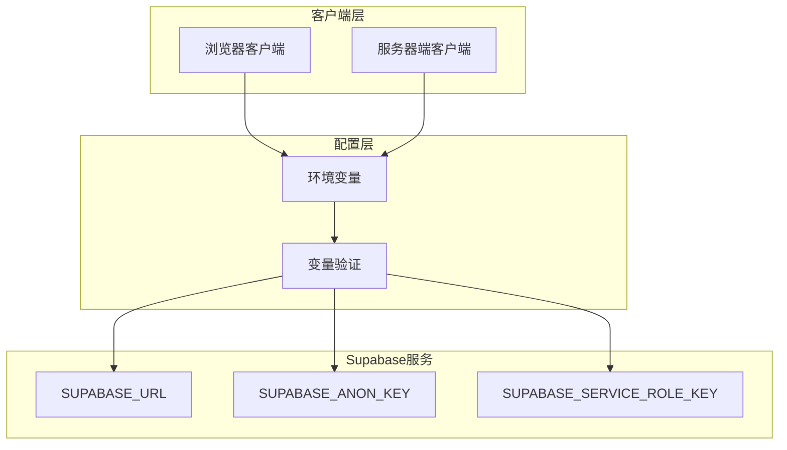
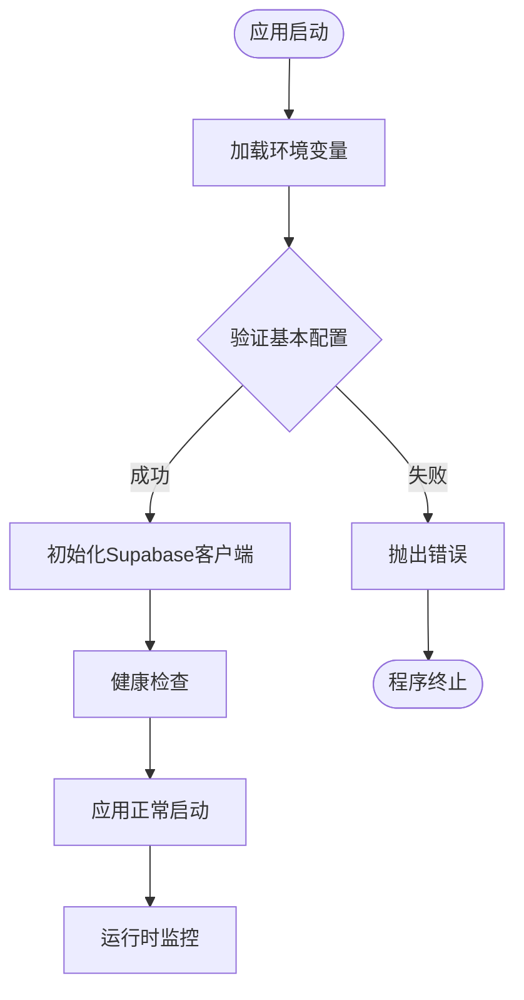
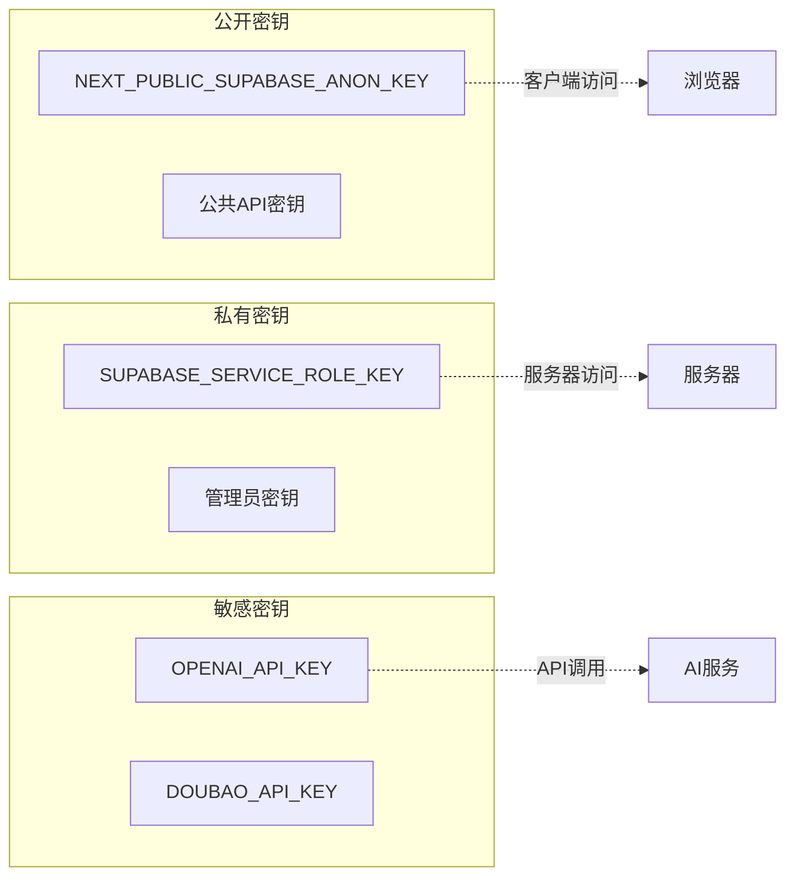
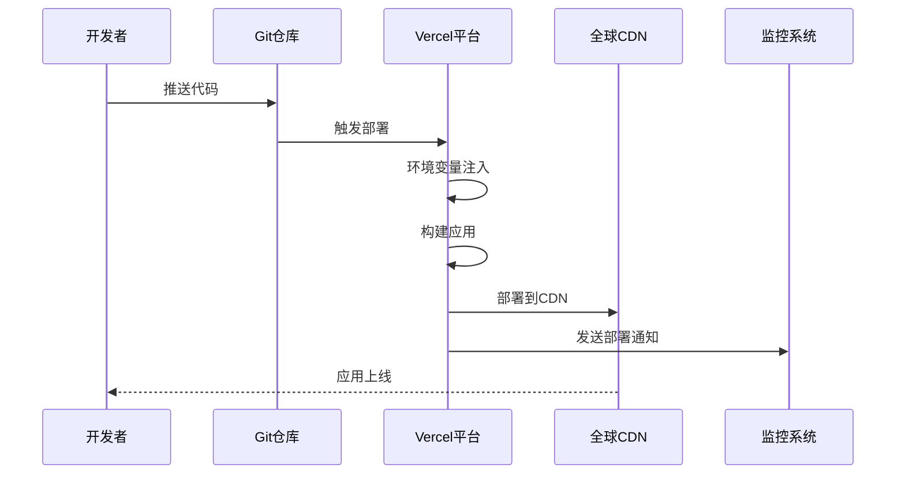

# 环境变量与配置

<cite>
**本文档中引用的文件**
- [package.json](file://package.json)
- [src/lib/supabase.ts](file://src/lib/supabase.ts)
- [src/app/api/health/route.ts](file://src/app/api/health/route.ts)
- [src/app/api/plan/route.ts](file://src/app/api/plan/route.ts)
- [src/app/api/modify-flow/route.ts](file://src/app/api/modify-flow/route.ts)
- [src/app/api/run-node/route.ts](file://src/app/api/run-node/route.ts)
- [src/types/database.ts](file://src/types/database.ts)
- [next.config.ts](file://next.config.ts)
- [README.md](file://README.md)
</cite>

## 目录
1. [项目概述](#项目概述)
2. [Supabase配置架构](#supabase配置架构)
3. [核心环境变量详解](#核心环境变量详解)
4. [环境变量验证策略](#环境变量验证策略)
5. [多环境配置管理](#多环境配置管理)
6. [安全最佳实践](#安全最佳实践)
7. [Vercel部署配置](#vercel部署配置)
8. [开发工具链配置](#开发工具链配置)
9. [故障排除指南](#故障排除指南)
10. [总结](#总结)

## 项目概述

Flash Flow是一个基于Next.js构建的SaaS应用程序，采用现代化的全栈架构设计。项目集成了Supabase作为主要的后端服务提供商，提供了完整的数据库、认证和实时功能支持。环境变量配置是确保应用安全性和可维护性的关键组件。

### 技术栈概览

- **前端框架**: Next.js 16.0.4
- **数据库**: Supabase (PostgreSQL)
- **认证**: Supabase Auth
- **实时通信**: Supabase Realtime
- **状态管理**: Zustand
- **UI组件**: Radix UI + Tailwind CSS

**章节来源**
- [package.json](file://package.json#L1-L57)
- [README.md](file://README.md#L1-L37)

## Supabase配置架构

### 客户端初始化模式

项目采用了分层的Supabase客户端初始化策略，确保在不同场景下都能安全有效地访问数据库服务。



**图表来源**
- [src/lib/supabase.ts](file://src/lib/supabase.ts#L1-L18)
- [src/app/api/health/route.ts](file://src/app/api/health/route.ts#L4-L7)

### 客户端类型与用途

| 客户端类型 | 初始化位置 | 用途 | 访问权限 |
|-----------|-----------|------|---------|
| 浏览器客户端 | `src/lib/supabase.ts` | 前端数据操作 | 匿名/用户认证 |
| 服务器客户端 | `src/lib/supabase.ts` | API路由处理 | 服务角色密钥 |
| 单例客户端 | 全局共享 | 统一数据库访问 | 完整权限 |

**章节来源**
- [src/lib/supabase.ts](file://src/lib/supabase.ts#L12-L17)

## 核心环境变量详解

### Supabase基础配置

#### NEXT_PUBLIC_SUPABASE_URL
- **类型**: 必需的公共URL
- **用途**: 指向Supabase项目的公共API端点
- **前缀要求**: 必须以`NEXT_PUBLIC_`开头才能在客户端访问
- **格式**: `https://<project-ref>.supabase.co`

#### NEXT_PUBLIC_SUPABASE_ANON_KEY
- **类型**: 必需的匿名密钥
- **用途**: 允许未认证用户的客户端访问
- **权限范围**: 仅限于公开表和函数
- **安全性**: 可被客户端直接访问，但权限受限

### 服务角色密钥配置

#### SUPABASE_SERVICE_ROLE_KEY
- **类型**: 敏感的服务角色密钥
- **用途**: 在服务器端执行管理员级操作
- **权限级别**: 数据库完全访问权限
- **安全要求**: 严格保密，不可暴露在客户端

### 多语言模型配置

#### LLM_PROVIDER
- **默认值**: `openai`
- **支持选项**: `openai`, `doubao`
- **用途**: 选择AI模型提供商
- **影响范围**: 所有AI相关的API调用

#### OPENAI_API_KEY
- **用途**: OpenAI API访问密钥
- **应用场景**: GPT-4等OpenAI模型调用
- **安全要求**: 与服务角色密钥同等重要

#### DOUBAO_API_KEY & DOUBAO_MODEL
- **提供商**: 字节跳动豆包大模型
- **用途**: 国内AI模型替代方案
- **默认模型**: `doubao-pro-128k`

**章节来源**
- [src/lib/supabase.ts](file://src/lib/supabase.ts#L3-L5)
- [src/app/api/health/route.ts](file://src/app/api/health/route.ts#L4-L7)
- [src/app/api/plan/route.ts](file://src/app/api/plan/route.ts#L51-L52)
- [src/app/api/modify-flow/route.ts](file://src/app/api/modify-flow/route.ts#L13)
- [src/app/api/run-node/route.ts](file://src/app/api/run-node/route.ts#L13)

## 环境变量验证策略

### 运行时验证机制

项目实现了多层次的环境变量验证策略，确保应用启动时所有必需的配置都已正确设置。



**图表来源**
- [src/lib/supabase.ts](file://src/lib/supabase.ts#L7-L9)

### 验证规则详解

#### 基础验证逻辑
- **URL验证**: 检查`NEXT_PUBLIC_SUPABASE_URL`是否为空
- **密钥验证**: 确认`NEXT_PUBLIC_SUPABASE_ANON_KEY`存在
- **组合验证**: 至少需要一个有效的认证凭据

#### 健康检查验证
项目提供了专门的健康检查端点，用于验证所有环境变量的可用性：

```typescript
// 健康检查中的验证逻辑
const env_ok = Boolean(url && (anon || service));
```

**章节来源**
- [src/lib/supabase.ts](file://src/lib/supabase.ts#L7-L9)
- [src/app/api/health/route.ts](file://src/app/api/health/route.ts#L9)

## 多环境配置管理

### 开发环境配置

#### 本地开发设置
```bash
# .env.local 示例
NEXT_PUBLIC_SUPABASE_URL=http://localhost:54321
NEXT_PUBLIC_SUPABASE_ANON_KEY=your-anon-key
SUPABASE_SERVICE_ROLE_KEY=your-service-role-key
```

#### 开发服务器特性
- **热重载**: 支持快速开发迭代
- **调试工具**: 内置开发工具链
- **模拟数据**: 支持本地数据模拟

### 测试环境配置

#### 测试环境变量管理
- **隔离数据库**: 使用独立的测试数据库实例
- **模拟认证**: 实现测试专用的认证机制
- **性能监控**: 集成性能测试工具

### 生产环境配置

#### 生产环境安全要求
- **密钥轮换**: 定期更新服务角色密钥
- **访问控制**: 实施严格的网络访问控制
- **监控告警**: 配置完整的监控和告警系统

### 环境差异对比

| 配置项 | 开发环境 | 测试环境 | 生产环境 |
|-------|---------|---------|---------|
| 数据库URL | localhost:54321 | 测试实例 | 生产实例 |
| 认证密钥 | 开发密钥 | 测试密钥 | 生产密钥 |
| 日志级别 | 详细 | 中等 | 错误级别 |
| 性能监控 | 关闭 | 基础 | 完整 |

## 安全最佳实践

### 密钥管理策略

#### 密钥分类与保护


**图表来源**
- [src/lib/supabase.ts](file://src/lib/supabase.ts#L3-L5)

#### 密钥安全原则
1. **最小权限原则**: 每个密钥只赋予必要的最小权限
2. **定期轮换**: 建立密钥轮换机制
3. **访问审计**: 记录所有密钥使用情况
4. **加密存储**: 敏感密钥必须加密存储

### 网络安全配置

#### CORS策略
- **白名单域名**: 限制允许的跨域请求来源
- **预检请求**: 正确处理OPTIONS请求
- **凭证传递**: 控制Cookie和认证头的传递

#### SSL/TLS要求
- **强制HTTPS**: 所有生产环境必须使用HTTPS
- **证书验证**: 定期检查SSL证书有效性
- **协议版本**: 使用最新的TLS版本

**章节来源**
- [src/app/api/health/route.ts](file://src/app/api/health/route.ts#L21-L25)

## Vercel部署配置

### 平台特定配置

#### Vercel环境变量设置
```bash
# Vercel项目设置中的环境变量
NEXT_PUBLIC_SUPABASE_URL=https://your-project.supabase.co
NEXT_PUBLIC_SUPABASE_ANON_KEY=your-public-anon-key
SUPABASE_SERVICE_ROLE_KEY=your-service-role-key
OPENAI_API_KEY=your-openai-key
```

#### 构建配置优化
- **增量构建**: 利用Vercel的增量构建功能
- **缓存策略**: 优化静态资源缓存
- **CDN配置**: 自动启用全球CDN加速

### 部署流水线



**图表来源**
- [package.json](file://package.json#L6-L9)

### 部署最佳实践

#### 配置同步
- **版本控制**: 将环境变量配置纳入版本控制
- **模板管理**: 使用配置模板确保一致性
- **变更审批**: 实施配置变更的审批流程

#### 监控与告警
- **部署状态**: 实时监控部署状态
- **健康检查**: 自动执行健康检查
- **回滚机制**: 快速回滚到稳定版本

**章节来源**
- [README.md](file://README.md#L32-L37)

## 开发工具链配置

### 脚本配置策略

#### package.json脚本管理
项目通过标准化的npm脚本来管理不同环境的运行配置：

```json
{
  "scripts": {
    "dev": "next dev",
    "build": "next build",
    "start": "next start",
    "lint": "eslint"
  }
}
```

#### 开发环境脚本
- **开发服务器**: `npm run dev` - 启动热重载开发服务器
- **构建应用**: `npm run build` - 生产环境构建
- **启动应用**: `npm run start` - 启动生产服务器

### 工具链集成

#### ESLint配置
- **代码规范**: 统一的代码风格标准
- **自动修复**: 支持代码自动格式化
- **持续集成**: CI/CD管道中的代码检查

#### TypeScript配置
- **类型安全**: 完整的TypeScript类型检查
- **智能提示**: 开发时的类型智能提示
- **编译优化**: TypeScript编译优化配置

**章节来源**
- [package.json](file://package.json#L5-L10)
- [next.config.ts](file://next.config.ts#L1-L9)

## 故障排除指南

### 常见环境变量问题

#### 配置错误诊断

| 错误类型 | 症状 | 解决方案 |
|---------|------|---------|
| 缺失变量 | 应用启动失败 | 检查.env文件和环境变量设置 |
| 格式错误 | 连接超时 | 验证URL和密钥格式 |
| 权限不足 | 认证失败 | 检查密钥权限设置 |
| 网络问题 | 请求超时 | 验证网络连接和防火墙设置 |

#### 调试技巧

##### 环境变量检查
```typescript
// 在开发环境中添加调试输出
console.log('Supabase URL:', process.env.NEXT_PUBLIC_SUPABASE_URL);
console.log('Supabase ANON Key:', process.env.NEXT_PUBLIC_SUPABASE_ANON_KEY);
console.log('Service Role Key:', process.env.SUPABASE_SERVICE_ROLE_KEY);
```

##### 健康检查端点
项目提供了专门的健康检查端点来诊断环境变量配置：

```typescript
// GET /api/health
{
  "env_ok": true,
  "connected": true,
  "auth_ok": true,
  "table_ok": true,
  "error": null
}
```

### 性能优化建议

#### 数据库连接优化
- **连接池**: 合理配置数据库连接池大小
- **查询优化**: 使用索引和优化查询语句
- **缓存策略**: 实施适当的缓存机制

#### API响应优化
- **压缩传输**: 启用gzip压缩
- **CDN加速**: 利用CDN提升静态资源加载速度
- **异步处理**: 对耗时操作实施异步处理

**章节来源**
- [src/app/api/health/route.ts](file://src/app/api/health/route.ts#L1-L52)

## 总结

Flash Flow项目的环境变量配置体系体现了现代Web应用的最佳实践。通过分层的客户端初始化、严格的验证机制、多环境配置管理和完善的安全策略，确保了应用在各种部署场景下的稳定性和安全性。

### 关键要点回顾

1. **分层架构**: 明确区分客户端和服务端的配置需求
2. **安全优先**: 严格的密钥管理和访问控制
3. **多环境支持**: 完善的开发、测试、生产环境配置
4. **监控完善**: 全面的健康检查和故障诊断机制
5. **部署友好**: 与主流部署平台的无缝集成

### 最佳实践建议

- **定期审查**: 定期检查和更新环境变量配置
- **文档维护**: 保持配置文档的及时更新
- **团队协作**: 建立配置管理的团队协作流程
- **自动化测试**: 实施环境变量的自动化测试

通过遵循这些指导原则和最佳实践，可以确保Flash Flow项目在任何环境下都能稳定、安全、高效地运行。