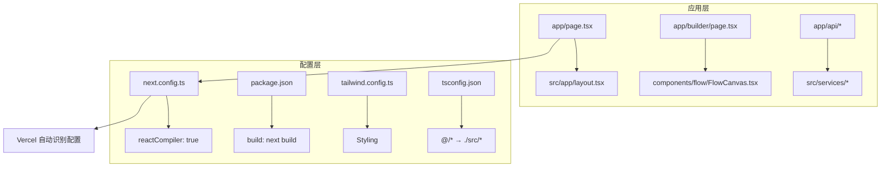
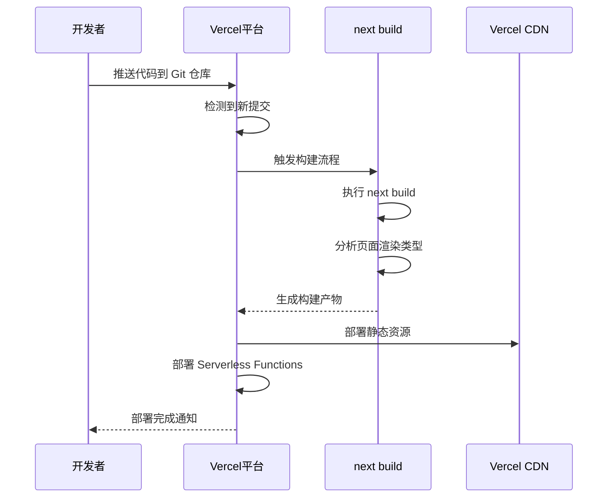
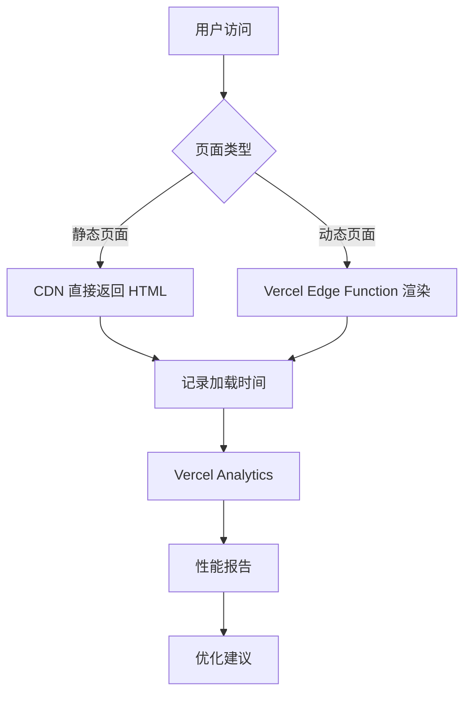

# 部署流程指南

<cite>
**本文档引用的文件**  
- [next.config.ts](file://next.config.ts)
- [package.json](file://package.json)
- [README.md](file://README.md)
- [src/app/page.tsx](file://src/app/page.tsx)
- [src/lib/supabase.ts](file://src/lib/supabase.ts)
- [tailwind.config.ts](file://tailwind.config.ts)
- [tsconfig.json](file://tsconfig.json)
- [postcss.config.mjs](file://postcss.config.mjs)
</cite>

## 目录
1. [简介](#简介)
2. [项目结构](#项目结构)
3. [本地构建流程](#本地构建流程)
4. [next.config.ts 配置详解](#nextconfigts-配置详解)
5. [Vercel 构建行为影响分析](#vercel-构建行为影响分析)
6. [部署前检查清单](#部署前检查清单)
7. [部署到 Vercel 平台](#部署到-vercel-平台)
8. [部署后性能监控](#部署后性能监控)
9. [结论](#结论)

## 简介
本指南详细说明了从本地开发环境构建到云端部署的完整流程，重点介绍如何将基于 Next.js 的应用部署至 Vercel 平台。文档涵盖构建脚本执行机制、静态生成（SSG）与服务器端渲染（SSR）优化策略、环境变量配置、依赖管理以及部署后的性能监控建议。

## 项目结构
该项目采用标准的 Next.js App Router 架构，核心功能模块组织清晰，遵循组件化设计原则。主要目录包括：
- `src/app/`：包含所有路由页面和 API 接口
- `src/components/`：可复用 UI 组件库
- `src/lib/`：工具函数与外部服务客户端（如 Supabase）
- `src/store/`：状态管理逻辑
- 根目录下包含构建与部署相关配置文件



**Diagram sources**  
- [next.config.ts](file://next.config.ts#L1-L9)
- [package.json](file://package.json#L1-L57)
- [src/app/page.tsx](file://src/app/page.tsx#L1-L85)

**Section sources**  
- [next.config.ts](file://next.config.ts#L1-L9)
- [package.json](file://package.json#L1-L57)

## 本地构建流程
本地构建通过 `package.json` 中定义的 `build` 脚本触发，使用 `next build` 命令启动编译过程。该命令会分析所有页面并自动决定哪些页面可以进行静态生成（SSG），哪些需要服务器端渲染（SSR）或动态渲染。

```json
"scripts": {
  "dev": "next dev",
  "build": "next build",
  "start": "next start"
}
```

构建过程包含以下关键步骤：
1. 类型检查（基于 TypeScript 配置）
2. CSS 处理（通过 Tailwind 和 PostCSS）
3. React 编译器优化（由 `reactCompiler: true` 启用）
4. 页面级代码分割与优化
5. 静态资源生成与哈希化

**Section sources**  
- [package.json](file://package.json#L5-L9)

## next.config.ts 配置详解
`next.config.ts` 是 Next.js 应用的核心配置文件，直接影响构建输出和运行时行为。当前项目中启用了 React Compiler 功能，这是影响构建性能的关键配置。

```ts
const nextConfig: NextConfig = {
  reactCompiler: true,
};
```

### 配置项说明
- **reactCompiler**: 启用 React 团队开发的新型编译器，可自动优化组件渲染性能，减少不必要的重渲染，提升首屏加载速度和交互响应能力。

此配置无需额外插件或复杂设置，Vercel 在检测到该选项时会自动启用相应的构建优化策略。

**Section sources**  
- [next.config.ts](file://next.config.ts#L3-L6)

## Vercel 构建行为影响分析
Vercel 平台深度集成 Next.js，能够自动识别项目配置并应用最佳实践。`next.config.ts` 中的配置直接影响 Vercel 的构建决策。

### 构建阶段行为
| 阶段 | 行为 | 影响 |
|------|------|------|
| 检测 | Vercel 读取 `next.config.ts` | 识别 `reactCompiler` 启用状态 |
| 安装 | 自动运行 `npm install` | 安装 `package.json` 中声明的依赖 |
| 构建 | 执行 `next build` | 触发 SSG/SSR 分析与优化 |
| 输出 | 生成 `.next` 目录内容 | 部署静态资源与 Serverless 函数 |

### SSG 与 SSR 优化机制
- **静态生成 (SSG)**：对于不依赖动态数据的页面（如首页），Vercel 会在构建时预渲染为 HTML 文件，实现最快加载速度。
- **服务器端渲染 (SSR)**：对于需要实时数据的 API 路由（如 `/api/run-node`），Vercel 会部署为 Serverless Function，在请求时动态执行。



**Diagram sources**  
- [next.config.ts](file://next.config.ts#L3-L6)
- [package.json](file://package.json#L7-L8)

**Section sources**  
- [next.config.ts](file://next.config.ts#L3-L6)
- [package.json](file://package.json#L7-L8)

## 部署前检查清单
在部署到 Vercel 之前，必须完成以下检查以确保部署成功和系统稳定。

### 环境变量设置
确保所有敏感配置通过环境变量注入，避免硬编码：
- `NEXT_PUBLIC_SUPABASE_URL`：Supabase 项目 URL
- `NEXT_PUBLIC_SUPABASE_ANON_KEY`：Supabase 匿名访问密钥

```ts
// src/lib/supabase.ts
const url = process.env.NEXT_PUBLIC_SUPABASE_URL;
const anon = process.env.NEXT_PUBLIC_SUPABASE_ANON_KEY;
```

### 依赖版本兼容性验证
确认 `package.json` 中的依赖版本与 Vercel 支持的 Node.js 版本兼容：
- Next.js 16.0.4 与 React 19.2.0 兼容
- 所有 `@radix-ui` 组件版本匹配
- TypeScript 版本满足构建需求

### 构建输出分析
运行 `next build` 后检查控制台输出，重点关注：
- 每个页面的渲染模式（SSG / SSR / CSR）
- JavaScript 和 CSS 包大小
- 任何警告或错误信息

**Section sources**  
- [src/lib/supabase.ts](file://src/lib/supabase.ts#L4-L5)
- [package.json](file://package.json#L11-L41)

## 部署到 Vercel 平台
Vercel 提供无缝的部署体验，支持 Git 集成自动化部署。

### 部署步骤
1. 将项目推送至 GitHub/GitLab 仓库
2. 登录 Vercel 控制台并创建新项目
3. 连接 Git 仓库并选择项目根目录
4. Vercel 自动检测为 Next.js 项目并应用默认构建配置
5. 在环境变量中配置 `NEXT_PUBLIC_SUPABASE_URL` 和 `NEXT_PUBLIC_SUPABASE_ANON_KEY`
6. 点击部署，Vercel 自动执行构建和发布流程

### 部署配置自动识别
Vercel 能够自动识别以下文件并应用相应配置：
- `next.config.ts`：应用 React Compiler 优化
- `tailwind.config.ts`：启用 Tailwind CSS 支持
- `tsconfig.json`：启用 TypeScript 编译
- `postcss.config.mjs`：处理 CSS 变换

**Section sources**  
- [next.config.ts](file://next.config.ts#L1-L9)
- [tailwind.config.ts](file://tailwind.config.ts#L1-L39)
- [tsconfig.json](file://tsconfig.json#L1-L35)
- [postcss.config.mjs](file://postcss.config.mjs#L1-L8)

## 部署后性能监控
部署完成后，应启用 Vercel Analytics 进行用户体验跟踪和性能优化。

### Vercel Analytics 功能
- **页面加载性能**：跟踪首字节时间（TTFB）、完全加载时间等指标
- **用户交互分析**：记录点击流、导航路径
- **错误追踪**：捕获客户端 JavaScript 错误
- **地理分布**：分析用户地域分布与延迟情况

### 监控建议
1. 在 Vercel 项目设置中启用 Analytics
2. 设置性能预算警报
3. 定期审查慢速页面并优化
4. 利用 `reactCompiler` 提供的优化建议进一步提升性能



**Diagram sources**  
- [next.config.ts](file://next.config.ts#L5-L6)
- [package.json](file://package.json#L7-L8)

**Section sources**  
- [next.config.ts](file://next.config.ts#L5-L6)

## 结论
通过合理配置 `next.config.ts` 和 `package.json`，结合 Vercel 的自动化部署能力，可以实现高效、可靠的云端部署流程。启用 `reactCompiler` 能显著提升应用性能，而完善的部署前检查和部署后监控机制则确保了系统的稳定性和可维护性。建议持续关注 Vercel 和 Next.js 的最新功能更新，以充分利用平台提供的各项优化能力。